# Object Detection for Dummies Part 3: R-CNN Family

> 原文：[`lilianweng.github.io/posts/2017-12-31-object-recognition-part-3/`](https://lilianweng.github.io/posts/2017-12-31-object-recognition-part-3/)

[更新于 2018-12-20：在这里移除 YOLO。第 4 部分将涵盖多种快速目标检测算法，包括 YOLO。]

更新于 2018-12-27：为 R-CNN 添加[bbox 回归和技巧部分。]

在“Object Detection for Dummies”系列中，我们从图像处理的基本概念开始，比如梯度向量和 HOG，在[第 1 部分](https://lilianweng.github.io/posts/2017-10-29-object-recognition-part-1/)。然后我们介绍了经典的用于分类的卷积神经网络架构设计和用于目标识别的先驱模型，Overfeat 和 DPM，在[第 2 部分](https://lilianweng.github.io/posts/2017-12-15-object-recognition-part-2/)。在这个系列的第三篇文章中，我们将回顾 R-CNN（“基于区域的 CNN”）系列中的一组模型。

系列中所有文章的链接：[[第 1 部分](https://lilianweng.github.io/posts/2017-10-29-object-recognition-part-1/)] [[第 2 部分](https://lilianweng.github.io/posts/2017-12-15-object-recognition-part-2/)] [[第 3 部分](https://lilianweng.github.io/posts/2017-12-31-object-recognition-part-3/)] [[第 4 部分](https://lilianweng.github.io/posts/2018-12-27-object-recognition-part-4/)]。

这里是本文涵盖的论文列表 ;)

| **模型** | **目标** | **资源** |
| --- | --- | --- |
| R-CNN | 目标识别 | [[paper](https://arxiv.org/abs/1311.2524)][[code](https://github.com/rbgirshick/rcnn)] |
| Fast R-CNN | 目标识别 | [[paper](https://arxiv.org/abs/1504.08083)][[code](https://github.com/rbgirshick/fast-rcnn)] |
| Faster R-CNN | 目标识别 | [[paper](https://arxiv.org/abs/1506.01497)][[code](https://github.com/rbgirshick/py-faster-rcnn)] |
| Mask R-CNN | 图像分割 | [[paper](https://arxiv.org/abs/1703.06870)][[code](https://github.com/CharlesShang/FastMaskRCNN)] |

# R-CNN

R-CNN（[Girshick 等人，2014](https://arxiv.org/abs/1311.2524)）简称“基于区域的卷积神经网络”。其主要思想由两个步骤组成。首先，使用[selective search](https://lilianweng.github.io/posts/2017-10-29-object-recognition-part-1/#selective-search)，它识别出可管理的边界框对象区域候选项（“感兴趣区域”或“RoI”）。然后，它独立地从每个区域提取 CNN 特征进行分类。

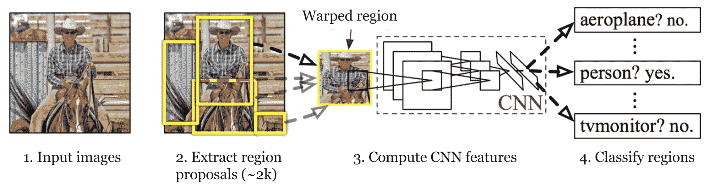

图 1. R-CNN 的架构。（图片来源：[Girshick 等人，2014](https://arxiv.org/abs/1311.2524)）

## 模型工作流程

R-CNN 的工作原理可以总结如下：

1.  **预训练**一个 CNN 网络用于图像分类任务；例如，在[ImageNet](http://image-net.org/index)数据集上训练的 VGG 或 ResNet。分类任务涉及 N 个类别。

> 注意：您可以在 Caffe 模型 [Zoo](https://github.com/caffe2/caffe2/wiki/Model-Zoo) 中找到一个预训练的 [AlexNet](https://github.com/BVLC/caffe/tree/master/models/bvlc_alexnet)。我不认为您可以在 Tensorflow 中找到它，但是 Tensorflow-slim 模型 [library](https://github.com/tensorflow/models/tree/master/research/slim) 提供了预训练的 ResNet、VGG 等模型。

1.  通过选择性搜索提出独立于类别的感兴趣区域（每个图像约 2k 个候选区域）。这些区域可能包含目标对象，它们的大小不同。

1.  区域候选区域被**扭曲**以满足 CNN 所需的固定大小。

1.  继续在扭曲的提议区域上对 CNN 进行 K + 1 类的微调；额外的一个类指的是背景（没有感兴趣的对象）。在微调阶段，我们应该使用更小的学习率，并且小批量过采样正例，因为大多数提议的区域只是背景。

1.  给定每个图像区域，CNN 通过一次前向传播生成一个特征向量。然后，这个特征向量被一个为**每个类别**独立训练的**二元 SVM**所使用。

    正样本是具有 IoU（交并比）重叠阈值 >= 0.3 的提出区域，负样本是无关的其他区域。

1.  为了减少本地化错误，使用 CNN 特征训练回归模型来校正预测的检测窗口在边界框校正偏移上的错误。

## 边界框回归

给定一个预测的边界框坐标 $\mathbf{p} = (p_x, p_y, p_w, p_h)$（中心坐标、宽度、高度）及其对应的真实框坐标 $\mathbf{g} = (g_x, g_y, g_w, g_h)$，回归器被配置为学习两个中心之间的尺度不变变换和宽度和高度之间的对数尺度变换。所有的变换函数以 $\mathbf{p}$ 为输入。

$$ \begin{aligned} \hat{g}_x &= p_w d_x(\mathbf{p}) + p_x \\ \hat{g}_y &= p_h d_y(\mathbf{p}) + p_y \\ \hat{g}_w &= p_w \exp({d_w(\mathbf{p})}) \\ \hat{g}_h &= p_h \exp({d_h(\mathbf{p})}) \end{aligned} $$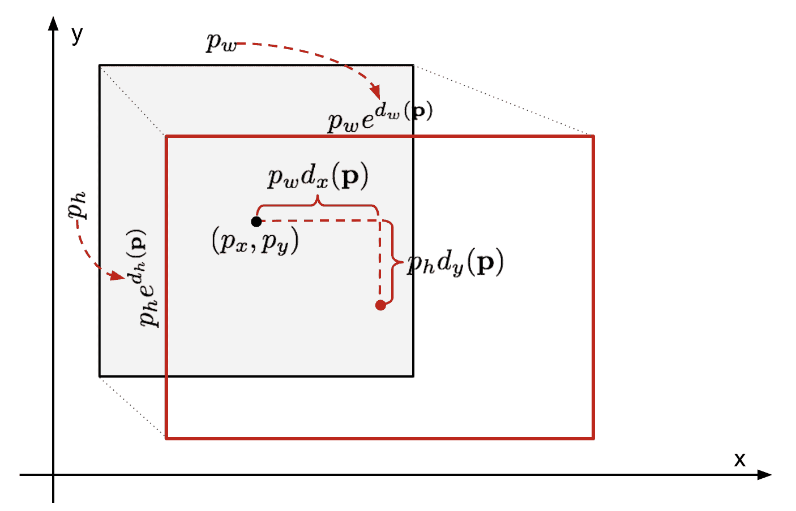

图 2\. 预测和真实边界框之间的变换示意图。

应用这种转换的明显好处是，所有边界框校正函数 $d_i(\mathbf{p})$（其中 $i \in \{ x, y, w, h \}$）可以取任何值在 [-∞, +∞] 之间。它们学习的目标是：

$$ \begin{aligned} t_x &= (g_x - p_x) / p_w \\ t_y &= (g_y - p_y) / p_h \\ t_w &= \log(g_w/p_w) \\ t_h &= \log(g_h/p_h) \end{aligned} $$

一个标准的回归模型可以通过最小化带有正则化的 SSE 损失来解决问题：

$$ \mathcal{L}_\text{reg} = \sum_{i \in \{x, y, w, h\}} (t_i - d_i(\mathbf{p}))² + \lambda \|\mathbf{w}\|² $$

正则化项在这里至关重要，RCNN 论文通过交叉验证选择了最佳λ。值得注意的是，并非所有预测的边界框都有相应的真实边界框。例如，如果没有重叠，运行 bbox 回归就没有意义。在这里，只有与至少 0.6 IoU 的附近真实边界框相匹配的预测边界框才会被保留用于训练 bbox 回归模型。

## 常见技巧

在 RCNN 和其他检测模型中通常使用几种技巧。

**非极大值抑制**

模型可能能够为同一对象找到多个边界框。非极大值抑制有助于避免重复检测同一实例。在我们为同一对象类别获得一组匹配的边界框之后：按置信度分数对所有边界框进行排序。丢弃置信度较低的边界框。*当*还有剩余边界框时，重复以下步骤：贪婪地选择得分最高的边界框。跳过与先前选择的边界框具有高 IoU（即> 0.5）的剩余边界框。

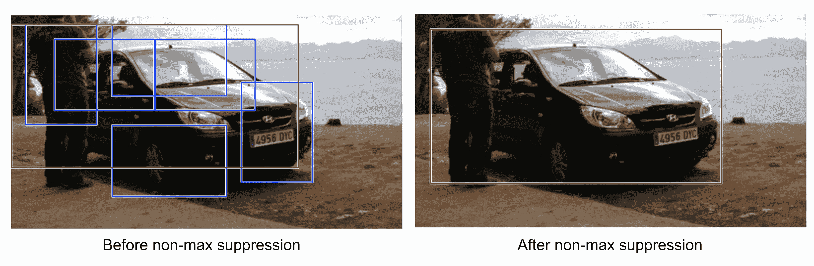

图 3. 图像中检测到汽车的多个边界框。经过非极大值抑制后，只有最佳结果保留，其余被忽略，因为它们与选定的边界框有很大的重叠。（图片来源：[DPM paper](http://lear.inrialpes.fr/~oneata/reading_group/dpm.pdf)）

**难负例挖掘**

我们将没有对象的边界框视为负例。并非所有负例都同样难以识别。例如，如果它只包含纯空白背景，则很可能是“*易负例*”；但如果边界框包含奇怪的嘈杂纹理或部分对象，则可能难以识别，这些是“*难负例*”。

难负例很容易被错误分类。我们可以在训练循环中明确找到这些误分类的假阳性样本，并将它们包含在训练数据中，以改进分类器。

## 速度瓶颈

通过查看 R-CNN 学习步骤，您可以轻松发现训练 R-CNN 模型是昂贵且缓慢的，因为以下步骤涉及大量工作：

+   运行选择性搜索为每个图像提出 2000 个区域候选项；

+   为每个图像区域生成 CNN 特征向量（N 个图像 * 2000）。

+   整个过程涉及三个模型分别进行，没有太多共享计算：用于图像分类和特征提取的卷积神经网络；用于识别目标对象的顶部 SVM 分类器；以及用于收紧区域边界框的回归模型。

# 快速 R-CNN

为了加快 R-CNN 的速度，Girshick（[2015](https://arxiv.org/pdf/1504.08083.pdf)）通过将三个独立模型统一到一个联合训练框架中并增加共享计算结果来改进训练过程，命名为**Fast R-CNN**。该模型不再独立提取每个区域提议的 CNN 特征向量，而是将它们聚合到整个图像的一个 CNN 前向传递中，区域提议共享这个特征矩阵。然后，相同的特征矩阵被分支出来用于学习对象分类器和边界框回归器。总之，共享计算加速了 R-CNN。

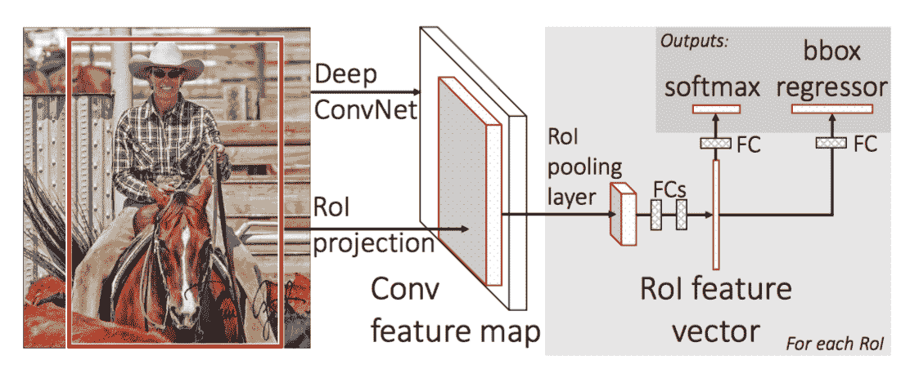

图 4\. Fast R-CNN 的架构。（图片来源：[Girshick, 2015](https://arxiv.org/pdf/1504.08083.pdf)）

## RoI 池化

这是一种最大池化，将图像的投影区域中的特征转换为一个小的固定窗口，H x W。输入区域被划分为 H x W 网格，大约每个大小为 h/H x w/W 的子窗口。然后在每个网格中应用最大池化。

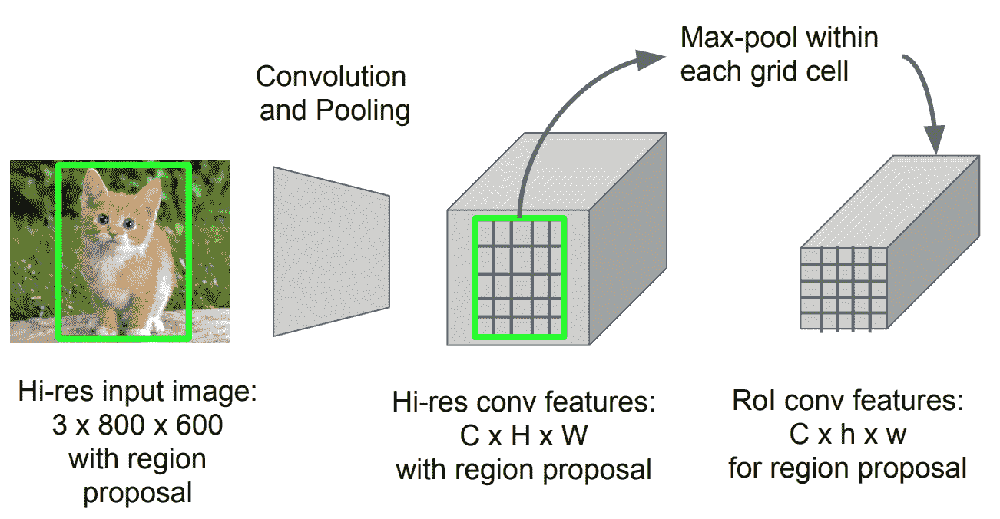

图 5\. RoI 池化（图片来源：[斯坦福 CS231n 幻灯片](http://cs231n.stanford.edu/slides/2016/winter1516_lecture8.pdf)）

## 模型工作流程

Fast R-CNN 的工作原理总结如下；许多步骤与 R-CNN 中相同：

1.  首先，在图像分类任务上对卷积神经网络进行预训练。

1.  通过选择性搜索提出区域（每个图像约 2k 个候选区域）。

1.  修改预训练的 CNN：

    +   用 RoI 池化 层替换预训练 CNN 的最后一个最大池化层。RoI 池化层输出区域提议的固定长度特征向量。共享 CNN 计算是有意义的，因为同一图像的许多区域提议高度重叠。

    +   用全连接层和 K + 1 类别的 softmax 替换最后一个全连接层和最后一个 softmax 层（K 类别）。

1.  最终模型分为两个输出层：

    +   一个 K + 1 类别的 softmax 估计器（与 R-CNN 中相同，+1 是“背景”类别），为每个 RoI 输出一个离散概率分布。

    +   一个边界框回归模型，为每个 K 类别预测相对于原始 RoI 的偏移量。

## 损失函数

该模型针对结合两个任务（分类 + 定位）的损失进行优化：

| **符号** | **解释** | | $u$ | 真实类别标签，$ u \in 0, 1, \dots, K$；按照惯例，全面背景类别为 $u = 0$。 | | $p$ | K + 1 类别的离散概率分布（每个 RoI）：$p = (p_0, \dots, p_K)$，通过全连接层的 K + 1 输出进行 softmax 计算。 | | $v$ | 真实边界框 $ v = (v_x, v_y, v_w, v_h) $。 | | $t^u$ | 预测的边界框修正，$t^u = (t^u_x, t^u_y, t^u_w, t^u_h)$。参见上文。 | {:.info}

损失函数将分类成本和边界框预测成本相加：$\mathcal{L} = \mathcal{L}_\text{cls} + \mathcal{L}_\text{box}$。对于“背景”RoI，$\mathcal{L}_\text{box}$会被指示函数$\mathbb{1} [u \geq 1]$忽略，定义如下：

$$ \mathbb{1} [u >= 1] = \begin{cases} 1 & \text{if } u \geq 1\\ 0 & \text{otherwise} \end{cases} $$

整体损失函数为：

$$ \begin{align*} \mathcal{L}(p, u, t^u, v) &= \mathcal{L}_\text{cls} (p, u) + \mathbb{1} [u \geq 1] \mathcal{L}_\text{box}(t^u, v) \\ \mathcal{L}_\text{cls}(p, u) &= -\log p_u \\ \mathcal{L}_\text{box}(t^u, v) &= \sum_{i \in \{x, y, w, h\}} L_1^\text{smooth} (t^u_i - v_i) \end{align*} $$

边界框损失$\mathcal{L}_{box}$应该使用**鲁棒**损失函数来衡量$t^u_i$和$v_i$之间的差异。这里采用了[smooth L1 loss](https://github.com/rbgirshick/py-faster-rcnn/files/764206/SmoothL1Loss.1.pdf)，据称对异常值不太敏感。

$$ L_1^\text{smooth}(x) = \begin{cases} 0.5 x² & \text{if } \vert x \vert < 1\\ \vert x \vert - 0.5 & \text{otherwise} \end{cases} $$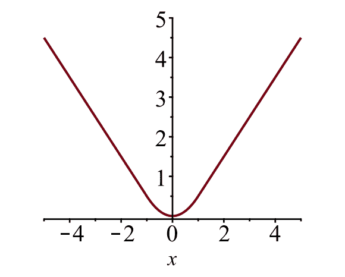

图 6。平滑 L1 损失的绘图，$y = L\_1^\text{smooth}(x)$。（图片来源：[link](https://github.com/rbgirshick/py-faster-rcnn/files/764206/SmoothL1Loss.1.pdf)）

## 速度瓶颈

Fast R-CNN 在训练和测试时间上都快得多。然而，改进并不是很显著，因为区域建议是由另一个模型单独生成的，这是非常昂贵的。

# Faster R-CNN

一个直观的加速解决方案是将区域建议算法集成到 CNN 模型中。**Faster R-CNN**（[Ren et al., 2016](https://arxiv.org/pdf/1506.01497.pdf)）正是这样做的：构建一个由 RPN（区域建议网络）和 fast R-CNN 组成的单一统一模型，共享卷积特征层。

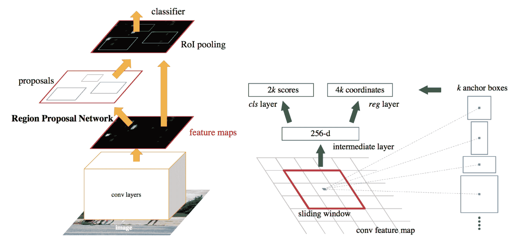

图 7。Faster R-CNN 模型示意图。（图片来源：[Ren et al., 2016](https://arxiv.org/pdf/1506.01497.pdf)）

## 模型工作流程

1.  在图像分类任务上预训练 CNN 网络。

1.  对区域建议任务端到端微调 RPN（区域建议网络），该任务由预训练图像分类器初始化。正样本的 IoU（交并比）> 0.7，而负样本的 IoU < 0.3。

    +   在整个图像的卷积特征图上滑动一个小的 n x n 空间窗口。

    +   在每个滑动窗口的中心，我们同时预测多个不同尺度和比例的区域。一个锚点是（滑动窗口中心，尺度，比例）的组合。例如，3 个尺度 + 3 个比例 => 每个滑动位置有 k=9 个锚点。

1.  使用当前 RPN 生成的建议训练 Fast R-CNN 目标检测模型

1.  然后使用 Fast R-CNN 网络初始化 RPN 训练。保持共享的卷积层，只微调 RPN 特定的层。在这个阶段，RPN 和检测网络共享卷积层！

1.  最后微调 Fast R-CNN 的唯一层

1.  如果需要，步骤 4-5 可以重复训练 RPN 和 Fast R-CNN。

## 损失函数

Faster R-CNN 针对多任务损失函数进行了优化，类似于 Fast R-CNN。

| **符号** | **解释** | | $p_i$ | 预测锚点 i 是对象的概率。 | | $p^*_i$ | 锚点 i 是否为对象的基本真值标签（二元）。 | | $t_i$ | 预测的四个参数化坐标。 | | $t^*_i$ | 基本真值坐标。 | | $N_\text{cls}$ | 规范化项，设为论文中的小批量大小（~256）。 | | $N_\text{box}$ | 规范化项，设为锚点位置数量（~2400）。 | | $\lambda$ | 平衡参数，设为论文中的 ~10（使得 $\mathcal{L}_\text{cls}$ 和 $\mathcal{L}_\text{box}$ 项大致等权）。 | {:.info}

多任务损失函数结合了分类和边界框回归的损失：

$$ \begin{align*} \mathcal{L} &= \mathcal{L}_\text{cls} + \mathcal{L}_\text{box} \\ \mathcal{L}(\{p_i\}, \{t_i\}) &= \frac{1}{N_\text{cls}} \sum_i \mathcal{L}_\text{cls} (p_i, p^*_i) + \frac{\lambda}{N_\text{box}} \sum_i p^*_i \cdot L_1^\text{smooth}(t_i - t^*_i) \\ \end{align*} $$

其中 $\mathcal{L}_\text{cls}$ 是两类之间的对数损失函数，我们可以通过将多类分类简单地转换为二元分类来预测样本是目标对象还是非目标对象。$L_1^\text{smooth}$ 是平滑的 L1 损失。

$$ \mathcal{L}_\text{cls} (p_i, p^*_i) = - p^*_i \log p_i - (1 - p^*_i) \log (1 - p_i) $$

# Mask R-CNN

Mask R-CNN（[He et al., 2017](https://arxiv.org/pdf/1703.06870.pdf)）将 Faster R-CNN 扩展到像素级[图像分割](https://lilianweng.github.io/posts/2017-10-29-object-recognition-part-1/#image-segmentation-felzenszwalbs-algorithm)。关键点在于将分类和像素级掩模预测任务解耦。基于 Faster R-CNN 框架，它添加了一个第三分支，用于预测对象掩模，与用于分类和定位的现有分支并行。掩模分支是一个小型全连接网络，应用于每个 RoI，以像素到像素的方式预测分割掩模。

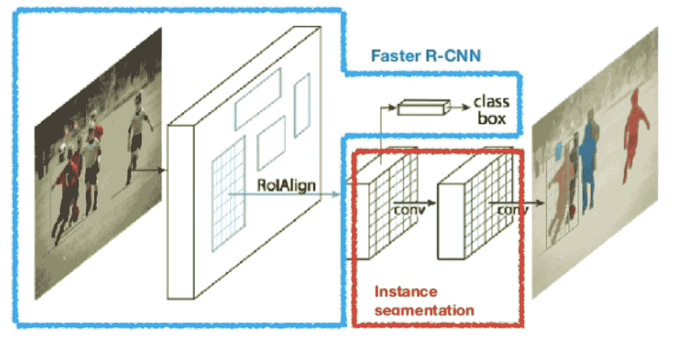

图 8\. Mask R-CNN 是带有图像分割的 Faster R-CNN 模型。（图片来源：[He et al., 2017](https://arxiv.org/pdf/1703.06870.pdf)）

因为像素级分割需要比边界框更精细的对齐，Mask R-CNN 改进了 RoI 池化层（称为“RoIAlign 层”），使得 RoI 能够更好地、更精确地映射到原始图像的区域。

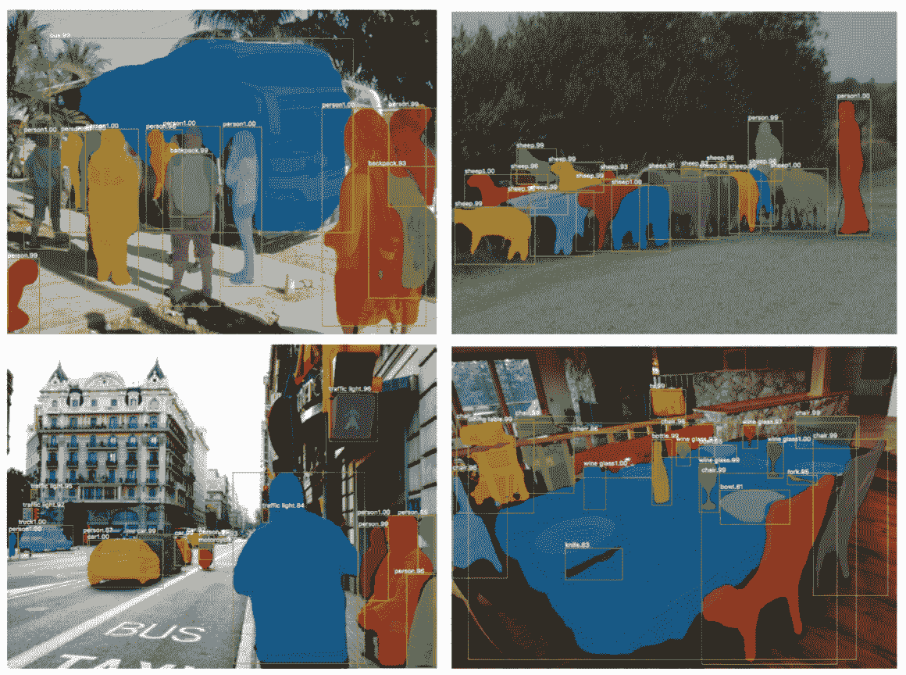

图 9. Mask R-CNN 在 COCO 测试集上的预测。（图片来源：[He 等人，2017](https://arxiv.org/pdf/1703.06870.pdf)）

## RoIAlign

RoIAlign 层旨在修复 RoI 池化中由量化引起的位置不对齐。RoIAlign 消除了哈希量化，例如，通过使用 x/16 而不是[x/16]，以便提取的特征可以与输入像素正确对齐。用于计算输入中浮点位置值的双线性插值。

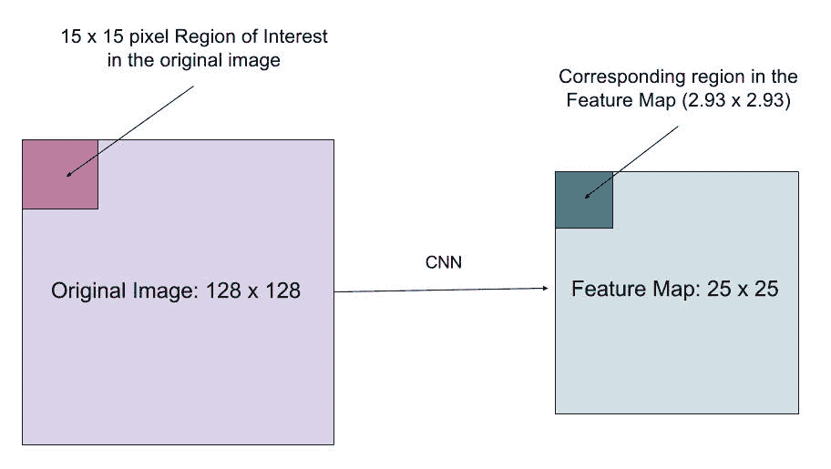

图 10. 一个感兴趣区域从原始图像精确映射到特征图，而不是四舍五入到整数。（图片来源：[链接](https://blog.athelas.com/a-brief-history-of-cnns-in-image-segmentation-from-r-cnn-to-mask-r-cnn-34ea83205de4)）

## 损失函数

Mask R-CNN 的多任务损失函数结合了分类、定位和分割掩模的损失：$ \mathcal{L} = \mathcal{L}_\text{cls} + \mathcal{L}_\text{box} + \mathcal{L}_\text{mask}$，其中 $\mathcal{L}_\text{cls}$ 和 $\mathcal{L}_\text{box}$ 与 Faster R-CNN 中的相同。

掩模分支为每个 RoI 和每个类别生成一个大小为 m x m 的掩模；总共有 K 个类别。因此，总输出大小为$K \cdot m²$。因为模型试图为每个类别学习一个掩模，所以没有类别之间为生成掩模而竞争。

$\mathcal{L}_\text{mask}$ 被定义为平均二元交叉熵损失，仅在区域与地面真实类别 k 相关联时才包括第 k 个掩模。

$$ \mathcal{L}_\text{mask} = - \frac{1}{m²} \sum_{1 \leq i, j \leq m} \big[ y_{ij} \log \hat{y}^k_{ij} + (1-y_{ij}) \log (1- \hat{y}^k_{ij}) \big] $$

其中 $y_{ij}$ 是大小为 m x m 的真实掩模中单元格(i, j)的标签；$\hat{y}_{ij}^k$ 是为地面真实类别 k 学习的掩模中相同单元格的预测值。

# R-CNN 家族模型总结

在这里，我展示了 R-CNN、Fast R-CNN、Faster R-CNN 和 Mask R-CNN 的模型设计。通过比较微小的差异，您可以追踪一个模型如何演变为下一个版本。

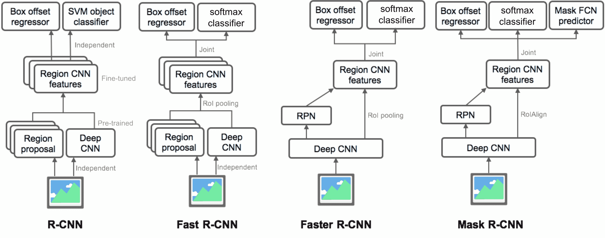

* * *

引用为：

```py
@article{weng2017detection3,
  title   = "Object Detection for Dummies Part 3: R-CNN Family",
  author  = "Weng, Lilian",
  journal = "lilianweng.github.io",
  year    = "2017",
  url     = "https://lilianweng.github.io/posts/2017-12-31-object-recognition-part-3/"
} 
```

# 参考文献

[1] Ross Girshick, Jeff Donahue, Trevor Darrell, and Jitendra Malik. [“准确目标检测和语义分割的丰富特征层次结构。”](https://www.cv-foundation.org/openaccess/content_cvpr_2014/papers/Girshick_Rich_Feature_Hierarchies_2014_CVPR_paper.pdf) 在 IEEE 计算机视觉与模式识别会议（CVPR）论文集中，第 580-587 页。2014 年。

[2] Ross Girshick. [“Fast R-CNN。”](https://arxiv.org/pdf/1504.08083.pdf) 在 IEEE 国际计算机视觉会议论文集中，第 1440-1448 页。2015 年。

[3] Shaoqing Ren, Kaiming He, Ross Girshick 和 Jian Sun. [“Faster R-CNN: Towards real-time object detection with region proposal networks.”](http://papers.nips.cc/paper/5638-faster-r-cnn-towards-real-time-object-detection-with-region-proposal-networks.pdf) 在神经信息处理系统 (NIPS) 进展中，第 91-99 页。2015.

[4] Kaiming He, Georgia Gkioxari, Piotr Dollár 和 Ross Girshick. [“Mask R-CNN.”](https://arxiv.org/pdf/1703.06870.pdf) arXiv 预印本 arXiv:1703.06870, 2017.

[5] Joseph Redmon, Santosh Divvala, Ross Girshick 和 Ali Farhadi. [“You only look once: Unified, real-time object detection.”](https://www.cv-foundation.org/openaccess/content_cvpr_2016/papers/Redmon_You_Only_Look_CVPR_2016_paper.pdf) 在 IEEE 计算机视觉与模式识别 (CVPR) 会议论文集中，第 779-788 页。2016.

[6] [“卷积神经网络在图像分割中的简要历史：从 R-CNN 到 Mask R-CNN”](https://blog.athelas.com/a-brief-history-of-cnns-in-image-segmentation-from-r-cnn-to-mask-r-cnn-34ea83205de4) 作者 Athelas.

[7] 平滑 L1 损失：[`github.com/rbgirshick/py-faster-rcnn/files/764206/SmoothL1Loss.1.pdf`](https://github.com/rbgirshick/py-faster-rcnn/files/764206/SmoothL1Loss.1.pdf)
