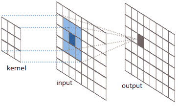
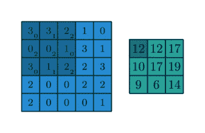
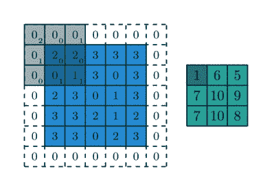
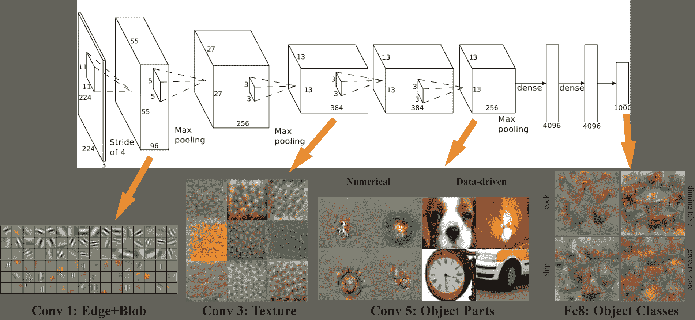
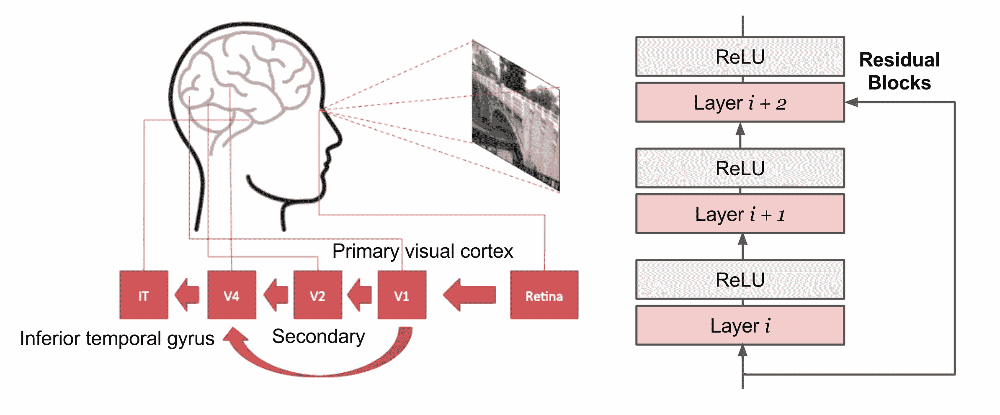
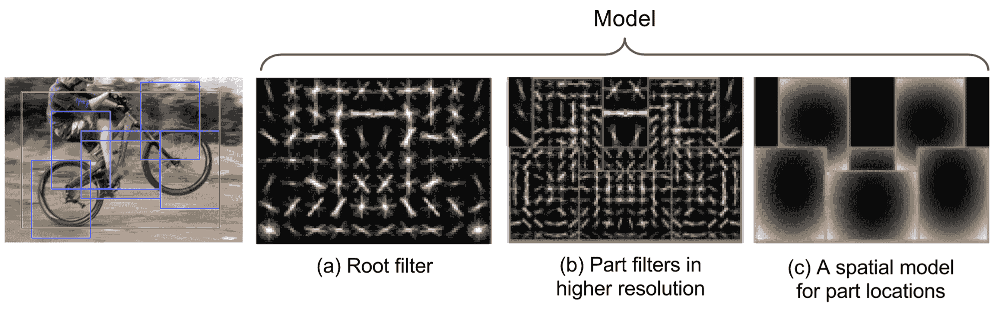
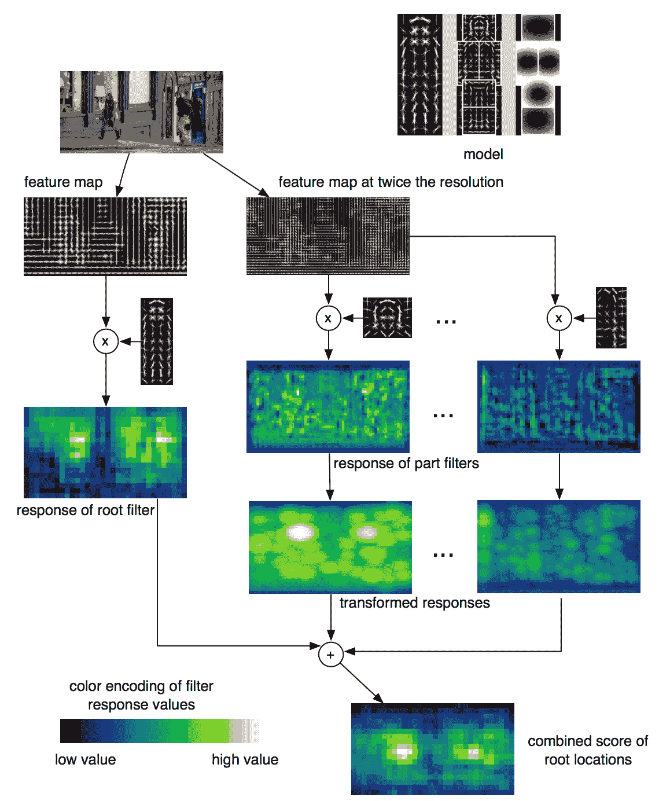
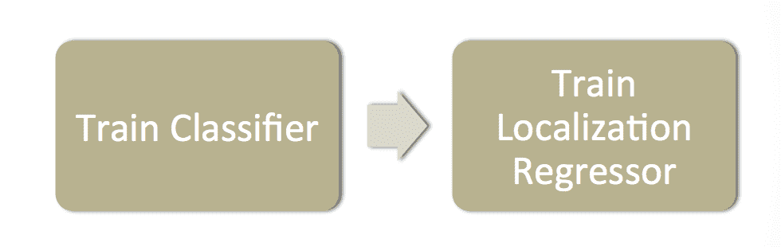

# 对于小白的目标检测第二部分：CNN，DPM 和 Overfeat

> 原文：[`lilianweng.github.io/posts/2017-12-15-object-recognition-part-2/`](https://lilianweng.github.io/posts/2017-12-15-object-recognition-part-2/)

[“小白的目标检测”系列的第一部分](https://lilianweng.github.io/posts/2017-10-29-object-recognition-part-1/)介绍了：（1）图像梯度向量的概念以及 HOG 算法如何总结一幅图像中所有梯度向量的信息；（2）图像分割算法如何检测潜在包含对象的区域；（3）选择性搜索算法如何优化图像分割的结果以获得更好的区域提议。

在第二部分，我们将更深入地了解经典卷积神经网络架构用于图像分类。它们为进一步发展目标检测的深度学习模型奠定了***基础***。如果想了解更多关于 R-CNN 和相关模型的内容，请查看[第三部分](https://lilianweng.github.io/posts/2017-12-31-object-recognition-part-3/)。

系列中所有帖子的链接：[[第一部分](https://lilianweng.github.io/posts/2017-10-29-object-recognition-part-1/)] [[第二部分](https://lilianweng.github.io/posts/2017-12-15-object-recognition-part-2/)] [[第三部分](https://lilianweng.github.io/posts/2017-12-31-object-recognition-part-3/)] [[第四部分](https://lilianweng.github.io/posts/2018-12-27-object-recognition-part-4/)]。

# 图像分类的 CNN

CNN，即“**卷积神经网络**”，是深度学习领域中处理计算机视觉问题的首选解决方案。在某种程度上，它受到了人类视觉皮层系统运作方式的[启发](https://lilianweng.github.io/posts/2017-06-21-overview/#convolutional-neural-network)。

## 卷积操作

我强烈推荐这篇[指南](https://arxiv.org/pdf/1603.07285.pdf)来学习卷积算术，它提供了清晰而扎实的解释，配有大量可视化和示例。在本文中，让我们专注于二维卷积，因为我们处理的是图像。

简而言之，卷积操作将预定义的[核](https://en.wikipedia.org/wiki/Kernel_(image_processing))（也称为“滤波器”）滑动在输入特征图（图像像素矩阵）上，将核和部分输入特征的值相乘相加以生成输出。这些值形成一个输出矩阵，通常情况下，核远小于输入图像。



图 1\. 展示了在输入特征图上应用核以生成输出的示意图。（图片来源：[River Trail documentation](http://intellabs.github.io/RiverTrail/tutorial/)）

图 2 展示了如何通过在一个 5x5 的二维数值矩阵上卷积一个 3x3 的核来生成一个 3x3 的矩阵的两个真实示例。通过控制填充大小和步长，我们可以生成特定大小的输出矩阵。

 

图 2\. 2D 卷积操作的两个示例：（顶部）无填充和 1x1 步幅；（底部）1x1 边界零填充和 2x2 步幅。（图片来源：[deeplearning.net](http://deeplearning.net/software/theano_versions/dev/tutorial/conv_arithmetic.html)）

## AlexNet（Krizhevsky 等人，2012）

+   5 个卷积[+可选最大池化]层 + 2 个 MLP 层 + 1 个 LR 层

+   使用数据增强技术扩展训练数据集，如图像平移、水平反射和补丁提取。



图 3\. AlexNet 的架构。（图片来源：[link](http://vision03.csail.mit.edu/cnn_art/index.html)）

## VGG（Simonyan 和 Zisserman，2014）

+   该网络在当时被认为是“非常深”的；19 层

+   该架构非常简化，只有 3x3 卷积层和 2x2 池化层。小滤波器的堆叠模拟了具有更少参数的大滤波器。

## ResNet（He 等人，2015）

+   网络确实非常深；152 层简单的架构。

+   **残差块**：某一层的某些输入可以传递到两层后的组件。残差块对于保持深度网络可训练并最终起作用至关重要。没有残差块，普通网络的训练损失随着层数增加不会单调递减，这是由于[梯度消失和梯度爆炸](http://www.wildml.com/2015/10/recurrent-neural-networks-tutorial-part-3-backpropagation-through-time-and-vanishing-gradients/)。



图 4\. ResNet 的残差块示意图。在某种程度上，我们可以说残差块的设计受到了人类视觉皮层系统中 V1 直接从 V1 获取输入的启发。（左图来源：[Wang 等人，2017](https://arxiv.org/pdf/1312.6229.pdf)）

# 评估指标：mAP

许多目标识别和检测任务中使用的常见评估指标是“**mAP**”，即“**平均精度均值**”。它是一个从 0 到 100 的数字；数值越高越好。

+   将所有测试图像中的所有检测结果组合在一起，为每个类别绘制一个精度-召回曲线（PR 曲线）；“平均精度”（AP）是 PR 曲线下的面积。

+   鉴于目标对象属于不同类别，我们首先分别计算每个类别的 AP，然后对类别求平均。

+   如果检测结果与地面实况框的“交并比”（IoU）大于某个阈值（通常为 0.5），则检测结果为真阳性；如果是这样，指标为“mAP@0.5”。

# 可变部件模型

可变部件模型（DPM）（[Felzenszwalb 等人，2010](http://people.cs.uchicago.edu/~pff/papers/lsvm-pami.pdf)）使用可变部件的混合图模型（马尔可夫随机场）识别对象。该模型由三个主要组件组成：

1.  一个粗糙的***根滤波器***定义了一个大致覆盖整个对象的检测窗口。滤波器为区域特征向量指定权重。

1.  多个***部件滤波器***覆盖对象的较小部分。部件滤波器在根滤波器的两倍分辨率处学习。

1.  一个***空间模型***用于评分部件滤波器相对于根部的位置。



图 5。DPM 模型包含（a）一个根滤波器，（b）两倍分辨率的多个部件滤波器，以及（c）用于评分部件位置和变形的模型。

检测对象的质量由滤波器得分减去变形成本来衡量。通俗地说，匹配得分 $f$ 是：

$$ f(\text{model}, x) = f(\beta_\text{root}, x) + \sum_{\beta_\text{part} \in \text{part filters}} \max_y [f(\beta_\text{part}, y) - \text{cost}(\beta_\text{part}, x, y)] $$

其中，

+   $x$ 是一个具有指定位置和比例的图像；

+   $y$ 是 $x$ 的一个子区域。

+   $\beta_\text{root}$ 是根滤波器。

+   $\beta_\text{part}$ 是一个部件滤波器。

+   cost() 衡量部件偏离其理想位置相对于根部的惩罚。

基本得分模型是滤波器 $\beta$ 与区域特征向量 $\Phi(x)$ 的点积：$f(\beta, x) = \beta \cdot \Phi(x)$。特征集 $\Phi(x)$ 可以由 HOG 或其他类似算法定义。

具有高得分的根位置检测到具有高概率包含对象的区域，而具有高得分的部件位置确认了一个识别对象的假设。该论文采用潜在 SVM 来建模分类器。



图 6。DPM 的匹配过程。（图片来源：[Felzenszwalb et al., 2010](http://people.cs.uchicago.edu/~pff/papers/lsvm-pami.pdf)）

作者后来声称，DPM 和 CNN 模型并不是目标识别的两种不同方法。相反，可以通过展开 DPM 推理算法并将每个步骤映射到等效的 CNN 层来将 DPM 模型构建为 CNN。（查看[Girshick et al., 2015](https://www.cv-foundation.org/openaccess/content_cvpr_2015/papers/Girshick_Deformable_Part_Models_2015_CVPR_paper.pdf)中的详细信息！）

# Overfeat

Overfeat [[paper](https://pdfs.semanticscholar.org/f2c2/fbc35d0541571f54790851de9fcd1adde085.pdf)][[code](https://github.com/sermanet/OverFeat)] 是将目标检测、定位和分类任务集成到一个卷积神经网络中的先驱模型。其主要思想是（i）以滑动窗口方式在图像的多个尺度区域上进行不同位置的图像分类，以及（ii）通过在相同卷积层之上训练的回归器预测边界框位置。

Overfeat 模型架构与 AlexNet 非常相似。它的训练如下：



图 7\. Overfeat 模型的训练阶段。（图片来源：[链接](http://vision.stanford.edu/teaching/cs231b_spring1415/slides/overfeat_eric.pdf)）

1.  在图像分类任务上训练一个 CNN 模型（类似于 AlexNet）。

1.  然后，我们通过一个回归网络替换顶部分类器层，并训练它以预测每个空间位置和尺度的对象边界框。回归器是特定于类别的，为每个图像类别生成一个。

    +   输入：带有分类和边界框的图像。

    +   输出：$(x_\text{left}, x_\text{right}, y_\text{top}, y_\text{bottom})$，总共 4 个值，表示边界框边缘的坐标。

    +   损失：回归器经过训练，以最小化每个训练示例的生成边界框与实际情况之间的 $l2$ 范数。

在检测时，

1.  使用预训练的 CNN 模型在每个位置执行分类。

1.  预测分类器生成的所有分类区域上的对象边界框。

1.  合并来自定位的具有足够重叠的边界框和来自分类器的足够置信度的相同对象。

* * *

引用为：

```py
@article{weng2017detection2,
  title   = "Object Detection for Dummies Part 2: CNN, DPM and Overfeat",
  author  = "Weng, Lilian",
  journal = "lilianweng.github.io",
  year    = "2017",
  url     = "https://lilianweng.github.io/posts/2017-12-15-object-recognition-part-2/"
} 
```

# 参考文献

[1] Vincent Dumoulin 和 Francesco Visin. [“深度学习中的卷积算术指南。”](https://arxiv.org/pdf/1603.07285.pdf) arXiv 预印本 arXiv:1603.07285（2016）。

[2] Haohan Wang、Bhiksha Raj 和 Eric P. Xing。[“深度学习的起源。”](https://arxiv.org/pdf/1702.07800.pdf) arXiv 预印本 arXiv:1702.07800（2017）。

[3] Pedro F. Felzenszwalb, Ross B. Girshick, David McAllester 和 Deva Ramanan。[“使用经过区分训练的基于部件的模型进行目标检测。”](http://people.cs.uchicago.edu/~pff/papers/lsvm-pami.pdf) IEEE 模式分析与机器智能交易 32，第 9 期（2010）：1627-1645。

[4] Ross B. Girshick, Forrest Iandola, Trevor Darrell 和 Jitendra Malik。[“可变形部件模型是卷积神经网络。”](https://www.cv-foundation.org/openaccess/content_cvpr_2015/papers/Girshick_Deformable_Part_Models_2015_CVPR_paper.pdf) 在 IEEE 计算机视觉与模式识别（CVPR）会议论文集中，第 437-446 页。2015 年。

[5] Sermanet, Pierre, David Eigen, Xiang Zhang, Michaël Mathieu, Rob Fergus 和 Yann LeCun。[“OverFeat：使用卷积网络进行集成识别、定位和检测”](https://pdfs.semanticscholar.org/f2c2/fbc35d0541571f54790851de9fcd1adde085.pdf) arXiv 预印本 arXiv:1312.6229（2013）。
