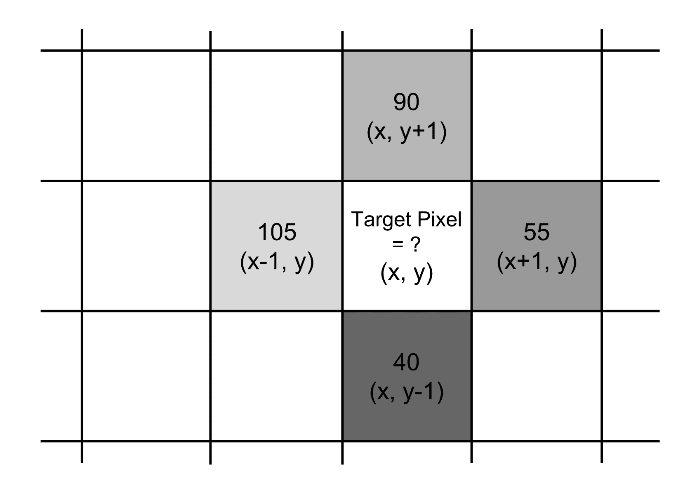
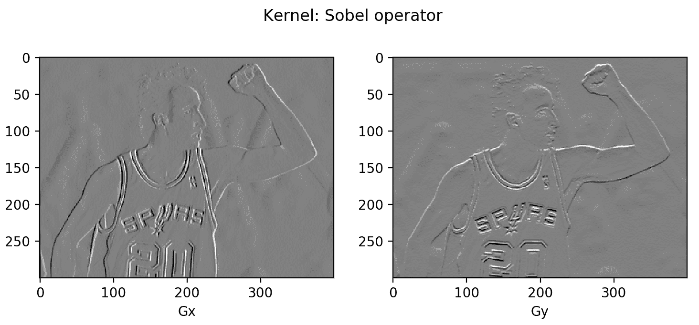
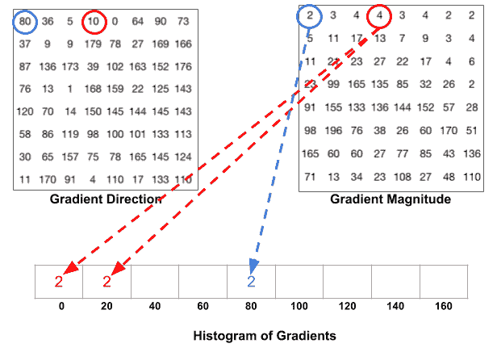
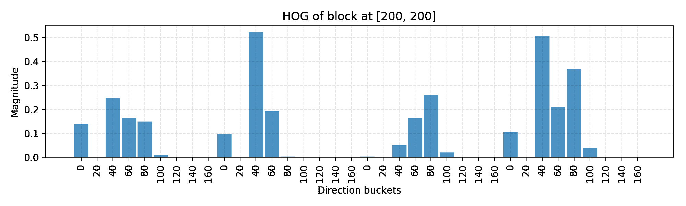
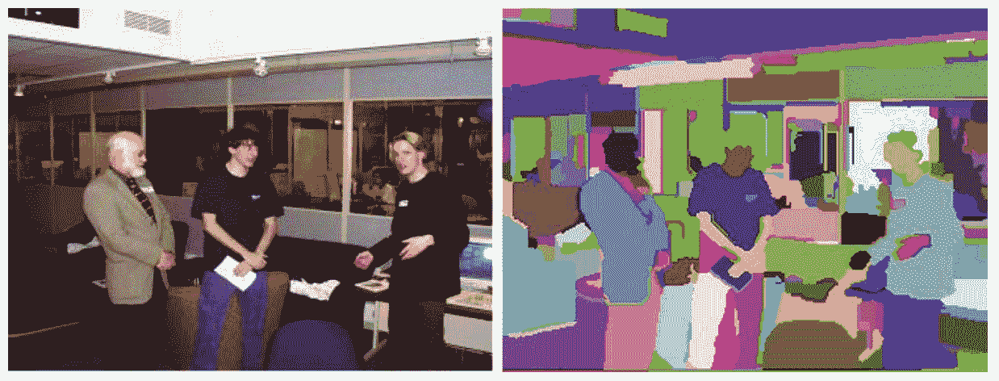
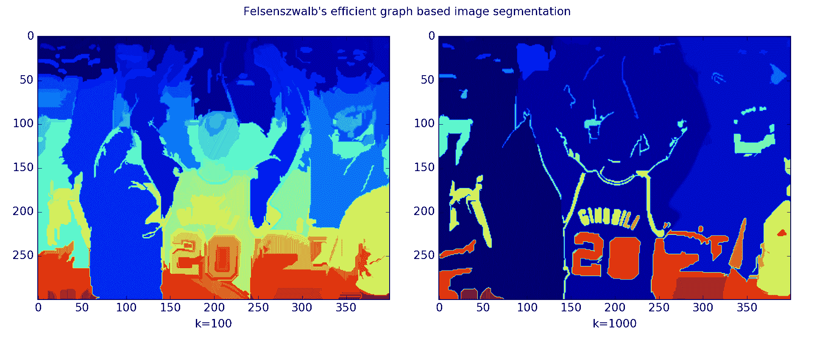
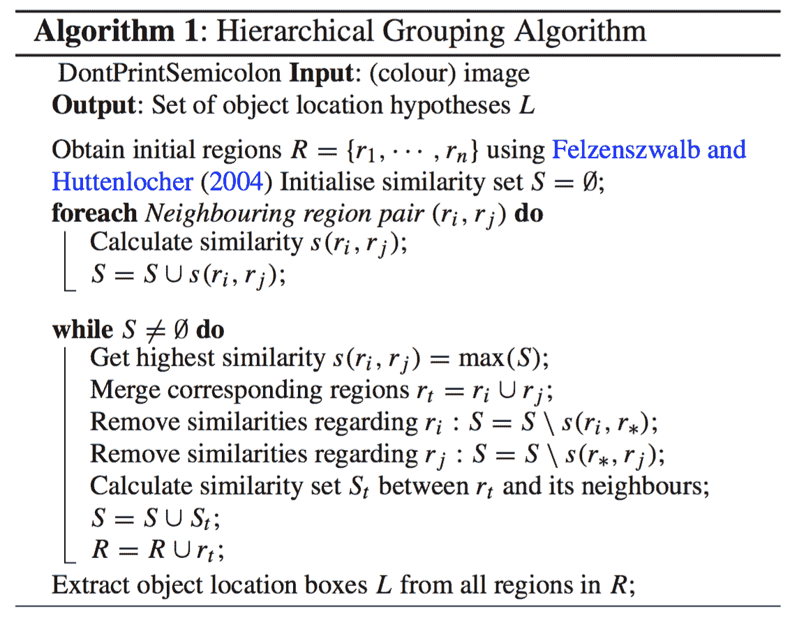

# 对象检测入门第 1 部分：梯度向量、HOG 和 SS

> 原文：[`lilianweng.github.io/posts/2017-10-29-object-recognition-part-1/`](https://lilianweng.github.io/posts/2017-10-29-object-recognition-part-1/)

我从未在计算机视觉领域工作过，也不知道当自动驾驶汽车被配置为区分停车标志和戴红帽的行人时，这种魔法是如何运作的。为了激励自己深入研究对象识别和检测算法背后的数学，我正在撰写一些关于这个主题“对象检测入门”的帖子。本文，第 1 部分，从图像处理中的超基础概念和一些图像分割方法开始。暂时不涉及深度神经网络。对象检测和识别的深度学习模型将在[第 2 部分](https://lilianweng.github.io/posts/2017-12-15-object-recognition-part-2/)和[第 3 部分](https://lilianweng.github.io/posts/2017-12-31-object-recognition-part-3/)中讨论。

> 免责声明：当我开始时，我将“对象识别”和“对象检测”互换使用。我认为它们并不相同：前者更多地是告诉一个图像中是否存在对象，而后者需要找出对象的位置。然而，它们高度相关，许多对象识别算法为检测奠定了基础。

系列中所有帖子的链接：[[第 1 部分](https://lilianweng.github.io/posts/2017-10-29-object-recognition-part-1/)] [[第 2 部分](https://lilianweng.github.io/posts/2017-12-15-object-recognition-part-2/)] [[第 3 部分](https://lilianweng.github.io/posts/2017-12-31-object-recognition-part-3/)] [[第 4 部分](https://lilianweng.github.io/posts/2018-12-27-object-recognition-part-4/)]。

# 图像梯度向量

首先，我想确保我们能区分以下术语。它们非常相似，密切相关，但并非完全相同。

|  | **导数** | **方向导数** | **梯度** |
| --- | --- | --- | --- |
| 值类型 | 标量 | 标量 | 向量 |
| 定义 | 函数$f(x,y,z,…)$在点$(x_0,y_0,z_0,…)$处的变化率，即该点切线的斜率。 | $f(x,y,z, …)$在单位向量$\vec{u}$方向的瞬时变化率。 | 它指向函数增长速度最快的方向，包含多变量函数的所有偏导数信息。 |

在图像处理中，我们想要知道颜色从一个极端变化到另一个极端的方向（即在灰度图像上从黑到白）。因此，我们想要测量像素颜色上的“梯度”。图像上的梯度是离散的，因为每个像素是独立的，无法进一步分割。

[图像梯度向量](https://en.wikipedia.org/wiki/Image_gradient)被定义为每个单独像素的度量，包含 x 轴和 y 轴上的像素颜色变化。该定义与连续多变量函数的梯度一致，这是所有变量的偏导数向量。假设 f(x, y)记录位置(x, y)处像素的颜色，则像素(x, y)的梯度向量定义如下：

$$ \begin{align*} \nabla f(x, y) = \begin{bmatrix} g_x \\ g_y \end{bmatrix} = \begin{bmatrix} \frac{\partial f}{\partial x} \\[6pt] \frac{\partial f}{\partial y} \end{bmatrix} = \begin{bmatrix} f(x+1, y) - f(x-1, y)\\ f(x, y+1) - f(x, y-1) \end{bmatrix} \end{align*} $$

$\frac{\partial f}{\partial x}$项是 x 方向的偏导数，计算为目标左右相邻像素的颜色差异，f(x+1, y) - f(x-1, y)。类似地，$\frac{\partial f}{\partial y}$项是 y 方向的偏导数，测量为 f(x, y+1) - f(x, y-1)，目标上下相邻像素的颜色差异。

图像梯度有两个重要属性：

+   **幅度**是向量的 L2 范数，$g = \sqrt{ g_x² + g_y² }$。

+   **方向**是两个方向上偏导数比率的反正切，$\theta = \arctan{(g_y / g_x)}$。



图 1。要计算目标像素在位置(x, y)处的梯度向量，我们需要知道其四个邻居的颜色（或者根据核心的不同，可能是周围八个像素）。

图 1 中示例的梯度向量是：

$$ \begin{align*} \nabla f = \begin{bmatrix} f(x+1, y) - f(x-1, y)\\ f(x, y+1) - f(x, y-1) \end{bmatrix} = \begin{bmatrix} 55-105\\ 90-40 \end{bmatrix} = \begin{bmatrix} -50\\ 50 \end{bmatrix} \end{align*} $$

因此，

+   幅度为$\sqrt{50² + (-50)²} = 70.7107$，以及

+   方向为$\arctan{(-50/50)} = -45^{\circ}$。

对每个像素迭代地重复梯度计算过程太慢了。相反，可以很好地转化为在整个图像矩阵$\mathbf{A}$上应用卷积运算符，使用其中一个特别设计的卷积核。

让我们从图 1 中的 x 方向开始，使用核$[-1,0,1]$沿 x 轴滑动；$\ast$是卷积运算符：

$$ \begin{align*} \mathbf{G}_x &= [-1, 0, 1] \ast [105, 255, 55] = -105 + 0 + 55 = -50 \end{align*} $$

类似地，在 y 方向上，我们采用核$[+1, 0, -1]^\top$：

$$ \begin{align*} \mathbf{G}_y &= [+1, 0, -1]^\top \ast \begin{bmatrix} 90\\ 255\\ 40 \end{bmatrix} = 90 + 0 - 40 = 50 \end{align*} $$

在 python 中尝试这个：

```py
import numpy as np import scipy.signal as sig data = np.array([[0, 105, 0], [40, 255, 90], [0, 55, 0]]) G_x = sig.convolve2d(data, np.array([[-1, 0, 1]]), mode='valid') G_y = sig.convolve2d(data, np.array([[-1], [0], [1]]), mode='valid') 
```

这两个函数分别返回`array([[0], [-50], [0]])`和`array([[0, 50, 0]])`。（请注意，在 numpy 数组表示中，90 显示在 40 之前，因此在核心中相应地列出-1 在 1 之前。）

## 常见图像处理卷积核

[普雷维特算子](https://en.wikipedia.org/wiki/Prewitt_operator)：普雷维特算子不仅依赖于四个直接相邻的像素，还利用周围八个像素以获得更平滑的结果。

$$ \mathbf{G}_x = \begin{bmatrix} -1 & 0 & +1 \\ -1 & 0 & +1 \\ -1 & 0 & +1 \end{bmatrix} \ast \mathbf{A} \text{ and } \mathbf{G}_y = \begin{bmatrix} +1 & +1 & +1 \\ 0 & 0 & 0 \\ -1 & -1 & -1 \end{bmatrix} \ast \mathbf{A} $$

[Sobel 算子](https://en.wikipedia.org/wiki/Sobel_operator)：为了更强调直接相邻像素的影响，它们被赋予更高的权重。

$$ \mathbf{G}_x = \begin{bmatrix} -1 & 0 & +1 \\ -2 & 0 & +2 \\ -1 & 0 & +1 \end{bmatrix} \ast \mathbf{A} \text{ and } \mathbf{G}_y = \begin{bmatrix} +1 & +2 & +1 \\ 0 & 0 & 0 \\ -1 & -2 & -1 \end{bmatrix} \ast \mathbf{A} $$

不同的卷积核用于不同的目标，如边缘检测、模糊、锐化等。查看[此维基页面](https://en.wikipedia.org/wiki/Kernel_(image_processing))获取更多示例和参考资料。

## 示例：2004 年的 Manu

让我们对 2004 年 Manu Ginobili 的照片进行一个简单的实验[下载图片{:target="_blank"}]，当时他还有很多头发。为简单起见，照片首先转换为灰度。对于彩色图像，我们只需要分别在每个颜色通道中重复相同的过程。


图 2。2004 年的 Manu Ginobili 有头发。（图片来源：[Manu Ginobili's bald spot through the years](http://ftw.usatoday.com/2013/05/manu-ginobilis-bald-spot-through-the-years)）

```py
import numpy as np import scipy import scipy.signal as sig # With mode="L", we force the image to be parsed in the grayscale, so it is # actually unnecessary to convert the photo color beforehand. img = scipy.misc.imread("manu-2004.jpg", mode="L")   # Define the Sobel operator kernels. kernel_x = np.array([[-1, 0, 1],[-2, 0, 2],[-1, 0, 1]]) kernel_y = np.array([[1, 2, 1], [0, 0, 0], [-1, -2, -1]])   G_x = sig.convolve2d(img, kernel_x, mode='same') G_y = sig.convolve2d(img, kernel_y, mode='same')   # Plot them! fig = plt.figure() ax1 = fig.add_subplot(121) ax2 = fig.add_subplot(122)   # Actually plt.imshow() can handle the value scale well even if I don't do # the transformation (G_x + 255) / 2. ax1.imshow((G_x + 255) / 2, cmap='gray'); ax1.set_xlabel("Gx") ax2.imshow((G_y + 255) / 2, cmap='gray'); ax2.set_xlabel("Gy") plt.show() 
```



图 3。在示例图像上应用 Sobel 算子卷积核。

您可能会注意到大部分区域是灰色的。因为两个像素之间的差异在-255 和 255 之间，我们需要将它们转换回[0, 255]以供显示目的。一个简单的线性转换（$\mathbf{G}$ + 255）/2 会将所有的零（即，常色背景显示梯度无变化）解释为 125（显示为灰色）。

# 方向梯度直方图（HOG）

方向梯度直方图（HOG）是从像素颜色中提取特征以构建对象识别分类器的高效方法。通过了解图像梯度向量的知识，理解 HOG 的工作原理并不难。让我们开始吧！

## HOG 的工作原理

1.  预处理图像，包括调整大小和颜色归一化。

1.  计算每个像素的梯度向量、大小和方向。

1.  将图像分成许多 8x8 像素单元。在每个单元格中，这 64 个单元格的大小值被分组并累加到 9 个无符号方向的桶中（没有符号，因此是 0-180 度而不是 0-360 度；这是基于经验实验的实际选择）。

    为了更好的鲁棒性，如果像素的梯度向量的方向位于两个桶之间，其幅度不会全部分配给更接近的一个，而是在两者之间按比例分配。例如，如果像素的梯度向量幅度为 8，角度为 15 度，则它位于角度 0 和 20 之间的两个桶中，我们将分配 2 给桶 0，6 给桶 20。

    这种有趣的配置使得直方图在图像受到轻微扭曲时更加稳定。



图 4\. 如何分割一个梯度向量的幅度，如果其角度在两个角度区间之间。（图片来源：https://www.learnopencv.com/histogram-of-oriented-gradients/）

1.  然后我们在图像上滑动一个 2x2 单元格（因此是 16x16 像素）的块。在每个块区域内，4 个单元格的 4 个直方图被连接成一个 36 个值的一维向量，然后归一化为单位权重。最终的 HOG 特征向量是所有块向量的连接。它可以被输入到像 SVM 这样的分类器中，用于学习目标识别任务。

## 例如：2004 年的 Manu

让我们重复使用前一节中的相同示例图像。记住我们已经计算出整个图像的$\mathbf{G}_x$和$\mathbf{G}_y$。

```py
N_BUCKETS = 9 CELL_SIZE = 8  # Each cell is 8x8 pixels BLOCK_SIZE = 2  # Each block is 2x2 cells   def assign_bucket_vals(m, d, bucket_vals):  left_bin = int(d / 20.) # Handle the case when the direction is between [160, 180) right_bin = (int(d / 20.) + 1) % N_BUCKETS assert 0 <= left_bin < right_bin < N_BUCKETS   left_val= m * (right_bin * 20 - d) / 20 right_val = m * (d - left_bin * 20) / 20 bucket_vals[left_bin] += left_val bucket_vals[right_bin] += right_val   def get_magnitude_hist_cell(loc_x, loc_y):  # (loc_x, loc_y) defines the top left corner of the target cell. cell_x = G_x[loc_x:loc_x + CELL_SIZE, loc_y:loc_y + CELL_SIZE] cell_y = G_y[loc_x:loc_x + CELL_SIZE, loc_y:loc_y + CELL_SIZE] magnitudes = np.sqrt(cell_x * cell_x + cell_y * cell_y) directions = np.abs(np.arctan(cell_y / cell_x) * 180 / np.pi)   buckets = np.linspace(0, 180, N_BUCKETS + 1) bucket_vals = np.zeros(N_BUCKETS) map( lambda (m, d): assign_bucket_vals(m, d, bucket_vals), zip(magnitudes.flatten(), directions.flatten()) ) return bucket_vals   def get_magnitude_hist_block(loc_x, loc_y):  # (loc_x, loc_y) defines the top left corner of the target block. return reduce( lambda arr1, arr2: np.concatenate((arr1, arr2)), [get_magnitude_hist_cell(x, y) for x, y in zip( [loc_x, loc_x + CELL_SIZE, loc_x, loc_x + CELL_SIZE], [loc_y, loc_y, loc_y + CELL_SIZE, loc_y + CELL_SIZE], )] ) 
```

以下代码简单地调用函数来构建直方图并绘制它。

```py
# Random location [200, 200] as an example. loc_x = loc_y = 200   ydata = get_magnitude_hist_block(loc_x, loc_y) ydata = ydata / np.linalg.norm(ydata)   xdata = range(len(ydata)) bucket_names = np.tile(np.arange(N_BUCKETS), BLOCK_SIZE * BLOCK_SIZE)   assert len(ydata) == N_BUCKETS * (BLOCK_SIZE * BLOCK_SIZE) assert len(bucket_names) == len(ydata)   plt.figure(figsize=(10, 3)) plt.bar(xdata, ydata, align='center', alpha=0.8, width=0.9) plt.xticks(xdata, bucket_names * 20, rotation=90) plt.xlabel('Direction buckets') plt.ylabel('Magnitude') plt.grid(ls='--', color='k', alpha=0.1) plt.title("HOG of block at [%d, %d]" % (loc_x, loc_y)) plt.tight_layout() 
```

在上面的代码中，我以位于[200, 200]的左上角的块作为示例，这是该块的最终归一化直方图。您可以尝试更改代码以将块位置更改为由滑动窗口识别。



图 5\. 展示了一个块的 HOG 直方图。

代码主要用于演示计算过程。有许多已实现 HOG 算法的现成库，例如[OpenCV](https://github.com/opencv/opencv)，[SimpleCV](http://simplecv.org/)和[scikit-image](http://scikit-image.org/)。

# 图像分割（Felzenszwalb 算法）

当一张图像中存在多个对象（几乎适用于每张真实世界的照片）时，我们需要识别一个潜在包含目标对象的区域，以便分类可以更有效地执行。

Felzenszwalb 和 Huttenlocher（[2004](http://cvcl.mit.edu/SUNSeminar/Felzenszwalb_IJCV04.pdf)）提出了一种使用基于图的方法将图像分割成相似区域的算法。这也是我们将在后面讨论的 Selective Search（一种流行的区域提议算法）的初始化方法。

假设我们使用一个无向图$G=(V, E)$来表示一个输入图像。一个顶点$v_i \in V$代表一个像素。一条边$e = (v_i, v_j) \in E$连接两个顶点$v_i$和$v_j$。其关联的权重$w(v_i, v_j)$衡量了$v_i$和$v_j$之间的不相似性。不相似性可以在颜色、位置、强度等维度上量化。权重越高，两个像素之间的相似性越低。一个分割解$S$是将$V$划分为多个连通分量$\{C\}$。直观上相似的像素应该属于同一个分量，而不相似的像素应该分配到不同的分量。

## 图形构建

有两种方法可以从图像构建图形。

+   **网格图**：每个像素只与周围的邻居相连（总共 8 个单元格）。边的权重是像素强度值之间的绝对差异。

+   **最近邻图**：每个像素是特征空间中的一个点（x, y, r, g, b），其中（x, y）是像素位置，（r, g, b）是 RGB 颜色值。权重是两个像素特征向量之间的欧氏距离。

## 关键概念

在我们制定一个良好的图形分区（也称为图像分割）的标准之前，让我们定义一些关键概念：

+   **内部差异**：$Int(C) = \max_{e\in MST(C, E)} w(e)$，其中$MST$是分量的最小生成树。即使我们删除了所有权重小于$Int(C)$的边，分量$C$仍然保持连接。

+   **两个分量之间的差异**：$Dif(C_1, C_2) = \min_{v_i \in C_1, v_j \in C_2, (v_i, v_j) \in E} w(v_i, v_j)$。如果两者之间没有边，则$Dif(C_1, C_2) = \infty$。

+   **最小内部差异**：$MInt(C_1, C_2) = min(Int(C_1) + \tau(C_1), Int(C_2) + \tau(C_2)$，其中$\tau(C) = k / \vert C \vert$有助于确保我们对分量之间差异的阈值是有意义的。较高的$k$值更有可能导致较大的分量。

通过给定两个区域$C_1$和$C_2$定义的成对区域比较谓词来评估分割的质量：

$$ D(C_1, C_2) = \begin{cases} \text{True} & \text{ if } Dif(C_1, C_2) > MInt(C_1, C_2) \\ \text{False} & \text{ otherwise} \end{cases} $$

仅当谓词为 True 时，我们将它们视为两个独立的分量；否则，分割太细，它们可能应该合并。

## 图像分割的工作原理

该算法遵循自底向上的过程。给定$G=(V, E)$和$|V|=n, |E|=m$：

1.  边按权重升序排序，标记为$e_1, e_2, \dots, e_m$。

1.  最初，每个像素都保持在自己的分量中，因此我们从$n$个分量开始。

1.  对于$k=1, \dots, m$，重复以下步骤：

    +   第$k$步的分割快照表示为$S^k$。

    +   我们按顺序取第$k$条边，$e_k = (v_i, v_j)$。

    +   如果$v_i$和$v_j$属于同一个分量，则不执行任何操作，因此$S^k = S^{k-1}$。

    +   如果$v_i$和$v_j$属于分割$S^{k-1}$中的两个不同组件$C_i^{k-1}$和$C_j^{k-1}$，我们希望将它们合并为一个，如果$w(v_i, v_j) \leq MInt(C_i^{k-1}, C_j^{k-1})$；否则不执行任何操作。

如果您对分割属性的证明以及为什么它总是存在感兴趣，请参考[论文](http://fcv2011.ulsan.ac.kr/files/announcement/413/IJCV(2004)%20Efficient%20Graph-Based%20Image%20Segmentation.pdf)。



图 6\. 室内场景，Felzenszwalb 的基于图的分割算法中检测到的分割。

## 例子：2013 年的梅努

这次我将使用 2013 年老梅努·吉诺比利的照片[图片]作为示例图像，当他的秃顶变得更加明显时。为简单起见，我们使用灰度图片。


图 7\. 2013 年梅努·吉诺比利的秃顶。（图片来源：[梅努·吉诺比利多年来的秃顶](http://ftw.usatoday.com/2013/05/manu-ginobilis-bald-spot-through-the-years)）

与其从头开始编码，不如将[skimage.segmentation.felzenszwalb](http://scikit-image.org/docs/dev/api/skimage.segmentation.html#skimage.segmentation.felzenszwalb)应用于图像。

```py
import skimage.segmentation from matplotlib import pyplot as plt   img2 = scipy.misc.imread("manu-2013.jpg", mode="L") segment_mask1 = skimage.segmentation.felzenszwalb(img2, scale=100) segment_mask2 = skimage.segmentation.felzenszwalb(img2, scale=1000)   fig = plt.figure(figsize=(12, 5)) ax1 = fig.add_subplot(121) ax2 = fig.add_subplot(122) ax1.imshow(segment_mask1); ax1.set_xlabel("k=100") ax2.imshow(segment_mask2); ax2.set_xlabel("k=1000") fig.suptitle("Felsenszwalb's efficient graph based image segmentation") plt.tight_layout() plt.show() 
```

代码运行了 Felzenszwalb 算法的两个版本，如图 8 所示。左侧 k=100 生成了细粒度分割，其中识别出了梅努的秃顶的小区域。右侧 k=1000 输出了粗粒度分割，其中区域倾向于更大。



图 8\. Felzenszwalb 的高效基于图的图像分割应用于 2013 年梅努的照片。

# 选择性搜索

选择性搜索是一种常见的算法，用于提供可能包含对象的区域建议。它建立在图像分割输出之上，并使用基于区域的特征（注意：不仅仅是单个像素的属性）进行自下而上的分层分组。

## 选择性搜索的工作原理

1.  在初始化阶段，应用 Felzenszwalb 和 Huttenlocher 的基于图的图像分割算法创建起始区域。

1.  使用贪婪算法迭代地将区域组合在一起：

    +   首先计算所有相邻区域之间的相似性。

    +   将两个最相似的区域组合在一起，并计算结果区域与其邻域之间的新相似性。

1.  将最相似的区域组合在一起（步骤 2），直到整个图像变成一个单一区域。



图 9\. 选择性搜索的详细算法。

## 配置变化

给定两个区域$(r_i, r_j)$，选择性搜索提出了四种互补的相似性度量：

+   **颜色**相似性

+   **纹理**：使用适用于材料识别的算法，如[SIFT](http://www.cs.ubc.ca/~lowe/papers/iccv99.pdf)。

+   **大小**：鼓励小区域尽早合并。

+   **形状**：理想情况下，一个区域可以填补另一个区域的空白。

通过（i）调整 Felzenszwalb 和 Huttenlocher 算法中的阈值$k$，（ii）改变颜色空间和（iii）选择不同的相似性度量组合，我们可以生成多样化的选择性搜索策略。配置具有最佳质量的区域提议的版本包括（i）各种初始分割提议的混合，（ii）多个颜色空间的混合和（iii）所有相似性度量的组合。毫不奇怪，我们需要在质量（模型复杂性）和速度之间取得平衡。

* * *

引用为：

```py
@article{weng2017detection1,
  title   = "Object Detection for Dummies Part 1: Gradient Vector, HOG, and SS",
  author  = "Weng, Lilian",
  journal = "lilianweng.github.io",
  year    = "2017",
  url     = "https://lilianweng.github.io/posts/2017-10-29-object-recognition-part-1/"
} 
```

# 参考文献

[1] Dalal, Navneet, 和 Bill Triggs. [“用于人体检测的定向梯度直方图。”](https://hal.inria.fr/file/index/docid/548512/filename/hog_cvpr2005.pdf) 计算机视觉与模式识别（CVPR），2005 年。

[2] Pedro F. Felzenszwalb 和 Daniel P. Huttenlocher. [“高效基于图像的图像分割。”](http://cvcl.mit.edu/SUNSeminar/Felzenszwalb_IJCV04.pdf) 计算机视觉国际期刊 59.2（2004 年）：167-181。

[3] [Satya Mallick 的定向梯度直方图](https://www.learnopencv.com/histogram-of-oriented-gradients/)

[4] [Chris McCormick 的梯度向量](http://mccormickml.com/2013/05/07/gradient-vectors/)

[5] [Chris McCormick 的 HOG 人体检测器教程](http://mccormickml.com/2013/05/09/hog-person-detector-tutorial/)
