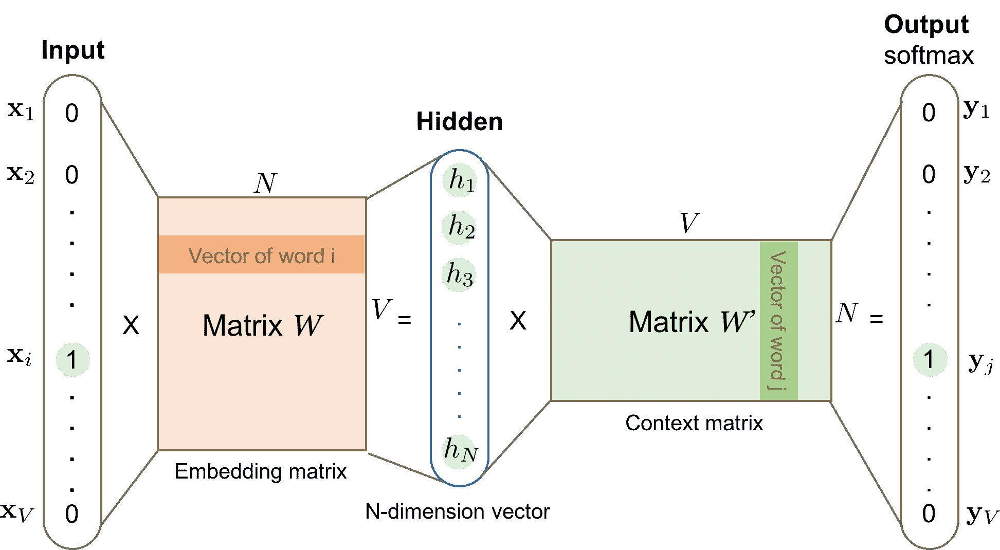
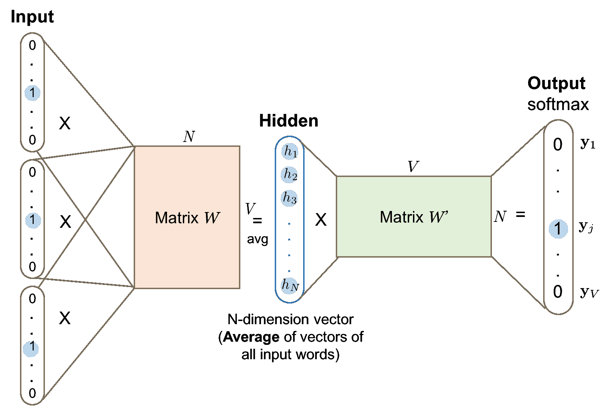

# 学习词嵌入

> 原文：[`lilianweng.github.io/posts/2017-10-15-word-embedding/`](https://lilianweng.github.io/posts/2017-10-15-word-embedding/)

人类词汇以自由文本形式存在。为了使机器学习模型理解和处理自然语言，我们需要将自由文本单词转换为数值。最简单的转换方法之一是进行一位有效编码，其中每个不同的单词代表结果向量的一个维度，二进制值表示单词是否存在（1）或不存在（0）。

然而，在处理整个词汇表时，使用一位有效编码在计算上是不切实际的，因为表示需要数十万维度。词嵌入用更低维度和更密集的（非二进制）数值向量表示单词和短语。一个对良好词嵌入的直观假设是它们可以近似单词之间的相似性（即，“猫”和“小猫”是相似的单词，因此它们在降维向量空间中应该接近）或揭示隐藏的语义关系（即，“猫”和“小猫”之间的关系类似于“狗”和“小狗”之间的关系）。上下文信息对于学习单词含义和关系非常有用，因为相似的单词经常出现在相似的上下文中。

学习词嵌入有两种主要方法，都依赖于上下文知识。

+   **基于计数**：第一种是无监督的，基于全局单词共现矩阵的矩阵分解。原始共现计数效果不佳，因此我们希望在此基础上做一些聪明的事情。

+   **基于上下文**：第二种方法是监督的。给定一个局部上下文，我们希望设计一个模型来预测目标单词，同时，该模型学习高效的词嵌入表示。

# 基于计数的向量空间模型

基于计数的向量空间模型严重依赖于单词频率和共现矩阵，假设在相同上下文中的单词具有相似或相关的语义含义。这些模型将基于计数的统计数据（如相邻单词之间的共现）映射到小而密集的单词向量中。PCA、主题模型和神经概率语言模型都是这一类别的良好示例。

* * *

与基于计数的方法不同，基于上下文的方法构建预测模型，直接针对预测给定其邻居的单词。密集的单词向量是模型参数的一部分。在模型训练过程中学习每个单词的最佳向量表示。

# 基于上下文：Skip-Gram 模型

假设你有一个固定大小的滑动窗口沿着句子移动：中间的词是“目标”，在其左右范围内的词是上下文词。跳字模型（[Mikolov et al., 2013](https://arxiv.org/pdf/1301.3781.pdf)）被训练以预测给定目标的单词作为上下文词的概率。

以下示例演示了多对目标和上下文单词作为训练样本，由一个 5 个单词窗口沿着句子滑动生成。

> “宣判者应该挥动剑。” – 尼德·史塔克

| 滑动窗口（大小=5） | 目标词 | 上下文 |
| --- | --- | --- |
| [宣判者] | 宣判者 | 宣判者 |
| [宣判者] | 宣判者 | 宣判者 |
| [宣判者] | 宣判者 | 宣判者 |
| [宣判者] | 宣判者 | 宣判者 |
| … | … | … |
| [宣判者应该挥动剑] | 挥动 | 宣判者，应该，the，剑 |
| [应该挥动剑] | the | 应该，挥动，剑 |
| [挥动剑] | 挥动 | 挥动，the |
| {:.info} |  |  |

每个上下文-目标对被视为数据中的一个新观察。例如，上述情况中目标词“挥动”产生四个训练样本：（“挥动”，“宣判者”），（“挥动”，“应该”），（“挥动”，“the”），和（“挥动”，“剑”）。



图 1\. 跳字模型。输入向量$\mathbf{x}$和输出$\mathbf{y}$都是独热编码的单词表示。隐藏层是大小为$N$的单词嵌入。

给定词汇量$V$，我们将学习大小为$N$的单词嵌入向量。该模型学会一次使用一个目标词（输入）来预测一个上下文词（输出）。

根据图 1，

+   输入词$w_i$和输出词$w_j$都被独热编码为大小为$V$的二进制向量$\mathbf{x}$和$\mathbf{y}$。

+   首先，二进制向量$\mathbf{x}$和大小为$V \times N$的单词嵌入矩阵$W$的乘积给出了输入词$w_i$的嵌入向量：矩阵$W$的第 i 行。

+   这个新发现的维度为$N$的嵌入向量形成了隐藏层。

+   隐藏层和大小为$N \times V$的单词上下文矩阵$W’$的乘积产生输出独热编码向量$\mathbf{y}$。

+   输出上下文矩阵$W’$将单词的含义编码为上下文，与嵌入矩阵$W$不同。注意：尽管名字是$W’$，但它与$W$是独立的，不是转置或逆之类的。

# 基于上下文：连续词袋（CBOW）

连续词袋（CBOW）是另一个类似的学习单词向量的模型。它从源上下文单词（即“宣判者应该 the 剑”）中预测目标单词（即“挥动”）。



图 2\. CBOW 模型。多个上下文单词的词向量被平均以获得一个固定长度的向量，就像隐藏层中那样。其他符号的含义与图 1 中相同。

因为有多个上下文单词，我们对它们对应的单词向量进行平均，由输入向量和矩阵 $W$ 的乘积构成。由于平均阶段平滑了许多分布信息，一些人认为 CBOW 模型对小数据集更好。

# 损失函数

跳字模型和 CBOW 模型都应该经过训练以最小化一个精心设计的损失/目标函数。我们可以结合几种损失函数来训练这些语言模型。在接下来的讨论中，我们将以跳字模型为例来描述损失是如何计算的。

## 完全 Softmax

跳字模型通过矩阵 $W$ 定义每个单词的嵌入向量，通过输出矩阵 $W'$ 定义上下文向量。给定一个输入单词 $w_I$，让我们将 $W$ 的对应行标记为向量 $v_{w_I}$（嵌入向量），将 $W'$ 的对应列标记为 $v'_{w_I}$（上下文向量）。最终输出层应用 softmax 来计算给定 $w_I$ 预测输出单词 $w_O$ 的概率，因此：

$$ p(w_O \vert w_I) = \frac{\exp({v'_{w_O}}^{\top} v_{w_I})}{\sum_{i=1}^V \exp({v'_{w_i}}^{\top} v_{w_I})} $$

这在图 1 中的呈现是准确的。然而，当 $V$ 非常大时，为每个样本计算分母通过遍历所有单词是计算上不可行的。对更高效的条件概率估计的需求导致了像*分层 Softmax*这样的新方法的出现。

## 分层 Softmax

Morin 和 Bengio（[2005](https://www.iro.umontreal.ca/~lisa/pointeurs/hierarchical-nnlm-aistats05.pdf)）提出了分层 Softmax，通过二叉树结构使求和计算更快。分层 Softmax 将语言模型的输出 softmax 层编码成树形层次结构，其中每个叶子代表一个单词，每个内部节点代表子节点的相对概率。


图 3\. 分层 Softmax 二叉树的示意图。白色的叶子节点是词汇中的单词。灰色的内部节点携带到达其子节点的概率信息。从根节点到叶子 $w\_i$ 的一条路径。$n(w\_i, j)$ 表示这条路径上的第 j 个节点。（图片来源：[word2vec 参数学习解释](https://arxiv.org/pdf/1411.2738.pdf)）

每个单词 $w_i$ 从根节点到其对应叶子节点有一条唯一路径。选择该单词的概率等同于从根节点通过树枝向下走到该路径的概率。由于我们知道内部节点 $n$ 的嵌入向量 $v_n$，得到该单词的概率可以通过在每个内部节点停止时取左转或右转的乘积来计算。

根据图 3，一个节点的概率是（$\sigma$是 sigmoid 函数）：

$$ \begin{align} p(\text{向右转} \to \dots w_I \vert n) &= \sigma({v'_n}^{\top} v_{w_I})\\ p(\text{向左转} \to \dots w_I \vert n) &= 1 - p(\text{向右转} \vert n) = \sigma(-{v'_n}^{\top} v_{w_I}) \end{align} $$

给定输入词$w_I$时获得上下文词$w_O$的最终概率是：

$$ p(w_O \vert w_I) = \prod_{k=1}^{L(w_O)} \sigma(\mathbb{I}_{\text{turn}}(n(w_O, k), n(w_O, k+1)) \cdot {v'_{n(w_O, k)}}^{\top} v_{w_I}) $$

其中$L(w_O)$是通向单词$w_O$的路径的深度，$\mathbb{I}_{\text{turn}}$是一个特殊的指示函数，如果$n(w_O, k+1)$是$n(w_O, k)$的左子节点，则返回 1，否则返回-1。内部节点的嵌入是在模型训练期间学习的。树结构在训练时极大地减少了分母估计的复杂度，从 O(V)（词汇量大小）降低到 O(log V)（树的深度）。然而，在预测时，我们仍然需要计算每个单词的概率并选择最佳的，因为我们事先不知道要到达哪个叶子节点。

一个良好的树结构对模型性能至关重要。几个方便的原则是：按频率分组单词，就像哈夫曼树为简单加速所实现的那样；将相似的单词分组到相同或相近的分支中（即使用预定义的单词簇，WordNet）。

## 交叉熵

另一种方法完全摆脱了 softmax 框架。相反，损失函数衡量了预测概率$p$和真实二进制标签$\mathbf{y}$之间的交叉熵。

首先，让我们回顾一下两个分布$p$和$q$之间的交叉熵是如何衡量的，即$ H(p, q) = -\sum_x p(x) \log q(x)$。在我们的情况下，当$w_i$是输出词时，真实标签$y_i$为 1；否则$y_j$为 0。模型的损失函数$\mathcal{L}_\theta$旨在最小化预测与真实之间的交叉熵，因为较低的交叉熵表示两个分布之间的高相似性。

$$ \mathcal{L}_\theta = - \sum_{i=1}^V y_i \log p(w_i | w_I) = - \log p(w_O \vert w_I) $$

请回忆，

$$ p(w_O \vert w_I) = \frac{\exp({v'_{w_O}}^{\top} v_{w_I})}{\sum_{i=1}^V \exp({v'_{w_i}}^{\top} v_{w_I})} $$

因此，

$$ \mathcal{L}_{\theta} = - \log \frac{\exp({v'_{w_O}}^{\top}{v_{w_I}})}{\sum_{i=1}^V \exp({v'_{w_i}}^{\top}{v_{w_I} })} = - {v'_{w_O}}^{\top}{v_{w_I} } + \log \sum_{i=1}^V \exp({v'_{w_i} }^{\top}{v_{w_I}}) $$

要开始使用反向传播和 SGD 训练模型，我们需要计算损失函数的梯度。为简单起见，让我们标记$z_{IO} = {v’_{w_O}}^{\top}{v_{w_I}}$。

$$ \begin{align} \nabla_\theta \mathcal{L}_{\theta} &= \nabla_\theta\big( - z_{IO} + \log \sum_{i=1}^V e^{z_{Ii}} \big) \\ &= - \nabla_\theta z_{IO} + \nabla_\theta \big( \log \sum_{i=1}^V e^{z_{Ii}} \big) \\ &= - \nabla_\theta z_{IO} + \frac{1}{\sum_{i=1}^V e^{z_{Ii}}} \sum_{i=1}^V e^{z_{Ii}} \nabla_\theta z_{Ii} \\ &= - \nabla_\theta z_{IO} + \sum_{i=1}^V \frac{e^{z_{Ii}}}{\sum_{i=1}^V e^{z_{Ii}}} \nabla_\theta z_{Ii} \\ &= - \nabla_\theta z_{IO} + \sum_{i=1}^V p(w_i \vert w_I) \nabla_\theta z_{Ii} \\ &= - \nabla_\theta z_{IO} + \mathbb{E}_{w_i \sim Q(\tilde{w})} \nabla_\theta z_{Ii} \end{align} $$

其中 $Q(\tilde{w})$ 是噪声样本的分布。

根据上述公式，正确的输出单词根据第一项有正向强化（$\nabla_\theta z_{IO}$ 越大，我们的损失就越好），而其他单词则受到第二项的负面影响。

如何估计 $\mathbb{E}_{w_i \sim Q(\tilde{w})} \nabla_\theta {v’_{w_i}}^{\top}{v_{w_I}}$，而不是通过扫描整个词汇表来使用基于交叉熵的抽样方法，这是关键。

## 噪声对比估计（NCE）

噪声对比估计（NCE）指标旨在使用 logistic 回归分类器（[Gutmann and Hyvärinen, 2010](http://proceedings.mlr.press/v9/gutmann10a/gutmann10a.pdf)）区分目标单词和噪声样本。

给定输入单词 $w_I$，正确的输出单词称为 $w$。同时，我们从噪声样本分布 $Q$ 中抽样 $N$ 个其他单词，表示为 $\tilde{w}_1, \tilde{w}_2, \dots, \tilde{w}_N \sim Q$。让我们将二元分类器的决策标记为 $d$，$d$ 只能取二进制值。

$$ \mathcal{L}_\theta = - [ \log p(d=1 \vert w, w_I) + \sum_{i=1, \tilde{w}_i \sim Q}^N \log p(d=0|\tilde{w}_i, w_I) ] $$

当 $N$ 足够大时，根据[大数定律](https://en.wikipedia.org/wiki/Law_of_large_numbers)，

$$ \mathcal{L}_\theta = - [ \log p(d=1 \vert w, w_I) + N\mathbb{E}_{\tilde{w}_i \sim Q} \log p(d=0|\tilde{w}_i, w_I)] $$

要计算概率 $p(d=1 \vert w, w_I)$，我们可以从联合概率 $p(d, w \vert w_I)$ 开始。在 $w, \tilde{w}_1, \tilde{w}_2, \dots, \tilde{w}_N$ 中，我们有 1/(N+1) 的机会选择真实单词 $w$，它是从条件概率 $p(w \vert w_I)$ 中抽样得到的；同时，我们有 N/(N+1) 的机会选择一个噪声单词，每个都是从 $q(\tilde{w}) \sim Q$ 中抽样得到的。因此，

$$ p(d, w | w_I) = \begin{cases} \frac{1}{N+1} p(w \vert w_I) & \text{if } d=1 \\ \frac{N}{N+1} q(\tilde{w}) & \text{if } d=0 \end{cases} $$

然后我们可以计算出 $p(d=1 \vert w, w_I)$ 和 $p(d=0 \vert w, w_I)$：

$$ \begin{align} p(d=1 \vert w, w_I) &= \frac{p(d=1, w \vert w_I)}{p(d=1, w \vert w_I) + p(d=0, w \vert w_I)} &= \frac{p(w \vert w_I)}{p(w \vert w_I) + Nq(\tilde{w})} \end{align} $$$$ \begin{align} p(d=0 \vert w, w_I) &= \frac{p(d=0, w \vert w_I)}{p(d=1, w \vert w_I) + p(d=0, w \vert w_I)} &= \frac{Nq(\tilde{w})}{p(w \vert w_I) + Nq(\tilde{w})} \end{align} $$

最终，NCE 的二元分类器的损失函数变为：

$$ \begin{align} \mathcal{L}_\theta & = - [ \log p(d=1 \vert w, w_I) + \sum_{\substack{i=1 \\ \tilde{w}_i \sim Q}}^N \log p(d=0|\tilde{w}_i, w_I)] \\ & = - [ \log \frac{p(w \vert w_I)}{p(w \vert w_I) + Nq(\tilde{w})} + \sum_{\substack{i=1 \\ \tilde{w}_i \sim Q}}^N \log \frac{Nq(\tilde{w}_i)}{p(w \vert w_I) + Nq(\tilde{w}_i)}] \end{align} $$

然而，$p(w \vert w_I)$仍然涉及将整个词汇表求和作为分母。让我们将分母标记为输入单词的分区函数，$Z(w_I)$。一个常见的假设是$Z(w) \approx 1$，因为我们期望 softmax 输出层被归一化（[Minh and Teh, 2012](https://www.cs.toronto.edu/~amnih/papers/ncelm.pdf)）。然后损失函数简化为：

$$ \mathcal{L}_\theta = - [ \log \frac{\exp({v'_w}^{\top}{v_{w_I}})}{\exp({v'_w}^{\top}{v_{w_I}}) + Nq(\tilde{w})} + \sum_{\substack{i=1 \\ \tilde{w}_i \sim Q}}^N \log \frac{Nq(\tilde{w}_i)}{\exp({v'_w}^{\top}{v_{w_I}}) + Nq(\tilde{w}_i)}] $$

噪声分布$Q$是一个可调参数，我们希望设计它的方式是：

+   直观上应该与真实数据分布非常相似；以及

+   应该容易从中进行采样。

例如，tensorflow 中 NCE 损失的采样实现([log_uniform_candidate_sampler](https://github.com/tensorflow/tensorflow/blob/master/tensorflow/python/ops/candidate_sampling_ops.py#L83))假设这样的噪声样本遵循对数均匀分布，也被称为[齐夫定律](https://en.wikipedia.org/wiki/Zipf%27s_law)。对数概率中给定单词的概率预计与其排名成反比，而高频词被赋予较低的排名。在这种情况下，$q(\tilde{w}) = \frac{1}{ \log V}(\log (r_{\tilde{w}} + 1) - \log r_{\tilde{w}})$，其中$r_{\tilde{w}} \in [1, V]$是按频率降序排列的单词的排名。

## 负采样（NEG）

Mikolov 等人提出的负采样（NEG）是 NCE 损失的简化变体。它尤其以训练 Google 的[word2vec](https://code.google.com/archive/p/word2vec/)项目而闻名。与试图近似最大化 softmax 输出的对数概率的 NCE Loss 不同，负采样进行了进一步简化，因为它专注于学习高质量的词嵌入，而不是对自然语言中的词分布进行建模。

NEG 用 sigmoid 函数近似二元分类器的输出如下：

$$ \begin{align} p(d=1 \vert w_, w_I) &= \sigma({v'_{w}}^\top v_{w_I}) \\ p(d=0 \vert w, w_I) &= 1 - \sigma({v'_{w}}^\top v_{w_I}) = \sigma(-{v'_{w}}^\top v_{w_I}) \end{align} $$

最终的 NCE 损失函数如下所示：

$$ \mathcal{L}_\theta = - [ \log \sigma({v'_{w}}^\top v_{w_I}) + \sum_{\substack{i=1 \\ \tilde{w}_i \sim Q}}^N \log \sigma(-{v'_{\tilde{w}_i}}^\top v_{w_I})] $$

# 学习词嵌入的其他提示

Mikolov 等人建议了几种有助于获得良好词嵌入学习结果的实践方法。

+   **软滑动窗口**。在滑动窗口内配对单词时，我们可以给距离较远的单词分配较少的权重。一个启发式方法是——给定一个定义的最大窗口大小参数，$s_{\text{max}}$，实际窗口大小对于每个训练样本都在 1 和$s_{\text{max}}$之间随机抽样。因此，每个上下文单词被观察到的概率为 1/(它到目标单词的距离)，而相邻单词总是被观察到。

+   **对频繁单词进行子采样**。极其频繁的单词可能过于普通，无法区分上下文（即考虑停用词）。另一方面，罕见单词更有可能携带独特信息。为了平衡频繁和罕见单词，Mikolov 等人建议在采样过程中以概率$1-\sqrt{t/f(w)}$丢弃单词$w$。这里$f(w)$是单词频率，$t$是可调阈值。

+   **首先学习短语**。短语通常作为一个概念单元存在，而不是简单的个别单词组合。例如，即使我们知道“new”和“york”的含义，我们也无法确定“New York”是一个城市名。在训练词嵌入模型之前，首先学习这些短语并将它们视为单词单元可以提高结果质量。一个简单的数据驱动方法基于单字和双字计数：$s_{\text{phrase}} = \frac{C(w_i w_j) - \delta}{ C(w_i)C(w_j)}$，其中$C(.)$是单字$w_i$或双字$w_i w_j$的简单计数，$\delta$是一个折扣阈值，用于防止过于罕见的单词和短语。得分越高表示成为短语的可能性越大。为了形成超过两个单词的短语，我们可以多次扫描词汇表，逐渐降低得分截断值。

# GloVe：全局向量

Pennington 等人提出的全局向量（GloVe）模型旨在将基于计数的矩阵分解和基于上下文的跳字模型结合在一起。

我们都知道计数和共现可以揭示单词的含义。为了区分在词嵌入词的上下文中的$p(w_O \vert w_I)$，我们想定义共现概率为：

$$ p_{\text{co}}(w_k \vert w_i) = \frac{C(w_i, w_k)}{C(w_i)} $$

$C(w_i, w_k)$ 计算了单词$w_i$和$w_k$的共现次数。

假设，我们有两个单词，$w_i$=“ice”和$w_j$=“steam”。第三个单词$\tilde{w}_k$=“solid”与“ice”相关但与“steam”无关，因此我们期望$p_{\text{co}}(\tilde{w}_k \vert w_i)$远大于$p_{\text{co}}(\tilde{w}_k \vert w_j)$，因此$\frac{p_{\text{co}}(\tilde{w}_k \vert w_i)}{p_{\text{co}}(\tilde{w}_k \vert w_j)}$应该非常大。如果第三个单词$\tilde{w}_k$=“water”与两者相关或$\tilde{w}_k$=“fashion”与两者都不相关，则$\frac{p_{\text{co}}(\tilde{w}_k \vert w_i)}{p_{\text{co}}(\tilde{w}_k \vert w_j)}$预计接近于一。

这里的直觉是，单词含义由共现概率的比率而不是概率本身捕获。全局向量模型了解两个单词之间关于第三个上下文单词的关系如下：

$$ F(w_i, w_j, \tilde{w}_k) = \frac{p_{\text{co}}(\tilde{w}_k \vert w_i)}{p_{\text{co}}(\tilde{w}_k \vert w_j)} $$

此外，由于目标是学习有意义的单词向量，$F$被设计为两个单词$w_i - w_j$之间的线性差异的函数：

$$ F((w_i - w_j)^\top \tilde{w}_k) = \frac{p_{\text{co}}(\tilde{w}_k \vert w_i)}{p_{\text{co}}(\tilde{w}_k \vert w_j)} $$

考虑到目标词和上下文词之间对称的$F$，最终的解决方案是将$F$建模为一个**指数**函数。请阅读原始论文（[Pennington et al., 2014](http://www.aclweb.org/anthology/D14-1162)）以获取更多方程的细节。

$$ \begin{align} F({w_i}^\top \tilde{w}_k) &= \exp({w_i}^\top \tilde{w}_k) = p_{\text{co}}(\tilde{w}_k \vert w_i) \\ F((w_i - w_j)^\top \tilde{w}_k) &= \exp((w_i - w_j)^\top \tilde{w}_k) = \frac{\exp(w_i^\top \tilde{w}_k)}{\exp(w_j^\top \tilde{w}_k)} = \frac{p_{\text{co}}(\tilde{w}_k \vert w_i)}{p_{\text{co}}(\tilde{w}_k \vert w_j)} \end{align} $$

最后，

$$ {w_i}^\top \tilde{w}_k = \log p_{\text{co}}(\tilde{w}_k \vert w_i) = \log \frac{C(w_i, \tilde{w}_k)}{C(w_i)} = \log C(w_i, \tilde{w}_k) - \log C(w_i) $$

由于第二项$-\log C(w_i)$与$k$无关，我们可以为$w_i$添加偏置项$b_i$来捕获$-\log C(w_i)$。为了保持对称形式，我们还为$\tilde{w}_k$添加偏置$\tilde{b}_k$。

$$ \log C(w_i, \tilde{w}_k) = {w_i}^\top \tilde{w}_k + b_i + \tilde{b}_k $$

GloVe 模型的损失函数旨在通过最小化平方误差的总和来保留上述公式：

$$ \mathcal{L}_\theta = \sum_{i=1, j=1}^V f(C(w_i,w_j)) ({w_i}^\top \tilde{w}_j + b_i + \tilde{b}_j - \log C(w_i, \tilde{w}_j))² $$

权重模式$f(c)$是$w_i$和$w_j$的共现的函数，是一个可调整的模型配置。当$c \to 0$时，应接近于零；随着更高的共现，应该是非递减的；当$c$变得极端大时应该饱和。论文提出了以下权重函数。

$$ f(c) = \begin{cases} (\frac{c}{c_{\max}})^\alpha & \text{如果 } c < c_{\max} \text{，} c_{\max} \text{是可调整的。} \\ 1 & \text{如果 } \text{其他情况} \end{cases} $$

# 例子：Game of Thrones 上的 word2vec

在回顾了上述所有理论知识之后，让我们尝试从“权力的游戏语料库”中提取的词嵌入进行一点实验。使用[gensim](https://radimrehurek.com/gensim/models/word2vec.html)的过程非常简单。

**步骤 1：提取单词**

```py
import sys from nltk.corpus import stopwords from nltk.tokenize import sent_tokenize   STOP_WORDS = set(stopwords.words('english'))   def get_words(txt):  return filter( lambda x: x not in STOP_WORDS, re.findall(r'\b(\w+)\b', txt) )   def parse_sentence_words(input_file_names):  """Returns a list of a list of words. Each sublist is a sentence.""" sentence_words = [] for file_name in input_file_names: for line in open(file_name): line = line.strip().lower() line = line.decode('unicode_escape').encode('ascii','ignore') sent_words = map(get_words, sent_tokenize(line)) sent_words = filter(lambda sw: len(sw) > 1, sent_words) if len(sent_words) > 1: sentence_words += sent_words return sentence_words   # You would see five .txt files after unzip 'a_song_of_ice_and_fire.zip' input_file_names = ["001ssb.txt", "002ssb.txt", "003ssb.txt",  "004ssb.txt", "005ssb.txt"] GOT_SENTENCE_WORDS= parse_sentence_words(input_file_names) 
```

**步骤 2：输入 word2vec 模型**

```py
from gensim.models import Word2Vec   # size: the dimensionality of the embedding vectors. # window: the maximum distance between the current and predicted word within a sentence. model = Word2Vec(GOT_SENTENCE_WORDS, size=128, window=3, min_count=5, workers=4) model.wv.save_word2vec_format("got_word2vec.txt", binary=False) 
```

**步骤 3：检查结果**

在 GoT 词嵌入空间中，“国王”和“王后”的相似词排名如下：

| `model.most_similar('king', topn=10)`（与‘国王’相似的词） | `model.most_similar('queen', topn=10)`（与‘王后’相似的词） |
| --- | --- |
| (‘国王’, 0.897245) | (‘瑟曦’, 0.942618) |
| (‘拜拉席恩’, 0.809675) | (‘乔佛里’, 0.933756) |
| (‘儿子’, 0.763614) | (‘玛格丽’, 0.931099) |
| (‘罗伯特’, 0.708522) | (‘姐妹’, 0.928902) |
| (‘领主们’, 0.698684) | (‘王子’, 0.927364) |
| (‘乔佛里’, 0.696455) | (‘叔叔’, 0.922507) |
| (‘王子’, 0.695699) | (‘瓦里斯’, 0.918421) |
| (‘兄弟’, 0.685239) | (‘尼德’, 0.917492) |
| (‘艾利斯’, 0.684527) | (‘梅丽珊卓’, 0.915403) |
| (‘史坦尼斯’, 0.682932) | (‘罗伯’, 0.915272) |

* * *

引用为：

```py
@article{weng2017wordembedding,
  title   = "Learning word embedding",
  author  = "Weng, Lilian",
  journal = "lilianweng.github.io",
  year    = "2017",
  url     = "https://lilianweng.github.io/posts/2017-10-15-word-embedding/"
} 
```

# 参考文献

[1] Tensorflow 教程 [单词的向量表示](https://www.tensorflow.org/tutorials/word2vec)。

[2] [“Word2Vec 教程 - Skip-Gram 模型”](http://mccormickml.com/2016/04/19/word2vec-tutorial-the-skip-gram-model/) by Chris McCormick.

[3] [“关于词嵌入 - 第 2 部分：逼近 Softmax”](http://ruder.io/word-embeddings-softmax/) by Sebastian Ruder.

[4] Xin Rong. [word2vec 参数学习解释](https://arxiv.org/pdf/1411.2738.pdf)

[5] Mikolov, Tomas, Kai Chen, Greg Corrado, and Jeffrey Dean. [“在向量空间中高效估计词表示”](https://arxiv.org/pdf/1301.3781.pdf) arXiv 预印本 arXiv:1301.3781 (2013).

[6] Frederic Morin and Yoshua Bengio. [“分层概率神经网络语言模型”](https://www.iro.umontreal.ca/~lisa/pointeurs/hierarchical-nnlm-aistats05.pdf) Aistats。Vol. 5。2005 年。

[7] Michael Gutmann and Aapo Hyvärinen. [“噪声对比估计：非归一化统计模型的新估计原则”](http://proceedings.mlr.press/v9/gutmann10a/gutmann10a.pdf) 人工智能和统计学国际会议论文集。2010 年。

[8] Tomas Mikolov, Ilya Sutskever, Kai Chen, Greg Corrado, and Jeffrey Dean. [“单词和短语的分布式表示及其组合性”](https://papers.nips.cc/paper/5021-distributed-representations-of-words-and-phrases-and-their-compositionality.pdf) 神经信息处理系统的进展。2013 年。

[9] Tomas Mikolov, Kai Chen, Greg Corrado, and Jeffrey Dean. [“在向量空间中高效估计词表示”](https://arxiv.org/pdf/1301.3781.pdf) arXiv 预印本 arXiv:1301.3781 (2013).

[10] Marco Baroni, Georgiana Dinu, and Germán Kruszewski. [“不要计数，要预测！上下文计数与上下文预测语义向量的系统比较.”](http://anthology.aclweb.org/P/P14/P14-1023.pdf) 2014 年 ACL (1) 会议论文集。

[11] Jeffrey Pennington, Richard Socher, and Christopher Manning. [“Glove: 全局词向量表示.”](http://www.aclweb.org/anthology/D14-1162) 2014 年 Empirical Methods in Natural Language Processing (EMNLP) 会议论文集.
