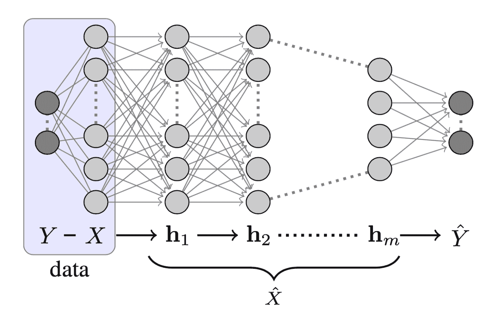
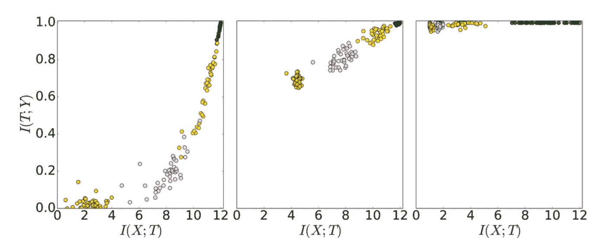
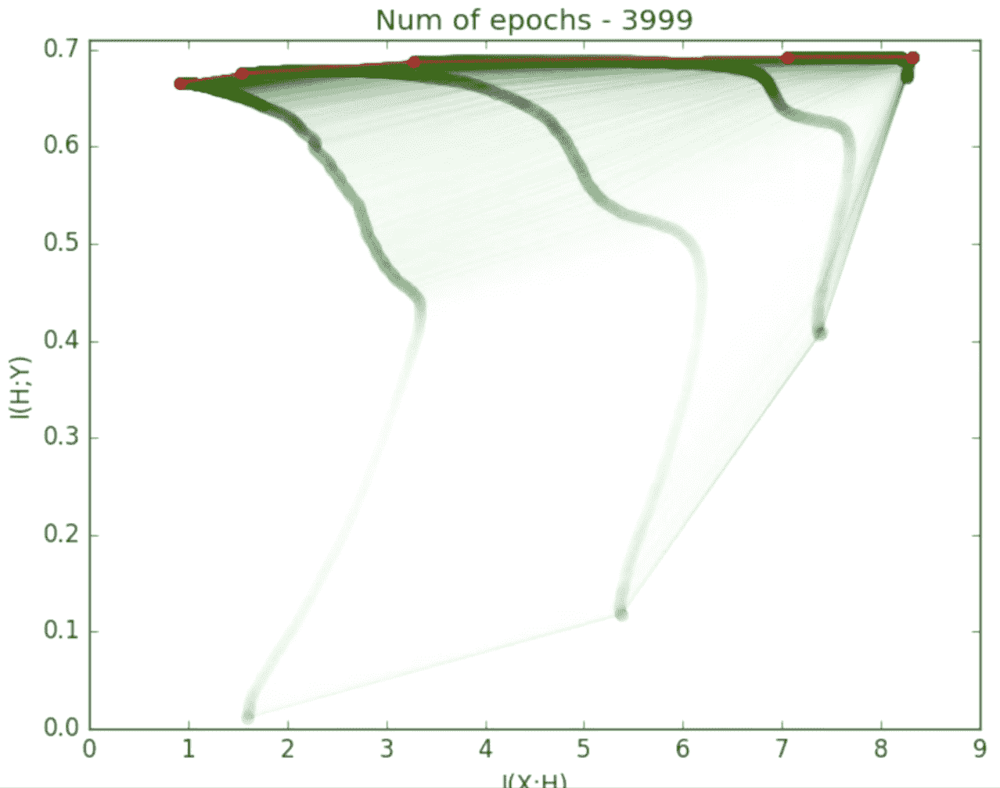
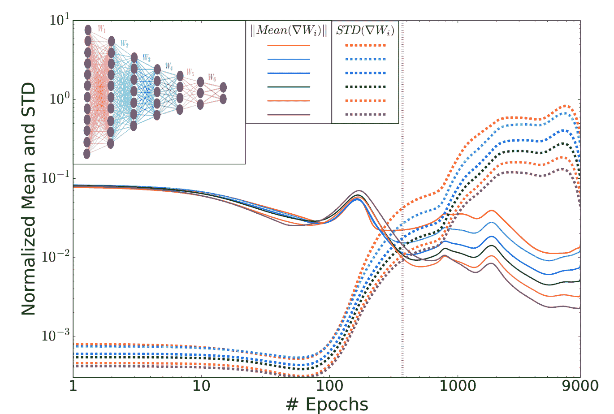
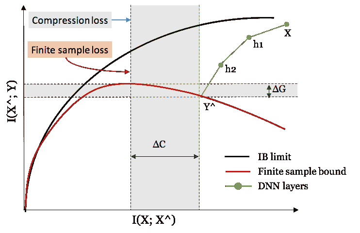
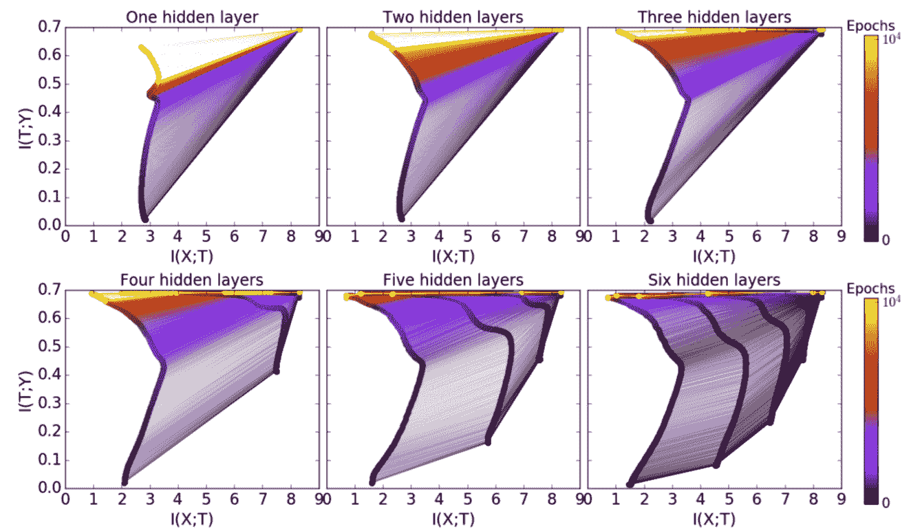
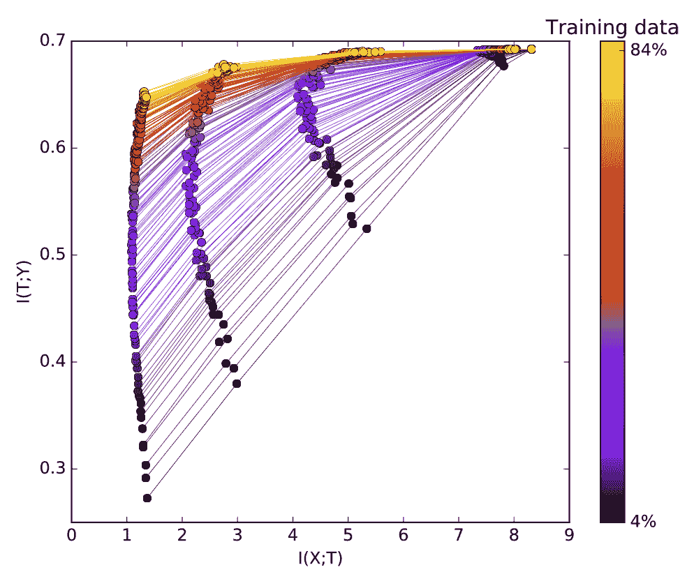

# 用信息理论解剖深度学习

> 原文：[`lilianweng.github.io/posts/2017-09-28-information-bottleneck/`](https://lilianweng.github.io/posts/2017-09-28-information-bottleneck/)

Naftali Tishby 教授于 2021 年去世。希望这篇文章能向更多人介绍他关于信息瓶颈的酷炫想法。

最近我观看了 Naftali Tishby 教授的讲座[“深度学习中的信息理论”](https://youtu.be/bLqJHjXihK8)，发现非常有趣。他展示了如何将信息理论应用于研究深度神经网络在训练过程中的增长和转变。利用[信息瓶颈（IB）](https://arxiv.org/pdf/physics/0004057.pdf)方法，他为深度神经网络（DNN）提出了一个新的学习界限，因为传统的学习理论由于参数数量的指数增长而失败。另一个敏锐的观察是，DNN 训练涉及两个不同的阶段：首先，网络被训练以完全表示输入数据并最小化泛化误差；然后，它通过压缩输入的表示来学会忘记不相关的细节。

这篇文章中的大部分材料来自 Tishby 教授的讲座和[相关论文](https://lilianweng.github.io/posts/2017-09-28-information-bottleneck/#references)。

# 基本概念

[**马尔可夫链**](https://en.wikipedia.org/wiki/Markov_chain)

马尔可夫过程是一种“无记忆”（也称为“马尔可夫性质”）的随机过程。马尔可夫链是包含多个离散状态的马尔可夫过程的一种类型。也就是说，过程的未来状态的条件概率仅由当前状态决定，不依赖于过去状态。

[**Kullback–Leibler（KL）散度**](https://en.wikipedia.org/wiki/Kullback%E2%80%93Leibler_divergence)

KL 散度衡量了一个概率分布$p$与第二个期望概率分布$q$之间的偏离程度。它是不对称的。

$$ \begin{aligned} D_{KL}(p \| q) &= \sum_x p(x) \log \frac{p(x)}{q(x)} \\ &= - \sum_x p(x)\log q(x) + \sum_x p(x)\log p(x) \\ &= H(P, Q) - H(P) \end{aligned} $$

当$p(x)$ == $q(x)$时，$D_{KL}$达到最小值零。

[**互信息**](https://en.wikipedia.org/wiki/Mutual_information)

互信息度量了两个变量之间的相互依赖关系。它量化了通过另一个随机变量获得的“信息量”。互信息是对称的。

$$ \begin{aligned} I(X;Y) &= D_{KL}[p(x,y) \| p(x)p(y)] \\ &= \sum_{x \in X, y \in Y} p(x, y) \log(\frac{p(x, y)}{p(x)p(y)}) \\ &= \sum_{x \in X, y \in Y} p(x, y) \log(\frac{p(x|y)}{p(x)}) \\ &= H(X) - H(X|Y) \\ \end{aligned} $$

[**数据处理不等式（DPI）**](https://en.wikipedia.org/wiki/Data_processing_inequality)

对于任何马尔可夫链：$X \to Y \to Z$，我们有 $I(X; Y) \geq I(X; Z)$。

一个深度神经网络可以被视为马尔可夫链，因此当我们沿着 DNN 的层向下移动时，层与输入之间的互信息只能减少。

[**重参数化不变性**](https://en.wikipedia.org/wiki/Parametrization#Parametrization_invariance)

对于两个可逆函数$\phi$，$\psi$，互信息仍然成立：$I(X; Y) = I(\phi(X); \psi(Y))$。

例如，如果我们对 DNN 的一个层中的权重进行洗牌，这不会影响该层与另一层之间的互信息。

# 深度神经网络作为马尔可夫链

训练数据包含从$X$和$Y$的联合分布中抽样的观测。输入变量$X$和隐藏层的权重都是高维随机变量。真实目标$Y$和预测值$\hat{Y}$在分类设置中是维度较小的随机变量。



图 1\. 一个深度神经网络的结构，包括目标标签$Y$，输入层$X$，隐藏层$h\_1, \dots, h\_m$和最终预测$\hat{Y}$。（图片来源：[Tishby and Zaslavsky, 2015](https://arxiv.org/pdf/1503.02406.pdf)）

如果我们像图 1 中标记 DNN 的隐藏层为$h_1, h_2, \dots, h_m$，我们可以将每一层视为马尔可夫链的一个状态：$ h_i \to h_{i+1}$。根据 DPI，我们会有：

$$ \begin{aligned} H(X) \geq I(X; h_1) \geq I(X; h_2) \geq \dots \geq I(X; h_m) \geq I(X; \hat{Y}) \\ I(X; Y) \geq I(h_1; Y) \geq I(h_2; Y) \geq \dots \geq I(h_m; Y) \geq I(\hat{Y}; Y) \end{aligned} $$

一个深度神经网络（DNN）被设计成学习如何描述$X$以预测$Y，并最终将$X$压缩，只保留与$Y$相关的信息。Tishby 将这种处理描述为*“相关信息的逐步细化”*。

## 信息平面定理

一个 DNN 具有$X$的连续内部表示，一组隐藏层$\{T_i\}$。*信息平面*定理通过其编码器和解码器信息来表征每一层。编码器是输入数据$X$的表示，而解码器将当前层中的信息转换为目标输出$Y$。

精确地，在信息平面图中：

+   **X 轴**：$T_i$的样本复杂度由编码器的互信息$I(X; T_i)$确定。样本复杂度指的是为达到一定精度和泛化性能需要多少样本。

+   **Y 轴**：准确度（泛化误差）由解码器的互信息$I(T_i; Y)$确定。



图 2\. DNN 隐藏层的编码器与解码器互信息，共 50 次实验。不同层以颜色区分，绿色为最靠近输入的层，橙色为最远的层。有三个快照，分别为初始时期、400 个时期和 9000 个时期。（图片来源：[Shwartz-Ziv and Tishby, 2017](https://arxiv.org/pdf/1703.00810.pdf)）

图 2\. 中的每个点标记了一个网络模拟的一个隐藏层的编码器/解码器互信息（没有应用正则化；没有权重衰减，没有丢弃等）。它们如预期地上升，因为对真实标签的知识增加（准确性增加）。在早期阶段，隐藏层学习了关于输入 $X$ 的很多信息，但后来它们开始压缩以忘记一些关于输入的信息。Tishby 认为*“学习中最重要的部分实际上是遗忘”*。看看这个[不错的视频](https://youtu.be/P1A1yNsxMjc)，展示了层的互信息随时期变化的情况。



图 3\. 这里是图 2\. 的聚合视图。压缩发生在泛化误差变得非常小之后。 (图片来源: [Tishby’ talk 15:15](https://youtu.be/bLqJHjXihK8?t=15m15s))

## 两个优化阶段

跟踪每个层权重的归一化均值和标准差随时间的变化也揭示了训练过程的两个优化阶段。



图 4\. 每个层的权重梯度的均值和标准差的范数作为训练时期函数的图示。不同层以颜色编码。 (图片来源: [Shwartz-Ziv and Tishby, 2017](https://arxiv.org/pdf/1703.00810.pdf))

在早期时期，均值比标准差大三个数量级。经过足够数量的时期后，误差饱和，标准差之后变得更加嘈杂。离输出层越远的层，噪音就越大，因为噪音可以通过反向传播过程放大和积累（不是由于层的宽度）。

# 学习理论

## “旧” 泛化界限

经典学习理论定义的泛化界限是：

$$ \epsilon² < \frac{\log|H_\epsilon| + \log{1/\delta}}{2m} $$

+   $\epsilon$: 训练误差和泛化误差之间的差异。泛化误差衡量算法对以前未见数据的预测的准确性。

+   $H_\epsilon$: 假设类的 $\epsilon$-覆盖。通常我们假设大小 $\vert H_\epsilon \vert \sim (1/\epsilon)^d$。

+   $\delta$: 置信度。

+   $m$: 训练样本的数量。

+   $d$: 假设的 VC 维度。

这个定义说明训练误差和泛化误差之间的差异受假设空间大小和数据集大小的函数限制。假设空间越大，泛化误差就越大。如果你对泛化界限感兴趣，我推荐这个关于 ML 理论的教程，[part1](https://mostafa-samir.github.io/ml-theory-pt1/) 和 [part2](https://mostafa-samir.github.io/ml-theory-pt2/)。

然而，这对深度学习不起作用。网络越大，需要学习的参数就越多。根据这些泛化界限，更大的网络（更大的$d$）将具有更差的界限。这与更大的网络能够通过更高的表达能力实现更好性能的直觉相矛盾。

## “新”输入压缩界限

为了解决这一反直觉的观察，Tishby 等人提出了 DNN 的新输入压缩界限。

首先让我们将$T_\epsilon$作为输入变量$X$的一个$\epsilon$-分区。这个分区将输入相对于标签的同质性进行压缩到小单元格中。这些单元格总共可以覆盖整个输入空间。如果预测输出是二进制值，我们可以用$2^{\vert T_\epsilon \vert}$替换假设的基数$\vert H_\epsilon \vert$。

$$ |H_\epsilon| \sim 2^{|X|} \to 2^{|T_\epsilon|} $$

当$X$很大时，$X$的大小约为$2^{H(X)}$。$\epsilon$-分区中的每个单元大小约为$2^{H(X \vert T_\epsilon)}$。因此，我们有$\vert T_\epsilon \vert \sim \frac{2^{H(X)}}{2^{H(X \vert T_\epsilon)}} = 2^{I(T_\epsilon; X)}$。然后输入压缩界限变为：

$$ \epsilon² < \frac{2^{I(T_\epsilon; X)} + \log{1/\delta}}{2m} $$

图 5\. 黑线是最佳可实现的信息瓶颈（IB）极限。红线对应于在有限样本集上训练时的样本外 IB 失真的上界。$\Delta C$是复杂度差距，$\Delta G$是泛化差距。（基于[Tishby 的演讲 24:50](https://youtu.be/bLqJHjXihK8?t=24m56s)重新创建）

# 网络大小和训练数据大小

## 更多隐藏层的好处

拥有更多层次给我们带来计算上的好处，并加快训练过程以获得良好的泛化能力。



图 6\. 随着隐藏层数增加，优化时间（较少的迭代次数）大大缩短。（图片来源：[Shwartz-Ziv and Tishby, 2017](https://arxiv.org/pdf/1703.00810.pdf)）

**通过随机松弛进行压缩**：根据[扩散方程](https://en.wikipedia.org/wiki/Fokker%E2%80%93Planck_equation)，第$k$层的松弛时间与该层的压缩量$\Delta S_k$的指数成正比：$\Delta t_k \sim \exp(\Delta S_k)$。我们可以计算层的压缩量为$\Delta S_k = I(X; T_k) - I(X; T_{k-1})$。因为$\exp(\sum_k \Delta S_k) \geq \sum_k \exp(\Delta S_k)$，我们预期随着隐藏层数增加（更大的$k$），训练迭代次数会呈指数减少。

## 更多训练样本的好处

拟合更多的训练数据需要隐藏层捕获更多的信息。随着训练数据规模的增加，解码器的互信息（回想一下，这与泛化误差直接相关），$I(T; Y)$，被推高并接近理论信息瓶颈界限。Tishby 强调，决定泛化的是互信息，而不是层大小或 VC 维度，这与标准理论不同。



图 7。不同大小的训练数据以颜色编码。绘制了多个收敛网络的信息平面。更多的训练数据导致更好的泛化。（图片来源：[Shwartz-Ziv 和 Tishby，2017](https://arxiv.org/pdf/1703.00810.pdf))

* * *

引用为：

```py
@article{weng2017infotheory,
  title   = "Anatomize Deep Learning with Information Theory",
  author  = "Weng, Lilian",
  journal = "lilianweng.github.io",
  year    = "2017",
  url     = "https://lilianweng.github.io/posts/2017-09-28-information-bottleneck/"
} 
```

# 参考文献

[1] Naftali Tishby. [深度学习的信息理论](https://youtu.be/bLqJHjXihK8)

[2] [机器学习理论 - 第 1 部分：介绍](https://mostafa-samir.github.io/ml-theory-pt1/)

[3] [机器学习理论 - 第 2 部分：泛化界限](https://mostafa-samir.github.io/ml-theory-pt2/)

[4] [揭开深度学习黑匣子的新理论](https://www.quantamagazine.org/new-theory-cracks-open-the-black-box-of-deep-learning-20170921/)，作者为 Quanta Magazine。

[5] Naftali Tishby 和 Noga Zaslavsky. [“深度学习与信息瓶颈原理。”](https://arxiv.org/pdf/1503.02406.pdf) IEEE 信息理论研讨会（ITW），2015。

[6] Ravid Shwartz-Ziv 和 Naftali Tishby. [“通过信息揭开深度神经网络的黑匣子。”](https://arxiv.org/pdf/1703.00810.pdf) arXiv 预印本 arXiv:1703.00810，2017。
