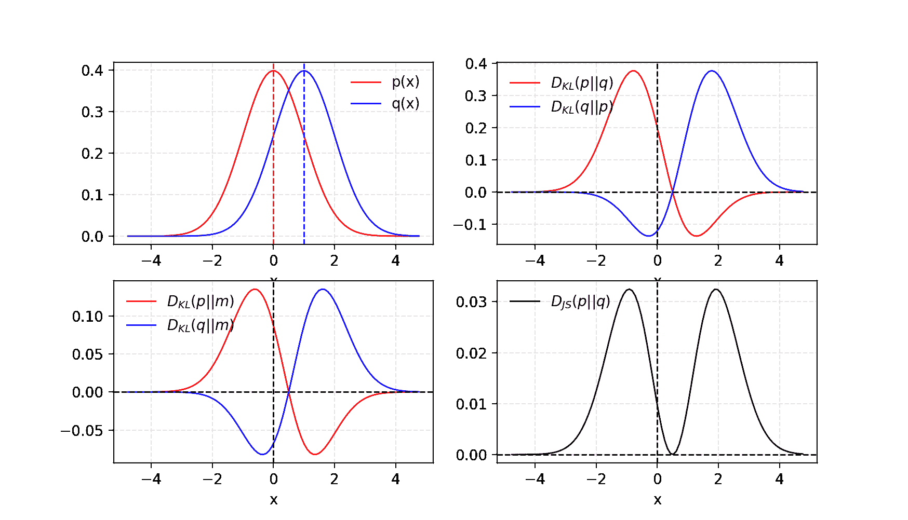
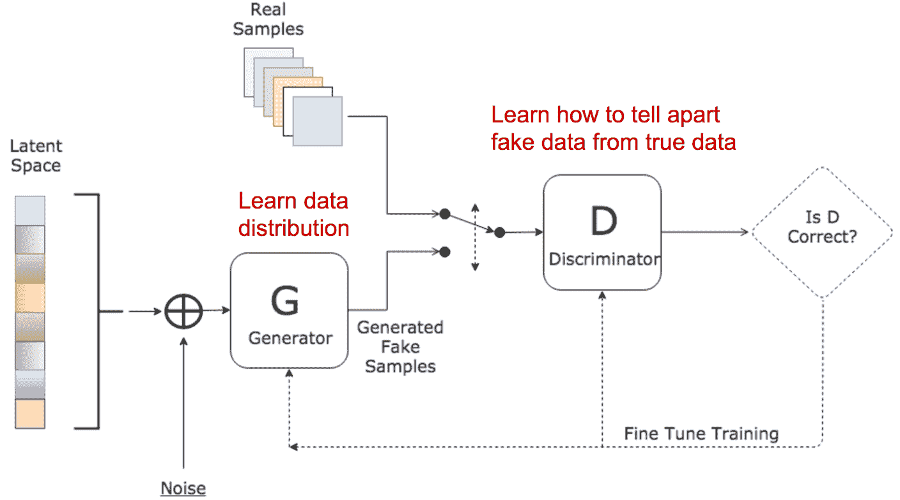
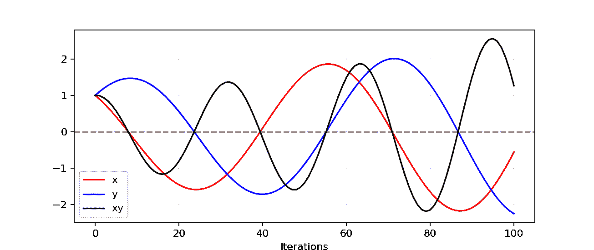
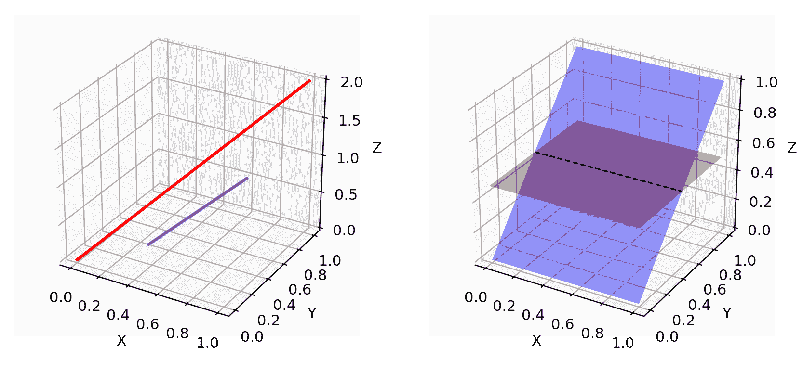
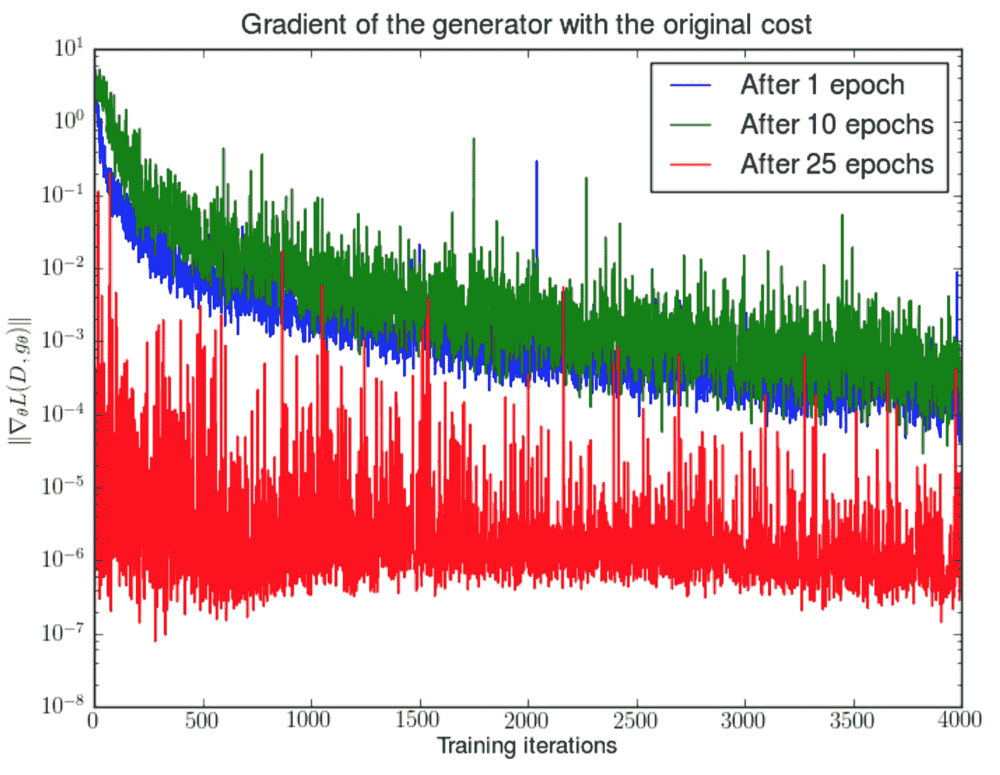
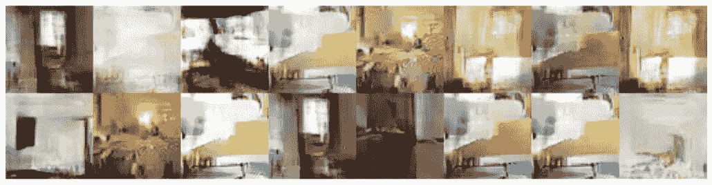
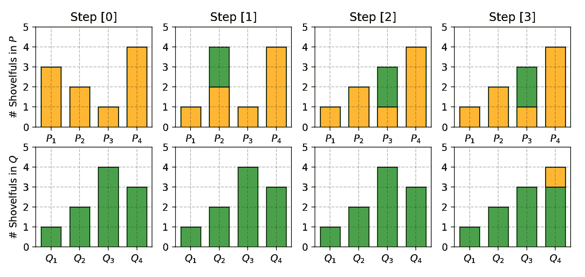
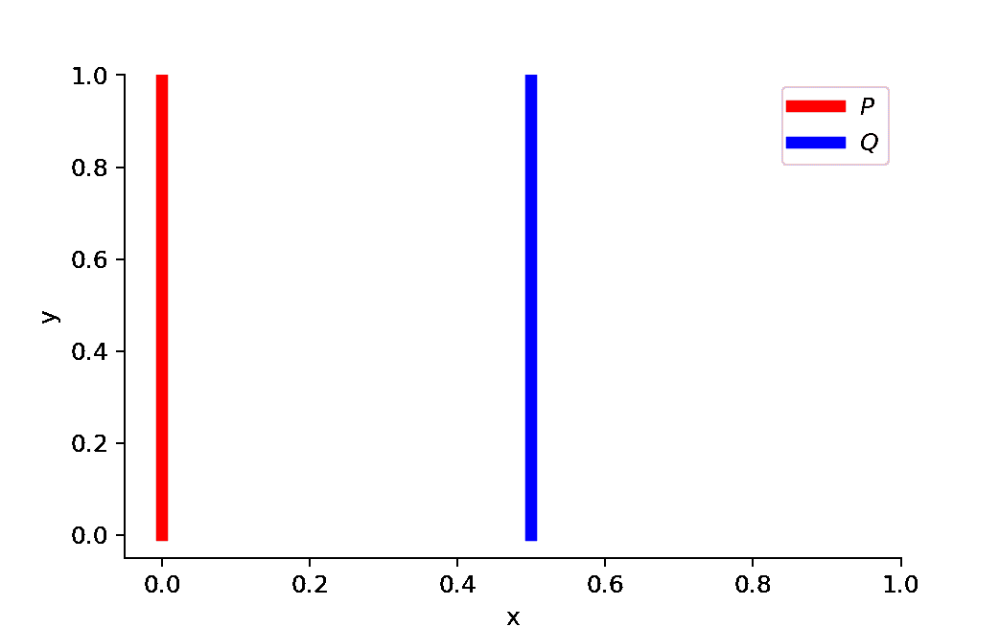
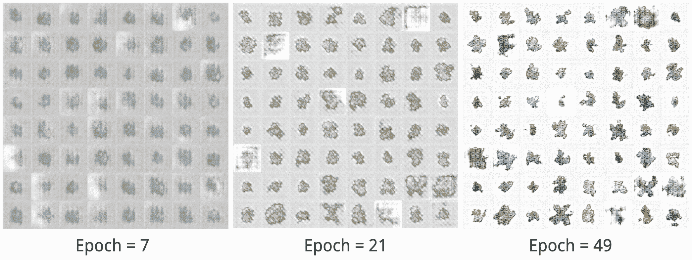

# 从 GAN 到 WGAN

> 原文：[`lilianweng.github.io/posts/2017-08-20-gan/`](https://lilianweng.github.io/posts/2017-08-20-gan/)

[2018-09-30 更新：感谢 Yoonju，我们有这篇文章的[韩文翻译](https://github.com/yjucho1/articles/blob/master/fromGANtoWGAN/readme.md)!]

[2019-04-18 更新：这篇文章也可以在[arXiv](https://arxiv.org/abs/1904.08994)上找到。]

[生成对抗网络](https://arxiv.org/pdf/1406.2661.pdf)（GAN）在许多生成任务中展现出了出色的结果，如复制现实世界丰富内容，如图像、人类语言和音乐。它受到博弈论的启发：两个模型，一个生成器和一个评论者，彼此竞争，同时使彼此变得更强。然而，训练 GAN 模型相当具有挑战性，因为人们面临着训练不稳定或无法收敛的问题。

在这里，我想解释生成对抗网络框架背后的数学原理，为什么它难以训练，最后介绍一个旨在解决训练困难的修改版 GAN。

# Kullback–Leibler 和 Jensen–Shannon 散度

在我们开始仔细研究 GAN 之前，让我们首先回顾两个用于量化两个概率分布相似性的度量标准。

(1) [KL（Kullback–Leibler）散度](https://en.wikipedia.org/wiki/Kullback%E2%80%93Leibler_divergence)衡量一个概率分布$p$与第二个期望概率分布$q$之间的差异。

$$ D_{KL}(p \| q) = \int_x p(x) \log \frac{p(x)}{q(x)} dx $$

当$p(x)$ == $q(x)$时，$D_{KL}$达到最小值零。

根据公式可以看出，KL 散度是不对称的。在$p(x)$接近零但$q(x)$显著非零的情况下，会忽略$q$的影响。当我们只想衡量两个同等重要分布之间的相似性时，可能会导致错误的结果。

(2) [Jensen–Shannon 散度](https://en.wikipedia.org/wiki/Jensen%E2%80%93Shannon_divergence)是另一种衡量两个概率分布相似性的方法，范围在$[0, 1]$之间。JS 散度是对称的（耶！）且更加平滑。如果您对 KL 散度和 JS 散度之间的比较感兴趣，请查看这篇[Quora 帖子](https://www.quora.com/Why-isnt-the-Jensen-Shannon-divergence-used-more-often-than-the-Kullback-Leibler-since-JS-is-symmetric-thus-possibly-a-better-indicator-of-distance)。

$$ D_{JS}(p \| q) = \frac{1}{2} D_{KL}(p \| \frac{p + q}{2}) + \frac{1}{2} D_{KL}(q \| \frac{p + q}{2}) $$

图 1。给定两个高斯分布，$p$的均值=0，标准差=1，$q$的均值=1，标准差=1。两个分布的平均值标记为$m=(p+q)/2$。KL 散度$D_{KL}$是不对称的，但 JS 散度$D_{JS}$是对称的。

一些人认为（[Huszar, 2015](https://arxiv.org/pdf/1511.05101.pdf)）GAN 取得巨大成功的一个原因是将损失函数从传统的最大似然方法中的不对称 KL 散度转换为对称 JS 散度。我们将在下一节中更多讨论这一点。

# 生成对抗网络（GAN）

GAN 由两个模型组成：

+   一个鉴别器$D$估计给定样本来自真实数据集的概率。它作为批评者，被优化为区分假样本和真实样本。

+   生成器$G$给出合成样本，给定一个噪声变量输入$z$（$z$带来潜在的输出多样性）。它被训练来捕捉真实数据分布，使得其生成的样本尽可能真实，或者换句话说，可以欺骗鉴别器提供高概率。



图 2. 生成对抗网络的架构。（图片来源：[www.kdnuggets.com/2017/01/generative-...-learning.html](http://www.kdnuggets.com/2017/01/generative-adversarial-networks-hot-topic-machine-learning.html)）

这两个模型在训练过程中相互竞争：生成器$G$努力欺骗鉴别器，而批评模型$D$努力不被欺骗。这两个模型之间的有趣的零和博弈激励它们改进功能。

给定，

| 符号 | 含义 | 备注 |
| --- | --- | --- |
| $p_{z}$ | 噪声输入$z$上的数据分布 | 通常是均匀的。 |
| $p_{g}$ | 生成器对数据$x$的分布 |  |
| $p_{r}$ | 真实样本$x$上的数据分布 |  |

一方面，我们希望通过最大化$\mathbb{E}_{x \sim p_{r}(x)} [\log D(x)]$来确保鉴别器$D$对真实数据的决策是准确的。同时，对于一个假样本$G(z), z \sim p_z(z)$，期望鉴别器输出一个接近零的概率，即$D(G(z))$，通过最大化$\mathbb{E}_{z \sim p_{z}(z)} [\log (1 - D(G(z)))]$。

另一方面，生成器被训练来增加$D$对假例产生高概率的机会，从而最小化$\mathbb{E}_{z \sim p_{z}(z)} [\log (1 - D(G(z)))]$。

当将两个方面结合在一起时，$D$和$G$在一个**极小极大博弈**中，我们应该优化以下损失函数：

$$ \begin{aligned} \min_G \max_D L(D, G) & = \mathbb{E}_{x \sim p_{r}(x)} [\log D(x)] + \mathbb{E}_{z \sim p_z(z)} [\log(1 - D(G(z)))] \\ & = \mathbb{E}_{x \sim p_{r}(x)} [\log D(x)] + \mathbb{E}_{x \sim p_g(x)} [\log(1 - D(x)] \end{aligned} $$

（在梯度下降更新过程中，$\mathbb{E}_{x \sim p_{r}(x)} [\log D(x)]$对$G$没有影响。）

## 鉴别器$D$的最佳值是多少？

现在我们有了一个明确定义的损失函数。让我们首先检查$D$的最佳值是多少。

$$ L(G, D) = \int_x \bigg( p_{r}(x) \log(D(x)) + p_g (x) \log(1 - D(x)) \bigg) dx $$

由于我们对最大化$L(G, D)$时$D(x)$的最佳值感兴趣，让我们标记

$$ \tilde{x} = D(x), A=p_{r}(x), B=p_g(x) $$

然后积分中的内容是什么（我们可以安全地忽略积分，因为$x$是在所有可能值上进行采样的）：

$$ \begin{aligned} f(\tilde{x}) & = A log\tilde{x} + B log(1-\tilde{x}) \\ \frac{d f(\tilde{x})}{d \tilde{x}} & = A \frac{1}{ln10} \frac{1}{\tilde{x}} - B \frac{1}{ln10} \frac{1}{1 - \tilde{x}} \\ & = \frac{1}{ln10} (\frac{A}{\tilde{x}} - \frac{B}{1-\tilde{x}}) \\ & = \frac{1}{ln10} \frac{A - (A + B)\tilde{x}}{\tilde{x} (1 - \tilde{x})} \\ \end{aligned} $$

因此，设$\frac{d f(\tilde{x})}{d \tilde{x}} = 0$，我们得到鉴别器的最佳值：$D^*(x) = \tilde{x}^* = \frac{A}{A + B} = \frac{p_{r}(x)}{p_{r}(x) + p_g(x)} \in [0, 1]$。

一旦生成器训练到最佳状态，$p_g$会非常接近$p_{r}$。当$p_g = p_{r}$时，$D^*(x)$变为$1/2$。

## 全局最优是什么？

当$G$和$D$都达到最佳值时，我们有$p_g = p_{r}$和$D^*(x) = 1/2$，损失函数变为：

$$ \begin{aligned} L(G, D^*) &= \int_x \bigg( p_{r}(x) \log(D^*(x)) + p_g (x) \log(1 - D^*(x)) \bigg) dx \\ &= \log \frac{1}{2} \int_x p_{r}(x) dx + \log \frac{1}{2} \int_x p_g(x) dx \\ &= -2\log2 \end{aligned} $$

## 损失函数代表什么？

根据[前一节](https://lilianweng.github.io/posts/2017-08-20-gan/#kullbackleibler-and-jensenshannon-divergence)中列出的公式，$p_{r}$和$p_g$之间的 JS 散度可以计算为：

$$ \begin{aligned} D_{JS}(p_{r} \| p_g) =& \frac{1}{2} D_{KL}(p_{r} || \frac{p_{r} + p_g}{2}) + \frac{1}{2} D_{KL}(p_{g} || \frac{p_{r} + p_g}{2}) \\ =& \frac{1}{2} \bigg( \log2 + \int_x p_{r}(x) \log \frac{p_{r}(x)}{p_{r} + p_g(x)} dx \bigg) + \\& \frac{1}{2} \bigg( \log2 + \int_x p_g(x) \log \frac{p_g(x)}{p_{r} + p_g(x)} dx \bigg) \\ =& \frac{1}{2} \bigg( \log4 + L(G, D^*) \bigg) \end{aligned} $$

因此，

$$ L(G, D^*) = 2D_{JS}(p_{r} \| p_g) - 2\log2 $$

本质上，GAN 的损失函数通过 JS 散度量化了在鉴别器最优时生成数据分布$p_g$与真实样本分布$p_{r}$之间的相似性。最佳的$G^*$复制真实数据分布导致最小的$L(G^*, D^*) = -2\log2$，与上述方程一致。

> **GAN 的其他变体**：在不同背景或为不同任务设计的许多 GAN 变体。例如，对于半监督学习，一个想法是更新鉴别器以输出真实类标签$1, \dots, K-1$，以及一个假类标签$K$。生成器模型旨在欺骗鉴别器输出小于$K$的分类标签。

**Tensorflow 实现**：[carpedm20/DCGAN-tensorflow](https://github.com/carpedm20/DCGAN-tensorflow)

# GAN 中的问题

尽管 GAN 在逼真图像生成方面取得了巨大成功，但训练并不容易；这个过程被认为是缓慢且不稳定的。

## 很难实现纳什均衡

[Salimans 等人（2016）](http://papers.nips.cc/paper/6125-improved-techniques-for-training-gans.pdf)讨论了 GAN 基于梯度下降的训练过程中的问题。两个模型同时训练以找到两人非合作博弈的[纳什均衡](https://en.wikipedia.org/wiki/Nash_equilibrium)。然而，每个模型独立地更新其成本，而不考虑游戏中的另一个玩家。同时更新两个模型的梯度不能保证收敛。

让我们看一个简单的例子，更好地理解为什么在非合作博弈中很难找到纳什均衡。假设一个玩家控制$x$以最小化$f_1(x) = xy$，同时另一个玩家不断更新$y$以最小化$f_2(y) = -xy$。

因为$\frac{\partial f_1}{\partial x} = y$和$\frac{\partial f_2}{\partial y} = -x$，我们在一个迭代中同时更新$x$为$x-\eta \cdot y$和$y$为$y+ \eta \cdot x$，其中$\eta$是学习率。一旦$x$和$y$有不同的符号，每次后续梯度更新都会导致巨大的振荡，并且随着时间的推移不稳定性变得更加严重，如图 3 所示。



图 3。我们的示例模拟了更新$x$以最小化$xy$和更新$y$以最小化$-xy$的过程。学习率$\eta = 0.1$。随着更多迭代，振荡变得越来越不稳定。

## 低维支撑

| 术语 | 解释 |
| --- | --- |
| [流形](https://en.wikipedia.org/wiki/Manifold) | 在每个点附近局部类似于欧几里得空间的拓扑空间。准确地说，当这个欧几里得空间的维度为**$n$**时，流形被称为**$n$-流形**。 |
| [支撑](https://en.wikipedia.org/wiki/Support_(mathematics)) | 实值函数$f$是包含那些不映射到**零**的域的子集。 |

[Arjovsky 和 Bottou（2017）](https://arxiv.org/pdf/1701.04862.pdf)讨论了$p_r$和$p_g$的[支撑](https://en.wikipedia.org/wiki/Support_(mathematics))位于低维[流形](https://en.wikipedia.org/wiki/Manifold)上的问题，以及它如何在一篇非常理论的论文“Towards principled methods for training generative adversarial networks”中全面讨论了 GAN 训练的不稳定性。

许多真实世界数据集的维度，如 $p_r$ 所代表的，只是**人为地高**。已经发现它们集中在一个较低维度的流形中。这实际上是[流形学习](http://scikit-learn.org/stable/modules/manifold.html)的基本假设。想象一下真实世界的图像，一旦主题或包含的对象固定，图像就有很多限制要遵循，即，一只狗应该有两只耳朵和一条尾巴，一座摩天大楼应该有笔直而高耸的身体等。这些限制使图像远离了具有高维度自由形式的可能性。

$p_g$ 也位于低维流形中。每当生成器被要求生成一个更大的图像，比如 64x64，给定一个小维度，比如 100，噪声变量输入 $z$，这 4096 个像素的颜色分布已经由小的 100 维随机数向量定义，并且几乎无法填满整个高维空间。

因为 $p_g$ 和 $p_r$ 都位于低维流形中，它们几乎肯定是不相交的（见图 4）。当它们具有不相交的支持时，我们总是能够找到一个完美的鉴别器，将真假样本完全正确地分开。如果你对证明感兴趣，请查看[论文](https://arxiv.org/pdf/1701.04862.pdf)。



图 4\. 高维空间中的低维流形几乎不可能重叠。（左）三维空间中的两条线。（右）三维空间中的两个曲面。

## 梯度消失

当鉴别器完美时，我们保证 $D(x) = 1, \forall x \in p_r$ 和 $D(x) = 0, \forall x \in p_g$。因此损失函数 $L$ 降至零，我们最终没有梯度来更新学习迭代中的损失。图 5 展示了一个实验，当鉴别器变得更好时，梯度迅速消失。



图 5\. 首先，DCGAN 被训练了 1、10 和 25 个 epochs。然后，**固定生成器**，从头开始训练一个鉴别器，并用原始成本函数测量梯度。我们看到梯度范数**迅速衰减**（以对数刻度表示），在最好的情况下，在 4000 个鉴别器迭代后衰减了 5 个数量级。（图片来源：[Arjovsky and Bottou, 2017](https://arxiv.org/pdf/1701.04862.pdf)）

因此，训练 GAN 面临着一个**困境**：

+   如果鉴别器表现不佳，生成器就无法获得准确的反馈，损失函数无法代表现实。

+   如果鉴别器表现出色，损失函数的梯度会下降到接近零，学习变得非常缓慢甚至陷入僵局。

这个困境显然能够使 GAN 训练变得非常艰难。

## 模式坍塌

在训练过程中，生成器可能会崩溃到始终产生相同输出的设置。这是 GAN 的常见失败案例，通常称为**模式崩溃**。即使生成器可能能够欺骗相应的鉴别器，但它未能学会表示复杂的真实世界数据分布，并且陷入了一个极低多样性的小空间中。



图 6\. 使用具有 4 层、512 个单元和 ReLU 激活函数的 MLP 网络训练 DCGAN 模型，配置为缺乏图像生成的强归纳偏差。结果显示了显著的模式崩溃。（图片来源：[Arjovsky, Chintala, & Bottou, 2017.](https://arxiv.org/pdf/1701.07875.pdf)）

## 缺乏适当的评估指标

生成对抗网络并没有一个可以告诉我们训练进度的良好目标函数。缺乏一个良好的评估指标，就像在黑暗中工作一样。没有好的信号告诉何时停止；没有好的指标来比较多个模型的性能。

# 改进的 GAN 训练

提出以下建议以帮助稳定和改进 GAN 的训练。

前五种方法是实现更快收敛 GAN 训练的实用技术，提出于[“改进 GAN 训练技术”](http://papers.nips.cc/paper/6125-improved-techniques-for-training-gans.pdf)。最后两种是在[“为生成对抗网络训练提供原则方法”](https://arxiv.org/pdf/1701.04862.pdf)中提出的，以解决分布不一致的问题。

(1) **特征匹配**

特征匹配建议优化鉴别器以检查生成器的输出是否与真实样本的预期统计匹配。在这种情况下，新的损失函数定义为 $| \mathbb{E}_{x \sim p_r} f(x) - \mathbb{E}_{z \sim p_z(z)}f(G(z)) |_2² $，其中 $f(x)$ 可以是特征统计的任何计算，如均值或中位数。

(2) **小批量鉴别**

通过小批量鉴别，鉴别器能够在一个批次中消化训练数据点之间的关系，而不是独立处理每个点。

在一个小批量中，我们近似每对样本之间的接近程度，$c(x_i, x_j)$，并通过将它们与同一批次中其他样本的接近程度相加来得到一个数据点的总结，$o(x_i) = \sum_{j} c(x_i, x_j)$。然后将 $o(x_i)$ 明确添加到模型的输入中。

(3) **历史平均**

对于两个模型，将 $ | \Theta - \frac{1}{t} \sum_{i=1}^t \Theta_i |² $ 添加到损失函数中，其中 $\Theta$ 是模型参数，$\Theta_i$ 是参数在过去训练时间 $i$ 的配置。这个额外部分在 $\Theta$ 在时间上变化太剧烈时惩罚训练速度。

(4) **单边标签平滑**

在馈送鉴别器时，不提供 1 和 0 标签，而是使用软化的值，如 0.9 和 0.1。已经证明可以减少网络的脆弱性。

(5) **虚拟批次归一化**（VBN）

每个数据样本基于一个固定批次（“参考批次”）的数据进行归一化，而不是在其小批次内进行。参考批次在开始时选择一次，并在训练过程中保持不变。

**Theano 实现**：[openai/improved-gan](https://github.com/openai/improved-gan)

(6) **添加噪声**。

根据[上一节](https://lilianweng.github.io/posts/2017-08-20-gan/#low-dimensional-supports)的讨论，我们现在知道$p_r$和$p_g$在高维空间中是不相交的，这导致了梯度消失的问题。为了人为地“扩散”分布并增加两个概率分布重叠的机会，一个解决方案是在鉴别器$D$的输入上添加连续噪声。

(7) **使用更好的分布相似度度量**

原始 GAN 的损失函数衡量了$p_r$和$p_g$的分布之间的 JS 散度。当两个分布不相交时，这个度量无法提供有意义的值。

[Wasserstein 度量](https://en.wikipedia.org/wiki/Wasserstein_metric)被提出来替代 JS 散度，因为它具有更加平滑的值空间。更多内容请参见下一节。

# Wasserstein GAN（WGAN）

## 什么是 Wasserstein 距离？

[Wasserstein 距离](https://en.wikipedia.org/wiki/Wasserstein_metric)是两个概率分布之间的距离度量。它也被称为**地球移动者距离**，简称 EM 距离，因为非正式地可以解释为将一个概率分布形状的一堆土移动和转换为另一个分布形状的最小能量成本。成本由：移动的土量 x 移动距离来量化。

让我们首先看一个简单的情况，其中概率领域是*离散*的。例如，假设我们有两个分布$P$和$Q$，每个都有四堆土，总共有十铲土。每堆土中的铲土数量分配如下：

$$ P_1 = 3, P_2 = 2, P_3 = 1, P_4 = 4\\ Q_1 = 1, Q_2 = 2, Q_3 = 4, Q_4 = 3 $$

为了使$P$看起来像$Q$，如图 7 所示，我们：

+   首先将 2 铲土从$P_1$移动到$P_2$ => $(P_1, Q_1)$匹配。

+   然后将 2 铲土从$P_2$移动到$P_3$ => $(P_2, Q_2)$匹配。

+   最后将 1 铲土从$Q_3$移动到$Q_4$ => $(P_3, Q_3)$和$(P_4, Q_4)$匹配。

如果我们将使$P_i$和$Q_i$匹配的成本标记为$\delta_i$，那么我们将有$\delta_{i+1} = \delta_i + P_i - Q_i$，在这个例子中：

$$ \begin{aligned} \delta_0 &= 0\\ \delta_1 &= 0 + 3 - 1 = 2\\ \delta_2 &= 2 + 2 - 2 = 2\\ \delta_3 &= 2 + 1 - 4 = -1\\ \delta_4 &= -1 + 4 - 3 = 0 \end{aligned} $$

最后，地球移动者距离是$W = \sum \vert \delta_i \vert = 5$。



图 7\. 在 $P$ 和 $Q$ 之间移动污垢的逐步计划。

处理连续概率域时，距离公式变为：

$$ W(p_r, p_g) = \inf_{\gamma \sim \Pi(p_r, p_g)} \mathbb{E}_{(x, y) \sim \gamma}[\| x-y \|] $$

在上面的公式中，$\Pi(p_r, p_g)$ 是 $p_r$ 和 $p_g$ 之间所有可能的联合概率分布的集合。一个联合分布 $\gamma \in \Pi(p_r, p_g)$ 描述了一个污垢传输计划，与上面的离散例子类似，但在连续概率空间中。准确地说，$\gamma(x, y)$ 表示应该从点 $x$ 传输到点 $y$ 的污垢百分比，以使 $x$ 遵循 $y$ 的相同概率分布。这就是为什么关于 $x$ 的边际分布加起来等于 $p_g$，$\sum_{x} \gamma(x, y) = p_g(y)$（一旦我们完成从每个可能的 $x$ 移动计划的污垢量到目标 $y$，我们最终得到了完全符合 $p_g$ 的 $y$）以及反之 $\sum_{y} \gamma(x, y) = p_r(x)$。

将 $x$ 视为起点，$y$ 视为目的地时，移动的总污垢量为 $\gamma(x, y)$，行程距离为 $| x-y |$，因此成本为 $\gamma(x, y) \cdot | x-y |$。通过所有 $(x,y)$ 对的期望成本可以轻松计算为：

$$ \sum_{x, y} \gamma(x, y) \| x-y \| = \mathbb{E}_{x, y \sim \gamma} \| x-y \| $$

最后，我们将所有污垢移动解决方案的成本中最小的一个作为 EM 距离。在 Wasserstein 距离的定义中，$\inf$（[infimum](https://en.wikipedia.org/wiki/Infimum_and_supremum)，也称为*最大下界*）表示我们只对最小成本感兴趣。

## 为什么 Wasserstein 距离比 JS 或 KL 散度更好？

即使两个分布位于低维流形中且没有重叠，Wasserstein 距离仍然可以提供有意义且平滑的距离表示。

WGAN 论文用一个简单的例子阐释了这个想法。

假设我们有两个概率分布，$P$ 和 $Q$：

$$ \forall (x, y) \in P, x = 0 \text{ and } y \sim U(0, 1)\\ \forall (x, y) \in Q, x = \theta, 0 \leq \theta \leq 1 \text{ and } y \sim U(0, 1)\\ $$

图 8\. 当 $\theta \neq 0$ 时，$P$ 和 $Q$ 之间没有重叠。

当 $\theta \neq 0$ 时：

$$ \begin{aligned} D_{KL}(P \| Q) &= \sum_{x=0, y \sim U(0, 1)} 1 \cdot \log\frac{1}{0} = +\infty \\ D_{KL}(Q \| P) &= \sum_{x=\theta, y \sim U(0, 1)} 1 \cdot \log\frac{1}{0} = +\infty \\ D_{JS}(P, Q) &= \frac{1}{2}(\sum_{x=0, y \sim U(0, 1)} 1 \cdot \log\frac{1}{1/2} + \sum_{x=0, y \sim U(0, 1)} 1 \cdot \log\frac{1}{1/2}) = \log 2\\ W(P, Q) &= |\theta| \end{aligned} $$

但是当 $\theta = 0$ 时，两个分布完全重叠：

$$ \begin{aligned} D_{KL}(P \| Q) &= D_{KL}(Q \| P) = D_{JS}(P, Q) = 0\\ W(P, Q) &= 0 = \lvert \theta \rvert \end{aligned} $$

当两个分布不相交时，$D_{KL}$给我们无穷大。$D_{JS}$的值突然跳跃，在$\theta = 0$处不可微。只有 Wasserstein 度量提供了一个平滑的度量，这对使用梯度下降进行稳定学习过程非常有帮助。

## 使用 Wasserstein 距离作为 GAN 的损失函数

无法穷尽所有可能的联合分布$\Pi(p_r, p_g)$来计算$\inf_{\gamma \sim \Pi(p_r, p_g)}$。因此，作者根据 Kantorovich-Rubinstein 对偶提出了一个智能的公式转换，以：

$$ W(p_r, p_g) = \frac{1}{K} \sup_{\| f \|_L \leq K} \mathbb{E}_{x \sim p_r}[f(x)] - \mathbb{E}_{x \sim p_g}[f(x)] $$

$\sup$（[上确界](https://en.wikipedia.org/wiki/Infimum_and_supremum)）是$inf$（下确界）的对立面；我们希望衡量最小上界，或者更简单地说，最大值。

**Lipschitz 连续性？**

新形式的 Wasserstein 度量中的函数$f$要求满足$| f |_L \leq K$，意味着它应该是[K-Lipschitz 连续的](https://en.wikipedia.org/wiki/Lipschitz_continuity)。

一个实值函数$f: \mathbb{R} \rightarrow \mathbb{R}$如果存在一个实常数$K \geq 0$，使得对于所有的$x_1, x_2 \in \mathbb{R}$，

$$ \lvert f(x_1) - f(x_2) \rvert \leq K \lvert x_1 - x_2 \rvert $$

这里$K$被称为函数$f(.)$的 Lipschitz 常数。处处连续可微的函数是 Lipschitz 连续的，因为导数，估计为$\frac{\lvert f(x_1) - f(x_2) \rvert}{\lvert x_1 - x_2 \rvert}$，有界。然而，Lipschitz 连续函数可能不是处处可微的，比如$f(x) = \lvert x \rvert$。

解释 Wasserstein 距离公式的转换如何发生值得单独写一篇长文，所以我在这里略过细节。如果你对如何使用线性规划计算 Wasserstein 度量，或者如何根据 Kantorovich-Rubinstein 对偶将 Wasserstein 度量转换为其对偶形式感兴趣，请阅读这篇[精彩文章](https://vincentherrmann.github.io/blog/wasserstein/)。

假设这个函数$f$来自一个 K-Lipschitz 连续函数的家族$\{ f_w \}_{w \in W}$，由参数$w$参数化。在修改后的 Wasserstein-GAN 中，“鉴别器”模型用于学习$w$以找到一个好的$f_w$，损失函数被配置为衡量$p_r$和$p_g$之间的 Wasserstein 距离。

$$ L(p_r, p_g) = W(p_r, p_g) = \max_{w \in W} \mathbb{E}_{x \sim p_r}[f_w(x)] - \mathbb{E}_{z \sim p_r(z)}[f_w(g_\theta(z))] $$

因此，“鉴别器”不再是一个直接的批评者，告诉假样本与真实样本的区别。相反，它被训练为学习一个$K$-Lipschitz 连续函数，以帮助计算 Wasserstein 距离。随着训练中损失函数的减小，Wasserstein 距离变小，生成器模型的输出越来越接近真实数据分布。

一个大问题是在训练过程中保持$f_w$的$K$-Lipschitz 连续性，以使一切顺利进行。论文提出了一个简单但非常实用的技巧：在每次梯度更新后，将权重$w$夹紧到一个小窗口，例如$[-0.01, 0.01]$，从而得到一个紧凑的参数空间$W$，因此$f_w$获得其下限和上限以保持 Lipschitz 连续性。


图 9. Wasserstein 生成对抗网络的算法。（图片来源：[Arjovsky, Chintala, & Bottou, 2017.](https://arxiv.org/pdf/1701.07875.pdf))

与原始 GAN 算法相比，WGAN 进行了以下更改：

+   在对评论函数进行每次梯度更新后，将权重夹紧到一个小的固定范围，$[-c, c]$。

+   使用从 Wasserstein 距离导出的新损失函数，不再使用对数。 “鉴别器”模型不再直接充当评论家，而是辅助估计真实数据和生成数据分布之间的 Wasserstein 度量。

+   作者经验性地推荐在评论家上使用[RMSProp](http://www.cs.toronto.edu/~tijmen/csc321/slides/lecture_slides_lec6.pdf)优化器，而不是像[Adam](https://arxiv.org/abs/1412.6980v8)这样基于动量的优化器，后者可能导致模型训练不稳定。我还没有看到关于这一点的清晰理论解释。

* * *

遗憾的是，Wasserstein GAN 并不完美。即使原始 WGAN 论文的作者们提到*“权重夹紧明显是一种强制 Lipschitz 约束的糟糕方式”*（哎呀！）。WGAN 仍然存在训练不稳定、在夹紧权重后收敛缓慢（当夹紧窗口太大时）以及梯度消失（当夹紧窗口太小）等问题。

一些改进，准确地用**梯度惩罚**替换权重夹紧，已在[Gulrajani 等人 2017 年](https://arxiv.org/pdf/1704.00028.pdf)中讨论过。我将把这留到未来的帖子中。

# 例子：创造新宝可梦！

为了好玩，我尝试在一个微小的数据集上使用[carpedm20/DCGAN-tensorflow](https://github.com/carpedm20/DCGAN-tensorflow)，这个数据集是[Pokemon sprites](https://github.com/PokeAPI/sprites/)。这个数据集只有大约 900 张宝可梦图片，包括同一宝可梦物种不同等级的图片。

让我们看看模型能够创造出什么类型的新宝可梦。不幸的是，由于训练数据量很小，新宝可梦只有粗略的形状而没有细节。随着更多的训练轮次，形状和颜色看起来会更好！万岁！



图 10. 在一组 Pokemon 精灵图像上训练[carpedm20/DCGAN-tensorflow](https://github.com/carpedm20/DCGAN-tensorflow)。在训练轮次= 7、21、49 之后列出样本输出。

如果你对[carpedm20/DCGAN-tensorflow](https://github.com/carpedm20/DCGAN-tensorflow)的注释版本以及如何修改它来训练 WGAN 和带有梯度惩罚的 WGAN 感兴趣，请查看[lilianweng/unified-gan-tensorflow](https://github.com/lilianweng/unified-gan-tensorflow)。

* * *

引用为:

```py
@article{weng2017gan,
  title   = "From GAN to WGAN",
  author  = "Weng, Lilian",
  journal = "lilianweng.github.io",
  year    = "2017",
  url     = "https://lilianweng.github.io/posts/2017-08-20-gan/"
} 
```

或者

```py
@misc{weng2019gan,
    title={From GAN to WGAN},
    author={Lilian Weng},
    year={2019},
    eprint={1904.08994},
    archivePrefix={arXiv},
    primaryClass={cs.LG}
} 
```

# 参考文献

[1] Goodfellow, Ian, 等. [“生成对抗网络。”](https://arxiv.org/pdf/1406.2661.pdf) NIPS, 2014.

[2] Tim Salimans, 等. [“改进的生成对抗网络训练技术。”](http://papers.nips.cc/paper/6125-improved-techniques-for-training-gans.pdf) NIPS 2016.

[3] Martin Arjovsky 和 Léon Bottou. [“朝着训练生成对抗网络的原则方法。”](https://arxiv.org/pdf/1701.04862.pdf) arXiv 预印本 arXiv:1701.04862 (2017).

[4] Martin Arjovsky, Soumith Chintala, 和 Léon Bottou. [“Wasserstein GAN。”](https://arxiv.org/pdf/1701.07875.pdf) arXiv 预印本 arXiv:1701.07875 (2017).

[5] Ishaan Gulrajani, Faruk Ahmed, Martin Arjovsky, Vincent Dumoulin, Aaron Courville. [改进的 Wasserstein GAN 训练。](https://arxiv.org/pdf/1704.00028.pdf) arXiv 预印本 arXiv:1704.00028 (2017).

[6] [在变换下计算地球移动距离](http://robotics.stanford.edu/~scohen/research/emdg/emdg.html)

[7] [Wasserstein GAN 和 Kantorovich-Rubinstein 对偶性](https://vincentherrmann.github.io/blog/wasserstein/)

[8] [zhuanlan.zhihu.com/p/25071913](https://zhuanlan.zhihu.com/p/25071913)

[9] Ferenc Huszár. [“如何（不）训练生成模型：定期抽样、似然、对手？”](https://arxiv.org/pdf/1511.05101.pdf) arXiv 预印本 arXiv:1511.05101 (2015).
