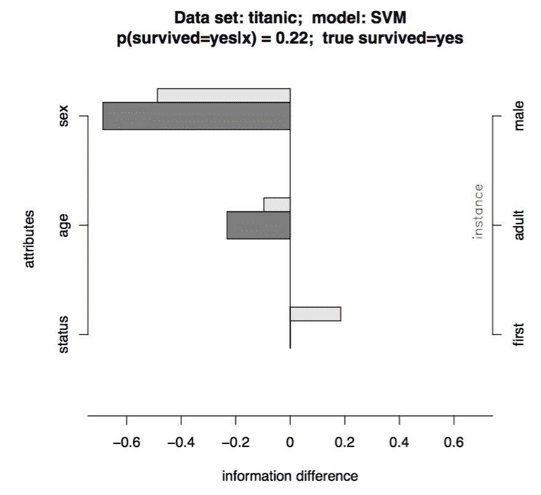
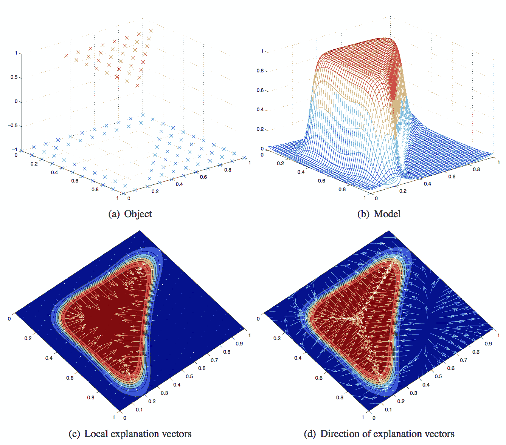
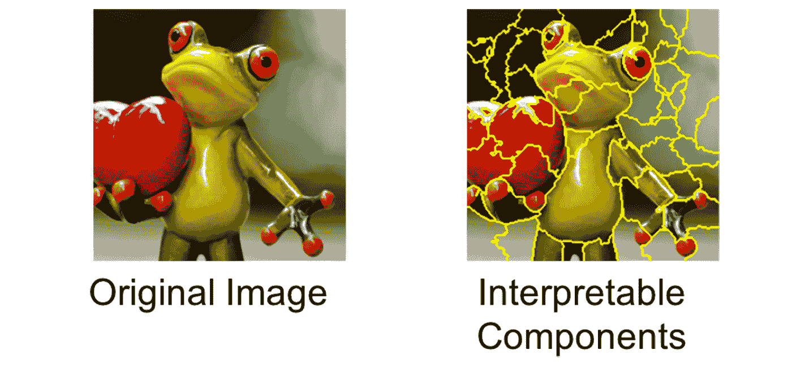
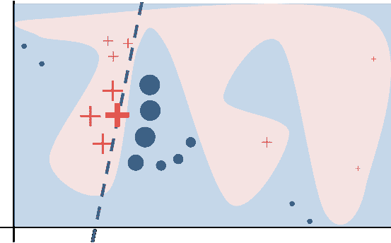
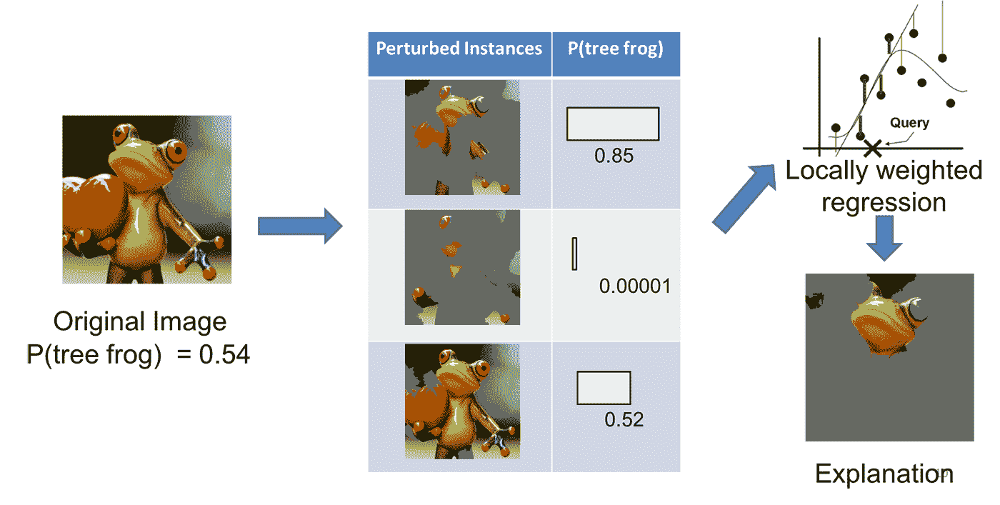
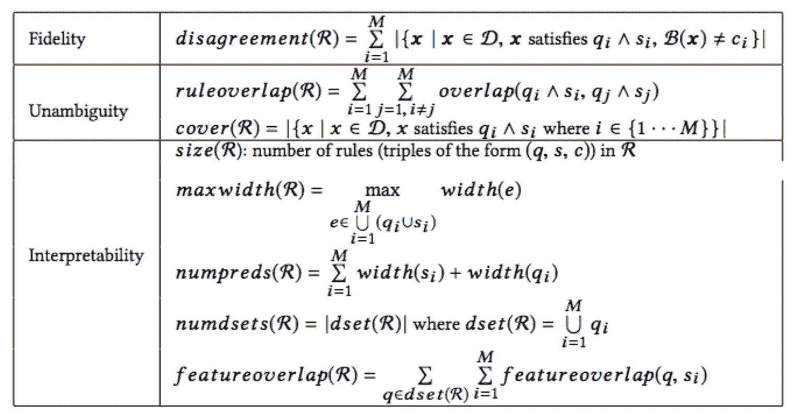
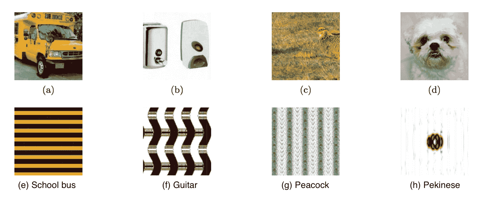

# 如何解释机器学习模型的预测？

> 原文：[`lilianweng.github.io/posts/2017-08-01-interpretation/`](https://lilianweng.github.io/posts/2017-08-01-interpretation/)

机器学习模型已经开始渗透到健康保健、司法系统和金融行业等关键领域。因此，弄清楚模型如何做出决策，并确保决策过程符合种族要求或法律法规成为必要。

与此同时，深度学习模型的快速增长进一步推动了解释复杂模型的需求。人们渴望充分应用人工智能的力量在日常生活的关键方面。然而，如果没有足够对模型的信任或有效的解释意外行为的程序，特别是考虑到深度神经网络是作为*黑匣子*诞生的，这是很困难的。

想象以下情况：

1.  金融行业受到严格监管，贷款发放机构法律要求做出公平决策，并解释他们的信用模型以提供拒绝贷款申请的原因。

1.  医疗诊断模型对人类生命负责。我们如何能够有足够的信心按照黑匣子模型的指示来治疗患者？

1.  在法庭上使用犯罪决策模型来预测再犯风险时，我们必须确保模型以公平、诚实和无歧视的方式运作。

1.  如果自动驾驶汽车突然表现异常，而我们无法解释原因，我们是否会足够放心地在大规模的实际交通中使用这项技术？

在[Affirm](https://www.affirm.com/)，我们每天发放数以万计的分期贷款，当模型拒绝某人的贷款申请时，我们的核保模型必须提供拒绝原因。这是我深入研究并撰写这篇文章的许多动机之一。模型可解释性是机器学习中的一个重要领域。这篇评论并不旨在详尽研究每一项研究，而是作为一个起点。

* * *

# 可解释模型

Lipton (2017)在一篇理论评论论文中总结了可解释模型的特性，[“模型可解释性的神话”](https://arxiv.org/pdf/1606.03490.pdf)：人类可以重复(*“可模拟性”*)计算过程，并完全理解算法(*“算法透明度”*)，模型的每个部分都有直观的解释(*“可分解性”*)。

许多经典模型具有相对简单的形式，并自然地带有特定于模型的解释方法。同时，正在开发新工具来帮助创建更好的可解释模型([Been, Khanna, & Koyejo, 2016](http://papers.nips.cc/paper/6300-examples-are-not-enough-learn-to-criticize-criticism-for-interpretability.pdf); [Lakkaraju, Bach & Leskovec, 2016](http://www.kdd.org/kdd2016/papers/files/rpp1067-lakkarajuA.pdf))。

## 回归

线性回归模型的一般形式是：

$$ y = w_0 + w_1 x_1 + w_2 x_2 + … + w_n x_n $$

系数描述了独立变量增加一个单位时响应的变化。除非特征已经标准化（查看 sklearn.preprocessing.[StandardScaler](http://scikit-learn.org/stable/modules/generated/sklearn.preprocessing.StandardScaler.html#sklearn.preprocessing.StandardScaler)和[RobustScaler](http://scikit-learn.org/stable/modules/generated/sklearn.preprocessing.RobustScaler.html#sklearn.preprocessing.RobustScaler)），否则不能直接比较这些系数，因为不同特征的一个单位可能指的是非常不同的事物。在没有标准化的情况下，乘积$w_i \dot x_i$可以用来量化一个特征对响应的贡献。

## 朴素贝叶斯

朴素贝叶斯之所以被称为“朴素”，是因为它基于一个非常简化的假设，即特征彼此独立，并且每个特征对输出的贡献是独立的。

给定一个特征向量$\mathbf{x} = [x_1, x_2, \dots, x_n]$和一个类别标签$c \in \{1, 2, \dots, C\}$，这个数据点属于这个类别的概率是：

$$ \begin{aligned} p(c | x_1, x_2, \dots, x_n) &\propto p(c, x_1, x_2, \dots, x_n)\\ &\propto p(c) p(x_1 | c) p(x_2 | c) \dots p(x_n | c)\\ &\propto p(c) \prod_{i=1}^n p(x_i | c). \end{aligned} $$

然后定义朴素贝叶斯分类器为：

$$ \hat{y} = \arg\max_{c \in 1, \dots, C} p(c) \prod_{i=1}^n p(x_i | c) $$

因为模型在训练过程中学习了先验$p(x_i \vert c)$，所以通过后验$p(c \vert x_i) = p(c)p(x_i \vert c) / p(x_i)$可以轻松衡量单个特征值的贡献。

## 决策树/决策列表

决策列表是一组布尔函数，通常由`if... then... else...`的语法构建。if 条件包含涉及一个或多个特征和布尔输出的函数。决策列表具有良好的可解释性，并且可以在树结构中可视化。许多关于决策列表的研究都受到医疗应用的推动，其中可解释性几乎与模型本身一样重要。

下面简要描述了几种决策列表类型：

+   [下降规则列表（FRL）](http://proceedings.mlr.press/v38/wang15a.pdf)（Wang 和 Rudin，2015）对特征值完全强制单调性。例如，在二元分类环境中，与每条规则相关的预测$Y=1$的概率随着在决策列表中向下移动而减少。

+   [贝叶斯规则列表（BRL）](https://arxiv.org/abs/1511.01644)（Letham 等人，2015）是一个生成模型，可以产生可能的决策列表的后验分布。

+   [可解释决策集（IDS）](https://cs.stanford.edu/people/jure/pubs/interpretable-kdd16.pdf)（Lakkaraju，Bach＆Leskovec，2016）是一个预测框架，用于创建一组分类规则。学习同时优化准确性和可解释性。IDS 与我稍后将描述的[BETA 方法](https://lilianweng.github.io/posts/2017-08-01-interpretation/#beta-black-box-explanation-through-transparent-approximations)密切相关，用于解释黑匣子模型。

## 随机森林

奇怪的是，许多人认为[随机森林](http://www.math.univ-toulouse.fr/~agarivie/Telecom/apprentissage/articles/randomforest2001.pdf)模型是一个黑匣子，这是不正确的。考虑到随机森林的输出是大量独立决策树的多数投票，而每棵树都是自然可解释的。

如果我们一次查看一棵树，那么很容易评估单个特征的影响。随机森林的全局特征重要性可以通过整个集合中所有树的节点不纯度总减少的平均值来量化（“平均减少不纯度”）。

对于一个实例，因为所有树中的决策路径都被很好地跟踪，我们可以利用父节点和子节点之间数据点均值的差异来近似这次分裂的贡献。在这一系列博客文章中了解更多：[解释随机森林](http://blog.datadive.net/interpreting-random-forests/)。

# 解释黑匣子模型

许多模型并非设计为可解释的。解释黑匣子模型的方法旨在从训练模型中提取信息来证明其预测结果，而不知道模型的详细工作原理。让解释过程独立于模型实现对于现实世界的应用是有益的：即使基础模型不断升级和完善，建立在其之上的解释引擎也不会担心变化。

如果不考虑保持模型透明和可解释性，我们可以通过添加更多参数和非线性计算赋予模型更大的表达能力。这就是深度神经网络在涉及丰富输入的任务中取得成功的方式。

解释的呈现方式没有严格要求，但主要目标主要是回答：**我能相信这个模型吗？** 当我们依赖模型做出关键或生死决定时，我们必须确保模型是可信的。

解释框架应该在两个目标之间取得平衡：

+   **忠实度**：解释产生的预测应尽可能与原始模型一致。

+   **可解释性**：解释应该足够简单以便人类理解。

> 附注：接下来的三种方法是为局部解释而设计的。

## 预测分解

[Robnik-Sikonja 和 Kononenko (2008)](http://lkm.fri.uni-lj.si/rmarko/papers/RobnikSikonjaKononenko08-TKDE.pdf) 提出通过测量原始预测与省略一组特征后的预测之间的差异来解释模型对一个实例的预测。

假设我们需要为一个分类模型 $f: \mathbf{X} \rightarrow \mathbf{Y}$ 生成解释。给定一个数据点 $x \in X$，其中包含属性 $A_i$ 的 $a$ 个单独值，$i = 1, \dots, a$，并且被标记为类别 $y \in Y$。*预测差异* 通过计算知道或不知道 $A_i$ 的情况下模型预测的概率之间的差异来量化：

$$ \text{probDiff}_i (y | x) = p(y| x) - p(y | x \backslash A_i) $$

（该论文还讨论了使用赔率比或基于熵的信息度量来量化预测差异。）

**问题**：如果目标模型输出概率，那很好，获取 $ p(y \vert x) $ 就很简单。否则，模型预测必须经过适当的后建模校准来将预测分数转换为概率。这个校准层是另一个复杂的部分。

**另一个问题**：如果我们通过用缺失值（如 `None`、`NaN` 等）替换 $A_i$ 来生成 $x \backslash A_i$，我们必须依赖模型的内部机制进行缺失值插补。一个用中位数替换这些缺失情况的模型应该与一个插入特殊占位符的模型产生非常不同的输出。论文中提出的一个解决方案是用该特征的所有可能值替换 $A_i$，然后根据每个值在数据中出现的可能性加权求和预测：

$$ \begin{aligned} p(y \vert x \backslash A_i) &= \sum_{s=1}^{m_i} p(A_i=a_s \vert x \backslash A_i) p(y \vert x \leftarrow A_i=a_s) \\ &\approx \sum_{s=1}^{m_i} p(A_i=a_s) p(y \vert x \leftarrow A_i=a_s) \end{aligned} $$

其中 $p(y \vert x \leftarrow A_i=a_s)$ 是在特征向量 $x$ 中用值 $a_s$ 替换特征 $A_i$ 后获得标签 $y$ 的概率。训练集中有 $m_i$ 个唯一值的 $A_i$。

借助省略已知特征时的预测差异度量，我们可以*分解*每个单独特征对预测的影响。



图 1. 对一个 SVM 模型进行解释，该模型预测了[Titanic 数据集](https://www.kaggle.com/c/titanic/data)中一个男性成年头等舱乘客的生存情况。信息差异与概率差异非常相似，但它衡量了在不知道$A\_i$的情况下找出$y$为真所需的信息量：$\text{infDiff}\_i (y|x) = \log\_2 p(y|x) - \log\_2 p(y|x \backslash A\_i)$。特定实例的解释用深色条形图表示。浅色阴影的半高条形图是给定属性值的平均正面和负面解释。在这种情况下，成为男性成年人使得生存的可能性非常小；舱位等级的影响不那么大。

## 局部梯度解释向量

这种方法（[Baehrens 等人，2010](http://www.jmlr.org/papers/volume11/baehrens10a/baehrens10a.pdf)）能够解释任意非线性分类算法所做的局部决策，使用表征数据点如何移动以改变其预测标签的局部梯度。

假设我们有一个[贝叶斯分类器](https://en.wikipedia.org/wiki/Bayes_classifier)，它在数据集$X$上训练，并输出类标签$Y$上的概率，$p(Y=y \vert X=x)$。并且一个类标签$y$从类标签池$\{1, 2, \dots, C\}$中抽取。这个贝叶斯分类器构造如下：

$$ f^{*}(x) = \arg \min_{c \in \{1, \dots, C\}} p(Y \neq c \vert X = x) $$

*局部解释向量*被定义为在测试点$x = x_0$处的概率预测函数的导数。这个向量中的大数值突出显示了对模型决策有很大影响的特征；正号表示增加该特征会降低$x_0$被分配给$f^{*}(x_0)$的概率。

然而，这种方法要求模型输出为概率（类似于上面的[“预测分解”](https://lilianweng.github.io/posts/2017-08-01-interpretation/#prediction-decomposition)方法）。如果原始模型（标记为$f$）没有校准为产生概率怎么办？正如论文建议的，我们可以通过另一个分类器来近似$f$，使其形式类似于贝叶斯分类器$f^{*}$：

(1) 对训练数据应用[Parzen 窗口](https://en.wikipedia.org/?title=Parzen_window&redirect=no)来估计加权类密度：

$$ \hat{p}_{\sigma}(x, y=c) = \frac{1}{n} \sum_{i \in I_c} k_{\sigma} (x - x_i) $$

其中$I_c$是包含由模型$f$分配给类别$c$的数据点索引的索引集，$I_c = \{i \vert f(x_i) = c\}$。$k_{\sigma}$是一个核函数。高斯核是[许多候选中](https://en.wikipedia.org/wiki/Kernel_(statistics)#Kernel_functions_in_common_use)最受欢迎的一个。

(2) 然后，应用贝叶斯规则来近似所有类别的概率$p(Y=c \vert X=x)$：

$$ \begin{aligned} \hat{p}_{\sigma}(y=c | x) &= \frac{\hat{p}_{\sigma}(x, y=c)}{\hat{p}_{\sigma}(x, y=c) + \hat{p}_{\sigma}(x, y \neq c)} \\ &\approx \frac{\sum_{i \in I_c} k_{\sigma} (x - x_i)}{\sum_i k_{\sigma} (x - x_i)} \end{aligned} $$

(3) 最终估计的贝叶斯分类器形式如下：

$$ \hat{f}_{\sigma} = \arg\min_{c \in \{1, \dots, C\}} \hat{p}_{\sigma}(y \neq c \vert x) $$

注意，我们可以使用原始模型 $f$ 生成标记数据，数量不受训练数据大小限制。超参数 $\sigma$ 被选择以优化 $\hat{f}_{\sigma}(x) = f(x)$ 达到高保真度的机会。



图 2\. 展示了如何在简单对象分类中应用局部梯度解释向量与高斯过程分类器（GPC）。GPC 模型自然输出概率。 (a) 显示了训练点及其标签，红色（正 1）和蓝色（负-1）。 (b) 展示了正类别的概率函数。 (c-d) 显示了局部梯度和局部解释向量的方向。

> 附注：正如您所见，上述两种方法都要求模型预测为概率。模型输出的校准增加了另一层复杂性。

## LIME（局部可解释模型无关解释）

[LIME](https://github.com/marcotcr/lime)，简称*局部可解释模型无关解释*，可以在我们感兴趣的预测周围局部近似黑盒模型（[Ribeiro, Singh, & Guestrin, 2016](https://arxiv.org/pdf/1602.04938.pdf)）。

与上述相同，让我们将黑盒模型标记为 $f$。LIME 提出以下步骤：

(1) 将数据集转换为可解释数据表示：$x \Rightarrow x_b$。

+   文本分类器：指示单词存在或不存在的二进制向量

+   图像分类器：指示相似像素块（超像素）存在或不存在的二进制向量。



图 3\. 将图像转换为可解释数据表示的示例。 (图片来源: [www.oreilly.com/learning/introduction-to-local-interpretable-model-agnostic-explanations-lime](https://www.oreilly.com/learning/introduction-to-local-interpretable-model-agnostic-explanations-lime))

(2) 给定一个预测 $f(x)$，对应的可解释数据表示为 $x_b$，让我们围绕 $x_b$ 采样实例，通过均匀随机抽取 $x_b$ 的非零元素，抽取次数也是均匀抽样的。这个过程生成了一个扰动样本 $z_b$，其中包含 $x_b$ 的非零元素的一部分。

然后我们将 $z_b$ 恢复回原始输入 $z$，通过目标模型得到一个预测分数 $f(z)$。

使用许多这样的采样数据点 $z_b \in \mathcal{Z}_b$ 及其模型预测，我们可以学习一个解释模型（例如以回归形式简单表示），具有本地的准确性。根据它们与 $x_b$ 的接近程度，采样数据点被赋予不同的权重。该论文使用了一个 lasso 回归与预处理，事先选择了前 k 个最显著的特征，称为“K-LASSO”。



图 4\. 粉色和蓝色区域是黑盒模型 $f$ 预测的两个类别，大红色十字是要解释的点，其他小十字（被 $f$ 预测为粉色）和点（被 $f$ 预测为蓝色）是采样数据点。即使模型可能非常复杂，我们仍然能够学习一个简单的本地解释模型，如灰色虚线所示。（图片来源：[homes.cs.washington.edu/~marcotcr/blog/lime](https://homes.cs.washington.edu/~marcotcr/blog/lime/)）

检查解释是否合理可以直接决定模型是否值得信赖，因为有时模型可能会捕捉到虚假相关性或泛化。论文中的一个有趣例子是将 LIME 应用于 SVM 文本分类器，用于区分“基督教”和“无神论”。该模型在保留测试集上取得了相当不错的准确率（94%！），但 LIME 解释表明决策是基于非常任意的原因，比如计算单词“re”、“posting”和“host”，这些单词与“基督教”或“无神论”都没有直接联系。经过这样的诊断，我们了解到即使模型给出了不错的准确率，也不能被信任。这也启示了改进模型的方法，比如在文本上进行更好的预处理。



图 5\. 展示如何在图像分类器上使用 LIME。（图片来源：[www.oreilly.com/learning/introduction-to-local-interpretable-model-agnostic-explanations-lime](https://www.oreilly.com/learning/introduction-to-local-interpretable-model-agnostic-explanations-lime)）

欲了解更详细的非论文解释，请阅读作者的[这篇博客文章](https://www.oreilly.com/learning/introduction-to-local-interpretable-model-agnostic-explanations-lime)。非常值得一读。

> 附注：在本地解释模型应该比全局解释模型更容易，但更难维护（考虑到[维度诅咒](https://en.wikipedia.org/wiki/Curse_of_dimensionality)）。下面描述的方法旨在解释整个模型的行为。然而，全局方法无法捕捉细粒度的解释，例如一个特征在这个区域可能很重要，但在另一个区域可能一点都不重要。

## 特征选择

本质上，所有经典的特征选择方法（[Yang and Pedersen, 1997](http://www.surdeanu.info/mihai/teaching/ista555-spring15/readings/yang97comparative.pdf); [Guyon and Elisseeff, 2003](http://www.jmlr.org/papers/volume3/guyon03a/guyon03a.pdf)）都可以被视为全局解释模型的方法。特征选择方法将多个特征的贡献分解，以便我们可以通过各个特征的影响来解释整体模型输出。

有大量关于特征选择的资源，所以我会在本文中跳过这个主题。

## BETA（透明逼近的黑盒解释）

[BETA](https://arxiv.org/abs/1707.01154)，简称*透明逼近的黑盒解释*，与[可解释决策集](https://cs.stanford.edu/people/jure/pubs/interpretable-kdd16.pdf)（Lakkaraju, Bach & Leskovec, 2016）密切相关。BETA 学习一个紧凑的两级决策集，其中每个规则清晰地解释模型行为的一部分。

作者提出了一个新颖的目标函数，使学习过程针对**高忠实度**（解释与模型之间的高一致性）、**低明确性**（解释中决策规则之间的重叠较少）和**高可解释性**（解释决策集轻量且小）进行优化。这些方面被合并为一个目标函数进行优化。



图 6. 一个好的模型解释的要求：忠实度、明确性和可解释性。给定目标模型为$\mathcal{B}$，其解释是一个包含一组规则的两级决策集$\Re$，其中规则为$(q\_1, s\_1, c\_1), \dots, (q\_M, s\_M, c\_M)$，其中$q\_i$和$s\_i$是形式为（特征，运算符，数值）的谓词的合取，$c\_i$是一个类别标签。查看[论文](https://arxiv.org/abs/1707.01154)获取更多细节。（图片来源：[arxiv.org/abs/1707.01154](https://arxiv.org/abs/1707.01154))

# 可解释人工智能

我从 DARPA 项目[“可解释人工智能”](https://www.darpa.mil/program/explainable-artificial-intelligence)中借用了这个部分的名称。这个可解释人工智能（XAI）计划旨在开发更具解释性的模型，并使人类能够理解、适当信任和有效管理新一代人工智能技术的出现。

随着深度学习应用的进展，人们开始担心[即使模型出现问题，我们也可能永远不知道](https://www.technologyreview.com/s/601860/if-a-driverless-car-goes-bad-we-may-never-know-why/)。复杂的结构，大量的可学习参数，非线性数学运算以及[一些有趣的特性](https://arxiv.org/abs/1312.6199) (Szegedy 等人，2014)导致深度神经网络的不可解释性，创造了一个真正的黑匣子。尽管深度学习的力量源于这种复杂性——更灵活地捕捉现实世界数据中丰富而复杂的模式。

对**对抗样本**的研究（[OpenAI 博客：强大的对抗样本](https://blog.openai.com/robust-adversarial-inputs/)，[用对抗样本攻击机器学习](https://blog.openai.com/adversarial-example-research/)，[Goodfellow, Shlens & Szegedy, 2015](https://arxiv.org/pdf/1412.6572.pdf); [Nguyen, Yosinski, & Clune, 2015](http://www.cv-foundation.org/openaccess/content_cvpr_2015/papers/Nguyen_Deep_Neural_Networks_2015_CVPR_paper.pdf))引起了人们对人工智能应用的稳健性和安全性的警示。有时模型可能表现出意外的、意想不到的和不可预测的行为，我们没有快速/良好的策略来解释原因。



图 7. 对抗样本的插图。 (a-d) 是通过在原始图像上添加人类无法察觉的噪音生成的对抗图像（[Szegedy 等人，2013](https://arxiv.org/abs/1312.6199)）。训练良好的神经网络模型可以成功分类原始图像，但无法对对抗图像进行分类。 (e-h) 是生成的模式（[Nguyen, Yosinski & Clune, 2015](http://www.cv-foundation.org/openaccess/content_cvpr_2015/papers/Nguyen_Deep_Neural_Networks_2015_CVPR_paper.pdf)）。训练良好的神经网络模型将它们标记为 (e) 校车，(f) 吉他，(g) 孔雀和 (h) 狮子狗。 (图片来源：[Wang, Raj & Xing, 2017](https://arxiv.org/pdf/1702.07800.pdf))

Nvidia 最近开发了[一种方法来可视化最重要的像素点](https://blogs.nvidia.com/blog/2017/04/27/how-nvidias-neural-net-makes-decisions/)，用于他们的自动驾驶汽车的决策过程。这种可视化提供了关于人工智能思维方式以及系统在操作汽车时依赖的内容的见解。如果人工智能认为重要的内容与人类做出类似决策的方式一致，我们自然会对这个黑匣子模型更有信心。

这个不断发展的领域每天都有许多令人兴奋的新闻和发现。希望我的帖子能给你一些指引，并鼓励你更深入地探究这个主题 :)

* * *

引用为:

```py
@article{weng2017gan,
  title   = "How to Explain the Prediction of a Machine Learning Model?",
  author  = "Weng, Lilian",
  journal = "lilianweng.github.io",
  year    = "2017",
  url     = "https://lilianweng.github.io/posts/2017-08-01-interpretation/"
} 
```

# 参考文献

[1] Zachary C. Lipton. [“模型可解释性的神话。”](https://arxiv.org/pdf/1606.03490.pdf) arXiv 预印本 arXiv:1606.03490 (2016).

[2] Been Kim, Rajiv Khanna, 和 Oluwasanmi O. Koyejo. “Examples are not enough, learn to criticize! criticism for interpretability.” Advances in Neural Information Processing Systems. 2016.

[3] Himabindu Lakkaraju, Stephen H. Bach, 和 Jure Leskovec. [“可解释的决策集：描述和预测的联合框架。”](http://www.kdd.org/kdd2016/papers/files/rpp1067-lakkarajuA.pdf) Proc. 22nd ACM SIGKDD Intl. Conf. on Knowledge Discovery and Data Mining. ACM, 2016.

[4] Robnik-Šikonja, Marko, 和 Igor Kononenko. [“解释个体实例的分类。”](http://lkm.fri.uni-lj.si/rmarko/papers/RobnikSikonjaKononenko08-TKDE.pdf) IEEE Transactions on Knowledge and Data Engineering 20.5 (2008): 589-600.

[5] Baehrens, David, 等. [“如何解释个体分类决策。”](http://www.jmlr.org/papers/volume11/baehrens10a/baehrens10a.pdf) Journal of Machine Learning Research 11.Jun (2010): 1803-1831.

[6] Marco Tulio Ribeiro, Sameer Singh, 和 Carlos Guestrin. [“为什么我应该相信你？：解释任何分类器的预测。”](https://arxiv.org/pdf/1602.04938.pdf) Proc. 22nd ACM SIGKDD Intl. Conf. on Knowledge Discovery and Data Mining. ACM, 2016.

[7] Yiming Yang, 和 Jan O. Pedersen. [“文本分类中特征选择的比较研究。”](http://www.surdeanu.info/mihai/teaching/ista555-spring15/readings/yang97comparative.pdf) Intl. Conf. on Machine Learning. Vol. 97\. 1997.

[8] Isabelle Guyon, 和 André Elisseeff. [“变量和特征选择简介。”](http://www.jmlr.org/papers/volume3/guyon03a/guyon03a.pdf) Journal of Machine Learning Research 3.Mar (2003): 1157-1182.

[9] Ian J. Goodfellow, Jonathon Shlens, 和 Christian Szegedy. [“解释和利用对抗样本。”](https://arxiv.org/pdf/1412.6572.pdf) ICLR 2015.

[10] Christian Szegedy, Wojciech Zaremba, Ilya Sutskever, Joan Bruna, Dumitru Erhan, Ian Goodfellow, Rob Fergus. [“神经网络的有趣特性。”](https://arxiv.org/abs/1312.6199) Intl. Conf. on Learning Representations (2014)

[11] Nguyen, Anh, Jason Yosinski, 和 Jeff Clune. [“深度神经网络很容易被愚弄：对无法识别图像的高置信度预测。”](http://www.cv-foundation.org/openaccess/content_cvpr_2015/papers/Nguyen_Deep_Neural_Networks_2015_CVPR_paper.pdf) Proc. IEEE Conference on Computer Vision and Pattern Recognition. 2015.

[12] Benjamin Letham, Cynthia Rudin, Tyler H. McCormick, 和 David Madigan. [“使用规则和贝叶斯分析的可解释分类器：构建更好的中风预测模型。”](https://arxiv.org/abs/1511.01644) The Annals of Applied Statistics 9, No. 3 (2015): 1350-1371.

[13] Haohan Wang, Bhiksha Raj, 和 Eric P. Xing. [“关于深度学习的起源。”](https://arxiv.org/pdf/1702.07800.pdf) arXiv preprint arXiv:1702.07800 (2017).

[14] [OpenAI 博客：Robust Adversarial Examples](https://blog.openai.com/robust-adversarial-inputs/)

[15] [用对抗样本攻击机器学习](https://blog.openai.com/adversarial-example-research/)

[16] [读懂 AI 汽车的思维：NVIDIA 的神经网络如何做出决策](https://blogs.nvidia.com/blog/2017/04/27/how-nvidias-neural-net-makes-decisions/)
