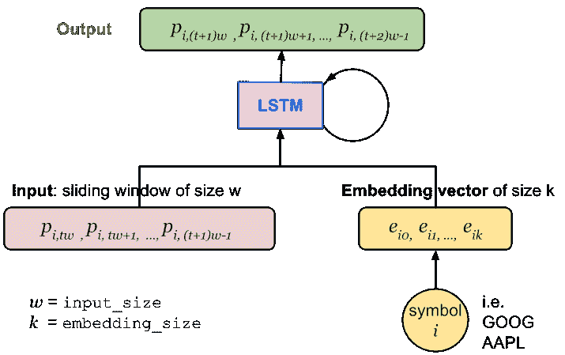
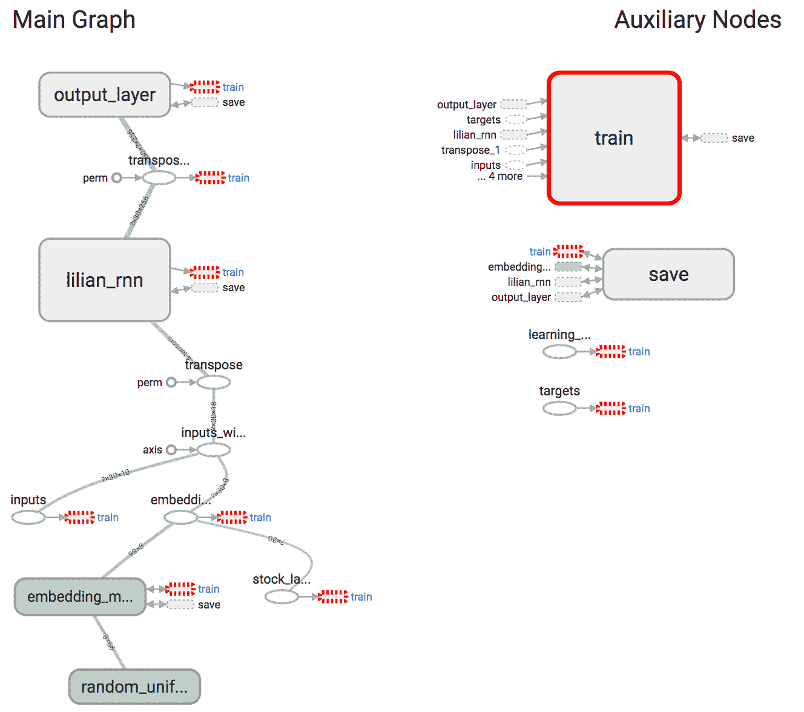
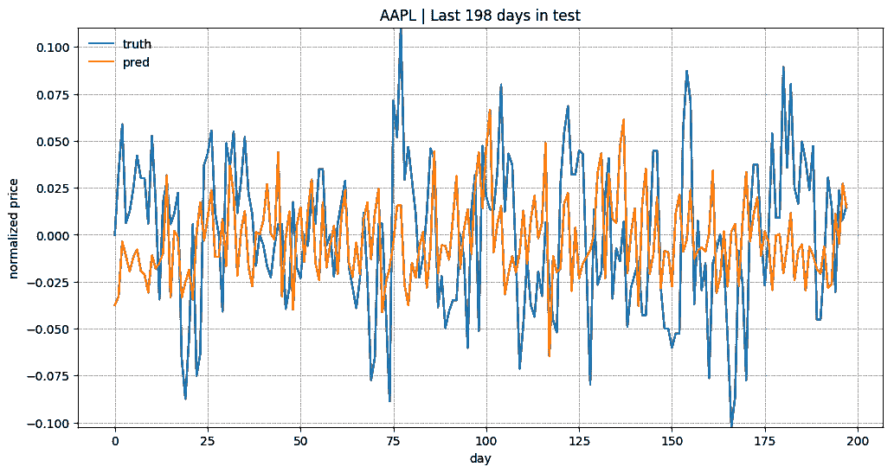
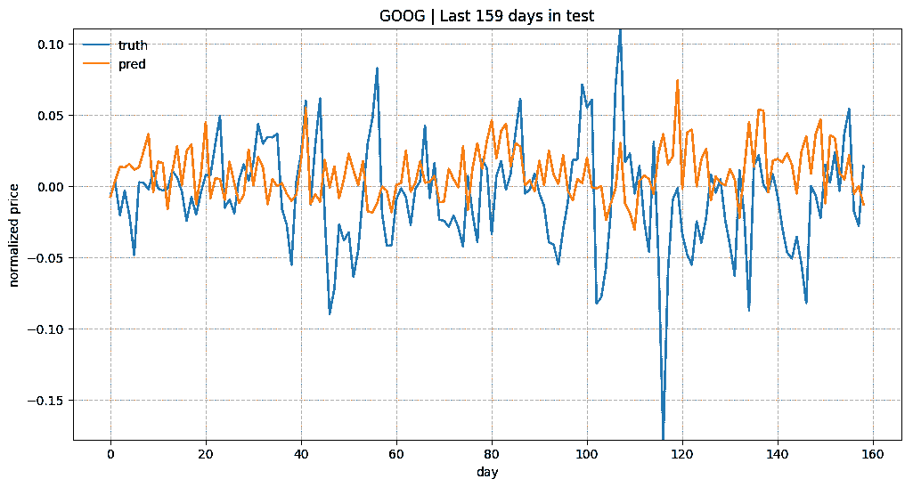
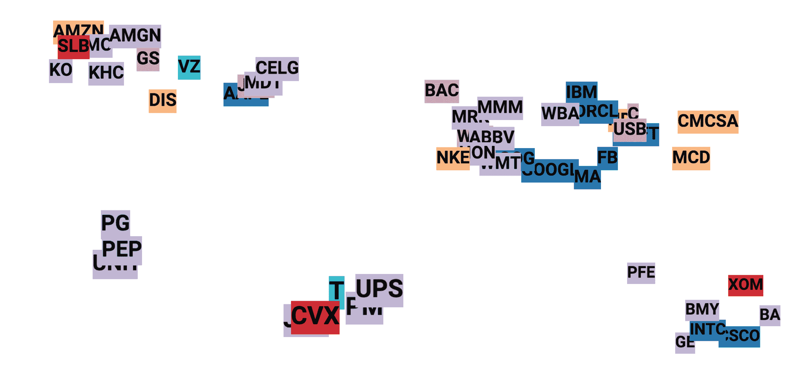
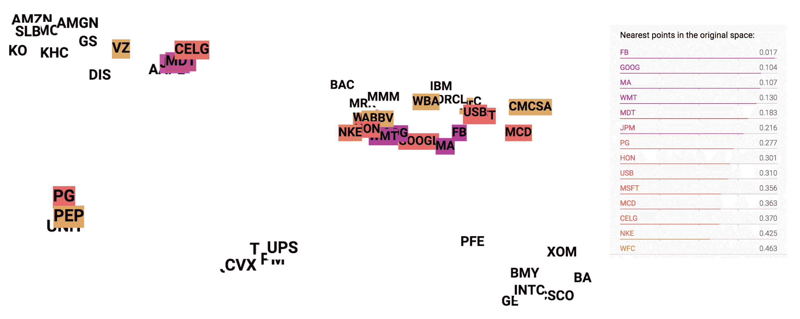

# 使用 RNN 预测股票价格：第 2 部分

> 原文：[`lilianweng.github.io/posts/2017-07-22-stock-rnn-part-2/`](https://lilianweng.github.io/posts/2017-07-22-stock-rnn-part-2/)

在第 2 部分教程中，我想继续讨论股价预测的主题，并赋予我在[第 1 部分](https://lilianweng.github.io/posts/2017-07-08-stock-rnn-part-1/)中构建的递归神经网络具有响应多只股票的能力。为了区分与不同价格序列相关的模式，我使用股票符号嵌入向量作为输入的一部分。

* * *

# 数据集

在搜索过程中，我发现了用于查询 Yahoo! Finance API 的[这个库](https://github.com/lukaszbanasiak/yahoo-finance)。如果 Yahoo 没有关闭历史数据获取 API，这将非常有用。尽管您可能会发现它对查询其他信息也很有用。在这里，我选择了 Google Finance 链接，其中包括[几个免费数据源](https://www.quantshare.com/sa-43-10-ways-to-download-historical-stock-quotes-data-for-free)用于下载历史股价。

数据获取代码可以写得如下所示：

```py
import urllib2 from datetime import datetime BASE_URL = "https://www.google.com/finance/historical?"  "output=csv&q={0}&startdate=Jan+1%2C+1980&enddate={1}" symbol_url = BASE_URL.format(  urllib2.quote('GOOG'), # Replace with any stock you are interested. urllib2.quote(datetime.now().strftime("%b+%d,+%Y"), '+') ) 
```

在获取内容时，请记得添加 try-catch 包装器，以防链接失败或提供的股票符号无效。

```py
try:  f = urllib2.urlopen(symbol_url) with open("GOOG.csv", 'w') as fin: print >> fin, f.read() except urllib2.HTTPError:  print "Fetching Failed: {}".format(symbol_url) 
```

完整的数据获取器代码可以在[这里](https://github.com/lilianweng/stock-rnn/blob/master/data_fetcher.py)找到。

# 模型构建

该模型预计会学习不同股票的价格序列。由于不同的基础模式，我想明确告诉模型它正在处理哪只股票。[嵌入](https://en.wikipedia.org/wiki/Embedding)比独热编码更受青睐，因为：

1.  鉴于训练集包括$N$只股票，独热编码将引入$N$（或$N-1$）个额外的稀疏特征维度。一旦每个股票符号被映射到长度为$k$的更小的嵌入向量，$k \ll N$，我们最终得到一个更压缩的表示和更小的数据集来处理。

1.  由于嵌入向量是要学习的变量。相似的股票可能与相似的嵌入相关联，并有助于彼此的预测，比如“GOOG”和“GOOGL”，您将在图 5 中看到。

在递归神经网络中，在时间步$t$，输入向量包含第$i$只股票的`input_size`（标记为$w$）个每日价格值，$(p_{i, tw}, p_{i, tw+1}, \dots, p_{i, (t+1)w-1})$。股票符号被唯一映射到长度为`embedding_size`的向量（标记为$k$），$(e_{i,0}, e_{i,1}, \dots, e_{i,k})$。如图 1 所示，价格向量与嵌入向量连接，然后输入 LSTM 单元。

另一种选择是将嵌入向量与 LSTM 单元的最后状态连接起来，并在输出层学习新的权重$W$和偏置$b$。然而，通过这种方式，LSTM 单元无法区分一个股票的价格与另一个的价格，其能力将受到很大限制。因此，我决定采用前一种方法。



图 1。具有股票符号嵌入的股价预测 RNN 模型的架构。

`RNNConfig`中添加了两个新的配置设置：

+   `embedding_size`控制每个嵌入向量的大小；

+   `stock_count`指的是数据集中唯一股票的数量。

它们共同定义了嵌入矩阵的大小，模型需要学习`embedding_size` $\times$ `stock_count`个额外变量，与[第 1 部分](https://lilianweng.github.io/posts/2017-07-08-stock-rnn-part-1/)的模型相比。

```py
class RNNConfig():  # ... old ones embedding_size = 3 stock_count = 50 
```

## 定义图形

**— 让我们开始阅读一些代码 —**

(1) 如教程[第 1 部分：定义图形](https://lilianweng.github.io/posts/2017-07-08-stock-rnn-part-1/#define-graph)所示，让我们定义一个名为`lstm_graph`的`tf.Graph()`，以及一组张量来保存输入数据`inputs`、`targets`和`learning_rate`。还需要定义一个占位符，用于存储与输入价格相关联的股票符号列表。股票符号事先已经通过[label encoding](http://scikit-learn.org/stable/modules/generated/sklearn.preprocessing.LabelEncoder.html)映射为唯一整数。

```py
# Mapped to an integer. one label refers to one stock symbol. stock_labels = tf.placeholder(tf.int32, [None, 1]) 
```

(2) 然后我们需要设置一个嵌入矩阵作为查找表，其中包含所有股票的嵌入向量。该矩阵用随机数在区间[-1, 1]内初始化，并在训练过程中进行更新。

```py
# NOTE: config = RNNConfig() and it defines hyperparameters. # Convert the integer labels to numeric embedding vectors. embedding_matrix = tf.Variable(  tf.random_uniform([config.stock_count, config.embedding_size], -1.0, 1.0) ) 
```

(3) 重复股票标签`num_steps`次，以匹配 RNN 的展开版本和训练期间`inputs`张量的形状。转换操作[tf.tile](https://www.tensorflow.org/api_docs/python/tf/tile)接收一个基本张量，并通过多次复制其特定维度来创建一个新张量；准确地说，输入张量的第$i$维将被`multiples[i]`倍。例如，如果`stock_labels`是`[[0], [0], [2], [1]]`，通过`[1, 5]`进行平铺将产生`[[0 0 0 0 0], [0 0 0 0 0], [2 2 2 2 2], [1 1 1 1 1]]`。

```py
stacked_stock_labels = tf.tile(stock_labels, multiples=[1, config.num_steps]) 
```

(4) 然后根据查找表`embedding_matrix`将符号映射为嵌入向量。

```py
# stock_label_embeds.get_shape() = (?, num_steps, embedding_size). stock_label_embeds = tf.nn.embedding_lookup(embedding_matrix, stacked_stock_labels) 
```

(5) 最后，将价格值与嵌入向量组合起来。操作[tf.concat](https://www.tensorflow.org/api_docs/python/tf/concat)沿着维度`axis`连接张量列表。在我们的情况下，我们希望保持批量大小和步数数量不变，只是扩展长度为`input_size`的输入向量以包含嵌入特征。

```py
# inputs.get_shape() = (?, num_steps, input_size) # stock_label_embeds.get_shape() = (?, num_steps, embedding_size) # inputs_with_embeds.get_shape() = (?, num_steps, input_size + embedding_size) inputs_with_embeds = tf.concat([inputs, stock_label_embeds], axis=2) 
```

代码的其余部分运行动态 RNN，提取 LSTM 单元的最后状态，并处理输出层中的权重和偏差。有关详细信息，请参阅[第 1 部分：定义图表](https://lilianweng.github.io/posts/2017-07-08-stock-rnn-part-1/#define-graph)。

## 训练会话

如果您还没有阅读过如何在 Tensorflow 中运行训练会话，请阅读[第 1 部分：开始训练会话](https://lilianweng.github.io/posts/2017-07-08-stock-rnn-part-1/#start-training-session)。

在将数据输入图表之前，股票符号应通过[label encoding](http://scikit-learn.org/stable/modules/generated/sklearn.preprocessing.LabelEncoder.html)转换为唯一整数。

```py
from sklearn.preprocessing import LabelEncoder label_encoder = LabelEncoder() label_encoder.fit(list_of_symbols) 
```

训练/测试拆分比例保持不变，每支个股的训练占 90%，测试占 10%。

## 可视化图表

在代码中定义图表后，让我们在 Tensorboard 中检查可视化，以确保组件构建正确。基本上，它看起来非常像我们在图 1 中的架构图。



图 2. 上述定义的图表的 Tensorboard 可视化。主图表中已删除两个模块，“train”和“save”。

除了展示图表结构或跟踪变量随时间的变化外，Tensorboard 还支持[**嵌入可视化**](https://www.tensorflow.org/get_started/embedding_viz)。为了将嵌入值传达给 Tensorboard，我们需要在训练日志中添加适当的跟踪。

(0) 在我的嵌入可视化中，我希望用行业部门对每支股票进行着色。此元数据应存储在 csv 文件中。该文件有两列，股票符号和行业部门。csv 文件是否有标题并不重要，但所列股票的顺序必须与`label_encoder.classes_`一致。

```py
import csv embedding_metadata_path = os.path.join(your_log_file_folder, 'metadata.csv') with open(embedding_metadata_path, 'w') as fout:  csv_writer = csv.writer(fout) # write the content into the csv file. # for example, csv_writer.writerows(["GOOG", "information_technology"]) 
```

(1) 首先在训练`tf.Session`中设置摘要写入器。

```py
from tensorflow.contrib.tensorboard.plugins import projector with tf.Session(graph=lstm_graph) as sess:  summary_writer = tf.summary.FileWriter(your_log_file_folder) summary_writer.add_graph(sess.graph) 
```

(2) 将我们图表`lstm_graph`中定义的张量`embedding_matrix`添加到投影仪配置变量中，并附加元数据 csv 文件。

```py
 projector_config = projector.ProjectorConfig() # You can add multiple embeddings. Here we add only one. added_embedding = projector_config.embeddings.add() added_embedding.tensor_name = embedding_matrix.name # Link this tensor to its metadata file. added_embedding.metadata_path = embedding_metadata_path 
```

(3) 此行在文件夹`your_log_file_folder`中创建一个文件`projector_config.pbtxt`。TensorBoard 将在启动时读取此文件。

```py
 projector.visualize_embeddings(summary_writer, projector_config) 
```

# 结果

该模型是使用标普 500 指数中市值最大的前 50 支股票进行训练的。

（在[github.com/lilianweng/stock-rnn](https://github.com/lilianweng/stock-rnn)内运行以下命令）

```py
python main.py --stock_count=50 --embed_size=3 --input_size=3 --max_epoch=50 --train 
```

以下配置被使用：

```py
stock_count = 100
input_size = 3
embed_size = 3
num_steps = 30
lstm_size = 256
num_layers = 1
max_epoch = 50
keep_prob = 0.8
batch_size = 64
init_learning_rate = 0.05
learning_rate_decay = 0.99
init_epoch = 5 
```

## 价格预测

简要概述预测质量，图 3 绘制了“KO”、“AAPL”、“GOOG”和“NFLX”测试数据的预测。真实值和预测之间的总体趋势相匹配。考虑到预测任务的设计方式，模型依赖于所有历史数据点来预测接下来的 5（`input_size`）天。使用较小的`input_size`，模型不需要担心长期增长曲线。一旦我们增加`input_size`，预测将变得更加困难。

  

图 3. AAPL、MSFT 和 GOOG 在测试集中的真实和预测股价。价格在连续预测滑动窗口中进行了归一化处理（参见[第 1 部分：归一化](https://lilianweng.github.io/posts/2017-07-08-stock-rnn-part-1/#normalization)）。为了更好地比较真实和预测的趋势，y 轴值乘以 5。

## 嵌入可视化

一种常见的可视化嵌入空间中聚类的技术是[t-SNE](https://en.wikipedia.org/wiki/T-distributed_stochastic_neighbor_embedding)（[Maaten 和 Hinton, 2008](http://www.jmlr.org/papers/volume9/vandermaaten08a/vandermaaten08a.pdf)），在 Tensorboard 中得到很好的支持。t-SNE，即“t-分布随机邻域嵌入”，是随机邻域嵌入的一种变体（[Hinton 和 Roweis, 2002](http://www.cs.toronto.edu/~fritz/absps/sne.pdf)），但具有修改后的成本函数，更容易优化。

1.  与 SNE 类似，t-SNE 首先将数据点之间的高维欧氏距离转换为表示相似性的条件概率。

1.  t-SNE 在低维空间中定义了与数据点类似的概率分布，并最小化了两个分布之间的[Kullback–Leibler 散度](https://en.wikipedia.org/wiki/Kullback%E2%80%93Leibler_divergence)，以便确定地图上点的位置。

查看[此文章](http://distill.pub/2016/misread-tsne/)了解如何调整 t-SNE 可视化中的参数，困惑度和学习率（epsilon）。



图 4. 使用 t-SNE 可视化股票嵌入。每个标签根据股票行业部门进行着色。我们有 5 个聚类。有趣的是，GOOG、GOOGL 和 FB 属于同一聚类，而 AMZN 和 AAPL 属于另一个聚类。

在嵌入空间中，我们可以通过检查它们的嵌入向量之间的相似性来衡量两只股票之间的相似性。例如，在学习的嵌入中，GOOG 与 GOOGL 最相似（见图 5）。



图 5. 在嵌入可视化图中点击“GOOG”，并用从深到浅的颜色突出显示前 20 个相似的邻居，随着相似性的降低颜色逐渐变浅。

## 已知问题

+   随着训练的进行，预测值会减少并趋于平缓。这就是为什么我在图 3 中将绝对值乘以一个常数，以便更清晰地看到趋势，因为我更关心预测的涨跌方向是否正确。然而，预测值减少的问题肯定有原因。可能不是使用简单的均方误差作为损失，我们可以采用另一种形式的损失函数，在预测方向错误时进行更多的惩罚。

+   损失函数一开始下降得很快，但偶尔会出现数值爆炸（突然出现峰值然后立即回落）。我怀疑这也与损失函数的形式有关。一个更新和更智能的损失函数可能能够解决这个问题。

本教程中的完整代码可在[github.com/lilianweng/stock-rnn](https://github.com/lilianweng/stock-rnn)找到。
