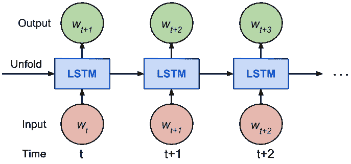
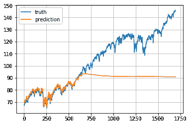
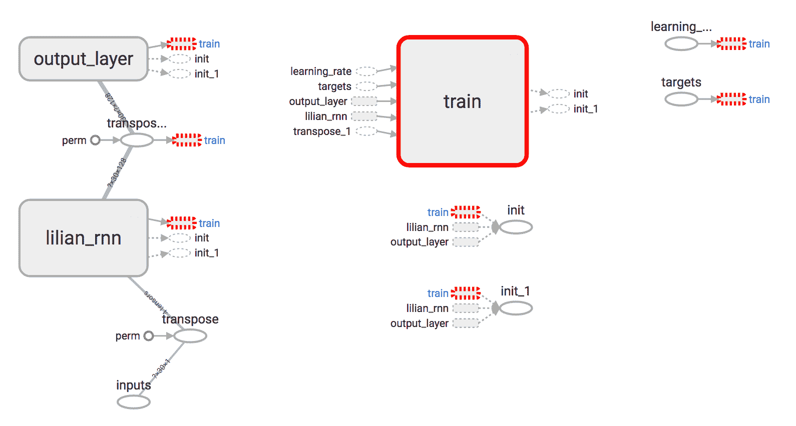
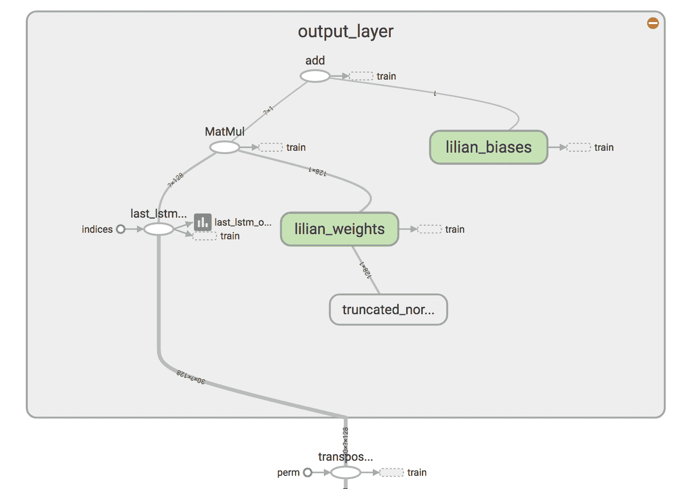
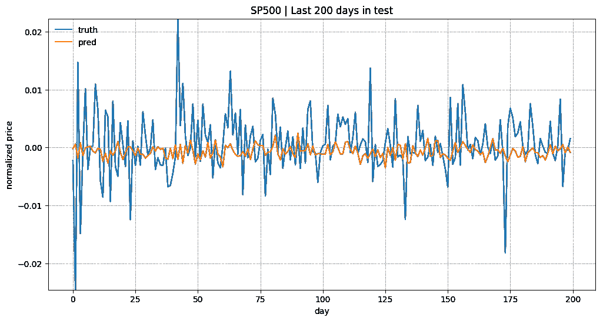
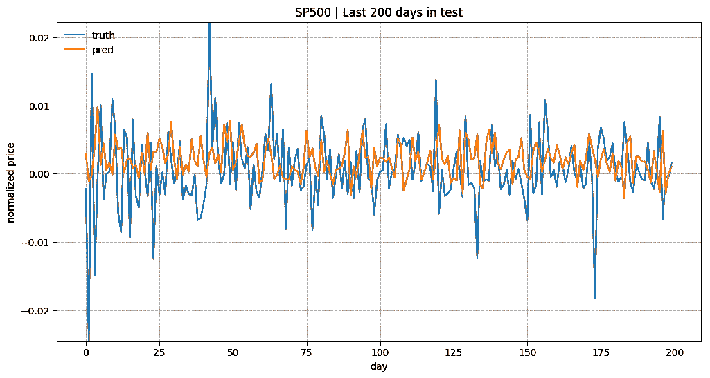
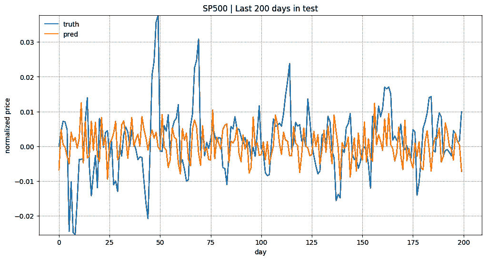

# 使用 RNN 预测股价：第 1 部分

> 原文：[`lilianweng.github.io/posts/2017-07-08-stock-rnn-part-1/`](https://lilianweng.github.io/posts/2017-07-08-stock-rnn-part-1/)

这是一个关于如何使用 Tensorflow 构建递归神经网络来预测股市价格的教程。完整的可运行代码可在[github.com/lilianweng/stock-rnn](https://github.com/lilianweng/stock-rnn)中找到。如果你不知道什么是递归神经网络或 LSTM 单元，可以查看[我的先前文章](https://lilianweng.github.io/posts/2017-06-21-overview/#recurrent-neural-network)。

> *我想强调一件事，因为我撰写这篇文章的动机更多地是为了演示如何在 Tensorflow 中构建和训练 RNN 模型，而不是解决股票预测问题，所以我没有努力改进预测结果。欢迎参考我的[代码](https://github.com/lilianweng/stock-rnn)，并添加更多与股票预测相关的想法来改进它。祝好！*

# 现有教程概述

互联网上有许多教程，比如：

+   [一个新手实现 RNN-LSTM 使用 Tensorflow 的指南](http://monik.in/a-noobs-guide-to-implementing-rnn-lstm-using-tensorflow/)

+   [TensorFlow RNN 教程](https://svds.com/tensorflow-rnn-tutorial/)

+   [使用 Tensorflow 示例的 LSTM](https://medium.com/towards-data-science/lstm-by-example-using-tensorflow-feb0c1968537)

+   [如何在 TensorFlow 中构建递归神经网络](https://medium.com/@erikhallstrm/hello-world-rnn-83cd7105b767)

+   [Tensorflow 中的 RNN，实用指南和未记录的功能](http://www.wildml.com/2016/08/rnns-in-tensorflow-a-practical-guide-and-undocumented-features/)

+   [使用 TensorFlow 进行序列预测的递归神经网络(LSTM)](http://mourafiq.com/2016/05/15/predicting-sequences-using-rnn-in-tensorflow.html)

+   [任何人都可以学会用 Python 编写 LSTM-RNN](https://iamtrask.github.io/2015/11/15/anyone-can-code-lstm/)

+   [如何使用 RNNs、TensorFlow 和 Cloud ML Engine 进行时间序列预测](https://medium.com/google-cloud/how-to-do-time-series-prediction-using-rnns-and-tensorflow-and-cloud-ml-engine-2ad2eeb189e8)

尽管存在这些现有教程，我仍然想写一个新的主要有三个原因：

1.  早期的教程已经无法适应新版本了，因为 Tensorflow 仍在开发中，API 接口的变化很快。

1.  许多教程在示例中使用合成数据。嗯，我想要使用真实世界的数据来尝试。

1.  一些教程假设你事先了解 Tensorflow API 的一些内容，这使得阅读有点困难。

阅读了一堆例子后，我建议从 Penn Tree Bank（PTB）数据集中的[官方示例](https://github.com/tensorflow/models/tree/master/tutorials/rnn/ptb)开始。PTB 示例展示了一个漂亮且模块化设计模式的 RNN 模型，但这可能会阻碍你轻松理解模型结构。因此，在这里我将以非常直接的方式构建图形。

# 目标

我将解释如何使用带有 LSTM 单元的 RNN 模型来预测标准普尔 500 指数的价格。数据集可以从[Yahoo! Finance ^GSPC](https://finance.yahoo.com/quote/%5EGSPC/history?p=%5EGSPC)下载。在以下示例中，我使用了从 1950 年 1 月 3 日（Yahoo! Finance 能够追溯到的最大日期）到 2017 年 6 月 23 日的标准普尔 500 数据。数据集每天提供几个价格点。为简单起见，我们将仅使用每日的**收盘价**进行预测。同时，我将演示如何使用[TensorBoard](https://www.tensorflow.org/get_started/summaries_and_tensorboard)进行轻松调试和模型跟踪。

简要回顾：递归神经网络（RNN）是一种具有隐藏层自环的人工神经网络类型，这使得 RNN 能够利用隐藏神经元的先前状态来学习给定新输入时的当前状态。RNN 擅长处理序列数据。长短期记忆（LSTM）单元是一种特别设计的工作单元，帮助 RNN 更好地记忆长期上下文。

欲了解更深入的信息，请阅读[我的先前文章](https://lilianweng.github.io/posts/2017-06-21-overview/#recurrent-neural-network)或[这篇精彩的文章](http://colah.github.io/posts/2015-08-Understanding-LSTMs/)。

# 数据准备

股票价格是一个长度为$N$的时间序列，定义为$p_0, p_1, \dots, p_{N-1}$，其中$p_i$是第$i$天的收盘价，$0 \le i < N$。想象一下，我们有一个固定大小为$w$的滑动窗口（稍后，我们将称之为`input_size`），每次我们将窗口向右移动$w$的大小，以便所有滑动窗口中的数据之间没有重叠。


图 1。标准普尔 500 指数的价格随时间变化。我们使用一个滑动窗口中的内容来预测下一个窗口的内容，而两个连续窗口之间没有重叠。

我们即将构建的 RNN 模型以 LSTM 单元作为基本隐藏单元。我们使用从第一个滑动窗口$W_0$一直到时间$t$的窗口$W_t$中的值：

$$ \begin{aligned} W_0 &= (p_0, p_1, \dots, p_{w-1}) \\ W_1 &= (p_w, p_{w+1}, \dots, p_{2w-1}) \\ \dots \\ W_t &= (p_{tw}, p_{tw+1}, \dots, p_{(t+1)w-1}) \end{aligned} $$

来预测接下来窗口$w_{t+1}$中的价格：

$$ W_{t+1} = (p_{(t+1)w}, p_{(t+1)w+1}, \dots, p_{(t+2)w-1}) $$

本质上，我们试图学习一个近似函数，$f(W_0, W_1, \dots, W_t) \approx W_{t+1}$。



图 2 RNN 的展开版本。

考虑到[时间反向传播（BPTT）](https://en.wikipedia.org/wiki/Backpropagation_through_time)的工作原理，我们通常以“展开”的方式训练 RNN，这样我们就不必进行太远的传播计算，从而简化训练过程。

这里是来自 Tensorflow 教程关于`num_steps`的解释：

> 按设计，循环神经网络（RNN）的输出取决于任意远的输入。不幸的是，这使得反向传播计算变得困难。为了使学习过程可行，通常会创建网络的“展开”版本，其中包含固定数量（`num_steps`）的 LSTM 输入和输出。然后在这个有限的 RNN 近似上进行训练。这可以通过每次输入长度为`num_steps`的输入并在每个这样的输入块之后执行反向传播来实现。

价格序列首先被分割成不重叠的小窗口。每个窗口包含`input_size`个数字，每个被视为一个独立的输入元素。然后，任何连续的`num_steps`个输入元素被分组成一个训练输入，形成了一个用于在 Tensorfow 上训练的**“展开”**版本的 RNN。相应的标签是它们之后的输入元素。

例如，如果`input_size=3`和`num_steps=2`，我的前几个训练示例会是这样的：

$$ \begin{aligned} \text{Input}_1 &= [[p_0, p_1, p_2], [p_3, p_4, p_5]]\quad\text{Label}_1 = [p_6, p_7, p_8] \\ \text{Input}_2 &= [[p_3, p_4, p_5], [p_6, p_7, p_8]]\quad\text{Label}_2 = [p_9, p_{10}, p_{11}] \\ \text{Input}_3 &= [[p_6, p_7, p_8], [p_9, p_{10}, p_{11}]]\quad\text{Label}_3 = [p_{12}, p_{13}, p_{14}] \end{aligned} $$

这里是数据格式化的关键部分：

```py
seq = [np.array(seq[i * self.input_size: (i + 1) * self.input_size])  for i in range(len(seq) // self.input_size)]   # Split into groups of `num_steps` X = np.array([seq[i: i + self.num_steps] for i in range(len(seq) - self.num_steps)]) y = np.array([seq[i + self.num_steps] for i in range(len(seq) - self.num_steps)]) 
```

数据格式化的完整代码在[这里](https://github.com/lilianweng/stock-rnn/blob/master/data_wrapper.py)。

## 训练/测试分割

由于我们总是想要预测未来，我们将最新的 10%数据作为测试数据。

## 归一化

标普 500 指数随时间增长，导致测试集中的大多数值超出了训练集的范围，因此模型必须*预测它从未见过的一些数字*。遗憾而不足为奇的是，它表现得很糟糕。见图 3。



图 3 当 RNN 模型必须预测超出训练数据范围的数字时的一个非常悲伤的例子。

为了解决尺度不一致的问题，我在每个滑动窗口中对价格进行了归一化处理。任务变成了预测相对变化率而不是绝对值。在时间$t$的归一化滑动窗口$W’_t$中，所有的值都被最后一个未知价格——$W_{t-1}$中的最后一个价格所除：

$$ W’_t = (\frac{p_{tw}}{p_{tw-1}}, \frac{p_{tw+1}}{p_{tw-1}}, \dots, \frac{p_{(t+1)w-1}}{p_{tw-1}} ) $$

这里有一个数据存档[stock-data-lilianweng.tar.gz](https://drive.google.com/open?id=1QKVkiwgCNJsdQMEsfoi6KpqoPgc4O6DD)，包含我在 2017 年 7 月之前爬取的标普 500 股票价格。随意使用它 :)

# 模型构建

## 定义

+   `lstm_size`: 一个 LSTM 层中的单元数。

+   `num_layers`: 堆叠的 LSTM 层数。

+   `keep_prob`: 在[dropout](https://www.cs.toronto.edu/~hinton/absps/JMLRdropout.pdf)操作中保留的细胞单位的百分比。

+   `init_learning_rate`: 起始学习率。

+   `learning_rate_decay`: 后续训练 epoch 中的衰减比率。

+   `init_epoch`: 使用恒定`init_learning_rate`的迭代次数。

+   `max_epoch`: 训练中的总迭代次数

+   `input_size`: 滑动窗口/一个训练数据点的大小

+   `batch_size`: 一个小批次中要使用的数据点数量。

LSTM 模型有`num_layers`个堆叠的 LSTM 层，每个层包含`lstm_size`个 LSTM 单元。然后，对每个 LSTM 单元的输出应用保留概率为`keep_prob`的[dropout](https://www.cs.toronto.edu/~hinton/absps/JMLRdropout.pdf)掩码。dropout 的目标是消除对某一维度的潜在强依赖，以防止过拟合。

训练总共需要`max_epoch`个迭代；一个[epoch](http://www.fon.hum.uva.nl/praat/manual/epoch.html)是所有训练数据点的完整遍历。在一个 epoch 中，训练数据点被分成大小为`batch_size`的小批次。我们将一个小批次发送到模型进行一次 BPTT 学习。在前`init_epoch`个 epoch 期间，学习率设置为`init_learning_rate`，然后在每个后续 epoch 中按$\times$ `learning_rate_decay`衰减。

```py
# Configuration is wrapped in one object for easy tracking and passing. class RNNConfig():  input_size=1 num_steps=30 lstm_size=128 num_layers=1 keep_prob=0.8 batch_size = 64 init_learning_rate = 0.001 learning_rate_decay = 0.99 init_epoch = 5 max_epoch = 50   config = RNNConfig() 
```

## 定义图

一个[`tf.Graph`](https://www.tensorflow.org/api_docs/python/tf/Graph)没有连接到任何真实数据。它定义了如何处理数据以及如何运行计算的流程。稍后，这个图可以在[`tf.session`](https://www.tensorflow.org/api_docs/python/tf/Session)中被输入数据，并且此时计算会真正发生。

**— 让我们开始阅读一些代码 —**

(1) 首先初始化一个新图。

```py
import tensorflow as tf tf.reset_default_graph() lstm_graph = tf.Graph() 
```

(2) 图的工作原理应在其范围内定义。

```py
with lstm_graph.as_default(): 
```

(3) 定义计算所需的数据。在这里，我们需要三个输入变量，全部定义为[`tf.placeholder`](https://www.tensorflow.org/versions/master/api_docs/python/tf/placeholder)，因为在图构建阶段我们不知道它们是什么。

+   `inputs`: 训练数据*X*，一个形状为(# 数据示例，`num_steps`，`input_size`)的张量；数据示例的数量未知，因此为`None`。在我们的情况下，它将在训练会话中成为`batch_size`。如果感到困惑，请查看 input format example。

+   `targets`: 训练标签*y*，一个形状为(# 数据示例，`input_size`)的张量。

+   `learning_rate`: 一个简单的浮点数。

```py
 # Dimension = ( #     number of data examples, #     number of input in one computation step, #     number of numbers in one input # ) # We don't know the number of examples beforehand, so it is None. inputs = tf.placeholder(tf.float32, [None, config.num_steps, config.input_size]) targets = tf.placeholder(tf.float32, [None, config.input_size]) learning_rate = tf.placeholder(tf.float32, None) 
```

(4) 此函数返回一个带有或不带有 dropout 操作的[LSTMCell](https://www.tensorflow.org/versions/r1.0/api_docs/python/tf/contrib/rnn/LSTMCell)。

```py
 def _create_one_cell(): return tf.contrib.rnn.LSTMCell(config.lstm_size, state_is_tuple=True) if config.keep_prob < 1.0: return tf.contrib.rnn.DropoutWrapper(lstm_cell, output_keep_prob=config.keep_prob) 
```

(5) 如果需要，让我们将单元格堆叠成多个层。`MultiRNNCell`有助于将多个简单单元格按顺序连接起来组成一个单元格。

```py
 cell = tf.contrib.rnn.MultiRNNCell( [_create_one_cell() for _ in range(config.num_layers)], state_is_tuple=True ) if config.num_layers > 1 else _create_one_cell() 
```

(6) [`tf.nn.dynamic_rnn`](https://www.tensorflow.org/api_docs/python/tf/nn/dynamic_rnn)构建由`cell`（RNNCell）指定的递归神经网络。默认情况下，它返回一对（模型输出，状态），其中输出`val`的大小为（`batch_size`，`num_steps`，`lstm_size`）。状态指的是 LSTM 单元格的当前状态，在此处未使用。

```py
 val, _ = tf.nn.dynamic_rnn(cell, inputs, dtype=tf.float32) 
```

(7) [`tf.transpose`](https://www.tensorflow.org/api_docs/python/tf/transpose)将输出从维度（`batch_size`，`num_steps`，`lstm_size`）转换为（`num_steps`，`batch_size`，`lstm_size`）。然后选择最后一个输出。

```py
 # Before transpose, val.get_shape() = (batch_size, num_steps, lstm_size) # After transpose, val.get_shape() = (num_steps, batch_size, lstm_size) val = tf.transpose(val, [1, 0, 2]) # last.get_shape() = (batch_size, lstm_size) last = tf.gather(val, int(val.get_shape()[0]) - 1, name="last_lstm_output") 
```

(8) 定义隐藏层和输出层之间的权重和偏置。

```py
 weight = tf.Variable(tf.truncated_normal([config.lstm_size, config.input_size])) bias = tf.Variable(tf.constant(0.1, shape=[config.input_size])) prediction = tf.matmul(last, weight) + bias 
```

(9) 我们使用均方误差作为损失度量，并使用[the RMSPropOptimizer 算法](http://www.cs.toronto.edu/~tijmen/csc321/slides/lecture_slides_lec6.pdf)进行梯度下降优化。

```py
 loss = tf.reduce_mean(tf.square(prediction - targets)) optimizer = tf.train.RMSPropOptimizer(learning_rate) minimize = optimizer.minimize(loss) 
```

## 开始训练会话

(1) 要开始使用真实数据训练图形，我们首先需要启动一个[`tf.session`](https://www.tensorflow.org/api_docs/python/tf/Session)。

```py
with tf.Session(graph=lstm_graph) as sess: 
```

(2) 根据定义初始化变量。

```py
 tf.global_variables_initializer().run() 
```

(0) 训练时期的学习率应该事先计算好。索引指的是时期索引。

```py
learning_rates_to_use = [  config.init_learning_rate * ( config.learning_rate_decay ** max(float(i + 1 - config.init_epoch), 0.0) ) for i in range(config.max_epoch)] 
```

(3) 下面的每个循环完成一个时期的训练。

```py
 for epoch_step in range(config.max_epoch): current_lr = learning_rates_to_use[epoch_step]  # Check https://github.com/lilianweng/stock-rnn/blob/master/data_wrapper.py # if you are curious to know what is StockDataSet and how generate_one_epoch() # is implemented. for batch_X, batch_y in stock_dataset.generate_one_epoch(config.batch_size): train_data_feed = { inputs: batch_X, targets: batch_y, learning_rate: current_lr } train_loss, _ = sess.run([loss, minimize], train_data_feed) 
```

(4) 不要忘记在最后保存您训练好的模型。

```py
 saver = tf.train.Saver() saver.save(sess, "your_awesome_model_path_and_name", global_step=max_epoch_step) 
```

完整的代码在[这里](https://github.com/lilianweng/stock-rnn/blob/master/build_graph.py)可用。

## 使用 TensorBoard

在没有可视化的情况下构建图形就像在黑暗中绘画，非常模糊且容易出错。[Tensorboard](https://github.com/tensorflow/tensorboard)提供了图形结构和学习过程的简单可视化。查看这个[实践教程](https://youtu.be/eBbEDRsCmv4)，只需 20 分钟，但非常实用，并展示了几个实时演示。

**简要总结**

+   使用`with [tf.name_scope](https://www.tensorflow.org/api_docs/python/tf/name_scope)("your_awesome_module_name"):`将致力于相似目标的元素包装在一起。

+   许多`tf.*`方法接受`name=`参数。分配一个自定义名称可以在阅读图时使您的生活更轻松。

+   像[`tf.summary.scalar`](https://www.tensorflow.org/api_docs/python/tf/summary/scalar)和[`tf.summary.histogram`](https://www.tensorflow.org/api_docs/python/tf/summary/histogram)这样的方法有助于在迭代过程中跟踪图中变量的值。

+   在培训会话中，使用[`tf.summary.FileWriter`](https://www.tensorflow.org/api_docs/python/tf/summary/FileWriter)定义一个日志文件。

```py
with tf.Session(graph=lstm_graph) as sess:  merged_summary = tf.summary.merge_all() writer = tf.summary.FileWriter("location_for_keeping_your_log_files", sess.graph) writer.add_graph(sess.graph) 
```

稍后，将训练进度和摘要结果写入文件。

```py
_summary = sess.run([merged_summary], test_data_feed) writer.add_summary(_summary, global_step=epoch_step)  # epoch_step in range(config.max_epoch) 
```



图 4a 由示例代码构建的 RNN 图。"train"模块已从主图中"移除"，因为在预测时不是模型的真正部分。



图 4b 点击"output_layer"模块以展开并详细检查结构。

完整的工作代码可在[github.com/lilianweng/stock-rnn](https://github.com/lilianweng/stock-rnn)中找到。

# 结果

我在实验中使用了以下配置。

```py
num_layers=1 keep_prob=0.8 batch_size = 64 init_learning_rate = 0.001 learning_rate_decay = 0.99 init_epoch = 5 max_epoch = 100 num_steps=30 
```

（感谢 Yury 发现了我在价格归一化中的一个错误。我最终使用了同一时间窗口中的最后价格，而不是使用前一个时间窗口的最后价格。以下图表已经更正。）

总体来说，预测股票价格并不是一项容易的任务。特别是在归一化之后，价格趋势看起来非常嘈杂。



图 5a 针对测试数据中最后 200 天的预测结果。模型使用 input_size=1 和 lstm_size=32 进行训练。



图 5b 针对测试数据中最后 200 天的预测结果。模型使用 input_size=1 和 lstm_size=128 进行训练。



图 5c 针对测试数据中最后 200 天的预测结果。模型使用 input_size=5，lstm_size=128 和 max_epoch=75 进行训练（而不是 50）。

本教程中的示例代码可在[github.com/lilianweng/stock-rnn:scripts](https://github.com/lilianweng/stock-rnn/tree/master/scripts)中找到。

(更新于 2017 年 9 月 14 日) 模型代码已更新为封装在一个类中：[LstmRNN](https://github.com/lilianweng/stock-rnn/blob/master/model_rnn.py)。模型训练可以通过[main.py](https://github.com/lilianweng/stock-rnn/blob/master/main.py)触发，例如：

```py
python main.py --stock_symbol=SP500 --train --input_size=1 --lstm_size=128 
```
