# 对好奇的人的深度学习概述

> 原文：[`lilianweng.github.io/posts/2017-06-21-overview/`](https://lilianweng.github.io/posts/2017-06-21-overview/)

（本文源自我在[WiMLDS x Fintech meetup](http://wimlds.org/chapters/about-bay-area/)上的演讲，由 Affirm 主办。）

我相信很多人都看过或听说过 2016 年 AlphaGo 和职业围棋选手[李世石](https://en.wikipedia.org/wiki/Lee_Sedol)之间的[比赛](https://youtu.be/vFr3K2DORc8)。李世石是九段最高段位和多次世界冠军。毫无疑问，他是世界上最优秀的围棋选手之一，但在这次与 AlphaGo 的系列比赛中，他以 1-4 的比分[输掉了比赛](https://www.scientificamerican.com/article/how-the-computer-beat-the-go-master/)。在此之前，围棋被认为是计算机难以掌握的游戏，因为其简单的规则在棋盘位置上提供了指数级别的变化，远远超过国际象棋。这一事件无疑将 2016 年归为人工智能的重要一年。由于 AlphaGo，人们对人工智能的进展引起了很多关注。

与此同时，许多公司正在投入资源推动人工智能应用的边界，这确实有潜力改变甚至彻底改变我们的生活方式。熟悉的例子包括自动驾驶汽车、聊天机器人、家庭助手设备等。近年来我们取得进展的秘密之一就是深度学习。

# 为什么深度学习现在有效？

简单来说，深度学习模型是大型且深层的人工神经网络。神经网络（“NN”）可以用[有向无环图](https://en.wikipedia.org/wiki/Directed_acyclic_graph)很好地表示：输入层接收信号向量；一个或多个隐藏层处理前一层的输出。神经网络的最初概念可以追溯到[半个多世纪前](https://cs.stanford.edu/people/eroberts/courses/soco/projects/neural-networks/History/history1.html)。但为什么现在它有效？为什么人们突然开始谈论它们？

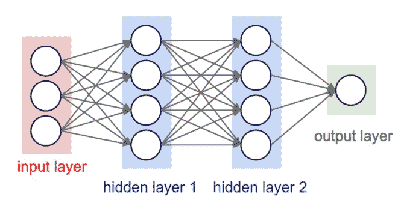

图 1. 一个三层人工神经网络。（图片来源：[`cs231n.github.io/convolutional-networks/#conv`](http://cs231n.github.io/convolutional-networks/#conv)）

原因出奇的简单：

+   我们有**更多的数据**。

+   我们有**更强大的计算机**。

一个大而深的神经网络有更多的层次和更多的节点，每一层都有更多的节点，这导致需要调整的参数数量呈指数增长。没有足够的数据，我们无法有效地学习参数。没有强大的计算机，学习将会太慢且不足够。

这里有一个有趣的图表，展示了数据规模与模型性能之间的关系，由 Andrew Ng 在他的“[应用深度学习的要点](https://youtu.be/F1ka6a13S9I)”演讲中提出。在小数据集上，传统算法（回归、随机森林、支持向量机、梯度提升机等）或统计学习表现出色，但一旦数据规模飙升，大型神经网络胜过其他模型。部分原因是与传统机器学习模型相比，神经网络模型有更多参数，并且具有学习复杂非线性模式的能力。因此，我们期望模型能够自行选择最有用的特征，而无需太多专家参与的手动特征工程。

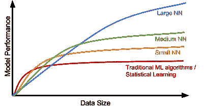

图 2。数据规模与模型性能的关系。（基于重新创建：[`youtu.be/F1ka6a13S9I`](https://youtu.be/F1ka6a13S9I)）

# 深度学习模型

接下来，让我们看一些经典的深度学习模型。

## 卷积神经网络

卷积神经网络，简称“CNN”，是一种前馈人工神经网络，其神经元之间的连接模式受到视觉皮层系统的组织启发。主要视觉皮层（V1）从视网膜接收原始视觉输入并进行边缘检测。次级视觉皮层（V2），也称为前条皮质，从 V1 接收边缘特征并提取简单的视觉属性，如方向、空间频率和颜色。视觉区 V4 处理更复杂的对象属性。所有处理过的视觉特征流向最终的逻辑单元，颞下沟皮质（IT），用于对象识别。V1 和 V4 之间的快捷路径启发了一种特殊类型的 CNN，其中包含非相邻层之间的连接：残差网络（[He 等，2016](http://www.cv-foundation.org/openaccess/content_cvpr_2016/papers/He_Deep_Residual_Learning_CVPR_2016_paper.pdf)），其中的“残差块”支持将一层的某些输入传递到两层后的组件。

图 3。人类视觉皮层系统的插图。（图片来源：[Wang & Raj 2017](https://arxiv.org/abs/1702.07800)）

卷积是一个数学术语，这里指的是两个矩阵之间的操作。卷积层有一个固定的小矩阵定义，也称为核或滤波器。当核滑动或卷积穿过输入图像的矩阵表示时，它计算核矩阵中的值和原始图像值的逐元素乘积。[特别设计的核](http://setosa.io/ev/image-kernels/)可以快速高效地处理图像，用于常见目的如模糊、锐化、边缘检测等。

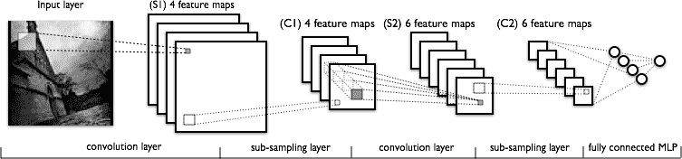

图 4\. LeNet 架构由两组卷积、激活和池化层组成，接着是一个全连接层、激活、另一个全连接层，最后是一个 softmax 分类器（图片来源：[`deeplearning.net/tutorial/lenet.html`](http://deeplearning.net/tutorial/lenet.html)）

[卷积](http://ufldl.stanford.edu/tutorial/supervised/FeatureExtractionUsingConvolution/)和[池化](http://ufldl.stanford.edu/tutorial/supervised/Pooling/)（或图 4 中的“子采样”）层类似于 V1、V2 和 V4 视觉皮层单元，响应特征提取。对象识别推理发生在后续的全连接层中，这些层使用提取的特征。

## 递归神经网络

序列模型通常被设计用于将一个输入序列转换为生活在不同领域的输出序列。短语“RNN”代表递归神经网络，适用于此目的，并在手写识别、语音识别和机器翻译等问题上显示出巨大改进（[Sutskever et al. 2011](http://machinelearning.wustl.edu/mlpapers/paper_files/ICML2011Sutskever_524.pdf)，[Liwicki et al. 2007](http://www6.in.tum.de/Main/Publications/Liwicki2007a.pdf)）。

递归神经网络模型具有处理长序列数据和处理具有时间上下文传播的任务的能力。该模型在一个时间步中处理序列中的一个元素。计算后，新更新的单元状态传递到下一个时间步以促进下一个元素的计算。想象一下，当一个 RNN 模型逐个字符地阅读所有维基百科文章时，然后它可以根据上下文预测接下来的单词。

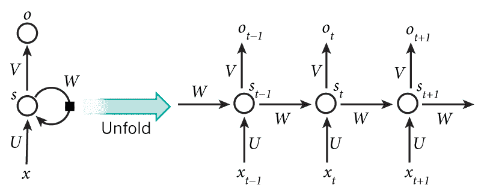

图 5\. 一个具有一个隐藏单元的递归神经网络（左）及其在时间上展开的版本（右）。展开版本说明了时间上发生的事情：$s\_{t-1}$、$s\_{t}$和$s\_{t+1}$是相同的单元，在不同时间步$t-1$、$t$和$t+1$具有不同状态。（图片来源：[LeCun, Bengio, and Hinton, 2015](http://pages.cs.wisc.edu/~dyer/cs540/handouts/deep-learning-nature2015.pdf); [图 5](https://www.nature.com/nature/journal/v521/n7553/fig_tab/nature14539_F5.html))

然而，简单的感知器神经元线性组合当前输入元素和上一个单元状态可能会轻易丢失长期依赖关系。例如，我们以“爱丽丝正在工作…”开头一句，然后在整个段落后，我们想要用“她”或“他”正确开始下一句。如果模型忘记了人物的名字“爱丽丝”，我们就永远不会知道。为了解决这个问题，研究人员创建了一个具有更复杂内部结构的特殊神经元，用于记忆长期上下文，名为[“长短期记忆（LSTM）”](http://web.eecs.utk.edu/~itamar/courses/ECE-692/Bobby_paper1.pdf)单元。它足够聪明，可以学习应该记住旧信息多长时间，何时遗忘，何时利用新数据，以及如何将旧记忆与新输入结合起来。这篇[介绍](http://colah.github.io/posts/2015-08-Understanding-LSTMs/)写得非常好，我建议所有对 LSTM 感兴趣的人阅读。它已经在[Tensorflow 文档](https://www.tensorflow.org/tutorials/recurrent)中正式推广 ;-)

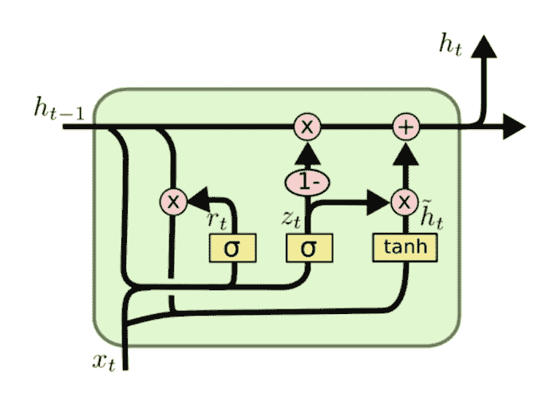

图 6. LSTM 单元的结构。 (图片来源: [`colah.github.io/posts/2015-08-Understanding-LSTMs`](http://colah.github.io/posts/2015-08-Understanding-LSTMs))

为了展示循环神经网络（RNN）的强大之处，[Andrej Karpathy](http://karpathy.github.io/2015/05/21/rnn-effectiveness/) 使用带有 LSTM 单元的 RNN 构建了一个基于字符的语言模型。在事先不知道任何英语词汇的情况下，该模型可以学习字符之间的关系以形成单词，然后学习单词之间的关系以形成句子。即使没有大量的训练数据，它也能取得不错的性能。

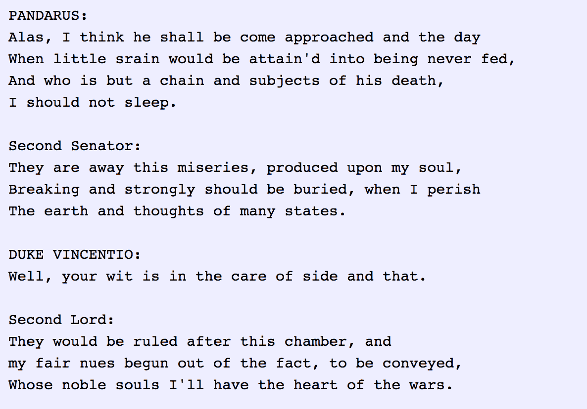

图 7. 基于字符的循环神经网络模型写作像莎士比亚。 (图片来源: [`karpathy.github.io/2015/05/21/rnn-effectiveness`](http://karpathy.github.io/2015/05/21/rnn-effectiveness))

## RNN: 序列到序列模型

[序列到序列模型](https://arxiv.org/pdf/1406.1078.pdf) 是 RNN 的扩展版本，但其应用领域有足够的区别，我想单独列出来。与 RNN 一样，序列到序列模型操作顺序数据，但特别常用于开发聊天机器人或个人助手，为输入问题生成有意义的回应。序列到序列模型由两个 RNN 组成，编码器和解码器。编码器从输入单词中学习上下文信息，然后通过“**上下文向量**”（或“思考向量”，如图 8 所示）将知识传递给解码器。最后，解码器使用上下文向量生成适当的回应。

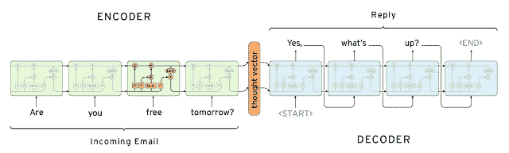

图 8\. 用于生成 Gmail 自动回复的序列到序列模型。（图片来源：[`research.googleblog.com/2015/11/computer-respond-to-this-email.html`](https://research.googleblog.com/2015/11/computer-respond-to-this-email.html)）

## 自动编码器

与先前的模型不同，自动编码器用于无监督学习。它旨在学习**低维**表示**高维**数据集，类似于[主成分分析（PCA）](https://en.wikipedia.org/wiki/Principal_component_analysis)的做法。自动编码器模型尝试学习一个近似函数 $ f(x) \approx x $ 来复制输入数据。然而，它受到中间具有非常少节点的瓶颈层的限制。由于容量有限，模型被迫形成数据的非常高效编码，这本质上就是我们学到的低维代码。

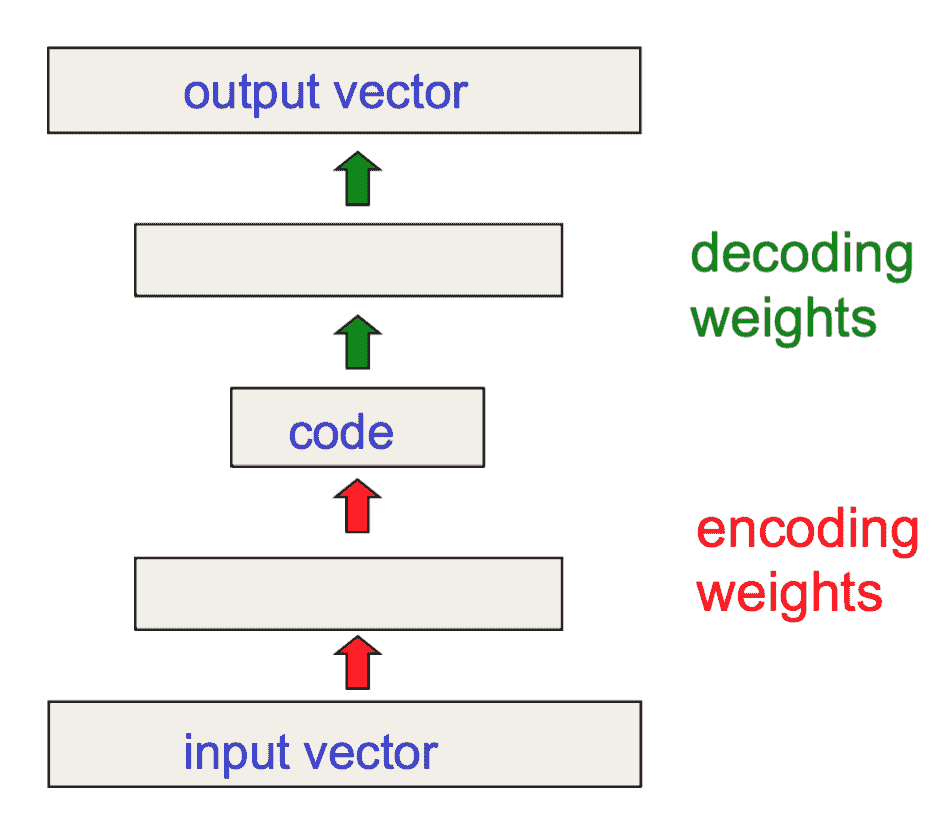

图 9\. 自动编码器模型具有仅有少量神经元的瓶颈层。（图片来源：Geoffrey Hinton 的 Coursera 课程["神经网络与机器学习"](https://www.coursera.org/learn/neural-networks) - [第 15 周](https://www.coursera.org/learn/neural-networks/home/week/15)）

[Hinton 和 Salakhutdinov](https://pdfs.semanticscholar.org/7d76/b71b700846901ac4ac119403aa737a285e36.pdf) 使用自动编码器对各种主题的文档进行压缩。如图 10 所示，当同时应用 PCA 和自动编码器将文档压缩到二维时，自动编码器表现出更好的结果。借助自动编码器，我们可以进行高效的数据压缩，加快信息检索的速度，包括文档和图像。

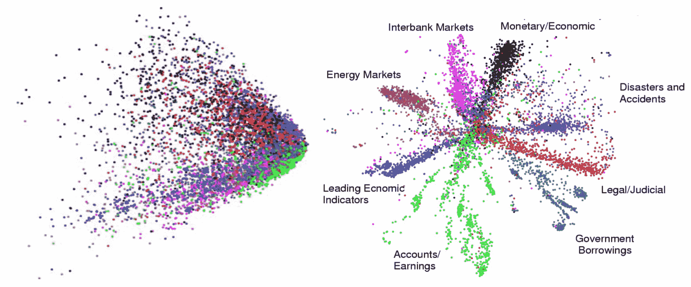

图 10\. 当 PCA 和自动编码器尝试将文档压缩为两个数字时的输出。（图片来源：[Hinton & Salakhutdinov 2006](https://www.cs.toronto.edu/~hinton/science.pdf)）

# 强化（深度）学习

由于我在帖子中以 AlphaGo 开头，让我们更深入地了解为什么 AlphaGo 取得成功。[强化学习（"RL"）](https://en.wikipedia.org/wiki/Reinforcement_learning) 是其成功背后的秘密之一。RL 是机器学习的一个子领域，允许机器和软件代理在给定上下文中自动确定最佳行为，目标是通过给定的度量标准最大化长期性能。

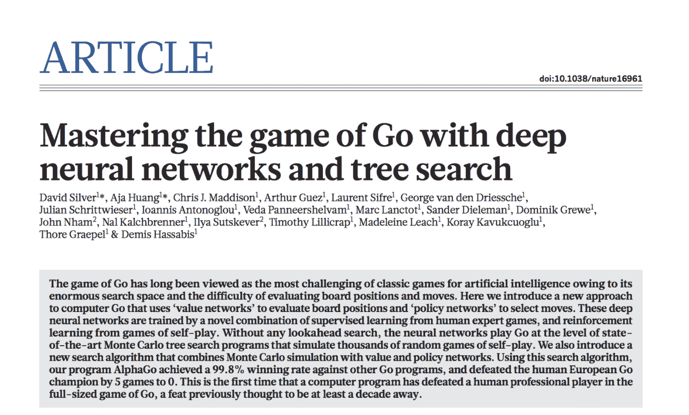 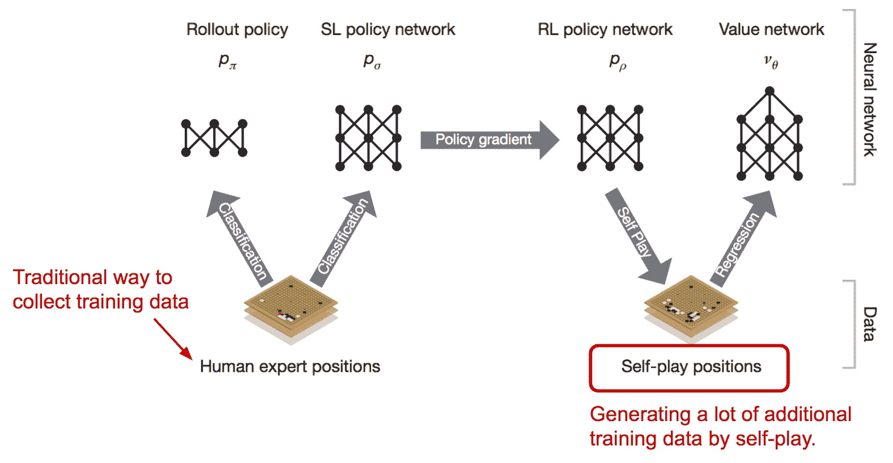

图 11\. AlphaGo 神经网络训练流程和架构。（图片来源：[Silver 等人 2016](https://www.nature.com/articles/nature16961)）

AlphaGo 系统从一个监督学习过程开始，训练一个快速展开策略和一个策略网络，依赖于专业玩家游戏的手动策划训练数据集。它学习在游戏棋盘上的当前位置给出最佳策略。然后，通过设置自我对弈游戏来应用强化学习。当 RL 策略网络在与以前版本的策略网络对战中赢得越来越多的游戏时，它得到改进。在自我对弈阶段，AlphaGo 通过与自己对战而不需要额外的外部训练数据变得越来越强大。

## 生成对抗网络

[生成对抗网络](https://arxiv.org/pdf/1406.2661.pdf)，简称“GAN”，是一种深度生成模型。GAN 能够通过真实数据学习后创建新的示例。它由两个在零和博弈框架中相互竞争的模型组成。著名的深度学习研究员[Yann LeCun](http://yann.lecun.com/)对其给予了极高的评价：生成对抗网络是过去十年中机器学习中最有趣的想法。（参见 Quora 问题：[“深度学习中一些最近和可能即将发生的突破是什么？”](https://www.quora.com/What-are-some-recent-and-potentially-upcoming-breakthroughs-in-deep-learning)）

图 12\. 生成对抗网络的架构。（图片来源：[`www.kdnuggets.com/2017/01/generative-adversarial-networks-hot-topic-machine-learning.html`](http://www.kdnuggets.com/2017/01/generative-adversarial-networks-hot-topic-machine-learning.html)）

在[原始 GAN 论文](https://arxiv.org/pdf/1406.2661.pdf)中，GAN 被提出用于从真实照片中学习生成有意义的图像。它包括两个独立的模型：**生成器**和**判别器**。生成器产生假图像并将输出发送给判别器模型。判别器像一名法官一样工作，因为它被优化用于识别真实照片和假照片。生成器模型努力欺骗判别器，而判别器努力不被欺骗。这两个模型之间的有趣的零和博弈激励它们发展设计的技能并改进功能。最终，我们采用生成器模型生成新图像。

# 工具包和库

在学习所有这些模型之后，您可能会想知道如何实现这些模型并将它们用于实际应用。幸运的是，我们有许多用于构建深度学习模型的开源工具包和库。[Tensorflow](https://www.tensorflow.org/)相当新，但已经吸引了很多关注。事实证明，TensorFlow 是[2015 年最受关注的 Github 项目](http://deliprao.com/archives/168)。所有这些都发生在 2015 年 11 月发布后的 2 个月内。

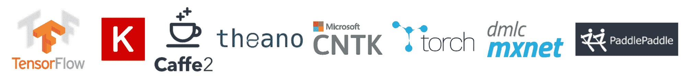

# 如何学习？

如果你对这个领域非常新，并愿意花一些时间以更系统化的方式学习深度学习，我建议你从 Ian Goodfellow、Yoshua Bengio 和 Aaron Courville 合著的书籍[Deep Learning](https://www.amazon.com/Deep-Learning-Adaptive-Computation-Machine/dp/0262035618/ref=sr_1_1?s=books&ie=UTF8&qid=1499413305&sr=1-1&keywords=deep+learning)开始。Geoffrey Hinton（深度学习教父！）的 Coursera 课程[“神经网络用于机器学习”](https://www.coursera.org/learn/neural-networks)。该课程的内容是围绕 2006 年准备的，相当古老，但它可以帮助你建立扎实的深度学习模型理解基础，并加速进一步探索。

与此同时，保持好奇心和激情。这个领域每天都在取得进展。即使是经典的或广泛采用的深度学习模型可能也只是在 1-2 年前提出的。阅读学术论文可以帮助你深入学习知识，并跟上最前沿的发现。

### 有用资源

+   谷歌学术：[`scholar.google.com`](http://scholar.google.com)

+   arXiv 计算机科学部分：[`arxiv.org/list/cs/recent`](https://arxiv.org/list/cs/recent)

+   [无监督特征学习和深度学习教程](http://ufldl.stanford.edu/tutorial/)

+   [Tensorflow 教程](https://www.tensorflow.org/tutorials/)

+   数据科学周刊

+   [KDnuggets](http://www.kdnuggets.com/2017/01/generative-adversarial-networks-hot-topic-machine-learning.html)

+   大量博客文章和在线教程

+   相关的[Cousera](http://coursera.com)课程

+   [awesome-deep-learning-papers](https://github.com/terryum/awesome-deep-learning-papers)

### 提到的博客文章

+   [Explained Visually: Image Kernels](http://setosa.io/ev/image-kernels)

+   [理解 LSTM 网络](http://colah.github.io/posts/2015-08-Understanding-LSTMs/)

+   [循环神经网络的不合理有效性](http://karpathy.github.io/2015/05/21/rnn-effectiveness/)

+   [电脑，回复这封邮件。](https://research.googleblog.com/2015/11/computer-respond-to-this-email.html)

### 值得一读的有趣博客

+   [www.wildml.com](http://www.wildml.com)

+   [colah.github.io](http://colah.github.io/)

+   [karpathy.github.io](http://karpathy.github.io/)

+   [blog.openai.com](https://blog.openai.com)

### 提到的论文

[1] He, Kaiming, et al. [“用于图像识别的深度残差学习。”](http://www.cv-foundation.org/openaccess/content_cvpr_2016/papers/He_Deep_Residual_Learning_CVPR_2016_paper.pdf) 2016 年 IEEE 计算机视觉与模式识别大会论文集。

[2] Wang, Haohan, Bhiksha Raj, and Eric P. Xing. [“深度学习的起源。”](https://arxiv.org/pdf/1702.07800.pdf) arXiv 预印本 arXiv:1702.07800，2017 年。

[3] Sutskever, Ilya, James Martens, and Geoffrey E. Hinton. [“使用循环神经网络生成文本。”](http://machinelearning.wustl.edu/mlpapers/paper_files/ICML2011Sutskever_524.pdf) 2011 年第 28 届国际机器学习会议论文集（ICML）。

[4] Liwicki, Marcus 等人。[“基于双向长短期记忆网络的在线手写识别的新方法。”](http://www6.in.tum.de/Main/Publications/Liwicki2007a.pdf) 第 9 届国际文件分析与识别会议论文集。2007 年。

[5] LeCun, Yann，Yoshua Bengio 和 Geoffrey Hinton。[“深度学习。”](http://pages.cs.wisc.edu/~dyer/cs540/handouts/deep-learning-nature2015.pdf) 自然杂志 521.7553（2015）：436-444。

[6] Hochreiter, Sepp 和 Jurgen Schmidhuber。[“长短期记忆。”](http://web.eecs.utk.edu/~itamar/courses/ECE-692/Bobby_paper1.pdf) 神经计算 9.8（1997）：1735-1780。

[7] Cho, Kyunghyun 等人。[“使用 RNN 编码器-解码器学习短语表示进行统计机器翻译。”](https://arxiv.org/pdf/1406.1078.pdf) 2014 年经验方法自然语言处理会议论文集 1724-1734。

[8] Hinton, Geoffrey E.和 Ruslan R. Salakhutdinov。[“利用神经网络降低数据的维度。”](https://pdfs.semanticscholar.org/7d76/b71b700846901ac4ac119403aa737a285e36.pdf) 科学 313.5786（2006）：504-507。

[9] Silver, David 等人。[“利用深度神经网络和树搜索掌握围棋游戏。”](http://web.iitd.ac.in/~sumeet/Silver16.pdf) 自然杂志 529.7587（2016）：484-489。

[10] Goodfellow, Ian 等人。[“生成对抗网络。”](https://arxiv.org/pdf/1406.2661.pdf) NIPS，2014 年。
