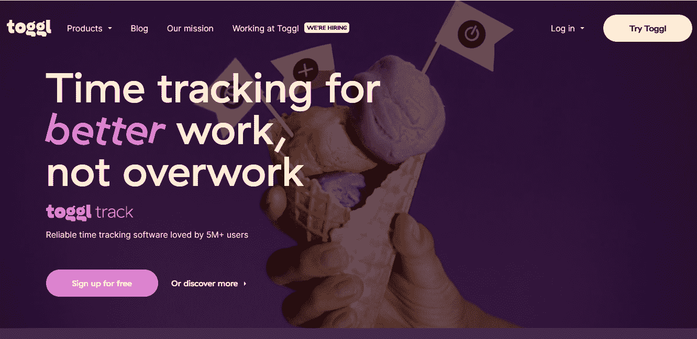

# 提高机器学习团队生产力的 10 大最佳工具

> 原文：<https://web.archive.org/web/https://neptune.ai/blog/10-best-tools-to-increase-productivity-in-machine-learning-teams>

在过去的几年里，机器学习社区发展了很多。它带来的最大好处之一是大量高效的机器学习工具，帮助我们事半功倍。作为一名机器学习工程师，你现在在建立模型或管道时的工作量减少了。

例如，如果你想建立一个深度学习模型，你可能需要定义权重、偏好、节点数量、层数、激活函数、优化器等等。有了 ML 工具，你不需要自己做所有的事情。

这些工具让您可以处理数据、调整模型、调整性能等等，为您和您的团队节省宝贵的时间。

在这篇文章中，我们将分析能够[为你的 ML 团队节省时间并提高你的生产率](https://web.archive.org/web/20221206142703/https://engineering.linkedin.com/blog/2019/01/scaling-machine-learning-productivity-at-linkedin)的最佳工具——以及一些用于时间跟踪、交流和其他一些工具。

让我们开始吧。

Neptune 是一个轻量级的、强大的元数据存储库。它为您提供了一个集中的位置来显示您的元数据，允许您轻松跟踪您的机器学习实验和结果。

要构建一个优化的 ML 模型，您需要使用不同的超参数和架构进行多次试验。跟踪每个实验的性能会成为一个瓶颈。这就是海王星出现的地方。

[https://web.archive.org/web/20221206142703if_/https://www.youtube.com/embed/9iX6DxcijO8?feature=oembed](https://web.archive.org/web/20221206142703if_/https://www.youtube.com/embed/9iX6DxcijO8?feature=oembed)

视频

很容易将 Neptune 集成到您的管道中，并使用广泛的指标进行跟进。但不止于此。Neptune 存储试验，管理和分析结果，创建可视化，并使与其他团队成员和经理分享您的发现变得容易。

Neptune 是灵活的，因此它可以很容易地与其他机器学习框架集成，如 Scikit-learn、R、PyTorch、Ignite、HiPlot、XGBoost 和 Skorch。

此外，这个工具可以像无足轻重一样扩展。跟踪可以支持数百万次运行规模的实验。

### 关键特征

*   大规模数据的存储和分析。
*   使用检查点运行尽可能多的实验。
*   从最后一个检查点继续实验。
*   与团队成员和项目干系人分享见解的工具。
*   与您喜欢的机器学习库和工具集成。
*   对您的数据执行探索性数据分析。

阅读海王星的[功能](/web/20221206142703/https://neptune.ai/product)
查看海王星的[集成](https://web.archive.org/web/20221206142703/https://docs.neptune.ai/integrations-and-supported-tools/intro)探索[文档](https://web.archive.org/web/20221206142703/https://docs.neptune.ai/)

## TensorFlow **—** 快速轻松地构建、训练和部署模型

[TensorFlow](https://web.archive.org/web/20221206142703/https://www.tensorflow.org/) 是一个强大的开源库，用于创建和部署您的机器学习模型。它附带了一个全面的工具和资源集合，用于快速、轻松地构建一流的 ML 驱动的应用程序。

您可以在各种环境中构建、训练和部署深度学习模型，包括浏览器、设备上、内部或云。简单灵活的架构可以在训练和推理深度学习模型的过程中节省你大量的时间。

TensorFlow 是一个应用深度学习解决现实世界问题的端到端平台。它是构建各种人工智能系统的绝佳选择，如文本到语音转换、图像字幕、对象检测、语言翻译、预测分析等等。

### 关键特征

*   用于各种机器学习任务的端到端开源平台。
*   使用计算图形中的矢量流执行高效的数值计算。
*   跨平台，几乎可以在任何东西上运行——GPU 和 CPU，包括移动设备和嵌入式平台。
*   扩展性好，这是三星、谷歌、苹果和英伟达等公司积极使用它的原因之一。

[Scikit-learn](https://web.archive.org/web/20221206142703/https://scikit-learn.org/) 是一个开源库，拥有大量用于构建机器学习模型和解决统计建模问题的工具。这个库主要基于 Python，构建在 matplotlib、SciPy 和 NumPy 之上。

Scikit-learn 拥有大多数用于监督、非监督和强化学习问题的流行算法。其中一些是逻辑回归、线性回归、决策树、支持向量机、主成分分析和随机森林。

使用 Scikit-learn，在任何所需的算法上训练数据集就像导入算法并调用 fit 方法一样简单。这将为您省去从头构建整个模型的压力。

### 关键特征

*   强大的库，支持各种机器学习算法。
*   与其他机器学习库很好地集成，例如用于数据帧的 pandas、用于数组矢量化的 numpy 和用于绘图的 matplotlib。
*   对于回归，它支持贝叶斯回归、Lasso、Ridge、SVR 和其他算法。
*   对于聚类，它支持层次聚类、k-means、DBSCAN、mean shift、谱聚类和其他算法。
*   对于分类，它支持 SVC，逻辑分类器，随机森林分类器，k-最近邻，和其他算法。
*   具有用于特征选择、特征提取、维数减少和各种预处理过程的设施。

如何跟踪你的 [Sklea](https://web.archive.org/web/20221206142703/https://docs.neptune.ai/integrations-and-supported-tools/model-training/sklea) 模型训练元数据。

## trello—无缝管理、组织、可视化和共享项目

Trello 是一个足智多谋的工具，用于管理、组织、可视化和与他人共享项目。它并不明确意味着机器学习，但它对于管理 ML 工程团队中的团队合作来说很方便。

您为每个项目创建仪表板，称为 Trello 板。公告板上贴满了卡片，每个人都可以在上面评论和讨论细节。您可以在卡片上添加文件、截止日期、清单和标签，以便让团队成员跟上您的工作进度。

对于机器学习项目，Trello 板可能包含显示数据清理、数据预处理、探索性数据分析、模型构建、模型训练和部署步骤的卡片。这样，您可以非常方便地跟踪所有团队成员的进度。

### 关键特征

*   与您的 ML 团队成员进行可视化协作。
*   简单的拖放式编辑功能。
*   已分配任务的进度表清单。
*   截止日期提醒和通知。
*   支持文件附件。
*   强大的备份和信息检索机制。
*   易于使用的 API，用于集成 Trello 和第三方应用程序。
*   在多种操作系统上访问—Windows、Mac OS、iOS 和 Android。

## Jupyter 笔记本—轻松交互地创建和共享文档

Jupyter Notebook 是一个开源的、基于 web 的 IDE，用于交互式地创建和展示数据科学和机器学习项目。您可以使用它来开发和共享带有解释性文本、可视化、等式和实时代码的文档。

Jupyter Notebook 允许您单独运行大量代码以快速获得结果，而不直接依赖于以前的代码。在您编码时，更容易确切地知道正在发生什么。

探索性数据分析的布局无可挑剔。它也非常适合渲染可视化，尤其是在与其他库(如 seaborn、matplotlib 或 plotly)一起使用时。

Jupyter Notebook 无疑是一个有用的工具，您可能已经在使用它来提高您的机器学习项目的生产率。

### 关键特征

*   易于使用，保留的关键字、注释、字符串和其他短语具有出色的颜色突出显示。
*   将 Jupyter 笔记本文档转换为其他输出格式，如 PDF、LaText、HTML 和演示文稿幻灯片。
*   连接几个内核支持各种语言编程，除了 Python，R，Julia。
*   伟大的文件管理系统。文件很小，很容易检索。
*   自动保存功能。万一发生意外的系统故障，您的代码不会丢失。
*   它不仅是编程的好工具，也是演示的好工具——具有 Markdown、Raw NBConvert 和 heading 特性。

## tog GL—只需一次点击，即可跟踪您的在线和离线工作时间

Toggl 是时间管理的最佳工具之一。这是一个简单而强大的工具，用来记录你在项目上花费的时间。

有了 Toggl，时间跟踪就像开始工作时点击开始按钮，结束工作时点击停止按钮一样简单。这将帮助你保持高效率，更好地管理时间。

当你无所事事时，也许你离开了你的电脑，Toggl 会自动检测空闲时间并记录下来。在一个团队中，这对于透明度来说是非常好的——尤其是在远程工作的时候。你和你的团队可以看到你实际工作了多长时间。

另一个使 Toggl 成为首选的功能是检查你在工作时间访问的网页和程序，以及你在那里花了多长时间。通过这种方式，你可以深入了解自己是如何度过上网时间的。

使用 Toggl 甚至不需要一直在线。即使你离线，它也能准确工作。

### 关键特征

*   只需轻轻一点，即可跨多个平台(浏览器扩展、移动应用、桌面应用和 web 应用)跟踪时间。所有跟踪的条目都会实时自动同步。
*   自动跟踪您访问的每个网站或应用程序。
*   在线和离线都有效。
*   支持日历集成，显示你的时间去哪里。
*   支持与 100 多个第三方应用程序的无缝集成，包括 Trello、Todoist 和 Asana。
*   跟踪提醒。
*   强大的报告功能提供可操作的见解。过滤和排序您的数据，并通过 PDF 或 CSV 格式导出。
*   安排您喜欢的报告定期发送到您的电子邮件中。
*   对项目管理有用。Toggl 显示你在一个项目上花了多长时间，估计完成时间，你为每项活动分配时间的情况，等等。
*   对团队管理有用。

## sweet viz—用几行代码执行深入的 EDA

[Sweetviz](https://web.archive.org/web/20221206142703/https://pypi.org/project/sweetviz/) 是一个开源库，用于执行探索性数据分析(EDA)并使用几行代码创建漂亮的可视化效果。它建立在熊猫档案库的基础上。

这是提高你工作效率的好工具。它大大减少了您手动清理数据和创建每个可视化所花费的时间，因为 Sweetviz 完成了所有艰苦的工作，而您则专注于您的核心活动。它具有目标分析、比较、特征分析、关联和输出等功能，是一个完全独立的 HTML 应用程序。

Sweetviz 分析您的全部数据，并提供详细的可视化 EDA 报告。生成的报告包含许多有助于理解数据集特征的信息。

您还可以使用它来检查特定要素如何影响数据集中的其他要素、在数据集中执行要素关联以及可视化要素。

### 关键特征

*   执行快速 EDA 并在几行代码中生成漂亮的可视化效果。
*   分析目标变量与数据集中其他要素的关系。
*   表征数据集并找出值的分布、使用的数据类型、缺失信息等。
*   比较和可视化两个不同的数据集，如训练和测试数据。
*   为目标数据集的特征创建一个易读而可靠的摘要。
*   自动检测连续、分类和文本数据。
*   与其他机器学习工具集成，如 Jupyter Notebook 和 Google Colab。

## slack—与您的团队即时、方便地沟通

[Slack](https://web.archive.org/web/20221206142703/https://slack.com/) 是一个方便交流的即时通讯平台。这是一个在你的机器学习团队中进行高效沟通和协作的绝佳场所。

你有不同的频道(聊天室)来方便导航。您可以创建私人和公共频道。任何人都可以进入公共频道，私人频道只能由频道所有者或管理员添加的团队成员访问。

您会在工作区中收到新消息的通知，包括当您从频道注销时，尽管此功能可以在通知设置中更改。

您可以从免费版本开始，在那里您可以存储和搜索多达 10，000 条最新消息。

### 关键特征

*   渠道为管理与其他团队成员的交流提供了一个集中的空间。向整个团队或直接向个人发送消息。
*   文件共享、语音通话、视频通话和表情符号反应。
*   与多个第三方工具集成，如 Asana、Google Drive、Trello 和 Zendesk。
*   非常适合文件归档。您可以将频道上的旧对话存档，以供将来参考。
*   神奇的搜索引擎。您可以搜索邮件、存档，甚至文件名。
*   易于使用的 API 将 Slack 功能集成到不同的用例中。
*   在各种平台上访问，包括移动 Android 和 iOS 应用程序、网络浏览器、Windows 和 Mac OS 的桌面客户端以及 Apple Watch。

## Google Cloud AutoML——利用 Google 强大的技术，以最小的工作量自动训练模型

[Google Cloud AutoML](https://web.archive.org/web/20221206142703/https://cloud.google.com/automl) 是一套强大的工具，可以在没有广泛专业知识的情况下开始训练高质量的机器学习模型。利用谷歌的技术，用最少的努力训练你的模型。

Google Cloud AutoML 使用谷歌经过实战检验和预先培训的服务。在训练模型时并不是从零开始。

为了帮助你创建满足你需求的模型，AutoML 应用了谷歌的神经架构搜索技术(它会寻找额外网络层的正确混合)，以及自动深度转移学习技术(它从已经在其他数据上训练过的现有神经网络开始)。

Google AutoML 消除了寻找合适的算法、层数、节点数、学习速率和其他超参数调整的麻烦。

有了 Google Cloud AutoML，你不用担心训练今天的神经网络所需的时间密集性或丰富的经验。您可以使用它来为您的特定业务需求设计神经网络，而无需掌握其中的复杂性。

### 关键特征

*   自动训练一流的机器学习模型，即使知识有限。
*   谷歌复杂的神经架构搜索技术和深度转移学习技术自动执行机器学习任务。
*   适用于各种机器学习任务，包括图像分类、自然语言分类和语言对翻译。
*   大规模验证、调整和部署您的模型。

## keras——在定义和训练模型时，尽量减少认知负荷

Keras 是一个健壮的开源 API，用于构建和评估深度神经网络。它被设计成模块化、灵活和简单的——您可以使用几行代码来定义和训练模型。

注意，Keras 不能独立工作。你需要一个后端(或引擎)来驱动它。默认情况下，后端是 TensorFlow，但它也支持其他后端，如 Theano 和微软认知工具包。

Keras 在开发机器学习模型时，将认知负荷降至最低。高效的 API 减少了您实现常见用例所需的工作，因此您在处理模型时可以更有效率。

### 关键特征

*   一致且易于使用的 API。即使是初学者也可以在几分钟内用 Keras 建立神经网络。
*   基于 Python 的接口，用于处理深度神经网络。
*   在 CPU 和 GPU 上都能很好地工作。
*   在任何地方部署—在浏览器中使用 JavaScript，在 TF Lite 上运行在嵌入式设备、Android 或 iOS 上。
*   灵活和伟大的研究目的。
*   涵盖机器学习工作流程每个步骤的庞大生态系统-从管理原始数据，通过训练超参数，一直到部署解决方案。
*   在机器学习社区被广泛采用。由亚马逊、微软、谷歌、苹果等科技巨头支持。

检查如何使用 [Neptune + TensorFlow / Keras](https://web.archive.org/web/20221206142703/https://docs.neptune.ai/integrations-and-supported-tools/model-training/tensorflow-keras) 集成来跟踪您的模型训练元数据。

## 最后的想法

这些是作为机器学习工程师，你可以用来提高自己或团队工作效率的十个最佳工具。

我们概述了每个工具的关键特性，以及它们如何帮助您将机器学习开发工作提升到一个新的水平。希望这有助于您为自己的案例选择正确的工具。