# 亚马逊 SageMaker 的最佳替代品[用于实验跟踪和模型管理]

> 原文：<https://web.archive.org/web/https://neptune.ai/blog/amazon-sagemaker-alternatives>

机器学习项目远比典型的软件项目复杂。与主要涉及编写和测试一些代码的软件项目相比，ML 项目遵循一个迭代过程，需要大量的实验。ML 项目失败不仅仅是因为代码错误，还因为概念漂移、超参数值的不良调整以及错误的模型架构。[追踪机器学习模型](/web/20220926082702/https://neptune.ai/experiment-tracking)帮助[数据科学家和 ML 工程师](/web/20220926082702/https://neptune.ai/blog/ml-engineer-vs-data-scientist)处理这类问题。市场上有许多工具可以帮助专业人员跟踪模型实验及其管理。

在本文中:

*   我们将看看这一类别中最流行的工具之一— [AWS SageMaker](/web/20220926082702/https://neptune.ai/vs/sagemakerstudio) 及其功能。
*   我们还将讨论 AWS SageMaker 存在不足的几种情况，以及我们可以参考的替代方案。

AWS SageMaker 概述

## [Amazon SageMaker](https://web.archive.org/web/20220926082702/https://aws.amazon.com/sagemaker/) 是一项完全托管的服务，为每个开发人员和数据科学家提供了准备、构建、训练和部署机器学习模型的能力，没有任何麻烦。SageMaker 负责所有复杂的过程，并使其用户更容易开发高质量的模型。为了使模型可以投入生产，并通过机器学习模型创造价值，数据科学家和 ML 工程师定期训练数千个不同版本的模型，以找到最准确的模型..

当 ML 团队必须处理成千上万的工作，跟踪不同的度量标准，比较不同实验的结果等时，创建模型并找到最佳模型可能是一项乏味的工作。Amazon SageMaker 在一个罩下包含不同的功能，可以帮助机器学习服务的端到端处理。

[亚马逊 SageMaker 实验](https://web.archive.org/web/20220926082702/https://docs.aws.amazon.com/sagemaker/latest/dg/experiments.html)和[模型监控](https://web.archive.org/web/20220926082702/https://docs.aws.amazon.com/sagemaker/latest/dg/model-monitor.html)是亚马逊 SageMaker Studio 集成的两项功能。ML 工程师可以很容易地运行查询来可视化模型、性能指标和任何概念漂移，如果有的话。它还提供了[模型](https://web.archive.org/web/20220926082702/https://docs.aws.amazon.com/sagemaker/latest/dg/model-registry.html) [注册表](https://web.archive.org/web/20220926082702/https://docs.aws.amazon.com/sagemaker/latest/dg/model-registry.html)功能，用户可以在其中识别模型实例——以前的模型元数据、训练指标、超参数等。

如何在亚马逊 pagemaker 中管理实验

### [SageMaker 实验](https://web.archive.org/web/20220926082702/https://docs.aws.amazon.com/sagemaker/latest/dg/experiments.html)自动跟踪每次实验迭代的输入、参数、配置和结果。它与 SageMaker studio 集成在一起，并提供可视化功能来查看实验，根据关键指标进行比较，并决定哪一个是性能最佳的模型。它支持跟踪所有用于创建模型的工件，并且用户可以轻松地重新访问模型以进行故障诊断或审计。

**组织实验—**它为用户组织模型实验提供了一种结构化的方式。一个实验可以有多个试验，一个试验是运行 ML 模型所需的输入资产的集合。通过 SageMaker 实验，用户可以对每个机器学习迭代进行分组，然后确定哪个试验产生了最好的模型。

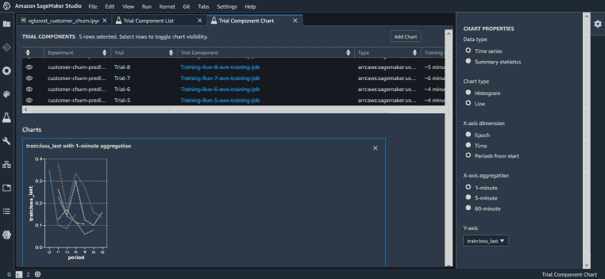

*AWS SageMaker: experiments | [Source](https://web.archive.org/web/20220926082702/https://aws.amazon.com/blogs/aws/amazon-sagemaker-studio-the-first-fully-integrated-development-environment-for-machine-learning/)*

*   **跟踪实验–**有两种方法可以使用此功能跟踪实验——自动和手动。它可以自动记录和跟踪独立的训练、批量转换、所有实验工件，包括数据集、算法、超参数和度量等。对于手动跟踪，SageMaker 提供了跟踪 API 来在笔记本上本地记录和跟踪 ML 实验。

*   **比较和评估实验—**使用 SageMaker studio 用户可以使用度量图表和图形比较多个实验。这些实验可视化随着实验的进行而实时更新。

*   **sage maker auto pilot—**auto pilot 自动构建、训练和调整 ML 模型。这消除了繁重的工作，并自动探索不同的实验以找到最佳模型。

*   如何在 amazon pagemaker 中监控你的模型

### [SageMaker 模型监控](https://web.archive.org/web/20220926082702/https://docs.aws.amazon.com/sagemaker/latest/dg/model-monitor.html)自动监控生产中的机器学习模型，如果出现任何不准确的预测和数据漂移，可以提醒 ML 工程师。

根据 2010 年的一些数据训练的模型在 2021 年运行时可能会失败，因为输入数据的统计性质会逐渐改变，最终会影响模型的准确性。它还有助于识别机器学习模型中的任何潜在偏差。用户可以使用预构建的模型监控功能，也可以根据自己的需求进行编辑。SageMaker 为模型监控提供了以下功能:

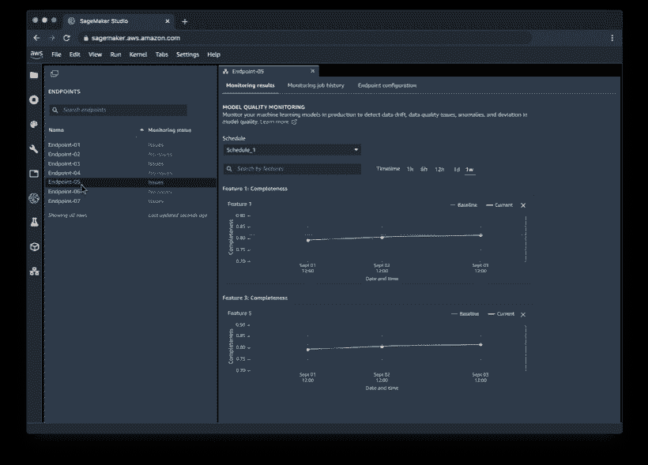

*AWS SageMaker: model monitoring | [Source](https://web.archive.org/web/20220926082702/https://aws.amazon.com/blogs/aws/amazon-sagemaker-studio-the-first-fully-integrated-development-environment-for-machine-learning/)*

**数据质量—**用户可以创建基准作业并分析输入数据集。这些基线作业可以计算基线模式约束和统计数据。监控数据质量有助于了解模型是否开始失去准确性。

*   **模型质量—**模型质量可以使用性能指标进行监控。用户可以将模型的预测与实际情况进行比较。

*   **偏差漂移–**sage maker 用户可以定期监控模型的偏差。当训练数据不同于实时数据时，可能会引入偏差。

*   **特征归因漂移–**与偏差漂移类似，使用特征归因漂移，用户可以查看单个特征，并比较训练数据和实时数据的排名。

*   amazon pagemaker 模型注册表

### [亚马逊 SageMaker 模型注册中心](https://web.archive.org/web/20220926082702/https://docs.aws.amazon.com/sagemaker/latest/dg/model-registry.html)帮助对模型的不同版本进行编目。用户可以按照几个步骤注册模型版本，然后将其部署到生产环境中。下面是使用模型注册中心可以完成的事情:

创建模型目录，将模型的不同版本打包在一起。

*   管理模型版本。
*   将元数据与模型相关联。
*   跟踪一组中的所有模型。
*   AWS Sagemaker 什么时候不是最佳选择？

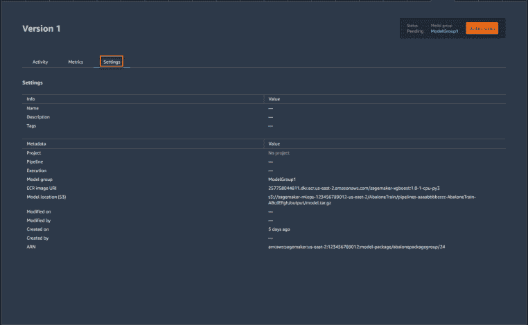

*AWS SageMaker: model groups and registry | [Source](https://web.archive.org/web/20220926082702/https://docs.aws.amazon.com/sagemaker/latest/dg/images/model_registry/model-version-details.png)*

### AWS SageMaker 为其用户提供了对其机器学习模型和维护的完全控制。这有助于客户专注于创造价值，而不是不断检查他们的模型。尽管 AWS 是一个非常受欢迎的选择，但它在很多事情和很多情况下都是失败的

**灵活性—**AWS SageMaker 具有多种功能，可帮助用户跟踪和比较模型实验，但它们都是一个生态系统(即 AWS sage maker)的一部分，不能单独使用。这是它的不足之处，因为它没有为不同专业水平的用户提供灵活性，这些用户只希望利用少数几个功能，并且只对跟踪实验和发现哪个模型是最好的感兴趣。

*   **费用-**AWS sage maker 可免费使用 AWS 免费层服务。尽管免费层有一些限制，但用户可以使用一些基本服务和有限的功能。如果用户超出基线，AWS 会相应收费。与其他可用的解决方案相比，AWS 非常昂贵，并且随着用户继续消费更多的服务，成本会呈指数级增长。AWS SageMaker 实例比同等的 AWS EC2 实例[贵 40%](https://web.archive.org/web/20220926082702/https://stackoverflow.com/questions/52198660/which-is-lower-cost-sagemaker-or-ec2)。

*   **模型比较–**通过 AWS SageMaker，用户可以比较多个 ML 作业，尽管它支持的视觉效果和数据类型数量有限。它不提供不同实验的表格比较，用户不能一次比较 3 个以上的实验。用户不能使用笔记本或代码记录自定义比较。

*   **强制工作流–**AWS 最初是一家云服务提供商，现在已经增加了多种 ML 功能。AWS SageMaker 不仅仅是一个服务，而是一个端到端的平台，让用户创建 ML 管道。这有点像一个封闭的盒子，用户只能在 AWS 的能力范围内工作，例如 ML 模型和相关资产存储在 S3 上，这使得很难与他人分享结果。

*   **文档&社区支持—**sage maker 提供了大量的设置文档，但这些文档令人困惑，而且需要花费时间才能找到正确的指南或教程。尽管 SageMaker 已经存在了一段时间，但在 StackOverflow 这样的平台上很难找到在线解决方案。每次你在网上搜索答案的时候，你都会发现 AWS 网页上只有教程和博客，它们可能并不相关。用户能做的最好的事情就是查看 Python SDK 代码或联系 AWS 支持。用户也可以在 AWS 论坛上发布他们的问题，但可能需要一段时间才能得到答案。

*   总的来说，当您的企业或团队已经使用 AWS 时，AWS SageMaker 是一个很好的工具。市场上还有其他高级工具，它们可以通过广泛的集成阵容为客户提供最佳体验。这些工具也更加简单，可移植，允许用户访问 SageMaker。

亚马逊 pagemaker 替代品

## 1.海王星. ai

### [Neptune.ai](/web/20220926082702/https://neptune.ai/) 是一个 ML [元数据存储库](/web/20220926082702/https://neptune.ai/blog/ml-metadata-store)，它提供了一个单一的位置来记录、存储、显示、组织、比较和查询所有的模型构建元数据。这个 [ML 元数据](https://web.archive.org/web/20220926082702/https://docs.neptune.ai/you-should-know/what-can-you-log-and-display)包括度量、超参数、学习曲线、训练代码、配置文件、控制台日志、诊断图表、模型版本、数据集版本等等。

记录的 ML 元数据用于[实验跟踪](https://web.archive.org/web/20220926082702/https://docs.neptune.ai/how-to-guides/experiment-tracking)和[模型注册](https://web.archive.org/web/20220926082702/https://docs.neptune.ai/how-to-guides/model-registry)。它使 ML 工程师和数据科学家能够在实验运行时监控实验，并跟踪指标、参数等。Neptune.ai 提供了一个非常友好的用户体验，允许用户搜索、分组和比较实验。用户可以很容易地[与他们的团队成员](https://web.archive.org/web/20220926082702/https://docs.neptune.ai/you-should-know/collaboration-in-neptune)分享结果。

Neptune.ai 的优势

#### 它提供了与 25 种以上不同工具的简单无缝集成

*   团队可以轻松协作、共享报告和见解等。
*   它有一个非常直观和灵活的用户界面，允许用户根据自己的选择可视化和安排数据
*   Neptune.ai 存储了大部分元数据及其版本，可以帮助用户重现模型
*   用户可以选择使用不同的过滤器搜索实验和数据
*   模型跟踪和管理的主要功能

#### 实验跟踪

##### 通过 [Neptune.ai 的实验跟踪](/web/20220926082702/https://neptune.ai/product/experiment-tracking)用户可以在一个地方轻松记录任何模型对象，并显示它们以供监控。用户可以在任何地方运行实验——在个人笔记本电脑、云、笔记本电脑等。但仍然能够使用托管版本或内部部署将结果整合到一个地方。

在对比实验时，平台会自动将差异显示在表格中。用户还可以利用交互式性能图表来清楚地了解每个实验。可以将比较视图保存为仪表板，供以后使用，或者与其他利益相关者一起研究和共享结果。

[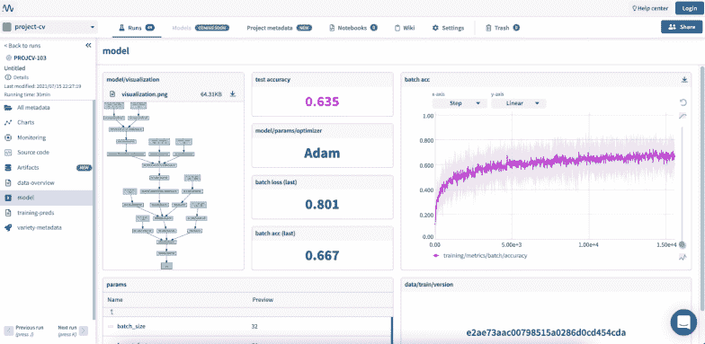](https://web.archive.org/web/20220926082702/https://i0.wp.com/neptune.ai/wp-content/uploads/Alternatives-to-Amazon-SageMaker-for-Experiment-Tracking-and-Model-Management_2.png?ssl=1)

*Neptune.ai: experiment tracking | [Source](https://web.archive.org/web/20220926082702/https://app.neptune.ai/common/project-cv/e/PROJCV-103/dashboard/model-a72c0f5f-76e0-4386-b960-b186427a8b91)*

此外，所有记录的对象和比较视图都可以提取到本地机器上。用户甚至可以在几个月后回到实验中，并且可以在任何需要的时候访问这些实验。更多细节请查看 Neptune.ai 的[概述](/web/20220926082702/https://neptune.ai/product/experiment-tracking)。

[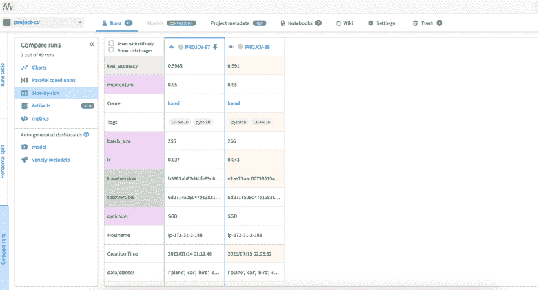](https://web.archive.org/web/20220926082702/https://i0.wp.com/neptune.ai/wp-content/uploads/Alternatives-to-Amazon-SageMaker-for-Experiment-Tracking-and-Model-Management_9.png?ssl=1)

*Neptune.ai: comparing experiments | [Source](https://web.archive.org/web/20220926082702/https://app.neptune.ai/common/project-cv/experiments?compare=KwdgNAzAHEA&split=cmp&dash=leaderboard&viewId=46a5f9b7-26ad-4dc1-a7ae-d571ca246c3c)*

模型注册表

##### [Neptune . ai 中的模型注册表](/web/20220926082702/https://neptune.ai/product/model-registry)帮助用户存储不同版本的机器学习模型和建模元数据。这允许用户在中央模型注册中心组织模型。它存储任何模型的每个训练版本以及数据集、代码和参数，这有助于重现、重新运行和部署模型。

2.彗星

[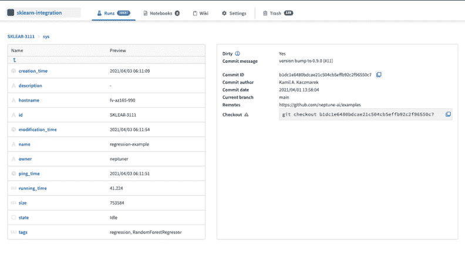](https://web.archive.org/web/20220926082702/https://i0.wp.com/neptune.ai/wp-content/uploads/Alternatives-to-Amazon-SageMaker-for-Experiment-Tracking-and-Model-Management_3.png?ssl=1)

*Neptune.ai: model registry | [Source](https://web.archive.org/web/20220926082702/https://app.neptune.ai/common/sklearn-integration/e/SKLEAR-95/all?path=sys)*

### [Comet](https://web.archive.org/web/20220926082702/https://www.comet.ml/site/) 帮助用户管理和优化从实验跟踪到模型生产监控的整个 ML 生命周期。它提供了简单快速的集成，只需在现有代码中包含几行代码，用户就可以开始跟踪实验并比较不同版本的模型等。用户可以实时监控模型，并确定模型在所有细分市场中的表现是否符合预期。

它允许企业将实验和所有过程可视化。用户可以轻松整合、管理和协作所有报告，甚至让利益相关方了解绩效。

优于 pagemaker

#### 与其他工具无缝集成。

*   提供用户管理功能，项目或工作区的可见性可能受到限制。
*   为实验跟踪和比较提供交互式可视化。
*   在基于网络的用户界面中，实验台是完全可定制的。
*   分段性能跟踪有助于监控数据漂移。
*   模型跟踪和管理的主要功能

#### 实验管理

##### 使用[实验管理](https://web.archive.org/web/20220926082702/https://www.comet.ml/site/data-scientists/)，comet 有助于使用所有记录的数据建立更好的模型，同时提高生产力、协作和可解释性。用户可以使用代码、超参数、度量、预测、依赖性、系统度量来比较实验。用户可以记录、转换、比较和可视化任何人工制品。

Comet 还允许用户从模型预测中查看、分析和获得洞察力，例如检测过度拟合和概念漂移。在使用一个实验记录一个模型之后，用户可以在 comet 平台上注册这个模型，并且可以将同一个模型的不同版本与不同的工件或者一些变更进行分组。

Comet 有两个实验视图——实验表和实验选项卡。用户可以查看他们的实验，状态，运行时间和可见性设置等，也有额外的列。在实验选项卡视图中，用户将能够在不同的选项卡中查看每个工件——指标、超参数、图表视图、输出、数据等。

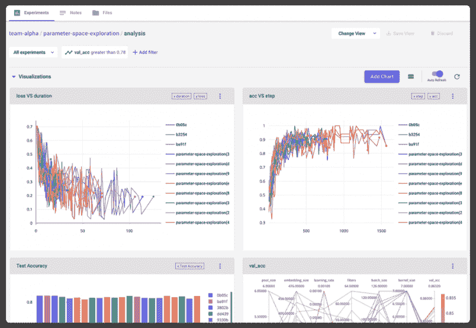

*Comet: track and compare | [Source](https://web.archive.org/web/20220926082702/https://www.comet.ml/site/app/uploads/2020/02/video_image-1-e1587413725588.png)*

模型生产监控

##### 在 comet 中，用户可以实时监控生产模型，包括关键生产指标，以确定模型是否按预期执行。在训练和部署模型之后，数据和环境往往会改变，这可能会导致模型不合适。在 comet 的帮助下，用户可以监控超出准确度的指标，并了解基本事实。

Comet 还提供分段的性能跟踪，确保所有关键部分的可见性。用户可以将生产监控与实验管理相结合，探索模型在不同环境中的表现。

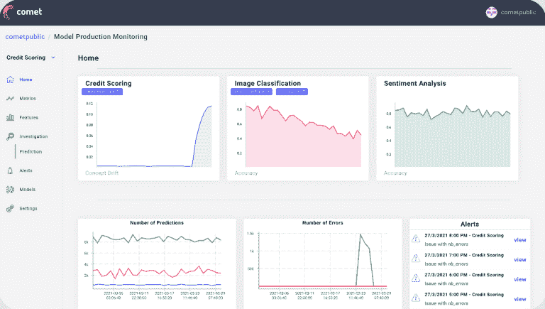

*Comet: model production monitoring | [Source](https://web.archive.org/web/20220926082702/https://www.comet.ml/site/app/uploads/2021/04/MPM-Screenshot.png)*

史前古器物

##### 用户可以记录和存储不同版本的数据和模型，并更新它们，而不用担心回到以前的版本。comet 工件的目的是允许在任何实验之外跟踪不同的资产。用户可以在 ML 管道中随时创建、管理和使用这些资产。这些存储的工件可以通过工作区访问，并且可以重新用于任何其他实验。

3.重量和偏差

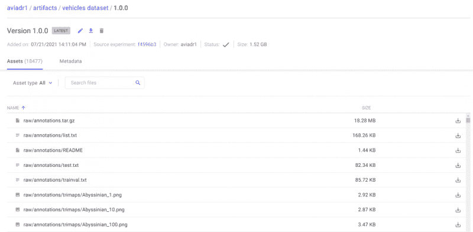

*Comet: dataset and model versioning | [Source](https://web.archive.org/web/20220926082702/https://www.comet.ml/site/app/uploads/2021/07/seamless-dataset-and-model-versioning-1536x752.png)*

### [Weight&bias](https://web.archive.org/web/20220926082702/https://wandb.ai/site)是一个平台，用于记录模型训练，在交互式图形和表格的帮助下比较和可视化不同的模型实验。WandB 主要专注于深度学习项目。

它是最受欢迎的平台之一，因为它的定制功能是许多工具所不具备的，例如，它会告诉您哪些指标是重要的，它可以提前发布任何表现不如预期的实验，以节省处理时间。使用 W&B 用户可以跟踪培训过程的每个部分。

优于 pagemaker

#### 日志数据集的重复数据消除。

*   及早停止以避免浪费昂贵的资源。
*   用户友好的交互式仪表板，一个跟踪所有实验的中心位置。
*   可视化端到端 ML 管道流，并为最佳性能模型保留检查点
*   可视化重要的、将对模型度量和性能产生影响的特性
*   无论是系统还是云服务提供商，W&B 都提供了对工件的灵活跟踪和托管。
*   模型跟踪和管理的主要功能

#### 实验

##### WandB 提供了一个轻量级的集成，可以与任何 python 脚本一起工作。[实验跟踪](https://web.archive.org/web/20220926082702/https://wandb.ai/site/experiment-tracking)，比较和可视化模型及其性能就像编写 5 行代码一样简单。用户可以在交互式表格和图形中实时查看模型指标，并比较任何实验，而不管您的模型在什么环境和地方接受训练。用户可以直接在 W & B 上保存代码提交、超参数、数据集和权重等，也可以链接到他们自己的存储。

用户可以监控 GPU 和 CPU 的使用情况，以确定资源分配中的任何瓶颈，并确定问题区域。

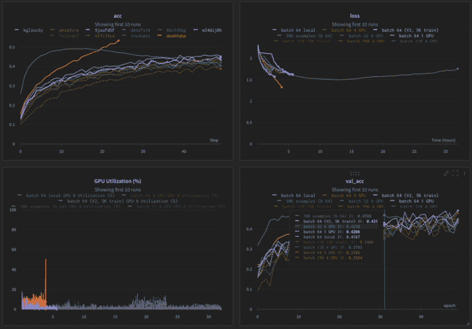

*Weight & Biases: visualize and compare experiments | [Source](https://web.archive.org/web/20220926082702/https://assets.website-files.com/5ac6b7f2924c656f2b13a88c/60c2531e5144f46276377517_visualize-metrics.png)*

史前古器物

##### 使用 WandB，用户不必担心记录模型和数据集中的变化。该平台支持保存机器学习管道中每个步骤的版本，除此之外，它还自动复制数据集，即它只保存最新的更改或新数据。

用户还可以在增量跟踪的帮助下跟踪数据流，WandB 将为性能最佳的模型保留数据流中的检查点。用 W&B 更容易处理敏感数据，并在有限的组内控制可访问性。

全胜

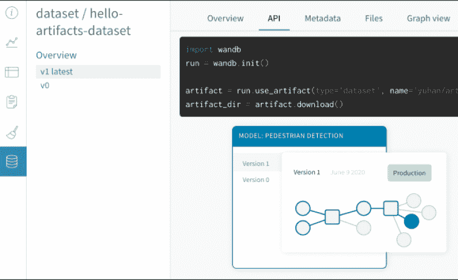

*Weight & Biases: dataset and model versioning | [Source](https://web.archive.org/web/20220926082702/https://assets.website-files.com/5ac6b7f2924c656f2b13a88c/5eed3c414693158a94df888f_Group%2023.png)*

##### WandB 为超参数搜索和模型优化提供了这种独特的功能。这清楚地展示了将影响模型度量或性能的重要超参数。

由于 WandB 还跟踪 GPU 的使用情况，为了避免浪费昂贵的资源，他们在工具中实现了 Hyperband 算法，可定制提前停止。这个特性保持了性能最好的模型的运行，而扼杀了其余的模型。用户可以定制扫描，并为输入、逻辑甚至提前停止的时间提供他们自己的分布。

4.MLflow

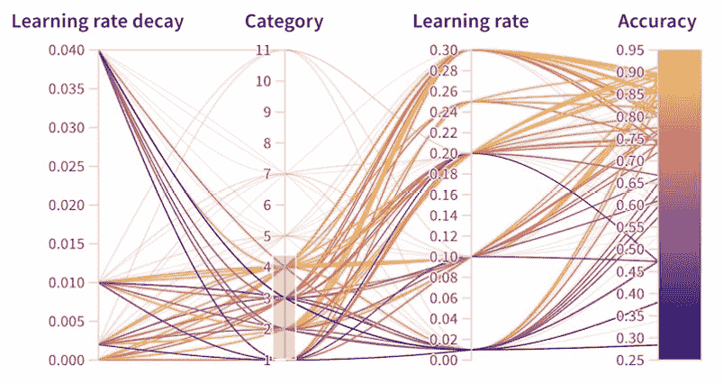

*Weight & Biases: parameter importance and logic for sweeps | [Source](https://web.archive.org/web/20220926082702/https://assets.website-files.com/5ac6b7f2924c656f2b13a88c/5edabe12e93ebb651f3b77ff_5e1790a2fb9c0354e3182389_parallel%20coordinates%202.jpeg)*

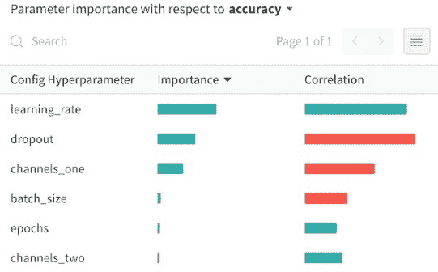

*Weight & Biases: parameter importance and logic for sweeps | [Source](https://web.archive.org/web/20220926082702/https://assets.website-files.com/5ac6b7f2924c656f2b13a88c/5edabe12e93ebb651f3b77ff_5e1790a2fb9c0354e3182389_parallel%20coordinates%202.jpeg)*

### MLflow 是一个开源的、与库无关的平台。用户可以在任何系统中使用 MLflow，并且可以实现实验跟踪、监控模型和创建他们的模型的中央存储库。用户可以使用任何编程语言的任何机器学习库使用 MLflow，因为所有功能都可以通过 REST API 访问。这些功能也可以通过 Python、R 和 Java APIs 获得。

MLflow 没有像其他可用工具那样的 UI，但为了可视化结果，用户可以通过访问本地服务器来访问 MLflow UI，但当我们想要协作时，它并不理想。幸运的是，由于其结构，很容易在任何第三方工具(如 AWS)上设置远程 MLflow 跟踪服务器。一个现实世界的例子是 Databricks，它有一个 MLflow 的托管版本，ML 团队可以在其上高效地工作和协作 ML 项目。

"*Databricks 上的托管 MLflow 是 MLflow 的完全托管版本，为从业者提供跨 Data bricks 笔记本、作业和数据存储的再现性和实验管理，以及统一数据分析平台的可靠性、安全性和可扩展性。*

> 优于 pagemaker
> 
> [Databricks documentation](https://web.archive.org/web/20220926082702/https://docs.databricks.com/applications/mlflow/index.html)

#### 一个帮助统一 ML 工作流程的开源平台。

*   MLflow 可以与任何云服务提供商合作。
*   与大量开源 ML 框架(如 TensorFlow、Apache Spark 等)的强大而简单的集成
*   实时实验跟踪，这意味着当代码运行时，用户可以跟踪模型的性能
*   模型跟踪和管理的主要功能

#### 物流跟踪

##### 借助 [MLflow tracking](https://web.archive.org/web/20220926082702/https://mlflow.org/docs/latest/tracking.html) 组件，用户可以轻松记录参数、代码版本、指标和输出文件。用户可以在任何地方使用 Python、REST、R 和 Java APIs 记录和查询实验。实验可以在本地或远程服务器上记录。MLflow 使用两种类型的存储—后端存储和工件存储。

后端存储将保存 MLflow 实体，如运行、参数、度量、标签、注释、元数据等，而工件存储包含文件、模型、图像、内存中的对象或模型摘要等。

MLflow 模型注册表

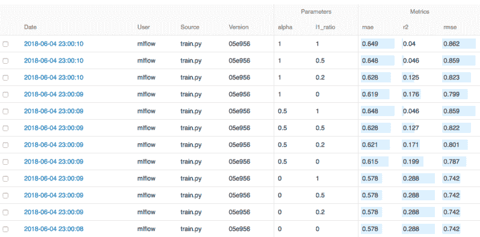

*MLflow: comparing the models | [Source](https://web.archive.org/web/20220926082702/https://www.mlflow.org/docs/latest/_images/tutorial-compare.png)*

##### [MLflow model registry](https://web.archive.org/web/20220926082702/https://mlflow.org/docs/latest/model-registry.html) 是一个模型库，帮助管理 MLflow 模型的整个生命周期。从模型沿袭、模型版本化、阶段转换和注释，模型注册中心保存所有的信息。当计划使用自己的 MLflow 服务器时，用户将需要一个后端数据库来存储和访问模型注册表。该模型应该被记录到相应的模型风格中，并且只有在那时才可以使用 MLflow UI 或 API 访问该模型注册中心来添加、修改、更新、转换或删除。

6\. Kubeflow

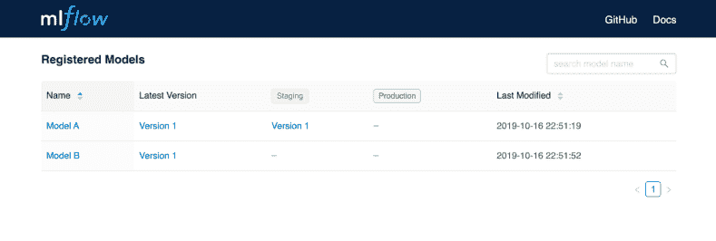

*MLflow: registering model and model stage transitioning | [Source](https://web.archive.org/web/20220926082702/https://www.mlflow.org/docs/latest/_images/oss_registry_5_transition.png)*

*MLflow: registering model and model stage transitioning | [Source](https://web.archive.org/web/20220926082702/https://www.mlflow.org/docs/latest/_images/oss_registry_5_transition.png)*

### [Kubeflow](https://web.archive.org/web/20220926082702/https://www.kubeflow.org/) 用于在 Kubernetes 上创建机器学习工作流。这个想法是让用户在任何有 kubernetes 的系统上利用这些服务。Kubernetes(K8)是一个容器编排工具。在容器和 docker 图像的帮助下，任何人都可以重新创建相同的环境并运行模型实验。

它有一系列不同的功能来支持实验跟踪、创建和管理 Jupiter 笔记本，还有一个开源的无服务器框架来实时跟踪 ML 模型。

优于 pagemaker

#### 在 Kubernetes 上构建 ML 应用程序的开源工具，有助于 ML 生命周期的标准化。

*   用于管理和跟踪模型实验、作业和运行的优秀用户界面。
*   在使用 Kubeflow 框架时，用户可以利用 sagemaker 等其他工具的优势，如果需要，可以轻松地迁移到任何其他平台。
*   内置笔记本服务器服务，用户可以轻松创建和管理 jupyter 笔记本。
*   模型跟踪和管理的主要功能

#### 库伯弗洛管道公司

##### [Kubeflow 管道](https://web.archive.org/web/20220926082702/https://www.kubeflow.org/docs/components/pipelines/)可用于支持机器学习项目的端到端编排。用户可以运行大量实验，并可以轻松管理机器学习模型上的试验或实验。一个解决方案中的解决方案组件可以轻松地重复使用，以创建另一个解决方案，没有任何麻烦。在 Kubeflow UI 中，用户可以查看管道的运行时执行图，添加或更新管道的输入和输出，如预测结果和准确性指标等。

Katib

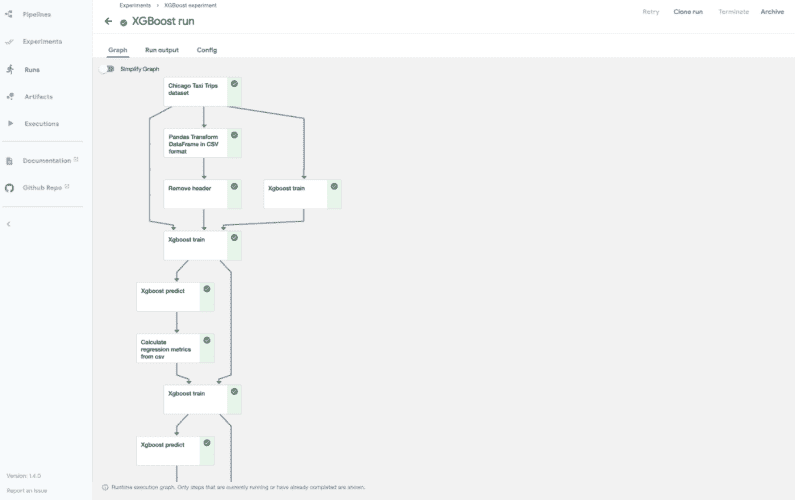

*Kubeflow: runtime execution graph | [Source](https://web.archive.org/web/20220926082702/https://www.kubeflow.org/docs/images/pipelines-xgboost-graph.png)*

##### Katib 是一个针对 AutoML 的 kubernetes-native 项目，它支持超参数调优和任何实验的提前停止。在 Katib 的帮助下，用户无需担心运行训练作业和手动调整超参数以找到最佳值。它还为超参数值的各种组合提供了准确性验证。这些调整参数或提前停止的实验必须在 YAML 配置文件中定义，以便 Katib 相应地获取和运行。

中央仪表板

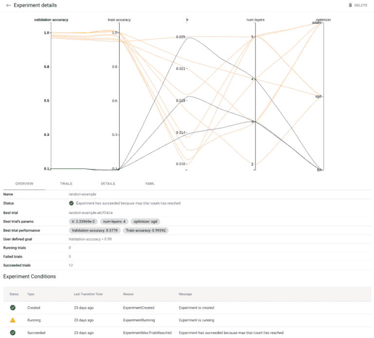

*Kubeflow: hyperparameters and tuning | [Source](https://web.archive.org/web/20220926082702/https://www.kubeflow.org/docs/components/katib/images/random-example-graph.png)*

##### [Kubeflow central dashboard](https://web.archive.org/web/20220926082702/https://www.kubeflow.org/docs/components/central-dash/) 提供对集群中部署的其他 Kubeflow 组件的快速访问，例如笔记本电脑、管道、指标等的列表。用户可以轻松管理笔记本服务器、TensorBoards、KFServing 模型和实验。如果需要，管理员可以集成第三方应用程序。

7.瓦罗海

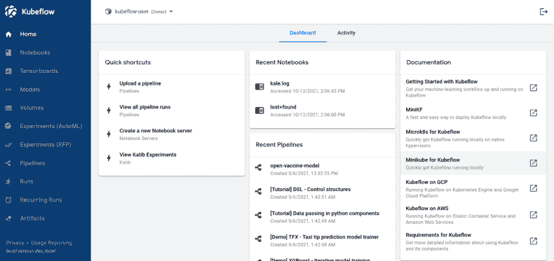

*Kubeflow: central dashboard | [Source](https://web.archive.org/web/20220926082702/https://www.kubeflow.org/docs/images/central-ui.png)*

### [Valohai](https://web.archive.org/web/20220926082702/https://valohai.com/) 是 MLOps 平台，帮助企业实现端到端 ML 管道的自动化。它兼容任何编程语言或框架。它帮助用户从任何地方运行他们的实验，并自动跟踪每个实验。它可以在任何云平台或内部轻松设置。

Valohai 还提供完整的版本控制、实验比较和可追溯性。用户可以部署不同的模型版本，监控性能指标，并在需要时使用记录的超参数和元数据来重现实验。

优于 pagemaker

#### 在团队内部以完全透明的方式标准化工作流程。

*   一个具有异步超参数扫描功能的笔记本电脑中心。
*   以图形或表格的形式可视化实验比较。
*   兼容任何编程语言和 ML 框架。
*   **版本控制–**valo hai 会自动对用户运行的所有内容进行版本控制，例如超参数、库版本和硬件或资源设置。完整的版本控制是实现可再现性和法规遵从性的唯一途径。用户不需要维护单独的模型注册中心或元数据存储。

**模型监控–**它收集并存储流程内部输出的所有内容，无论是错误堆栈跟踪、模型指标还是健康信息。当度量被解析时，可以使用 Valohai 部署监视 UI 来可视化它们，用户可以在其中分析任何所选时间范围的日志和度量。

*Valohai: model version control | [Source](https://web.archive.org/web/20220926082702/https://valohai.com/product/)*

**实验比较—**从平台上的执行表中，用户可以选择多个实验/执行，并使用交互式图形和表格比较它们的元数据。用户可以在一个很大程度上分布式的学习运行中轻松地实时可视化超参数调整。也可以在本地下载这些元数据，然后离线比较实验。

*Valohai: model monitoring | [Source](https://web.archive.org/web/20220926082702/https://docs.valohai.com/howto/deployments/deployment-monitoring/)*

**数据字典—**valo hai 自动跟踪机器学习模型中使用的每一项数据资产。它的数据树表示从最终结果一直到原始数据的每一步，允许您深入任何中间数据资产并检查它。

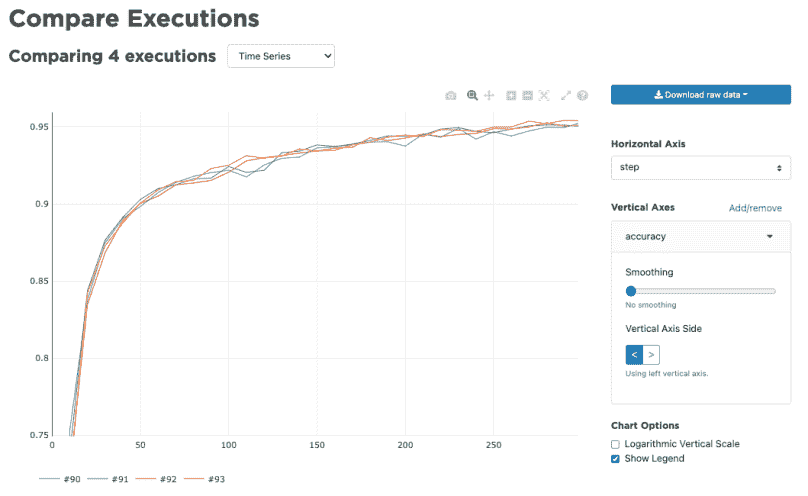

*Valohai: compare executions | [Source](https://web.archive.org/web/20220926082702/https://docs.valohai.com/_images/compare_executions1.png)*

表格对比:Sagemaker vs 替代品

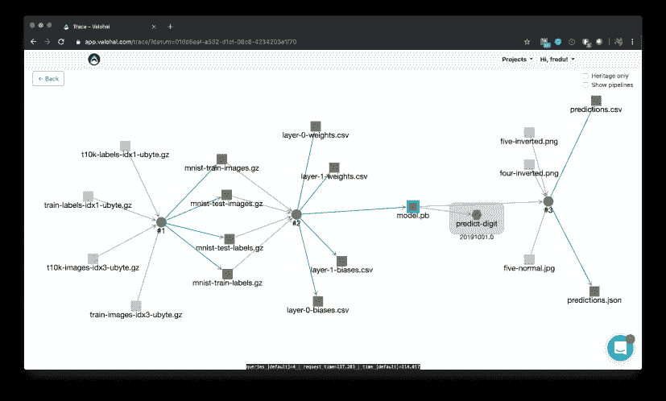

*Valohai: auditable data lineage | [Source](https://web.archive.org/web/20220926082702/https://valohai.com/blog/blog-building-a-data-catalog-for-machine-learning/)*

## 到目前为止，在本文中，我们已经讨论了 AWS SageMaker 的替代产品，以及为什么以及何时应该选择它们。让我们快速看一下这些工具在不同方面的不同之处，这样你就可以为你的用例做出正确的选择。

最后的想法

当谈到实验跟踪和模型监控时，有大量的工具可供选择。AWS SageMaker 是 ML 工程师中最受欢迎的工具之一，但它有其局限性，这就是为什么企业正在寻找更加开放和简单的集成工具。

## 这些替代工具中的大多数都提供了很好的用户界面，并且不局限于某个特定的 ML 框架或云平台。工具的选择完全取决于个人需求，例如，如果用户只希望跟踪某项实验的性能，他们可能更喜欢独立的工具；如果要求看透模型管道的每一步，他们可以选择端到端平台。

在过去的几年中，这些实验跟踪和模型监控等的市场呈指数增长，并且当前可用的工具已经被进一步改进。工具列表并不仅限于上述工具，还有更多类似的工具，可能最适合用户需求，如[神圣](https://web.archive.org/web/20220926082702/https://github.com/IDSIA/sacred)、[公会 AI](https://web.archive.org/web/20220926082702/https://guild.ai/) 、 [TensorBoard](https://web.archive.org/web/20220926082702/https://www.tensorflow.org/tensorboard) 、 [Verta.ai](https://web.archive.org/web/20220926082702/https://www.verta.ai/) 等。

所以继续学习，快乐实验！

娜塔莎·夏尔马

埃森哲
公司的高级软件工程师她从大型机开发人员做起，逐渐掌握了其他编程语言和工具。她拥有格拉斯哥大学的数据科学硕士学位，曾在一家数字分析公司担任数据分析师。她相信不断的学习和知识分享会让她写文章。她一直通过博客为数据科学社区做出贡献，如《走向数据科学》、《心跳》和《数据科学+》。

### **阅读下一篇**

InstaDeep 案例研究:寻找协作功能和所有实验的中心位置

* * *

5 分钟阅读| 2021 年 11 月 22 日更新

## InstaDeep Case Study: Looking for Collaboration Features and One Central Place for All Experiments

InstaDeep 是提供决策型人工智能产品的 EMEA 领导者。利用他们在 GPU 加速计算、深度学习和强化学习方面的广泛知识，他们已经构建了一些产品，如新颖的 DeepChain 平台，以解决一系列行业中最复杂的挑战。

InstaDeep 还与人工智能生态系统的全球领导者建立了合作关系，如谷歌 DeepMind、英伟达和英特尔。他们是英特尔 AI Builders 计划的一部分，也是 EMEA 仅有的两家英伟达精英服务交付合作伙伴之一。InstaDeep 团队由大约 155 人组成，在伦敦、巴黎、突尼斯、拉各斯、迪拜和开普敦的办事处网络中工作，并且发展迅速。

关于 BioAI 团队

BioAI 团队是 InstaDeep 中生物学与人工智能相遇的地方。在 BioAI，他们通过结合生物学和机器学习专业知识，推进医疗保健，并推动医学科学的发展。他们目前正在构建 [DeepChain](https://web.archive.org/web/20220926082702/http://www.deepchain.bio/) ，这是他们的蛋白质设计平台。他们还与生物领域的客户合作，在生物信息学和机器学习的帮助下解决最具挑战性的问题。

#### About the BioAI team

The BioAI team is the place at InstaDeep where Biology meets Artificial intelligence. At BioAI, they advance healthcare and push the boundaries of medical science through a combination of biology and machine learning expertise. They are currently building [DeepChain](https://web.archive.org/web/20220926082702/http://www.deepchain.bio/)™, their platform for protein design. They are also working with their customers in the bio sector to tackle the most challenging problems with the help of bioinformatics and machine learning.

他们应用 DeepChain 蛋白质设计平台，使用强化学习和进化算法等复杂的优化技术来设计蛋白质目标的新序列。他们还利用在数百万蛋白质序列上预先训练的语言模型，训练他们自己的内部蛋白质语言模型。最后，他们使用机器学习从序列中预测蛋白质结构。

问题

构建像蛋白质设计平台 DeepChain 这样的复杂软件，需要对不同的活动部件进行大量研究。客户需要各种类型的解决方案，每次都需要新的实验和研究。由于要为不同的客户运行几个实验，因此对于任何规模的团队来说，在确保实验保持高效的同时跟踪这些实验都不可避免地令人望而生畏。

## 尼古拉斯和 BioAI 团队被管理大量实验的想法所困扰，遇到了一系列挑战:

Building complex software like DeepChain™, a platform for protein design, requires a lot of research with different moving parts. Customers demand various types of solutions that require new experiments and research every time. With several experiments running for different customers, it will be unavoidably daunting for a team of any size to keep track of the experiments while ensuring they remain productive.

实验日志到处都是

## 分享实验结果很困难

*   机器学习研究人员正在处理基础设施和运营

*   2It was difficult to share experiment results

*   3Machine learning researchers were dealing with infrastructure and operations

[Continue reading ->](/web/20220926082702/https://neptune.ai/customers/instadeep)

* * *