# Apache Spark 教程:开始使用 Spark 服务 ML 模型

> 原文：<https://web.archive.org/web/https://neptune.ai/blog/apache-spark-tutorial>

到 2025 年，预计每天将产生 463 艾字节的数据。数据科学家需要理解这些数据。显然，你不能在任何一台计算机上处理或存储大数据。大数据需要存储在计算机集群中。

这使得机器学习过程更加复杂。幸运的是，有专门为处理大数据而构建的工具。Apache Spark 就是这些工具之一。

让我们看看如何使用 Apache Spark 来处理大数据。

## 什么是阿帕奇火花？

[Apache Spark](https://web.archive.org/web/20221206001716/https://spark.apache.org/) 是一个分析和处理大数据的开源引擎。Spark 应用程序有一个驱动程序，运行用户的主要功能。它还负责在集群中执行并行操作。

这个上下文中的集群指的是一组节点。每个节点都是一台机器或服务器。发送给执行器的一个工作单元称为一个任务，涉及多个任务的并行计算称为一个作业。

### 火花语境

Spark 中的应用程序由 SparkContext 控制。它连接到集群管理器，如上图所示。有几个集群管理器，即:

*   Spark 自己的独立集群管理器
*   梅索斯
*   故事

集群管理器为 Spark 应用程序分配资源。

### 火花执行者

执行器位于 worker 节点上，它们运行计算并存储应用程序的数据。工作节点负责在集群中运行应用程序代码。

Spark 中的每个应用都会有自己的[执行程序](https://web.archive.org/web/20221206001716/https://spark.apache.org/docs/latest/cluster-overview.html)。SparkContext 向执行者发送任务。应用程序是相互隔离的，因为每个应用程序都有自己的执行程序。

### 为什么使用 Apache Spark

还有其他工具，如 [Hadoop](https://web.archive.org/web/20221206001716/https://hadoop.apache.org/) ，可以用于分布式计算。你为什么要用 Apache Spark？

*   由于内存计算，它比 Hadoop 快 100 倍
*   Apache Spark 可以用在 Java、 [Scala](https://web.archive.org/web/20221206001716/https://spark.apache.org/docs/latest/) 、 [Python](https://web.archive.org/web/20221206001716/https://spark.apache.org/docs/0.9.2/python-programming-guide.html) 、R 或者 SQL 中
*   您可以在 Hadoop、Apache Mesos、Kubernetes 或云中运行 Apache Spark

## 阿帕奇火花装置

预计您将在一个计算机集群中运行 Spark，例如一个云环境。然而，如果你是 Spark 的初学者，有更快的方法可以开始。让我们来看看其中的一些。

### 在 Google Colab 上设置 Spark

要在 Google Colab 上运行 Spark，你需要两样东西:openjdk 和 findspark。

“findspark”是使 spark 可以在 Google Colab 上导入的包。您还需要下载 Spark 并提取它。

```py
!apt-get install openjdk-8-jdk-headless -qq > /dev/null
!wget -q https://www-us.apache.org/dist/spark/spark-3.0.1/spark-3.0.1-bin-hadoop2.7.tgz
!tar xf spark-3.0.1-bin-hadoop2.7.tgz
!pip install findspark
```

下一步，根据 Spark 和 Java 的安装位置设置一些环境变量。

```py
import os
os.environ["JAVA_HOME"] = "/usr/lib/jvm/java-8-openjdk-amd64"
os.environ["SPARK_HOME"] = "/content/spark-3.0.1-bin-hadoop2.7"
```

接下来，使用“findspark”使 spark 可导入。

```py
import findspark
findspark.init()
```

任何时候你想使用 Spark，你都需要创建 SparkContext。创建一个“SparkContext”实例，以确认 Spark 安装成功。

```py
import pyspark
sc = pyspark.SparkContext()
```

### 在本地机器上安装 Apache Spark

如何在本地机器上安装 Spark？这个过程会变得非常复杂，非常迅速。这可能不值得，因为您实际上不会在本地机器上运行类似生产的集群。

使用容器在本地机器上运行 Spark 的安装会更加容易和快捷。您需要安装 [Docker](https://web.archive.org/web/20221206001716/https://docs.docker.com/engine/install/) 以便使用容器安装 Spark。

下一步是从 Docker Hub 中提取 Spark 图像。完成后，您将能够访问本地主机:8888 上的现成笔记本。

```py
$ docker run -p 8888:8888 jupyter/pyspark-notebook
```

当您导航到该笔记本时，您可以启动一个新的 SparkContext 来确认安装。

```py
import pyspark
sc = pyspark.SparkContext()
```

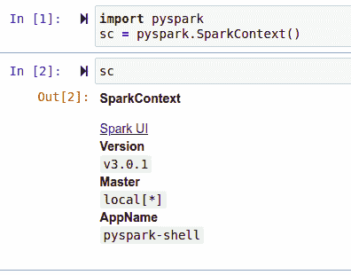

### 在数据块上运行 Apache Spark

最省事的选择是使用 Databricks 社区版。你唯一需要做的就是建立一个免费账户。本文将假设您在 Databricks 上运行 Spark。然而，我们提到的所有其他替代方案都足够了。

## Apache Spark 基础知识

在 Apache Spark 中需要理解的最基本的事情是它如何表示数据。主要表现在:

*   弹性分布式数据集
*   Dataframes

### 弹性分布式数据集

一个[弹性分布式数据集(RDD)](https://web.archive.org/web/20221206001716/https://databricks.com/glossary/what-is-rdd) 是一个可以并行操作的容错元素集合。rdd 自动从故障中恢复。在以下情况下，这种格式是很好的选择:

*   您正在处理非结构化数据，如媒体或文本流
*   您需要对数据集执行低级转换

#### RDD 创作

您可以通过并行化驱动程序中的集合或使用文件系统中的数据集来创建 RDD。Spark 将决定分割数据集的最佳分区数量。但是，您可以将它作为第二个参数传递给“并行化”函数:

```py
my_list = [1, 2, 3, 4, 5,6]
my_list_distributed = sc.parallelize(my_list,3)
```

#### RDD 行动

在 Spark 中，有两种主要操作类型:

#### 火花变换

转换将从现有的数据集创建新的数据集。这种操作的一个例子是“映射”。转换是懒惰的，这意味着它们不会立即返回计算结果。只有当动作请求结果时，计算才会发生。

```py
my_list = [2,3,4,5,6]
def power_two(x):
  return x**2
list(map(power_two,my_list))
```

#### 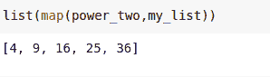

Spark 中的其他转换包括:

*   ` filter`–在选择在特定条件下返回 true 的项目后返回数据集
*   ` union`–返回两个数据集的并集

#### 火花动作

在对数据集进行特定计算后，操作将返回值。例如,“减少”功能。

```py
results = map(power_two,my_list)
for result in results:
  print(result)
```

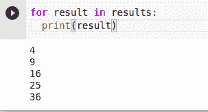

使用 Spark 还可以执行一些其他操作:

*   ` collect '以数组形式返回数据集
*   ` count '返回数据集中的项目数
*   ` take(n )'返回数据集的前 n 个元素
*   ` first '返回数据集中的第一个元素

#### RDD 持久性

Spark 允许您通过缓存数据集来提高应用程序的性能。计算结果可以保存在内存中，下次需要时可以从缓存中检索。Spark 中的缓存是容错的，因此任何丢失的分区都将使用创建它们的转换重新计算。

```py
df.cache()
```

### Dataframes

Spark 数据帧是不可变的，非常类似于[熊猫数据帧](https://web.archive.org/web/20221206001716/https://pandas.pydata.org/pandas-docs/stable/reference/api/pandas.DataFrame.html)。稍后您将会看到，Spark 数据帧可以使用 SQL 进行查询。通过下面的机器学习示例，您将看到 Spark 中数据帧和 SQL 的用法。

## Spark 中的机器学习

你可以使用' pyspark.ml '在 spark 中进行机器学习，这个模块是 Spark 自带的，所以你不需要去寻找或者安装它。登录到您的 [Databricks](https://web.archive.org/web/20221206001716/https://community.cloud.databricks.com/) 帐户后，创建一个集群。本练习所需的笔记本电脑将在该集群中运行。

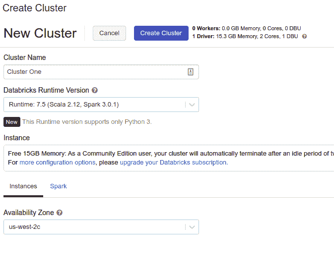

当集群准备就绪时，创建一个笔记本。接下来，您需要定义数据的来源。Databricks 允许您从其合作伙伴提供商上传数据或链接。上传数据时，需要小于 2GB。

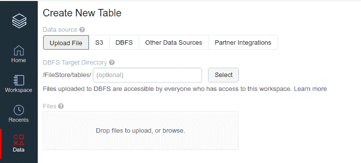

为了便于说明，让我们使用来自 UCI 机器学习的心脏病数据集。

### 使用 Spark 进行数据探索

将数据集上传到 Databricks 后，请记下数据集的路径，以便可以使用它来加载数据。此外，请确保您的笔记本电脑已连接到集群。

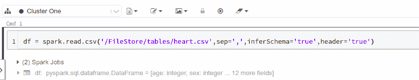

```py
df = spark.read.csv('/FileStore/tables/heart.csv',sep=',',inferSchema='true',header='true')
```

请注意，您不必创建 SparkContext。这是因为 Databricks 在默认情况下会为您做这件事。您可以在单元格中键入“sc”来确认这一点。

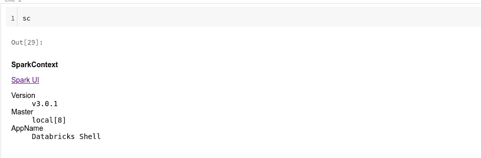

您还可以单击 Spark UI 的链接来查看关于您的集群的更多信息。

在数据块上运行数据探索的最快方法是使用“显示(df)”功能。这个函数是 Databricks 独有的，所以如果你在 Google Colab 或你的本地机器上，它将不起作用。在这些平台上，您可以使用:

```py
df.display()
```

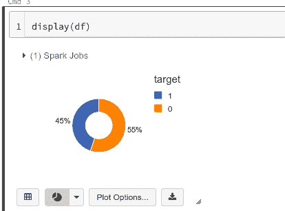

点击绘图选项按钮会给你更多的图表和选项，你可以尝试。你也可以下载这些图。

如前所述，您可以运行过滤操作。

```py
df.filter((df.age>20) & (df.target=='1')).show()
```

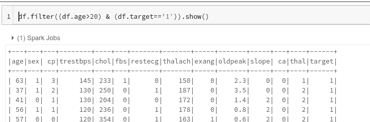

Spark 还可以让你运行“分组”操作，就像你在熊猫身上做的那样。让我们看看如何做到这一点。

```py
from pyspark.sql import functions as F
df.groupBy(["sex"]).agg(
    F.mean("age").alias("Mean Age")
    ).show()
```

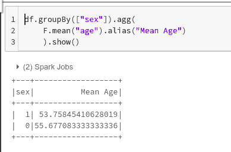

如果您来自 SQL 世界，您可能会对查询数据框感兴趣，就像查询 SQL 表一样。您可以通过使用“SQLContext”注册一个临时 SQL 表来实现这一点。之后，就可以正常运行 SQL 查询了。

```py
from pyspark.sql import SQLContext
sqlContext = SQLContext(sc)
df.registerTempTable('df_table')
df_sql = sqlContext.sql('select age,target,sex,slope,cp from df_table where age>30 ORDER BY age DESC')
df_sql.show()
```


### 用 Spark 进行数据预处理

一旦完成了数据探索，下一步就是将数据转换成 Spark 的 MLlib 可以接受的格式。在这种情况下，需要将特征转换为单个向量，该向量将被传递给机器学习模型。

这可以使用“VectorAssembler”来完成。让我们导入它，并使用数据集中的功能实例化它。

```py
from pyspark.ml.feature import VectorAssembler
feat_cols = ['age',
 'sex',
 'cp',
 'trestbps',
 'chol',
 'fbs',
 'restecg',
 'thalach',
 'exang',
 'oldpeak',
 'slope',
 'ca',
 'thal']
vec_assember = VectorAssembler(inputCols = feat_cols, outputCol='features' )
```

下一步是用它来转换数据框。

```py
final_data = vec_assember.transform(df)
```

“take”功能可用于查看数据集的一部分。你会注意到一个叫做“特征”的向量，它包含了所有的特征。

```py
final_data.take(2)
```

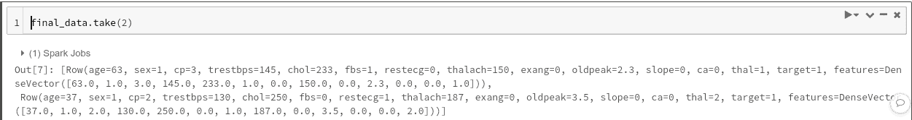

接下来，将数据集分成训练集和测试集。

```py
training,testing = final_data.randomSplit([0.7,0.3],seed=42)
```

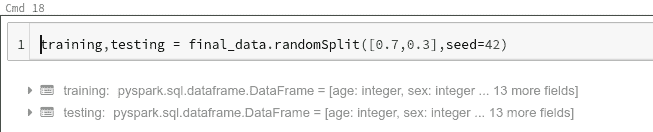

### 用 PySpark MLlib 构建机器学习模型

下一步是使这个数据集适合算法。这里我们用逻辑回归。
从导入开始。你可以在这里访问更多的[算法。](https://web.archive.org/web/20221206001716/https://spark.apache.org/docs/latest/ml-guide.html)

```py
from pyspark.ml.classification import LogisticRegression
```

让我们创建一个算法实例，同时传递标签列名和特性名。

```py
lr = LogisticRegression(labelCol='target',featuresCol='features')
```

现在让模型适应训练集。

```py
lrModel = lr.fit(training)
```

### 评估模型

在评估模型之前，您必须运行预测。使用“转换”功能。

```py
predictions = lrModel.transform(testing)
```

您可以通过选择一些列来查看这些预测。

```py
predictions.select('target','prediction','probability','age','sex').show()
```

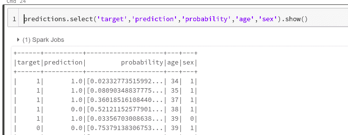

由于这是二元分类，因此可以使用“BinaryClassificationEvaluator”函数来评估模型。

```py
from pyspark.ml.evaluation import BinaryClassificationEvaluator
evaluator.evaluate(predictions)
```

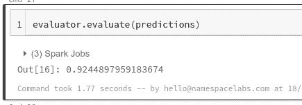

### 服务于 Apache Spark 机器学习模型

Databricks 让你用 MLflow 服务你的机器学习模型。然而，为您的模型提供服务的最简单的方法是将其发送到像 Neptune 这样的模型注册中心。

```py
lrModel.save("model.pkl")
neptune.log_artifact(“model.pkl”)
```

## 最后的想法

在本文中，您已经看到 Apache Spark 可用于分析和构建处理大数据的机器学习模型。我们还讨论了使用 Apache Spark 的核心概念:

*   什么是阿帕奇火花
*   Apache Spark 中的数据表示
*   安装 Apache Spark 的各种方法
*   在本地机器 Databricks 和 Google Colab 上运行 Spark
*   使用 Apache Spark 构建和保存机器学习模型

现在，您已经掌握了使用大数据探索和构建机器学习模型所需的技能。感谢阅读！