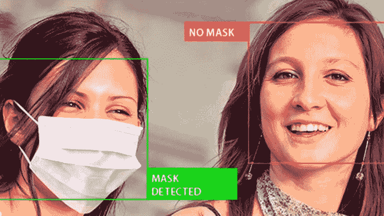
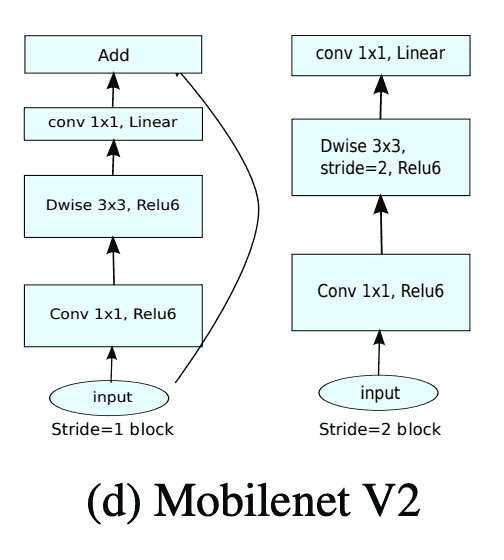

# 人工智能在无人机技术中的应用:建立适用于无人机的机器学习模型(使用 TensorFlow/Keras)

> 原文：<https://web.archive.org/web/https://neptune.ai/blog/applications-of-ai-in-drone-technology-machine-learning-models-with-tensorflow-keras>

欢迎回到利用无人机技术和深度学习构建面罩监控系统的第二部分。[在第一部分](/web/20221206051524/https://neptune.ai/blog/building-a-facemask-surveillance-system-with-drone-technology)中，我们介绍了无人机技术、各种分类、本项目使用的无人机架构，以及使用 python 设置无人机编程环境。

如果你不熟悉第 1 部分，[你可以在我们的博客](/web/20221206051524/https://neptune.ai/blog/building-a-facemask-surveillance-system-with-drone-technology)上找到它。

在这一部分中，我们将下载并预处理人脸面具数据集，使用 Tensorflow/Keras 建立人脸面具检测模型，运行训练并保存深度学习模型以供进一步实施。

## 先决条件

为了完全理解本教程，假设您:

以下是一些帮助您开始的链接:

现在，让我们继续建立我们的监视系统。在本节中，我们构建深度学习模型来检测两个类别，即:

1.  戴面具的人
2.  没有面具的人



*Face mask classification*

为了进行这种分类，我们将利用一种称为 [**卷积神经网络(CNN)**的深度神经网络，它通常用于分析视觉图像](/web/20221206051524/https://neptune.ai/blog/graph-neural-network-and-some-of-gnn-applications)。

## 下载和预处理数据集

数据是任何 ML/AI 算法的核心。对于这个项目，数据集是从 [Kaggle](https://web.archive.org/web/20221206051524/https://www.kaggle.com/wobotintelligence/face-mask-detection-dataset) 和 [RMFD 数据集](https://web.archive.org/web/20221206051524/https://github.com/X-zhangyang/Real-World-Masked-Face-Dataset)下载的。数据集由属于两类的 **3835 幅图像**组成:

1.  with_mask: 1916 个图像
2.  不带 _mask: 1919 张图片。

为了开始构建这些模型，我们需要导入必要的库，包括用于预处理、模型构建、模型评估、可视化和文件管理的模块。

```py
from tensorflow.keras.preprocessing.image import ImageDataGenerator
from tensorflow.keras.applications import MobileNetV2
from tensorflow.keras.layers import AveragePooling2D
from tensorflow.keras.layers import Dropout
from tensorflow.keras.layers import Flatten
from tensorflow.keras.layers import Dense
from tensorflow.keras.layers import Input
from tensorflow.keras.models import Model
from tensorflow.keras.optimizers import Adam
from tensorflow.keras.applications.mobilenet_v2 import preprocess_input
from tensorflow.keras.preprocessing.image import img_to_array
from tensorflow.keras.preprocessing.image import load_img
from tensorflow.keras.utils import to_categorical
from sklearn.preprocessing import LabelBinarizer
from sklearn.model_selection import train_test_split
from sklearn.metrics import classification_report
from imutils import paths
import matplotlib.pyplot as plt
import numpy as np
import argparse
import os

```

同样为了帮助 TensorBoard 记录， [Neptune AI 与两个平台进行了巧妙的集成](https://web.archive.org/web/20221206051524/https://docs.neptune.ai/integrations-and-supported-tools/experiment-tracking/tensorboard)。为了利用该服务，我们导入了以下库:

```py
import random
import psutil
import neptune
import neptune_tensorboard as neptune_tb

```

接下来，我们将使用 dot_env 模块从`.env`加载我们的 Neptune API 凭证。需要这个 API 令牌来授权您的训练脚本和 Neptune 之间的通信。为了使我们的 API 令牌保密，因为它就像是我们应用程序的密码，我们将利用环境变量通过`dot_env`库来加载值。

```py
from dotenv import load_dotenv
load_dotenv()

API_SECRET = os.getenv("NEPTUNE_API_TOKEN")

```

接下来，我们将启动项目并自动记录 TensorBoard 指标:

```py
<pre class="hljs" style="display: block; overflow-x: auto; padding: 0.5em; color: rgb(51, 51, 51); background: rgb(248, 248, 248);">neptune.init(project_qualified_name=<span class="hljs-string" style="color: rgb(221, 17, 68);">'codebrain/Drone'</span>,
         	api_token=API_SECRET,
         	)
neptune_tb.integrate_with_tensorflow()
</pre>
```

有了这些，我们可以开始设置用于训练我们的人脸面具检测模型的环境，我们将初始化初始学习率、训练的时期数和批量大小，并设置实验日志目录。

```py
PARAMS = {
	'EPOCHS': 20,
	'BS': 32,
	'INIT_LR': 1e-4,
}
RUN_NAME = 'run_{}'.format(random.getrandbits(64))
EXPERIMENT_LOG_DIR = 'logs/{}'.format(RUN_NAME)

```

接下来，我们将构建参数解析器，使编写用户友好的命令行界面与数据集、绘图和模型进行交互变得容易。

```py
ap = argparse.ArgumentParser()
ap.add_argument("-d", "--dataset", required=True,
            	help="path to input dataset")
ap.add_argument("-p", "--plot", type=str, default="plot.png",
            	help="path to output loss/accuracy plot")
ap.add_argument("-m", "--model", type=str,
            	default="mask_detector.model",
            	help="path to output face mask detector model")
args = vars(ap.parse_args())

```

接下来，我们将从数据集目录中获取图像列表，然后初始化数据和类/标签列表。

```py
print("[INFO] loading images...")
imagePaths = list(paths.list_images(args["dataset"]))
data = []
labels = []

```

我们将循环遍历图像路径，从文件名中提取类别标签，并每次将图像预处理为 224×224 像素，然后输入到神经网络中。此外，我们将这些图像转换为数组，并将输入图像传递给`preprocess_input`函数，这意味着将您的图像充分转换为模型所需的格式(您保证您加载的图像与 preprocess_input 兼容)。最后将数据和标签转换成 NumPy 数组，以便进一步处理。对标签执行一次热编码，将分类数据转换为数字数据**。**

```py
for imagePath in imagePaths:
	label = imagePath.split(os.path.sep)[-2]

		image = load_img(imagePath, target_size=(224, 224))
	image = img_to_array(image)
	image = preprocess_input(image)

	data.append(image)
	labels.append(label)

data = np.array(data, dtype="float32")
labels = np.array(labels)

lb = LabelBinarizer()
labels = lb.fit_transform(labels)
labels = to_categorical(labels)

```

接下来，我们告诉海王星创造一个实验。给它命名并记录[超参数](/web/20221206051524/https://neptune.ai/blog/hyperparameter-tuning-in-python-a-complete-guide-2020)。如果可能的话，建议将所有内容都放在 with 语句中，以便在实验完成后执行自动清理。在训练模型之前，我们需要将数据分为训练和测试数据，其中 80%的数据用于训练，其余 20%用于测试。

```py
with neptune.create_experiment(name=RUN_NAME, params=PARAMS):

	(trainX, testX, trainY, testY) = train_test_split(data, labels,
                                                  	test_size=0.20, stratify=labels, random_state=42)

```

构建训练图像生成器，以通过创建图像的修改版本来人为地扩大训练数据集的大小。这种数据扩充将有助于模型更好地概括。

```py
aug = ImageDataGenerator(
	rotation_range=20,
	zoom_range=0.15,
	width_shift_range=0.2,
	height_shift_range=0.2,
	shear_range=0.15,
	horizontal_flip=True,
	fill_mode="nearest")

```

## 模型结构

在对数据集进行预处理并正确标记后，下一步是训练一个模型来准确地对图像进行分类。有两种方法可以做到这一点，要么你从头开始建立一个分类器，要么使用一个预先训练好的模型。我选择了后者，并采用了 [mobilenet_v2](https://web.archive.org/web/20221206051524/https://www.tensorflow.org/api_docs/python/tf/keras/applications/mobilenet_v2) 这是一个 53 层深的卷积神经网络。



*MobileNet V2 Architecture *

**注:**使用预训练模型时，仔细阅读正在使用的模型非常重要，它可以用来解决手头的问题。此外，为了能够处理预处理过的数据集。由于 MobilenetV2 在对象检测、降低的复杂性以及对计算、图形处理和存储的限制方面具有最先进的性能，因此对其进行了调整。

调整模型包括用预训练的权重图像网加载模型，并向模型添加更多的结构。卷积层之后是激活函数 ReLU(增加非线性)和最大池(减少特征图)。添加辍学是为了防止神经网络过度拟合。然后，在末尾添加完全连接的层。最后，我们将我们的模型编译成损失函数、优化器和指标**。****损失函数**用于查找学习过程中的错误或偏差。 [Keras 在模型编译过程中需要损失函数](/web/20221206051524/https://neptune.ai/blog/keras-loss-functions)。**优化**是通过比较预测和损失函数来优化输入权重的重要过程，并且 [**指标**用于评估您的模型](/web/20221206051524/https://neptune.ai/blog/keras-metrics)的性能。模型被序列化并保存在我的本地磁盘上。

**注意:**头模型将被放置在基础模型之上，这将成为我们将要训练的实际模型。

```py
baseModel = MobileNetV2(weights="imagenet", include_top=False,
                    	input_tensor=Input(shape=(224, 224, 3)))

headModel = baseModel.output
headModel = AveragePooling2D(pool_size=(7, 7))(headModel)
headModel = Flatten(name="flatten")(headModel)
headModel = Dense(128, activation="relu")(headModel)
headModel = Dropout(0.5)(headModel)
headModel = Dense(2, activation="softmax")(headModel)
model = Model(inputs=baseModel.input, outputs=headModel)

for layer in baseModel.layers:
	layer.trainable = False

print("[INFO] compiling model...")
opt = Adam(lr=PARAMS['INIT_LR'],
           decay=PARAMS['INIT_LR'] / PARAMS['EPOCHS'])
model.compile(loss="binary_crossentropy", optimizer=opt,
              metrics=["accuracy"])

print("[INFO] training head...")
tensorboard=tf.keras.callbacks.TensorBoard(log_dir=EXPERIMENT_LOG_DIR)
H = model.fit(
    	aug.flow(trainX, trainY, batch_size=PARAMS['BS']),
    	steps_per_epoch=len(trainX) // PARAMS['BS'],
    	validation_data=(testX, testY),
    	validation_steps=len(testX) // PARAMS['BS'],
    	epochs=PARAMS['EPOCHS'],
    	callbacks=[tensorboard]
	)

```

下一步是通过预测测试数据标签来评估模型的性能。

```py
print("[INFO] evaluating network...")
predIdxs = model.predict(testX, batch_size=PARAMS['BS'])

predIdxs = np.argmax(predIdxs, axis=1)

print(classification_report(testY.argmax(axis=1), predIdxs,
                            target_names=lb.classes_))

print("[INFO] saving mask detector model...")
model.save(args["model"], save_format="h5")

```

最后，我们需要从我们的海王星实验仪表板可视化训练损失和准确性。

在这里可以看到仪表板。

我们可以从 Neptune 实验仪表板[监控硬件消耗](https://web.archive.org/web/20221206051524/https://docs.neptune.ai/you-should-know/logging-metadata#hardware-consumption-and-console-logs)。

仪表盘可以在这里看到。

## 在视频流上实现模型

这是一个新的脚本，它将从之前的会话中加载保存的模型。为了开始实现，我们需要导入一些必要的库。

```py
from tensorflow.keras.applications.mobilenet_v2 import preprocess_input
from tensorflow.keras.preprocessing.image import img_to_array
from tensorflow.keras.models import load_model
from imutils.video import VideoStream
import numpy as np
import argparse
import imutils
import time
import cv2
import os
import time

```

接下来，我们将创建两个函数`get_facenet_masknet`和`detect_and_predict_mask`。`get_facenet_masknet`功能将读入之前序列化的训练模型和相应的权重。

```py
def get_facenet_masknet():

	ap = argparse.ArgumentParser()
	ap.add_argument("-f", "--face", type=str,
                	default="face_detector",
                	help="path to face detector model directory")
	ap.add_argument("-m", "--model", type=str,
                	default="mask_detector.model",
                	help="path to trained face mask detector model")
	ap.add_argument("-c", "--confidence", type=float, default=0.5,
                	help="minimum probability to filter weak detections")
	args = vars(ap.parse_args())

	print("[INFO] loading face detector model...")

	prototxtPath = (
    	'/Users/USER/Documents/DroneProjects/facemaskdetection/face_detector/deploy.prototxt')

	weightsPath = (
    	'/Users/USER/Documents/DroneProjects/facemaskdetection/face_detector/res10_300x300_ssd_iter_140000.caffemodel')
	faceNet = cv2.dnn.readNet(prototxtPath, weightsPath)

	print("[INFO] loading face mask detector model...")
	maskNet = load_model(
    	'/Users/USER/Documents/DroneProjects/facemaskdetection/mask_detector.model')
	return(faceNet, maskNet, args)

```

在适当的位置，`detect_and_predict_mask`将抓取框架的尺寸，并从中构造一个斑点。斑点将通过网络来检测面部。

我们将抓住维度:

```py
def detect_and_predict_mask(frame, faceNet, maskNet, args):
(h, w) = frame.shape[:2]
	blob = cv2.dnn.blobFromImage(frame, 1.0, (300, 300),
                             	(104.0, 177.0, 123.0))

	faceNet.setInput(blob)
	detections = faceNet.forward()

```

接下来，我们将初始化我们的人脸列表及其相应的位置，以及来自我们的人脸面具网络的预测列表。

```py
	faces = []
	locs = []
	preds = []

```

我们将循环检测以提取与检测相关的置信度(即概率)。

```py
	for i in range(0, detections.shape[2]):
    		confidence = detections[0, 0, i, 2]

```

接下来，我们将通过确保置信度大于最小置信度来过滤掉弱检测。

```py
   	if confidence > args["confidence"]:

        	box = detections[0, 0, i, 3:7] * np.array([w, h, w, h])
        	(startX, startY, endX, endY) = box.astype("int")

```

我们还必须确保边界框落在框架的尺寸范围内。

```py
        	(startX, startY) = (max(0, startX), max(0, startY))
        	(endX, endY) = (min(w - 1, endX), min(h - 1, endY))

```

我们将做一些预处理步骤，包括提取面部 ROI，然后将其从 BGR 转换到 RGB 通道排序。然后继续将帧的大小调整为 224×224 像素，并将其转换为数组。

```py
        	face = frame[startY:endY, startX:endX]
        	face = cv2.cvtColor(face, cv2.COLOR_BGR2RGB)
        	face = cv2.resize(face, (224, 224))
        	face = img_to_array(face)
        	face = preprocess_input(face)

```

我们必须确保将面和边界框添加到它们各自的列表中。

```py
         	faces.append(face)
        	locs.append((startX, startY, endX, endY))

```

如果至少检测到一个面，将进行预测，然后同时对所有面进行批量预测，而不是逐个预测。

```py
	if len(faces) > 0:
    	faces = np.array(faces, dtype="float32")
    	preds = maskNet.predict(faces, batch_size=32)

```

最后，我们将返回一个脸部位置及其对应位置的二元组。

```py
	return (locs, preds)

```

## 结论

在本教程中，您了解了如何预处理和加载面罩数据集，以及如何使用 Tensorflow Mobilenet V2 和 Python 来训练面罩检测模型。经过训练的模型进一步适用于视频流实现。最后，该模型被序列化为项目的下一阶段，包括在 flask 应用程序上部署该监视系统。

利用从第 1 部分和第 2 部分获得的知识，我们已经完全构建了监控系统的框架，下一部分将介绍该系统的部署。阅读愉快，敬请关注。