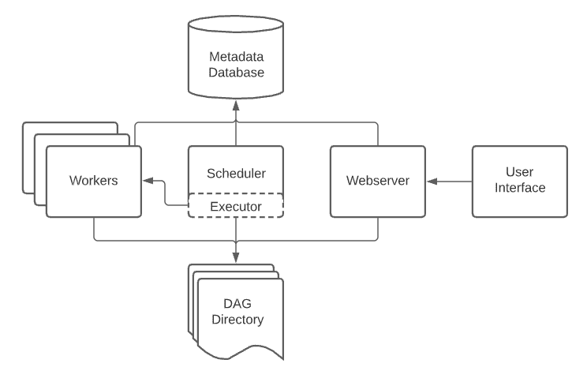

# 阿尔戈 vs 气流 vs 完美:它们有什么不同

> 原文：<https://web.archive.org/web/https://neptune.ai/blog/argo-vs-airflow-vs-prefect-differences>

我们生活在一个 ML 和 DL 软件无处不在的阶段。新的创业公司和其他各种公司正在将人工智能系统适应和集成到他们新的和现有的工作流程中，以提高生产率和效率。这些系统减少了手动任务，提供了智能的解决方案。尽管他们对自己所做的事情相当精通，但所有的人工智能系统都有不同的模块，必须将这些模块组合在一起才能构建一个可操作的有效产品。

这些系统可以大致分为五个阶段，记住这些阶段包含各种附加的和重复的任务:

## 

*   1 数据收集
*   2 特色工程
*   建模(包括训练、验证、测试和推理)
*   4 部署
*   5 监控

单独执行这些阶段会花费大量时间和持续的人力。这些阶段必须同步，并按顺序编排，以便充分利用它们。这可以通过**任务编排工具**来实现，这些工具使 ML 从业者能够毫不费力地将人工智能系统的不同阶段整合在一起并进行编排。

在本文中，我们将探索:

## 

*   1 什么是任务编排工具？
*   三种不同的工具可以帮助 ML 从业者协调他们的工作流程。
*   3 三种工具的对比
*   4 何时使用哪种工具？

编排工具使 MLOps 中的各种任务得以组织和顺序执行。这些工具能够在给定的时间内协调不同的任务。这些工具的关键属性之一是任务的分配。大多数工具利用了 DAG 或有向无环图，这在本文中会经常遇到。DAG 是需要执行的任务的图形表示。


*Graphic explanation of DAG | [Source](https://web.archive.org/web/20230106143932/https://www.datarevenue.com/en-blog/airflow-vs-luigi-vs-argo-vs-mlflow-vs-kubeflow) *

DAG 使管道中的任务能够并行分配给各种其他模块进行处理，这提供了效率。见上图。DAG 还使任务能够按顺序合理地执行或安排，以获得正确的执行和及时的结果。

这些工具的另一个重要特性是对敏捷环境的适应性。这使得 ML 从业者可以整合各种其他工具，用于监控、部署、分析和预处理、测试、推断等。如果一个编排工具可以从不同的工具中编排不同的任务，那么它可以被认为是一个好工具。但并非每次都是如此，一些工具被严格地包含在它们的派生环境中，这对于试图集成任何第三方应用程序的用户来说不是一个好兆头。

在本文中，我们将探索三个工具——[Argo](https://web.archive.org/web/20230106143932/https://argoproj.github.io/)、[气流](https://web.archive.org/web/20230106143932/https://airflow.apache.org/)和[提督](https://web.archive.org/web/20230106143932/https://www.prefect.io/)，它们结合了这两个属性以及其他各种属性。

## TL；灾难恢复对照表

这里有一个受 Ian McGraw 文章启发的表格，它概述了这些工具为编排提供了什么，以及它们在这些方面有何不同。

|  | 特征 | 南船星座 | 气流 | 长官 |
| --- | --- | --- | --- | --- |
|  | 容错调度 |  |  |  |
|  |  |  |  |  |
|  | 

工作流定义语言

 |  |  |  |
|  |  | 由于 Argo 是基于容器的，它没有预装第三方系统。 | 

支持各种第三方集成

 | 

支持各种第三方集成

 |
|  |  |  |  |  |
|  |  |  |  | 

【混合(开源和基于订阅)

 |
|  |  | 

有广泛的参数传递语法。

 | 

没有传递参数的机制。

 | 

支持参数作为一级对象

 |
|  |  |  |  |  |
|  |  |  |  | 

并联时使用 Kubernetes

 |
|  |  |  |  |  |
|  |  | 

所有状态都存储在 Kubernetes 工作流内

 |  |  |
|  |  |  |  |  |
|  |  |  |  |  |
|  | 

脚本中的 DAG 定义

 | 

Argo 使用文本脚本传入容器。

 | 

Airflow 使用基于 Python 的 DAG 定义语言。

 | 

Perfect 使用基于 Python 的 API 函数流。

 |
|  |  | 

–CI/CD-数据处理-基础设施自动化-机器学习-流处理

 | 

–ELT–ML 工作流- ML 自动化

 | 

–自动化数据工作流(ELT)–ML 工作流和流程编排——CI/CD

 |

现在，让我们在三个主要类别下更详细地探讨这些工具:

## 

*   1 核心概念
*   他们提供的功能
*   3 为什么要用？

## 核心概念

所有这三种工具都是建立在一套概念或原则之上的，它们都是围绕着这些概念或原则运行的。例如，Argo 是围绕两个概念构建的:**工作流**和**模板**。这两者构成了其系统的主干。同样，Airflow 是围绕**web 服务器、【调度器】、执行器、**和**数据库、**构建的，而 Prefect 是围绕**流**和**任务**构建的。现在重要的是我们要知道这些概念意味着什么，它们提供了什么，以及它如何对我们有益。

在进入细节之前，这里有一个概念的简要概述。

|  | 概念的属性 |
| --- | --- |
|  | 

它有两个概念**工作流**，和**模板**。本质上，工作流是配置 YAML 文件。它为工作流提供了结构和健壮性，因为它们使用 Dag 来管理工作流。另一方面，模板是需要执行的功能。
它们既是静态的也是动态的，这意味着您可以随时修改步骤。

 |
|  | 

它有四个概念 Webserver、Scheduler、Executor、Database。他们基本上把整个过程分成不同的部分，这些概念作为主要的组成部分使整个过程自动化。这使得工作流变得高效，因为每个组件都依赖于另一个组件，这样就很容易找到并报告错误和错误。此外，监控相当容易。
虽然气流使用 DAGs，但它不是动态的，而只是静态的。

 |
|  | 

它利用了两个概念流和任务。提督使用定义为使用 Python 的流对象的 Dag。在 Prefect 中，可以使用 Python 创建流对象，这提供了定义复杂管道的灵活性和健壮性。
任务就像 Argo 中的模板，用于定义需要执行的特定功能。同样，它使用 Python 来实现这一点。
因为 Prefect 使用 Python 作为它的主要编程语言，所以很容易使用。

 |

*概念概述*

现在，我们来详细了解一下这些概念。

### 南船星座

Argo 使用两个核心概念:

1.  工作流程
2.  模板

#### 工作流程

在 Argo 中，工作流恰好是整个系统最完整的组成部分。它有两个重要的功能:

1.  它定义了需要执行的任务。
2.  它存储任务的状态，这意味着它既是静态对象又是动态对象。

工作流是在 workflow.spec 配置文件中定义的。这是一个 YAML 文件，由一列**模板**和**入口点**组成。工作流可以被视为一个托管不同模板的文件。这些模板定义了需要执行的功能。

如前所述，Argo 利用 **Kubernetes** 引擎进行工作流同步，配置文件使用与 Kubernetes 相同的语法。工作流 YAML 文件包含以下字典或对象:

1.  apiVersion:这是定义文档或 API 名称的地方。
2.  kind:它定义了需要创建的 Kubernetes 对象的类型。例如，如果你想部署一个应用程序，你可以使用 **Deployment** 作为其中之一，其他时候你可以使用 service。但是在这种情况下，我们将使用**工作流**。
3.  元数据:它使我们能够为该对象定义唯一的属性，可以是名称、UUID 等等。
4.  规范:它使我们能够定义关于工作流的规范。这些规范将是入口点和模板。
5.  模板:这是我们可以定义任务的地方。该模板可以包含 docker 图像和各种其他脚本。

#### 模板

在 Argo 中，有两种类型的模板，它们又被细分为 6 种类型。两种主要类型是**定义**和**调用方。**

##### 定义

顾名思义，这个模板定义了 Docker 容器中的任务类型。定义本身分为四类:

1.  **容器**:用户可以在容器中安排工作流。由于应用程序在 Kubernetes 中是容器化的，所以 YAML 文件中定义的步骤是相同的。它也是最常用的模板之一。

```py
- name: whalesay
    container:
      image: docker/whalesay
      command: [cowsay]
      args: ["hello world"]
```

2.  **脚本**:如果你想要一个容器包装器，那么脚本模板是完美的。脚本模板在结构上类似于容器模板，但添加了一个源字段。该字段允许您就地定义脚本。您可以根据自己的需求定义任何变量或命令。一旦定义，脚本将被保存到一个文件中，它将作为一个 Argo 变量为您执行。

```py
 - name: gen-random-int
    script:
      image: python:alpine3.6
      command: [python]
      source: import random

        	i = random.randint(1, 100)
        	  	print(i)

```

3.  **资源**:可以直接在 K8 集群上进行获取、创建、应用、删除等操作。

```py
- name: k8s-owner-reference
    resource:
      action: create
      manifest: |
        apiVersion: v1
        kind: ConfigMap
        metadata:
          generateName: owned-eg-
        data:
          some: value
```

4.  **暂停**:基本上是给工作流引入一个时间维度。它可以在定义的持续时间内暂停工作流的执行，或者手动恢复工作流。

```py
 - name: delay
    suspend:
      duration: "20s"
```

##### 创新者

一旦定义了模板，它们就可以被调用，或者被称为调用程序的其他模板按需调用。这些调用程序更多的是控制器模板，可以控制已定义模板的执行。

有两种类型的发票模板:

1.  **步骤:**基本上可以让你分步骤定义任务。所有 YAML 文件都启用了“步骤”模板。
2.  有向无环图(Directed acyclic graph):Argo 使其用户能够管理其工作流程中具有多种依赖关系的步骤。这允许在各自的容器中并行执行不同的工作流。使用有向非循环图或 DAG 来管理这些类型的工作流。例如，如果您正在处理用于医疗目的的图像分割和生成，那么您可以创建一个管道:
    *   处理图像。
    *   将图像(或数据集)分发到相应的 DL 模型，用于图像分割和生成管道。
    *   持续预测分割掩模，并在适当检查后用新图像更新数据集存储。

### 气流

阿帕奇气流由四个主要部分组成:

1.  网络服务器
2.  调度程序
3.  执行者
4.  数据库ˌ资料库



*Four main components of Apache Airflow | [Source](https://web.archive.org/web/20230106143932/https://airflow.apache.org/docs/apache-airflow/stable/concepts/overview.html)*

#### 网络服务器

它为用户提供了检查、触发和调试所有 Dag 和任务的 UI。它实际上是气流的入口。web 服务器利用 Python-Flask 来管理用户发出的所有请求。它还呈现数据库中的状态元数据，并将其显示给 UI。

#### 调度程序

它监控和管理所有任务和 Dag。它通过查询数据库来检查任务的状态，以决定需要执行的任务的顺序。调度器的目标是解决依赖关系，一旦依赖关系得到处理，就将任务实例提交给执行器。

#### 执行者

它运行准备运行的任务实例。它执行调度程序调度的所有任务。遗嘱执行人有四种类型:

1.  顺序执行者
2.  本地执行者
3.  芹菜执行者
4.  Kubernetes Executor

#### 元数据数据库

它存储任务和 Dag 的状态，调度程序可以使用这些状态来正确调度任务实例。值得注意的是，Airflow 使用 SQLAlchemy 和对象关系映射(ORM)来存储信息。

### 长官

提督使用两个核心概念:

1.  流
2.  任务

#### 流

在 Prefect 中，流是可以交互的 Python 对象。这里 DAG 被定义为流对象。见下图。


*DAG defined as flow objects | [Source](https://web.archive.org/web/20230106143932/https://spell.ml/blog/orchestrating-spell-model-pipelines-using-prefect-YU3rsBEAACEAmRxp)*

对于任何给定的函数，Flow 可以被导入并用作装饰器@flow。流采用现有的函数，并将其转换为完美的流函数，具有以下优点:

*   该功能可以被监控和管理，因为它现在被报告给 API。
*   可以在 UI 中跟踪和显示功能的活动。
*   可以验证函数的输入。
*   诸如重试、分布式执行等各种工作流特征可以被添加到该功能中。
*   可以强制超时，以防止无意中长时间运行的工作流

下面是一个代码块，描述了一个流对象的实现。

```py
from prefect import flow

@flow(name="GitHub Stars")
def github_stars(repos: List[str]):
    for repo in repos:
        get_stars(repo)

```

在上面的代码中，函数被转换成一个流，命名为“GitHub Stars”。这个功能现在在完美的编排法则的约束之内。

现在必须注意，所有工作流都必须在流函数中定义。同样，所有任务都必须在流(函数)中调用。请记住，当一个流被执行时，它被称为*流运行*。

##### 任务

任务可以定义为需要执行的特定工作，例如，两个数的相加。换句话说，任务接受输入，执行操作并产生输出。像 flow 一样，任务可以被导入，并可以作为一个函数的装饰器@task 使用。一旦用于某个功能，它本质上将该功能包装在完美的工作流中，并且具有与流程相似的优点。例如，它可以自动记录关于任务运行的信息，比如运行时间、标签和最终状态。

下面的代码演示了如何定义任务:

```py

@task(retries=3)
def get_stars(repo: str):
    url = f"https://api.github.com/repos/{repo}"
    count = httpx.get(url).json()["stargazers_count"]
    print(f"{repo} has {count} stars!")

github_stars(["PrefectHQ/Prefect"])
```

总而言之，流程寻找任何在其主体中定义的任务，一旦找到，它就以相同的顺序创建一个计算图。然后，每当一个任务实例的输出被另一个任务实例用来产生输出时，它就在任务之间创建依赖关系。

## 特征

这三者都提供了或多或少相同的功能，但有些功能比其他功能更好，这也归结于用户的适应性。就像上一节一样，我们先来总结一下这些特性。

|  | 南船星座 | 气流 | 长官 |
| --- | --- | --- | --- |
|  | 

它拥有完整的工作流视图。您可以直接从 UI 定义工作流。

 | 工作流维护得非常好，因为它提供了许多不同的视图。 | 

提督类似于气流。

 |
|  | 

仅支持 Kubernetes 支持的环境，如 AWS 和其他 S3 兼容的服务。

 | 

支持 Kubernetes 支持的环境以及其他第三方环境。

 |  |
|  |  |  |  |
|  |  |  |  |
|  |  |  |  |

*特征比较*

让我们从探索用户界面开始这一部分。

### 用户界面

#### 南船星座

为了便于使用，Argo Workflow 提供了一个基于 web 的用户界面来定义工作流和模板。用户界面支持多种用途，例如:

*   人工制品可视化
*   使用生成的图表来比较机器学习管道
*   可视化结果
*   排除故障
*   它还可以用于定义工作流

气流

#### Airflow UI 提供了一个简洁高效的设计，使用户能够与 Airflow 服务器进行交互，允许他们**监控**和**对整个管道进行故障排除**。它还允许编辑数据库中任务的状态，并操纵 Dag 和任务的行为。

Airflow UI 还为其用户提供了各种视图，包括:

DAGs 视图

*   数据集视图
*   网格视图
*   图表视图
*   日历视图
*   可变视图
*   甘特图视图
*   任务持续时间
*   Code View
*   Prefect

#### Prefect like Airflow 提供了所有任务的概述，这有助于您可视化所有工作流、任务和 Dag。它提供了两种访问用户界面的方法:

**完美云**:它托管在云上，使您能够配置您的个人帐户和工作区。

1.  **提督猎户座 UI** :本地托管，也是开源的。您不能像使用 Prefect cloud 那样配置它。
2.  perfect ui 的一些附加功能:

显示运行摘要

*   显示已部署的流详细信息
*   预定流量
*   延迟和失败运行的警告通知
*   任务和工作流的详细信息
*   任务相关性可视化和雷达流程
*   日志详细信息
*   部署风格

### 南船星座

#### 它是一个本地 Kubernetes 工作流引擎，这意味着:

It is a native Kubernetes workflow engine which means it:

## 1 在容器上运行。

*   2 在 Kubernetes 支持的吊舱上运行。
*   3 易于部署和扩展。
*   缺点是:

实现是困难的，因为它使用配置语言(YAML)。

*   气流

#### 1 支持 Kubernetes 以及其他第三方集成。

## 它也可以在容器上运行。

*   3 实现起来很容易。
*   气流的缺点是:
*   它不是并行可伸缩的。

部署需要额外的努力，这取决于您选择的云设施。

*   长官
*   最后，提督是阿尔戈和气流的结合体:

#### Prefect

它可以在容器和 Kubernetes 豆荚上运行。

## 2 它是高度并行和高效的。

*   支持容错调度。
*   4 易于部署。
*   它还支持第三方集成。
*   说到坏处:
*   它不支持 Kubernetes 的开源部署。

部署困难。

*   可量测性
*   当谈到可伸缩性时，Argo 和 Prefect 是高度并行的，这使它们高效且特别完美，因为它可以利用不同的第三方集成支持，使其成为三者中最好的。

### 另一方面，气流是水平可扩展的，即活动工作者的数量等于最大任务并行度。

易接近

这三个都是开源的，但是 Prefect 还附带了一个基于订阅的服务。

### 灵活性

与 Prefect 相比，Argo 和 Airflow 并不灵活，因为前者是 Kubernetes-native，它被限制在该环境中，使其变得僵化，而后者很复杂，因为它需要定义良好和结构化的模板，使其本身不太适合敏捷环境。

### 另一方面，Prefect 使您能够用原生 Python 创建动态数据流，这不需要您使用 DAG。所有 Python 函数都可以转换成完美的流程和任务。这确保了灵活性。

到目前为止，我已经比较了这些工具拥有的基本概念和特性。现在让我给出为什么你可以在你的项目中使用这些工具的理由。

南船星座

以下是您应该使用 Argo 的一些原因:

### Argo

Kubernetes 本地工作流工具使您能够在它自己的 Kubernetes pod 中运行每个步骤。

## 2 易于扩展，因为它可以并行执行。

*   工作流模板提供了可重用性。
*   类似地，工件集成也是可重用的。
*   对于工作流的每次运行，DAG 都是动态的。
*   6 低延迟调度器。
*   事件驱动的工作流。
*   气流
*   您使用气流的原因:

### Airflow

它使用户能够连接各种技术。

## 它提供了丰富的调度和易于定义的管道。

*   3python 集成是使用气流的另一个原因。
*   您可以根据自己的需求创建定制组件。
*   5 存储工作流程时，允许回滚到先前版本。
*   6 有一个定义良好的 UI。
*   多个用户可以为一个给定的项目编写一个工作流，即它是可共享的。
*   长官
*   Prefect 是 MLops 精心设计的编排工具之一。它是 Python 原生的，需要你在工程方面下功夫。Prefect 的一个亮点是数据处理和管道。它可以用于获取数据、应用必要的转换，以及监控和编排必要的任务。

### 当涉及到与机器学习相关的任务时，它可以用于自动化整个数据流。

使用提督的其他一些原因是:

When it comes to tasks related to machine learning, it can be used to automate the entire data flow. 

1 提供卓越的安全性，因为它可以保护您的数据和代码的隐私。

## 2 增强的用户界面和通知功能，可直接发送到您的电子邮件或 Slack。

*   3 可搭配 Kubernetes 和 Docker 使用。
*   4 任务的高效并行处理。
*   5 动态工作流。
*   6 允许许多第三方集成。
*   7 Prefect 使用 GraphQL API，使其能够按需触发工作流。
*   如何决定？
*   为您的项目选择合适的工具取决于您想要的和您已经拥有的。但是我肯定可以提出一些标准来帮助您决定哪种工具适合您。您可以使用–

## 南船星座

如果你想建立一个基于 Kubernetes 的工作流。

### 如果您想将工作流定义为 Dag。

*   如果数据集很大，并且模型训练需要高度并行和分布式的训练。
*   如果你的任务很复杂。
*   如果你精通 YAML 档案。即使你不是，学习 YAML 也不难。
*   如果你想使用像 GCD 或 AWS 这样的云平台，这是 Kubernetes 启用的。
*   气流
*   如果您想整合许多其他第三方技术，如 Jenkins、Airbyte、Amazon、Cassandra、Docker 等。检查受支持的第三方扩展列表。

### 如果你想用 Python 来定义工作流。

*   如果您想将工作流定义为 Dag。
*   如果你的工作流程是静态的。
*   如果你想要一个成熟的工具，因为气流是相当古老的。
*   如果您想按计划运行任务。
*   长官
*   如果您想整合许多其他第三方技术。

### 如果你想用 Python 来定义工作流。

*   如果你的工作流程是动态的。
*   如果您想按计划运行任务。
*   如果你想要轻松现代的东西。
*   我在 Reddit 上发现了一个关于使用气流和提督的帖子。也许这可以为您提供一些关于使用哪种工具的附加信息。
*   “Airflow 的优势在于它是一个成熟且受欢迎的项目。这意味着找到一个随机写博客回答你的问题的人要容易得多。另一个好处是，雇佣有气流经验的人比雇佣有完美经验的人要容易得多。缺点是，Airflow 的时代正在显现，因为它并不是真正为现代数据环境中存在的那种动态工作流而设计的。如果你的公司要在*计算或复杂性方面突破极限，我强烈建议你考虑一下 Prefect。*此外，除非你通过天文学家网站，否则如果你找不到关于气流的问题的答案，你必须通过他们相当不活跃的聊天。

Prefect 的优点是，它对你在做什么和它需要做什么的假设更加现代。它有一个扩展的 API，允许你以编程的方式控制执行或者与调度程序交互，我相信 Airflow 只是最近才在他们的 2.0 版本中实现了测试版。在此之前，建议不要在生产环境中使用 API，这通常会导致黑客式的解决方法。此外，通过确定在运行时执行的 DAG，然后将计算/优化交给其他系统(即 Dask)来实际执行任务，Prefect 允许更动态的执行模型及其一些概念。我相信这是一个更聪明的方法，因为我已经看到工作流这些年来变得越来越动态。

如果我的公司既没有 Airflow 也没有 Prefect，我会选择 Prefect。我相信它允许更好的代码模块化(然后可以更积极/彻底地测试)，我已经认为这对于数据驱动的公司来说是值得的，这些公司依靠精心策划的数据来做出自动化的产品决策。你可以用气流实现类似的东西，但是你真的需要用你自己的方式来实现这样的事情，而在 Prefect 中，它是自然产生的。"

这里有一个有用的图表，展示了基于 GitHub stars 的不同编排工具的流行程度。

结论

在本文中，我们讨论并比较了三种流行的任务编排工具，即 Argo、Airflow 和 Prefect。我的主要目的是在三个重要因素的基础上帮助您理解这些工具，即核心概念、提供的功能以及您为什么应该使用它们。本文还对这三种工具提供的一些重要特性进行了比较，这可以帮助您决定为您的项目选择最合适的工具。

我希望这篇文章内容丰富，能让您更好地理解这些工具。


*The popularity of different orchestration tools based on GitHub stars | [Source](https://web.archive.org/web/20230106143932/https://www.datarevenue.com/en-blog/airflow-vs-luigi-vs-argo-vs-mlflow-vs-kubeflow)*

## 谢谢！！！

参考

[https://github.com/argoproj/argo-workflows](https://web.archive.org/web/20230106143932/https://github.com/argoproj/argo-workflows)

[https://argoproj.github.io/](https://web.archive.org/web/20230106143932/https://argoproj.github.io/)

### [https://codefresh.io/learn/argo-workflows/](https://web.archive.org/web/20230106143932/https://codefresh.io/learn/argo-workflows/)

1.  [https://hazelcast.com/glossary/directed-acyclic-graph/](https://web.archive.org/web/20230106143932/https://hazelcast.com/glossary/directed-acyclic-graph/)
2.  [https://towards data science . com/mlops-with-a-feature-store-816 CFA 5966 e 9](https://web.archive.org/web/20230106143932/https://towardsdatascience.com/mlops-with-a-feature-store-816cfa5966e9)
3.  [https://medium . com/Arthur-engineering/picking-a-kubernetes-orchestrator-air flow-Argo-and-prefect-83539 ECC 69 b](https://web.archive.org/web/20230106143932/https://medium.com/arthur-engineering/picking-a-kubernetes-orchestrator-airflow-argo-and-prefect-83539ecc69b)
4.  [https://Argo proj . github . io/Argo-workflows/artifact-visualization/# artifact-types](https://web.archive.org/web/20230106143932/https://argoproj.github.io/argo-workflows/artifact-visualization/#artifact-types)
5.  [https://air flow . Apache . org/docs/Apache-air flow/stable/concepts/overview . html](https://web.archive.org/web/20230106143932/https://airflow.apache.org/docs/apache-airflow/stable/concepts/overview.html)
6.  [https://spell . ml/blog/orchestrating-spell-model-pipelines-using-prefect-YU3rsBEAACEAmRxp](https://web.archive.org/web/20230106143932/https://spell.ml/blog/orchestrating-spell-model-pipelines-using-prefect-YU3rsBEAACEAmRxp)
7.  [https://github.com/PrefectHQ/prefect](https://web.archive.org/web/20230106143932/https://github.com/PrefectHQ/prefect)
8.  [https://www . data revenue . com/en-blog/air flow-vs-Luigi-vs-Argo-vs-ml flow-vs-kube flow](https://web.archive.org/web/20230106143932/https://www.datarevenue.com/en-blog/airflow-vs-luigi-vs-argo-vs-mlflow-vs-kubeflow)
9.  [https://hevodata.com/learn/argo-vs-airflow/#w6](https://web.archive.org/web/20230106143932/https://hevodata.com/learn/argo-vs-airflow/#w6)
10.  https://www . data revenue . com/en-blog/what-we-loving-about-perfect
11.  [https://github.com/PrefectHQ/prefect](https://web.archive.org/web/20230106143932/https://github.com/PrefectHQ/prefect)
12.  [https://docs.prefect.io/](https://web.archive.org/web/20230106143932/https://docs.prefect.io/)
13.  [https://medium . com/the-prefect-blog/introducing-the-artifacts-API-B9 e 5972 db 043](https://web.archive.org/web/20230106143932/https://medium.com/the-prefect-blog/introducing-the-artifacts-api-b9e5972db043)
14.  https://medium . com/the-prefect-blog/orchestrate-your-data-science-project-with-prefect-2-0-4118418 FD 7 ce
15.  [https://www . Reddit . com/r/data engineering/comments/oqbiiu/air flow _ vs _ prefect/](https://web.archive.org/web/20230106143932/https://www.reddit.com/r/dataengineering/comments/oqbiiu/airflow_vs_prefect/)
16.  [https://medium.com/the-prefect-blog/introducing-the-artifacts-api-b9e5972db043](https://web.archive.org/web/20230106143932/https://medium.com/the-prefect-blog/introducing-the-artifacts-api-b9e5972db043) 
17.  [https://medium.com/the-prefect-blog/orchestrate-your-data-science-project-with-prefect-2-0-4118418fd7ce](https://web.archive.org/web/20230106143932/https://medium.com/the-prefect-blog/orchestrate-your-data-science-project-with-prefect-2-0-4118418fd7ce) 
18.  [https://www.reddit.com/r/dataengineering/comments/oqbiiu/airflow_vs_prefect/](https://web.archive.org/web/20230106143932/https://www.reddit.com/r/dataengineering/comments/oqbiiu/airflow_vs_prefect/)