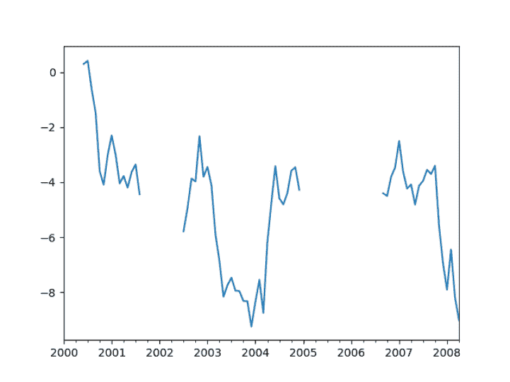
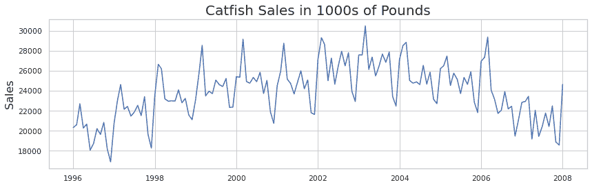
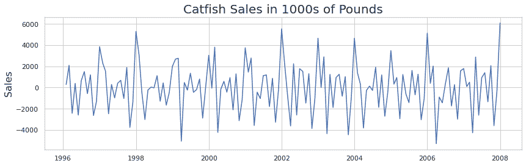
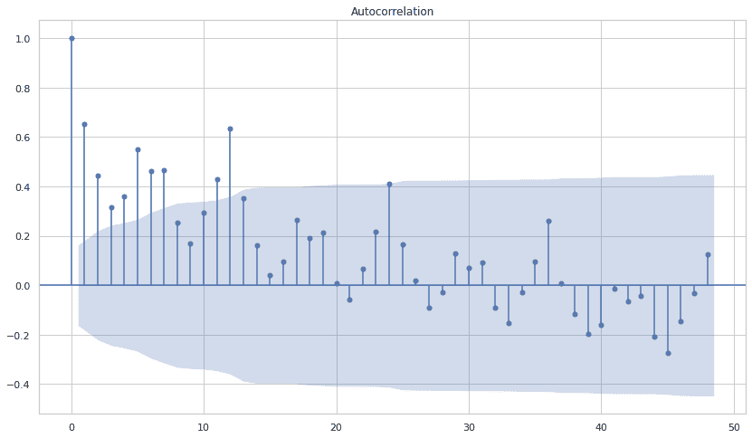
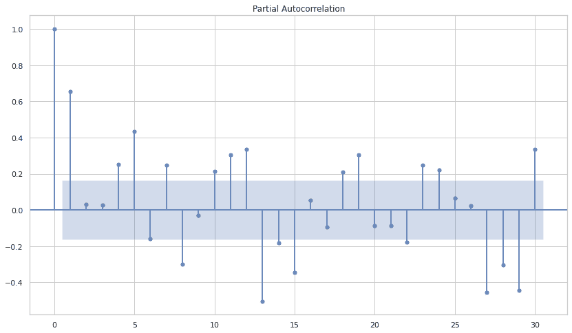
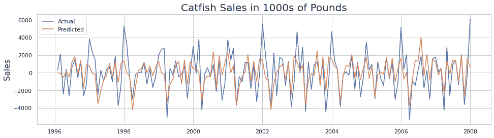
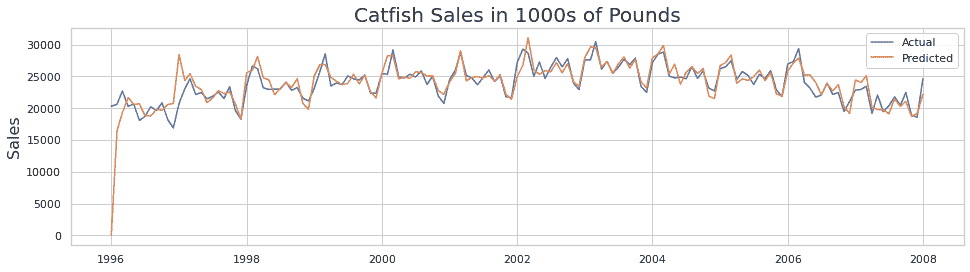

# ARIMA 和萨里玛:现实世界的时间序列预测

> 原文：<https://web.archive.org/web/https://neptune.ai/blog/arima-sarima-real-world-time-series-forecasting-guide>

时间序列和预测一直是统计学和数据科学中的一些关键问题。当按照具有时间限制的属性(如天数、月数和年数)对数据进行采样时，数据就变成了一个时间序列，这给了它一个隐含的顺序。预测就是我们获取数据并预测未来值。

ARIMA 和萨里玛都是预测的[算法。 **ARIMA** 考虑过去的值(自回归，移动平均)并基于此预测未来值。 **SARIMA** 同样使用过去的值，但也考虑了任何季节性模式。由于萨里玛引入了季节性作为参数，它在预测包含周期的复杂数据空间方面明显比 ARIMA 更强大。](https://web.archive.org/web/20221206094226/https://towardsdatascience.com/forecasting-with-machine-learning-models-95a6b6579090)

在博客的后面，我们将探索:

1.  ARIMA
    *   它是什么以及它如何预测
    *   用 ARIMA 预测美国 GDP 的例子
2.  萨里玛
    *   它是什么以及它如何预测
    *   预测用电量的示例
3.  两种模式的优缺点
4.  ARIMA 和萨里玛的真实使用案例

在我们进入算法之前，有一个关于数据处理的重要部分，在开始预测之旅之前，你应该警惕。

## 时间序列预测的数据预处理

时间序列数据很乱。从简单的滚动平均到 LSTMs 的预测模型要求数据是干净的。因此，在进行预测之前，这里有一些你可以使用的技巧。

*注意:这个数据预处理步骤是通用的，旨在让读者强调它，因为现实世界的项目涉及许多清理和准备工作。*

*   **去趋势性/平稳性**:在预测之前，我们希望我们的时间序列变量是均值-方差平稳的。这意味着一个模型的统计特性不会因为取样时间的不同而改变。建立在静态数据上的模型通常更稳健。这可以通过使用差分来实现。
*   **异常检测:**数据中出现的任何异常值都可能扭曲预测结果，因此在继续预测之前识别异常值并使其正常化通常被认为是一种良好的做法。你可以在这里关注这个[博客，在这里我详细解释了异常检测算法](/web/20221206094226/https://neptune.ai/blog/anomaly-detection-in-time-series)。
*   **检查采样频率:**这是检查采样规律性的重要步骤。在应用任何建模技术之前，必须对不规则数据进行估算或使其一致，因为不规则采样会破坏时间序列的完整性，并且与模型不匹配。
*   **缺失数据:**有时，某些日期时间值可能会有缺失数据，这需要在建模之前解决。例如，缺少值的时间序列数据如下所示:



Missing data in time series | [Source](https://web.archive.org/web/20221206094226/https://jagan-singhh.medium.com/missing-data-in-time-series-5dcf19b0f40f)

现在，让我们继续讨论模型。

## ARIMA

ARIMA 模型是一类利用历史值预测未来值的线性模型。ARIMA 代表**自回归综合移动平均，**每种技术都有助于最终预测。我们一个一个来了解吧。

### 自回归(AR)

在自回归模型中，我们使用该变量过去值的线性组合来预测感兴趣的变量。术语“自回归”表示它是变量对自身的回归。也就是说，我们使用目标变量的滞后值作为输入变量来预测未来的值。p 阶的自回归模型将看起来像:

m[t]=[0]+[1]m[t-1]+[2]m[t-2]+[3]m[t-3]+…+[p]m[t-p]

在上式中， *m* 的当前观测值是其过去 *p* 值的线性函数。[ 0，p]是训练后确定的回归系数。确定 *p* 的最优值有一些标准方法，其中之一是分析**自相关**和**偏自相关**函数图。

自相关函数(ACF)是同一变量的当前值和过去值之间的相关性。除了直接影响之外，它还考虑了价值随时间推移而产生的翻译效应。例如，两天前的石油价格会影响一天前的价格，并最终影响今天的价格。但是 2 天前的石油价格也可能对 ACF 测量的今天有影响。

另一方面，部分自相关(PACF)仅测量过去值和当前值之间的直接相关性。例如，PACF 将只测量两天前的石油价格对今天的影响，而没有平移效应。

ACF 和 PACF 图帮助我们确定过去值的相关性，进而帮助我们推断 AR 中的 *p* 。浏览[这里的](https://web.archive.org/web/20221206094226/https://otexts.com/fpp2/non-seasonal-arima.html#acf-and-pacf-plots)，深入了解如何推导 p (AR)和 q(MA)的值。

### 综合(一)

Integrated 表示为了使数据稳定而必须应用的任何差异。可以对数据运行 dickey-fuller 测试(代码如下)来检查稳定性，然后用不同的差异因子进行实验。差异因子 d=1 表示滞后，即 mt-mt-1。让我们看一下原始数据与差异数据的对比图。



*Original Data | Source: Author*



*After applying d=1 | Source: Author*

他们之间的区别是显而易见的。差分后，我们可以看到它明显比原始数据更稳定，并且多年来平均值和方差大致一致。我们可以使用下面的代码进行 dickey-fuller 测试。

```py
def check_stationarity(ts):
    dftest = adfuller(ts)
    adf = dftest[0]
    pvalue = dftest[1]
    critical_value = dftest[4]['5%']
    if (pvalue < 0.05) and (adf < critical_value):
        print('The series is stationary')
    else:
        print('The series is NOT stationary')
```

### 移动平均线

移动平均模型在类似回归的模型中使用过去的预测误差而不是过去的值来预测未来值。移动平均模型可由以下等式表示:

m[t]=[0]+[1]e[t-1]+[2]e[t-2]+[3]e[t-3]+…+[q]e[t-q]

这就是所谓的 **MA(q)** 模型。在上式中， *e* 被称为*误差*，它代表模型和目标变量之间的随机剩余偏差。因为 *e* 只能在拟合模型后确定，并且因为它也是一个参数，所以在这种情况下 *e* 是一个**不可观察的参数**。因此，为了求解 MA 方程，使用像最大似然估计这样的迭代技术来代替 OLS。

既然我们已经了解了 ARIMA 是如何工作的，让我们深入一个例子，看看 ARIMA 是如何应用于时间序列数据的。

### 实施 ARIMA

对于实现，我选择了从 1996 年到 2008 年的[鲶鱼销售数据。我们将把上面学到的技术应用到这个数据集，并观察它们的实际应用。尽管数据不需要大量清理，并且处于待分析的读取状态，但您可能必须对数据集应用清理技术。](https://web.archive.org/web/20221206094226/https://www.kaggle.com/datasets/yekahaaagayeham/time-series-toy-data-set)

不幸的是，我们不能复制每一个场景，因为清洁方法是高度主观的，也取决于团队的要求。但是这里学到的技术可以在清理后直接应用到您的数据集。

先说导入必备模块。

#### 导入依赖关系

```py
from IPython.display import display

import numpy as np
import pandas as pd
pd.set_option('display.max_rows', 15)
pd.set_option('display.max_columns', 500)
pd.set_option('display.width', 1000)

import matplotlib.pyplot as plt
from datetime import datetime
from datetime import timedelta
from pandas.plotting import register_matplotlib_converters

register_matplotlib_converters()

from statsmodels.tsa.seasonal import seasonal_decompose
from statsmodels.tsa.arima_model import ARIMA
from statsmodels.tsa.statespace.sarimax import SARIMAX
from statsmodels.tsa.stattools import adfuller
from statsmodels.graphics.tsaplots import plot_acf, plot_pacf
from time import time
import seaborn as sns
sns.set(style="whitegrid")

import warnings
warnings.filterwarnings('ignore')

RANDOM_SEED = np.random.seed(0)
```

这些是每个数据科学家都熟悉的不言自明的模块。设置 RANDOM_SEED 以使代码具有相同的结果是一个很好的做法。

接下来，我们将导入并绘制时间序列数据

#### 提取-转换-加载(ETL)

```py
def parser(s):
    return datetime.strptime(s, '%Y-%m-%d')

catfish_sales = pd.read_csv('catfish.csv', parse_dates=[0], index_col=0, date_parser=parser)

catfish_sales = catfish_sales.asfreq(pd.infer_freq(catfish_sales.index))

start_date = datetime(1996,1,1)
end_date = datetime(2008,1,1)
lim_catfish_sales = catfish_sales[start_date:end_date]

plt.figure(figsize=(14,4))
plt.plot(lim_catfish_sales)
plt.title('Catfish Sales in 1000s of Pounds', fontsize=20)
plt.ylabel('Sales', fontsize=16)
```

为了简单起见，我将数据限制在 1996-2008 年。上述代码生成的图如下所示:


*Catfish sales | Source: Author*

第一印象是数据中存在明确的趋势和季节性。让我们做一个 STL 分解，以便更好地理解。

#### STL 分解

```py
plt.rc('figure',figsize=(14,8))
plt.rc('font',size=15)

result = seasonal_decompose(lim_catfish_sales,model='additive')
fig = result.plot()
```

结果图如下所示:

思考要点:

1.  可以看到 6 个月和 12 个月的季节性模式
2.  上升和下降的趋势很明显

让我们看看 ACF 和 PACF 图，了解一下 p 和 q 值

#### ACF 和 PACF 图

```py
plot_acf(lim_catfish_sales['Total'], lags=48);
plot_pacf(lim_catfish_sales['Total'], lags=30);
```

上述代码的输出绘制了 ACF 和 PACF:



*Autocorrelation plot for Catfish data*



*Partial autocorrelation plot for Catfish data*

思考要点:

1.  ACF 在 6 个月和 12 个月时有一个显著的峰值
2.  PACF 几乎是正弦曲线

差分因子 d 应保持为 1，因为有明确的趋势和非平稳数据。p 可以用值 6 和 12 来测试。

#### 安装 ARIMA

我们将使用 statsmodels 模块来实现和使用 ARIMA。为此，我们从 statsmodels 中导入了 ARIMA 类。现在，让我们用上一节中讨论的参数来拟合。

```py
arima = ARIMA(lim_catfish_sales['Total'], order=(12,1,1))
predictions = arima.fit().predict()
```

正如你在上面注意到的，我从(p，d，q)的(12，1，1)开始，就像我们在 ACF 和 PACF 图中看到的那样。

*注意:使用算法模块(如 scikit-learn)非常方便，您会很高兴知道 statsmodels 是经常使用的库之一。*

让我们看看我们的预测如何与原始数据相比较。

#### 可视化结果

```py
plt.figure(figsize=(16,4))
plt.plot(lim_catfish_sales.diff(), label="Actual")
plt.plot(predictions, label="Predicted")
plt.title('Catfish Sales in 1000s of Pounds', fontsize=20)
plt.ylabel('Sales', fontsize=16)
plt.legend()
```

上述代码的输出将为您提供预测和实际数据的对比图。



*A comparative plot of predictions and the actual data*

您可以在这里看到，该模型没有真正赶上某些峰值，但很好地捕捉到了数据的本质。我们可以用更多的 p，d，q 值进行实验，以更好地概括模型，并确保它不会过度拟合。

尝试和优化是一种方法，但你也可以使用自动 ARIMA。它本质上为您完成了繁重的工作，并为您调整了超参数。这个[博客](https://web.archive.org/web/20221206094226/https://towardsdatascience.com/time-series-forecasting-using-auto-arima-in-python-bb83e49210cd)是汽车 ARIMA 的一个很好的起点。

请记住，参数的可解释性将是您在处理自动 ARIMA 时必须处理的事情，并确保它不会被转换为黑盒，因为预测模型必须在部署之前进行治理。因此，能够解释参数值及其贡献是一种很好的做法。

## 萨里玛

萨里玛代表季节性 ARIMA，它包括季节性对预测的贡献。季节性的重要性是显而易见的，而 ARIMA 未能含蓄地概括这一信息。

模型的自回归(AR)、综合(I)和移动平均(MA)部分与 ARIMA 模型相同。季节性的加入增加了 SARIMA 模型的稳健性。它表示为:

其中 m 是每年的观察次数。我们用大写符号表示模型的季节性部分，用小写符号表示模型的非季节性部分。

与 ARIMA 相似，模型季节性部分的 P、D、Q 值可以从数据的 ACF 和 PACF 图中推导出来。让我们为相同的鲶鱼销售模型实现 SARIMA。

### 实施 SARIMA

ETL 和依赖项将保持与 ARIMA 相同，因此我们将直接跳到建模部分。

#### 安装 SARIMA

```py
sarima = SARIMAX(lim_catfish_sales['Total'],
                order=(1,1,1),
                seasonal_order=(1,1,0,12))
predictions = sarima.fit().predict()
```

我尝试对非季节性部分取 1，1，1，对季节性部分取 1，1，0，12，因为 ACF 显示了 6 个月和 12 个月的滞后相关性。让我们看看结果如何。

#### 可视化结果

```py
plt.figure(figsize=(16,4))
plt.plot(lim_catfish_sales, label="Actual")
plt.plot(predictions, label="Predicted")
plt.title('Catfish Sales in 1000s of Pounds', fontsize=20)
plt.ylabel('Sales', fontsize=16)
plt.legend()
```



*A comparative plot of predictions and the actual data*

正如你所看到的，在开始模型，努力适应可能是因为偏离路线初始化，但它很快学会了正确的路径。与 ARIMA 相比，拟合度相当好，这表明萨里玛可以更好地了解季节性，如果它出现在数据中，那么尝试萨里玛是有意义的。

## ARIMA 和萨里玛模式的利与弊

由于这两种算法的线性性质，它们非常方便，并在行业中用于实验和理解数据，创建基线预测分数。如果用滞后值(p，d，q)调整正确，他们可以表现得更好。这两种算法的简单和可解释的本质使它们成为分析师和数据科学家的首选。然而，与 ARIMA 和萨里玛大规模合作有利也有弊。让我们来讨论这两个问题:

### ARIMA 和萨里玛的优点

*   易于理解和解释:你的队友和同事会欣赏的一件事是模型的简单性和可解释性。在保持结果质量的同时关注这两点将有助于与利益相关者进行演示。
*   **有限变量**:超参数较少，因此如果模型投入生产，配置文件将易于维护。

### ARIMA 和萨里玛的缺点

*   **指数时间复杂度:**当 p 和 q 的值增加时，有同样多的系数要拟合，因此如果 p 和 q 高，时间复杂度增加。这使得这两种算法很难投入生产，并使数据科学家研究 Prophet 和其他算法。同样，这也取决于数据集的复杂程度。
*   **复杂数据:**您的数据可能过于复杂，没有 p 和 q 的最优解。尽管 ARIMA 和萨里玛失败的可能性极小，但如果发生这种情况，您可能不得不另寻他处。
*   **所需数据量:**这两种算法都需要大量的数据来处理，尤其是在数据是季节性的情况下。例如，使用三年的历史需求可能不足以做出好的预测(短生命周期产品)。

## ARIMA 和萨里玛的真实使用案例

SARIMA 萨里玛是最流行的计量经济学模型，用于预测股票价格、[需求预测](https://web.archive.org/web/20221206094226/https://journals.sagepub.com/doi/10.1177/1847979018808673)，甚至传染病的传播。当潜在机制未知或过于复杂时，例如股票市场，或不完全已知时，例如零售，通常最好应用 ARIMA 或类似的统计模型，而不是像 RNNs 这样复杂的深度算法。

然而，在某些情况下，应用 ARIMA 可以得到相同的结果。

以下是一些使用 SARIMA 萨里玛的策划文件:

1.  [ARIMA 模型在预测印度新冠肺炎疫情动态中的应用](https://web.archive.org/web/20221206094226/https://journals.sagepub.com/doi/full/10.1177/0972150920988653):这篇研究论文利用 ARIMA 预测了印度的新冠肺炎病例数。在这种情况下，利用 ARIMA 的缺点是，它只利用过去的值来预测未来。但是新冠肺炎会随着时间的推移而改变形状，它取决于除了过去的价值观之外的许多其他行为因素，这是 ARIMA 无法捕捉到的。
2.  [预测日平均和月平均全球太阳辐射的时间序列 ARIMA 模型:韩国首尔的案例研究](https://web.archive.org/web/20221206094226/https://www.mdpi.com/2073-8994/11/2/240):这是一项基于韩国气象局 37 年来使用 s ARIMA 获得的每小时太阳辐射数据预测韩国太阳辐射的研究。
3.  [时间序列中 ARIMA 模型的疾病管理](https://web.archive.org/web/20221206094226/https://www.ncbi.nlm.nih.gov/pmc/articles/PMC4872983/):利用 SARIMA 萨里玛模型的广泛适用性，在疾病管理中使用 ARIMA 的另一个例子。研究论文触及了 ARIMA 的一些真实使用案例。例如，新加坡的一家医院准确预测了 SARS 流行期间 3 天内他们需要的病床数量。
4.  [使用 ARIMA 模型预测需求](https://web.archive.org/web/20221206094226/https://journals.sagepub.com/doi/full/10.1177/1847979018808673):这个用例主要使用 ARIMA 对一家食品公司的需求进行建模和预测。

说到这个行业，这里有一篇关于优步预测的好文章。

当问题陈述仅限于过去的值时，无论是预测医院床位、COVID 病例还是预测需求，您都会经常发现使用 SARIMA 萨里玛。然而，当在预测中有其他因素要考虑时，例如静态属性，缺点就出现了。留意你正在处理的问题陈述，如果这些情况发生在你身上，那么尝试使用其他方法，如 [Theta](https://web.archive.org/web/20221206094226/https://robjhyndman.com/papers/Theta.pdf) ，QRF(分位数回归森林)，Prophet，RNNs。

## 结论和最后说明

你已经到达终点了！在这篇博客中，我们详细讨论了 ARIMA 和萨里玛，以及他们在行业研究中的应用和重要性。它们的简单性和健壮性使它们成为建模和预测的顶级竞争者。然而，在现实世界的用例中处理它们时，有一些事情需要记住:

1.  增加 p，q 可以成倍增加训练的时间复杂度。因此，建议先推导出它们的值，然后进行实验。
2.  他们容易过度适应。因此，请确保您设置了正确的超参数，并在进入生产之前进行验证。

我这边就这样。请继续学习，并关注更多内容！再见！

### 参考

1.  [https://Neptune . ai/blog/time-series-prediction-vs-machine-learning](/web/20221206094226/https://neptune.ai/blog/time-series-prediction-vs-machine-learning)
2.  [https://otexts.com/fpp2/arima.html](https://web.archive.org/web/20221206094226/https://otexts.com/fpp2/arima.html)
3.  [https://towards data science . com/understanding-ARIMA-time-series-modeling-d 99 CD 11 be 3 f 8](https://web.archive.org/web/20221206094226/https://towardsdatascience.com/understanding-arima-time-series-modeling-d99cd11be3f8)
4.  [https://towards data science . com/understanding-sa Rima-955 Fe 217 BC 77](https://web.archive.org/web/20221206094226/https://towardsdatascience.com/understanding-sarima-955fe217bc77)
5.  [https://neptune.ai/blog/anomaly-detection-in-time-series](/web/20221206094226/https://neptune.ai/blog/anomaly-detection-in-time-series)
6.  [https://www . stats models . org/dev/generated/stats models . TSA . statespace . sarimax . sarimax . html](https://web.archive.org/web/20221206094226/https://www.statsmodels.org/dev/generated/statsmodels.tsa.statespace.sarimax.SARIMAX.html)
7.  [https://otexts.com/fpp2/seasonal-arima.html](https://web.archive.org/web/20221206094226/https://otexts.com/fpp2/seasonal-arima.html)
8.  [https://towards data science . com/time-series-forecasting-using-auto-ARIMA-in-python-bb83e 49210 CD](https://web.archive.org/web/20221206094226/https://towardsdatascience.com/time-series-forecasting-using-auto-arima-in-python-bb83e49210cd)
9.  [https://towards data science . com/time-series-from scratch-自相关-和-部分自相关-解释-1dd641e3076f](https://web.archive.org/web/20221206094226/https://towardsdatascience.com/time-series-from-scratch-autocorrelation-and-partial-autocorrelation-explained-1dd641e3076f)
10.  [https://eng.uber.com/forecasting-introduction/](https://web.archive.org/web/20221206094226/https://eng.uber.com/forecasting-introduction/)
11.  [https://www . capital one . com/tech/machine-learning/understanding-ARIMA-models/](https://web.archive.org/web/20221206094226/https://www.capitalone.com/tech/machine-learning/understanding-arima-models/)
12.  [https://medium . com/analytics-vid hya/why-you-should-not-use-ARIMA-to-forecast-demand-196 cc 8 b 8d f3d](https://web.archive.org/web/20221206094226/https://medium.com/analytics-vidhya/why-you-should-not-use-arima-to-forecast-demand-196cc8b8df3d)