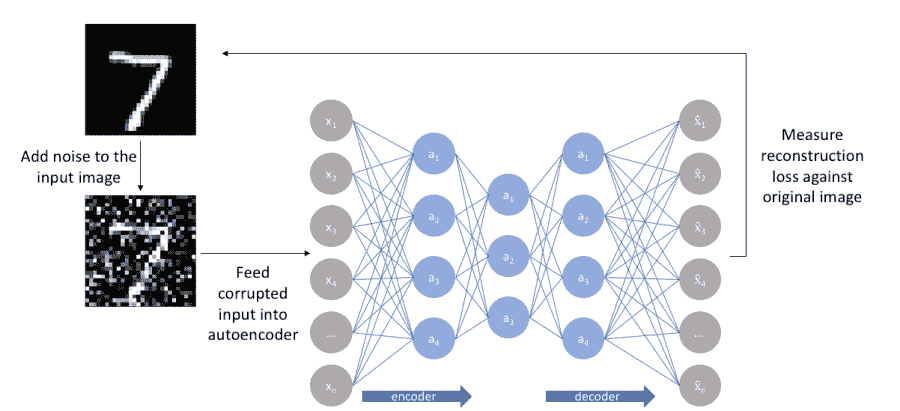
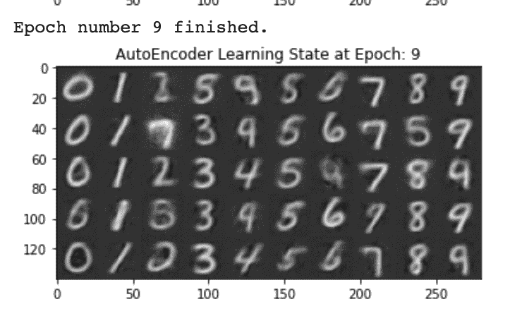
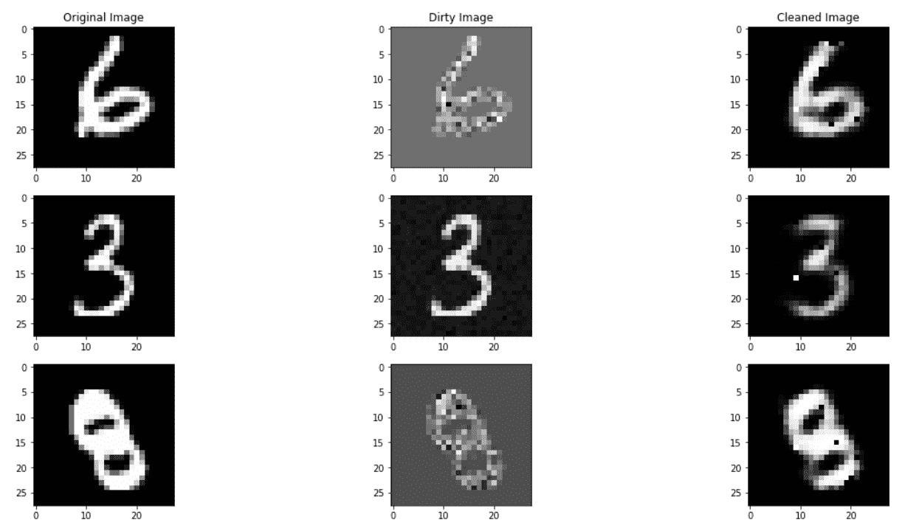
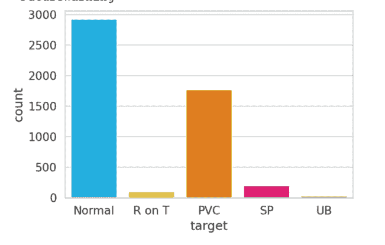
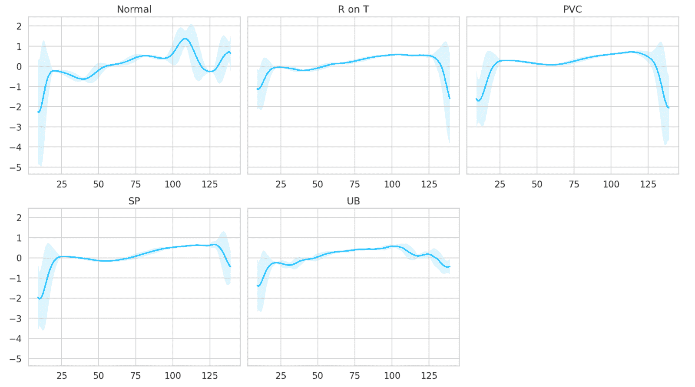
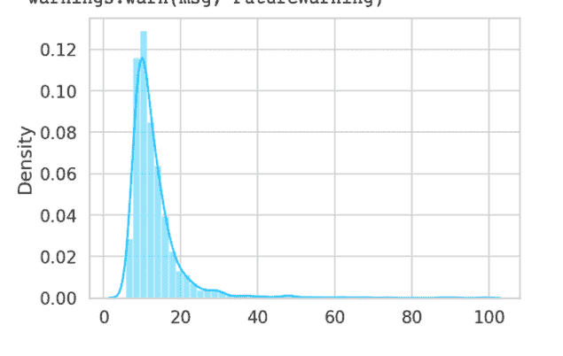
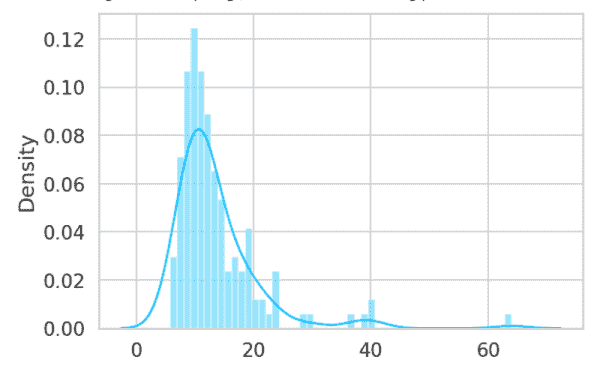

# 如何使用自动编码器[案例研究指南]

> 原文：<https://web.archive.org/web/https://neptune.ai/blog/autoencoders-case-study-guide>

[自动编码器是一类神经网络](https://web.archive.org/web/20230220131423/https://www.youtube.com/watch?v=q222maQaPYo)，用于无监督学习任务。他们有两个神经网络组件:**编码器**和**解码器**。两个组件具有基本相同的配置，这意味着输入的形状将类似于输出的形状，并且输入将与输出相同。

把输入复制到输出的架构有什么用？一点用都没有。让我解释一下:

为了理解这些网络，它们之间有一个叫做“T0”的信息瓶颈“T1”。与编码器和解码器相比，这个瓶颈区域中的神经元数量要少得多。这迫使网络减少信息，从而减少噪声，并且它们只能**近似原始数据**，而不是端到端地复制它。

训练这些算法的目的是:

1.  从瓶颈中的给定数据集学习表示或模式。
2.  根据输入生成一组新数据。

传统上，自动编码器用于降维，高维数据可以在低维空间中表示，类似于 PCA。但是主成分分析受到线性度的限制，不能用高维非线性流形表示低维空间的数据。

多亏了神经网络，自动编码器可以做到这一点。这就是为什么 autoencoder 及其变体被用于许多应用中，包括高能和量子物理、分子生物学、医学图像分割、数据压缩等等。

## 自动编码器背后的数学直觉

使用数学概念定义自动编码器的一般方法是 f(x) = h，其中 x 是输入数据，h 是信息瓶颈中的潜在变量。这个公式表示网络的编码器部分。

解码器从信息瓶颈中提取潜在变量，然后将它们映射到可以表示为 g(h)= x’的输出中。解码器通常与编码器正好相反。

让我们更深入地探讨“信息瓶颈”和“潜在变量”这两个术语，因为它们非常重要。

**信息瓶颈** (IB)于 1999 年推出，当时的假设是，it 可以通过压缩可以在网络中传输的信息量来提取重要信息或表示。这些信息被称为**潜在变量**或**潜在表征**。

简而言之，潜变量是不能直接观察到，而是从分布中提取出来的随机变量。这些变量是非常基本的，它们给了我们拓扑和数据分布的抽象知识。潜在变量，这里表示为 h，可以根据您使用的自动编码器的不同而不同。

整个自动编码器可以描述为:

其中 *f* 和 *g* 都是非线性函数。

## 自动编码器的类型

自 1987 年问世以来，自动编码器已经有了很大的发展，它们的应用程序使它们更加针对特定的任务。在这里，我们将讨论不同的自动编码器及其工作原理。

### 欠完整自动编码器

欠完整自动编码器旨在通过**尽可能限制模型**的容量，将输入 x 映射到输出 x `，从而最小化流经网络的信息量。

欠完整自动编码器通过最小化相同的损失函数来学习特征:

其中 *L* 是惩罚 *g(f(x))* 偏离原始输入 *x* 的损失函数。 *L* 可以是均方误差，甚至是平均绝对误差。

自动编码器功能强大，因为它们的容量减少了——隐藏层中的节点数量随着信息瓶颈中的节点数量一起减少。之所以这样，是因为即使瓶颈只包含一个维度，当模型的容量很高时，自动编码器仍然可以将输入复制到输出，而不提取任何信息。

我们的目标总是提取表示，然后从这些表示中重建输入。为了使自动编码器能够学习和提取表示并重建输入，我们需要:

1.  增加模型容量，
2.  增加信息瓶颈容量，
3.  **正则化模型，使其支持以上两点。**

**优点:**

因为欠完整自动编码器最大化了概率分布，所以它们不需要正则化函数。

**缺点:**

欠完整自动编码器不是通用的，它们往往会过拟合。它过度拟合的原因之一是因为它是一个容量有限的简单模型，不允许它具有灵活性。

### 正则化自动编码器

正则化自动编码器是基于数据复杂性设计的，它们解决了欠完整自动编码器的问题。编码器和解码器，随着信息瓶颈，可以有更高的容量。这使得它们更加灵活和强大。

正则化自动编码器对以下属性使用损失函数:

1.  通过逼近从输入重构输出的能力。
2.  表示的稀疏性。
3.  表示的导数的微小性。
4.  对噪声、异常值或缺失输入的鲁棒性。

#### 稀疏自动编码器

稀疏自动编码器是正则化的自动编码器，在隐藏层上伴随着重构损失有损失:

其中 *h* 代表隐藏层。

这种惩罚隐藏层的方法意味着自动编码器可以具有更大的容量，同时仍然限制网络学习表示。该网络被限制为只激活隐藏层中一定数量的神经元。

值得注意的是，神经元的激活取决于输入数据，因此它们是**数据依赖的**，这意味着输入数据的分布导致隐藏层中神经元的激活。

从上面的图像中，你可以看到稀疏自动编码器如何激活隐藏层中的不同神经元来学习表示。

有两种方法可以在给定的网络上实现稀疏性:

1.  L1 正则化
2.  KL-散度

在 **L1 正则化**中，我们给我们的损失函数*增加了一个λ项，该λ项惩罚层 *h* 中激活 *a* 的绝对值。*

这个λ项帮助我们正则化整个模型，因为正则化项只依赖于λ。

**另一方面，Kullback-Leibler 散度或 KL-Divergence** 计算两个概率分布之间的差异。KL-divergence 在测量执行近似时丢失了多少数据方面非常出色。

KL-divergence 来自信息论，在信息论中，我们使用**熵**来计算一条信息的随机性。随机性或熵越高，解释数据就越困难。

定义熵的另一种方法是编码所需的最小信息量。本质上，如果随机性高，则需要更多的信息，如果随机性低，则需要更少的信息。

信息熵表示为:

其中 x 是所需的信息

信息熵的问题在于，我们无法获得实现编码所需的最佳信息。

另一方面，KL-divergence 通过考虑近似分布来修改信息熵。

我们可以将 KL 散度描述为:

从上面的公式中，可以看到增加了一个近似项。通过计算 KL 散度来测量分布中的差异，我们现在可以将这个正则化项与损失函数相加。KL-散度也称为相对熵。

**优点:**

在稀疏自动编码器中，通过应用稀疏惩罚来防止**过拟合**。稀疏惩罚应用于隐藏层和重构误差。通过增加容量和学习复杂的拓扑结构，这使得模型更加通用。

**缺点:**

重要的是，节点是数据相关的，因为输入向量负责在训练期间产生结果的不同节点的激活。因此，测试数据中任何微小的统计变化都会产生不同的结果。

### 收缩自动编码器

收缩型自动编码器学习对输入数据的微小变化具有鲁棒性的表示。收缩式自动编码器背后的思想是将有限的输入分布映射到更小的输出分布。这种想法本质上训练自动编码器学习表示，即使相邻点稍微改变。

与我们之前讨论的类型一样，这也在损失标准中增加了一个惩罚项。

让我们探索等式的第二部分。就是**雅可比矩阵** *J* 的平方 **Frobenius** ||A||范数。Frobenius 可以认为是矩阵的 L2 范数，雅可比矩阵表示向量值函数的一阶偏导数，即潜在表示的向量。

上面的术语描述了潜在表示 *h* 相对于输入 *x* 的梯度场。这一项惩罚了雅可比矩阵的**大导数**或者潜在表示 *h* 的梯度场。输入中的任何小变化导致表征空间中的大变化或变动都是不利的。

**优点:**

相比稀疏自动编码器，收缩自动编码器是学习良好表示的好选择，因为它们对微小的变化是鲁棒的，并且节点不依赖于数据。

**缺点:**

在输入向量的编码和解码过程中，收缩自动编码器的主要缺点是其重构误差。这导致忽略了重建时值得考虑的更细微的细节。

#### 降噪自动编码器

到目前为止，我们已经看到了如何通过惩罚与原始输入 *x* 不同的自动编码器来改进它。我们现在看到的方法是相反的。我们设计我们的损失函数，使得模型训练与原始输出不太相似。

在去噪自动编码器中，我们传递添加了噪声的输入。这里的目标是训练一个自动编码器来消除这些噪声，并产生一个无噪声的输出。假设**更高层次的** **表示相对稳定**并且容易提取。



[*Source*](https://web.archive.org/web/20230220131423/https://www.jeremyjordan.me/autoencoders/)

为了实现这一点，我们需要自动编码器来最大限度地降低以下标准:

不是最小化传统标准:

去噪自动编码器被训练来学习表示，而不是简单地记忆和复制输入到输出，因为输入和输出不再相同。

**优点:**

对自动编码器去噪有利于**学习** **损坏数据中的潜在表示**，同时创建相同的鲁棒表示，允许模型恢复真实特征。

**缺点**:

为了训练去噪自动编码器，重要的是执行初步随机映射以破坏数据，然后将其用作输入。这不允许模型创建映射，因为输入和输出是不同的。

#### 可变自动编码器

变型自动编码器，俗称 VAE，是自动编码器的一种更高级的变体。虽然在基本架构上相似，但它们拥有完全不同的数学公式。

人们可以观察到的最大变化之一是潜在变量的计算方式。VAE 使用概率方法来寻找潜在的变量或代表。这个属性使它非常强大，可以与我们之前看到的自动编码器相比较。

VAE 的信息瓶颈由两部分组成。一个分量代表输入分布的平均值，而另一个分量代表分布的标准偏差。

直观上，平均值控制输入的编码应该集中在哪里，而标准差控制“面积”；编码可以与平均值相差多少。我们还将高斯分布注入潜在空间，这允许 VAE 随机采样噪声，然后使用均值和标准差对其建模。

这使得 VAE 有一种概率方法来表示给定输入的每个潜在属性。

VAE 的编码器(也称为近似推理网络)试图推断潜在变量 z 的属性。这可以描述为:

解码器(称为发生器)从潜像中提取样本并生成输出。解码器可以描述为:

VAE 可以被描述为:

等式的第一部分描述了试图最大化重建似然的重建似然，第二部分是正则化项。

VAE 中的潜在变量是连续的这一事实使它们成为一个强大的生成模型。此外，参数编码器与生成器的同步训练鼓励模型学习可预测的坐标系，使它们成为流形学习的绝佳选择。

**优点:**

VAE 让我们能够控制我们希望如何对潜在变量的分布进行建模，而不是其他模型，这些模型可以在以后用于生成新数据。

**缺点:**

由于潜在空间中注入的高斯分布，生成的图像是模糊的。

## 自动编码器的应用

自动编码器已被广泛用于降维和表示学习。与 PCA 相比，自动编码器产生的重建误差更小。它还表明，从自动编码器中提取的低维流形提高了许多任务的性能，例如:

*   分类
*   异常检测
*   数据去噪
*   图像修复
*   信息检索

## 使用 MNIST 了解 Pytorch 中的自动编码器[教程]

现在，让我们了解如何用 PyTorch 编写自动编码器，并做一些可视化工作来探索潜在空间和解释模型。

对于一个普通的自动编码器，下面的库就足够了。我们还将为设备定义一个变量。它会自动检测 colab 笔记本是有 cpu 还是有 gpu。

```py
import numpy as np
import torch
import torch.nn as nn
import torch.nn.functional as F
import matplotlib.pyplot as plt
from torchvision import datasets, transforms
import os

device = torch.device("cuda" if torch.cuda.is_available() else "cpu")
```

从 Pytorch 库下载的图像是 PIL 格式的，应该转换成张量格式。转变。ToTensor()将 PIL 转换为 Pytorch 要求的张量格式。

```py
transform = transforms.Compose([transforms.ToTensor(),
                               transforms.Normalize((0.5, ), (0.5, ))
                              ])
```

下载并加载培训数据。

```py
trainset = datasets.MNIST('MNIST_data/', download = True, train = True, transform = transform)
testset = datasets.MNIST('MNIST_data/', download = True, train = False, transform = transform)

batch_size  = 128
trainloader = torch.utils.data.DataLoader(trainset, batch_size = batch_size, shuffle = True)
testloader  = torch.utils.data.DataLoader(testset,  batch_size = batch_size, shuffle = True)
```

让我们检查一个样本。

```py
dataiter = iter(trainloader)
images, labels = dataiter.next()
plt.figure()
plt.imshow(images[0].numpy().squeeze(), cmap = 'gray')

plt.colorbar(fraction=0.046, pad=0.04)
```

我们将定义一个学习函数，它将:

1.  训练模型，
2.  计算每个小批量的损耗并更新参数，
3.  在每个纪元后显示视觉进度。

还有，注意损失函数。我们将定义均方误差损失来计算损失，并在优化过程中使用 adam optimizer。亚当是最受欢迎的优化器之一，用于大多数深度学习任务。

```py
class Learner():
 def __init__(self, train_dl, valid_dl, model, loss_func = nn.MSELoss()):
   self.train_dl, self.valid_dl = train_dl, valid_dl
   self.model        = model
   self.loss_func    = loss_func
   self.train_losses = []
   self.valid_losses = []

 def update(self,x, optm, vae):

   y_hat, z = self.model(x)
   loss = self.loss_func(y_hat,x)

   loss.backward()
   optm.step() 
   optm.zero_grad() 

   return loss.item()

 def show_visual_progress(self, rows, title, epoch, flatten, vae):

   image_title = f'{title}{epoch}'
   plt.title(image_title)

   iter(self.valid_dl)
   image_rows = []

   for idx, (image, label) in enumerate(self.valid_dl):

     if rows == idx:
         break

     image = image.to(device)
     if flatten:
       image = image.view(image.size(0), 28*28)

     images, z = self.model(image)
     images = images.detach().cpu().numpy().reshape(image.size(0),28,28)
     self.z = z.detach().cpu().numpy()

image_idxs = [list(label.numpy()).index(x) for x in range(10)]
     combined_images = np.concatenate([images[x].reshape(28,28) for x in image_idxs],1)
     image_rows.append(combined_images)

   plt.imshow(np.concatenate(image_rows))
   plt.show()

 def fit(self, epochs = 1, lr = 1e-4, flatten = False, vae = False):
   opt   = torch.optim.Adam(self.model.parameters(), lr = lr) 
   for epoch in range(epochs):
     for image, label in self.train_dl:
       image = image.to(device)
       if flatten:
         image = image.view(image.size(0), 28*28)
       self.train_losses.append(self.update(image, opt, vae=vae))

     for image, label in self.valid_dl:
       image = image.to(device)
       if flatten:
         image = image.view(image.size(0), 28*28)
       self.valid_losses.append(self.update(image, opt, vae= vae))
     print("Epoch number {} finished.".format(epoch))
     self.show_visual_progress(rows=5, title='AutoEncoder Learning State at Epoch: ', epoch = epoch, flatten = flatten, vae= vae)
```

我们定义了一个非常简约的模型，其中潜在的大小可以改变。这将有助于我们看到和理解模型如何执行变化的潜在大小。

```py
class AutoEncoder(nn.Module):

 def __init__(self, latent_size = 3):
   super(AutoEncoder, self).__init__()
   self.encoder = nn.Sequential(
       nn.Linear(784, 512),
       nn.ReLU(),
       nn.Linear(512, 128),
       nn.ReLU(),
       nn.Linear(128, latent_size)
   )

   self.decoder = nn.Sequential(
       nn.Linear(latent_size, 128),
       nn.ReLU(),
       nn.Linear(128, 512),
       nn.ReLU(),
       nn.Linear(512, 784)
   )

 def forward(self, x):
   z = self.encoder(x)
   o = self.decoder(z)
   return o, z
```

开始训练。

```py
model = AutoEncoder().to(device)
learn = Learner(trainloader, testloader, model)
learn.fit(epochs = 10, lr = 1e-4, flatten = True)

plt.subplot(121)
plt.plot(learn.train_losses)
plt.subplot(122)
plt.plot(learn.valid_losses)
```

下图来自第九个时期，当时潜在变量固定为 5。你会观察到它重建图像的效果有多好。



*The image above shows the output yielded by the autoencoder after 9 epochs.*

## 案例研究 1:使用去噪自动编码器进行图像去噪

在第一个案例研究中，我们将应用自动编码器来消除图像中的噪声。这在计算机断层扫描(CT)中非常有用，在这种扫描中，图像可能很模糊，并且很难解释或训练分割模型。

### MNIST py torch 中的自动编码器

我们将再次使用 MNIST，这次使用 Keras 来下载数据集，因为 Pytorch MNIST 数据是 PIL 格式的。虽然为了本文的简单起见，您可以使用它，但是我们将从 Keras 下载数据，因为它将确保我们以 NumPy 格式下载数据，以便我们可以添加噪声。

```py
import numpy as np
import torch
import torch.nn as nn
import torch.nn.functional as F
import matplotlib.pyplot as plt
from torchvision import datasets, transforms
import os

from keras.datasets import mnist
from torch.utils.data import DataLoader,Dataset
```

向数据集添加噪声，我们将添加两种类型的噪声:

1.  高斯的
2.  点缀

```py
def add_noise(img,noise_type="gaussian"):
  row,col=28,28
 img=img.astype(np.float32)
  if noise_type=="gaussian":
   mean=0
   var=10
   sigma=var**.5
   noise=np.random.normal(-5.9,5.9,img.shape)
   noise=noise.reshape(row,col)
   img=img+noise
   return img

 if noise_type=="speckle":
   noise=np.random.randn(row,col)
   noise=noise.reshape(row,col)
   img=img+img*noise
   return img

noises=["gaussian","speckle"]
noise_ct=0
noise_id=0
traindata=np.zeros((60000,28,28))

for idx in (range(len(xtrain))):
  if noise_ct<(len(xtrain)/2):
   noise_ct+=1
   traindata[idx]=add_noise(xtrain[idx],noise_type=noises[noise_id])

 else:
   print("n{} noise addition completed to images".format(noises[noise_id]))
   noise_id+=1
   noise_ct=0

print("n{} noise addition completed to images".format(noises[noise_id]))

noise_ct=0
noise_id=0
testdata=np.zeros((10000,28,28))

for idx in (range(len(xtest))):
  if noise_ct<(len(xtest)/2):
   noise_ct+=1
   x=add_noise(xtest[idx],noise_type=noises[noise_id])
   testdata[idx]=x

 else:
   print("n{} noise addition completed to images".format(noises[noise_id]))
   noise_id+=1
   noise_ct=0
print("n{} noise addition completed to images".format(noises[noise_id]))
```

可视化数据。

```py
f, axes=plt.subplots(2,2)

axes[0,0].imshow(xtrain[0])
axes[0,0].set_title("Original Image")
axes[1,0].imshow(traindata[0])
axes[1,0].set_title("Noised Image")

axes[0,1].imshow(xtrain[25000])
axes[0,1].set_title("Original Image")
axes[1,1].imshow(traindata[25000])
axes[1,1].set_title("Noised Image")
```

数据经过预处理后，我们可以:

1.  将数据转换成张量，
2.  创建包含原始数据和噪声数据的数据集，

使用 Pytorch 的 DataLoader 函数创建可用于训练和建模的生成器变量。

```py
class noisedDataset(Dataset):
  def __init__(self,datasetnoised,datasetclean,labels,transform):
   self.noise=datasetnoised
   self.clean=datasetclean
   self.labels=labels
   self.transform=transform
  def __len__(self):
   return len(self.noise)
  def __getitem__(self,idx):
   xNoise=self.noise[idx]
   xClean=self.clean[idx]
   y=self.labels[idx]

   if self.transform != None:
     xNoise=self.transform(xNoise)
     xClean=self.transform(xClean)

   return (xNoise,xClean,y)

transform =transforms.Compose([
   transforms.ToTensor()
])

trainset=noisedDataset(traindata,xtrain,ytrain,transform)
testset=noisedDataset(testdata,xtest,ytest,transform)

batch_size=32
trainloader=DataLoader(trainset,batch_size=32,shuffle=True)
testloader=DataLoader(testset,batch_size=1,shuffle=True)
```

定义一个去噪模型类似于定义一个普通的自动编码器，唯一改变的是用于从编码器获得最终输出的 sigmoid 函数。

sigmoid 函数将确保最终输出在 0 到 1 的范围内，因为干净数据在 0 到 1 的范围内。我们将最终信号转换到相同的范围是有意义的。

```py
class denoising_model(nn.Module):
 def __init__(self):
   super(denoising_model,self).__init__()
   self.encoder=nn.Sequential(
                 nn.Linear(28*28,256),
                 nn.ReLU(True),
                 nn.Linear(256,128),
                 nn.ReLU(True),
                 nn.Linear(128,64),
                 nn.ReLU(True)

                 )

   self.decoder=nn.Sequential(
                 nn.Linear(64,128),
                 nn.ReLU(True),
                 nn.Linear(128,256),
                 nn.ReLU(True),
                 nn.Linear(256,28*28),
                 nn.Sigmoid(),
                 )

 def forward(self,x):
   z=self.encoder(x)
  sigmoid =self.decoder(z)

   return sigmoid
```

我们也将为此任务初始化相同的损失和优化器函数。

```py
model=denoising_model().to(device)
criterion=nn.MSELoss()
optimizer=torch.optim.Adam(model.parameters(),lr=0.01)
```

初始化 120 个时期的训练。

```py
epochs=120
l=len(trainloader)
losslist=list()
epochloss=0
running_loss=0
for epoch in range(epochs):
  print("Entering Epoch: ",epoch)
 for (idx), (dirty,clean,label) in enumerate(trainloader):
   if idx == 50:
     print('+', end='')

   dirty=dirty.view(dirty.size(0),-1).type(torch.FloatTensor)
   clean=clean.view(clean.size(0),-1).type(torch.FloatTensor)
   dirty,clean=dirty.to(device),clean.to(device)

   output=model(dirty)
   loss=criterion(output,clean)

   optimizer.zero_grad()
   loss.backward()
   optimizer.step()

   running_loss+=loss.item()
   epochloss+=loss.item()

 losslist.append(running_loss/l)
 running_loss=0
 print("======> epoch: {}/{}, Loss:{}".format(epoch,epochs,loss.item()))
```

可视化结果。

```py
f,axes= plt.subplots(6,3,figsize=(20,20))
axes[0,0].set_title("Original Image")
axes[0,1].set_title("Dirty Image")
axes[0,2].set_title("Cleaned Image")

test_imgs=np.random.randint(0,10000,size=6)
for idx in range((6)):
 dirty=testset[test_imgs[idx]][0]
 clean=testset[test_imgs[idx]][1]
 label=testset[test_imgs[idx]][2]
 dirty=dirty.view(dirty.size(0),-1).type(torch.FloatTensor)
 dirty=dirty.to(device)
 output=model(dirty)
  output=output.view(1,28,28)
 output=output.permute(1,2,0).squeeze(2)
 output=output.detach().cpu().numpy()
  dirty=dirty.view(1,28,28)
 dirty=dirty.permute(1,2,0).squeeze(2)
 dirty=dirty.detach().cpu().numpy()
  clean=clean.permute(1,2,0).squeeze(2)
 clean=clean.detach().cpu().numpy()
  axes[idx,0].imshow(clean,cmap="gray")
 axes[idx,1].imshow(dirty,cmap="gray")
 axes[idx,2].imshow(output,cmap="gray")
```



The image above shows the output yielded by the denoising autoencoder which was able successfully remove noise from the input image and produced images similar to the original image. 

## 案例研究 2:利用 LSTM 自动编码器检测心电图异常

心电图(ECG 或 EKG)是一种通过测量心脏的电活动来检查心脏功能的测试。这些信号可以用智能手表来测量。

ECG 信号可以告诉我们很多关于一个人的健康和幸福的信息。在本案例研究中，我们将预测 ECG 信号并检测信号中的异常。

我们将使用属性关系文件格式(ARFF)，所以我们将安装两个包来支持它们。首先是 arff2pandas，将 arff 文件转换成 pandas 框架。第二:pandas profiling，从 pandas DataFrame 生成 profile 报告。

要在 colab 笔记本中安装这些包，我们使用以下命令:

```py
!pip install -qq arff2pandas
!pip install -U pandas-profiling
```

一旦安装了所需的包，我们就可以开始导入它们以及本案例研究所需的其他包。

```py
import torch

import copy
import numpy as np
import pandas as pd
import seaborn as sns
from pylab import rcParams
import matplotlib.pyplot as plt
from matplotlib import rc
from sklearn.model_selection import train_test_split

from torch import nn, optim

import torch.nn.functional as F
from arff2pandas import a2p
```

为了视觉上吸引人的情节，我们设置以下变量:

```py
%matplotlib inline
%config InlineBackend.figure_format='retina'

sns.set(style='whitegrid', palette='muted', font_scale=1.2)

HAPPY_COLORS_PALETTE = ["#01BEFE", "#FFDD00", "#FF7D00", "#FF006D", "#ADFF02", "#8F00FF"]

sns.set_palette(sns.color_palette(HAPPY_COLORS_PALETTE))

rcParams['figure.figsize'] = 12, 8

RANDOM_SEED = 42
np.random.seed(RANDOM_SEED)
torch.manual_seed(RANDOM_SEED)
```

以下命令可用于将数据直接下载到您的 colab 笔记本:

```py
!gdown --id 16MIleqoIr1vYxlGk4GKnGmrsCPuWkkpT
Once the data is downloaded we unzip it in the desired folder. 
```

mkdir -p 命令创建一个子目录和父目录。在我们的例子中，“data”是父目录，“timeseries”是子目录。

```py
!mkdir -p data/timeseries
```

同样，我们可以使用！unzip ECG 5000 . zip-d data/time series 用于解压缩文件。参数-d 允许文件在期望的路径中解压缩。在我们的例子中，我们创建的目录。

```py
!unzip ECG5000.zip -d data/timeseries
```

我们将定义 CPU 或 GPU 使用的设备。

```py
device = torch.device("cuda" if torch.cuda.is_available() else "cpu")
```

一旦文件被解压缩，我们就可以使用 a2p 函数打开它，该函数使用 pandas 数据帧打开 arff 文件。

```py
with open('data/timeseries/ECG5000_TRAIN.arff') as f:
 train = a2p.load(f)

with open('data/timeseries/ECG5000_TEST.arff') as f:
 test = a2p.load(f)
```

可视化数据。

```py
df = train.append(test)
df = df.sample(frac=1.0)
df.shape
CLASS_NORMAL = 1

class_names = ['Normal','R on T','PVC','SP','UB']

ax = sns.countplot(df.target)
ax.set_xticklabels(class_names);
```



*As you can see from the bar chart above, the normal class has by far the most examples. Now let’s plot a time series graph to see how these features look like against the target feature.*

```py
def plot_time_series_class(data, class_name, ax, n_steps=10):
 time_series_df = pd.DataFrame(data)

 smooth_path = time_series_df.rolling(n_steps).mean()
 path_deviation = 2 * time_series_df.rolling(n_steps).std()

 under_line = (smooth_path - path_deviation)[0]
 over_line = (smooth_path + path_deviation)[0]

 ax.plot(smooth_path, linewidth=2)
 ax.fill_between(
   path_deviation.index,
   under_line,
   over_line,
   alpha=.125
 )
 ax.set_title(class_name)

classes = df.target.unique()

fig, axs = plt.subplots(
 nrows=len(classes) // 3 + 1,
 ncols=3,
 sharey=True,
 figsize=(14, 8)
)

for i, cls in enumerate(classes):
 ax = axs.flat[i]
 data = df[df.target == cls]
   .drop(labels='target', axis=1)
   .mean(axis=0)
   .to_numpy()
 plot_time_series_class(data, class_names[i], ax)

fig.delaxes(axs.flat[-1])
fig.tight_layout()
```



*If you observe carefully, the normal class stands out compared to other classes. This data attribute can help the autoencoder find anomalies more easily. *

使用条件语句创建带有两个变量(正常和异常)的数据集的时间。一旦创建了这两个变量，我们就可以使用 sklearn 中的 train_test_split 来分离训练、测试和验证数据。

```py
normal_df = df[df.target == str(CLASS_NORMAL)].drop(labels='target', axis=1)

anomaly_df = df[df.target != str(CLASS_NORMAL)].drop(labels='target', axis=1)
train_df, val_df = train_test_split(
 normal_df,
 test_size=0.15,
 random_state=RANDOM_SEED
)

val_df, test_df = train_test_split(
 val_df,
 test_size=0.33,
 random_state=RANDOM_SEED
)
```

一旦数据被分离，我们就将 NumPy 转换成二维张量，autoencoder 可以用它来训练和模拟数据。

```py
def create_dataset(df):

 sequences = df.astype(np.float32).to_numpy().tolist()

 dataset = [torch.tensor(s).unsqueeze(1).float() for s in sequences]

 n_seq, seq_len, n_features = torch.stack(dataset).shape

 return dataset, seq_len, n_features

train_dataset, seq_len, n_features = create_dataset(train_df)
val_dataset, _, _ = create_dataset(val_df)
test_normal_dataset, _, _ = create_dataset(test_df)
test_anomaly_dataset, _, _ = create_dataset(anomaly_df)
```

现在，让我们编码自动编码器。与我们之前用来建模图像的方法不同，我们使用不同的方法来建模时间序列或序列数据。在这个案例研究中，我们将使用长短期记忆或 LSTM。

LSTMs 擅长对顺序数据建模。他们可以记住长期序列，这使得根据序列长度预测变量变得更加容易。

```py
class Encoder(nn.Module):

 def __init__(self, seq_len, n_features, embedding_dim=64):
   super(Encoder, self).__init__()

   self.seq_len, self.n_features = seq_len, n_features
   self.embedding_dim, self.hidden_dim = embedding_dim, 2 * embedding_dim

   self.\r\nn1 = nn.LSTM(
     input_size=n_features,
     hidden_size=self.hidden_dim,
     num_layers=1,
     batch_first=True
   )

   self.\r\nn2 = nn.LSTM(
     input_size=self.hidden_dim,
     hidden_size=embedding_dim,
     num_layers=1,
     batch_first=True
   )

 def forward(self, x):
   x = x.reshape((1, self.seq_len, self.n_features))

   x, (_, _) = self.\r\nn1(x)
   x, (hidden_n, _) = self.\r\nn2(x)

   return hidden_n.reshape((self.n_features, self.embedding_dim))
```

一旦编码器准备好了，我们还要定义一个解码器。解码器也将具有相同的 LSTM 架构。

```py
class Decoder(nn.Module):

 def __init__(self, seq_len, input_dim=64, n_features=1):
   super(Decoder, self).__init__()

   self.seq_len, self.input_dim = seq_len, input_dim
   self.hidden_dim, self.n_features = 2 * input_dim, n_features

   self.\r\nn1 = nn.LSTM(
     input_size=input_dim,
     hidden_size=input_dim,
     num_layers=1,
     batch_first=True
   )

   self.\r\nn2 = nn.LSTM(
     input_size=input_dim,
     hidden_size=self.hidden_dim,
     num_layers=1,
     batch_first=True
   )

   self.output_layer = nn.Linear(self.hidden_dim, n_features)

 def forward(self, x):
   x = x.repeat(self.seq_len, self.n_features)
   x = x.reshape((self.n_features, self.seq_len, self.input_dim))

   x, (hidden_n, cell_n) = self.\r\nn1(x)
   x, (hidden_n, cell_n) = self.\r\nn2(x)
   x = x.reshape((self.seq_len, self.hidden_dim))

   return self.output_layer(x)
```

让我们将编码器和解码器封装在一个模块中。

```py
class RecurrentAutoencoder(nn.Module):

 def __init__(self, seq_len, n_features, embedding_dim=64):
   super(RecurrentAutoencoder, self).__init__()

   self.encoder = Encoder(seq_len, n_features, embedding_dim).to(device)
   self.decoder = Decoder(seq_len, embedding_dim, n_features).to(device)

 def forward(self, x):
   z = self.encoder(x)
   o = self.decoder(z)
   return o
```

现在我们定义模型。

```py
model = RecurrentAutoencoder(seq_len, n_features, 128)
model = model.to(device)
```

让我们写一个我们将要训练的函数。

```py
def train_model(model, train_dataset, val_dataset, n_epochs):
 optimizer = torch.optim.Adam(model.parameters(), lr=1e-3)
 criterion = nn.L1Loss(reduction='sum').to(device)
 history = dict(train=[], val=[])

 best_model_wts = copy.deepcopy(model.state_dict())
 best_loss = 10000.0
  for epoch in range(1, n_epochs + 1):
   model = model.train()

   train_losses = []
   for seq_true in train_dataset:
     optimizer.zero_grad()

     seq_true = seq_true.to(device)
     seq_pred = model(seq_true)

     loss = criterion(seq_pred, seq_true)

     loss.backward()
     optimizer.step()

     train_losses.append(loss.item())

   val_losses = []
   model = model.eval()
   with torch.no_grad():
     for seq_true in val_dataset:

       seq_true = seq_true.to(device)
       seq_pred = model(seq_true)

       loss = criterion(seq_pred, seq_true)
       val_losses.append(loss.item())

   train_loss = np.mean(train_losses)
   val_loss = np.mean(val_losses)

   history['train'].append(train_loss)
   history['val'].append(val_loss)

   if val_loss < best_loss:
     best_loss = val_loss
     best_model_wts = copy.deepcopy(model.state_dict())

   print(f'Epoch {epoch}: train loss {train_loss} val loss {val_loss}')

 model.load_state_dict(best_model_wts)
 return model.eval(), history
```

注意:我们使用 L1Loss 或平均绝对误差。这在处理数据中的异常值或异常时非常有用。此外，对于序列分析，它工作得非常好，因为它使用与被测量的数据相同的尺度。

让我们开始训练吧。

```py
model, history = train_model(
 model,
 train_dataset,
 val_dataset,
 n_epochs=150
)
```

一旦模型经过训练，我们就可以开始预测值，并将它们与原始数据进行比较，以了解我们的模型的表现如何。

```py
def predict(model, dataset):
 predictions, losses = [], []
 criterion = nn.L1Loss(reduction='sum').to(device)
 with torch.no_grad():
   model = model.eval()
   for seq_true in dataset:
     seq_true = seq_true.to(device)
     seq_pred = model(seq_true)

     loss = criterion(seq_pred, seq_true)

     predictions.append(seq_pred.cpu().numpy().flatten())
     losses.append(loss.item())
 return predictions, losses

_, losses = predict(model, train_dataset)
sns.distplot(losses, bins=50, kde=True)
```



*As you can see from the graph, the model managed to minimize loss on the training data set. Now let’s do the same with the test dataset and see how our model performs.*

```py
predictions, pred_losses = predict(model, test_normal_dataset)
sns.distplot(pred_losses, bins=50, kde=True)
```



*You can see similar performance on the validation set as well. The losses are reduced. *

最后，让我们在时序图中看看模型性能。

```py
def plot_prediction(data, model, title, ax):
 predictions, pred_losses = predict(model, [data])

 ax.plot(data, label='true')
 ax.plot(predictions[0], label='reconstructed')
 ax.set_title(f'{title} (loss: {np.around(pred_losses[0], 2)})')
 ax.legend()
fig, axs = plt.subplots(
 nrows=2,
 ncols=6,
 sharey=True,
 sharex=True,
 figsize=(22, 8)
)

for i, data in enumerate(test_normal_dataset[:6]):
 plot_prediction(data, model, title='Normal', ax=axs[0, i])

for i, data in enumerate(test_anomaly_dataset[:6]):
 plot_prediction(data, model, title='Anomaly', ax=axs[1, i])

fig.tight_layout()
```

从上图可以明显看出，该模型在预测正常心电图模式方面表现良好。它没有足够的准确性来对异常模式做出好的预测。如果我们的模型针对更多的时期和更多的数据进行训练，那么它可以在给定的任务中表现良好。

注意:该模型在预测正常模式方面表现出色，因为数据集的正常特征多于异常特征。

## 结论

我们已经讨论了什么是自动编码器，以及它们如何发现数据中的结构。压缩数据的信息瓶颈很重要，因为它允许自动编码器学习潜在的表示，这些表示可用于各种深度学习任务。自动编码器是 PCA 的高级版本，其可以是非线性流形，并且仍然对异常值具有鲁棒性。

我们看到了自动编码器的不同变体，以及它们如何针对特定任务相互改进。我们还对 autoencoder 进行了编码，以更好地理解它的工作原理，并了解了不同维度的潜在空间对结果的不同影响。

最后，我们探讨了如何使用自动编码器完成两项任务:图像去噪和异常检测。

我希望这个教程是有趣的和有益的。感谢您的阅读！

### 承认

第二个案例研究中使用的代码受到了 [Venelin](https://web.archive.org/web/20230220131423/https://github.com/curiousily) 的启发。我只是修改了一下让它更易读。

### 进一步阅读

1.  [自动编码器](https://web.archive.org/web/20230220131423/https://en.wikipedia.org/wiki/Autoencoder)
2.  [深度学习书籍(第 14 章):自动编码器](https://web.archive.org/web/20230220131423/http://www.deeplearningbook.org/contents/autoencoders.html)
3.  [自动编码器——深度学习位](https://web.archive.org/web/20230220131423/https://hackernoon.com/autoencoders-deep-learning-bits-1-11731e200694)
4.  [应用深度学习–第 3 部分:自动编码器](https://web.archive.org/web/20230220131423/https://towardsdatascience.com/applied-deep-learning-part-3-autoencoders-1c083af4d798)
5.  [自动编码器简介](https://web.archive.org/web/20230220131423/https://www.jeremyjordan.me/autoencoders/)