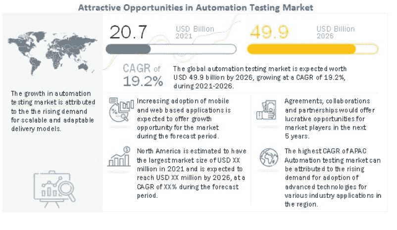
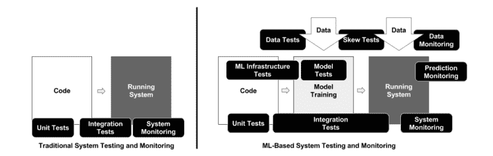
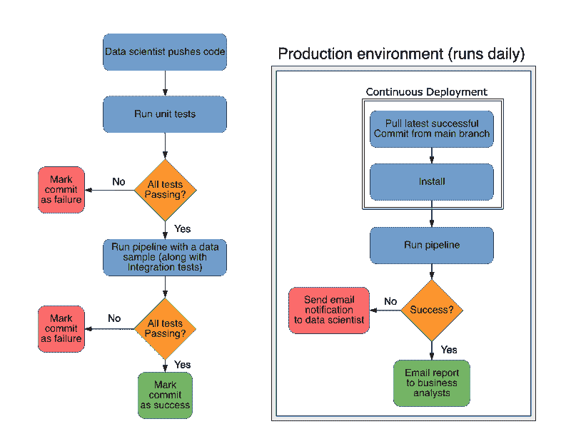

# 机器学习项目中的自动化测试 MLOps 的最佳实践]

> 原文：<https://web.archive.org/web/https://neptune.ai/blog/automated-testing-machine-learning>

机器学习中的自动化测试是 ML 项目中非常有用的部分，它可以产生一些长期的差异。可能在开发的早期阶段被低估了，只有在后期阶段，当系统开始因为恼人的 bug 而分崩离析时，它才得到关注，这些 bug 只会随着时间的推移而增长。为了缓解这些问题并减少 bug 的数量，建议在项目中添加一些自动化测试。

在本文中，我们将尝试理解:

*   什么是自动化测试
*   以及如何用它们把 ML 项目做得更好。

## 什么是自动化测试？

自动化测试是一个过程，在这个过程中，测试人员使用特殊的工具来测试软件，并找出任何可能存在的错误。此外，它在 20 世纪 90 年代早期就已经出现了，但是直到最近几年，随着敏捷开发和持续集成(CI)的流行，它才开始流行起来。

自动化测试是开发过程中不可或缺的一部分。它可以帮助在开发生命周期的早期识别 bug 和缺陷，这可以节省以后修复它们的时间和金钱。众所周知，自动化测试比手工测试更可靠，因为它们不容易出现人为错误。

自动化测试过程比手工测试有很多优势。其中包括:

*   减少开发人员的工作量和总体成本
*   提高质量和一致性
*   更快的发布周期
*   跨多个设备或位置轻松分配测试
*   更好的报告能力和其他

预计全球自动化测试市场规模将从 2021 年的 207 亿美元增长到 2026 年的 499 亿美元，复合年增长率(CAGR)为 19.2%。这是由于移动和基于网络的应用程序的快速采用。此外，物联网、人工智能和机器学习等现代技术正在迅速扩展，这为测试它们提供了一个很好的机会。

自动化测试的例子

*The opportunities in the automation testing market |* [*Source*](https://web.archive.org/web/20221201155939/https://www.marketsandmarkets.com/Market-Reports/automation-testing-market-113583451.html)

## 通常，当谈到自动化测试时，首先出现的是以软件质量保证为目的的软件测试。但是除了软件测试之外，自动化测试还可以包括一些其他类型的测试，比如硬件、安全性、性能等等。

**硬件测试**:在产品出厂前，使用特殊的硬件和软件自动测试来验证产品的质量。被测产品一般称为 [UUT(被测单元)](https://web.archive.org/web/20221201155939/https://www.weetech.de/en/news-info/tester-abc/unit-under-test-uut-1/)。例如，自动化硬件测试可以包括机械地(例如振动、致动、压力、温度变化)或电地(例如供电、触发)刺激 UUT。之后，对采集的数据进行分析并生成报告。

**安全测试**:也称为网络测试，是我们针对软件程序、网络设备或整个 IT 基础设施运行的一组自动化测试，旨在寻找黑客可能利用的漏洞。测试可能包括寻找系统的已知易受攻击的版本(例如，web 服务器的旧版本)，测试密码形式以查看它们是否能被暴力或字典攻击破解，或者尝试使系统过载以查看它是否会泄露信息(DDoS、暴力)。

**性能测试**:是一个软件测试过程，用于测试一个应用在特定工作负载下的速度、响应时间和稳定性。性能测试的主要目标是识别和消除软件应用程序中的性能瓶颈。一些类型的性能测试包括:

**负载测试:**用预期的用户数量测试应用程序，看看它是如何工作的。

*   **压力测试:**包括极端工作负载下的应用测试。
*   **最后，与我们最相关的自动化测试类型是软件测试**。软件测试最常见的例子是:

**单元测试**:对软件的单个组件或其功能进行的测试。基本上，他们隔离一个特定的组件或功能，并单独测试它们。在这个过程中，可以理解应用程序中每个单元的功能。

*   **集成测试**:在单元测试之后。集成测试的主要目的是找出软件不同组件交互之间的任何不规则性。
*   验收测试:这些测试的主要目标是证明应用程序是否做了预期的事情。他们在类似生产的环境中从最终用户的角度评估系统。
*   测试传统软件与测试机器学习项目

## 测试机器学习项目具有挑战性，而且没有一种标准的方法。由于 ML 项目严重依赖于数据和模型，而这些数据和模型不能被强有力地指定为先验的，因此测试 ML 项目比测试手工编码的系统是一个更复杂的挑战。与大多数传统软件测试不同，ML 项目测试必须包括数据测试、模型测试以及生产测试。

首先， **ML 项目比传统软件**有更多的不确定性。在很多情况下，我们甚至不知道项目在技术上是否可行，所以我们必须投入一些时间进行研究并给出答案。这种不确定性损害了良好的软件实践，例如测试，因为我们不想在开发的早期阶段花费时间测试 ML 项目，这可能不会获得进一步继续的绿灯。

*Traditional system testing VS ML projects testing |* [*Source*](https://web.archive.org/web/20221201155939/https://static.googleusercontent.com/media/research.google.com/en//pubs/archive/aad9f93b86b7addfea4c419b9100c6cdd26cacea.pdf)

*   另一方面，**项目越是没有测试，它积累的技术债务就越多**。随着 ML 项目的成熟，我们必须开始越来越关注增加测试覆盖率和支付技术债务。
*   与传统的软件测试不同，在 ML 测试中我们需要特别注意数据测试。ML 系统不同于传统的基于软件的系统，因为 ML 系统的行为不是直接在代码中指定的，而是从数据中学习的。如果输入数据有一些缺陷，那么我们不能期望 ML 模型会产生最佳结果。
*   最后，**确保 ML 系统不仅在开发和发布阶段正确运行，而且在生产阶段也能继续正确运行，这一点至关重要**。在传统的软件中，测试只在开发环境中运行，并且假设如果一段代码进入生产环境，它一定已经被测试并正常工作。在 ML 项目中，随着时间的推移，一些外部条件可能会导致数据转移，或者我们可能会改变数据源和提供者。这就是为什么我们需要使用输出日志和仪表板继续测试和监控 ML 系统。
*   机器学习测试的挑战

## 正如我们在上一节中所描述的，测试 ML 项目比测试传统软件要复杂得多。除此之外，还有很多事情需要我们注意。特别是因为它们中的一些发生在 ML 系统管道的下游。例如，预测中的异常可能不是因为模型，而是因为输入数据。

ML 项目中的一些关键问题是:

**数据问题**:缺失值、数据分布偏移、设置问题、无法再现输入数据、低效的数据架构等。

*   **模型问题**:模型质量低、模型大、包版本不同等。
*   **部署问题**:环境不稳定、代码破损、培训服务不对称等。
*   正因为如此，在本文中，我们将提出一些可以减轻这类问题影响的测试。

机器学习中自动化测试的类型

## 机器学习中自动化测试的分类没有统一的规则。因此，在下面的文章中，我们粗略地将自动化测试分成了几个类别。

烟雾测试

### 冒烟测试是最简单的测试类型，应该在项目开始后立即实施。**冒烟测试的主要目的是确保代码成功运行**。这可能听起来微不足道，但是这个测试在 ML 项目中是有益的。

通常，ML 项目包括许多包和库。这些软件包会不时提供新的更新。问题是有时新的更新会改变包中的一些功能。即使代码中没有明显的变化，逻辑中的变化也可能会带来更严重的问题。此外，也许我们想使用一些更稳定和测试更好的包的旧版本。

因此，一个好的实践是创建一个包含所有依赖项的 requirement.txt 文件，并使用一个新的测试环境运行冒烟测试。通过这种方式，我们将确保代码在除了我们的工作环境之外的至少一个环境中运行，并且我们可以安装所有需要的依赖项。这是一个常见的问题，安装一些旧的依赖，我们已经从一些旧的项目本地。

履行

#### 为了确保代码总是成功运行，许多团队在 CI 管道中实现冒烟测试，每当有人进行新的提交时，就会触发冒烟测试。接下来，我们可以使用 Jenkins、GitHub Actions 或任何其他 CI 工具在 CI 管道中设置一些冒烟测试。

单元测试

### 在冒烟测试之后，要实现的下一个逻辑测试是单元测试。如上所述，单元测试隔离一个特定的组件，并分别测试它们。基本上，这个想法是将代码分割成块或单元，然后一个一个地单独测试。

使用单元测试更容易发现 bug，尤其是在早期开发周期。调试代码非常方便，因为我们能够分析孤立的部分，而不是整个代码。此外，它有助于设计更好的代码，因为如果很难将代码的某些部分隔离出来进行单元测试，这可能意味着代码的结构不是很好。

根据经验，开始编写单元测试的最佳时机是我们开始将代码组织成函数和类的时候。这是因为，在 ML 项目开发的早期阶段，编写测试是浪费时间，而且为准备部署的系统编写测试也可能为时已晚。

履行

#### 编写单元测试函数的标准模式包括以下步骤:

The standard pattern of writing a unit test function includes steps:

## 1 定义输入数据

*   2 用输入数据执行我们想要测试的逻辑并得到结果
*   3 定义预期结果
*   4 比较实际结果和预期结果
*   有很多单元测试的例子。基本上，对于可以逻辑分离的代码的每一部分，都可以编写单元测试。单元测试的一些例子包括测试输入数据、特性、模型输出等等。

**Python 中默认的单元测试框架是 Unittest** 。它支持测试自动化，共享测试的设置和关闭代码，将测试聚合到集合中，以及测试独立于报告框架。

此外，Unittest 拥有 unittest.mock 模块，该模块支持使用模拟对象来替换测试中的 ML 系统部分，并断言它们是如何使用的。为此，它提供了一个模拟类，旨在取代整个项目中测试 doubles 的使用。模拟跟踪我们如何使用它们，允许我们断言代码对它们做了什么。

另一个旨在帮助编写应用程序单元测试的库是 Pytest。Pytest 建立在 3 个主要概念之上，包括测试功能、断言和测试设置。它有一个用于编写测试的命名约定，允许自动运行测试。

集成测试

### 单元测试之后，测试组件如何协同工作是很有用的。为此，我们使用集成测试。集成测试不一定意味着测试整个 ML 项目，而是作为一个单元测试项目的一个逻辑部分。

例如，功能测试可能包括几个单元测试，但它们都是一个集成测试的一部分。集成测试的主要目标是确保模块在组合时能够正确交互，并且符合系统和模型标准。与可以独立运行的单元测试不同，集成测试在我们执行管道时运行。这就是为什么所有的单元测试都可以成功运行，但是集成测试仍然会失败。

在传统的软件测试中，测试只在开发阶段运行，因为它假设如果一个代码进入生产阶段，它一定已经被测试过了。在 ML 项目中，集成测试是生产管道的一部分。对于不经常执行的 ML 管道，总是将集成测试与一些监控逻辑结合在一起是一个很好的实践。

履行

*Unit and integration tests in development and production |* [*Source*](https://web.archive.org/web/20221201155939/https://ploomber.io/blog/ci-for-ds/)

#### 集成测试可以在没有任何额外框架的情况下编写，直接集成到代码中作为断言语句或“try”–except 条件。很可能，我们大多数人已经编写了一些集成测试，甚至没有意识到这一点。因为它们可能非常简单，所以建议在开发的早期阶段将它们包含在 ML 项目中。

至于单元测试，有很多例子可以用集成测试来测试。例如，我们可以测试一些数据属性，如空值的存在、目标变量的分布，确保模型性能没有显著下降，以及其他类似的事情。

尽管集成测试可以在没有任何附加包的情况下编写，但是有一些包会有所帮助。例如，使用 Pytest，可以对特性管道运行集成或端到端测试。你可以在这里读到这个[。](https://web.archive.org/web/20221201155939/https://www.hopsworks.ai/post/testing-feature-logic-transformations-and-feature-pipelines-with-pytest)

回归测试

### **通过回归测试，我们希望确保我们不会遇到一些我们以前见过并已经修复的错误，也就是说，我们希望确保代码中的新变化不会重新引入一些旧错误**。因此，在提交 bug 修复时，编写一个测试来捕获 bug 并防止将来的退化是一个很好的实践。

在 ML 项目中，当数据集变得更加复杂，模型定期重新训练，并且我们希望保持模型的最低性能时，可以使用回归测试。每当我们遇到一个困难的输入样本，而我们的模型输出了一个错误的决策时，我们可能会将它添加到一个困难案例数据集中，并将该测试集成到我们的管道中。

履行

#### 例如，如果我们正在处理一个计算机视觉模型，并且我们的子样本包含具有特定类型噪声(如带状噪声)的图像，那么在这种特定情况下，我们的模型可能会产生非常糟糕的结果。也许我们没有想到我们的输入数据会有这种噪声，因为我们的相机有一些暂时的缺陷导致了它。此外，目前修复模型可能过于复杂。在这种情况下，编写回归测试是一个好主意，以防万一来处理这个问题，并了解条带噪声是否可能是未来潜在的不正确模型结果的原因。

除此之外，回归测试可以用来防止一些尚未发生但将来可能会发生的错误。例如，如果我们正在为自动驾驶车辆构建一个 ML 系统，我们需要考虑现实世界中可能发生的所有可能情况，即使我们没有这些数据。或者，如果我们的计算机视觉模型从前面的例子中得到一个带有新型噪声的图像子样本，如高斯和类似噪声，那么测试一下情况。

没有特定的库来编写回归测试，因为它们都是不同的，并且依赖于项目。

数据测试

### 顾名思义，数据测试包括 ML 项目中与任何类型的数据测试相关的所有测试。在大多数情况下，除了冒烟测试之外，之前的所有测试都可能包括数据测试。关于数据测试的单独部分的目的是给出一些想法和例子，说明当我们处理数据时可以测试什么。

由于大多数 ML 项目的行为严重依赖于数据，这一部分尤其重要。下面，我们将介绍一些对数据验证有用的测试。

**数据和特性期望**:检查数据的某些属性会很有用。例如，人们期望一个人的身高是正数，并且超过 3 米；或者，如果我们正在处理图像，我们很可能知道图像的属性。即使我们不知道，也有可能从测试集中得出结论，并根据统计意义对未来做出一些假设。

*   **特性重要性**:了解每个特性提供的价值是有益的，因为每个增加的特性都有工程成本，并且在 ML 管道中消耗时间。有一些特性重要性方法，如置换特性重要性，可以定义为测试，并在每次添加新特性时运行。
*   **新数据或新功能成本**:测试额外的数据是否会消耗太多资源，是否真的值得。我们想要测量附加的特性是否增加了显著的推理延迟或 RAM 使用，并基于此决定我们是否真的想要在 ML 项目中保留该特性。
*   **禁止的或错误的数据**:我们希望确保这些数据可以合法使用，并且在将来不会引起法律问题。此外，我们需要确保数据来自经过验证的来源或供应商，并且数据源是可持续的。
*   **数据的隐私控制**:如果 ML 项目包含一些敏感数据，确保不会出现一些可能导致严重后果的数据泄露。我们可以测试管道数据的访问是否安全。
*   履行

#### 大多数数据测试都与单元测试和集成测试相关。因此，为了实现其中的一些，我们需要遵循来自单元和集成测试的最佳实践。数据测试中最重要的事情是，我们对数据有预先的期望，并且希望这些期望在系统的实际状态中持续。

让数据测试部分在你的项目中排序的一个真正伟大的包是[远大前程](https://web.archive.org/web/20221201155939/https://greatexpectations.io/)。它通过数据测试等方式帮助数据团队消除管道债务。你可以在这篇[文章](/web/20221201155939/https://neptune.ai/blog/reducing-pipeline-debt-great-expectations)中了解更多。

模型检验

### 就像数据测试一样，模型测试可以是单元测试、集成测试或回归测试的一部分。这种测试是专门针对 ML 项目的，因为在传统的软件测试中，模型很少存在。下面，我们提到一些对模型测试有用的测试:

**审查并提交模型规范**:对模型规范进行适当的版本控制非常重要。同样，了解为重现特定结果而运行的确切代码也很重要。这就是为什么在主分支上推进代码之前，仔细检查新模型的结果是很重要的。

*   **模型过度拟合**:使用适当的验证技术和监控模型度量，确保没有模型过度拟合。使用单独的样本外检验来再次检查模型的正确性。
*   **模型调整不够**:使用适当的超参数调整策略，如网格搜索或更复杂的元试探法。可以编写一些带有网格搜索或随机搜索的自动化测试，当一个新的特性被引入时就会被触发。
*   **模型陈旧的影响**:例如，一些内容推荐系统和金融 ML 应用会随着时间的推移而发生变化。如果 ML 模型不能保持足够的更新，我们说这个模型是陈旧的。我们需要了解模型过时如何影响预测，并确定更新模型的频率和时间。解决这个问题的一个方法是执行测试，将旧模型或具有旧功能的模型与当前模型进行比较，并了解模型的老化，从而制定再培训计划。
*   **简单的模型并不总是更好**:对照一些简单的基线模型测试当前模型。
*   履行

#### 模型测试可以作为单元测试或集成测试的一部分来实现，但是有一些有趣的包可以提供帮助。

例如， [Deepchecks](https://web.archive.org/web/20221201155939/https://github.com/deepchecks/deepchecks) 是一个 Python 包，允许我们以最小的努力深度验证 ML 模型和数据。这包括对各种问题的检查，包括模型性能、数据完整性、分布不匹配等。

一个更有趣的包是[清单](https://web.archive.org/web/20221201155939/https://github.com/marcotcr/checklist)。它包含测试 NLP 模型的代码，如论文[“超越准确性:NLP 模型的行为测试与清单”](https://web.archive.org/web/20221201155939/https://homes.cs.washington.edu/~marcotcr/acl20_checklist.pdf)中所述。

CheckList 提供了一种与模型和任务无关的测试方法，它使用三种不同的测试类型来测试模型的各个功能:

**最小功能测试(MFT)** :旨在创建小型且集中的测试数据集，对于检测 ML 模型何时使用快捷方式来处理复杂输入而没有实际掌握学习能力特别有用。

*   **不变性测试(INV** ):它是关于对输入应用标签保留扰动，并期望模型预测保持不变。例如，改变位置名称与 NER 能力的情绪分析任务。
*   **方向预期测试(DIR)** :类似于 INV，除了标签预期以某种方式变化。比如在句子中加入否定词，观察情绪变化。
*   监控机器学习测试

### 非常重要的是，不仅要知道 ML 项目在发布时工作正常，而且要知道它会随着时间的推移继续正常运行。一个好的做法是使用显示相关图表和统计数据的各种仪表板来监控系统，并在发生异常情况时自动发出警报。

监控服务系统、培训管道和输入数据对 ML 项目至关重要。正因为如此，为连续检查 ML 系统创建一些自动化测试将是非常有益的。其中一些列举如下:

**依赖性和来源变化**:通常当一个 ML 系统在生产中工作时，它消耗来自各种来源的数据来生成有用的特性。源系统中的部分中断、版本升级和其他更改会极大地破坏模型训练。因此，实现一些测试来监视数据源中的依赖性和变化是很有用的。

*   **生产中的监控数据**:我们在模型测试部分讨论的大多数测试都可以作为生产中的监控测试来实现。其中一些与输入数据差异、数据分布变化、输出异常等有关。
*   **生产中的监控模型**:与监控数据测试类似，大部分模型测试都包含在模型测试部分。其中一些是关于监控模型的陈旧性、训练速度的变化、服务延迟、RAM 使用等等。
*   履行

#### 包含在 ML 项目中的一个好工具是 [Aporia](https://web.archive.org/web/20221201155939/https://www.aporia.com/) 。这是一个在生产中监控机器学习模型的平台。数据科学团队可以使用 Aporia 的 monitor builder 轻松创建用于检测漂移、意外偏差和完整性问题的监视器，并接收实时警报，以便进行进一步调查和根本原因分析。

Arize AI 是一个 ML 可观察性平台，使 ML 从业者能够更好地检测和诊断模型问题。它有助于理解机器学习模型在现实世界中部署时的行为方式。Arize AI 的主要目标是监控、解释、故障排除和改进机器学习模型。

[WhyLabs](https://web.archive.org/web/20221201155939/https://whylabs.ai/) 允许数据科学家深入了解他们的数据集，并监控他们部署的 ML 模型。它提供了与 Python 或 Java 的简单集成，只需最少的维护工作。WhyLabs 是一个平台，使开发人员能够轻松维护实时日志和监控 ML 部署。

尽管大多数测试可以用我们开发 ML 项目、发送通知和构建仪表板所用的相同编程语言来编写，但是有一些有用的工具是专门为帮助实现测试结构和逻辑而开发的。

虽然我们已经在上面讨论了它们，但是本节试图通过提及它们所附带的测试条款的类型来对它们进行总结。

While we have already discussed them above, this section seeks to summarize them all by mentioning the type of testing provisions they come with.

| 詹金斯 | GitHub 操作 | 单元测试 | Pytest | 深度检查 | 清单 | Aporia | 艾瑞泽·艾 | 为什么实验室 | **烟尘测试** |
| --- | --- | --- | --- | --- | --- | --- | --- | --- | --- |
|  |  |  |  |  |  |  |  |  | **单元测试** |
|  |  |  |  |  |  |  |  |  | **集成测试** |
|  |  |  |  |  |  |  |  |  | **回归测试** |
|  |  |  |  |  |  |  |  |  | **数据测试** |
|  |  |  |  |  |  |  |  |  | **模型测试** |
|  |  |  |  |  |  |  |  |  | **监控测试** |
|  |  |  |  |  |  |  |  |  | 结论 |

## 机器学习中的自动化测试是一个相对较新的话题，每天都在发展。随着复杂 ML 系统的出现，需要构建更复杂的测试解决方案。在本文中，我们介绍了测试 ML 项目的各种不同的方法。此外，我们还介绍了几个可以帮助我们在项目中实现测试逻辑的工具。

您可以参考本文中提到的资源来阅读更多关于自动化测试、相关工具以及如何使用它们来实现您的优势。

资源

### Resources