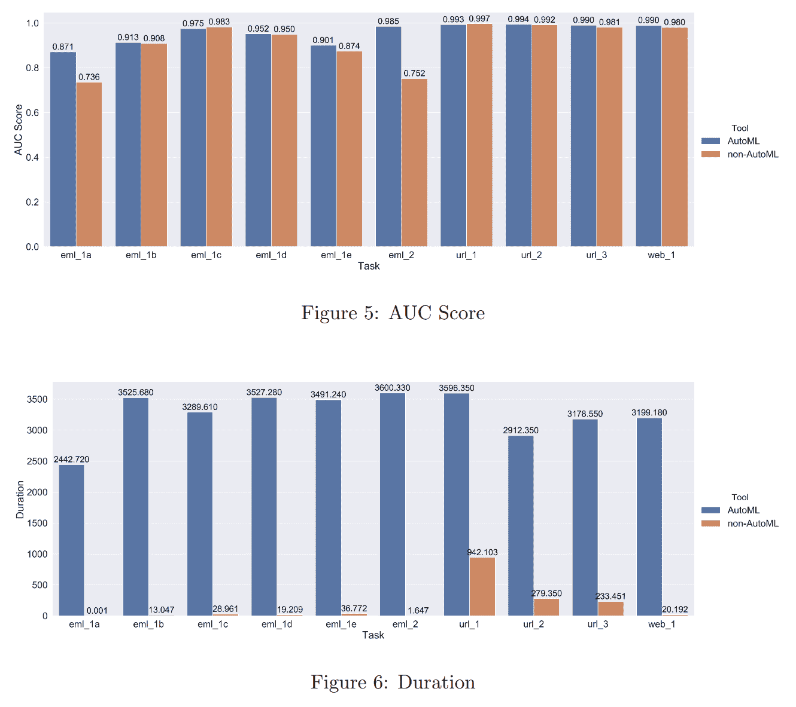

# AutoML 解决方案:作为一名数据科学家，我喜欢和不喜欢 AutoML 的地方

> 原文：<https://web.archive.org/web/https://neptune.ai/blog/automl-solutions>

有一种观点认为，AutoML 可能会让很多数据科学家失业。会吗？简而言之，没有。事实上，即使 AutoML 解决方案变得更好 10 倍，它也不会使任何行业的机器学习专家变得无关紧要。

你可能会问，为什么这么乐观？因为尽管 AutoML 是一个技术奇迹，但它并不是灵丹妙药。数据科学家做的大部分工作不是建模，而是数据收集、领域理解、弄清楚如何设计一个好的实验，以及哪些功能对后续的建模/预测问题最有用。大多数 ML 工程师和其他数据专业人员也是如此。

*Inspired by [CRISP-DM](https://web.archive.org/web/20221201161809/https://en.wikipedia.org/wiki/Cross-industry_standard_process_for_data_mining) workflow, but with all the real-world feedback loops | Image by author*

事实上，AutoML 听起来像某种算法魔术，在接收到你的标记数据后，会输出最好的 ML 模型。说实话，AutoML 有点像与精灵互动:*“小心你的愿望”*，或者更确切地说，你给它什么数据。

还记得那句谚语吗，垃圾进——垃圾出？由于 AutoML 系统中额外的反馈回路，与经典的 ML 解决方案相比,“垃圾”会被放大到超出你的想象。我个人不够小心，几次落入这个陷阱，但后来更多。

*Based on personal experience and the references at the end of the article | Image by author*

在做出任何声明之前，我们首先需要了解 AutoML 是什么，它不是什么。

## AutoML 的当前状态

实际上，AutoML 可以采取不同的形式。有时一个相对有效的超参数优化工具(HPO)可以选择不同的 ML 算法，可以被称为 AutoML 工具。几个值得注意的例子是 [TPOT](https://web.archive.org/web/20221201161809/http://epistasislab.github.io/tpot/) 、 [AutoKeras](https://web.archive.org/web/20221201161809/http://autokeras.com/) 、 [H2O.ai AutoML](https://web.archive.org/web/20221201161809/https://docs.h2o.ai/h2o/latest-stable/h2o-docs/automl.html) (不要和[无人驾驶. ai](https://web.archive.org/web/20221201161809/https://h2o.ai/products/h2o-driverless-ai/) 混淆)。我甚至可以推测，如果有一个 GUI/Web 界面来与这些工具进行交互，并且有足够的营销预算，人们可以利用这些工具创建一个创业公司。

*An example AutoML loop. Image by TPOT from Epistasis Labs | [Source](https://web.archive.org/web/20221201161809/http://epistasislab.github.io/tpot/)*

对于一些深度学习的人来说，AutoML 将是关于 NAS，又名**网络架构搜索**算法或方法。这些方法实际上是一个非常有趣的研究方向，给我们带来了 EfficientNet、AmoebaNet 等计算机视觉架构，以及像[飞镖](https://web.archive.org/web/20221201161809/https://arxiv.org/abs/1806.09055)、 [ENAS](https://web.archive.org/web/20221201161809/https://arxiv.org/abs/1802.03268) 、 [PNAS](https://web.archive.org/web/20221201161809/https://arxiv.org/abs/1712.00559) 等方法。几个著名的 NAS 开源工具是[微软的 NNI](https://web.archive.org/web/20221201161809/https://nni.readthedocs.io/) 和 [MXNet 自动增长](https://web.archive.org/web/20221201161809/https://auto.gluon.ai/)。

回想一下我对 ***HPO +尼斯界面==利润*** 的猜测？这更多的是一种简化，但一些公司确实这样做了，当然增加了功能、可扩展性、安全性和客户服务，这很有效，它确实帮助组织让数据科学家解决了许多问题。H2O 的无人驾驶. ai 可能是这类解决方案中最知名的，但部分 [DataRobot](https://web.archive.org/web/20221201161809/https://www.datarobot.com/) 和[data aiku 的](https://web.archive.org/web/20221201161809/https://www.dataiku.com/)产品也在一个易于使用的界面后面进行自动管理。

我相信特别值得一提的是来自 Google、Azure 和 AWS 等云巨头的 AutoML 产品。我没有太多使用 Azure 和 AWS 的经验，但我可以谈谈我使用 [Google 的 Vision AutoML](https://web.archive.org/web/20221201161809/https://cloud.google.com/automl) 的经验。根据我的实验和知识，这些解决方案是在面向开发人员的产品中实际使用 NAS 的少数几个解决方案之一，这太棒了。

请注意，NAS 不会用于快速运行。我最后一次检查，特别是 Google Vision AutoML 使用迁移学习进行快速运行，使用 NAS 进行 24 小时运行。我已经有一段时间没检查过了。

让我们把这些信息组织一下，好吗？下面的表格应该让你从高层次上了解不同的工具是如何以这样或那样的方式实现 AutoML 的。

| 名字 | 开源？ | 本地还是托管？ | 特征 | 类型 |
| --- | --- | --- | --- | --- |
|  |  |  | 

【HPO+NAS+其他一些有趣的东西

 |  |
|  |  |  | 

NAS，支持处罚大型号

 |  |
|  |  |  | 

NAS，根据场景有基准它首先尝试

 |  |
|  |  |  | 

构建预处理+算法+集成流水线

 | 

【HPO++】，其实用的是遗传算法

 |
|  |  |  | 

采用多种预处理、特征编码和选择方案

 | 

【HPO ++拥有更好的 UI，w 综合评测

 |
|  |  |  | 

基本上是免费版的无人驾驶. ai

 | 

HPO++，有 Web UI，w 综合评测

 |
|  |  |  | 

基本上是托管的，简单使用 NAS

 | 

转移学习+ NAS，极简 UI 与 w 综合评测

 |
|  |  |  | 

具有 XAI、推理服务器、模型和实验管理的集成平台

 | 

AutoML 部分好像是 HPO++ w 综合评测和 XAI 还有一大堆其他玩意儿

 |

从根本上说，AutoML 是在用计算预算(或时间)换取专业知识。如果你不知道如何解决问题，你会选择最大可能的搜索空间，等待搜索完成。另一方面，如果你想削减强大服务器的开支，或者不想等一个星期才得到结果，**和** **知道一些关于你的问题**的事情，你可以减少搜索空间，更快地找到解决方案。

AutoML 应该更像是一个探索工具，而不是一个最佳的模型生成工具。它不能替代数据/ML 专业人员。

## AutoML–好零件(优点)

好的，我认为我们已经确定 AutoML 不是解决所有 ML 问题的灵丹妙药。那 AutoML 有什么用？

### 加快模式探索阶段

老实说，对于我们大多数人来说，通常我们在自己工作的领域并不特别有经验。注意，我说的领域不是指计算机视觉、NLP 或时间序列，而是指广告、电子商务、金融、细胞生物学、基因组学，这个列表还可以更长。为了应对挑战，企业需要快速有效的结果。

我有一个半个人的故事，讲的是 AutoML 如何在有专业知识的人和没有专业知识的人之间架起一座桥梁。几年前，我在一个关于深度学习和强化学习的暑期学校。组织者安排了一个 Kaggle 比赛，基本上是试图预测一些时间序列。我有意省略了细节，你知道，这是半个人化的，所以…无论如何，有博士和博士后，都试图适应极其复杂的模型，其他一些人专注于创造有意义的功能。我，对于处理时间序列的知识有点浅薄，加上纯粹的懒惰，决定我可以只使用 AutoML，即 TPOT。事先没有太多 EDA，功能工程就更不用说了。我的成绩大约在第 50 百分位。现在，你认为获奖作品是什么？也是 TPOT，但进行了基本的异常值删除，将日期和时间转换为分类特征，如 *is_it_weekend* 等，并运行 TPOT 2 天。

> 这个故事的寓意是——如果你缺乏专业知识，或者没有时间学习，或者只是懒惰，AutoML 是一个相当好的起点。这也释放了时间去开发那些特性，从我的故事中可以看出，特性确实有所不同。

虽然我的故事表明了这一点，但这并不总是关于交付最终的模型，有时分析生成的候选模式也会有所帮助。例如，无论最佳解决方案是使用朴素贝叶斯、决策树、线性分类器，还是 AutoML 试图创建越来越复杂的集成，这意味着您还需要一个非常有表现力的模型来解决您的问题。

### 非常好的基线

所以，你在做一个新的 ML 项目。你做的第一件事，就模型而言——你实现一个简单的启发式基线，然后看看你在哪里。第二，您尝试一个简单的 ML 解决方案，并分析它对基线的改善程度。在这个阶段之后，你可以尝试做的一件事，至少是我喜欢做的，是尝试估计你的预测性能上限，让 AutoML 解决方案最大限度地利用你的数据和预处理。

> 它不仅有时会快速地交付卓越的结果，而且还会将您的感知转移到更好的功能上。

请注意，有时您没有资源或者受到其他一些因素的限制。所以 YMMV，但是在处理新项目时，一定要记住 AutoML 的这个用例。

### 快速识别–什么有效，什么无效？

特征变换、算法、它们的超参数以及组合所述算法的方式的可能组合的空间创建了可能的 ML 模型的巨大搜索空间。即使你知道对于给定的问题，什么解决方案可行，什么不可行，这仍然是一个巨大的搜索空间。AutoML 可以帮助相当快速地测试什么配置更有可能工作。

“怎么会？”你可能会问。通过多次运行 AutoML，并跟踪:

*   哪些配置更常被选中，
*   多久一次，
*   丢弃的是什么，
*   它下降的速度有多快，
*   诸如此类。

在某种程度上，这是某种 meta-EDA。有人可能会说——探索性模型分析。

你为什么会对它感兴趣？我们想要最好的模型，为什么不直入主题呢？因为我们的目标不是一个好的最终模型，而是了解什么可行，什么不可行。基于这种理解，我们可以更好地解决问题。即使有了 AutoML，也没有人能让你免除这些可爱的问题，比如需要定期根据新数据重新训练你的模型，以及试图减少 ML 的预算支出。

## AutoML–坏零件(缺点)

### 虚假的安全感

老实说，这是我最讨厌 AutoML 的一点。感觉像魔法一样，让你变懒。就像任何自动化一样，你用得越多，失败的灾难性就越大。

正因为如此，很容易引入数据 bug。由于 AutoML 有时不透明的性质，这些错误很难被发现。

关于这一点，我也有一个亲身经历——一个我可能永远不会厌倦回忆的经历。我们正在研究一个细胞分类问题，阳性和阴性细胞之间的区别即使对人类来说也很难观察到。只有中小企业才能对这些图像进行准确的分类。我们花了几个月的时间试图创建一个计算机视觉模型来自动化这项任务。结果并不好。即使是最定制的解决方案，考虑了我们数据集的各种属性，能够从少量数据中学习而不会过度拟合，准确率也接近 69%。关于一个二元分类问题。

在那个阶段，我们有机会使用仍处于测试阶段的 Google Vision AutoML。快速测试的结果比我们的稍差。最终，我们决定运行完整的训练，这有点昂贵，为了充分利用我们的数据，我们手动增加图像以增加数据集的大小。你瞧，98.8%的准确率。大获成功！

只有我对此表示怀疑。经过几个月失败的实验，尝试了数百个超参数，使用了数十种方法，我无法相信一些 NAS 可以解决这个问题，并且以光年为单位。我的上司正准备向投资者和其他利益相关者宣布我们出色的业绩。我坚持要我们检查一下发生了什么事。几个星期后，通过几十张部分遮挡的图片，完全的困惑和绝望，我想通了。

在使用 Google Vision AutoML 之前，我们手动扩充了数据集，但我们没有手动指定拆分。因此，同一图像的增强版本处于训练、测试和验证分割中。模特只是记住了图像。一旦我们修复了它并再次运行它，我们得到了大约 67%。

> 这个故事的寓意是——不要对 AutoML 感到舒服，它会在背后咬你一口。

### 倾向于过度优化/过度拟合

根据数据的性质和模型验证设置，一些 AutoML 解决方案很容易过度拟合。我所说的数据本质是指它的属性，比如标签分布、有多少异常值以及数据集的整体质量。公平地说，通常不是工具的错，而是你的错，这意味着大多数时候过度拟合的原因在你的评估设置中。所以，注意你如何评估候选人，你如何分割你的数据，如果使用[时间序列](/web/20221201161809/https://neptune.ai/blog/category/time-series-forecasting)——我不羡慕你。像对待[超参数优化](/web/20221201161809/https://neptune.ai/blog/hyperparameter-tuning-in-python-complete-guide)一样对待 AutoML 过程，并使用类似[嵌套交叉验证](https://web.archive.org/web/20221201161809/https://weina.me/nested-cross-validation/)的东西相应地分割你的数据。

### 过于强调优化

正如已经提到过几次的，正确的思考方式是把 AutoML 看作一个使能器，让你更关注事物的数据方面。但是在现实中，许多人陷入了模型超参数和一般模型是 ML 项目中最重要的因素的想法，因为 AutoML 解决方案有时可以显示出极好的改进，加强了这种想法。

### 由此产生的模型部署起来可能会很乏味

我曾经有机会，或者不幸，取决于你什么时候问我，从事广告价格预测。最终，我尝试使用 AutoML，也就是 TPOT。它运行得很好，并且给出了非常好的结果，所以我们决定部署我们性能最好的模型。我被要求将模型转换成 Golang 或者至少 Java 后端能够理解的东西，因为部署 Python 服务是不可行的。

经过几个小时的研究，我发现了 PMML，而且我已经知道了 ONNX。长话短说，[PMML](https://web.archive.org/web/20221201161809/https://en.wikipedia.org/wiki/Predictive_Model_Markup_Language)-有能力的 libs 在他们能阅读的模型上有很大的不同。因此，虽然我的由 TPOT 生成的整体 Python 模型转换成 PMML 格式没什么问题，但让一个围棋程序明白这是不可能的。为什么？因为 Go lib 不知道如何处理集成、预处理和大多数模型，除了一些决策树、线性分类器，也许还有朴素贝叶斯。至于 ONNX，将 scikit-learn 集成管道转换为 ONNX 也被证明是有问题的。

通常，AutoML 候选模型会变得非常复杂，将它们转换成任何东西都会变得令人头痛。这就是为什么许多生产 ML 主要基于线性分类器、朴素贝叶斯和随机森林以及 GBDTs。您很少会看到不同分类器的复杂堆叠集合。它们天生就很慢，而且很难快速运行或与非 Python 环境兼容。

### 难以分析/调试模型

回想一下 Google Vision AutoML 的故事。谷歌没有任何设施来深入检查模型，就像 XAI 一样。此外，没有办法获得对个别图像预测的某种可解释性或解释。结果，我不得不混淆部分输入图像并分析预测。通常，AutoML 的可解释性和调试工具是一个特殊的问题。自动生成的模型往往非常复杂，因此很难分析。此外，在大多数情况下，复杂性会增加一倍，因为复杂的模型需要更多的时间来运行预测，而这反过来又会使使用黑盒分析工具获得解释变得更加繁琐。

## 汽车与数据科学家

在我给出一些数字之前，请记住，根据您试图解决的问题，您对 AutoML 的体验会有很大的不同。所以，让我们开始吧。

### 关于 AutoML 基准的一句话

关于 AutoML 基准测试的文献相当稀少，而且大多数时候都是比较 AutoML 解决方案的性能，而忽略了人的性能。此外，这些研究大多是关于表格数据集。幸运的是，我们在建立标准化的方法来评估不同 AutoML 解决方案的性能方面做了一些工作。

首先是 [AutoML 基准](https://web.archive.org/web/20221201161809/https://github.com/openml/automlbenchmark)，然后还有一个所谓的 Kaggle 基准，你可以在本文和[这篇中等文章](https://web.archive.org/web/20221201161809/https://towardsdatascience.com/compare-popular-automl-frameworks-on-10-tabular-kaggle-competitions-9b1420e8942d)中找到[的例子。关于在计算机视觉和文本分类任务中使用 AutoML/NAS 的信息，最简单的方法是检查](https://web.archive.org/web/20221201161809/https://arxiv.org/pdf/2003.06505.pdf) [NAS Bench](https://web.archive.org/web/20221201161809/https://github.com/google-research/nasbench) (mark)和[少数其他比赛](https://web.archive.org/web/20221201161809/https://www.automl.org/nas-overview/)的结果。尽管如此，人们主导的设计和算法主导的设计之间没有太多的比较分析。

### 所有的希望都失去了吗？

不。一方面，你可以试着用上面提到的数据集运行你的模型，看看你对 AutoML 有多好/差。当然，这不是你想要的答案。输入 [*“人对机器:AutoML 和人类专家在网络钓鱼检测中的作用”*](https://web.archive.org/web/20221201161809/https://arxiv.org/abs/2108.12193) 。我给你讲讲它的要点，还有一点个人意见。

*Comparisons of the AUC score and training duration of the best model built using AutoML and non-AutoML frameworks* | See the [article](https://web.archive.org/web/20221201161809/https://arxiv.org/pdf/2108.12193.pdf) for more details*

**需要注意的一点是——持续时间是根据模型在给定数据集上接受训练所需的时间来计算的。*

*   作者得出结论，当应用这些解决方案的数据集在它们的类中有一些重叠时，AutoML 模型明显优于人，并且通常显示高度的非线性。换句话说，硬数据集。否则，性能相当于不使用 AutoML。他们还声称，与非 AutoML 相比，AutoML 解决方案通常需要更长的时间来创建高性能的模型。

*   这里有一个问题，作者没有提到提出一个高性能模型所需要的时间。为什么你会问？因为对于他们的非 AutoML 解决方案，他们采用现有的 scikit-learn 算法，根本不调整它们。这一切意味着什么？首先，对持续时间的结论要有所保留。其次，AutoML 只对有噪声、重叠类和高度非线性的硬数据集有意义。否则，您最好使用一些现成算法的默认设置。

他们对数据集复杂性和 AutoML 优势之间的相关性的发现与我的个人经验和 AutoML 基准测试的结果非常一致，在更复杂的数据集上，一些 AutoML 解决方案在 AUC 和准确性方面比手动创建的模型有 10%以上的优势。你可能还记得我在 AutoML cons 第一部分的故事，我花了几个月的工作，谷歌的 AutoML 几乎在 24 小时内匹配。

所有这些信息对你有什么帮助？如果你知道你的数据集是行为良好的，也许不要用 AutoML。但是你怎么知道？您可以尝试运行几个经典的 ML 模型，看看它们的交叉验证性能如何变化。或者只是“看看”你的数据。

就我个人而言，我首先使用 AutoML 作为快速探索工具，然后当所有希望都破灭时。从不介于两者之间。为了帮助你对 AutoML 做出自己的决定，请查看下面的链接，并进行实验。

**进一步阅读 AutoML 方法的基准，包括针对人类的基准:**

## 如果…每个人都一直使用 AutoML 会怎么样？

在我们深入这个思想实验之前，回想一下 AutoML 是通过用计算换取专业知识来工作的。如果我们一无所知，却拥有巨大的计算能力，这就是“工具”。让我们分析一下，如果我们在一家更经典、更成熟的企业和一家创新型公司中全力以赴，会发生什么。

### 像福特这样的大企业

根据哪个部门将使用 AutoML 而不是他们现有的 ML/DS 工具，我们可能会有一些好的结果，例如在市场营销和销售方面，有些坏的结果在物流和规划方面，可能绝对是垃圾结果，如 ADAS，这是高级驾驶辅助系统和模拟软件。此外，公司运行这些 AutoML 解决方案所需的计算能力的增加肯定会使他们花费一大笔钱。

即使他们有钱和不理性地在 AutoML 上全押，这仍然是一个坏主意，因为对模型可解释性的严格要求，这是 AutoML 产生的复杂集合模型所不能提供的。很难通过。

### 像 Palantir 这样的创新公司

如果我们具体谈论 Palantir，我相信无论有没有 AutoML，他们的软件都不会真的关心，因为它是关于集成和智能地使用一个组织的数据资产。尽管如此，大多数分析并不需要非常先进的 ML 算法，所以使用 AutoML 将是浪费金钱。当最佳模型仍然是线性回归或决策树时，为什么要使用它。为什么你会问？因为他们的客户是非常重视模型可解释性的组织。

对于任何其他创新公司来说，AutoML 都有自己的位置，但仍有一些严重的限制。很多时候，这些组织面临的问题不能简单地用监督分类或回归来描述，这使得使用 AutoML 变得很棘手。

用例越创新，就越难使用现成的解决方案。你能想象使用开源的 AutoML 工具来开发新药、复合材料，或者优化专用芯片上的晶体管布局吗？我也没有。这些任务很容易也应该被当作研究方向。有人需要创业想法吗？

### 分析

也许你已经注意到，行业采用 AutoML 的一个主要问题是可解释性。你可能会认为*“哦，但也许他们没有听说过像***，或 XAI(可解释的人工智能)这样的东西？那应该会改变他们的想法。我向你保证，不会的。反正不会很快。**

 *你看，模型的可解释性和可解释性之间有很大的区别。前者意味着模型可以被理解，因为它是。后者通常意味着有一种方法可以推断出为什么会做出某种预测，或者在更学术/前沿的情况下，模型会“告诉你”其预测背后的推理。也许你已经看到了这里的问题。没有人能向你保证这个解释是正确的。

这就是为什么，例如，有成千上万的人开发基于神经网络的计算机视觉模型，根据他们的 X 射线扫描来检测患者是否患有 COVID，但没有任何主要的医疗机构使用这些模型。医生需要很好地理解为什么做出这些预测。与法律、会计、销售、市场营销和所有其他部门一样，对模型可解释性有不同的、有时是不可协商的需求。这就是为什么组织仍然热衷于线性模型和决策树，而回避密集的神经网络。

## 那么什么是 AutoML 的好用例呢？

现在，让我们看一些可以从 AutoML 中获益最多的具体用例:

### 批处理作业

大多数 AutoML 工具没有考虑模型的复杂性/计算需求，结果给你非常好的模型，这可能是非常慢或计算要求高的。因此，在交互式或流式场景中使用这样的模型是不可能的，所以剩下的就是使用它们进行批处理作业。

也许将 ML 作为批处理作业运行听起来并不令人兴奋，尤其是在您阅读了部署 ML 模型与用户直接交互的令人难以置信的工程技术，甚至可能在边缘设备上，或者人们如何在流场景中使用 ML 模型以近乎实时的方式处理数十亿个事件之后，但是请相信我，许多企业的流程完全可以按照计划在几个小时、几天甚至几周内运行一次。你肯定听说过，在商业领域，最快的结果胜过最准确的结果，但是在很多情况下，准确性比时间更重要。

### 测试水的问题

我以前说过，现在我要再说一遍——AutoML 最适合快速原型开发。这是我最喜欢的 AutoML 用例，它可以帮助我评估性能的上限，以及我当前的数据集和预处理/特征工程。当你采用这种思维模式时，你会慢慢转向一个更加以数据为中心的 ML/AI 范式，因为你只是假设你总是会得到一个优化的模型。

请记住，这应该在 EDA 阶段的之后的**完成。此外，如果可能的话，根据你的 EDA，尽量减少搜索空间。如果属性和目标变量之间没有显著的相关性，您可以放心地从搜索空间中删除线性分类器。我喜欢做的是使用 AutoML 工具在缩小的搜索空间内运行一些快速实验，只使用最简单的模型，由于可复制性，使用不同的随机种子，看看哪些是性能最好的模型。基于此，我可以为下一轮调整搜索空间。**

## 外卖食品

AutoML 是福也是祸。就像任何工具一样，它可以被正确使用以获得最大的利益，也可以被滥用，然后说坏话。

> 要记住的一点是**不要滥用它**。

甚至在分析您的数据或理解您的问题之前，在任何问题上抛出 AutoML 都是诱人的。不要成为那样的人。

你应该从这篇博客文章中得到的另一件重要的事情是:*将你使用 AutoML 节省的所有时间投资在特性工程上*。你可以这样想，如果你的数据集有最好的模型，你还能做些什么来提高你的机器学习系统的性能呢？显然，您可以获取更多的数据，或者确保数据具有更高的质量或更丰富的特性。当然，AutoML 不会给你一个完美的模型，但基本原理是成立的。随着建模(几乎)的完成，更好的性能仍然是可能的，您应该专注于改进您的数据和特性以达到那些性能目标。如果结果看起来太好——调试它。

最重要的是，确保你非常了解业务需求。因此，在强大的 CPU 和 GPU 上运行 AutoML 几个小时之前，花几分钟时间讨论一下您的用户是否会欣赏预测性能的轻微提高，并且不会介意模型可解释性的缺乏。

如您所见，根据您询问的对象，AutoML 可以有完全不同的含义。我记得我第一次发现 AutoML 销售的大部分产品都可以通过多核工作站、超参数优化库来完成，并且所有这些都包装在一个简单的用户界面中时，我有些失望。只要对你有用，我想。

### 参考*