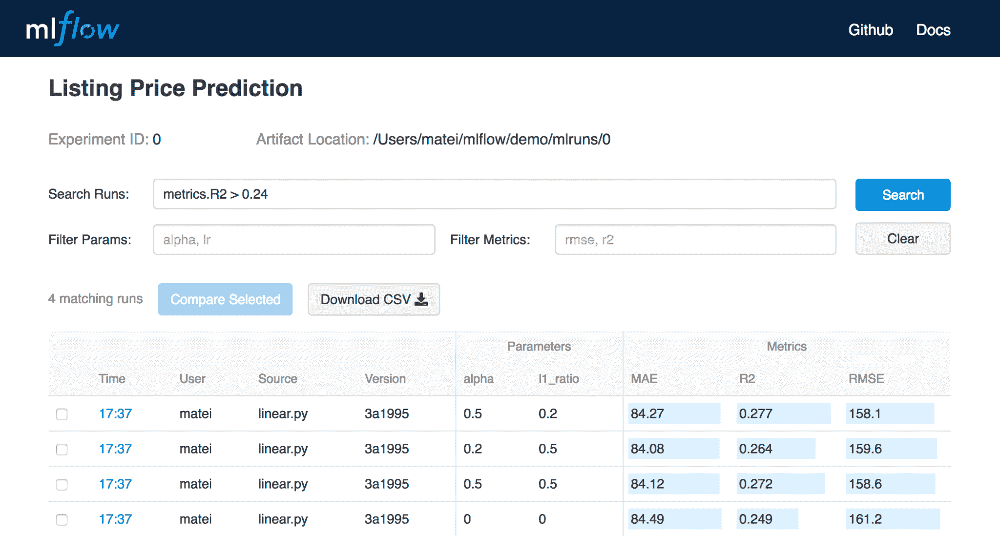
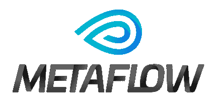
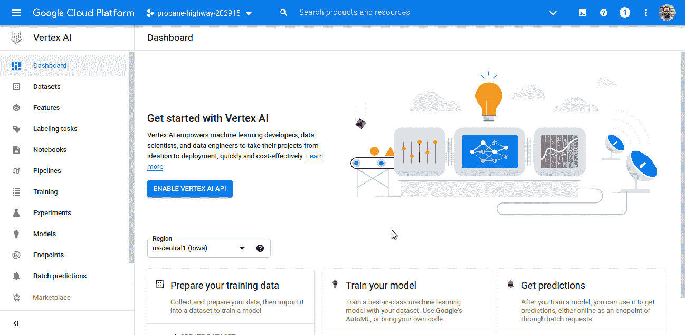
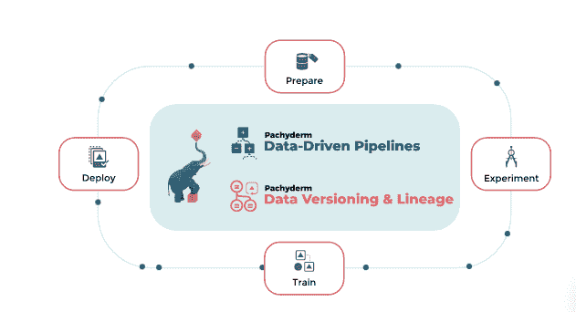
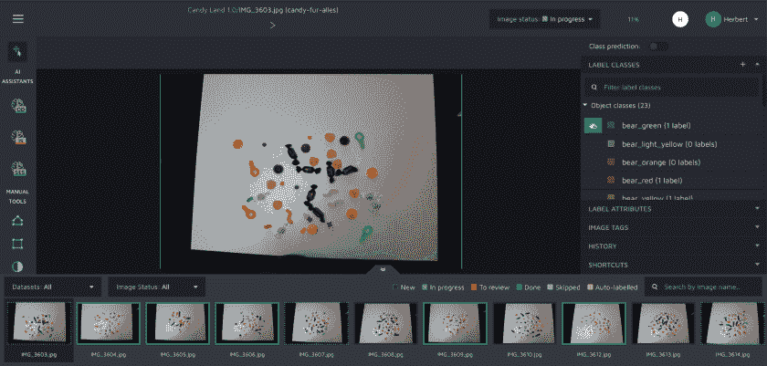
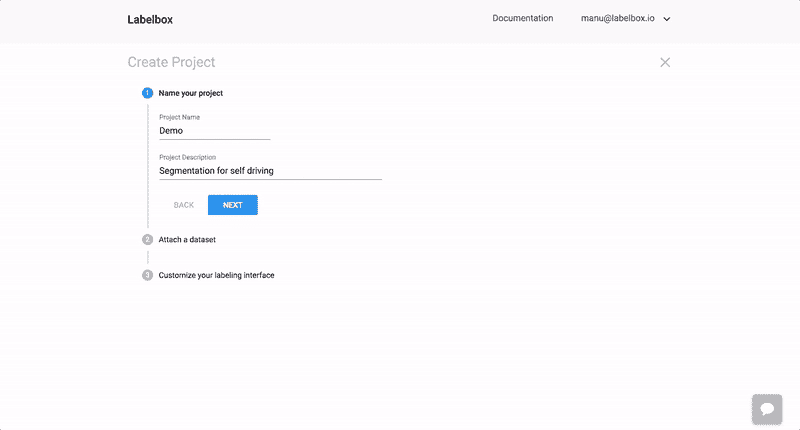

# 面向 MLOps 的 Azure ML (AML)替代方案

> 原文：<https://web.archive.org/web/https://neptune.ai/blog/azure-ml-alternatives-for-mlops>

Azure 机器学习(AML)是一种基于云的机器学习服务，面向数据科学家和 ML 工程师。您可以使用 AML 来管理机器学习生命周期——训练、开发和测试模型，还可以快速、高效、高质量地运行 [MLOps 流程](/web/20221206124501/https://neptune.ai/blog/mlops)。

*Azure Machine Learning | Source: [Azure ML](https://web.archive.org/web/20221206124501/https://azure.microsoft.com/en-us/services/machine-learning/#features)*

对于希望扩大 ML 运营规模并释放人工智能潜力的组织来说，AML 等工具非常重要。像 AML 这样的一体化解决方案简化了 MLOps 流程。创建推动业务增长的机器学习解决方案变得更加容易。

**但是，如果您不需要像 AML 这样的全面 MLOps 解决方案，该怎么办？**也许您想要构建自己的堆栈，并且需要特定的工具来完成跟踪、部署等任务，或者管理 MLOps 的其他关键部分？你很幸运——在这篇文章中，我们回顾了针对 MLOps 的 Azure 机器学习(AML)的多种替代方案。

## Azure ML 到底是做什么的？

为了找到反洗钱的替代方案，首先，我们需要准确分析反洗钱的作用:

1.  实验跟踪
2.  模型管理
3.  模型部署
4.  模型谱系
5.  模型监控
6.  数据标记

### 1.实验跟踪

[实验跟踪](/web/20221206124501/https://neptune.ai/experiment-tracking)记录您在 ML 实验中关心的每一条信息。机器学习是一个迭代的过程，所以这真的很重要。

Azure ML 为机器学习环境中的所有指标提供实验性跟踪。设置 AML 工作区以获取所需数据，可以更轻松地复制实验和比较结果。

### 2.模型管理

[机器学习中的模型管理](/web/20221206124501/https://neptune.ai/blog/machine-learning-model-management)是关于管理从模型创建到模型部署的 ML 生命周期中的每个过程。这是任何 ML 管道的基本部分。AML 用于管理机器学习项目周期中的模型。有效的模型管理使用日志条目和模型/数据版本化来创建更好的实验环境。

使用 Azure ML，您可以控制实验并增强科学家之间的协作。该工具将与您的实验相关的参数记录在一个中心位置，您可以在这里看到每个模型，并根据需要复制它。

### 3.模型部署

[模型部署](/web/20221206124501/https://neptune.ai/blog/best-8-machine-learning-model-deployment-tools)让你的模型对人们有用。机器学习操作中的模型部署通常变得复杂和具有挑战性，因为它需要计算能力和资源。在这方面，Azure ML 特别有帮助。

使用 Azure ML Studio，您可以将 ML 模型部署到云中，将它们转换成 web 服务，并对它们进行测试。此外，它有助于在将应用程序发送到云之前对其进行打包和调试，并提高部署的成功率。

### 4.模型和数据谱系

数据科学家和 ML 工程师面临的一个大问题是向他们的模型提供准确的数据。Azure ML 对于在机器学习过程中处理模型和[数据血统](/web/20221206124501/https://neptune.ai/blog/best-data-lineage-tools)很有用。Azure ML 监控模型历史并跟踪它所使用的数据的变化。

你可以看到一个模型——以及支持它的数据——在 ML 生产周期的各个阶段是如何发展的。模型和数据沿袭很重要，因为它有助于您提高生产模型所使用的数据的质量。这减少了错误预测的机会，使模型更有价值。

### 5.模型监控

高效的[模型监控](/web/20221206124501/https://neptune.ai/blog/ml-model-monitoring-best-tools)使得在模型投入生产之前发现问题变得更加容易。像 Azure ML 这样强大的 MLOps 平台可以帮助您监控数据集的漂移、历史模型性能变化、公平性和偏见以及其他关键指标。

生产团队经常面临监控模型的预测性能，因为错误可能会导致不利的经济影响、用户信任度下降和风险暴露增加。Azure Monitor 通过记录数据指标和活动记录，让职业生活变得更加轻松。这样，您可以密切跟踪您的模型，并知道它们的预测性能何时开始下降。

### 6.数据标记

[数据标记](/web/20221206124501/https://neptune.ai/blog/data-labeling-and-data-collection)是为更好的训练标记原始数据的过程。在创建、管理和监控数据标签项目时，AML 中的标签非常有用。它处理图像和文本数据。可以为图像分类、对象检测(边界框)或实例分割(多边形)设置标签。

在 Azure ML 中，你可以从 [Azure Marketplace](https://web.archive.org/web/20221206124501/https://azuremarketplace.microsoft.com/marketplace/consulting-services?page=1&search=AzureMLVend) 中选择一家厂商标签公司。你可以将你的本地数据集上传到 [Azure Storage Explorer](https://web.archive.org/web/20221206124501/https://azure.microsoft.com/features/storage-explorer/) 。

*   协调数据、标签和团队成员，有效管理标签任务。
*   跟踪进度并维护未完成的标签任务队列。
*   启动和停止项目，控制贴标进度。
*   检查标记的数据并导出为 Azure 机器学习数据集。

Azure 机器学习是一个很棒的套件，但如果你有非常具体的需求，或者不需要 Azure 提供的选项，它可能会令人不知所措。

在 Azure ML 的 [G2 人群评论](https://web.archive.org/web/20221206124501/https://www.g2.com/products/azure-machine-learning-studio/reviews#survey-response-2622257)中，用户提到:

1.  Azure ML 不符合他们特定用例的要求；它不够灵活，定制也很困难。
2.  很难用 Azure 集成数据来创建模型。
3.  相对于其他平台来说比较贵。
4.  它的执行速度相当慢。
5.  它只在网上可用，你需要强大的互联网连接才能有效地与 Azure Machine Learning Studio 合作。

因此，这里有多种可供选择的工具，你应该喜欢！

*Example of experiment tracking dashboard in Neptune | [Source](https://web.archive.org/web/20221206124501/https://app.neptune.ai/o/common/org/example-project-tensorflow-keras/e/TFKERAS-14/dashboard/summary-6f234f52-6b77-476a-9486-63037655b3be)*

Neptune 是一个 MLOps 工具，为机器学习实验提供元数据存储。除了记录 ML 元数据，Neptune 还是一个跟踪实验改进的优秀工具。它可以帮助您监控正在进行的实验，并调试它们以提高性能。更好的是，你可以与他人分享你的工作，并获得有价值的反馈，以使你的模型更好。

*Experiment tracking in MLflow | Source: [MLflow](https://web.archive.org/web/20221206124501/https://mlflow.org/)*

MLflow 是一个开源平台，用于管理机器学习工作流的各个部分，如模型构建、培训、测试和部署。它旨在标准化和统一机器学习过程。它有四个主要组件，帮助组织机器学习生命周期的不同部分。

1.  物流跟踪
2.  MLFlow 模型
3.  MLFlow 模型注册表
4.  MLFlow 项目

MLflow 跟踪可用于实验跟踪。MLflow 擅长记录参数、代码版本、度量和与每次运行相关的工件，作为一个实验跟踪工具。

*   MLflow tracking 提供可视化功能，可比较不同运行的结果。
*   它与 Java、REST API、R 和 Python 集成得很好，因此您可以轻松地记录和查询您的实验。

weight and bias(WandB)是一个平台，用于 ML 开发人员跟踪、比较、评估、版本化、可视化和共享他们的机器学习和深度学习实验。

*   它内置了与流行框架(TensorFlow、PyTorch、Keras)和工具(Kubeflow、SageMaker)的集成，可以轻松地将实验跟踪和数据版本化集成到现有项目中。
*   使用 WandB 可视化结果更容易，因为用户界面非常直观且易于导航。您可以选择在仪表板上查看您的实验数据，或者使用 WandB 公共 API 在 Python 中自动创建报告。
*   WandB 对团队来说是有益的，因为它有增强协作的特性。
*   WandB 将 ML 元数据存储在中央位置

| 工具 | 跟踪 | 记录 | 元数据存储 | 计划 |
| --- | --- | --- | --- | --- |
|  |  |  |  |  |
|  |  |  |  |  |
|  |  |  |  |  |

*实验跟踪工具对比*

*Example of artifacts dashboard in Neptune | *[*Source*](https://web.archive.org/web/20221206124501/https://app.neptune.ai/o/common/org/example-project-tensorflow-keras/e/TFKERAS-13/dashboard/artifacts-9cc55d46-8e2b-476e-8ce7-f30ff1b01549)

正如我们前面提到的，Neptune 提供了实验跟踪和版本控制，这是其模型管理框架的一部分。这意味着您可以鸟瞰您的实验，并跟踪模型在不同测试阶段的表现。

Neptune 还允许您在安全的中央存储库中记录、存储、显示、组织、比较和查询机器学习生命周期中生成的所有元数据。

*   Neptune 为您的模型提供了一个[模型注册表；](https://web.archive.org/web/20221206124501/https://docs.neptune.ai/how-to-guides/model-registry)
*   当你注册 Neptune 时，你会得到一个免费的管理服务选项，包括 100 GB 的存储空间、无限的实验、私人和公共项目
*   Neptune 的集成列表非常广泛，涵盖了大多数流行的框架。

*Model management in Metaflow | Source: [Metaflow](https://web.archive.org/web/20221206124501/https://metaflow.org/)*

Metaflow 是一个 python 友好的框架，用于创建和管理数据科学工作流和生命周期。它是由网飞开发的。Metaflow 为执行数据科学项目(从原型到生产)所需的基础架构堆栈提供了统一的 API。元流使用数据流范式，将程序建模为操作的有向图，并管理这些操作。

它配备了内置功能，如:

*   元流帮助您管理计算资源(GPU 等)
*   it 经理外部依赖关系
*   版本、重放和恢复工作流运行
*   用于检查过去运行情况的客户端 API 适用于笔记本电脑

通过阅读[元流文档](https://web.archive.org/web/20221206124501/https://docs.metaflow.org/)了解更多关于元流的信息。

Vertex AI 是新的集成谷歌云人工智能平台。这是一个统一的人工智能平台，通过预先训练和定制的工具来构建和部署模型。它可以管理你的整个机器学习生命周期。它包括可以处理 ML 开发和实验的每个部分的工具。

Vertex AI 允许你管理你的实验，模型，版本等。，通过[谷歌云控制台](https://web.archive.org/web/20221206124501/https://console.cloud.google.com/mlengine/models?_ga=2.39494628.614598155.1632414037-349661943.1626905547)。它有一个 GUI，您可以在其中访问 Vertex AI 提供的所有选项，如存储管理、日志记录、监控等。

*Model management in *Vertex AI* | Source: Author*

如果你是命令行的粉丝，Vertex AI 还提供了一个用于执行 ML 任务的命令行工具，名为 [gcloud 命令行工具](https://web.archive.org/web/20221206124501/https://cloud.google.com/sdk/gcloud/reference/ai-platform)。

Vertex AI 平台提供了一个 REST API，用于管理您在 Google Cloud 上的笔记本、工作流、数据、模型、版本和托管预测模型。

在 Vertex AI 上，你可以用笔记本电脑创建虚拟机实例，这些笔记本电脑预装了 [JupyterLab](https://web.archive.org/web/20221206124501/https://jupyterlab.readthedocs.io/en/stable/getting_started/overview.html) ，并支持 TensorFlow 和 PyTorch 框架。它还允许笔记本与 Github 集成。

Vertex AI (Google Cloud AI)提供了一组[深度学习虚拟机映像](https://web.archive.org/web/20221206124501/https://cloud.google.com/deep-learning-vm/docs)，这些映像针对机器学习和数据科学任务进行了优化。

虽然 vertex AI 平台不仅仅是模型管理，它对于个人、工具和组织来说都是一个很好的模型管理工具。

查看[谷歌云人工智能文档](https://web.archive.org/web/20221206124501/https://cloud.google.com/ai-platform/docs/technical-overview)，看看它是否有你的用例。

| 工具 | 模型注册表 | 存储管理 | 资源管理 |
| --- | --- | --- | --- |
|  |  |  |  |
|  |  |  |  |
|  |  |  |  |

*模型管理工具对比*

Streamlit 是一个开源 python 库，用于为您的 Python 数据科学项目和机器学习模型创建、管理和部署自定义 web 应用程序。

它要求您的项目位于公共 GitHub repo 上，然后您登录到 streamlit，单击 deploy app 选项，然后粘贴到 GitHub repo 中。在几分钟内，streamlit 可以将您的代码转换为 web 应用程序。

使用 Streamlit，您可以用简单的 python 代码创建应用程序的前端，它还提供了创建前端的模板。Streamlit 为您处理后端。

在 streamlit 上，开发人员可以使用 streamlit 应用程序中呈现的 Streamlit“组件”编写 JavaScript 和 HTML 来创建更多功能。它允许您从 python 脚本接收数据，也允许您向 python 脚本发送数据。Streamlit 还有一个社区制作的[组件库](https://web.archive.org/web/20221206124501/https://streamlit.io/components)，你可以找到已经制作好的组件并在你的应用中使用。Streamlit 兼容 OpenCV TensorFlow、PyTorch、Keras、matplotlib、Altair 等等。

在 [Streamlit 文档](https://web.archive.org/web/20221206124501/https://docs.streamlit.io/en/stable/getting_started.html)中了解更多关于 Streamlit 的信息。

TensorFlow Serving 是谷歌支持的平台，用于部署机器学习模型，并在现实生活环境中测试其功能。虽然 TensorFlow 内置了与 TensorFlow 模型的集成，但它也可以与其他模型一起工作。

通过 TensorFlow 服务，您可以使用相同的架构和 API 来训练和服务多个机器学习模型。这简化了您的工作流程，并消除了模型部署和迭代的痛苦。

TensorFlow 的主要优势:

*   管理模型版本和控制
*   与高达 2GB 的大型机型兼容
*   用于顶级公司和企业
*   灵活的 API 改善了与现有架构的集成

查看 [Tensorflow 服务文档](https://web.archive.org/web/20221206124501/https://github.com/tensorflow/serving)了解更多信息。

TorchServe 是一个灵活且初学者友好的工具，用于部署 PyTorch 模型。这是 Pytorch 团队和 AWS 合作的成果。

如果您正在使用 PyTorch 框架创建您的模型，那么 TorchServe 是一个极好的选择。它与 PyTorch 机器学习模型进行了开箱即用的集成，应该可以很好地与您的工作流程同步。

然而，由于 TorchServe 被设计为仅服务于 PyTorch 模型，因此在其他 ML 环境中工作的团队或研究人员可能会遇到问题。但是，随着该工具未来的更新，这种情况可能会改变。

TorchServe 中的 RESTful API 功能意味着您可以跨不同的设备部署它。此外，TorchServe 减轻了您的工作量，因为它自带默认库，可用于执行对象分类、图像分类、对象检测和图像分割等任务。

TorchServe 的主要优势:

*   模型版本控制
*   日志记录指标
*   提升可扩展性
*   简单的设置+大量对新用户有用的资源

要了解更多关于 Touchserve 的信息，请查阅 [TorchServe 文档](https://web.archive.org/web/20221206124501/https://github.com/pytorch/serve)。

| 工具 | 移动的 | 网 | 多模式服务 | 设备管理 | 模型类型 | 支持的环境 | 潜伏 |
| --- | --- | --- | --- | --- | --- | --- | --- |
|  |  |  |  |  |  |  |  |
|  |  |  |  |  |  |  |  |
|  |  |  |  |  |  | 

AWS Sagemaker，Kubernetes，亚马逊 EC2

 |  |

*模型部署工具对比*

*Model and data lineage in *Pachyderm** *| Source: [Pachyderm](https://web.archive.org/web/20221206124501/https://www.pachyderm.com/)*

Pachyderm 是一个数据平台，它将数据谱系与 Kubernetes 上的端到端管道混合在一起。它为数据科学项目和 ML 实验带来了数据版本控制的管道层。它进行数据采集、摄取、清理、管理、争论、处理、建模和分析。

点击了解更多关于厚皮动物的信息[。](https://web.archive.org/web/20221206124501/https://docs.pachyderm.com/latest/)

DVC 是一个模型和数据的开源版本控制系统。DVC 版本输入数据、配置和最初用于运行实验的代码。它实际上是每一次实验的版本。它利用了 GIT 等现有工具。

DVC 有一种内置的方式将 ML 步骤连接到 DAG 中，并端到端地运行整个管道。通过 DVC 数据管道，您可以看到模型和其他数据工件是如何构建的，这提高了可再现性。

DVC 运行在任何 Git 存储库之上，兼容任何标准的 Git 服务器或提供商(GitHub、GitLab 等)。它可以与亚马逊 S3、微软 Azure Blob 存储、谷歌驱动、谷歌云存储、阿里云 OSS、SSH/SFTP、HDFS、HTTP、网络附加存储或磁盘集成来存储数据。

DVC 处理中间结果的缓存，如果输入数据或代码是相同的，它不会再运行一个步骤。

Neptune 还跟踪、存储元数据和机器学习生命周期中创建的所有其他参数信息。Neptune 允许您在每次运行之前定义要记录的数据，并获得改进模型所需的信息。

Neptune 环境自动生成您的数据记录，并提供对数据变化的洞察。此外，它[记录模型检查点](https://web.archive.org/web/20221206124501/https://docs.neptune.ai/you-should-know/what-can-you-log-and-display#model-checkpoints)，这对于记录您的模型版本并在以后使用它们很方便。

Neptune 易于与许多第三方应用程序集成，非常适合版本控制。它还可以处理大量数据。

| 工具 | 模型版本控制 | 数据版本化 | 血统跟踪 |
| --- | --- | --- | --- |
|  |  |  |  |
|  |  |  |  |
|  |  |  |  |

*模型版本化工具对比|来源:作者*

Amazon SageMaker Model Monitor 全天候跟踪生产模型的质量。它可以通过编程来检测模型质量的变化，还可以跟踪数据质量的漂移和模型制作中的偏差。

使用 SageMaker 模型监视器，您可以早期诊断模型的问题，并实施纠正措施。这可能是从重新训练你的模型到检查其他区域的任何事情。您可以将这些检查编程为自动运行，这样可以减少遗漏关键指标的可能性。

SageMaker 模型监视器解决了模型监视中的一个问题:MM 工具编写代码的困难。您可以轻松实现模型监控流程，而无需编写任何代码。同时，Model Monitor 是完全可定制的，允许您添加定制代码来收集更详细的数据。

点击了解更多关于 SageMaker 型号显示器[的信息。](https://web.archive.org/web/20221206124501/https://docs.aws.amazon.com/sagemaker/latest/dg/model-monitor.html)

Fiddler 通过为生产中的模型提供高性能的监控来改进您的 ML 工作流。这种一体化工具集可以帮助完成以下模型监控任务:

*   跟踪和分析模型行为
*   管理模型和数据集
*   修复不准确的模型预测
*   监控机器学习模型的性能

Fiddler 用一套实用的工具来增强您的模型监控。预定的警报系统允许您检测模型质量问题并定位问题区域。您可以从一个界面组织和跟踪这些警报。

如果您想要更好地了解您的模型的行为，Fiddler 已经高度开发了将模型性能分解为基本元素的技术。这给了你更多的信息，所以你可以做更好的再培训。

借助 Fiddler 的多集成能力，您可以从几乎任何来源提取数据。也可以将它整合到您当前的框架中。

Seldon Core 是用于在 Kubernetes 中部署机器学习模型的 Seldon Deploy 平台的伴侣。Seldon Core 非常适合管理您的 ML 生产管道的各个方面，并为您的利益提供监控工具。

Seldon Core 开箱后带有一个用于监控模型性能的仪表盘，您可以轻松跟踪两个模型以获得更多见解。您可以根据需要生成度量，评估模型产品的质量，并比较模型版本。

很少核心的主要优势:

*   支持流行的 ML 库
*   检测异常值，以便更快地评估问题
*   用于分析模型预测的可用模型解释器

你可以在这里了解更多关于希罕[的信息。](https://web.archive.org/web/20221206124501/https://github.com/SeldonIO/seldon-core)

| 工具 | 仪表盘 | 形象化 | 解释者模型 |
| --- | --- | --- | --- |
| 

亚马逊 Sagemaker 型号监控

 |  |  |  |
|  |  |  |  |
|  |  |  |  |

*模型监控工具对比*

*Data labeling in Hasty | Source: [Hasty](https://web.archive.org/web/20221206124501/http://hasty.ai/)*

Hasty 是一个数据标记/注释工具，用于标记计算机视觉项目中地面真实数据集的图像和视频数据。它使用机器学习来执行注释。

使用 Hasty，用户必须手动注释或标记大约 10 幅图像，然后 Hasty 工具创建一个模型来训练这些图像，然后使用该模型(活动类)来自动注释后续图像。这使得仓促快速。

要开始使用 Hasty，请查看这里的。

*Data labeling in Labelbox | Source: [Labelbox](https://web.archive.org/web/20221206124501/http://labelbox.com/)*

Labelbox 是一个端到端的平台，用于为机器学习训练创建和管理高质量的训练数据集。它进行图像分割、图像分类和文本分类。Labelbox 提供错误检测、客户个性化、安全监控和质量保证。它涉及一个分析和自动迭代过程，用于训练和标记数据并进行预测，以及主动学习。

Labelbox 有预制的标签界面，您可以使用。它还允许您创建自己的可插拔接口，以满足您的数据标记任务的需要。

它有助于多个分布式标签工作人员的人工协作和管理，因此世界各地的团队可以在数据标签过程中进行协作，使其成为一项包容和多样化的工作。

点击了解更多关于 Labelbox [的信息。](https://web.archive.org/web/20221206124501/https://docs.labelbox.com/)

AWS SageMaker Ground Truth 为数据集提供自动数据标注。它使用主动学习模型来标记数据，并将任何无法准确标记的数据发送给数据科学家。它准确高效地进行数据标注。

SageMaker Ground Truth 为文本、图像、视频和 3D 云点添加标签。对于文本，它进行文本分类和命名实体识别。对于图像。它支持图像分类、对象检测和语义分割。对于视频，它支持视频对象检测、视频对象跟踪和视频剪辑分类。对于 3D 点云数据，它支持对象检测、对象跟踪和语义分割。

SageMaker Ground Truth 还为您提供了超过 500，000 名独立数据贴标承包商，您可以向他们发送您的贴标工作。对于机密数据或特殊技能，该工具还具有预先筛选的第三方供应商，如 iVision、CapeStart Inc .、Cogito 和 iMerit，它们可以使用特殊和机密程序执行数据标记。

查看 AWS SageMaker 地面真相文档。

| 工具 | 文本标签 | 图像标记 | 视频标注 |
| --- | --- | --- | --- |
|  |  |  |  |
|  |  |  |  |
| 

AWS Sagemaker 地面真相

 |  |  |  |

*数据标注工具对比*

结论

## Azure 机器学习仍然是扩展 MLOps 的最佳平台之一，拖放设计器选项使其对初学者友好。然而，如果您正在寻找更多的具体选项来集成到您的 ML 工作流中，有许多工具可以尝试。

实验追踪，Neptune.ai，Mlflow，WandB 都会很好的为你服务。它们都具有协作兼容性。如果你想部署一个简单的数据/ML 应用程序，Streamlit 是一个很好的选择，如果你已经使用 TensorFlow 或 PyTorch，那么 Tensorflow Serving、TorchServe 将是更好的工具。

对于模型管理，Vertex AI、Neptune.ai 和 Metaflow 是管理机器学习工作流的非常好的工具。对于数据标注 AWS Sagemaker Ground Truth，Hasty 和 Labelbox 对于希望扩展其数据标注流程的团队来说是不错的选择。

您可以查看 [MLOps Tools Landscape](https://web.archive.org/web/20221206124501/https://mlops.neptune.ai/) 以了解各种工具及其特定用例，本文中提到的任何工具都可以使用。

快乐实验！

参考

### [https://azure . Microsoft . com/en-us/services/machine-learning/#功能](https://web.archive.org/web/20221206124501/https://azure.microsoft.com/en-us/services/machine-learning/#features)

1.  [https://neptune.ai](https://web.archive.org/web/20221206124501/https://neptune.ai/)
2.  [https://docs.streamlit.io/en/stable/getting_started.html](https://web.archive.org/web/20221206124501/https://docs.streamlit.io/en/stable/getting_started.html)
3.  [https://metaflow.org/](https://web.archive.org/web/20221206124501/https://metaflow.org/)
4.  [https://www.tensorflow.org/tfx/guide/serving](https://web.archive.org/web/20221206124501/https://www.tensorflow.org/tfx/guide/serving)
5.  [https://github.com/pytorch/serve](https://web.archive.org/web/20221206124501/https://github.com/pytorch/serve)
6.  [https://www.pachyderm.com/](https://web.archive.org/web/20221206124501/https://www.pachyderm.com/)
7.  [https://docs . AWS . Amazon . com/sage maker/latest/DG/model-monitor . html](https://web.archive.org/web/20221206124501/https://docs.aws.amazon.com/sagemaker/latest/dg/model-monitor.html)
8.  [https://github.com/SeldonIO/seldon-core](https://web.archive.org/web/20221206124501/https://github.com/SeldonIO/seldon-core)
9.  [http://fiddler.ai](https://web.archive.org/web/20221206124501/http://fiddler.ai/)
10.  [https://github.com/Labelbox/labelbox](https://web.archive.org/web/20221206124501/https://github.com/Labelbox/labelbox)
11.  [https://aws.amazon.com/sagemaker/groundtruth/](https://web.archive.org/web/20221206124501/https://aws.amazon.com/sagemaker/groundtruth/)
12.  [https://aws.amazon.com/sagemaker/groundtruth/](https://web.archive.org/web/20221206124501/https://aws.amazon.com/sagemaker/groundtruth/)