# 神经网络反向传播算法综合指南

> 原文：<https://web.archive.org/web/https://neptune.ai/blog/backpropagation-algorithm-in-neural-networks-guide>

本文是对反向传播算法的全面指导，反向传播算法是用于训练人工神经网络的最广泛使用的算法。我们将从在训练神经网络的过程中定义正向和反向传递开始，然后我们将集中讨论反向传播在反向传递中是如何工作的。我们将研究反向传播算法的详细数学计算。

此外，我们将基于这个 [GitHub 项目](https://web.archive.org/web/20230103154737/https://github.com/ahmedfgad/IntroDLPython)讨论如何使用 NumPy 从零开始用 Python 实现一个反向传播神经网络。该项目建立了一个通用的反向传播神经网络，可以与任何架构。

让我们开始吧。

## 神经网络体系结构快速概述

在最简单的情况下，神经网络的架构由一些连续的层组成，其中编号为 *i* 的层连接到编号为 *i+1* 的层。这些层可以分为 3 类:

1.  投入
2.  隐藏的
3.  输出

下图显示了全连接人工神经网络(FCANN)的示例，这是演示反向传播算法如何工作的最简单的网络类型。该网络有一个输入层、两个隐藏层和一个输出层。在图中，网络体系结构是水平显示的，每一层都是从左到右垂直显示的。

每层由一个或多个用圆圈表示的神经元组成。因为网络类型是全连接的，那么层 *i* 中的每个神经元都与层 *i+1* 中的所有神经元相连。如果 2 个后续层具有 *X* 和 *Y* 神经元，则中间连接的数量为 *X*Y* 。

对于每个连接，都有一个相关的权重。权重是一个浮点数，用于衡量两个神经元之间连接的重要性。权重越高，联系越重要。权重是网络进行预测的可学习参数。如果权重是好的，那么网络做出准确的预测，误差更小。否则，应该更新权重以减小误差。

假设在层 *1* 的一个神经元 N [1] 连接到在层 *2* 的另一个神经元 N [2] 。还假设 N [2] 的值是根据下一个线性方程计算的。

*N[2]= w[1]N[1]+b*

如果 N [1] =4，w [1] =0.5(权重)，b=1(偏差)，那么 N [2] 的值就是 3。

*N [2] =0.54+1=2+1=3*

这就是单个重量如何将两个神经元连接在一起。请注意，输入层根本没有可学习的参数。

层 *i+1* 的每一个神经元对于层 *i* 的每一个连接的神经元都有一个权重，但是它只有一个单一的偏向。因此，如果层 *i* 具有 10 个神经元，层 *i+1* 具有 6 个神经元，则层 *i+1* 的参数总数为:

*权重数+偏差数=10×6 +6=66*

输入层是网络中的第一层，它由网络的输入直接连接。网络中只能有一个输入层。例如，如果输入是一个学期的学生成绩，那么这些成绩将连接到输入图层。在我们的图中，输入层有 10 个神经元(例如，10 门课程的分数——一个英雄学生上了 10 门课程/学期)。

输出层是返回网络预测输出的最后一层。和输入层一样，只能有一个输出层。如果网络的目标是预测下学期的学生成绩，那么输出层应该返回一个分数。下图中的架构有一个返回下一学期预测分数的神经元。

在输入层和输出层之间，可能有 0 个或更多隐藏层。在本例中，有两个隐藏层，分别包含 6 个和 4 个神经元。请注意，最后一个隐藏层连接到输出层。

通常，隐藏层中的每个神经元使用类似 sigmoid 或整流线性单元(ReLU)的激活函数。这有助于捕捉输入和输出之间的非线性关系。输出层中的神经元也使用类似 sigmoid(用于回归)或 SoftMax(用于分类)的激活函数。

构建好网络架构后，就该开始用数据训练它了。

## 神经网络中的正向和反向传递

为了训练神经网络，有两个阶段:

1.  向前
2.  向后的

在前向传递中，我们从将数据输入传播到输入层开始，经过隐藏层，从输出层测量网络的预测，最后根据网络做出的预测计算网络误差。

该网络误差衡量网络距离做出正确预测还有多远。例如，如果正确的输出是 4，网络的预测是 1.3，那么网络的绝对误差是 4-1.3=2.7。注意，将输入从输入层传播到输出层的过程称为**正向传播**。计算出网络误差后，前向传播阶段结束，后向传递开始。

下图显示了一个指向向前传播方向的红色箭头。

在反向传递中，流程是反向的，因此我们从将误差传播到输出层开始，直到通过隐藏层到达输入层。将网络误差从输出层传播到输入层的过程称为**反向传播**，或简单的**反向传播**。反向传播算法是用来更新网络权重以减少网络误差的一组步骤。

在下图中，蓝色箭头指向向后传播的方向。

向前和向后的阶段从一些时期开始重复。在每个时期，会发生以下情况:

1.  输入从输入层传播到输出层。
2.  计算网络误差。
3.  误差从输出层传播到输入层。

我们将关注**反向传播阶段**。让我们讨论一下使用反向传播算法的优点。

## 为什么使用反向传播算法？

前面我们讨论过，网络是用两个通道训练的:向前和向后。在正向传递结束时，计算网络误差，该误差应尽可能小。

如果当前误差较高，则网络没有从数据中正确学习。这是什么意思？这意味着当前的权重集不够精确，不足以减少网络误差并做出准确的预测。因此，我们应该更新网络权重以减少网络误差。

反向传播算法是负责以减少网络误差为目标更新网络权重的算法之一。挺重要的。

以下是反向传播算法的一些优点:

*   在计算导数时，它是内存高效的，因为与其他优化算法相比，它使用更少的内存，如遗传算法。这是一个非常重要的特性，尤其是对于大型网络。
*   反向传播算法速度很快，尤其适用于中小型网络。随着更多层和神经元的加入，随着更多导数的计算，它开始变得更慢。
*   这种算法足够通用，可用于不同的网络架构，如卷积神经网络、生成对抗网络、全连接网络等。
*   没有参数来调整反向传播算法，因此开销较少。该过程中唯一的参数与梯度下降算法有关，如学习速率。

接下来，让我们基于一个数学示例来看看反向传播算法是如何工作的。

## 反向传播算法如何工作

基于一个简单的网络可以很好地解释该算法的工作原理，如下图所示。它只有一个有 2 个输入的输入层(X [1] 和 X [2] )和一个有 1 个输出的输出层。没有隐藏层。

输入的权重分别为 W [1] 和 W [2] 。偏差被视为输出神经元的新输入神经元，其具有固定值+1 和权重 b。权重和偏差都可以被称为**参数**。

假设输出层使用由以下等式定义的 sigmoid 激活函数:

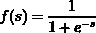

其中 s 是每个输入与其相应重量之间的乘积之和(SOP ):

*s = X[1]* W[1]+X[2]* W[2]+b*

为了简单起见，本例中只使用了一个训练样本。下表显示了具有输入的单个训练样本及其对应的样本的期望(即正确)输出。在实践中，使用了更多的训练实例。

假设权重和偏差的初始值如下表所示。

为简单起见，所有输入、权重和偏差的值都将添加到网络图中。

现在，让我们训练网络，看看网络将如何根据当前参数预测样本的输出。

正如我们之前讨论的，培训过程有两个阶段，向前和向后。

### 前进传球

激活函数的输入将是每个输入与其权重之间的 SOP。然后将 SOP 加到偏置上，返回神经元的输出:

*s = X[1]* W[1]+X[2]* W[2]+b*

*s=0.1* 0.5+ 0.3*0.2+1.83*

*s=1.94*

然后将值 1.94 应用于激活函数(sigmoid)，得到值 0.874352143。

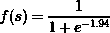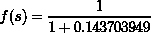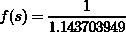

来自输出神经元的激活函数的输出反映了样本的预测输出。很明显，期望的输出和期望的输出之间存在差异。但是为什么呢？我们如何使预测输出更接近期望输出？我们稍后会回答这些问题。现在，让我们看看基于误差函数的网络误差。

误差函数表明预测输出与期望输出有多接近。误差的最佳值是**零**，这意味着根本没有误差，期望的和预测的结果是相同的。误差函数之一是**平方误差函数**，如下式定义:

注意，值 12 乘以等式是为了使用反向传播算法简化导数计算。

基于误差函数，我们可以如下测量网络的误差:

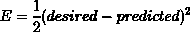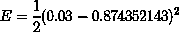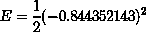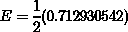

结果显示有误差，而且误差很大:( **~0.357** )。这个误差只是给了我们一个指示，告诉我们预测的结果离期望的结果有多远。

知道有错误，我们该怎么办？我们应该把它最小化。为了最小化网络错误，我们必须改变网络中的某些东西。请记住，我们唯一可以改变的参数是权重和偏差。我们可以尝试不同的权重和偏差，然后测试我们的网络。

我们计算误差，然后正向传递结束，应该开始**反向传递**计算导数，更新参数。

为了实际感受反向传播算法的重要性，让我们尝试不使用该算法直接更新参数。

### 参数更新方程

可以根据下式改变参数:

*W[(n+1)]= W(n)+η[d(n)-Y(n)]X(n)*

其中:

*   n:训练步骤(0，1，2，…)。
*   W(n):当前训练步骤中的参数。Wn=[bn，W1(n)，W2(n)，W3(n)，…，Wm(n)]
*   *η* :学习率，取值在 0.0 到 1.0 之间。
*   d(n):期望输出。
*   Y(n):预测产量。
*   X(n):网络做出错误预测的当前输入。

对于我们的网络，这些参数具有以下值:

*   n: 0
*   女(男):[1.83，0.5，0.2]
*   *η* :因为是超参数，那么我们可以选择 0.01 为例。
*   d(n): [0.03]。
*   Y(n): [0.874352143]。
*   X(n): [+1，0.1，0.3]。第一个值(+1)是偏差。

我们可以如下更新我们的网络参数:

*W[(n+1)]= W(n)+η[d(n)-Y(n)]X(n)*

*=[1.83，0.5，0.2]+0.01[0.03-0.874352143][+1，0.1，0.3]*

*=[1.83，0.5，0.2]+0.01[-0.844352143][+1，0.1，0.3]*

*=[1.83，0.5，0.2]+-0.00844352143[+1，0.1，0.3]*

*=[1.83，0.5，0.2]+[-0.008443521，-0.000844352，-0.002533056]*

*=【1.821556479，0.499155648，0.197466943】*

下表列出了新参数:

根据新的参数，我们将重新计算预测的产量。新的预测输出用于计算新的网络误差。根据计算的误差更新网络参数。该过程继续更新参数并重新计算预测输出，直到它达到误差的可接受值。

这里，我们成功地更新了参数，而没有使用反向传播算法。我们还需要那个算法吗？是的。你会明白为什么。

参数更新方程仅仅依赖于学习率来更新参数。它以与错误相反的方向改变所有参数。

但是，使用反向传播算法，我们可以知道每个权重如何与误差相关。这告诉我们每个权重对预测误差的影响。也就是我们增加哪些参数，减少哪些参数才能得到最小的预测误差？

例如，反向传播算法可以告诉我们有用的信息，比如将 W1 的当前值增加 1.0 会使网络误差增加 0.07。这表明 W1 值越小，误差越小。

### 偏导数

向后传递中使用的一个重要操作是计算导数。在开始计算反向传递中的导数之前，我们可以从一个简单的例子开始，让事情变得简单一些。

对于一个多元函数，比如 Y=X2Z+H，给定变量 X 的变化对输出 Y 有什么影响？我们可以使用**偏导数**来回答这个问题，如下所示:

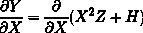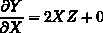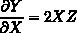

注意，除了 X 之外的一切都被视为常数。因此，在计算偏导数之后，H 被替换为 0。在这里，∂X 意味着变量 x 的微小变化，同样，∂Y 意味着 y 的微小变化，y 的变化是改变 x 的结果，通过对 x 做一个非常微小的改变，对 y 有什么影响？

微小的变化可以是微小值的增加或减少。通过代入 X 的不同值，我们可以发现 y 相对于 X 是如何变化的。

可以遵循相同的过程来学习 NN 预测误差如何随网络权重的变化而变化。因此，我们的目标是计算∂E/W [1] 和∂E/W [2] ，因为我们只有两个权重 W [1] 和 W [2] 。我们来计算一下。

### 预测误差对 R.T 参数的导数

看看这个方程，Y=X ² Z+H，计算偏导数∂Y/∂X 似乎很简单，因为有一个方程将 y 和 x 联系起来。在我们的例子中，没有直接方程同时存在预测误差和权重。所以，我们要用**多元链式法则**来求 Y W r t x 的偏导数

#### 参数链预测误差

让我们试着找出预测误差和权重之间的联系。预测误差根据以下等式计算:


这个方程没有任何参数。没问题，我们可以考察前面方程的每一项(**期望** & **预测**)是如何计算的，用它的方程代入，直到达到参数。

前一个等式中的**所需的**项是一个常数，因此没有机会通过它获得参数。**预测的**项是基于 sigmoid 函数计算的，如下式所示:


同样，用于计算预测输出的等式没有任何参数。但是仍然有变量 s (SOP ),它已经依赖于用于其计算的参数，根据这个等式:

*s = X[1]* W[1]+X[2]* W[2]+b*

一旦我们得出了一个有参数(权重和偏差)的方程，我们就到达了衍生链的末端。下图显示了计算误差对参数的导数所遵循的导数链。

注意 s W.R.T 偏差 b 的导数(∂[s]/w1】**为 0，可以省略。正如我们之前所做的那样，可以使用学习率简单地更新偏差。这留给我们计算 2 个权重的导数。**

 **根据上图，要知道预测误差如何随参数的变化而变化，我们应该找到以下中间导数:

1.  预测输出的网络误差。
2.  SOP 下的预测产量。
3.  SOP W.R.T 三个参数中的每一个。

总共有四个中间偏导数:

*∂E/∂Predicted **，**∂predicted/∂[s]t5】，∂[s]/w[1]t11】和∂[s]/w[2]t17】*

要计算误差对重量的导数，只需将误差链中的所有导数与每个重量相乘，如下 2 个等式所示:

*∂e/w[1]=∂e/∂predicted*∂predicted/∂[s]*∂[s]/w[1]*

*∂ew[2]=∂e/∂predicted* ∂predicted/∂s*∂[s]/w[2]*

**重要提示:**我们使用导数链解决方案，因为没有将误差和参数联系在一起的直接方程。但是，我们可以创建一个将它们联系起来的方程，并对其直接应用偏导数:

*E = 1/2(desired-1/(1+E^(-(X1 * W1+X2 * W2+b)))²*

因为这个方程直接计算误差对参数的导数似乎很复杂，所以为了简单起见，最好使用多元链规则。

#### 用替换法计算偏导数值

让我们计算我们创建的链的每个部分的偏导数。

对于误差对预测输出的导数:

*∂e/∂predicted=∂/∂predicted(1/2(desired-predicted)²)*

*=2*1/2(期望-预测) ^(2-1) *(0-1)*

*=(期望-预测)*(-1)*

*=预测-期望*

通过替换以下值:

*∂e/∂predicted=predicted-desired=0.874352143-0.03*

*∂e/∂predicted=0.844352143*

对于预测输出相对于 SOP 的导数:

*[s][s](1/(1+e^(【s】))*

记住:商法则可用于计算 sigmoid 函数的导数，如下所示:

*∂predicted/∂s=1/(1+e^(-s))(1-1/(1+e^(-s))*

通过替换以下值:

*∂predicted/∂s=1/(1+e^(-s))(1-1/(1+e^(-s))*=*1/(1+e^(-1.94))(1-1/(1+e^(-1.94))*

*= 1/(1+0.143703949)(1-1/(1+0.143703949))*

*= 1/1.143703949(1-1/1.143703949)*

*= 0.874352143(1-0.874352143)*

*= 0.874352143(0.125647857)*

*∂predicted/∂s=0.109860473*

对于 SOP W.R.T W1 的衍生产品:

*[【s】]/w[【1】]=/*

 **= 1 * X[1]*(W[1])^((1-1))+0+0*

*= X[1]*(W[1])【T5(0)*

*=X [1] (1)*

*∂[s]/w[1]= x[1]*

通过替换以下值:

∂ [s] /W1=X [1] =0.1

对于 SOP W.R.T W2 的衍生产品:

*[【s】]/w[【2】]=/*

 **= 0+1 * X[2]*(W[2])^((1-1))+0*

*= X[2]*(W[2])【T5(0)*

*= X[2]①*

*∂[s]/w[2]= x[2]*

通过替换以下值:

*∂[s]/w[2]= x[2]= 0.3*

在计算了所有链中的各个导数之后，我们可以将它们全部相乘，以计算所需的导数(即误差相对于每个重量的导数)。

对于误差 W.R.T W1 的导数:

*∂e/w[1]= 0.844352143 * 0.109860473 * 0.1*

*∂e/w[1]= 0.009276093*

对于误差 W.R.T W2 的导数:

*∂e/w[2]= 0.844352143 * 0.109860473 * 0.3*

*∂e/w[2]= 0.027828278*

最后，有两个值反映预测误差相对于权重如何变化:

*0.009276093 为 W[1]*

*0.027828278 为 W[2]*

这些值意味着什么？这些结果需要解释。

### 解释反向传播的结果

从最后两个导数中可以得出两个有用的结论。这些结论是基于以下几点得出的:

1.  导数符号
2.  导数大小

如果导数符号是正的，这意味着增加权重会增加误差。换句话说，减少权重会减少误差。

如果导数符号**为负**，增加权重会减小误差。换句话说，如果它是负的，那么减少权重会增加误差。

但是误差增加或减少了多少呢？导数的大小回答了这个问题。

对于正导数，权重增加 p 会使误差增加 DM*p，对于负导数，权重增加 p 会使误差减少 DM*p。

让我们将此应用到我们的示例中:

*   因为∂E/W [1] 导数的结果是正的，这意味着如果 W1 增加 1，那么总误差增加 0.009276093。
*   因为∂E/W [2] 导数的结果是正的，这意味着如果 W2 增加 1，那么总误差增加 0.027828278。

现在让我们根据计算出的导数来更新权重。

### 更新权重

在成功地计算出误差相对于每个单独权重的导数之后，我们可以更新权重来改进预测。每个权重基于其导数进行更新:

对于 W [1] :

*w[1 新]= w[1]-η*∂e/w[1]*

*=0.5-0.01*0.009276093*

*W[1 新的] =0.49990723907*

对于 W [2] :

*w[2 新]= w[2]-η*∂e/w[2]*

*=0.2-0.01*0.027828278*

*W[2 新] = 0.1997217172*

请注意，导数是从重量的旧值中减去(而不是加上)的，因为导数是正的。

权重的新值为:

*   *W [1] =0.49990723907*
*   *W [2] = 0.1997217172*

除了先前计算的偏差(1.821556479)之外，这两个权重被用于新的前向传递以计算误差。预计新误差将小于当前误差(0.356465271)。

以下是新的正向传递计算:

*s = X[1]* W[1]+X[2]* W[2]+b*

*s = 0.1 * 0.49990723907+0.3 * 0.1997217172+1.821556479*

*s=1.931463718067*

*f(s)=1/(1+e ^(-s) )*

*f(s)= 1/(1+e^(-1.931463718067))*

*f(s)=0.873411342830056*

*E = 1/2(0.03-0.873411342830056)²*

E=0.35567134660719907

当比较新误差(0.35567134660719907)和旧误差(0.356465271)时，减少了 0.0007939243928009043。只要有减少，我们就在朝着正确的方向前进。

误差减少很小，因为我们使用了一个小的学习率(0.01)。要了解学习率如何影响训练神经网络的过程，[请阅读本文](https://web.archive.org/web/20230103154737/https://www.linkedin.com/pulse/learning-rate-useful-artificial-neural-networks-ahmed-gad)。

应该重复向前和向后传递，直到误差为 0 或经过多个时期(即迭代)。这标志着示例的结束。

下一节讨论如何实现本节讨论的例子的反向传播。

## Python 中的编码反向传播

对于上一节讨论的例子，实现反向传播算法非常容易。在本节中，我们将使用 GitHub 项目从头开始构建一个具有 2 个输入和 1 个输出的网络。

下一个代码使用 NumPy 来准备输入(x1=0.1 和 x2=0.4)，值为 **0.7** 的输出，值为 **0.01** 的学习速率，并为两个权重 w1 和 w2 分配初始值。最后，创建两个空列表来保存每个时期的网络预测和误差。

```py
import numpy
x1=0.1
x2=0.4

target = 0.7
learning_rate = 0.01

w1=numpy.random.rand()
w2=numpy.random.rand()

print("Initial W : ", w1, w2)

predicted_output = []
network_error = []
```

接下来的代码构建了一些函数来帮助我们进行计算:

*   Sigmoid():应用 sigmoid 激活函数。
*   error():返回平方误差。
*   error_predicted_deriv():返回误差对预测输出的导数。
*   sigmoid_sop_deriv():返回 sigmoid 函数相对于 sop 的导数。
*   sop_w_deriv():返回单个权重的 SOP W.R.T 的导数。

update_w():更新单个权重。

```py
import numpy

def sigmoid(sop):
    return 1.0/(1+numpy.exp(-1*sop))

def error(predicted, target):
    return numpy.power(predicted-target, 2)

def error_predicted_deriv(predicted, target):
    return 2*(predicted-target)

def sigmoid_sop_deriv(sop):
    return sigmoid(sop)*(1.0-sigmoid(sop))

def sop_w_deriv(x):
    return x

def update_w(w, grad, learning_rate):
    return w - learning_rate*grad
```

现在，根据下一个代码，使用“for”循环，我们准备对多个时期进行向前和向后传递计算。循环经过 80，000 个纪元。

```py
for k in range(80000):

    y = w1*x1 + w2*x2
    predicted = sigmoid(y)
    err = error(predicted, target)

    predicted_output.append(predicted)
    network_error.append(err)

    g1 = error_predicted_deriv(predicted, target)

    g2 = sigmoid_sop_deriv(y)

    g3w1 = sop_w_deriv(x1)
    g3w2 = sop_w_deriv(x2)

    gradw1 = g3w1*g2*g1
    gradw2 = g3w2*g2*g1

    w1 = update_w(w1, gradw1, learning_rate)
    w2 = update_w(w2, gradw2, learning_rate)
```

在正向传递中，执行以下代码行来计算 SOP，应用 sigmoid 激活函数来获得预测输出，并计算误差。这将分别在 predicted_output 和 network_error 列表中追加当前网络预测和误差。

```py
    y = w1*x1 + w2*x2
    predicted = sigmoid(y)
    err = error(predicted, target)

    predicted_output.append(predicted)
    network_error.append(err)

```

在向后传递中，执行“for”循环中的剩余行来计算所有链中的导数。误差 W.R.T 对权重的导数保存在变量 gradw1 和 gradw2 中。最后，通过调用 update_w()函数来更新权重。

```py
    g1 = error_predicted_deriv(predicted, target)

    g2 = sigmoid_sop_deriv(y)

    g3w1 = sop_w_deriv(x1)
    g3w2 = sop_w_deriv(x2)

    gradw1 = g3w1*g2*g1
    gradw2 = g3w2*g2*g1

    w1 = update_w(w1, gradw1, learning_rate)
    w2 = update_w(w2, gradw2, learning_rate)
```

完整的代码如下。它在每个时期后打印预测的输出。此外，它使用 matplotlib 库创建 2 个图，显示预测输出和误差如何随时间演变。

```py
import numpy
import matplotlib.pyplot

def sigmoid(sop):
    return 1.0/(1+numpy.exp(-1*sop))

def error(predicted, target):
    return numpy.power(predicted-target, 2)

def error_predicted_deriv(predicted, target):
    return 2*(predicted-target)

def sigmoid_sop_deriv(sop):
    return sigmoid(sop)*(1.0-sigmoid(sop))

def sop_w_deriv(x):
    return x

def update_w(w, grad, learning_rate):
    return w - learning_rate*grad

x1=0.1
x2=0.4

target = 0.7
learning_rate = 0.01

w1=numpy.random.rand()
w2=numpy.random.rand()

print("Initial W : ", w1, w2)

predicted_output = []
network_error = []

old_err = 0
for k in range(80000):

    y = w1*x1 + w2*x2
    predicted = sigmoid(y)
    err = error(predicted, target)

    predicted_output.append(predicted)
    network_error.append(err)

    g1 = error_predicted_deriv(predicted, target)

    g2 = sigmoid_sop_deriv(y)

    g3w1 = sop_w_deriv(x1)
    g3w2 = sop_w_deriv(x2)

    gradw1 = g3w1*g2*g1
    gradw2 = g3w2*g2*g1

    w1 = update_w(w1, gradw1, learning_rate)
    w2 = update_w(w2, gradw2, learning_rate)

    print(predicted)

matplotlib.pyplot.figure()
matplotlib.pyplot.plot(network_error)
matplotlib.pyplot.title("Iteration Number vs Error")
matplotlib.pyplot.xlabel("Iteration Number")
matplotlib.pyplot.ylabel("Error")

matplotlib.pyplot.figure()
matplotlib.pyplot.plot(predicted_output)
matplotlib.pyplot.title("Iteration Number vs Prediction")
matplotlib.pyplot.xlabel("Iteration Number")
matplotlib.pyplot.ylabel("Prediction")

```

在下图中，绘制了 80，000 个历元的误差。请注意误差如何在值 3.150953682878443e-13 处饱和，该值非常接近 0.0。

下图显示了预测的输出是如何随着迭代而变化的。请记住，在我们的示例中，正确的输出值设置为 0.7。输出饱和值为 0.6999994386664375，非常接近 0.7。

GitHub 项目也给出了一个更简单的接口来构建 [Ch09 目录](https://web.archive.org/web/20230103154737/https://github.com/ahmedfgad/IntroDLPython/tree/master/Ch09)中的网络。有一个例子，建立一个有 3 个输入和 1 个输出的网络。在代码的最后，调用函数 **predict()** 来要求网络预测一个新样本[0.2，3.1，1.7]的输出。

```py
import MLP
import numpy

x = numpy.array([0.1, 0.4, 4.1])
y = numpy.array([0.2])

network_architecture = [7, 5, 4]

trained_ann = MLP.MLP.train(x=x,
                            y=y,
                            net_arch=network_architecture,
                            max_iter=500,
                            learning_rate=0.7,
                            debug=True)

print("Derivative Chains : ", trained_ann["derivative_chain"])
print("Training Time : ", trained_ann["training_time_sec"])
print("Number of Training Iterations : ", trained_ann["elapsed_iter"])

predicted_output = MLP.MLP.predict(trained_ann, numpy.array([0.2, 3.1, 1.7]))
print("Predicted Output : ", predicted_output) 
```

这段代码使用了一个名为 [MLP](https://web.archive.org/web/20230103154737/https://github.com/ahmedfgad/IntroDLPython/blob/master/Ch09/MLP.py) 的模块，这是一个构建反向传播算法的脚本，同时为用户提供了一个简单的界面来构建、训练和测试网络。关于如何构建这个脚本的细节，请参考[这本书](https://web.archive.org/web/20230103154737/https://www.elsevier.com/books/introduction-to-deep-learning-and-neural-networks-with-python/gad/978-0-323-90933-4)。

## 反向传播的类型

反向传播算法有两种主要类型:

1.  **传统的反向传播**一直用于固定输入和固定输出的静态问题，比如预测图像的类别。在这种情况下，输入图像和输出类永远不会改变。
2.  **时间反向传播(BPTT)** 针对随时间变化的非静态问题。它应用于时间序列模型，如递归神经网络(RNN)。

## 反向传播算法的缺点

即使反向传播算法是训练神经网络最广泛使用的算法，它也有一些缺点:

*   应该仔细设计网络，以避免[消失和爆炸梯度](/web/20230103154737/https://neptune.ai/blog/vanishing-and-exploding-gradients-debugging-monitoring-fixing)影响网络的学习方式。例如，从 sigmoid 激活函数计算出的梯度可能非常小，接近于零，这使得网络不能更新其权重。结果，没有学习发生。
*   反向传播算法平等地考虑网络中的所有神经元，并为每次反向传递计算它们的导数。即使使用了丢弃层，也要计算丢弃的神经元的导数，然后丢弃。
*   反向传播依赖于无限效应(偏导数)来执行信用分配。当人们考虑更深和更非线性的函数时，这可能成为一个严重的问题。
*   它期望误差函数是凸的。对于非凸函数，反向传播可能会陷入局部最优解。
*   误差函数和激活函数必须是可微的，以便反向传播算法能够工作。它不适用于不可微函数。
*   在正向传递中，层 *i+1* 必须等待层 *i* 的计算完成。在向后通道中，层 *i* 必须等待层 *i+1* 完成。这使得网络的所有层都被锁定，等待网络的其余层向前执行并向后传播错误，然后它们才能被更新。

## 传统反向传播的替代方案

传统的反向传播有多种替代方法。以下是四种选择。

李东贤等人的“差异目标传播”*关于数据库中机器学习和知识发现的欧洲联合会议*。施普林格，查姆，2015。，主要思想是在每一层计算目标而不是梯度。像渐变一样，它们是向后传播的。目标传播依赖于每层的自动编码器。与反向传播不同，即使当单元交换随机比特而不是实数时，它也可以被应用。

马、万多·库尔特、J. P .刘易斯和 w .巴斯蒂亚安·克莱因。" hsic 瓶颈:没有反向传播的深度学习."AAAI 人工智能会议记录。第 34 卷。04 号。2020.，他们提出了 HSIC (Hilbert-Schmidt 独立性准则)瓶颈，用于训练深度神经网络。HSIC 瓶颈是传统反向传播的替代方案，具有许多明显的优点。该方法有助于并行处理，并且需要的操作明显较少。它不会遭受爆炸或消失梯度。这在生物学上比反向传播更合理，因为不需要对称反馈。

在 Choromanska，Anna 等人的《超越反向投影:带辅助变量的在线交替最小化》中*机器学习国际会议*。PMLR，2019。，他们提出了一种用于训练深度神经网络的在线(随机/小批量)交替最小化(AM)方法。

贾德伯格、马克斯等人的“使用合成梯度的去耦神经接口”*机器学习国际会议*。PMLR，2017。，他们通过解耦模块(即层)打破了锁定层的约束，引入了网络图未来计算的模型。这些模型仅使用局部信息来预测建模的子图将产生什么结果。结果，子图可以独立地和异步地更新。

## 结论

希望现在你明白了为什么反向传播是训练人工神经网络最流行的算法。它相当强大，其内部工作方式令人着迷。感谢阅读！****