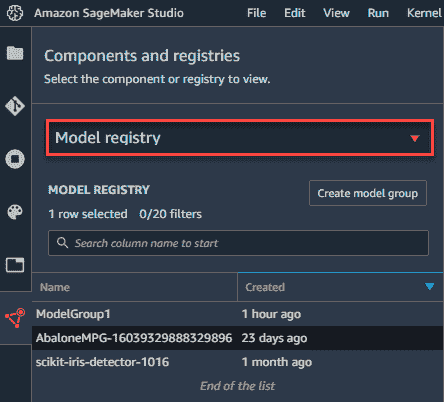
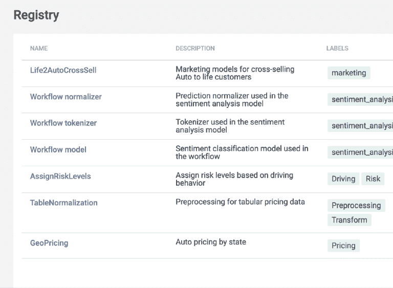

# MLflow 模型注册的最佳替代方案

> 原文：<https://web.archive.org/web/https://neptune.ai/blog/best-alternatives-to-mlflow-model-registry>

MLflow 模型注册是 MLflow 平台的四个组件之一。其他三个组件是跟踪、项目和模型。它们的设计方式使得每个组件都可以单独使用，但它们也可以很好地协同工作。

MLflow 模型注册组件是一个集中式模型存储、一组 API 和 UI，用于协作管理 MLflow 模型的整个生命周期。它提供模型沿袭(MLflow 实验和运行产生了模型)、模型版本化、阶段转换(例如从阶段转换到生产)和注释。”–[ml 流程文件](https://web.archive.org/web/20221206011911/https://www.mlflow.org/docs/latest/model-registry.html)

MLflow Model Registry 的目标，就像任何机器学习模型注册工具一样，是为了让 ML 团队在需要的任何时候都能轻松找到所有与模型相关的元数据。以一种间接的方式，模型注册促进了将模型从培训转移到生产的过程，并确保了模型治理。

MLflow 模型注册组件和 MLflow 平台作为一个整体，都是很好的工具，可以在每个 ML 项目中提供巨大的帮助。但是，他们当然不会为每个人勾选所有的复选框。

您可能认为具有挑战性的一些事情:

*   没有模型传承和评估历史特性，如下游创建的模型或测试运行的历史。
*   MLflow 模型注册表中缺少代码版本化和数据集版本化，这使得再现性更加困难。
*   团队协作和访问管理功能不可用，因此如果您在团队中工作，您必须找出一些耗时的解决方法。
*   MLflow 是一个开源工具。因此，除非您想使用 Databricks 平台，否则您需要自己设置和维护 MLflow 服务器。
*   在这种情况下，您通常需要独自调试任何问题。没有专门的用户支持来一步一步地告诉你该做什么。即使开源社区非常活跃，他们也可能没有所有的答案，或者可能需要一些时间才能得到答案。

MLflow 模型注册表被很多团队使用，他们肯定看到了它的价值。但是如果以上几点对您或您的团队很重要，并且您希望在您的模型注册工具中包含它们，那么这里有几个您应该考虑的选择。

## MLflow 模型注册替代方案

Neptune 是 MLOps 的元数据存储。它的主要焦点是帮助数据科学家和 ML 工程师进行实验跟踪和模型注册。

它在模型注册区提供了什么？

首先，你可以[将各种建模元数据](https://web.archive.org/web/20221206011911/https://docs.neptune.ai/you-should-know/what-can-you-log-and-display)记录到 Neptune，包括代码、git 信息、文件、Jupyter 笔记本、数据集等等。通过这种方式，您可以在一个中央注册表中对模型进行版本化，并且可以轻松地分析、比较或检索数据。

无论你或你的同事(如果你在团队中工作)在哪里进行训练——无论是在云中、本地、笔记本或其他地方——Neptune 都可以成为你的真实来源和你过去跑步的数据库。

有了这些，对于任何模型，你都可以知道谁创建了它，如何创建的，但是你也可以检查你的模型是在什么数据上训练的，并且在运行之间比较数据集。

海王星还没有的是模型的审批机制。但是作为一个 ML 元数据存储，它给了你很大的灵活性，所以你可以自己建立提升模型的协议。

**海王星——概要:**

如果你想看海王星在行动，检查[这个现场笔记本](https://web.archive.org/web/20221206011911/https://colab.research.google.com/github/neptune-ai/examples/blob/master/how-to-guides/how-it-works/notebooks/Neptune_API_Tour.ipynb)或[这个例子项目](https://web.archive.org/web/20221206011911/https://app.neptune.ai/o/common/org/example-project-tensorflow-keras/experiments?split=tbl&dash=charts&viewId=44675986-88f9-4182-843f-49b9cfa48599)(不需要注册)，只是玩它。你也可以看看这个 MLflow 和 Neptune 的深度[对比。](/web/20221206011911/https://neptune.ai/vs/mlflow)

阅读 Zoined 的[案例研究，了解他们为什么选择 Neptune 而不是 MLflow。](https://web.archive.org/web/20221206011911/https://neptune.ai/customers/zoined)

*Amazon SageMaker model registry* | [Source](https://web.archive.org/web/20221206011911/https://docs.aws.amazon.com/sagemaker/latest/dg/model-registry-details.html)

Amazon SageMaker 是一个完全托管的服务，开发者可以将其用于 ML 开发的每一步，包括模型注册。使用 SageMaker 模型注册中心，您可以为生产编制模型目录，管理模型版本，将元数据(比如培训指标)与模型相关联，以及管理模型的批准状态。

要在 Amazon SageMaker 中注册一个模型，您只需要创建一个模型版本并指定它属于哪个组。还可以用指定容器和相关变量的推理管道注册它。然后，您将使用 AWS Python SDK 来创建新的版本模型。

AWS 的便利之处在于您可以在注册中心之外部署模型。机器学习模型经过训练后，可以部署到 SageMaker 端点，这些端点可以提供低延迟的实时推理。

在部署您的模型之后，您可以使用 Amazon SageMaker Model Monitor 持续实时监控您的机器学习模型的质量。

*VertaAI model registry | [Source](https://web.archive.org/web/20221206011911/https://www.verta.ai/platform/model-registry)*

Verta AI 是一个**模型管理和操作工具，具有模型注册功能**，在一个统一的空间中，您可以管理和部署您的机器学习模型。

在一个友好的 UI 中，您注册您的模型并发布所有的模型元数据、文档和工件。然后，您可以将您的模型连接到一个实验跟踪系统，在那里您将能够端到端地管理实验。Verta 提供了所有模型信息的统一视图，以便更好地发现。

Verta AI 系统还为 ML 项目的版本控制提供工具，并允许单独跟踪代码、数据、配置和环境的变化。您可以随时访问审计日志，以检查模型的合规性和稳健性。这个平台可以在模型生命周期的任何阶段使用。

Verta AI 允许您减少发布时间，同时不影响质量。只有当模特通过基本的安全和隐私检查后，他们才会被放行。您可以构建适合您的项目的自定义审批工作流，并将其与您选择的票证系统集成。

Verta AI 的主要功能包括:

*   **仪表盘**用于报告和绩效评估，您可以根据需要定制。
*   **集成**–该工具在 Docker 和 Kubernetes 上工作，并与 Tensorflow 和 PyTorch 等大多数机器学习工具集成。它还为 CI/CD 带来了巨大的商机，因为它与 Jenkins 和 GitOps 等 CI/CD 管道相集成。
*   **类似 Git 的环境**–**如果你有使用 Git 的经验(大多数开发者都有)，那么你会发现这个系统直观易用。**

 **Azure Machine Learning 是一个云 MLOps 平台，允许您管理和自动化整个 ML 生命周期，包括模型管理、部署和监控。Azure 中包含以下 MLOps 功能:

*   创建可复制的 ML 管道。
*   为培训和部署模型创建可重用的软件环境。
*   从任何地方注册、打包和部署模型。
*   处理端到端 ML 生命周期的数据治理。
*   就 ML 生命周期中的事件发出通知和警报。
*   监控 ML 应用程序的运行和 ML 相关问题。
*   利用 Azure 机器学习和 Azure 管道自动化端到端 ML 生命周期。

Azure ML 在模型注册和审计跟踪领域提供了特性。您可以使用中央注册中心来存储和跟踪数据、模型和元数据，并通过审计跟踪自动捕获沿袭和治理数据。

如果你想让你的整个 ML 基础设施基于云，或者已经这样做了，Azure 是很有帮助的。

Comet 是一个机器学习实验管理平台。这是一个功能丰富的系统，可以帮助您通过 Python SDK 实验记录实验模型，以及注册、版本化和部署它们。

在 Registered models 选项卡中，您将看到您的模型的所有版本，以及每个版本的详细信息。Comet 使得跟踪实验和模型版本的历史变得简单。由于通过贝叶斯超参数优化算法的模型再现和模型优化，ML 工作流的维护也变得更加有效。[这里](https://web.archive.org/web/20221206011911/https://www.comet.ml/site/using-comet-model-registry/)你可以阅读更多关于 Comet 的模型注册表。

总的来说，Comet 具有强大的功能，允许个人开发人员和专业团队运行和跟踪实验:

*   **快速整合。**只需几行代码，就可以轻松将该解决方案与您使用的其他工具集成。Comet 兼容大多数平台和机器学习库。
*   **对比实验。**您可以在一个用户界面中访问代码、超参数、指标和依赖关系，从而方便比较实验。
*   **不断地监视。**如果模型的性能下降，您会收到警报。从培训到生产的自动化监控提高了项目的质量。
*   **改善报告。**可视化和报告的内置功能有助于与利益相关者和团队其他成员的沟通。

Dataset versioning in Weights & Biases | [Source](https://web.archive.org/web/20221206011911/https://wandb.ai/site/artifacts)

Weights and Biases 是一个用于实验跟踪、数据集版本化和模型管理的平台。模型注册不是它的主要焦点，而是 WandB 的组件之一， [Artifacts](https://web.archive.org/web/20221206011911/https://wandb.ai/site/artifacts) ，允许您对数据集和模型进行版本化，这有助于 ML 模型的传承并保证它们的可重复性。

Wandb 还拥有令人难以置信的可视化工具，有助于可视化模型性能、训练指标和模型预测。您可以将 Weights & Biases 与您喜欢的库和框架一起使用。

除此之外，该工具使工程师能够用超参数的各种组合来训练模型。多亏了这个工具，这个过程变得简单多了:数据科学家所要做的就是准备代码来训练模型和调整超参数。

WandB 的主要优势包括:

*   简单的实验跟踪
*   自动超参数调谐
*   可定制的可视化
*   与流行框架的集成
*   协作功能

## 摘要

MLflow 是一个非常有用的工具，它不仅提供了模型注册，还提供了实验跟踪、代码和模型打包、模型部署等等。这是最受 ML 从业者欢迎的开源工具之一。但是，它缺少一些功能，比如模型血统、代码和数据集版本控制、访问管理或者共享项目(这对 ML 团队来说尤其有益)。它还必须托管在您自己的服务器上。

如果这些要点对你至关重要，看看市场周围，看看有什么替代工具可用总是好的。

你应该选择什么？如果您正在寻找一个专注于模型注册并扩展该领域功能的工具，Neptune 是最佳选择(它的主要焦点是实验跟踪和模型注册)。如果你对可以帮助你完成整个 ML 模型生命周期的工具感兴趣，可以去亚马逊 SageMaker 或者 VertaAI 看看。AzureML 和 Comet 也涵盖了更广泛的任务。

分析您的需求和用例，并测试与它们最匹配的工具。希望这个列表能帮助你找到一些选择！**