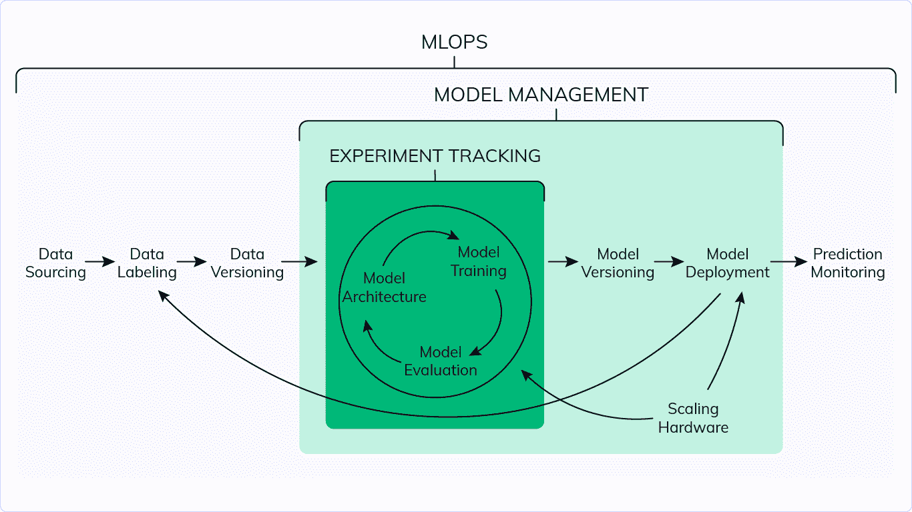
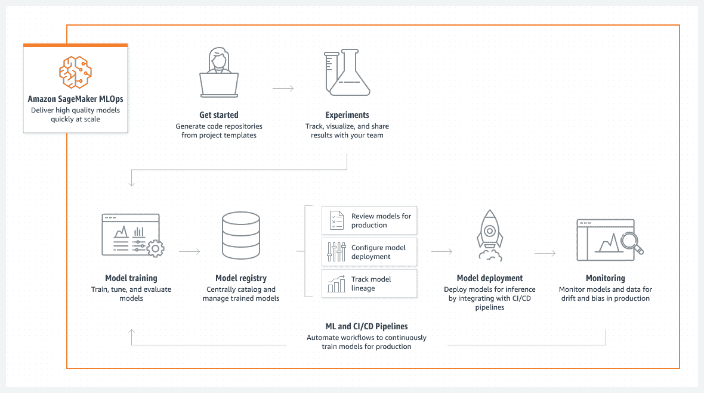
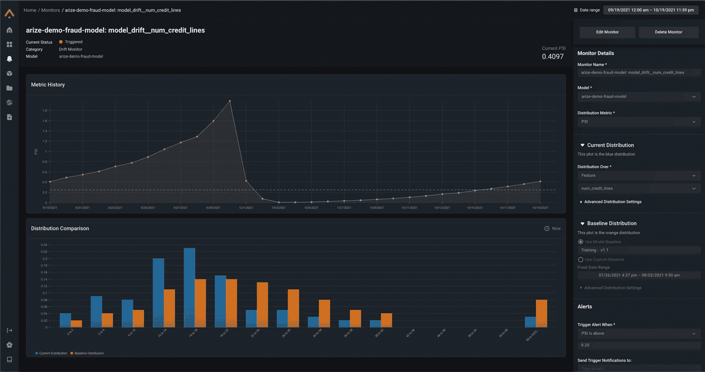

# 你需要知道的最好的机器学习模型管理工具

> 原文：<https://web.archive.org/web/https://neptune.ai/blog/best-machine-learning-model-management-tools>

与构建软件相比，使用机器学习模型需要一套不同的组织能力。这些新的功能集是由 [MLOps](https://web.archive.org/web/20221207204630/https://ml-ops.org/) 驱动的——它被进一步划分为不同的 ML 模型过程，其中之一就是模型管理。

机器学习模型管理是一类技术和流程，它们协同工作，使公司能够可靠、安全地高速开发、验证、交付和监控模型，主要是为了创造竞争优势。它几乎涵盖了管理模型的整个范围，从开发到再培训和监控。因此，模型管理可以分为几个阶段:

*   最佳化
*   版本控制和跟踪
*   评估和测试
*   包装
*   部署和服务
*   监视

*Model management within the MLOps workflow | [Source](/web/20221207204630/https://neptune.ai/blog/machine-learning-model-management)*

为了管理这些不同的功能集，我们需要根据特定的需求和用例准备好同样胜任的工具。考虑到这一领域中可用的工具数不胜数，每种工具都满足不同的需求，我们将它们分为 6 个类别，以便您知道有哪些选项。现在，让我们来看看一些策划得最好的。

## ML 模型优化

[超参数优化](/web/20221207204630/https://neptune.ai/blog/hyperparameter-tuning-in-python-complete-guide)是模型管理的关键步骤。为了从模型中获得最佳性能，您必须调整超参数以从数据中获得最大收益。有几种工具可以帮助你实现这个目标。让我们探索几个选项，这些选项符合大多数情况:

Optuna 是一个自动超参数优化框架，专门为机器学习而设计。它具有一个命令式的、由运行定义的用户 API，因此它是高度模块化的，并且编码功能也可以用于其他领域。

Optuna 功能:

*   **轻量级、通用且平台无关的架构:**通过简单的安装处理各种各样的任务，几乎没有任何要求。
*   Python 搜索空间:使用熟悉的 Python 语法定义搜索空间，包括条件和循环。
*   **高效优化算法:**采用最先进的算法对超参数进行采样，并高效修剪无希望的试验。
*   **简单的并行化:**将研究扩展到数十或数百名工作人员，对代码几乎不做任何更改。
*   **快速可视化:**检查各种绘图功能的优化历史。

SigOpt 是一个模型开发平台，它可以轻松跟踪运行、可视化训练和扩展超参数优化，适用于在任何基础设施上使用任何库构建的任何类型的模型。

SigOpt 通过贝叶斯和全局优化算法的结合来优化模型(甚至广告和产品)，这使得用户和公司可以提高他们模型的性能，同时降低成本，节省以前可能花费在更乏味的传统调整方法上的时间。

SigOpt 特性:

*   **健壮的跟踪:** SigOpt 跟踪并组织您的训练和调优周期，包括架构、度量、参数、超参数、代码快照以及特性分析、训练运行或调优作业的结果。
*   **自动化训练&调整:**它将自动化超参数调整与训练跑步跟踪完全集成，使这一过程变得简单易行。自动提前停止、高度可定制的搜索空间以及多测量和多任务优化等功能使您可以轻松调整正在构建的任何模型。
*   轻松集成:Sigopt 提供了与所有知名框架的轻松集成，如 H2O、Tensorflow、PyTorch、scikit 等。

## 版本控制和跟踪 ML 模型

在无数的实验中，我们如何跟踪数据、源代码和 ML 模型的变化？版本控制工具提供了一个解决方案，对于工作流来说是至关重要的，因为它们迎合了再现性。它们帮助您获得一个人工制品、数据集散列或模型的过去版本，可以出于性能原因或为了比较而用于回滚。

您通常会将这些数据和模型版本记录到您的元数据管理解决方案中，以确保您的模型训练是版本化的和可重复的。然后必须跟踪版本化模型，以便比较来自其他版本化实验的结果。

在一个理想的 ML 工作流中，您会想知道您的模型的元数据是如何构建的，哪些想法被测试过，或者在哪里可以找到所有打包的模型。为了实现这一点，您需要跟踪所有的模型构建元数据，如超参数、度量、代码和数据版本、评估结果、打包的模型以及其他信息。

这里有几个值得一试的工具。

Neptune 是一个 ML 元数据存储库，用于实验跟踪和模型注册。您可以[记录和显示几乎任何 ML 元数据](https://web.archive.org/web/20221207204630/https://docs.neptune.ai/logging/what_you_can_log/)，从源代码和工件到度量、超参数、模型检查点和系统度量。在 Neptune 中跟踪所有的东西，您就可以顺流而下:从模型，通过运行，到它被训练的数据集，只要有必要。

web UI 是为管理 ML 模型实验和模型而构建的，它允许您:

*   使用高级查询语言搜索实验和模型
*   使用[灵活的表格视图](https://web.archive.org/web/20221207204630/https://docs.neptune.ai/about/app/#customizing-columns)和仪表板定制您看到的元数据
*   监控、可视化和[比较实验](https://web.archive.org/web/20221207204630/https://docs.neptune.ai/app/comparison/)。

除了日志记录，还可以从 Neptune[查询元数据](https://web.archive.org/web/20221207204630/https://docs.neptune.ai/usage/querying_metadata/)。

如果你想知道它是否适合你的工作流程，看看[关于人们如何用 Neptune 建立他们的 MLOps 工具栈](/web/20221207204630/https://neptune.ai/customers)的案例研究。

海王星—摘要:

*   灵活的类似文件夹的元数据结构
*   高度可定制的 UI，用于搜索、显示、比较和组织 ML 元数据
*   易于使用的 API，用于记录和查询模型元数据，以及与 MLOps 工具的 25 多种集成
*   托管版本和内部版本均可用
*   协作功能和组织/项目/用户管理

数据版本控制(DVC)本质上是 ML 项目的一个实验管理工具。DVC 软件是基于 Git 构建的，这意味着它允许您在 Git 提交中捕获数据和模型的版本，同时将它们存储在本地或云存储中。它的主要目标是通过命令行编码数据、模型和管道。

DVC 的几个主要特征:

1.  轻量级: DVC 是一个免费的开源命令行工具，不需要数据库、服务器或任何其他特殊服务。
2.  一致性:用稳定的文件名保持你的项目可读性——它们不需要改变，因为它们代表可变数据。不需要复杂的路径或在源代码中不断地编辑它们。
3.  高效的数据管理:DVC 以一种组织良好且易于访问的方式存储大量数据。这极大地有助于数据版本化。
4.  协作:轻松分发您的项目开发，并在内部和远程共享其数据，或者在其他地方重用它。
5.  数据合规性:将数据修改尝试视为 Git 拉取请求。审核项目不变的历史，以了解数据集或模型何时被批准以及为什么被批准。
6.  GitOps:将您的数据科学项目与 Git 生态系统联系起来。Git 工作流打开了通向高级 CI/CD 工具(如 CML)、数据注册中心等专用模式以及其他最佳实践的大门。
7.  额外收获:DVC 还提供了一些实验跟踪功能。它可以跟踪这些实验，列出并比较它们最相关的度量、参数和依赖性，在它们之间导航，并只提交 Git 需要的那些。

Pachyderm 为 MLOps 提供了数据版本和管道。它们提供了一个数据基础，允许数据科学团队自动化和扩展他们的机器学习生命周期，同时保证可重复性。它提供商业企业版和开源社区版。如果需要，Pachyderm 也可以集成到您现有的基础架构或私有云。

Pachyderm 的主要目标是:

1.  **经济高效的可扩展性:**通过优化资源利用率和运行复杂的数据管道，使用自动扩展和并行技术进行智能数据转换，从而提供可靠的结果。
2.  **可再现性:**通过不可变的数据沿袭和数据版本化来确保任何类型数据的可再现性和合规性。类似 Git 的提交将提高团队效率。
3.  **灵活性:** Pachyderm 可以利用现有的基础设施，并且可以在您现有的云或内部基础设施上运行。

使用企业版，您可以在上述功能的基础上获得一些额外的功能:

*   **认证:** Pachyderm 允许对任何 OIDC 提供者进行认证。用户可以通过登录他们最喜欢的身份提供商向 Pachyderm 认证。
*   **基于角色的访问控制(RBAC):** 企业规模的部署需要访问控制。Pachyderm 企业版使团队能够控制对生产管道和数据的访问。管理员可以通过控制用户对 Pachyderm 资源的访问来存储数据，防止对生产管道的意外修改，并支持多个数据科学家甚至多个数据科学小组。
*   **企业服务器:**一个组织可以有多个 Pachyderm 集群注册到一个企业服务器，该服务器管理企业许可以及与公司身份提供商的集成。
*   此外，您还可以使用 pachctl 命令暂停(pachctl enterprise pause)和取消暂停(pachctl enterprise unpause)集群以进行备份和恢复。

MLflow 是一个简化机器学习开发的平台，包括跟踪实验，将代码打包成可复制的运行，以及共享和部署模型。MLflow 提供了一组轻量级 API，可以与任何现有的机器学习应用程序或库(TensorFlow、PyTorch、XGBoost 等)一起使用。)，无论您当前在何处运行 ML 代码(例如，在笔记本、独立应用程序或云中)。

MLflow 既有开源版本，也有托管版本(由 Databricks 提供)。您可以在此处查看两个版本的详细对比，以便做出明智的决定。

该工具与库无关。你可以在任何机器学习库或任何编程语言中使用它。MLflow 包含四个有助于跟踪和组织实验的主要功能:

1.  **ml flow Tracking**–使用 Python、REST、R API 和 Java API 自动记录每次运行的参数、代码版本、指标和工件
2.  **MLflow 项目**–代表打包可重用数据科学代码的标准格式。
3.  **ml flow Models**——一种包装机器学习模型的标准格式，可用于各种下游工具——例如，通过 REST API 或 Apache Spark 上的批处理推理进行实时服务。
4.  **MLflow Model Registry**–提供集中的模型存储、一组 API 和 UI，以协作方式管理 ml flow 模型的整个生命周期。

## ML 模型评估和测试

评估是 ML 工作流程中的一个重要阶段。ML 中的评估通常从定义度量标准开始，比如准确性和混淆矩阵，这取决于您的数据和用例。这种级别的模型评估对于真实世界的应用变得更加复杂，以考虑任何数据/概念漂移。

虽然大多数团队在部署模型之前都习惯于使用模型评估度量来量化模型的性能，但是这些度量通常不足以确保您的模型在现实场景中准备好投入生产。需要对你的模型进行彻底的测试，以确保它们在现实世界中足够健壮。

现在，问题是在工具的海洋中寻找什么。以下是在现实世界中测试模型时需要用到的一些技巧:

1.  **单元测试**:关注特定场景或子类，例如“光线较暗时来自后方的汽车”。
2.  **回归测试**:通过一次特定的推送(压扁的 bug)或“长尾”的一段获得的改进。
3.  **集成测试**:从组成、分发、预处理等方面镜像部署条件。

让我们看一些提供这种 ML 模型测试能力的工具:

Kolena 是一个机器学习测试和调试平台，用于揭示隐藏的模型行为，并揭开模型开发的神秘面纱。Kolena 帮助您:

*   执行高分辨率模型评估
*   了解并跟踪行为的改善和退步
*   有意义地交流模型功能

他们提供单元测试、回归测试和集成测试作为软件包的一部分。您可以为您的用例创建自定义工作流，但是，有一些模板可用，如图像分割、对象检测等。

Kolena 特色:

1.  提供大量测试功能:
    1.  单元/回归/集成测试
    2.  将多个测试组合成一个测试套件的选项
2.  可以通过 pip 包-ko Lena-client 访问。
3.  Web 仪表板可用于快速可视化结果。

点击查看他们的文档[了解更多信息。](https://web.archive.org/web/20221207204630/https://docs.kolena.io/)

Deepchecks 是测试和验证机器学习模型和数据的领先工具，它能够以最小的努力做到这一点。它满足各种验证和测试需求，例如验证数据的完整性、检查数据的分布、验证数据分割、评估模型以及比较不同的模型。

它们为 ML 工作流程的不同阶段提供测试:

*   数据完整性
*   培训测试验证(分布和方法检查)
*   模型性能评估

Deepchecks 是一款开源工具，提供:

1.  表格和图像数据测试。
2.  整合到火花，数据砖，气流等。点击查看完整列表[。](https://web.archive.org/web/20221207204630/https://docs.deepchecks.com/stable/user-guide/index.html)
3.  结果可以在工作笔记本或单独的窗口中可视化。请访问文档页面[这里](https://web.archive.org/web/20221207204630/https://docs.deepchecks.com/stable/user-guide/general/showing_results.html)了解这是如何工作的。
4.  单元/回归/集成测试。

## 包装 ML 模型

生产 ML 模型合乎逻辑的下一步是捆绑/打包它，这样它的行为就像一个应用程序。你的模型在 juypter 实验室环境中无法为用户服务；通过将它和它的依赖项打包，您就迈出了向真实世界展示您的模型的第一步。

基本上有两种方法可以打包您的 ML 模型:

1.  基于 Web 的框架:包括像 Flask 和 FastAPI 这样的微框架。
2.  **集装箱化**:包括码头工、集装箱工、搬运工等。

让我们来看看一些打包工具:

Flask 是一个 web 框架，本质上是一个 Python 模块，可以让您轻松开发 web 应用程序。它有一个小而易于扩展的核心:它是一个微框架，不包括 ORM(对象关系管理器)或类似的特性。Flask 依赖于 Werkzeug WSGI 工具箱和 Jinja2 模板。最终目的是帮助开发一个强大的 web 应用程序基础。

烧瓶主要特征:

*   它有一个内置的开发服务器和快速调试器。它有一个 RESTful 用于 HTTP 的请求分派和请求处理
*   它有内在的单元测试支持。
*   社区提供的多个扩展简化了新功能的集成。

FastAPI 是一个基于 web 的现代框架，使用 Python 3.6+版基于标准 Python 类型构建 API，提供了高性能。它是一个 ASGI 框架，这使得它高度并发。

快速 API 主要特性:

*   提供良好的性能，接近 NodeJS 和 Go，因为它使用 Starlette 和 Pydantic。目前最快的 Python 框架之一。
*   是一个健壮的框架，具有惊人的交互式文档。
*   完全兼容 API、OpenAPI 和 JSON 模式的开放标准。
*   直观——强大的编辑器支持，无处不在的自动完成，更少的调试时间。

Docker 是一个具有企业级的开源容器化平台。它使开发人员能够将应用程序打包到容器中，容器是标准化的可执行组件，将应用程序源代码与在任何环境中运行该代码所需的操作系统(OS)库和依赖项结合在一起。

Docker 的主要功能–

1.  Docker 映像可以使用 AWS ECS、Google Kubernetes 引擎等部署在云上。
2.  Docker 带有 CLI 以及用于 Windows、Mac 和 Linux 的应用程序。
3.  开发集成在所有流行的代码编辑器中都可用，如 VS Code、Jetbrains 等。
4.  所有主要的云服务提供商也提供软件集成。

## ML 模型部署和服务

在打包您的模型之后，紧接着的下一步是确定部署和服务中的需求。生产机器学习模型在操作化方面提出了自己的挑战。

您遇到的第一批问题是如何打包、部署、服务和扩展基础架构以支持生产中的模型。模型部署和服务工具对此有所帮助。

这里有一些模型部署和服务工具。

1.  AWS！AWS
2.  大脑皮层
3.  欢迎使用 ML

*[Source](https://web.archive.org/web/20221207204630/https://aws.amazon.com/sagemaker/mlops/)*

亚马逊网络服务是领先的云服务提供商，市场份额为 33%。它提供 200 多种功能齐全的服务，从数据中心和基础设施技术(如全球各地的计算、存储和数据库)到新兴技术(如机器学习和人工智能、数据湖和分析以及物联网)。这使得将您现有的应用程序迁移到云中变得更快、更容易、更具成本效益，并构建几乎任何您可以想象的东西。

AWS 功能–

1.  这是一个提供大量基础设施技术的大型技术平台。
2.  作为该领域的领导者，它还提供高效的服务来满足您的 ML 模型需求。
3.  AWS 弹性容器注册与 docker 容器兼容，并与 AWS ECS 或 Fargate 等其他服务无缝集成，以将容器投入生产。
4.  AWS Lambda 允许您无服务器部署 web 服务，因此您不必担心流量的增加/减少，因为它会自动处理流量，从而节省成本和精力。
5.  AWS Sagemaker 提供了一套面向 ML 开发、部署和服务的服务。

Cortex 是一个开源平台，旨在将经过训练的机器学习模型直接部署为生产中的 web 服务。它建立在 Kubernetes 之上，支持大规模的机器学习工作负载。

皮质特征:

*   **多框架:** Cortex 支持多种框架，包括 TensorFlow、PyTorch、scikit-learn、XGBoost 等等。
*   **自动伸缩:**API 的自动负载平衡，以处理生产工作负载。
*   **基础设施:** Cortex 可以在 CPU 或 GPU 基础设施上运行推理。
*   **滚动更新:** Cortex 在部署后更新 API，没有任何停机时间。

BentoML 是机器学习模型服务的端到端解决方案。它有助于数据科学团队开发服务于终端的生产就绪型模型，并在每个阶段提供最佳 MLOps 实践和性能优化。

它提供了一个灵活的、高性能的框架来服务、管理和部署生产中的 ML 模型。它通过其标准且简单的架构简化了构建生产就绪模型 API 端点的过程。它为团队提供了一个强大的仪表板，帮助他们集中组织模型和监控部署。

BentoML 特点:

*   **对流行 ML 框架的原生支持:** Tensorflow、PyTorch、XGBoost、Scikit-Learn 等等！
*   **定制管道:**用预处理、后处理和集合模型定义定制服务管道。
*   **易于版本控制和部署:**标准。用于打包代码、模型和依赖项的 bento 格式，便于版本控制和部署。
*   **最先进的模型服务:** BentoML 通过 REST API 或 gRPC 提供在线服务，通过 Apache Spark 或 Dask 提供批量数据集的离线评分，通过 Kafka、Beam 和 Flink 提供流服务。

## ML 模型监控

监控是模型管理的另一个组成部分。关于为什么监控你的 ML 模型如此必要，有几个概念。举几个例子:

1.  检查您的模型在现实世界数据中的实际表现。它是否产生了疯狂和意想不到的结果？
2.  以检查可能的模型漂移。
3.  它能够解决最初为其开发的业务问题吗？

模型监控工具可以通过以下方式让您了解生产中正在发生的事情:

*   **监控输入数据漂移:**与训练数据相比，您的模型是否获得了不同的输入？
*   **监控概念漂移:**问题是否不再与最初相似，你的模型性能是否在衰减？
*   **监测模型漂移:**模型的预测能力是否因环境变化而下降？
*   **监控硬件指标:**新型号是否比旧型号更需要资源？

这里有你可以选择的。

AWS Sagemaker 是 AWS 平台的一部分。数据科学家和开发人员可以准备、构建、训练和部署高质量的机器学习(ML)模型。它声称是 ML 的第一个集成开发环境(IDE)。它有四个组成部分:准备、构建、培训和调优、部署和管理。用户可以记录、组织和比较实验，自动调整超参数，并调试训练运行。

Amazon SageMaker 提供了许多功能，其中包括:

*   **分布式训练:** Sagemaker 通过将数据分割到多个 GPU 上，使其用户更快地执行分布式训练，从而实现近乎线性的扩展效率。
*   **剖析和调试训练运行:** SageMaker 调试器实时捕获指标和剖析训练作业，使用户能够在模型部署到生产之前快速纠正性能问题。
*   **支持强化学习:**它内置了完全管理的强化学习算法，包括学术文献中最新、性能最好的算法。
*   **针对主流框架优化:** SageMaker 针对 TensorFlow、Apache MXNet、PyTorch 等众多流行的深度学习框架进行了优化。支持的框架总是保持最新版本，并针对 AWS 上的性能进行了进一步优化。
*   **支持 AutoML:** SageMaker autopilot 根据用户的数据自动构建、训练和调整最佳的机器学习模型，同时允许他们保持完全的控制和可见性。只需一次点击就可以将模型部署到生产环境中，或者对模型进行迭代以进一步提高模型质量。

Fiddler 是一个模型性能管理平台，它提供了模型监控、可观察性、可解释性和公平性。它让您可以构建一个集中式平台，通过简单的插件集成来监控和分析人工智能模型，并帮助企业了解他们的人工智能背后的“为什么”和“如何”。该平台监控人工智能模型的数据漂移、数据完整性问题、异常值和性能下降。

Fiddler ML 的主要特性:

*   **性能监控:**它为机器学习问题提供现成的性能和评估指标，包括但不限于二元分类、多类分类、回归和排序模型。
*   **数据漂移:**使用 Fiddler，您可以轻松地监控数据漂移，发现数据完整性问题，并比较基线和生产数据集之间的数据分布，以提高模型性能。
*   **NLP 和 CV 监控:** Fiddler 提供复杂和非结构化数据的监控，比如自然语言处理和计算机视觉。
*   **警报:**它提供实时警报，以最大限度地减少由性能、数据漂移、数据完整性和服务指标(如流量、延迟和错误)引起的问题。

[*Source*](https://web.archive.org/web/20221207204630/https://arize.com/)

Arize 是机器学习可观察性平台，用于 ML 从业者监控、故障排除和解释模型。它记录了跨培训、验证和生产环境的模型推理。

Arize AI 有以下特点:

*   **ML 性能跟踪:** Arize AI 提供 ML 性能跟踪，并专门构建工作流来高效地跟踪和追踪模型。
*   **非结构化数据监控**:支持 NLP 和计算机视觉的非结构化数据监控。
*   **了解漂移影响:**真实世界的数据是动态的，会随着时间的推移影响模型响应。使用 Arize，您可以跟踪上游数据、预测和实际数据的分布变化，以主动评估模型性能并寻找再培训机会。
*   **自动化模型监控:** Arize 提供了监控 ML 模型各个方面的能力，这对于捕捉关键指标的性能退化至关重要。
*   **轻松集成&部署:** Arize 旨在无缝插入您现有的 ML 堆栈和警报工作流。该平台可以在任何环境中与任何平台的任何模型框架一起工作。

WhyLabs 是一个人工智能可观察性平台，旨在通过允许您在生产中监控数据管道和机器学习模型来防止数据质量或模型性能下降。

它建立在一个名为 whylogs 的开源包之上，可以监控数据管道和 ML 应用程序的数据质量退化、数据漂移和模型性能退化。

WhyLabs 工具的主要特点:

*   轻松集成:Whylabs 提供了一个名为 whylogs 的开源模块，让您可以轻松地将代码与 WhyLabs SaaS 平台集成。
*   **数据健康/数据操作:**该工具自动捕捉数据质量问题。它可以在对用户体验产生任何影响之前识别和监控数据漂移和数据偏差。
*   **Model health / ModelOps:** 您可以跟踪模型输出和模型性能，调试模型，并通过智能关联和可视化识别异常。Whylabs 还对概念漂移和模型精度下降发出警告。
*   **保护隐私:** WhyLabs profiles 对输入和输出进行建模，仅捕获底层数据的统计数据。原始数据不会离开客户的 VPC/边界。WhyLabs 的所有产品功能都基于统计数据。
*   **零维护:** Whylabs 提供了最少甚至没有维护的结构，没有模式维护，没有监控配置，没有数据采样开销，也没有部署困难。
*   **与您现有的管道和工具无缝集成:** Whylabs 支持所有主流框架，如 Tensorflow、PyTorch、scikit、Apache Spark、Azure、SageMaker 等。

要更深入地了解监控框架，请阅读我们的[模型监控工具比较。](https://web.archive.org/web/20221207204630/https://neptune.ai/blog/ml-model-monitoring-best-tools)

如果您正在为您的模型管理需求寻找一个全面的竞争者，那么有些选择可以作为“一站式商店”。让我们来看一些这样的工具，它们为完整的生命周期提供服务。

如上所述，亚马逊 SageMaker 是一个完全托管的机器学习服务。使用 SageMaker，您可以:

1.  快速轻松地构建和训练机器学习模型，以及
2.  然后将它们直接部署到生产就绪的托管环境中。

Sagemaker 提供:

1.  一个集成的 Jupyter 创作笔记本实例，便于访问您的数据源进行探索和分析，因此您不必管理服务器。
2.  它还提供了常见的机器学习算法，这些算法经过优化，可以针对分布式环境中的海量数据高效运行。有了对自带算法和框架的本地支持，
3.  SageMaker 提供灵活的分布式培训选项，可根据您的具体工作流程进行调整。通过在 SageMaker Studio 或 SageMaker 控制台上点击几下，将模型部署到一个安全且可伸缩的环境中。培训和托管按使用分钟计费，没有最低费用，也没有前期承诺。

Sagemaker 有一个很长的特性列表，涵盖了开发、打包、部署和监控。一些服务包括 Sagemaker Studio、Sagemaker 模型注册、Sagemaker 特性存储、Sagemaker 实验和 Sagemaker 预处理。你可以在这里看完整的功能列表[。](https://web.archive.org/web/20221207204630/https://docs.aws.amazon.com/sagemaker/latest/dg/whatis.html)

Azure Machine Learning 是用于管理机器学习项目生命周期的云服务。这是一个用于培训、部署模型和管理 MLOps 的全方位工具。你可以在 Azure Machine Learning 中创建模型，也可以使用从开源平台构建的模型，比如 Pytorch、TensorFlow 或 scikit-learn。

Azure ML 提供:

*   协作，如共享笔记本电脑、计算资源、数据和环境，跟踪和显示谁在何时进行了更改的可审核性，以及资产版本控制。
*   Azure Machine Learning studio 是项目工作区的图形用户界面，允许您:
    *   查看运行、指标、日志、输出等。
    *   创作和编辑笔记本和文件。
    *   管理公共资产，如数据凭据、计算和环境。
    *   可视化运行指标、结果和报告。
    *   可视化通过开发人员界面创作的管道。
    *   创作 AutoML 作业。
*   广泛支持 ML 框架，如 PyTorch、Tensorflow、scikit-learn、XGBoost、LightGBM 等。
*   支持 MLOPs 的集成:
    *   Git 集成
    *   MLflow 集成
    *   机器学习流水线调度
    *   针对自定义触发器的 Azure 事件网格集成
    *   易于与 GitHub Actions 或 Azure DevOps 等 CI/CD 工具一起使用

注:Azure ML studio 将于 2024 年集成到 Azure 机器学习中。

Vertex AI 是一个托管的机器学习平台，它可以在一个地方为您提供谷歌的所有云服务，以部署和维护 ML 模型。它将用于构建 ML 的 Google 云服务集合在一个统一的 UI 和 API 下。

在 Vertex AI 中，您现在可以使用 AutoML 或自定义代码训练来轻松训练和比较模型，并且您的所有模型都存储在一个中央模型库中。这些模型现在可以部署到 Vertex AI 上的相同端点。

Vertex AI 提供:

*   **训练和超参数调整:** Vertex AI 训练提供完全管理的训练服务，Vertex AI Vizier 提供优化的超参数，以实现最大的预测准确性。
*   **模型服务:**顶点人工智能预测可以轻松地将模型部署到生产中，通过 HTTP 在线服务或批量预测进行批量评分。
*   **模型调优与理解:**顶点可解释 AI 告诉你每个输入特征对你的预测有多重要。
*   **模型监控:**持续监控为部署在 Vertex AI 预测服务中的模型提供了随时间推移对模型性能的简单而主动的监控。
*   **模型管理:** Vertex ML 元数据通过自动跟踪顶点管道中所有组件的输入和输出，为您的 ML 工作流进行人工制品、沿袭和执行跟踪，从而实现更轻松的可审计性和治理。

这个列表当然不是详尽的，Vertex AI 提供了许多其他的 MLOps 功能来满足你的需求。你可以在这里阅读更多关于功能[的完整列表。](https://web.archive.org/web/20221207204630/https://cloud.google.com/vertex-ai#section-15)

## 你已经到达终点了！

我们看到了模型管理对于构建能够被更多受众消费的模型是多么的必要。我们还讨论了可以支持模型开发并简化整个过程的工具。

您现在知道了在工具库中应该寻找什么，以及从哪里开始。您需要做的是列出您的问题陈述，并选择最适合您的用例的工具。

暂时就这样了。敬请关注更多内容！再见！

### 参考

1.  [https://neptune.ai/blog/best-mlops-tools](/web/20221207204630/https://neptune.ai/blog/best-mlops-tools)
2.  [https://neptune.ai/blog/best-ml-experiment-tracking-tools](/web/20221207204630/https://neptune.ai/blog/best-ml-experiment-tracking-tools)
3.  [https://www . dominodatalab . com/resources/field-guide/machine-learning-model-management](https://web.archive.org/web/20221207204630/https://www.dominodatalab.com/resources/field-guide/machine-learning-model-management)
4.  [https://neptune.ai/blog/machine-learning-model-management](/web/20221207204630/https://neptune.ai/blog/machine-learning-model-management)
5.  [https://docs.kolena.io/core-concepts/test-cases](https://web.archive.org/web/20221207204630/https://docs.kolena.io/core-concepts/test-cases)
6.  [https://docs . deep checks . com/stable/getting-started/welcome . html](https://web.archive.org/web/20221207204630/https://docs.deepchecks.com/stable/getting-started/welcome.html)
7.  [https://docs.arize.com/arize/](https://web.archive.org/web/20221207204630/https://docs.arize.com/arize/)
8.  [https://www.ibm.com/in-en/cloud/learn/docker](https://web.archive.org/web/20221207204630/https://www.ibm.com/in-en/cloud/learn/docker)
9.  [https://neptune.ai/blog/packaging-ml-models](/web/20221207204630/https://neptune.ai/blog/packaging-ml-models)
10.  [https://neptune.ai/blog/ml-model-serving-best-tools](/web/20221207204630/https://neptune.ai/blog/ml-model-serving-best-tools)
11.  [https://mlops-guide.github.io/Versionamento/](https://web.archive.org/web/20221207204630/https://mlops-guide.github.io/Versionamento/)
12.  [https://censius.ai/mlops-tools/bentoml](https://web.archive.org/web/20221207204630/https://censius.ai/mlops-tools/bentoml)
13.  [https://DVC . org/doc/用例/版本化数据和模型文件](https://web.archive.org/web/20221207204630/https://dvc.org/doc/use-cases/versioning-data-and-model-files)
14.  [https://www.pachyderm.com/products/](https://web.archive.org/web/20221207204630/https://www.pachyderm.com/products/)
15.  [https://docs.pachyderm.com/latest/enterprise/overview/](https://web.archive.org/web/20221207204630/https://docs.pachyderm.com/latest/enterprise/overview/)
16.  [https://arize.com/](https://web.archive.org/web/20221207204630/https://arize.com/)
17.  [https://docs.aws.amazon.com/sagemaker/latest/dg/whatis.html](https://web.archive.org/web/20221207204630/https://docs.aws.amazon.com/sagemaker/latest/dg/whatis.html)
18.  [https://cloud.google.com/vertex-ai#section-1](https://web.archive.org/web/20221207204630/https://cloud.google.com/vertex-ai#section-1)
19.  [https://docs . Microsoft . com/en-us/azure/machine-learning/overview-what-is-azure-machine-learning](https://web.archive.org/web/20221207204630/https://docs.microsoft.com/en-us/azure/machine-learning/overview-what-is-azure-machine-learning)