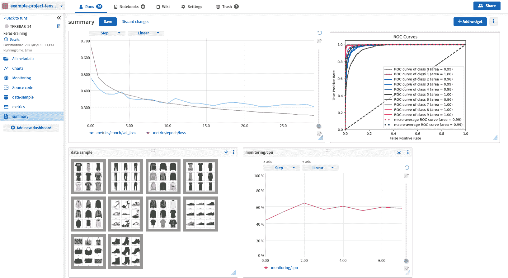
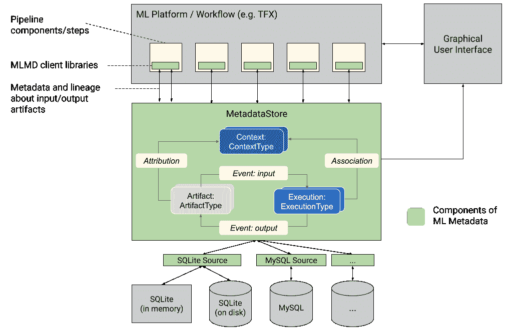
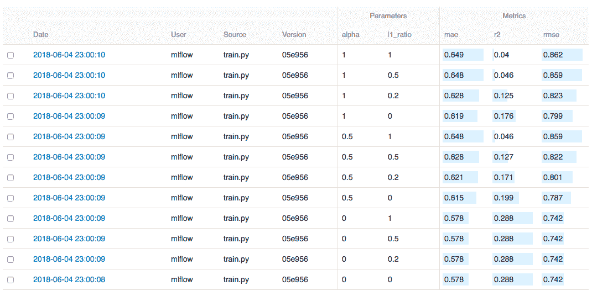

# 最佳 ML 元数据存储解决方案

> 原文：<https://web.archive.org/web/https://neptune.ai/blog/best-metadata-store-solutions>

如果您已经找到了这篇文章，那么您可能已经熟悉了 ML 元数据存储的概念，并且正在寻找最佳解决方案的建议。

对于那些不太熟悉这个概念的人来说，ML 元数据存储是一个存储从端到端机器学习(ML)管道生成的[元数据](https://web.archive.org/web/20230304071956/https://www.datacouncil.ai/talks/the-case-for-metadata-for-machine-learning-platforms)的地方，供将来参考，这对[机器学习操作(MLOps)](https://web.archive.org/web/20230304071956/https://ml-ops.org/content/mlops-principles) 尤为重要。

ML 中的元数据可以从管道的任何阶段生成，包括诸如模型参数、度量、模型配置和数据版本之类的细节。这些细节对于实验比较、快速回滚、减少模型停机时间、再培训和许多更重要的功能都是必不可少的。

要更详细地了解机器学习元数据存储及其重要性，请随意在这里深入研究:“ [ML 元数据存储:它是什么，它为什么重要，以及如何实现它](/web/20230304071956/https://neptune.ai/blog/ml-metadata-store)”。

**本文将重点介绍目前 ML 市场上的一些顶级 ML 元数据存储解决方案**,还将为如何选择最适合您团队的解决方案提供一些指导。

在进入选择正确解决方案的细节之前，第一步是评估你是否真的需要一个。

如果你有一个正在成长的团队，计划扩展和改进现有的解决方案，或者想在他们的产品线中增加更多的 ML 解决方案，那么元数据存储是一个获得速度、自动化和智能洞察力的正确途径。

在为您的团队选择正确的机器学习元数据管理工具时，您可以参考下面的清单来找到正确的匹配:

*   **跟踪能力**—[元数据存储应该具有广泛的跟踪特性](https://web.archive.org/web/20230304071956/https://mlinproduction.com/ml-metadata/)，不仅包括模型跟踪，还包括更精细的跟踪能力，例如数据版本控制、跟踪数据和模型血统、源代码版本控制，甚至是测试和生产环境的版本控制。
*   **集成**–一个理想的元数据存储应该能够与您的机器学习生态系统中的大多数工具无缝集成，以便能够捕获从管道的每个阶段生成的活力。
*   **UI/UX**–使用元数据存储平台的最大优势之一是一个易于使用的界面，只需点击几下鼠标就能交付结果，而无需手动跟踪、脚本编写和后台编码等额外工作。
*   **协作能力**–每个机器学习解决方案都是由多个团队构思、开发和维护的。例如，开发团队，操作团队，甚至商业团队一起创建一个成功的 ML 解决方案。
*   **智能分析**–虽然元数据存储记录了不同阶段的数据，但它也将这些数据放在一起，以提供智能见解，从而促进实验并增强报告。理想的元数据存储平台应该能够提供交互式视觉效果，开发人员可以对其进行定制，以表示管道数据中的特定焦点区域。
*   **简单报告**–机器学习解决方案由工程团队开发，但业务和产品团队的参与比例很高。因此，开发人员必须定期以通俗易懂的语言向不太懂代码的涉众展示进展或度量。

既然我们已经介绍了如何选择最佳的元数据存储解决方案，那么让我们来看看目前市场上一些具有有利特性的最佳选择。

*Example of experiment tracking dashboard with various metadata in one place | [Source](https://web.archive.org/web/20230304071956/https://i0.wp.com/neptune.ai/wp-content/uploads/Get-started-with-Neptune-1.png?resize=1024%2C591&ssl=1)*

Neptune 是 MLOps 的一个[元数据存储库，为运行大量实验的研究和生产团队而构建。](/web/20230304071956/https://neptune.ai/)

个人和组织使用 Neptune 进行实验跟踪和模型注册，以控制他们的实验和模型开发。

Neptune 为他们提供了一个中心位置来记录、存储、显示、组织、比较和查询机器学习生命周期中生成的所有元数据。

它非常灵活，可以在多个 DS 和 ML 字段中使用，因为它允许您[记录和显示各种元数据](https://web.archive.org/web/20230304071956/https://docs.neptune.ai/you-should-know/what-can-you-log-and-display)。从度量、损失或参数等常见数据，到图像、视频或音频等丰富格式的数据，再到代码、模型检查点、数据版本和硬件信息。

它还与多个 ML 框架和工具集成，因此很容易将其插入任何 [MLOps](/web/20230304071956/https://neptune.ai/blog/mlops) 管道。

Neptune 是这个列表中唯一一个非开源的工具——它是一个托管的解决方案(也可以在内部部署)。它的[定价](https://web.archive.org/web/20230304071956/https://neptune.ai/pricing)结构是基于使用的，这似乎是最适合任何 ML 团队的选择。

如果你想了解更多关于 Neptune 的信息，可以查看[文档](https://web.archive.org/web/20230304071956/https://docs.neptune.ai/)或者探索一个[示例项目](https://web.archive.org/web/20230304071956/https://app.neptune.ai/common/example-project-tensorflow-keras/e/TFKERAS-14/dashboard/summary-6f234f52-6b77-476a-9486-63037655b3be)(不需要注册)。

*MLMD: a high-level overview of the its components | [Source](https://web.archive.org/web/20230304071956/https://www.tensorflow.org/tfx/guide/mlmd)*

由 [TensorFlow](https://web.archive.org/web/20230304071956/https://www.tensorflow.org/) 开发的 ML 元数据(MLMD)是 TensorFlow Extended (TFX)的一部分，TensorFlow Extended()是一个端到端的平台，支持机器学习解决方案的部署。然而，MLMD 是这样设计的，它可以独立运行。

MLMD 分析管道的相互连接的部分，而不是孤立地分析每个部分。这为每个部分带来了重要的背景。 [MLMD 从生成的工件、组件的执行和总体沿袭信息中收集元数据](https://web.archive.org/web/20230304071956/https://towardsdatascience.com/tracking-your-machine-learning-workflows-with-mlmd-b289e37e020c)。存储后端是可插拔和可扩展的，API 可以用来最轻松地访问它。

使用 MLMD 的一些好处包括列出所有常见类型的工件，比较不同的工件，跟踪相关执行的 Dag 以及输入和输出，递归所有事件以了解不同工件是如何创建的，记录和查询上下文或工作流运行，以及过滤声明性节点。

*注:对 ML 元数据和 MLflow 的区别感兴趣？阅读[本讨论。](https://web.archive.org/web/20230304071956/https://github.com/google/ml-metadata/issues/49)*

顶点 ML 元数据是由谷歌建立在 MLMD 概念之上的。它通过一个可导航的图来表示元数据，其中执行和工件是节点，而事件则相应地成为链接节点的边。执行和工件通过用子图表示的上下文进一步连接。

用户可以将键值对元数据应用于执行、工件和上下文。借助 Vertex ML 元数据，用户可以利用各种细节，例如识别用于训练模型的确切数据集、已应用于特定数据集的模型、最成功的运行以及可再现的数据、部署目标和时间、基于时间预测的模型版本等等。

*MLflow runs dashboard | [Source](https://web.archive.org/web/20230304071956/https://www.mlflow.org/docs/latest/tutorials-and-examples/tutorial.html#training-the-model)*

MLflow 是一个开源平台，负责端到端的机器学习生命周期，包括实验、再现性、部署和模型注册等阶段。它可以与任何 ML 库或语言一起工作，可以针对多个用户进行显著扩展，还可以通过 Apache Spark 扩展到大数据。

MLflow 有四个主要组件:

*   MLflow 跟踪，
*   MLflow 项目，
*   MLflow 模型，
*   和 MLflow 模型注册表。

跟踪组件记录和查询实验数据，例如代码、配置文件、数据和度量。项目通过以给定的格式打包 ML 解决方案，使得 ML 解决方案与平台无关。模型组件允许 ML 解决方案跨任何服务环境兼容。最后一个组件 model registry 用于存储、注释和管理中央存储库中的模型。

## 最后一个音符

元数据是任何端到端机器学习开发过程的支柱，因为它不仅加快了过程，还提高了最终管道的质量。虽然上述元数据存储解决方案是很好的无所不包的解决方案，但是 ML 框架的理想元数据存储将取决于管道的内部结构和分析。

Vertex ML 元数据和 MLMD 的构建类似，只是在 API 上有细微的差别。Vertex 的 API 具有额外的优势，能够托管来自 [TensorBoard](https://web.archive.org/web/20230304071956/https://cloud.google.com/vertex-ai/docs/experiments/tensorboard-overview) 的训练工件。此外，MLMD 要求用户用代码注册模型工件和管道。这对于用户来说可能是繁重的，因为它增加了额外的和广泛的步骤，这可能导致手动错误。在 MLflow 和 MLMD 之间，两者都有不同的解决方法。MLflow 用模型优先的观点来处理这个问题，而 MLMD 给予管道观点更高的优先权。

虽然上述所有解决方案都是开源的并且非常灵活，但是 Neptune 的元数据存储是一个可定制的解决方案，可以很好地适应用户现有的 ML 库以及一致的解决方案支持。Neptune 还通过一个简单的设置过程(只需几次点击)和一个自动更新功能(在不干扰框架的情况下添加新功能)减少了设置和维护的摩擦。与开放源码的设置相比，这是一个双赢的局面，因为开放源码的设置需要多个步骤，而且经常因为不断更新而变得脆弱。

**资源:**