# 计算机视觉项目管道的最佳 MLOps 工具

> 原文：<https://web.archive.org/web/https://neptune.ai/blog/best-mlops-tools-for-computer-vision-project>

应用或软件系统的生命周期(也称为 [SDLC](https://web.archive.org/web/20230117104424/https://www.tutorialspoint.com/sdlc/sdlc_overview.htm) )有几个主要阶段:

*   策划，
*   发展，
*   测试，
*   部署，

然后，根据需要返回到包含特性、更新和/或修复的新版本。

为了执行这些过程，软件开发依赖于 DevOps 来简化开发，同时持续交付新版本并保持质量。

计算机视觉模型或任何机器学习模型的工作流程也遵循类似的模式。它与传统软件开发的不同之处在于它运行的环境。

例如，[计算机视觉](https://web.archive.org/web/20230117104424/https://towardsdatascience.com/everything-you-ever-wanted-to-know-about-computer-vision-heres-a-look-why-it-s-so-awesome-e8a58dfb641e)主要是数据驱动的，因此在行为上是不确定的。此外，正如最近的全球事件所表明的那样，我们的世界在不断变化，因此 CV 从业者必须预期驱动其模型的真实世界数据也将不可避免地发生变化。

因此，ML 实践者已经接受了 ML 模型的 DevOps 实践，并提出了 MLOps。在维基百科的术语中， *MLOps 是将实验机器学习模型投入生产的过程*。[ [来源](https://web.archive.org/web/20230117104424/https://en.wikipedia.org/wiki/MLOps)

Gartner 将 MLOps 定义为 [ModelOps](https://web.archive.org/web/20230117104424/https://www.gartner.com/en/information-technology/glossary/modelops) 的子集。MLOps 专注于 ML 模型的可操作性，而 ModelOps 涵盖所有类型的 AI 模型的可操作性。[ [来源](https://web.archive.org/web/20230117104424/https://www.gartner.com/document/3987104)

在这篇博客中，我们主要关注的是计算机视觉中的模型运算(*如果你对模型运算的重要性更感兴趣，你可以看看这篇博客***)**

 *MLOps 和 DevOps 的主要区别是什么？

MLOps 比 DevOps 要复杂一些。所有这些值得做吗？

## 你为什么要做 MLOps，而不仅仅是专注于创造一个更好的 ML 模型？

您可以在没有 MLOps 的情况下实现和训练具有良好性能和准确性的模型。然而，真正的挑战是建立一个集成的 ML 系统，使其在生产中持续运行。

下图显示了真实 ML 系统中只有一小部分是由 L 代码组成的。所需的周围元素是巨大而复杂的。

上图显示了你在 CV 项目中应该遵循的步骤。现在，**这些步骤的自动化水平定义了 CV 项目的成熟度**。

什么叫成熟？让我们来看看谷歌在“ [MLOps:机器学习中的连续交付和自动化管道](https://web.archive.org/web/20230117104424/https://cloud.google.com/architecture/mlops-continuous-delivery-and-automation-pipelines-in-machine-learning#devops_versus_mlops)”中简要规定的三个层次的 MLOps:

1.  **m lops 0 级**

在这里，开发人员手动控制从收集数据到构建模型和部署模型的所有步骤。这个过程通常是通过在笔记本上编写和执行实验代码来实现的，直到产生一个可行的模型。在这个级别，一个经过训练的模型被部署为一个生产服务。

2.  **MLOps 一级**

在级别 1 中，整个 ML 管道是自动化的。在这里，使用新数据在生产中重新训练模型的过程是自动化的。此外，为此，数据和模型验证步骤以及元数据管理需要自动化。在这一级，自动和循环运行以服务于训练模型的整个训练管道被部署为预测服务。

3.  **MLOps 二级**

在第 2 级中，CI/CD 管道与 ML 管道一起实现自动化。自动化 CI/CD 使您能够探索围绕功能工程或模型架构的新想法，并通过自动化管道构建、测试和部署轻松实现它们。

现在我们知道了 MLOps 的重要性，让我们来详细看看您的计算机视觉项目的每个阶段和组件，以及所有相关的 MLOps 工具。

## 数据和特征管理

### 数据收集

以下是常见 CV 项目中使用的数据集列表(除了非常著名的 [CIFAR-10](https://web.archive.org/web/20230117104424/http://www.cs.toronto.edu/~kriz/cifar.html) 、 [ImageNet](https://web.archive.org/web/20230117104424/https://image-net.org/) 和 [MS Coco](https://web.archive.org/web/20230117104424/https://cocodataset.org/#home) ):

1.  [IMDB-Wiki 数据集](https://web.archive.org/web/20230117104424/https://data.vision.ee.ethz.ch/cvl/rrothe/imdb-wiki/)

最大的开源人脸图像数据集之一，带有性别和年龄标签。它由 523051 张人脸图像组成。

2.  [城市景观数据集](https://web.archive.org/web/20230117104424/https://www.cityscapes-dataset.com/)

最大的数据集之一，包含在 50 个不同城市的街道场景中记录的一组不同的立体视频序列，除了 20，000 个弱注释帧之外，还有 5，000 个高质量注释帧。

3.  [时尚 MNIST](https://web.archive.org/web/20230117104424/https://github.com/zalandoresearch/fashion-mnist)

它由 60，000 个训练样本和 10，000 个测试样本组成，每个样本都是与 10 个类别的标签相关联的 28 X 28 灰度图像。

4.  [动力学| DeepMind](https://web.archive.org/web/20230117104424/https://deepmind.com/research/open-source/kinetics)

该数据集由 Youtube 上的 6，50，000 个 10 秒钟的视频剪辑组成，包括大约 700 个人类动作类，每个类中至少有 600 个视频剪辑。一系列以人为本的行动。

5.  [200 亿左右的 V2 数据集| 20 亿](https://web.archive.org/web/20230117104424/https://20bn.com/datasets/something-something)

这个开源数据集有密集标记的视频剪辑，这些视频剪辑是人类用日常物品执行预定义的基本动作。它是为 CV 模型创建的，目的是为了更好地理解物理世界中发生的基本动作。包含的视频总数为 220，847 个，其中 168，913 个是训练集，24，777 个是验证集，27，157 个是测试集。

### **数据创建**

如果您想要构建自己的数据集，以下是计算机视觉中常用的工具，它们可以帮助您创建数据集:

1.  [贴标](https://web.archive.org/web/20230117104424/https://github.com/tzutalin/labelImg)

*   这是一个图形图像注释工具。
*   用 python 编写，图形界面使用 Qt
*   注释以 PASCAL VOC 格式保存在 XML 中， [ImageNet](https://web.archive.org/web/20230117104424/https://www.image-net.org/) 使用的格式。还支持 YOLO 和 CreateML 格式。

2.  [计算机视觉标注工具](https://web.archive.org/web/20230117104424/https://github.com/openvinotoolkit/cvat)

*   这是一个免费的在线交互式视频和图像注释工具。
*   具有深度学习的无服务器自动标注功能

3.  [标签工作室](https://web.archive.org/web/20230117104424/https://github.com/heartexlabs/label-studio)

*   这是一个开源的数据标签工具，用于图像、视频、音频等，有一个简单的用户界面。
*   导出到各种模型格式
*   除了创建原始数据，还可以用于改进现有数据。

4.  [视觉对象标记工具](https://web.archive.org/web/20230117104424/https://github.com/Microsoft/VoTT)

*   VoTT 是一个 React + Redux 的 Web 应用，用 [TypeScript](https://web.archive.org/web/20230117104424/https://github.com/Microsoft/TypeScript) 编写。
*   用于导入和导出数据的可扩展模型。

### 数据管理

1.  [海王星](https://web.archive.org/web/20230117104424/https://docs.neptune.ai/how-to-guides/data-versioning)

除了通过出色的 UI 很好地完成数据版本控制，Neptune 还允许您[记录图像目录的可视快照](https://web.archive.org/web/20230117104424/https://docs.neptune.ai/how-to-guides/data-versioning/log-image-directory-snapshots)，这对于您的计算机视觉项目非常有帮助。

2.  [数据版本控制 DVC](https://web.archive.org/web/20230117104424/https://dvc.org/)

旨在处理大型文件和数据集以及机器学习模型和指标。

3.  [Roboflow](https://web.archive.org/web/20230117104424/https://roboflow.com/)

凭借无限制导出、通用主机、标签和注释工具等功能，Roboflow 非常适合您的计算机视觉项目。

4.  [大台库](https://web.archive.org/web/20230117104424/https://www.dataiku.com/)

Dataiku 是为那些喜欢使用代码而不是可视化工具来操作、转换和建模数据的人准备的。

### 数据验证

要检查图像或视频数据的质量保证，以下是一些工具:

1.  [鳞核](https://web.archive.org/web/20230117104424/https://scale.com/)

Scale 通过帮助计算机视觉团队生成高质量的地面真实数据，加速了 AI 应用的开发。他们先进的激光雷达、视频和图像注释 API 允许自动驾驶、无人机和机器人团队专注于构建差异化的模型，而不是标记数据。它为所有人工智能应用程序提供高质量的培训和验证数据的付费服务，包括按需客户和企业客户。

2.  [远大 _ 期望](https://web.archive.org/web/20230117104424/https://github.com/great-expectations/great_expectations)

Great Expectations 是开源的，通过数据测试、文档和概要分析，帮助数据团队消除管道债务。

3.  [汽水数据可观察性](https://web.archive.org/web/20230117104424/https://www.soda.io/)

它为您所有数据的端到端可观察性和控制提供付费服务。它的一些特性包括监控、测试和检查数据的适用性。

### 数据处理

数据处理和数据管道非常重要。有三个关键要素:

*   一个来源，
*   处理步骤，
*   这是一个可以提供给模型使用的名称。

数据管道架构需要考虑很多因素。要了解更多关于数据管道及其架构的信息，请阅读本文。

以下是您应该考虑用于数据处理和数据管道的一些工具:

1.  [阿帕奇风暴](https://web.archive.org/web/20230117104424/https://storm.apache.org/)

这个由 Twitter 构建的开源数据编排器以可靠的方式对无界数据流进行批处理。它消耗数据流，并以任意复杂的方式处理这些数据流，在每个计算阶段之间重新划分数据流。

2.  [天星](https://web.archive.org/web/20230117104424/https://dagster.io/)

用于机器学习、分析和 ETL(提取、转换、加载)的数据编排器。它允许您根据称为实体的逻辑组件之间的数据流来定义管道。这些管道都是在本地建设的，可以在任何地方运行。

3.  [阿帕奇火花](https://web.archive.org/web/20230117104424/https://spark.apache.org/docs/latest/)

这种开源且灵活的内存框架可作为 map-reduce 的替代方案，用于处理批处理、实时分析和数据处理工作负载。

### 专题报道

开发一个 ML 管道不同于开发软件，主要是从数据的角度。数据或特性的质量与代码的质量一样重要。多亏了特征库，我们可以重用特征，而不是为不同的模型重新构建它们。这种自动化是 MLOps 的重要组成部分。

1.  [无黄油的](https://web.archive.org/web/20230117104424/https://github.com/quintoandar/butterfree)

该特征库构建库以下列概念为中心:

*   ETL:创建数据管道的中心框架。基于 Spark 的提取、转换和加载模块随时可用。
*   **声明式特征工程:**关心你要计算什么，而不是如何编码。
*   **特征库建模**:该库轻松提供您处理和加载数据到特征库所需的一切。

2.  [盛宴](https://web.archive.org/web/20230117104424/https://feast.dev/)

这个开源、易于使用的特征库是将分析数据用于模型训练的最快途径。主要特点是:

*   它调用您的离线数据，以便可以进行实时预测，而无需自定义管道。
*   通过保证在训练和推理过程中输入相同的数据，它消除了训练服务偏差。
*   它重用现有的基础设施，并在需要时旋转新的资源，因为它运行在云管理的服务之上。

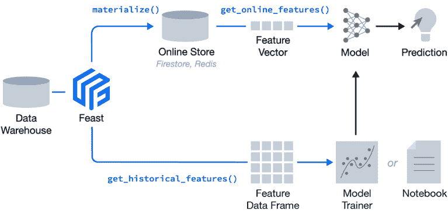

*Fig: Workflow with Feast [[Source](https://web.archive.org/web/20230117104424/https://feast.dev/)]*

3.  [SageMaker](https://web.archive.org/web/20230117104424/https://aws.amazon.com/sagemaker/)

Amazon SageMaker 功能商店是一个专门构建的存储库，您可以在其中存储和访问功能，因此在团队之间命名、组织和重用功能更加容易，无需编写额外的代码或创建手动流程来保持功能的一致性。

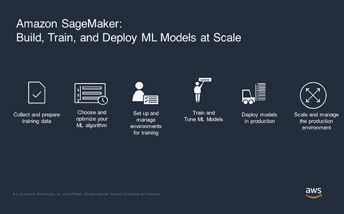

*Fig: Other features of Amazon SageMaker [[Source](https://web.archive.org/web/20230117104424/https://www.domo.com/domopalooza/resources/amazon-sagemaker-adoption)]*

4.  [字节跳动](https://web.archive.org/web/20230117104424/https://www.bytehub.ai/)

存储时间序列数据的另一个显著特征。这个开源、方便、基于 Python 的功能库提供了:

*   类似熊猫的数据和功能界面，
*   每个特征的时间序列，
*   用于元数据存储的数据库，
*   每个名称空间的数据存储位置，
*   与 Jupyter 笔记本等流行工具兼容。

## 模型开发

### 模型注册表

构建 ML 模型的核心思想是不断改进模型，这就是为什么 MLOps 增加了另一个关键的连续性支柱，称为持续培训(除了持续集成和持续发展)。模型注册中心通过维护模型血统、源代码版本和注释来帮助您完成这项任务。以下是您可以用来存储这些信息的一些工具及其主要功能，以帮助您进行选择:

1.  [MLflow](https://web.archive.org/web/20230117104424/https://www.mlflow.org/docs/latest/model-registry.html)

*   与团队分享 ML 模型。
*   从实验、在线测试、生产等等一起工作。
*   与批准和治理工作流集成。
*   监控 ML 部署及其性能。

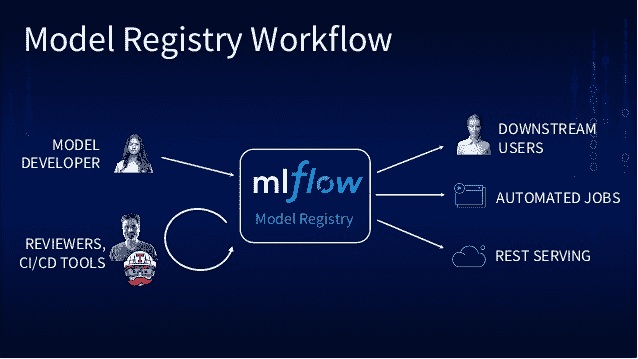

*Fig: MLflow workflow. [[Source](https://web.archive.org/web/20230117104424/https://image.slidesharecdn.com/summiteu19mateizahariacoreyzumar-191203175325/95/simplifying-model-management-with-mlflow-18-638.jpg?cb=1575396658)]*

2.  [海王星. ai](/web/20230117104424/https://neptune.ai/)

*   使用软件即服务，无需在硬件上部署。
*   与所有工作流程轻松集成。
*   笔记本版本和差异。

3.  [SageMaker 模型注册表](https://web.archive.org/web/20230117104424/https://docs.aws.amazon.com/sagemaker/latest/dg/model-registry.html)

*   生产的目录模型。
*   将元数据(如培训指标)与模型相关联。
*   管理模型版本和模型的批准状态。
*   使用 CI/CD 自动进行模型部署。

*Fig: CI/CD pipeline of SageMaker showcasing the importance of model registry. [[Source](https://web.archive.org/web/20230117104424/https://twitter.com/rzembo/status/1333927711799189506)]*

### 模特培训

在不了解 OpenCV 和 T2 Scikit-learn 的情况下，人们不会开始一个计算机视觉项目。模型建造中的一些火炬手是 [TensorFlow](https://web.archive.org/web/20230117104424/https://www.tensorflow.org/) 、 [PyTorch](https://web.archive.org/web/20230117104424/https://pytorch.org/) 和 [Keras](https://web.archive.org/web/20230117104424/https://keras.io/) 。您可以根据项目或您的兼容性选择其中的任何一个。如果你在为你的计算机视觉项目选择合适的框架方面有困难，请看看这个[博客](https://web.archive.org/web/20230117104424/https://www.simplilearn.com/keras-vs-tensorflow-vs-pytorch-article)。

如果您对构建自己的模型或微调流行模型不感兴趣，这里有一些带有预训练模型的计算机视觉平台，您可能会觉得有用:

1.  [视觉人工智能](https://web.archive.org/web/20230117104424/https://cloud.google.com/vision)

*   Google Cloud 的 Vision API 通过 REST 和 RPC APIs 提供了强大的预训练机器学习模型。
*   为图像分配标签，并快速将它们分类到数百万个预定义的类别中。
*   检测物体和人脸，阅读印刷和手写文本，并将有价值的元数据构建到您的图像目录中。

2.  [迪诺](https://web.archive.org/web/20230117104424/https://github.com/facebookresearch/dino)

*   PyTorch 实现和自我监督[视觉变压器](https://web.archive.org/web/20230117104424/https://ai.facebook.com/blog/dino-paws-computer-vision-with-self-supervised-transformers-and-10x-more-efficient-training)的预训练模型。
*   该模型可以发现和分割图像或视频中的对象，完全没有监督，也没有给定分割目标。
*   特征很容易解释，表明这类模型能够更好地理解图像

3.  [亚马逊索赔](https://web.archive.org/web/20230117104424/https://aws.amazon.com/rekognition/)

*   识别图像和视频中的对象、人物、文本、场景和活动，以及检测任何不适当的内容
*   提供基于亚马逊收集的数据的算法
*   您可以构建可在自定义数据集上训练的算法。

### 元数据管理

当您的 ML 管道的每个组件做出决定时，它会传递给下一个组件。元数据存储、存储和检索这些决策、使用的超参数以及在不同步骤使用的数据。以下是一些可以用作元数据存储的库:

1.  [海王星. ai](/web/20230117104424/https://neptune.ai/)

Neptune 支持许多不同类型的模型构建元数据的日志和显示，比如度量和损失、参数和模型权重等等。你可以看看他们的[现场笔记本](https://web.archive.org/web/20230117104424/https://colab.research.google.com//github/neptune-ai/neptune-colab-examples/blob/master/product-tours/how-it-works/showcase/Neptune-API-Tour.ipynb)了解更多。

2.  [SiaSearch](https://web.archive.org/web/20230117104424/https://www.siasearch.io/)

SiaSearch 是一个基于元数据高效探索视觉数据的平台。它简化了数据识别和困难搜索，有助于提高效率。它的一些特点是:

*   通过自动创建自定义间隔属性来结构化数据。
*   使用自定义属性进行查询，查找罕见的边缘案例，并整理新的训练数据。
*   轻松保存、编辑、版本化、注释和与同事共享帧序列。
*   使用自定义属性可视化数据并分析模型性能。

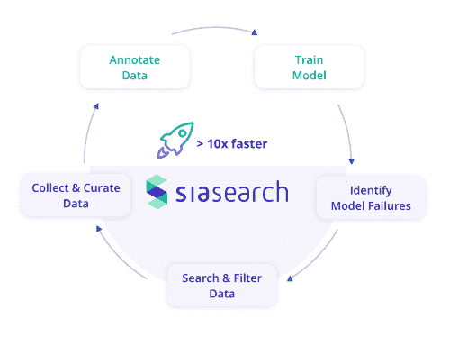

*Fig: Features of SiaSearch. [[Source](https://web.archive.org/web/20230117104424/https://www.siasearch.io/)]*

3.  [Tensorflow 的 ML 元数据](https://web.archive.org/web/20230117104424/https://www.tensorflow.org/tfx/guide/mlmd)

MLMD 在其数据库中登记了以下类型的元数据:

*   在您的 ML 管道的各个步骤中生成的工件。
*   关于这些组件执行的元数据。
*   血统信息。

### 超参数调谐

超参数调整为您提供了 ML 模型的最佳版本。如果你想知道关于超参数的重要性以及优化它们的不同方法，看看 Tanay Agrawal 的这本书。以下是可用于超参数调整的工具的简要列表:

1.  [远视](https://web.archive.org/web/20230117104424/https://github.com/hyperopt/hyperopt/wiki/FMin)

Hyperopt 让用户描述搜索空间。通过提供更多关于你的函数在哪里定义的信息，以及你认为最好的值在哪里，你允许 Hyperopt 中的算法更有效地搜索。

2.  [Dask](https://web.archive.org/web/20230117104424/https://ml.dask.org/hyper-parameter-search.html)

Dask-ML 类为超参数优化中最常见的两个问题提供了解决方案:

*   当超参数搜索受到存储器限制时，
*   或者当搜索受到计算限制时。

3.  [Optuna](https://web.archive.org/web/20230117104424/https://optuna.org/)

这种高度模块化的超参数优化框架允许用户动态构建搜索空间。Optuna 的一些主要特点是:

*   轻量级架构，
*   Pythonic 搜索空间，
*   易于并行化。

### 版本控制

版本控制，也称为源代码控制，跟踪和管理源代码的更改。它使团队能够工作并为相同的代码做出贡献。目前， [GitHub](https://web.archive.org/web/20230117104424/https://github.com/) 和 [GitLab](https://web.archive.org/web/20230117104424/https://about.gitlab.com/) 是版本控制事实上的标准。在使用大量数据进行计算机视觉项目时，您可能会遇到 Git 的问题，因为它只是为了版本化应用程序代码而设计的，而不是为了存储大量数据，也不支持 ML 管道。 [DVC](https://web.archive.org/web/20230117104424/https://dvc.org/) 解决了这个问题，也致力于应用程序代码版本化。如果你觉得 DVC 在这件事上太死板，有更好的用户界面和更多的功能，比如可以随时看到团队的进展，那么使用 [Neptune](/web/20230117104424/https://neptune.ai/) 可以证明是一个很大的优势。

看看 [Neptune 与数据版本控制](/web/20230117104424/https://neptune.ai/vs/dvc)相比如何

## 操作化

### 模型服务

模型服务通常是 ML 模型管道的最后一步。创建 CV 模型后，您必须决定在哪里部署您的模型，也就是说，您将使用哪个平台来服务您的模型？您可以选择本地服务器，但这可能会变得非常昂贵，并且难以大规模管理。以下是模型服务的一些工具:

1.  膨润土

服务、管理和部署机器学习模型的框架。BentoML 的一些关键特性包括:

*   支持多种 ML 框架，如 PyTorch、Tensorflow 和[等等](https://web.archive.org/web/20230117104424/https://github.com/bentoml/BentoML#ml-frameworks)。
*   使用 Docker、Kubernetes、OpenShift 等进行生产部署的容器化模型服务器。
*   最佳在线服务性能的自适应微批处理。

阅读[快速入门指南](https://web.archive.org/web/20230117104424/https://docs.bentoml.org/en/latest/quickstart.html)了解更多关于 BentoML 的基本功能。你也可以在 Google Colab 上试试[。](https://web.archive.org/web/20230117104424/https://colab.research.google.com/github/bentoml/BentoML/blob/master/guides/quick-start/bentoml-quick-start-guide.ipynb)

2.  [张量流发球](https://web.archive.org/web/20230117104424/https://www.tensorflow.org/tfx/guide/serving)

为生产环境设计的机器学习模型的灵活系统。一些关键特征是:

*   允许在不更改代码的情况下部署新的模型版本。
*   支持许多 servables。
*   可服务的大小和粒度是灵活的。

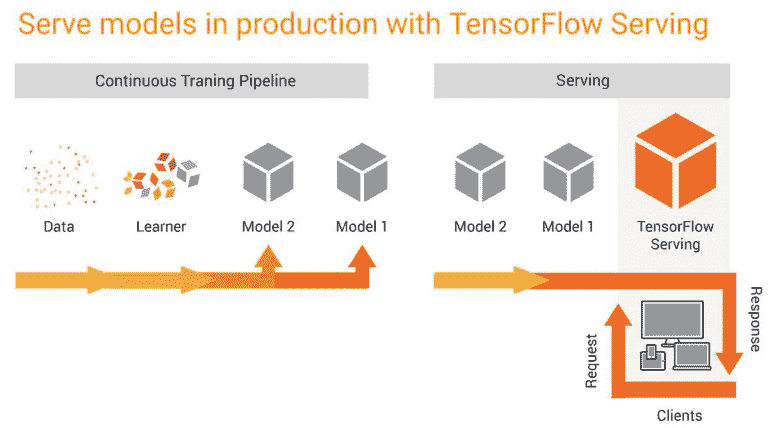

*Fig: Serve models in production with TensorFlow Serving [[Source](https://web.archive.org/web/20230117104424/https://twitter.com/tensorflow/status/832008382408126464)]*

3.  [谢顿](https://web.archive.org/web/20230117104424/https://github.com/SeldonIO/seldon-core)

它专注于解决任何机器学习项目中的最后一步，以帮助公司将模型投入生产，解决现实世界的问题，并实现投资回报的最大化。

*   为基于任何开源或商业模型构建格式构建的模型提供服务。
*   它可以处理成千上万的生产机器学习模型。
*   使用预先打包的推理服务器、定制服务器或语言包装器，提供一种简单的方法来容器化定制 ML 模型。

### CI/CD/CT

与软件应用程序不同，ML 中的训练数据起着至关重要的作用。没有训练就不能测试模型的有效性。这就是为什么通常的 CI/CD 过程在 ML 开发中通过增加持续培训而得到增强。这里是我能找到的在你的机器学习管道中实现 CI/CD 的一些最好的库:

1.  [CML](https://web.archive.org/web/20230117104424/https://cml.dev/)

CML 可用于自动化部分开发工作流程，包括模型训练和评估、跨项目历史比较 ML 实验，以及监控数据集。

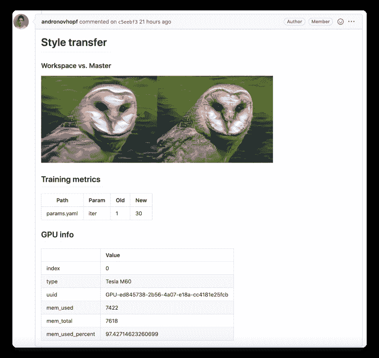

*Fig: on every pull request, CML helps you automatically train and evaluate models, then generates a visual report with results and metrics, like the report above [[Source](https://web.archive.org/web/20230117104424/https://github.com/iterative/cml)]*

2.  循环

CircleCI 可以配置为使用复杂的缓存、docker 层缓存、用于在更快的机器上运行的资源类以及性能定价来高效地运行复杂的管道。

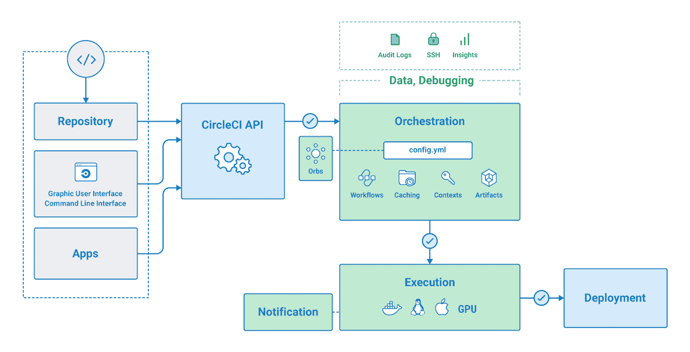

*Fig: Overview of CircleCI [[Source](https://web.archive.org/web/20230117104424/https://circleci.com/docs/2.0/about-circleci/)]*

3.  [特拉维斯 CI](https://web.archive.org/web/20230117104424/https://docs.travis-ci.com/)

Travis CI 是一个托管的持续集成服务，用于构建和测试项目。它在您的硬件上提供专有版本的定制部署。

## 监视

模型监控允许您在生产中不断调整和改进您的模型。在高度发展的 MLOps 工作流中，这应该是一个活动的过程。监控有三个方面:

*   **技术/系统监控检查**模型基础设施是否得到正确服务。
*   **模型监控**不断验证预测的准确性。
*   **业务绩效监控**归结于模型是否对业务有帮助。监控版本变化的影响是必要的。

我将分享四个你可以用来监控生产的工具。如果您正在寻找更广泛的 ML 监控工具列表，请访问[本文](/web/20230117104424/https://neptune.ai/blog/ml-model-monitoring-best-tools)。

1.  [海王星](https://web.archive.org/web/20230117104424/https://neptune.ai/)

这是监控你的模型的最轻便的工具之一。它可以版本化、存储、组织和查询模型，以及模型开发元数据。以下是使其独一无二的一些特征:

*   它通过在仪表板中过滤、排序和分组模型训练运行，帮助您更好地组织您的工作。
*   它帮助您**比较表格**中的指标和参数，自动发现运行和异常之间的变化。
*   整个**团队可以跟踪在脚本中执行的实验**，并在任何基础设施(云、笔记本电脑、集群)上执行。

2.  [提琴手](https://web.archive.org/web/20230117104424/https://www.fiddler.ai/)

Fiddler 帮助您监控模型性能，解释和调试模型预测，分析整个数据和切片的模型行为，大规模部署机器学习模型，以及管理您的机器学习模型和数据集。

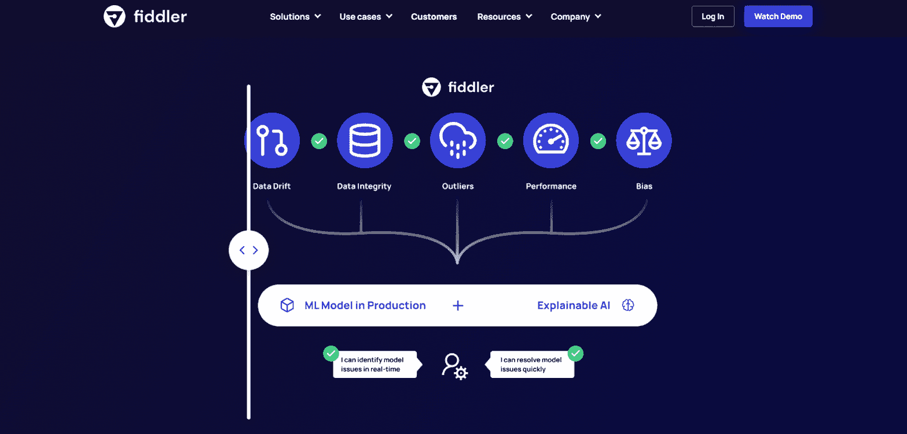

*Fig: Features fiddler helps with monitoring [[Source](https://web.archive.org/web/20230117104424/https://www.fiddler.ai/ml-monitoring)]*

3.  [显然](https://web.archive.org/web/20230117104424/https://github.com/evidentlyai/evidently)

显然有助于在生产中分析机器学习模型或进行验证。

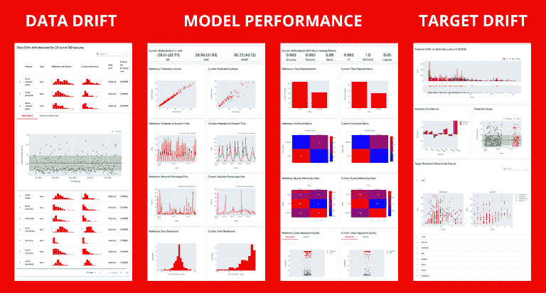

*Fig: Example of an interactive report generated by evidently to help analyze, monitor, and debug [[Source](https://web.archive.org/web/20230117104424/https://github.com/evidentlyai/evidently)]*

4.  [亚马逊 SageMaker 模型监视器](https://web.archive.org/web/20230117104424/https://aws.amazon.com/sagemaker/model-monitor/)

SageMaker 中的一个工具，通过自动检测和警告生产中部署的模型的不准确预测，帮助您维护高质量的机器学习模型。

## 自动化

到目前为止，我已经讨论了可以用于 ML 管道的一个或几个组件的库和工具。但是，如果您热衷于从收集和管理数据到在生产中部署和监控数据的整个流程的自动化，也有工具可以做到这一点！

我们将研究两种类型的自动化及其相关工具:

### AutoML

各种 AutoML 框架自动化了机器学习生命周期的各个步骤。我管理的列表是将用户从算法选择和超参数调整中解放出来的工具，并构建一个准备部署的模型。

1.  [自定义视觉](https://web.archive.org/web/20230117104424/https://azure.microsoft.com/en-in/services/cognitive-services/custom-vision-service/)

这是一个将计算机视觉应用于特定场景的端到端平台。

*   为特定领域定制和嵌入最先进的计算机视觉图像分析。
*   在云中或容器边缘运行自定义视觉。
*   依靠企业级安全性和隐私保护您的数据和任何训练有素的模型。

2.  [自动视觉](https://web.archive.org/web/20230117104424/https://cloud.google.com/vision/automl/docs)

**AutoML Vision** 使您能够训练机器学习模型，根据您自己定义的标签对您的图像进行分类。

*   从标记的图像中训练模型并评估它们的性能。
*   对带有未标记图像的数据集利用人工标记服务。
*   注册通过 AutoML API 提供服务的训练模型。

3.  [TPOT](https://web.archive.org/web/20230117104424/http://epistasislab.github.io/tpot/)

TPOT 是一个基于树的管道优化工具，它使用遗传算法来优化机器学习管道。

*   它建立在 scikit-learn 之上，使用它的回归器和分类器方法。
*   它需要一个干净的数据集。
*   它进行特征处理、模型选择和超参数优化，以返回性能最佳的模型。

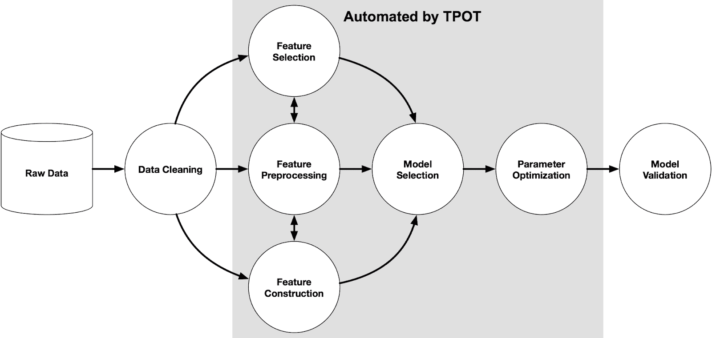

*Fig: an example machine learning pipeline devised by TPOT [[Source](https://web.archive.org/web/20230117104424/https://epistasislab.github.io/tpot/)]*

4.  [自动 sklearn](https://web.archive.org/web/20230117104424/https://github.com/automl/auto-sklearn)

Auto-sklearn 是一个自动化的机器学习工具包。它是 scikit-learn 估计器的替代产品。需要记住的一些事情是:

*   它使用简单，代码最少。[举例](https://web.archive.org/web/20230117104424/https://automl.github.io/auto-sklearn/master/#example)。
*   Auto-sklearn 库适用于中小型数据集，不适用于大型数据集。
*   它没有训练先进的深度学习模型，这些模型可能在大型数据集上表现良好。

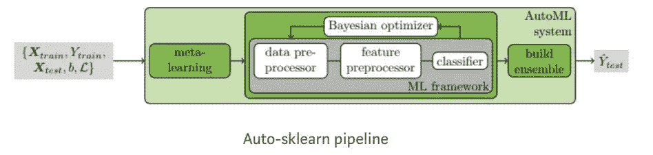

*Fig: Auto-sklearn pipeline [[Source](https://web.archive.org/web/20230117104424/https://link.springer.com/chapter/10.1007/978-3-030-05318-5_6)]*

5.  [MLBox](https://web.archive.org/web/20230117104424/https://mlbox.readthedocs.io/en/latest/)

MLBox 是一个强大的自动化机器学习 Python 库。它的一些功能包括:

*   快速阅读和分布式数据预处理。
*   稳健的特征选择和泄漏检测。

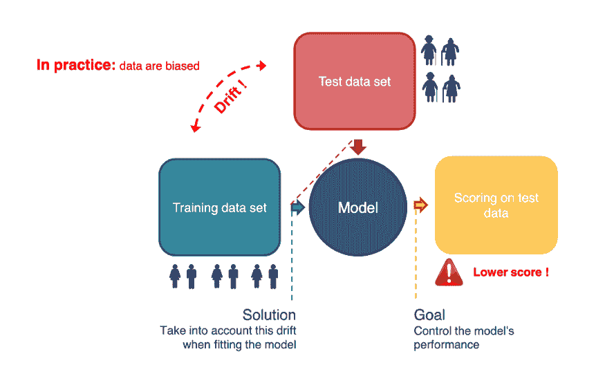

*Fig: representation of how MLBox works [[Source](https://web.archive.org/web/20230117104424/https://medium.datadriveninvestor.com/automl-in-python-an-overview-of-the-mlbox-package-208118a7fe5)]*

### MLOps 自动化

1.  [Algorithmia](https://web.archive.org/web/20230117104424/https://algorithmia.com/)

Algorithmia 是一个基于企业的 MLOps 平台，可加速您的研究并快速、安全且经济高效地交付模型。

*   您可以安全地部署、服务、管理和监控您的所有机器学习工作负载。
*   它使用自动化机器学习管道进行版本控制、自动化、日志记录、审计和容器化。您可以轻松访问 KPI、性能指标和监控数据。
*   它的功能将向您清楚地展示风险、合规性、成本和性能。

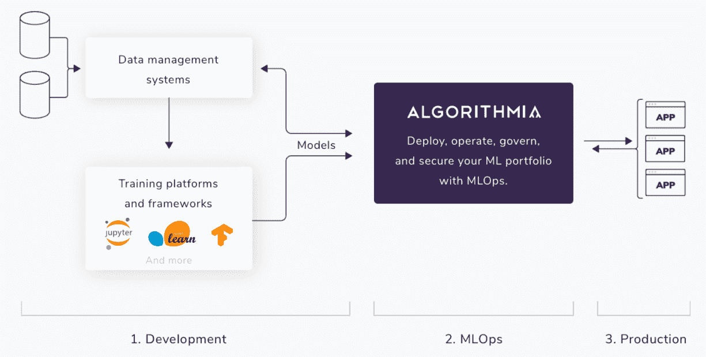

*Fig: How Algorithmia operates [[Source](https://web.archive.org/web/20230117104424/https://algorithmia.com/product)]*

2.  [Kubeflow](https://web.archive.org/web/20230117104424/https://github.com/kubeflow/kubeflow)

Kubeflow 是一个开源和免费的机器学习 Kubernetes-native 平台，用于开发、编排、部署和运行可扩展和可移植的机器学习工作负载。

3.  [Azure 机器学习](https://web.archive.org/web/20230117104424/https://azure.microsoft.com/en-in/services/machine-learning/)

Azure ML 是一个基于云的平台，可以用来训练、部署、自动化、管理和监控你所有的机器学习实验。它有自己强大的开源平台 [MLOps 平台](https://web.archive.org/web/20230117104424/https://github.com/microsoft/MLOps)，简化了 ML 的创建和部署。要了解更多，请访问 Azure 的[文档](https://web.archive.org/web/20230117104424/https://docs.microsoft.com/en-in/azure/machine-learning/)。

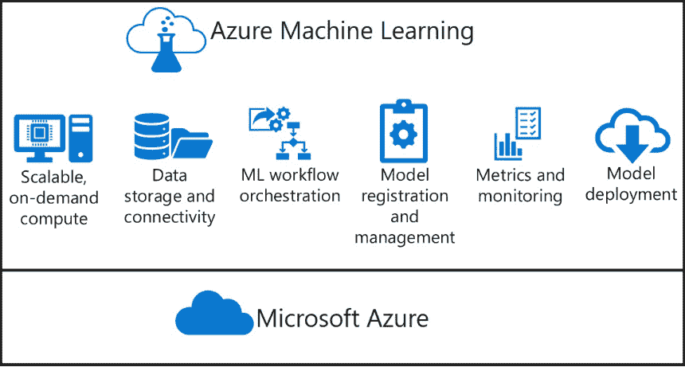

*Fig: Features of Azure Machine Learning [[Source](https://web.archive.org/web/20230117104424/https://docs.microsoft.com/en-in/azure/machine-learning/)]*

4.  [坡度](https://web.archive.org/web/20230117104424/https://gradient.paperspace.com/)

Gradient 为模型开发、协作和部署提供了轻量级的软件和基础设施。gradient 提供的一些服务包括:

*   自动化版本控制、标签和生命周期管理的全面**再现性**。
*   **自动化流水线**:梯度作为机器学习的 CI/CD。
*   **即时可扩展性**:并行训练，轻松扩展部署的模型。

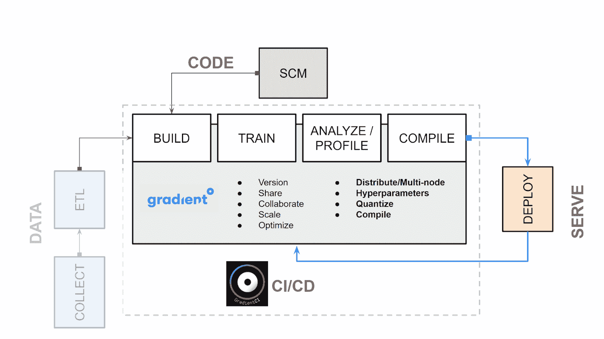

*Fig: Workflow of Gradient [[Source](https://web.archive.org/web/20230117104424/https://blog.paperspace.com/paperspace-gradient-vs-amazon-sagemaker/)]*

## 结论

总之，在生产中实现您的计算机视觉项目并不意味着只将模型作为 API 部署到生产中。

相反，它意味着部署一个 ML 管道，这个管道在不同的阶段是自动化的，并且有助于更快地改进您的模型。设置 CI/CD 系统使您能够自动测试和部署新的管道实现。

该系统将帮助您应对数据和业务的快速变化。这并不意味着你会立即将所有的过程从一个层次转移到另一个层次。不要操之过急！您应该逐步实施这些实践来帮助提高您的 ML 系统开发和生产的自动化。

## 资源

### 文章

### 书

### 录像

### 松弛的

### 网站*