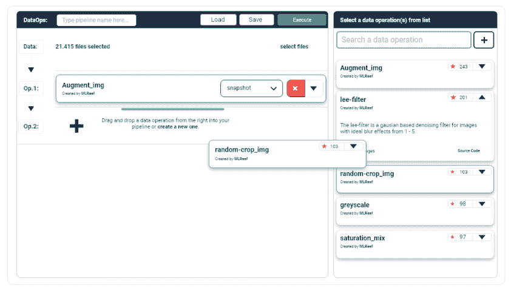
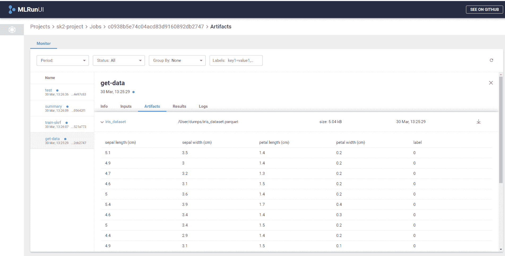
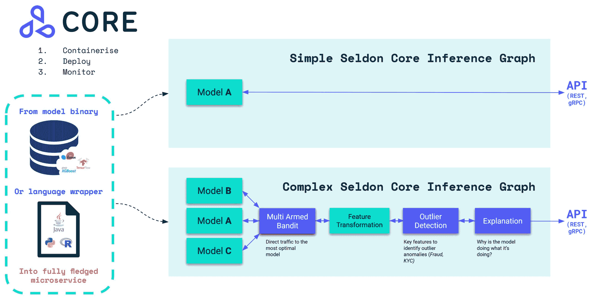
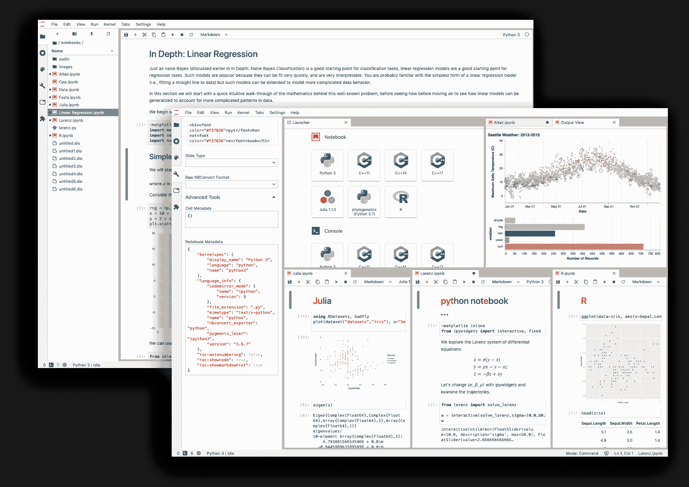
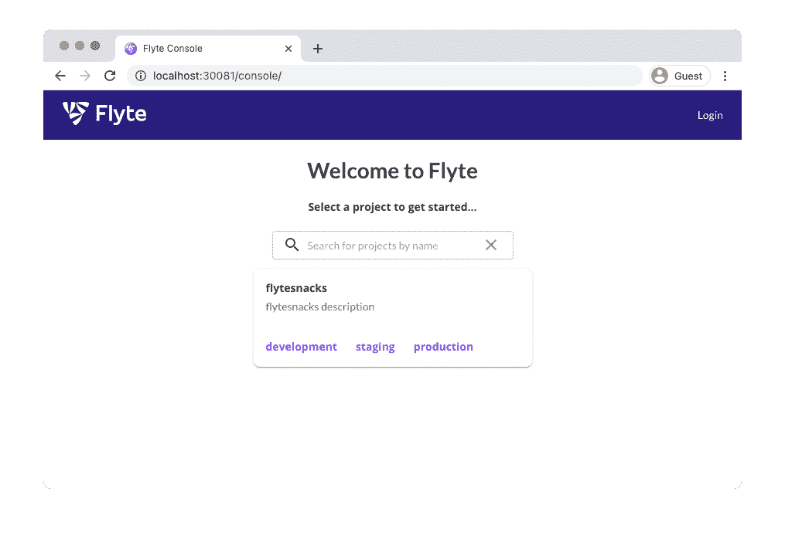

# 你应该知道的最好的开源 MLOps 工具

> 原文：<https://web.archive.org/web/https://neptune.ai/blog/best-open-source-mlops-tools>

你不需要在 [MLOps 工具](/web/20221206023228/https://neptune.ai/blog/best-mlops-tools)上花很多钱，就能把 DevOps 的魔力带到你的机器学习项目中。有大量开源工具可供选择。当你试图解决独特的问题，并且需要一个可以依赖的社区时，这是一个很好的解决方案。但是也有一些倾向于开源工具。

*   首先，要小心——开源工具并不总是 100%免费的。例如，Kuberflow 有客户端和服务器组件，并且都是开放的。然而，有些工具可能只开放其中一个组件的源代码。客户端是开放的，但是供应商控制着服务器端的一切。
*   免费的开源工具也会让你在其他方面付出代价。如果你考虑到你必须长期托管和维护这个工具，你会发现开源毕竟是非常昂贵的。
*   最后，如果出现问题，您可能无法依靠 24/7/365 的供应商支持。社区可以帮助你，但是很明显，他们对你留下的结果不负任何责任。

最终，开源工具可能会很棘手。在为您的项目选择工具之前，您需要仔细研究它的优缺点。此外，您需要确保这些工具能够与您的堆栈的其他部分很好地协作。这就是为什么我为模型开发过程的不同阶段准备了一个流行的和社区认可的 MLOps 工具的列表。

在这个列表中，你会发现成熟的机器学习平台，以及帮助你进行数据探索、部署和测试的专业工具。

### 成熟的平台

成熟的平台包含机器学习工作流程所有阶段的工具。理想情况下，一旦你有了一个成熟的工具，你就不需要设置任何其他的工具。实际操作中，要看你的项目需求和个人喜好。

#### 1\. Kubeflow

几乎就在 Kubernetes 确立了自己作为处理集群容器的标准之后，Google 创建了 T2 kube flow——一个开源项目，简化了在 Kubernetes 中处理 ML 的工作。它拥有这种编排工具的所有优势，从在任何基础设施上部署的能力到管理松散耦合的微服务，以及按需扩展。

这个项目是为开发人员谁想要部署可移植和可扩展的机器学习项目。谷歌不想再造其他服务。他们希望创建一个最先进的开源系统，可以与各种基础设施(从超级计算机到笔记本电脑)一起应用。

[https://web.archive.org/web/20221206023228if_/https://www.youtube.com/embed/cTZArDgbIWw?feature=oembed](https://web.archive.org/web/20221206023228if_/https://www.youtube.com/embed/cTZArDgbIWw?feature=oembed)

视频

**MLOps open-source tool:* MLflow | [Source](https://web.archive.org/web/20221206023228/https://www.youtube.com/watch?v=cTZArDgbIWw&ab_channel=GoogleCloudTech)*

使用 Kuberflow，您可以受益于以下功能:

创建和定制 Jupyter 笔记本，立即查看运行代码的结果，创建交互式分析报告。

*   **自定义张量流作业运算符**

此功能有助于训练您的模型，并应用 TensorFlow 或 Seldon 核心服务容器将模型导出到 Kubernetes。

*   **简化集装箱化**

Kuberflow 消除了将代码容器化的复杂性。数据科学家可以在更短的时间内完成数据准备、培训和部署。

总而言之，Kuberflow 是一个用于端到端 ML 工作流开发和部署的成熟解决方案。

#### 2.MLflow

MLflow 是一个开源平台，机器学习工程师可以通过实验、部署和测试来管理 ML 生命周期。当您想要跟踪模型的性能时，MLflow 就派上了用场。它就像一个仪表板，在这里您可以:

*   监控 ML 管道，
*   存储模型元数据，以及
*   挑选表现最好的型号。

*MLOps open-source tool: MLflow | [Source](https://web.archive.org/web/20221206023228/https://www.mlflow.org/docs/latest/tutorials-and-examples/tutorial.html#training-the-model)*

目前，MLflow 提供了四个组件:

MLflow 跟踪组件是一个 API 和 UI，用于记录参数、代码版本、指标以及运行代码和可视化结果的输出文件。您可以使用 Python、REST、R API 和 Java APIs 进行日志和查询实验。你也可以记录结果。

MLflow 项目是 ML 团队以可重用和可复制的方式打包数据科学代码的工具。它附带了一个 API 和命令行工具来将项目连接到工作流中。它可以帮助你在任何平台上运行项目。

MLflow 模型可以轻松打包机器学习模型，供各种下游工具使用，如 Apache Spark。这样，在不同的服务环境中部署机器学习模型就更容易管理了。

总的来说，用户喜欢 MLflow，因为它易于在本地使用，无需专用服务器，并且有一个奇妙的 UI，您可以在其中探索您的实验。

[网飞创建了 Metaflow](https://web.archive.org/web/20221206023228/https://metaflow.org/) 作为一个开源的 MLOps 平台，用于构建和管理大规模的企业级数据科学项目。数据科学家可以使用这个平台进行端到端的开发和部署他们的机器学习模型。

Metaflow 支持所有流行的数据科学库，如 TensorFlow 和 scikit-learn，因此您可以继续使用您最喜欢的工具。Metaflow 支持 Python 和 R，这使得它在库和包选择方面更加灵活。

*   **强大的版本控制工具包**

Metaflow 的优秀之处在于，它可以自动对你的所有实验进行版本化和跟踪。你不会丢失任何重要的东西，你甚至可以在笔记本上检查所有实验的结果。

如上所述，Metaflow 是专门为大规模机器学习开发而创建的。AWS 云为解决方案提供支持，因此如果您需要扩展，可以内置 AWS 的存储、计算和机器学习服务。您不必重写或更改代码来使用它。

#### 4.MLReef

**MLOps open-source tool:* MLReef | [Source](https://web.archive.org/web/20221206023228/https://about.mlreef.com/)*

MLReef 是一个 MLOps 平台，供团队合作并分享他们的机器学习实验结果。项目是建立在可重用的 ML 模块之上的，这些模块可以由你或者社区来实现。这提高了开发速度，并通过促进并发性使工作流更加高效。

MLReef 提供了四个方向的工具:

您拥有一个完全版本化的数据托管和处理基础架构来设置和管理您的模型。

每个开发人员都可以访问容器化和版本化的脚本库，您可以在您的机器学习管道中使用它们。

您可以使用 MLReef 在项目的不同迭代中进行实验跟踪。

该解决方案可帮助您优化管道管理和流程编排，自动化日常任务。

此外，MLReef 欢迎任何规模的项目。新手可以将它用于小规模项目，有经验的开发人员可以将它用于小型、中型和企业项目。

如果你没有太多开发 ML 模型的经验，你会发现一个用户友好的界面和社区支持来解决你可能面临的任何问题。

MLReef 允许您在 Git 上构建项目，同时为您处理所有 DevOps 的混乱。您可以在自动化环境中轻松监控进度和结果。

MLReef for enterprise 易于在云中或内部进行扩展和控制。

总而言之，MLReef 是您 ML 项目的一个方便的框架。只需几个简单的设置，您就能够一砖一瓦地开发、测试和优化您的 ML 解决方案。

#### 5\. Kedro

Kedro 是一个 Python 框架，用于机器学习工程师和数据科学家创建可复制和可维护的代码。

如果你想组织你的数据管道并使 ML 项目开发更有效，这个框架是你最好的朋友。您不必在代码重写上浪费时间，并且将有更多的机会关注健壮的管道。此外，Kedro 帮助团队建立协作标准，以限制延迟并构建可伸缩、可部署的项目。

*MLOps open-source tool: Kedro | [Source](https://web.archive.org/web/20221206023228/https://kedro.readthedocs.io/en/stable/03_tutorial/06_visualise_pipeline.html)*

Kedro 有很多好的特性:

通常，你必须花很多时间去了解如何建立你的分析项目。Kedro 提供了一个标准模板，可以节省您的时间。

Kedro 将帮助您加载和存储数据，不再担心代码的可重复性和可伸缩性。

当你在处理复杂的软件系统时，这是一个必要的工具。如果您对配置管理不够重视，您可能会遇到严重的可靠性和可伸缩性问题。

Kedro 提倡一种数据驱动的 ML 开发方法，并在降低业务运营风险的同时维护行业标准。

如果您想利用组织良好的 Kedro 管道和强大的 Neptune UI 来组织和比较管道和节点中生成的 ML 元数据，请查看 [Neptune-Kedro 插件](https://web.archive.org/web/20221206023228/https://docs.neptune.ai/integrations-and-supported-tools/automation-pipelines/kedro)。

MLOps 中的开发和部署工具可跨多个环境自动执行手动部署的日常任务。您可以通过更方便的工具进行部署，这取决于您使用的平台堆栈。

#### 6.ZenML

*MLOps open-source tool: ZenML | [Source](https://web.archive.org/web/20221206023228/https://www.youtube.com/watch?v=Stg5rA_0oa8&ab_channel=maiot)*

ZenML 是一个 MLOps 框架，用于编排你的 ML 实验管道。它为您提供了以下工具:

ZenML 帮助您将原始数据转换成可供分析的数据。

在其他方便培训的工具中，该平台使用声明式管道配置，因此您可以在内部和云环境之间轻松切换。

ZenML 的创造者声称，该平台的主要好处是自动跟踪实验，并保证实验之间的可比性。

XML 致力于使 ML 开发对于个人开发人员和大型团队来说都是可重复和简单的。

这个框架让你摆脱了用传统工具交付机器学习模型的所有麻烦。如果您努力提供足够的实验数据来证明结果的可重复性，希望减少浪费并使代码的重用更简单，ZenML 将会有所帮助。

#### 7.MLRun

[MLRun](https://web.archive.org/web/20221206023228/https://www.iguazio.com/open-source/mlrun/) 是 ML 模型开发和部署的工具。如果您正在寻找一种可以方便地在各种环境中运行并支持多种技术堆栈的工具，它绝对值得一试。MLRun 提供了管理数据管道的综合方法。

*MLOps open-source tool: MLRun | [Source](https://web.archive.org/web/20221206023228/https://github.com/mlrun/mlrun)*

MLRun 具有分层架构，可提供以下强大功能:

*   **功能和工件存储**

这一层帮助您处理数据的准备和处理，并跨不同的存储库存储数据。

*   **弹性无服务器运行时层**

将简单的代码转换成易于扩展和维护的微服务。它与 Kubernetes jobs、Dask 和 Apache Spark 等标准运行时引擎兼容。

为了让您专注于训练模型和微调超参数，pipeline automation 工具可帮助您进行数据准备、测试和实时部署。你只需要提供你的监督来创建一个最先进的 ML 解决方案。

在这里，您可以访问统一的控制面板来管理您的整个工作流程。MLRun 有一个方便的用户界面、一个 CLI 和一个您可以在任何地方访问的 SDK。

使用 MLRun，您可以编写一次代码，然后使用自动化解决方案在不同的平台上运行它。该工具管理构建过程、执行、数据移动、缩放、版本控制、参数化、输出跟踪等等。

#### 8.currentmodelogic 电流型逻辑的

[CML](https://web.archive.org/web/20221206023228/https://cml.dev/) (持续机器学习)是机器学习项目持续集成和交付(CI / CD)的库。该库是由 DVC 的创建者开发的，这是一个用于对 ML 模型和实验进行版本控制的开源库。CML 应该与 DVC、Tensorboard 和云服务一起，促进开发和实现 ML 模型到产品中的过程。

*   **自动化管道建设**

CML 被设计用来自动化 ML 工程师的一些工作，包括训练实验、模型评估、数据集以及它们的添加。

该工具被定位为支持数据科学项目 GitFlow 的库，允许自动生成报告，并隐藏使用外部服务的复杂细节。外部服务的例子包括云平台:AWS、Azure、GCP 等等。对于基础设施任务，也使用 DVC、docker 和 Terraform。最近，有一个 ML 项目的基础设施方面吸引了更多的注意力。

该库非常灵活，提供了广泛的功能；从发送报告和发布数据，到为项目分发云资源。

#### 9.Cortex 实验室

[Cortex Labs](https://web.archive.org/web/20221206023228/https://www.cortex.dev/) 是一家由伯克利科学家开发的早期创业公司。他们正在为神经科学家开发一种方便的工具，帮助他们理解大脑是如何工作的。这个应用程序的用途变得更加广泛。

Cortex Lab 项目很有趣，因为它允许您部署、管理和扩展容器，而不用担心 Kubernetes。它在 AWS 上将容器作为服务提供。

如果您决定将 Cortex 纳入您的技术体系，您将受益于以下特性:

Cortex 可以实时处理请求，并根据进行中的请求量自动扩展。

*   **自动化集群管理**

Cortex 使集群自动扩展变得容易。很容易用不同的参数创建集群。

*   **CI/CD 和可观察性集成**

Cortex 允许您使用声明性配置创建供应集群。

Cortex Lab 旨在与 AWS 顺利集成。它运行在 EKS 之上，能够可靠、经济地扩展工作负载。您可以使用此工具来处理图像和视频处理的数据密集型模型。微服务架构使其易于扩展，没有任何资源限制。

#### 10.塞尔顿核心

*MLOps open-source tool: Seldon Core | [Source](https://web.archive.org/web/20221206023228/https://github.com/SeldonIO/seldon-core)*

[Seldon Core](https://web.archive.org/web/20221206023228/https://github.com/SeldonIO/seldon-core) 是 Kubernetes 上 ML 模型部署的平台。这个工具可以帮助开发人员在一个健壮的 Kubernetes 环境中构建模型，具有定制资源定义等特性来管理模型图。您还可以将该工具与您的持续集成和部署工具合并。

Seldon core 可以将你建立在 TensorFlow、PyTorch、H2O 等框架上的模型转换成基于 REST/GRPC 的可扩展微服务架构。

*   **监控模型性能**

它将为您处理缩放，并为您提供测量模型性能、检测异常值和进行开箱即用的 A/B 测试的高级解决方案。

Seldon Core 可以夸耀通过持续维护和安全策略更新支持的系统的健壮性和可靠性。

Seldon Core 提供的优化服务器可以让你建立大规模的深度学习系统，而不必将其容器化或担心其安全性。

#### 11.汽车经销商

AutoKeras 是一个用于自动机器学习(AutoML)的开源库。使用 AutoML 框架，您可以自动处理原始数据，选择机器学习模型，并优化学习算法的超参数。

*   **简化 ML 模型开发**

AutoML 减少了人类开发机器学习模型时出现的偏差和差异，并简化了机器学习模型的开发。

*   **享受自动化超参数调谐**

AutoKeras 是一种工具，它提供了自动匹配深度学习模型的架构和超参数的功能。

AutoKeras 最出名的是它的灵活性。在这种情况下，无论后端如何，您编写的代码都将被执行。它支持 Theano、Tensorflow 和其他框架。

AutoKeras 内部有几个训练数据集。它们已经以方便工作的形式放置，但它没有向您展示 AutoKeras 的全部功能。事实上，它包含了对文本、图片和时间序列进行适当预处理的工具。换句话说，最常见的数据类型，这使得数据准备过程更易于管理。该工具还具有内置的模型可视化功能。

#### 12.H2O 汽车公司

[https://web.archive.org/web/20221206023228if_/https://www.youtube.com/embed/-3dcNUrq_fQ?feature=oembed](https://web.archive.org/web/20221206023228if_/https://www.youtube.com/embed/-3dcNUrq_fQ?feature=oembed)

视频

*MLOps open-source tool: H2O Auto ML | [Source](https://web.archive.org/web/20221206023228/https://www.youtube.com/watch?v=-3dcNUrq_fQ&ab_channel=H2O.ai)*

[H2O.ai](https://web.archive.org/web/20221206023228/https://www.h2o.ai/products/h2o-automl/) 是一个使用 AutoML 优化机器学习过程的软件平台。H2O 声称，该平台可以比 scikit-learn 等流行的机器学习库更快地训练模型。

H2O 是一个机器学习，预测数据分析平台，用于建立机器学习模型，并为它们生成 Java 和 Python 的生产代码，只需点击一个按钮。

*   **实施现成的 ML 模型**

它实现了监督和非监督算法，如 GLM 和 K-Means，以及一个易于使用的 web 界面，称为 Flow。

该工具对初学者和经验丰富的开发人员都有帮助。它为编码器配备了一个简单的包装器函数，用几行代码管理与建模相关的任务。经验丰富的 ML 工程师欣赏这一功能，因为它允许他们专注于其他更需要思考的建模过程(如数据探索和特征工程)。

总的来说，H2O 是解决机器学习和数据科学问题的强大工具。即使是初学者也能从数据中提取价值，建立稳健的模型。H2O 继续发展并发布新产品，同时保持全面的高质量。

### 数据有效性

数据验证是检查数据质量的过程。在此阶段，您要确保集合中没有不一致或缺失的数据。数据验证工具自动化了这一常规过程，并提高了数据清理的质量。

#### 13.Hadoop

Hadoop 是一组可免费再分发的实用程序、库和框架，用于开发和执行在集群上运行的程序。这种存储和处理大数据的基础技术是 Apache 软件基金会的顶级项目。

该项目包括 4 个主要模块:

Hadoop Common 是一组基础设施软件库和实用程序，用于其他解决方案和相关项目，特别是用于管理分布式文件和创建必要的基础设施。

*   **HDFS 是一个分布式文件系统**

Hadoop 分布式文件系统是一种在各种数据服务器上存储文件的技术，其地址位于一个特殊的名称服务器上。HDFS 为分布在计算集群节点之间的大文件提供可靠的逐块存储。

*   **YARN 是一个任务调度和集群管理系统**

YARN 是一组系统程序，提供分布式应用程序的共享、可伸缩性和可靠性。

这是一个用于编程和执行分布式 MapReduce 计算的平台，使用许多计算机组成一个集群。

今天，Hadoop 中有一个完整的相关项目和技术生态系统，用于数据挖掘和机器学习。

#### 14.火花

[Apache Spark](https://web.archive.org/web/20221206023228/https://spark.apache.org/) 帮助你处理半结构化的内存数据。Spark 的主要优势是性能和用户友好的编程界面。

该框架有五个组件:一个核心和四个库，每个解决一个特定的问题。

这是框架的核心。您可以将它用于调度和核心 I/O 功能。

Spark SQL 是处理数据时方便使用的四个框架库之一。为了运行得更快，该工具使用数据帧，并可以充当分布式 SQL 查询引擎。

这是一个易于使用的流数据处理工具。它将数据分解为微批量模式。Spark 的创造者声称，性能不会因此受到很大影响。

这是一个高速分布式机器学习系统。在对交替最小二乘(ALS)算法进行基准测试时，它比其竞争对手 Apache Mahout 库快 9 倍。MLlib 包括用于分类、回归和推荐系统的流行算法。

GraphX 是一个用于可伸缩图形处理的库。GraphX 不适合以事务方式变化的图形，例如数据库。

Spark 是完全自主的，但是如果需要的话，它也可以与其他标准的 ML 工具兼容，比如 Hadoop。

参见: [Apache Spark 教程](https://web.archive.org/web/20221206023228/https://neptune.ai/blog/apache-spark-tutorial)

### 数据探索

数据探索软件是为自动化数据分析而创建的，可提供简化的模式识别和轻松的洞察力可视化。数据探索是一个认知密集型的过程，你需要强大的工具来帮助你跟踪和执行代码。

#### 15.Jupyter 笔记型电脑

[Jupyter Notebook](https://web.archive.org/web/20221206023228/https://jupyter.org/) 是一个开发环境，在这里你可以立即看到执行代码及其片段的结果。与传统 IDE 的不同之处在于，代码可以分成块，并以任意顺序执行。您可以将文件加载到内存中，单独检查其内容，也可以单独处理内容。

*MLOps open-source tool: Jupyter Notebook | [Source](https://web.archive.org/web/20221206023228/https://www.google.com/url?sa=i&url=https%3A%2F%2Fjupyter.org%2F&psig=AOvVaw0WQsQ17jIULW7Y6p-OebPB&ust=1633594981862000&source=images&cd=vfe&ved=0CAsQjRxqFwoTCMjFx9ettfMCFQAAAAAdAAAAABAD)*

通常当我们谈论 Jupyter Notebook 时，我们指的是使用 Python。但是，事实上，您可以使用其他语言，比如 Ruby、Perl 或 r。

在云中使用 Jupyter 笔记本最简单的方法是使用 Google Colab。这意味着您只需启动浏览器并打开所需页面。之后云系统会给你分配资源，允许你执行任何代码。

好处是你不需要在电脑上安装任何东西。云处理一切，你只需编写和运行代码。

### 数据版本控制系统

在您完成之前，将会有多个 ML 模型版本。为了确保不丢失任何东西，使用一个健壮的、可信赖的数据版本控制系统，其中的每一个变化都是可跟踪的。

#### 16.数据版本控制(DVC)

DVC 是为管理 ML 项目中的软件版本而设计的工具。这对于实验和将模型部署到生产中都很有用。DVC 运行在 Git 之上，使用 Git 的基础设施，并且有相似的语法。

*   **全自动版本控制**

DVC 创建元文件来描述需要保存在项目的 Git 历史中的管道和版本控制文件。如果你在 DVC 的控制下转移一些数据，它将开始跟踪所有的变化。

*   **基于 Git 的修改跟踪**

您可以像使用 Git 一样处理数据:保存一个版本，发送到远程存储库，获取所需的数据版本，在版本之间进行更改和切换。DVC 界面直观清晰。

总的来说，DVS 是一个优秀的数据和模型版本化工具。如果您不需要管道和远程存储库，您可以为在本地机器上工作的特定项目版本化数据。DVC 可以让你快速处理数十亿字节的数据。

然而，它也允许你在团队之间交换数据和模型。对于数据存储，可以使用云解决方案。

#### 17.迟钝的人

Pachyderm 是一个类似 Git 的工具，用于跟踪数据的转换。它跟踪数据沿袭，并确保数据保持相关。

厚皮动物是有用的，因为它提供:

您希望您的数据从原始数据到最终预测都是完全可追溯的。凭借其数据版本控制，Pachyderm 为您提供了一个完全透明的数据管道视图。这可能是一个挑战；例如，当多个转换器使用同一个数据集时，很难说为什么会得到这样或那样的结果。

Pachyderm 向数据科学模型的可重复性迈进了一步。你永远可以放心，你的客户在模型交给他们之后，也能得到同样的结果。

Pachyderm 将您的所有数据存储在一个中心位置，并更新所有更改。任何转变都不会被忽视。

### 测试和维护

ML 开发的最后一步是主要工作完成后的测试和维护。特殊的工具可以确保结果在长期内是可重复的。

#### 18\. Flyte

*MLOps open-source tool: Flyte | [Source](https://web.archive.org/web/20221206023228/https://docs.flyte.org/projects/cookbook/en/latest/index.html)*

如果你正在寻找一种工具来跟踪和维护你的机器学习项目，看看 [Flyte](https://web.archive.org/web/20221206023228/https://github.com/flyteorg/flyte) 。这是 Lyft 发布的一个维护机器学习项目的平台。

*   **大型项目支持**

Flyte 帮助他们执行对其业务至关重要的大规模计算。众所周知，扩展和监控所有的管道变更非常具有挑战性，尤其是当工作流具有复杂的数据依赖性时。Flyte 成功地处理了更高复杂性的任务，因此开发人员可以专注于业务逻辑而不是机器。

这个工具还可以帮助你确定你建立的机器学习模型的可重复性。Flyte 跟踪变更，进行版本控制，并将模型及其依赖项封装起来。

创建 Flyte 是为了支持 Python、Java 或 Scala 中的复杂 ML 项目。

在发布给公众之前，Flyte 已经在 Lyft 内部进行了测试。它有着管理 7，000 多个独特工作流的良好记录，每月总计执行 100，000 次。

## 结论

开源的 MLOps 工具是必要的。它们帮助你自动化大量的日常工作，而不需要花费大量的金钱。成熟的平台为不同的目的提供了广泛的工具选择，可以满足您的任何技术需求。然而，在实践中，结果往往是您仍然需要将它们与使用起来更直观的专用工具集成在一起。幸运的是，大多数开源工具使集成尽可能无缝。

然而，关于开源工具需要理解的一件重要事情是，你不应该期望它们是完全免费的:基础设施、支持和项目维护的成本仍将由你承担。