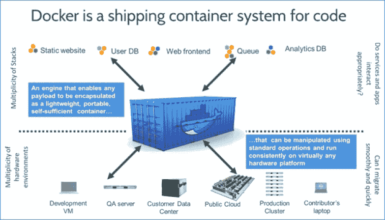
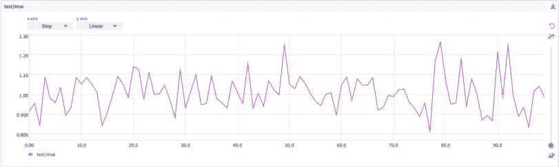

# 使用 Docker 进行机器学习的最佳实践

> 原文：<https://web.archive.org/web/https://neptune.ai/blog/best-practices-docker-for-machine-learning>

可以使用 [Docker](https://web.archive.org/web/20221207124821/https://www.docker.com/) 工具创建、部署和执行应用容器。它只是一个打包的应用程序代码包，以及运行它所需的库和其他依赖项。一旦被执行，一个 [Docker 镜像](https://web.archive.org/web/20221207124821/https://searchitoperations.techtarget.com/definition/Docker-image)就会变成一个容器，包含运行一个应用程序所需的所有组件。

然而，这样做有什么意义呢？作为一个[数据科学家或者机器学习工程师](/web/20221207124821/https://neptune.ai/blog/ml-engineer-vs-data-scientist)，这有什么用？一个关键词，尤其是对数据科学家来说，就是可再现性。使用 Docker，可以开发一个基本的分类器，如果您的系统有一个没有更新的库和程序版本，并且由于您有在这些版本上运行的某些应用程序而无法更新，则该分类器可以保证很好的再现性。这是一个体面且简单的用例。

但是在我们深入探讨之前，让我们先从一些基础开始。

## Docker 是什么？

Docker 是一个使用容器开发和部署应用程序的工具。容器是基于这样一个概念构建的，您可以将您的代码及其依赖项捆绑到一个可部署的单元中。容器已经使用了很长时间。有些人声称它们是由 Sun Microsystems 创建的，并在 2005 年作为区域作为 Solaris 10 的一部分发布，而其他人则声称 BSD Jails 是第一个实现的容器技术。考虑用于联运的集装箱作为视觉解释的例子。

一旦您将产品(代码和依赖项)放入容器中，您可以通过船只或火车(笔记本电脑或云)发送它，当它到达目的地时，它将继续运行，就像发货前一样。

### 货船类比



*Docker – cargo ship analogy | [Source](https://web.archive.org/web/20221207124821/https://infoslack.com/)*

有一个有用的比较可能有助于解释 Docker 是如何工作的。如你所知，这些物品是用不同的集装箱运输到世界各地的。此外，这种隔离很重要，这样一个集装箱中的商品就不会影响旁边集装箱中的商品。

为了运输不同的物品，集装箱可以是单一的尺寸和材料，也可以是不同的尺寸和材料，这取决于所运输的货物种类。

有一个经理通常负责登船、离船和维护船上的集装箱。在这个场景中，服务器上运行的 Docker 引擎充当管理器。

作为船主，你可以指示船舶经理在船上装卸集装箱。类似地，docker 也可以在服务器上执行、部署和关闭您的应用程序。

对于容器，您需要一张图片作为容器大小和内容的模板。正是在这里，你需要一个蓝图，即图像，从这里建立这个容器。Docker hub 是一个存储图像的好地方，服务器上的 Docker 引擎会处理剩下的事情。

## Docker 在机器学习领域扮演什么角色？

### Docker 中的再现性

无论是开发模型还是进行数据分析，尽可能准确地再现结果是非常重要的。考虑以下场景:您被要求对一个数据集合进行探索性的数据分析。创建一个包含数据集和一些 Python 库的本地环境，然后启动 Jupyter 笔记本。分析数据集并开发初步模型后，您决定与同事和朋友分享您的发现。

问题是你的同事要复制你的分析，他们也必须复制你的整个堆栈。Docker 允许您快速轻松地复制您的工作环境。它使得标准化项目中使用的库的版本、随机种子、甚至操作系统成为可能，这样，在不同的机器上工作的同事可以一次又一次地生成相同的结果。

### Docker 中的便携性

作为一名数据科学家，能够从本地工作站平稳地转移到提供额外资源(如 CPU、RAM、GPU 等)的外部集群是非常有益的。此外，我们希望能够尝试社区正在创建和共享的新框架和工具。

Docker 使您能够将代码和依赖项打包到容器中，这些容器随后可以移植到各种计算机上，即使底层硬件、操作系统等与原始机器不同。移动性的另一个好处是能够相对简单地与各种不同的同事一起工作。

作为一名数据科学家，在您开始处理已建立的代码库之前，您不必花费一整天(或一周)来设置环境。如果项目已经被“归档”，你将能够立即开始工作。

### 在 Docker 中部署

Docker 的使用简化了部署机器学习模型的过程。这是一个你是否想和别人分享你的模式的问题。这很简单，只需利用 Kubernetes 技术将您的模型包装在 API 中，然后放入容器中。本节中省略了几个小步骤。回想一下，从 Docker 到模型部署的转换过程相当简单。容器管理技术和方法可以用于我们的模型部署。

### Docker 中的集成

云提供商和物理服务器可以使用 Docker 云来构建 Docker 节点。在您的物理服务器上安装 Docker 云代理，或者安全地连接您的云提供商凭据。然后，您可以在几秒钟内“构建节点集群”。

AWS、Azure、DigitalOcean、Packet 和 Softlayer 都与 Docker Cloud 相连，用于供应和管理。要管理 Docker Cloud (Google Cloud，Rackspace)不支持的基础设施上的节点，您还可以管理连接到互联网的物理 Linux 系统上的节点。

## 使用 Docker 进行机器学习的最佳实践(ML)

### 1.构建 Docker 图像

#### 什么是 Docker 文件？

Docker 文件是一个文本文档，包含生成特定图像所需的所有命令，Docker 可以读取这些命令来自动构建该图像。在使用 docker image build 命令创建映像时，应该尽可能少地进行设置或更新，以便可以随时暂停和/或销毁容器，并轻松地重新构建或替换容器。

#### 什么是图像？

除了 Docker 之外，任何使用过虚拟机的人都很熟悉 Docker 映像的使用。在其他虚拟机设置中，映像通常被称为“快照”。它们是 Docker 虚拟机在特定时间和地点的快照。虽然虚拟机快照类似于 Docker 映像，但还是有一些不同之处。

首先，Docker 图像是不可变的。在你制作了一张唱片之后，你可以删除它，但是你不能改变它。如果需要新的快照，从头开始创建新的映像。

在 Docker 世界中，不变性(不改变的能力)是一个有价值的工具。一旦您设置了 Docker 虚拟机并创建了一个映像，您就可以确定该映像将一直运行。这使得在您的环境中试验新特性变得简单。

你可能会尝试新的应用程序或者重组你的文件。因此，您可以确定您的运行实例不会受到影响。您的 Docker 虚拟机将始终能够关闭并继续使用您当前的映像，就像什么都没有改变一样。

#### 构建映像的最佳实践

*   **使用官方图片**:在项目中，如果你是 Docker 的新用户，建议你使用 Docker 官方图片。这些照片有全面的文档，它们鼓励最佳实践，同时也迎合了最广泛的潜在应用。

修改 Docker 图像的一个典型原因是减小图像的尺寸。当安装需要优化代码的模块时，一个完整的构建工具链包含在许多编程语言堆栈映像中。一个更有经验的用户可以创建一个定制的映像，其中只包含绝对必要的预编译库，从而节省磁盘空间。

*   **为了获得最佳效果，使用一个可靠的基础映像**:当你在一个不可信的或未维护的映像上构建容器时，你将继承该映像的所有缺陷和漏洞。所以作为一般的经验法则，你应该遵循以下规则:
    *   可信的存储库和供应商应该优先于由身份不明的个人创建的图片。
    *   使用自定义映像时，在构建您自己的基础映像之前，请检查映像源和 docker 文件。在公共注册表中发布的图像不能保证是从 docker 文件中生成的。不保证以后会更新。

*   **。dockerignore** :当我们运行 docker build 命令时，为了防止映像中包含不需要的文件和目录，我们可以创建一个. dockerignore 文件，其中包含我们不想在映像中包含的文件和目录。如果不包含这个文件，应用程序的处理时间可能会缩短。
*   **容器必须是短暂的**:短暂的容器应该由 docker 文件中指定的映像生成。当它在被重建和替换为新容器之前可以被停止和销毁时，它被称为临时容器，只需要最少的设置和配置。一次性容器，如短暂的容器，可能被认为是这样的。对于每个新的容器实例，与之前的没有任何联系。在创建 Docker 图像时，应该尽可能多地使用短暂的模式。
*   **避免安装不必要的应用程序**:由于承诺以后会用到它，安装比您需要的更多的应用程序可能很诱人，但是为了减小映像的大小和复杂性，只安装实际需要的。例如，在使用 curl 包之后，最好将其移除，因为在构建容器的过程中，很多时候只需要使用它一次。
*   将每个论点分成几行:以这种方式对论点进行排序有很多好处。您可以更容易地确定是否有修改，这有助于检测包中的重复。

让我们看看下面的例子是如何工作的！

**例一**

```py
RUN apt-get update && apt-get install -y php5-cli php5 php5-gd php5-LDAP php5-mysql apache2 php5-pgsql libapache2-mod-php5
```

**例二**

```py
RUN apt-get update &&
    apt-get install -y
      apache2
      libapache2-mod-php5
      php5
      php5-cli
      php5-gd
      php5-LDAP
      php5-mysql
      php5-pgsql
```

没有顺序的行很难阅读。由于理解它们需要大量的脑力劳动和注意力，我们倾向于在代码评审时跳过它们。那么，你认为应该首选哪种方式呢？

*   **利用 Docker 缓存**:Docker 图像的一个迷人且有用的特性是图层。层用于构建 Docker 映像，每个层都有特定的用途。Dockerfile 指令与每一层相关，并描述了映像的文件系统在执行前和执行后的变化。为了节省构建时间，Docker 会缓存层。Docker 将简单地重用缓存中的现有层，而不是重新创建一个类似的层。

另一方面，添加不是绝对必要的层会增加工作量。因为 Docker 层是文件系统，所以许多不需要的层都有性能问题。用应用所有依赖性的单个 run 命令建立单个缓存比将其分成许多级更有效，因为每个 RUN 命令产生一个新层。通过找到并使用可缓存的图层，从长远来看，您将节省大量时间。

*   **通过将您的断言压缩成一个**来减少层的数量:docker 文件中的每条指令都向图像添加一层。指令和层的数量应保持在最低水平，因为这会影响性能和构建时间。因此，当执行运行、复制或添加命令时，请尝试用一句话来执行。

```py
FROM alpine:3.4

RUN apk update
RUN apk add curl
RUN apk add vim
RUN apk add git
```

```py
FROM alpine:3.4

RUN apk update &&
       apk add curl &&
       apk add vim &&
       apk add git
```

### 2.构建容器

#### 什么是容器？

*   应用程序可能被打包在容器中，这些容器不过是孤立的环境。容器的目标是分离和支持跨多个平台的应用程序的移动性。

*   在容器中，映像提供了操作一组进程所需的所有文件。通过容器，应用程序与共享同一个内核的其他进程隔离开来，因此没有一个进程会影响其他进程的工作。

*   集群是容器的集合。在集群中，存储和处理能力等资源可以共享，这使得并发操作几十个甚至几百个容器变得可行。

*   容器在软件开发环境中非常有用。DevOps 方法基于它们的适用性，可以帮助运营和开发部门。当涉及到开发应用程序时，容器与环境的特性无关，例如操作系统，因此它们可以很容易地共享和访问，当涉及到在同一内核上运行应用程序时，它们不像虚拟机那样复杂。

*   尽管它们很相似，但容器不是虚拟机，因为容器可能与操作系统共享同一个内核，但虚拟机不能。

#### 构建容器的最佳实践

1.  **每个过程一个容器**

将容器视为可以同时运行几个不同方面的虚拟计算机是一个典型的错误。容器可能以这种方式工作，但是这减少了容器架构的大部分好处。例如，同时运行标准 Apache/MySQL/PHP 栈的所有三个组件是很诱人的。然而，建议的方法是利用两个或三个不同的容器:一个用于 Apache，一个用于 MySQL，如果您使用 PHP-FPM，可能还有一个用于 PHP。

由于容器的生命周期与其包含的应用程序相同，因此每个容器只能有一个应用程序。当一个容器被启动时，应用也是如此，当应用被关闭时，容器也是如此。下图描述了这种推荐做法。

```py
Good practice
.
└── parent_process/
    ├── child process I/
    │   ├── child process I.I
    │   └── child process I.II
    └── child process II/
        ├── child process II.I
        └── child process II.II

```

```py
Bad practice
.
├── parent_process I/
│   ├── child process I.I
│   └── child process I.II
--------------------------
└── parent process II/
    ├── child process II.I
    └── child process II.II

```

建议每个容器只运行一个进程有几个原因:

*   假设您的应用程序架构中有两个 web 服务器和一个数据库。可以在一个容器中运行所有三个服务，但是最好在不同的容器中运行每个服务，这样可以更容易重用和扩展。
*   每个服务都有一个独立的容器，允许您横向扩展一个 web 服务器来容纳额外的流量。
*   将来您可能需要一个容器化的数据库用于另一个服务。在这种情况下，可以重用同一个数据库容器，而不需要两个额外的服务。
*   当容器被耦合时，日志记录变得更加困难。
*   由于要处理的外围应用面积更小，因此生成安全更新或解决问题要简单得多。

**2。给你的容器贴上标签**

说到维护图像，Docker 标记是一个非常有用的工具。它有助于维护 docker 映像的多个版本。下面是一个构建标签名为 v1.0.1 的 docker 图像的示例

```py
docker build -t geekflare/ubuntu:v1.0.1
```

您可以使用几个标签:

*   使用 ***稳定标签*** 来保留容器的基本图像。避免将这些标记用于部署容器，因为这些标记会经常改变，这可能会导致生产环境中的差异。
*   使用 ***唯一标签*** 进行部署。使用独特的标记，您可以轻松地将生产集群扩展到多个节点。它可以防止不一致，并且主机不会获取任何其他 docker 映像版本。

建议在部署的图像标记上禁用写启用。这可以防止部署的映像从注册表中意外删除。

### 3.在 Docker 中运行您的模型

#### 为什么要在 Docker 中放一个机器学习模型？

**挑战**

*   构建一个在我们的 PC 上运行的机器学习模型的过程并不困难，但与一个希望在不同类型的服务器上大规模利用该模型的客户合作确实具有挑战性。可能会出现各种问题，包括性能问题、程序崩溃和糟糕的优化。

*   我们的机器学习模型可以用 Python 这样的单一编程语言实现，但应用程序将需要与用其他编程语言编写的其他应用程序进行通信，以进行数据输入、预处理、前端等。，这本身就是一个挑战。

**使用 Docker 的好处**

*   由于每个微服务可能使用不同的语言，docker 支持可伸缩性和独立服务的简单添加或删除。Docker 的优点包括可复制性、可移植性、易于部署、增量更新、轻量级和简单性。
*   数据科学家最大的担心是他们的模型不能准确反映现实生活的结果，或者当它与其他研究人员共享时。在某些情况下，模型不是问题所在；更确切地说，是复制整个堆栈的需要。使用 Docker，可以在任何系统上复制训练和操作机器学习模型所需的工作环境。
*   使用 Docker，代码和依赖项可以一起打包到可移植的容器中，这些容器可以在各种不同的主机上运行，而不用考虑硬件或操作系统。
*   训练模型可以在本地系统上构建，并简单地转移到具有更多资源(如 GPU、更多 RAM 或强大的 CPU)的远程集群。OpenShift 是 Kubernetes 的一个发行版，通过将模型封装到容器中的 API 中，并使用类似这样的技术部署容器，它使部署变得简单，并使您的模型对世界开放。
*   可以使用 Docker 跟踪容器映像版本，以及谁开发了它们，用了什么。版本也可以回滚。此外，即使您的机器学习应用程序所依赖的服务之一正在升级、修复或不可用，它也可能会运行。例如，如果必须更新包含在整个解决方案中的输出消息，则不需要与其他服务交互并更新整个程序。

### 4.跟踪模型的指标

即使在模型开发之后，机器学习(ML)的生命周期也远未结束；事实上，这仅仅是这一进程的开始。要将您的模型投入生产，下一步是部署和监控您的模型。为了最大限度地利用你的机器学习模型，只要你在使用它，你就需要密切关注它。

将 ML 模型监测视为频繁的健康检查。作为一项操作任务，模型建模可以帮助您确保您的模型以最佳状态工作。

#### 模型监控的重要性

监控您的 ML 模型的错误、崩溃和延迟是机器学习生命周期中模型部署之后的操作阶段的一部分。

模型漂移，或模型在使用过程中的退化，是为什么需要模型监控的最直接的原因。一个模型的预测能力可能下降有几个原因-

1.  **以前未见过的信息**:如果没有足够的标记数据或者训练有计算限制，就不可能避免你的机器学习模型产生错误或错误结果的数据样本。
2.  **变量连接和周围环境的变化** : ML 模型根据建立时的变量和参数进行优化。想想 20 年前开发的垃圾邮件检测算法现在有多有效。二十年前，互联网甚至还不存在！这种方法可能无法跟上垃圾邮件不断变化的本质，因此它是否有效值得怀疑。这个例子说明了环境的变化。
3.  **上游数据的变化**:这是一个术语，用来描述对运行数据管道的修改。数据科学团队通常无法完全控制输入数据所来自的所有系统。虽然数据是以摄氏温度记录的，但一个完全独立的软件工程团队可能会将变量的测量值改为华氏温度。例如，如果有人试图确定平均温度，这可能会产生严重的影响。

#### ML 实验跟踪工具

出于上一节提到的原因，很明显，机器学习模型的登台环境永远不会等同于生产环境，因此您必须密切关注您投入生产的任何 ML 模型。

有很多技术可以帮助我们做到这一点。首先，我们有知名的工具，比如 *MLFlow* 、 *TensorBoard* 、*海王星*、 *DVC* 、*亚马逊 SageMaker、*等等。

为了更好地理解，让我们看一下 Neptune，看看一旦通过 docker 部署了模型，我们如何通过这个工具来检查我们的模型。

#### 海王星的简短概述

Neptune 是 MLOps 的 **[元数据存储，为运行大量实验的团队而构建。‌](/web/20221207124821/https://neptune.ai/blog/ml-metadata-store)**

它为您提供了一个记录、存储、显示、组织、比较和查询所有模型构建元数据的单一位置。

‌Neptune 习惯了 for:‌

*   **实验跟踪**:在一个地方记录、显示、组织和比较 ML 实验。
*   **模型注册**:对训练好的模型进行版本化、存储、管理和查询，以及建模元数据。
*   **实时监控 ML 运行**:实时记录和监控模型培训、评估或生产运行

如果您想了解更多信息，请查看[文档](https://web.archive.org/web/20221207124821/https://docs.neptune.ai/)或探索应用中的[示例项目(无需注册)。](https://web.archive.org/web/20221207124821/https://app.neptune.ai/common/showroom/e/SHOW-3102/dashboard/Metrics-a7de0cf6-3b35-44b5-9d7a-791e5617a44e)

#### 海王星码头工人

让我们按照一步一步的过程来看看我们如何在容器化的 Python 脚本或应用程序中记录实验元数据。

第一步:将 Neptune 添加到您的代码中

让我们训练一个简单的线性回归模型，并将其放入 Docker 容器中。

```py

import numpy as np
from sklearn.linear_model import LinearRegression
from sklearn.metrics import mean_squared_error
from sklearn.model_selection import train_test_split
import joblib
import neptune.new as neptune
from neptune.new.types import File
import os
run = neptune.init(
    project="PROJECT_WORKSPACE/PROJECT_NAME",
    api_token="YOUR_API_TOKEN",
    tags='a_tag_to_help_you'
)

lr = LinearRegression()

for _ in range(100):
    rng = np.random.RandomState(_)
    x = 10 * rng.rand(1000).reshape(-1,1)
    y = 2 * x - 5 + rng.randn(1000).reshape(-1,1)

    X_train, X_test, y_train, y_test = train_test_split(x, y, test_size=0.2, random_state=123)

    lr.fit(X_train, y_train)
    test_mse = mean_squared_error(y_test, lr.predict(X_test))
    run['test/mse'].log(test_mse)

joblib.dump(lr, '/any_name.pkl')
run['model'].upload(File.as_pickle('any_name.pkl'))
```

为了观察我们的模型在不同数据下的表现，我们运行了 100 次，每次都使用 Numpy 的不同随机数据。RandomState()。因此，每一次，我们都会收到一个更新的度量值，这个值用。日志功能。

现在，lr 是我们的模型，test_mse 是我们的度量。我们如何让同样的结果在不同的机器上重现呢？我们用 Docker！

**步骤 2:更新 requirements.txt 文件并创建 Dockerfile 文件**

因为现在我们正在使用 Neptune 包，所以我们需要将它包含在我们的需求文件中。

```py
joblib==1.1.0
neptune-client
numpy==1.21.4
scikit-learn==1.0.1
```

现在创建一个 Dockerfile 文件，它将:

*   指定基本容器映像，我们将从该映像构建我们的
*   在更新的 requirements.txt 中安装依赖项
*   将我们的训练脚本复制到容器映像，并定义执行它的命令。

```py
FROM python:3.8-slim-buster

RUN apt-get update
RUN apt-get -y install gcc

COPY requirements.txt requirements.txt
RUN pip3 install -r requirements.txt

COPY . .
CMD [ "python3", "-W ignore" ,"training.py" ]
```

**步骤 3:构建并运行 docker 容器传递 API 令牌**

通过运行以下命令，从上一步中创建的 docker 文件构建 docker 映像:

```py
docker build --tag <image-name> . 
```

现在，我们用我们的凭证运行容器。

```py

docker run -e NEPTUNE_API_TOKEN="<YOUR_API_TOKEN>" <image-name>
```

运行 docker 容器后，您会在终端上看到一个链接。点击链接打开海王星跑步，观看您的模型训练直播。

[](https://web.archive.org/web/20221207124821/https://i0.wp.com/neptune.ai/wp-content/uploads/2022/10/Best-Practices-When-Working-With-Docker-for-Machine-Learning_4.png?ssl=1)

*Monitor model training runs live in Neptune*

在我们的示例中，我们记录 MSE，这可以更改为对您的模型和用例有意义的任何指标。

## 结论

互联网上的许多教程和文章只关注如何建模和理解度量。在科学过程中，一位杰出的科学家或一家小公司的雇员将不得不接受同行评议。

留意你的模型在新数据和变化下的表现。即使你对学习 MLOps 不感兴趣，你也无法从强化课程中获益。我希望这些材料对你的日常生活有所帮助！

这里有一些参考资料，可以帮助你更好地理解 Docker 最佳实践，以及机器学习从业者如何从中受益。

*   关于如何为你的机器学习模型构建和运行容器的更多信息，[参见本文](https://web.archive.org/web/20221207124821/https://towardsdatascience.com/build-and-run-a-docker-container-for-your-machine-learning-model-60209c2d7a7f)。
*   如果你是初学者，[这篇文章](https://web.archive.org/web/20221207124821/https://towardsdatascience.com/a-beginners-guide-to-machine-learning-model-monitoring-36bf7faf3616)将帮助你掌握模型监控的基础知识。
*   这篇[文章有](https://web.archive.org/web/20221207124821/https://theaisummer.com/docker/)更多关于使用 Docker 进行深度学习应用的细节。
*   最后，这是一个关于机器学习 Docker 的 3 篇文章系列。