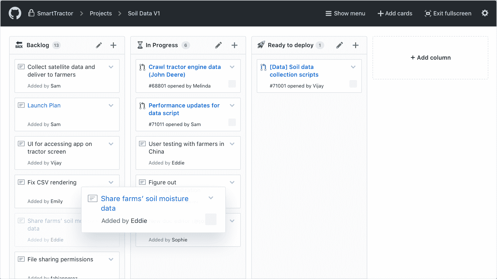
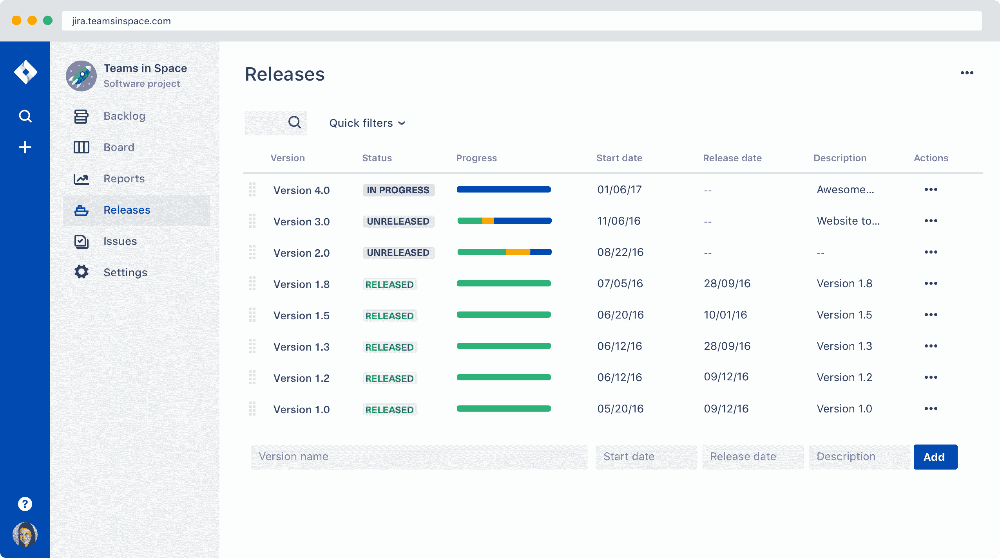
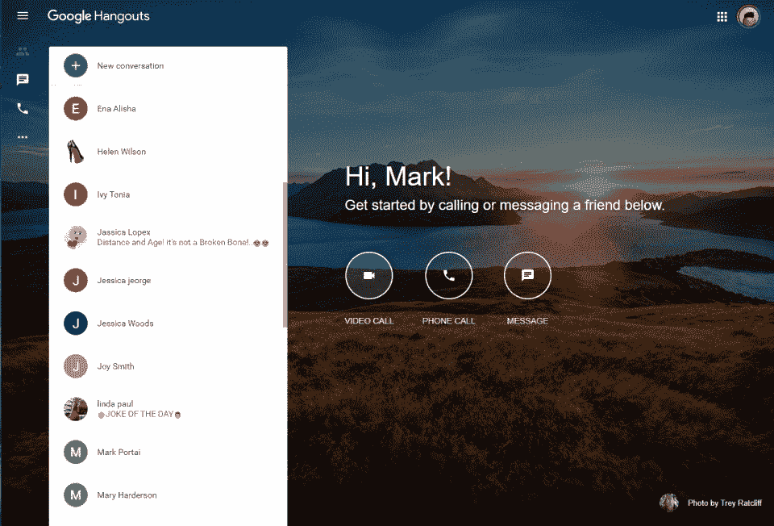

# 机器学习项目合作的最佳软件

> 原文：<https://web.archive.org/web/https://neptune.ai/blog/best-software-for-collaborating-on-machine-learning-projects>

在机器学习项目上的合作具有挑战性。它需要专注，注意细节，以及很强的分析能力。但这也需要工具。

当你独自做一个项目时，你在工作风格上有充分的灵活性。那么，当你和你的团队合作的时候，该怎么做呢？保持灵活性是可能的，但是没有合适的软件是不可能做到的。

在机器学习项目上有许多协作工具，但并不是所有工具都能增强工作。秘密在于特性。

这里有 9 个最好的软件，它们会让从事 ML 项目的人的生活变得更容易。

所有这些协作平台都被机器学习和数据科学从业者所使用，并且可以很容易地整合到敏捷项目管理的过程中。因此，如果你想改善你的 ML 团队的合作，你来对地方了。

*注:如果你对数据科学协作的话题感兴趣，请查看本文[“数据科学工作者如何协作？](https://web.archive.org/web/20230101212152/https://arxiv.org/pdf/2001.06684v2.pdf)角色、工作流和工具。*

## 1.[海王星](https://web.archive.org/web/20230101212152/https://neptune.ai/)——机器学习和数据科学的合作

Neptune 是个人和团队用于**实验跟踪和模型注册**的元数据存储。它为他们提供了一个中心位置来记录、存储、显示、组织、比较和查询机器学习生命周期中生成的所有元数据。

有了 Neptune，ML 团队可以合作研究他们的模型，跟踪他们的实验，并将历史数据存储在一个应用程序中。该流程定义明确，结构良好，最重要的是，**标准化**。

如果你是 ML 团队的一员，你可能最感兴趣的一件事是，Neptune 也很容易建立。 **API 是与基础设施无关的**，因此它将很好地适应您已经拥有的(或计划构建的)任何工作流。[实际上几行代码就可以了](https://web.archive.org/web/20230101212152/https://docs.neptune.ai/getting-started/how-to-add-neptune-to-your-code)，而[与 ML 库的 25+集成](https://web.archive.org/web/20230101212152/https://docs.neptune.ai/integrations-and-supported-tools/intro)让这变得更加容易。

> “对我来说，海王星最重要的是它的灵活性。即使我在本地笔记本电脑上使用 Keras 或 Tensorflow 进行训练，而我的同事在虚拟机上使用 fast.ai，我们也可以在一个公共环境中分享我们的结果。”
> 
> [Víctor Peinado, Senior NLP/ML Engineer](https://web.archive.org/web/20230101212152/https://neptune.ai/customers)

**以下是 Neptune 的几个特别增强团队协作的特性:**

*   **用户管理**功能，包括角色区分和访问管理，
*   **分享按钮**可以让你复制、发送电子邮件或发推文链接到 Neptune UI 中的任何页面
*   与项目成员和外部人员共享 UI 链接的可能性，
*   **[基于使用的定价](/web/20230101212152/https://neptune.ai/pricing)** 方案，允许您向团队工作区添加任意数量的成员，而不会影响基本费用
*   **可扩展性**运行数千次

\ u 003 cimg class = \ u 0022 lazy load block-blog-intext-CTA _ _ arrow-image \ u 0022 src = \ u 0022 https://Neptune . ai/WP-content/themes/Neptune/img/image-ratio-holder . SVG \ u 0022 alt = \ u 0022 \ u 0022 width = \ u 002212 \ u 0022 height = \ u 002222 \ u 022

## 2.[GitHub](https://web.archive.org/web/20230101212152/https://github.com/)–软件开发平台

GitHub 是最受开发者欢迎的平台。它被全球数以百万计的团队使用，因为它允许简单和无痛的协作。有了 GitHub，你可以**托管和审查代码，管理项目，构建软件**。

对于那些希望简化工作流程和方便地分享想法的机器学习项目团队来说，这是一个很好的平台。GitHub 让团队**管理想法，协调工作，并与整个团队**保持一致，以便在机器学习项目上无缝协作。

以下是**一些主要特性**您和您的团队会发现很有帮助:

*   在管理代码的同一位置，以您想要的方式构建、测试、部署和运行 CI/CD
*   使用动作自动发布新的包版本到 GitHub 包。在您的 CI/CD 工作流中安装 GitHub 包或您首选的记录注册表上托管的包和映像
*   该软件允许您使用漏洞警报来保护您的工作，以便您可以补救风险并了解 CVEs 如何影响您
*   内置的评审工具使得评审代码变得简单方便——团队可以提出变更，比较版本，并给出反馈
*   GitHub 可以轻松地与其他工具集成以实现流畅的工作，或者您可以使用 GitHubGraphQL API 创建自己的工具

GitHub 是一个可以轻松访问所有文档的平台，所有的功能使它成为一个灵活开发软件的统一系统。

> “根据我的经验，我发现 GitHub 在与团队成员合作进行 ML 项目时帮助很大。它提供了一个公共平台，在这里我们可以对我们的实验进行版本控制，编写文档，创建分支和分叉以避免意外。此外，GitHub 中大型 ML 项目库的可用性有助于快速实现代码/调试。”
> 
> [Nishkam Shivam, Data Scientist at Bristlecone](https://web.archive.org/web/20230101212152/https://www.linkedin.com/in/nishkamshivam/)

\ u 003 cimg class = \ u 0022 lazy load block-blog-intext-CTA _ _ arrow-image \ u 0022 src = \ u 0022 https://Neptune . ai/WP-content/themes/Neptune/img/image-ratio-holder . SVG \ u 0022 alt = \ u 0022 \ u 0022 width = \ u 002212 \ u 0022 height = \ u 002222 \ u 022

## 3.[吉拉](https://web.archive.org/web/20230101212152/https://www.atlassian.com/software/jira)–敏捷团队的项目管理

吉拉对于敏捷团队来说是一个非常棒的软件，因为它允许全面的项目管理。这是一个**问题和项目跟踪工具**，因此团队可以计划、跟踪和发布他们的产品或软件，作为一个完美开发的“有机体”。

吉拉允许**灵活的工作流程自动化**。您可以通过将特定任务分配给人员、将 bug 分配给程序员、创建里程碑或计划在特定时间框架内执行特定任务来自由管理项目。

基于吉拉平台的产品和应用帮助团队**计划、分配、跟踪、报告和管理工作**。四个产品建立在吉拉平台上:吉拉软件，吉拉服务台，吉拉 Ops 和吉拉核心。每个产品都带有针对不同用例的内置模板，并且可以无缝集成，因此跨组织的团队可以更好地合作。

> “我们使用 GitHub 和吉拉。GitHub 是我们维护所有代码/回购的地方，因为我们遵循敏捷模型，所以我们使用吉拉来维护我们的故事，并且还创建了一个 API，可以直接将我们的 GitHub 代码连接到吉拉(如果有人想看的话)。”
> 
> [Akshat Shreemali, Principal Data Scientist at Capital One](https://web.archive.org/web/20230101212152/https://www.linkedin.com/in/akshatshreemali/)

吉拉是程序员、分析师、软件架构师和所有软件开发团队协作的绝佳解决方案。它有助于简化、组织和构建工作流。

\ u 003 cimg class = \ u 0022 lazy load block-blog-intext-CTA _ _ arrow-image \ u 0022 src = \ u 0022 https://Neptune . ai/WP-content/themes/Neptune/img/image-ratio-holder . SVG \ u 0022 alt = \ u 0022 \ u 0022 width = \ u 002212 \ u 0022 height = \ u 002222 \ u 022

## 4.[Slack](https://web.archive.org/web/20230101212152/https://slack.com/)–兼容其他应用的在线聊天

Slack 是最受欢迎的通信应用之一。它还可以增强从事机器学习项目的人的工作。

Slack 是将电子邮件转换成消息，将人员、信息和工具放在一个地方。

通过将人、应用程序和数据结合起来，它有效地取代了电子邮件和又长又乱的线程。此外，它让人们看到一个更大的画面，这样每个人都可以看到公司内部发生的事情，并保持在循环中。

Slack 使跟踪对话或在易于搜索的档案中查找重要信息变得简单。因此，当一个团队在一个 ML 项目中工作时，他们总是知道发生了什么，并且能够简化流程。

**Slack 主要功能汇总:**

*   **工作区**–您可以为不同的项目或团队创建多个工作区
*   **频道**–私人或公共，与客户共享，让您快速与其他人交流
*   直接和群组消息
*   **公司的关键信息**–线索、提及和反应、已保存的项目和人员都在您的手边，因此您可以在应用程序中快速导航
*   应用程序(Apps)——众多工具的清单让你可以将 Slack 与其他流行的工具整合在一起
*   **文件**——一个空间，你和你的团队以及整个公司可以在这里存储文件，并通过搜索选项轻松访问它们或上传新文件
    保存草稿
*   **历史记录和搜索**让您可以快速、轻松地搜索您想要的东西
*   屏幕共享视频通话
*   创建自动化日常操作和通信的工作流
*   邮件和文件可以加密，您可以联系销售团队获得更多安全选项

Slack 是一个强大的沟通和协作工具，它小巧的特性允许团队以敏捷的方式工作。

## 5.[idea . so](https://web.archive.org/web/20230101212152/https://www.notion.so/)–一体化工作空间

概念是一个协作工具，让你写，计划，合作，并组织团队合作。

它由**四个模块**组成，每个模块具有不同的功能:

1.  **笔记、文档**–文本编辑器，为不同格式的文件、笔记提供空间；你可以添加图片、书签、视频、代码等等
2.  **知识库**–在这个模块中，团队可以存储关于项目、工具、最佳实践以及开发机器学习项目所需的其他方面的知识
3.  **任务、项目**–任务和项目可以组织在看板、日历和列表视图中
4.  **数据库**–该模块可以有效地取代电子表格，并以方便的方式记录重要数据和独特的工作流程

此外，每个团队成员都可以使用个人使用的概念来记录与工作相关的活动和信息，例如，每周议程、目标、任务列表或个人注释。

其他**小功能包括** #markdown。/Slash 命令、拖放功能、评论和讨论，以及与 50 多个流行应用程序的集成，如 Google Docs、Github Gist、CodePen 等

所有模块创建一个连贯的系统，作为工作管理和项目规划的统一中心。这是一个适合敏捷团队的轻量级工具。

> “观念是研究和实验过程的一部分。部分实验文件保存在那里。Jupyter 笔记本是我们在研究过程中使用的主要 IDE，因为它简化了结果可视化和知识共享。
> 
> Github，我们主要用于产品开发。在有了研究答案之后，我们确信开发应该被集成到主产品中，这就是我们使用 Github 的时候——从版本控制到 git 管道。
> 
> 吉拉:我们用它来定义研究路线图和产品本身。
> 
> Slack 和 Zoom 是聊天和视频支持，可用于任何思想交流或深入讨论。"
> 
> [Fabiana Clemente, Founder and Chief Data Officer at YData](https://web.archive.org/web/20230101212152/https://www.linkedin.com/in/fabiana-clemente/)

## 6.[汇合点](https://web.archive.org/web/20230101212152/https://www.atlassian.com/software/confluence)–产品文档工作区

Confluence 是由 [Atlassian](https://web.archive.org/web/20230101212152/https://www.atlassian.com/) 开发的**协同工作空间**。它已经存在了很长时间(17 年),并根据社区不断变化的需求进行了相应的改进。今天，confluence 主要用作远程协作的工作空间。

它支持维护单一真实来源，并允许用户通过高级搜索功能快速找到特定信息。Confluence 有几个协作特性，这使它成为企业协作的一个非常有用的工具。其中一些包括**实时编辑、聊天、通知、评论、注释、标签、页面树、项目层级和访问控制**。

Confluence 拥有超过 75，000 名客户，并且还在继续增长。Confluence 非常适合协作工具的生态系统。由于可以与 Slack、吉拉、Dropbox、G-Drive 和 Trello 等常用应用程序集成，这使得它成为一个受欢迎的选择。

> “我合作过的团队通常使用 Gitlab 来托管存储库。我也使用过 JIRA、Trello 和 Azure Board 进行项目管理，公司或团队通常会选择这些工具中的一个。我也曾使用 Confluence 进行文档处理，但最近我一直在使用 Dropbox 或 box 的授权版本，这取决于公司的选择。为了交流，我用过很多工具，包括 Slack、Matterport 和公司内置的聊天应用。
> 
> 我之前的团队也使用过 Tableau 和其他类似的仪表板应用程序。我们广泛使用 Docker 来开发和部署容器化的应用程序，以及商业云平台，如 Azure/AWS for compute。"
> 
> [Tanmana Sadhu, AI Researcher @ LG Toronto AI Lab](https://web.archive.org/web/20230101212152/https://www.linkedin.com/in/tanmana5/)

## 7.[Google Meet](https://web.archive.org/web/20230101212152/https://meet.google.com/)–实时会议

*[Source](https://web.archive.org/web/20230101212152/https://meet.google.com/)*

Google Meet 是最流行的电子会议平台之一。这对在机器学习项目上合作的远程团队尤其有帮助。Google Meet 允许团队以冲刺、会议、个人聊天或任何其他首选形式会面。

使用您的浏览器，您可以**与队友和客户分享您的视频、桌面和演示文稿**。

Google Meet 与 G Suite 的 Google Calendar 和 Gmail 集成在一起，因此您可以看到参与者和预定会议的完整列表。

您可以轻松快速地安排会议，并提前为团队成员设置，以便他们稍后可以通过自动生成的链接加入会议。

如果您的公司使用 G Suite，您可以通过拨打给定会议的电话号码来访问会议。它可以单独用于音频会议或视频会议，因为它允许用户关闭摄像头或静音麦克风，以便人们可以专注于正在发言的人。

\ u 003 cimg class = \ u 0022 lazy load block-blog-intext-CTA _ _ arrow-image \ u 0022 src = \ u 0022 https://Neptune . ai/WP-content/themes/Neptune/img/image-ratio-holder . SVG \ u 0022 alt = \ u 0022 \ u 0022 width = \ u 002212 \ u 0022 height = \ u 002222 \ u 022

即使你和 AI/ML 社区没有什么联系，你也会和 Jupyter 笔记本一起工作或者至少听说过它。它在刚刚开始机器学习之旅的初学者中特别受欢迎，但也同样被专家用作强大的合作工具。

Jupyter notebook 是一个**网络应用程序，用户不仅可以编码，还可以维护极其详细的文档**,包括视觉效果、结果、时间细节、序列、日志等等。在某种程度上，它促进了现有的最好的编码类型——伴随文档而来的那种。

Jupyter 笔记本**支持超过 40 种语言**，并且广泛用于 Python。它还支持 ML 友好的语言，如 R、Matlab 和 Scala，以及流行的编程语言，如 Java 和 C++。

由于易于使用和理解，Jupyter 笔记本是为门外汉分解复杂过程、为 AI/ML 平台创建用户友好的教程或记录实验的首选。

\ u 003 cimg class = \ u 0022 lazy load block-blog-intext-CTA _ _ arrow-image \ u 0022 src = \ u 0022 https://Neptune . ai/WP-content/themes/Neptune/img/image-ratio-holder . SVG \ u 0022 alt = \ u 0022 \ u 0022 width = \ u 002212 \ u 0022 height = \ u 002222 \ u 022

## 9.[Google Docs](https://web.archive.org/web/20230101212152/https://docs.google.com/)–跨组织的实时协作

Google Docs 是组织文件和实时协作的最佳解决方案之一，无论有多少用户在处理这个文件。

甚至我是用谷歌文档写这篇文章的，所以参与发表的其他人可以很容易地合作。

Google Docs 有**有用的功能，方便团队的工作**:

*   根据需要创建尽可能多的文件，根据需要调整它们
*   使用**模板库中的模板**
*   **加载项**允许用户定制文档，以便更灵活有效地工作
*   **智能编辑和样式工具**有助于轻松设置文本和段落的格式——您可以从数百种字体中进行选择，添加链接、图像和绘图
    团队成员可以通过手机、平板电脑或电脑访问、创建和编辑文档
*   每个人都可以同时在同一个文档中工作
    所有的更改都会自动保存——无需将文件保存在本地计算机或其他设备上
*   您可以使用修订历史来查看同一文档的旧版本，按日期和更改者排序。

Google Docs 是机器学习项目协作的必备工具。

## 把它包起来

当选择用于 ML 项目协作的软件时，确保它符合您团队的偏好、工作风格，并且可以轻松地与您当前使用的应用程序集成。

这是确保项目一致性、无缝工作流和安全性的最佳方式。

合作愉快！