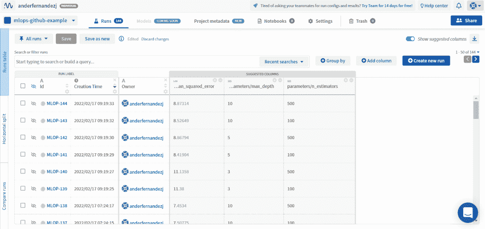
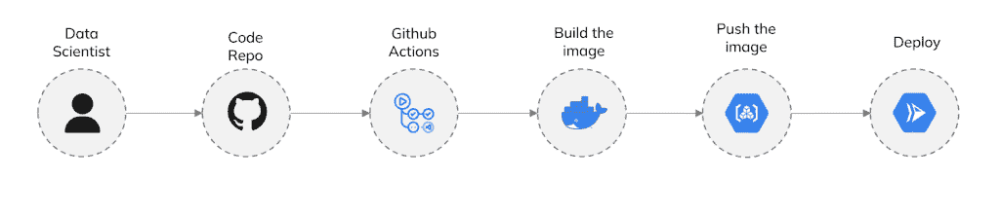

# 如何使用 GitHub 操作构建 MLOps 管道[分步指南]

> 原文：<https://web.archive.org/web/https://neptune.ai/blog/build-mlops-pipelines-with-github-actions-guide>

一段时间以来， [MLOps](/web/20220926085139/https://neptune.ai/blog/mlops) 已经成为所有日常使用机器学习和深度学习的公司的一个至关重要的流程。事实上，已经有许多专门为解决与 MLOps 管道相关的问题而构建的解决方案。

然而，对于许多只有少量模型投入生产的公司来说，学习和使用新工具(在本例中为 [MLOps 管道工具](/web/20220926085139/https://neptune.ai/blog/best-mlops-tools)和自动化工具)的成本超过了它将带来的收益。

事实是，要构建简单的 MLOps 管道，不需要学习新的复杂工具，如 Kubeflow 或 Airflow。事实上，您可以使用软件开发中最常用的工具之一:GitHub 来构建简单(但有效)的 MLOps 管道。

在这篇文章中，我将解释如何用 Github、 [Github Actions](https://web.archive.org/web/20220926085139/https://github.com/features/actions) 和一个云服务提供商以一种非常简单的方式创建 MLOps 管道。听起来很有趣？我们开始吧！

## 什么是 GitHub Actions？

[GitHub Actions](https://web.archive.org/web/20220926085139/https://github.com/features/actions) 是 GitHub 提供的一款工具，用于自动化软件工作流程。例如，软件开发人员使用 GitHub 动作来自动化分支合并，处理 GitHub 中的问题，进行应用程序测试等。

然而，我们作为数据科学家也可以在很多事情上使用 GitHub 动作。在我们的案例中，我们将使用它来自动化 MLOps 工作流的几个步骤，例如:

*   自动化 ETL 过程。
*   检查模型是否应该重新训练。
*   将新模型上传到您的云提供商并进行部署。

如你所见，GitHub 动作将会在我们的 MLOps 管道中被大量使用。好的一面是，如果你不知道 GitHub Actions 是如何工作的，它非常容易学习:你只需要在。工作流/github 文件夹。在这。yaml 文件中，您将指定几项内容，例如:

*   工作流的名称。
*   工作流何时触发:基于 cron 计划、http 请求、手动等。
*   工作流将运行的操作系统(Ubuntu、Windows 或 MAC)。
*   工作流应该执行的每个步骤。

注意:因为这不是 Github 动作教程，所以我不会深入这个话题。然而，这里你有一个[教程](https://web.archive.org/web/20220926085139/https://anderfernandez.com/en/blog/github-actions-for-data-science/)，它将帮助你学习如何使用 GitHub 动作。

### 使用 GitHub 动作作为 MLOps 工作流的利弊

为 MLOps 使用 GitHub 动作的好处不仅仅是我们不必学习新工具，它还有许多其他优点:

*   **GitHub Actions 与用于数据科学的主要编程语言**一起工作:Python、R、Julia 等。
*   可以利用学习 GitHub 动作的经验**自动化其他流程**。
*   **GitHub Actions 对公共库是免费的**。此外，关于私有存储库，GitHub Actions 提供了以下内容:
    *   免费账号:每月 2000 分钟的 GitHub 行动。
    *   团队账户:每月 3000 分钟的 GitHub 行动。
    *   团队账户:每月 50，000 分钟的 GitHub 行动。
*   **这种自动化与 AWS、Azure 和 Google Cloud** 等主要云提供商完美合作，因此您不会被单一云提供商束缚。
*   **每次工作流程失败，您都会自动收到一封电子邮件**。

如您所见，为 MLOps 使用 GitHub 动作有很多好处。然而，正如你可能想象的那样**它并不是所有情况下的完美解决方案**。在我看来，我不建议在以下场景中使用 GitHub 作为 [MLOps 工作流工具](/web/20220926085139/https://neptune.ai/blog/best-open-source-mlops-tools):

*   你有**许多你必须投入生产的模型**或者少数但是**复杂的模型**(比如深度学习模型)。在这种情况下，你将需要大量的计算能力来训练你的模型，而 GitHub Action 的机器不适合这样做。
*   **您已经在使用可用于 MLOps** 的工具。例如，假设您正在使用 Apache Airflow 进行 ETL 过程。在这种情况下，将这个工具用于 MLOps 可能比用 GitHub 构建 MLOps 管道更好。

好了，现在你已经知道 GitHub Actions 是什么，什么时候你应该或者不应该把它作为 MLOps 管道工具，让我们学习如果你决定使用它，你如何用 GitHub Actions 构建 MLOps 管道。

## 如何使用 GitHub 和 Google Cloud 构建 MLOps 管道[分步指南]

在接下来的章节中，我们将讨论如何使用 GitHub、GitHub Actions 和 Google Cloud 构建 MLOps 管道并将其投入生产。为此，我们建立了一个模型来预测每小时的比特币交易量。

**更具体地说，您将了解:**

1.  如何用 GitHub 动作设置数据提取管道？
2.  如何用 GitHub 动作构建模型训练和选择管道？
3.  如何将你的模型包装成 API？
4.  如何对你的 API 进行 Docker 化，以便你的代码可以移植并部署在任何 Docker 友好的云服务中。
5.  如何用云和 GitHub 动作设置一个持续部署管道？
6.  如何用 GitHub 动作自动化模型重训练？

如果你已经有了部署机器学习管道的经验，其中的一些步骤你可能已经很熟悉了。我仍然鼓励您阅读它们，这样您就可以了解 GitHub 操作是如何完成的。

让我们从带有 GitHub 动作的 MLOps 教程开始吧！

为了创建模型，我们首先需要获取数据。此外，由于我们想要创建一个 MLOps 管道，我们将需要创建一个 ETL 过程来提取数据、转换数据并将其加载到某个地方，比如数据湖、数据仓库或数据库。通过这样做，我们将能够随时用新的数据重新训练模型，并将其投入生产。

如果我们想用 GitHub 操作来做这件事，我们将需要创建一个或多个脚本来承担 ETL 过程。这些脚本应该是可自动执行的，理想情况下，还应该处理异常并在出现错误时发出警告。

例如，如果您需要从外部数据源提取数据，那么当外部数据源不工作时，向某人发送警告通常是一种好的做法。这将有助于调试过程，并且肯定会使事情变得容易得多。

此外，需要注意的是，不是所有的过程都应该在一个脚本中完成。唯一的限制是带有 GitHub 动作的脚本的执行是不可并行的。

发送完毕后，让我们看看带有 GitHub 动作的数据提取管道在实践中是怎样的:

在我们的例子中，区块链为[提供了这个 API](https://web.archive.org/web/20220926085139/https://api.blockchain.info/charts/transactions-per-second?timespan=all&sampled=false&metadata=false&cors=true&format=json) ，它显示了每分钟添加到池中的交易数量。

考虑到这一点，由于我们希望预测每小时的事务数量，我们的 ETL 管道将由以下内容组成:

*   **提取**:从 API 中读取信息。
*   **转换**:分组求和得到小时交易数。
*   **Load** :将信息上传到数据库，存储所有历史信息。

也就是说，我在下面的 Python 脚本中总结了所有这些过程，该脚本执行了上述步骤。

```py
import pandas as pd
import requests
from datetime import datetime
from sqlalchemy import create_engine
import os
uri = os.environ.get('URI')

url = 'https://api.blockchain.info/charts/transactions-per-second?timespan=all&sampled=false&metadata=false&cors=true&format=json'
resp = requests.get(url)
data = pd.DataFrame(resp.json()['values'])

data['x'] = [datetime.utcfromtimestamp(x).strftime('%Y-%m-%d %H:%M:%S') for x in data['x']]
data['x'] = pd.to_datetime(data['x'])

engine = create_engine(uri)
query = engine.execute('SELECT MAX(reality_date) FROM reality;')
last_reality_date = query.fetchall()[0][0]
query.close()

engine = create_engine(uri)
query = engine.execute('SELECT MIN(prediction_date), MAX(prediction_date) FROM predictions;')
prediction_date= query.fetchall()[0]
query.close()

first_prediction_date = prediction_date[0]
last_prediction_date = prediction_date[1]

if last_reality_date is None:
    date_extract = first_prediction_date

elif  last_reality_date <= last_prediction_date:
    date_extract = last_reality_date

else:
    date_extract = last_reality_date

data['x'] = data['x'].dt.round('H')

data_grouped = data.groupby('x').sum().reset_index()

data_grouped = data_grouped.loc[data_grouped['x'] >= date_extract,:]

upload_data = list(zip(data_grouped['x'], round(data_grouped['y'],4)))
upload_data[:3]

for upload_day in upload_data:
    timestamp, reality= upload_day
    result = engine.execute(f"INSERT INTO reality(reality_date, reality) VALUES('{timestamp}', '{reality}') ON CONFLICT (reality_date) DO UPDATE SET reality_date = '{timestamp}', reality= '{reality}';")
    result.close()

```

最后，我使用 GitHub Actions 自动化了这个工作流，这样每小时都会执行一次脚本并向数据库中插入新数据。这种自动化是通过以下 YAML 文件完成的:

```py
name: update-ddbb

on:
  schedule:
    - cron: '0 0/6 * * *' 
  workflow_dispatch: 

jobs:
  build:
    runs-on: ubuntu-latest
    steps:

      - name: Access the repo
        uses: actions/checkout@v2 

      - name: Configure Python
        uses: actions/setup-python@v2
        with:
          python-version: '3.9.7' 

      - name: Install necessary libraries
        run: |
          python -m pip install --upgrade pip
          pip install -r requirements.txt

      - name: Execute Python Script
        env: 
          URI: ${{ secrets.URI }}
        run: python update_real_data.py

```

正如您所看到的，仅仅用两个简单的文件，我们就构建并自动化了一个 ETL 过程。正如我之前所说的，您也可以使用其他工具，如 Apache Airflow，但是如果您没有它，您可以使用 GitHub Actions。

既然我们已经了解了如何获取数据，现在让我们看看如何用 GitHub 操作构建模型训练和选择管道。

### 使用 GitHub 操作的模型训练和选择管道

#### 如何用 GitHub 动作建立模型训练和选择管道需求

用 GitHub 动作构建模型选择管道非常简单。您只需要创建一个脚本来读取您之前在数据提取管道中清理的数据，并使用它构建几个模型。

在建立了几个模型之后，你需要使用足够的性能模型来评估它们(你可以在这篇文章的[中了解更多关于机器学习的性能指标)。](https://web.archive.org/web/20220926085139/https://neptune.ai/blog/performance-metrics-in-machine-learning-complete-guide)

一旦你做到了这一点，你就找到了你训练过的表现最好的模型。这个模型是我们将用来进行预测的模型，它将由我们的 API 提供服务。

*注:在分类和回归模型中，比较新模型和生产模型的预测能力通常是一种好的做法。然而，在预测模型中，这通常是不需要的，因为具有较新数据的模型通常比过去的模型效果更好。*

#### 模型训练和选择流程示例

首先，为了将模型投入生产，我们必须创建一个脚本来创建和调优几个模型。为此，我使用随机森林作为自回归模型进行了网格搜索。

为此，我使用了 [skforecast 库](https://web.archive.org/web/20220926085139/https://github.com/JoaquinAmatRodrigo/skforecast)，这是一个使用 [sklearn 的](https://web.archive.org/web/20220926085139/https://scikit-learn.org/stable/)模型作为时间序列预测的自回归模型的库(你可以在这里了解更多关于它的[)。](https://web.archive.org/web/20220926085139/https://github.com/JoaquinAmatRodrigo/skforecast)

在现实世界的场景中，我们不应该使用一个带有超参数调整的单一模型，而是应该训练几个模型，并调整每个模型的超参数。然而，为了使教程更加动态，我将只训练一个模型。

最后，在建立模型后，我将获得并保存最佳表现模型和最后的训练数据到一个文件中。这两个文件是进行预测所必需的。

在这一点上，我建议保存已经在元数据存储(比如 Neptune)中构建的所有模型的信息。通过这样做，您将获得关于已经构建的所有模型的信息，以及为什么选择生产中的模型。

在我们的比特币每小时交易预测示例中，这个过程是使用以下 Python 脚本进行的:

```py
import pandas as pd
import pickle

from utils import create_predictors
from skforecast.model_selection import grid_search_forecaster
from skforecast.ForecasterAutoregCustom import ForecasterAutoregCustom
from sklearn.ensemble import RandomForestRegressor

import requests
from datetime import datetime

import os
from dotenv import load_dotenv
import neptune.new as neptune
load_dotenv()

NEPTUNE_API_KEY = os.environ.get('NEPTUNE_API_KEY')
NEPTUNE_PROJECT = os.environ.get('NEPTUNE_PROJECT')

steps = 36
n_datos_entrenar = 200
path_fichero = 'bitcoin.csv'
path_modelo = 'model.pickle'
uri_mlflow = 'http://104.198.136.57:8080/'
experiment_name = "bictoin_transactions"

url = 'https://api.blockchain.info/charts/transactions-per-second?timespan=all&sampled=false&metadata=false&cors=true&format=json'
resp = requests.get(url)

data = pd.DataFrame(resp.json()['values'])

data['x'] = [datetime.utcfromtimestamp(x).strftime('%Y-%m-%d %H:%M:%S') for x in data['x']]
data['x'] = pd.to_datetime(data['x'])

data.columns = ['date', 'transactions']

data['date'] = data['date'].dt.round('H')
grouped_data = data.groupby('date').sum().reset_index()

grouped_data = grouped_data.set_index('date')
grouped_data = grouped_data['transactions']

train_data = grouped_data[ -n_datos_entrenar:-steps]
test_data  = grouped_data[-steps:]

forecaster_rf = ForecasterAutoregCustom(
                    regressor      = RandomForestRegressor(random_state=123),
                    fun_predictors = create_predictors,
                    window_size    = 20
                )

param_grid = { 'n_estimators': [100, 500], 'max_depth': [3, 5, 10] }

grid_results = grid_search_forecaster(
                        forecaster  = forecaster_rf,
                        y           = train_data,
                        param_grid  = param_grid,
                        steps       = 10,
                        method      = 'cv',
                        metric      = 'mean_squared_error',
                        initial_train_size    = int(len(train_data)*0.5),
                        allow_incomplete_fold = True,
                        return_best = True,
                        verbose     = False
                    )

for i in range(grid_results.shape[0]):

  run = neptune.init(
      project= NEPTUNE_PROJECT,
      api_token=NEPTUNE_API_KEY,
  ) 

  params = grid_results['params'][i]
  run["parameters"] = params
  run["mean_squared_error"] = grid_results['metric'][i]

  run.stop()

last_training_date = test_data.index[-1].strftime('%Y-%m-%d %H:%M:%S')
pickle.dump(last_training_date, open('last_training_date.pickle', 'wb'))
pickle.dump(forecaster_rf, open(path_modelo, 'wb'))

```

[](https://web.archive.org/web/20220926085139/https://i0.wp.com/neptune.ai/wp-content/uploads/Neptune-with-Github-Actions-example.png?ssl=1)

*Tracked runs visible in the Neptune UI | [Source](https://web.archive.org/web/20220926085139/https://app.neptune.ai/anderfernandezj/mlops-github-example/experiments?compare=IwFgDANMU8Q&split=tbl&dash=leaderboard&viewId=standard-view)*

现在我们已经构建了模型，让我们看看如何将它包装成一个 API 来使模型服务。

### 将模型包装成 API

一旦创建了模型，为了将它投入生产，我们将创建一个 API 来接收模型参数作为输入并返回预测。

此外，除了返回预测，API 将输入数据和预测保存在数据库中也很重要。通过这种方式，我们可以稍后将预测与现实进行比较，从而了解我们的模型表现如何，如果它表现不正常，我们可以重新训练它。

如何在 API 中包装模型将取决于您使用的语言类型，以及您的偏好。在使用 R 的情况下，最正常的事情是你使用 [plumber](https://web.archive.org/web/20220926085139/https://www.rplumber.io/) 库，而在 Python 中你有几个库，如 [FastAPI](https://web.archive.org/web/20220926085139/https://fastapi.tiangolo.com/) 或 [Flask](https://web.archive.org/web/20220926085139/https://flask.palletsprojects.com/en/1.1.x/api/) 。

说到这里，让我们看看如何在我们的例子中实现这一点。

#### 将模型包装成 API 的例子

为了用 Python 创建 API，我选择使用 FastAPI 作为 API 生成框架，因为它允许轻松创建 API，还可以检查输入的数据类型。

此外，为了保存模型的预测，我在 Postgres 数据库中创建了一个表。通过这样做，因为真实数据在一个表中，而预测在另一个表中，所以我创建了一个视图，其中有:

1.  我预测的时间
2.  我对那个小时的预测。
3.  那一小时的实际交易数量。
4.  预测绝对误差。

通过这样做，创建一个可视化的视图来显示模型随时间推移的性能，就像连接到这个视图并显示一些图表和 KPI 一样简单。

关于 API，内部发生的事情非常简单，你只需加载模型，进行预测，然后将其插入数据库。

然而，在我们的例子中，由于它是一个时间序列模型，它有一个额外的复杂性层，因为我们可能会对某个日期进行预测，而我们之前已经对该日期进行了预测。在这种情况下，在数据库中进行插入是不够的，还必须替换以前的值。

因此，在下面的脚本中，您可以看到我是如何创建 API 的:

```py
from fastapi import FastAPI
app = FastAPI()
@app.post("/forecast")
def forecast(num_predictions = 168, return_predictions = True):

    import pandas as pd
    import requests
    from datetime import datetime
    from sqlalchemy import create_engine
    import pickle
    import os
    uri = os.environ.get('URI')

    forecaster_rf = pickle.load(open('model.pickle', 'rb'))
    last_training_date = pickle.load(open('last_training_date.pickle', 'rb'))
    last_training_date = datetime.strptime(last_training_date, '%Y-%m-%d %H:%M:%S') 

    url = 'https://api.blockchain.info/charts/transactions-per-second?timespan=all&sampled=false&metadata=false&cors=true&format=json'
    resp = requests.get(url)
    data = pd.DataFrame(resp.json()['values'])

    data['x'] = [datetime.utcfromtimestamp(x).strftime('%Y-%m-%d %H:%M:%S') for x in data['x']]
    data['x'] = pd.to_datetime(data['x'])

    engine = create_engine(uri)
    query = engine.execute('SELECT MAX(prediction_date) FROM predictions;')
    last_prediction_date= query.fetchall()[0][0]
    query.close()        

    if  (last_prediction_date is None) or (last_prediction_date > last_training_date):

        predictions = forecaster_rf.predict(num_predictions)

        fechas = pd.date_range(
            start = last_training_date.strftime('%Y-%m-%d %H:%M:%S'),
            periods = num_predictions,
            freq = '1H'
            )

    elif last_prediction_date > last_training_date:

        dif_seg= last_prediction_date - last_training_date
        hours_extract = num_predictions + dif_seg.seconds//3600
        predictions = forecaster_rf.predict(num_predictions)

        predictions = predictions[-num_predictions:]

        fechas = pd.date_range(
            start = last_prediction_date.strftime('%Y-%m-%d %H:%M:%S'),
            periods = num_predictions,
            freq = '1H'
            )
    else:

        predictions = forecaster_rf.predict(num_predictions)

        fechas = pd.date_range(
            start = last_training_date.strftime('%Y-%m-%d %H:%M:%S'),
            periods = num_predictions,
            freq = '1H'
            )

    upload_data = list(zip([
    datetime.now().strftime('%Y-%m-%d %H:%M:%S')] * num_predictions,
    [fecha.strftime('%Y-%m-%d %H:%M:%S') for fecha in fechas ],
        predictions
    ))

    for upload_day in upload_data:
        timestamp, fecha_pred, pred = upload_day
        pred = round(pred, 4)

        result = engine.execute(f"INSERT INTO predictions (timestamp, prediction_date,  prediccion)\
            VALUES('{timestamp}', '{fecha_pred}', '{pred}') \
            ON CONFLICT (prediction_date) DO UPDATE \
            SET timestamp = '{timestamp}', \
                prediccion = '{pred}'\
            ;")
        result.close()
    if return_predictions:
        predictions
    else:
        return 'New data inserted'

```

现在我们已经创建了 API，我们进入 MLOps 部分，看看如何将模型进行 dockerize 以将其投入生产。让我们去吧！

### 将 API 归档

一旦我们创建了返回预测的 API，我们将把它包含在 Docker 容器中。通过这样做，我们将能够在任何使用 Docker 或 Kubernetes 的环境中把我们的代码投入生产，使我们的代码更加可移植和独立。

*注意:如果你是 Docker 的新手，我推荐你阅读[这篇关于如何使用 Docker 进行数据科学的教程](https://web.archive.org/web/20220926085139/https://anderfernandez.com/en/blog/docker-tutorial-for-data-science/)。另一方面，如果你已经有了一些经验，肯定会对 Docker 最佳实践中的这篇文章感兴趣。*

因此，为了对我们的 API 进行 Docker 化，我们必须创建一个 Docker 文件，因为它是告诉 Docker 如何构建映像的文件。从这个意义上说，Dockerfile 文件包含以下几点非常重要:

1.  安装我们使用的编程语言和 API 框架。
2.  安装必要的库来正确执行我们的代码。
3.  复制 API、模型和 API 正确运行所需的所有文件。
4.  在我们想要的端口中执行 API。

一旦我们创建了 docker 文件，验证它是否正常工作是很重要的。为此，我们必须执行以下命令:

```py
cd <folder_where_Dockerfile_is_located>
docker build -t <image_name> .
docker run -p <port:port> <image_name>

```

之后，我们可以访问我们的端口并检查 API 是否正常工作。如果是的话，我们可以进入下一步:将我们的模型投入生产。

### 使用云和 GitHub 建立持续部署管道

这是我们用 GitHub 动作开始 MLOps 过程的地方。因此，当使用 GitHub 操作执行 MLOps 时，我们要做的是，将我们的 GitHub 存储库与我们的云提供商连接起来，这样，每当我们在 GitHub 中推送我们的 repo 时，Docker 映像就会在我们想要的云服务中构建和部署。而且，正如你可能想象的那样，一切都会自动发生。

换句话说，我们将不再需要在我们的云环境中手动部署我们的代码，而是每次我们推送到我们的存储库时自动完成。是不是很酷？

好消息是，对于这一点，过程总是相同的:

1.  将我们的云服务与 GitHub 连接起来，每次推送时，Docker 图像都会上传到我们的云服务的容器注册中心。
2.  创建一个文件，告诉我们的云服务应该对 Docker 映像执行哪些步骤。

对于谷歌云，我们将使用以下工具:

*   **Google Cloud Build:** 用于构建 docker 映像的服务。
*   **容器注册:**存放容器的服务。
*   **Cloud Run:** 将容器化的 API 部署到一个服务的服务，该服务自动向下扩展到 0，也就是说，如果该服务没有收到任何请求，就不会有虚拟机在运行。这意味着您只需在请求部署在 Cloud Run 中的服务时付费。

主要想法是将 Cloud Build 与 GitHub 连接起来，这样每次推送回购时，Cloud Build 都会构建映像。然后，运行一个脚本，将该映像推送到容器注册中心，并将其从容器注册中心部署到云运行。



*MLOps with GitHub Actions: deployment workflow | Source: Author*

为此，我们必须遵循以下步骤:

3.  在事件部分，我们选择我们想要的触发器。在我们的例子中，我们将其保留为默认值:Push to a branch。

4.  在资源库下的 Source 中，点击“Connect new Repository”按钮，如下图所示，选择 GitHub 作为您的资源库。

5.  一个窗口将提示您授权 GitHub 帐户上的云构建应用程序。我们需要对它进行授权，并将应用程序安装在特定的存储库中或所有存储库中。

6.  为 MLOPs 流程选择存储库。从云构建触发器菜单构建到存储库。
7.  选择云构建配置模式。在这种情况下，我们必须选择云构建配置文件选项，如下图所示:

8.  最后，我们选择一个服务帐户，然后单击“Create”按钮。

很好，我们现在已经将 GitHub 帐户与 Google 容器注册中心连接起来了。这种自动化将在我们每次推送容器时执行。

然而，我们仍然必须定义一个重要的并且经常被忽略的东西:云构建配置文件。我们来看看怎么做。

#### 指定云构建配置文件

云构建配置文件是这样一个文件，它告诉云构建每当我们已经指出的触发器被触发时要执行什么云命令。

在我们的例子中，我们只希望执行三个命令:

1.  使用来自 GitHub 库的文件创建 Docker 映像。
2.  将 Docker 图像上传到 Google Cloud Container 注册表。
3.  在 Google 云服务中部署 docker 映像，Kubernetes 或 Cloud Run(在我们的例子中，我们将使用后者)。

我们将在一个. yaml 文件中定义所有这些内容，指出每一点都是要执行的步骤。在下面的代码中，我们看到。我在比特币交易示例中使用的 yaml 文件:

```py
steps:
- name: 'gcr.io/cloud-builders/docker'
   args: ['build', '-t', 'gcr.io/mlops-example/github.com/anderdecidata/mlops-example:$SHORT_SHA', '.']
- name: 'gcr.io/cloud-builders/docker'
  args: ['push', 'gcr.io/mlops-example/github.com/anderdecidata/mlops-example:$SHORT_SHA']
- name: 'gcr.io/cloud-builders/gcloud'
  args: ['beta', 'run', 'deploy', 'mlops-example', '--image=gcr.io/mlops-example/github.com/anderdecidata/mlops-example:$SHORT_SHA', '- -region=europe-west1', '--platform=managed']

```

此外，好消息是这个过程适用于所有三个主要的云环境:AWS、Azure 和 Google Cloud。虽然我们只讨论了 Google Cloud，但这里有一个关于如何使用其他服务的简单解释:

*   使用 GitHub 和 Azure 的 MLOPs 工作流:你需要创建一个 GitHub 动作，它在每次推送时运行，并使用 Azure CLI 登录，构建和推送映像，然后部署它。这里可以找到一个[的例子。](https://web.archive.org/web/20220926085139/https://docs.microsoft.com/en-us/azure/container-instances/container-instances-github-action)
*   **使用 GitHub 和 AWS 的 MLOPs 工作流**:与 Azure 类似，您需要创建一个 GitHub 动作，该动作在每次推送时运行，登录 AWS ECR 并推送图像。这里可以找到一个[的例子。](https://web.archive.org/web/20220926085139/https://aws.amazon.com/es/blogs/containers/create-a-ci-cd-pipeline-for-amazon-ecs-with-github-actions-and-aws-codebuild-tests/)

这样，我们就用 GitHub 操作创建了 MLOps 管道。这样，我们每推一款新机型到我们的 GitHub，它就会自动投产。

然而，这并不完全理想，因为我们需要定期手动重新训练模型。因此，让我们看看如何将我们的 MLOps GitHub 管道提升到一个新的水平。

### 用 GitHub 动作自动化模型重训练

根据我们到目前为止所看到的一切，要将重新训练的模型投入生产，我们只需创建一个脚本:

1.  运行模型训练文件。
2.  将新模型推送到我们的 GitHub 库。

这样，当推送完成时，Google Cloud Build 会自动检测到它，并使用新的模型构建映像，上传到云容器注册表，最后部署到 Cloud Run。

正如您可能已经猜到的，我们可以使用 GitHub 动作自动执行模型再训练。我们只需创建一个 GitHub 动作，定期执行训练文件并将新文件推送到 GitHub。

然而，这一点也不理想。因为，如果预测足够好，我们为什么要重新训练一个模型呢？或者，如果当前模型返回错误的预测，我们为什么要等到下一个模型重新训练？

因此，如果我们想更进一步，我们可以在模型的预测能力不好时重新训练模型。为此，我们只需:

1.  使用 http 请求触发模型重新训练工作流。
2.  创建一个脚本来检查模型的预测能力。如果模型的预测能力小于我们设置的阈值，脚本将通过对它的 http 调用来执行重新训练工作流。

后者是我如何用 GitHub 将它组装到 MLOps 工作流中，以预测比特币的交易数量。使用以下代码，我们可以检查 MAE 是否低于特定阈值，并在低于特定阈值的情况下启动重新训练工作流:

```py

import pandas as pd
from sqlalchemy import create_engine
from datetime import datetime, timedelta
import requests
import json
import os

user = 'anderDecidata'
repo = 'Ejemplo-MLOps'
event_type = 'execute-retrain'
GITHUB_TOKEN = os.environ.get('TOKEN')
uri = os.environ.get('URI')
max_mae = 6
n_observations_analyze = 48

days_substract = round(n_observations_analyze/24)

engine = create_engine(uri)

resp = engine.execute('SELECT MAX(fecha) FROM tablon;')
largest_date = resp.fetchall()
resp.close()

initial_date = largest_date[0][0] - timedelta(days = days_subsctract)

resp = engine.execute(f"SELECT * FROM tablon WHERE fecha >'{initial_date}';")
data = resp.fetchall()
colnames = resp.keys()
resp.close()

data = pd.DataFrame(data, columns=colnames)

print(data['mae'].mean())

if data['mae'].mean() > max_mae:
    url = f'https://api.github.com/repos/{user}/{repo}/dispatches'
    resp = requests.post(url, headers={'Authorization': f'token  {GITHUB_TOKEN}'}, data = json.dumps({'event_type': event_type}))

```

此外，我们可以通过下面的 GitHub 动作自动执行这个脚本:

```py
name: Check retrain

on:
  schedule:
    - cron: '0 0/2 * * *' 
  workflow_dispatch: 

jobs:
  build:
    runs-on: ubuntu-latest
    steps:

      - name: Checkout repo
        uses: actions/checkout@v2 

      - name: Configure Python
        uses: actions/setup-python@v2
        with:
          python-version: '3.9.7' 

      - name: Install libraries
        run: |
          python -m pip install --upgrade pip
          pip install -r requirements.txt

      - name: Execute python script 
        env:
          URI: ${{ secrets.URI }}
          TOKEN: ${{secrets.TOKEN}}
        run: python check_retrain.py

```

## 结论

正如您在本教程中可能已经看到的，可以通过 GitHub 操作以相对简单的方式创建 MLOps 工作流，只需在我们当前的工作工具中添加一些工具。

在我看来，使用 GitHub 执行 MLOps 是一种非常好的方式来进行模型的持续部署，特别是在那些机器学习和高级分析不够重视或没有很多数据特定工具的组织中。

我希望本教程能够帮助您了解如何使用 GitHub 构建 MLOps 管道。如果你从来没有做过，我个人建议你创建一个，因为这是一个非常好的学习方法。

此外，如果你想学习其他工具而不是 GitHub 动作来构建 MLOps 管道，我会鼓励你学习 [CircleCI](https://web.archive.org/web/20220926085139/https://circleci.com/) 或 [Gitlab CI](https://web.archive.org/web/20220926085139/https://docs.gitlab.com/ee/ci/) 。这两个工具是公司用来代替 GitHub Actions 的替代品，但是构建 MLOps 管道的方式与本文中解释的方式相同。

**相关资料:**

### 安德尔·费尔南德斯·黄雷盖

Decidata 的高级数据科学家和德乌斯托大学大数据和商业智能研究生学位的教授(他在那里教授各种科目，从受监督的机器学习模型到创建 ETL 流程并将其放入云中)。他还试图通过他的博客与数据科学家社区分享所有这些知识，在他的博客中，他解释了数据世界中的各种主题:从从头开始的算法编程到云中的自动化脚本，所有这一切都是用 R 和 Python 编写的。

* * *

**阅读下一篇**

## 最佳 MLOps 工具以及如何评估它们

12 分钟阅读| Jakub Czakon |年 8 月 25 日更新

在我们的一篇文章中——[机器学习团队实际使用的最好的工具、库、框架和方法——我们从 41 家 ML 初创公司学到的东西](https://web.archive.org/web/20220926085139/https://neptune.ai/blog/tools-libraries-frameworks-methodologies-ml-startups-roundup)——Acerta 的 CTO Jean-Christophe Petkovich 解释了他们的 ML 团队如何接近 MLOps。

**据他所说，一个完整的 MLOps 系统有几个要素:**

*   您需要能够构建包含预处理数据和生成结果所需的所有信息的模型工件。
*   一旦您能够构建模型工件，您必须能够跟踪构建它们的代码，以及它们被训练和测试的数据。
*   您需要跟踪所有这三样东西，模型、它们的代码和它们的数据，是如何关联的。
*   一旦您可以跟踪所有这些内容，您还可以将它们标记为准备就绪，进行生产，并通过 CI/CD 流程运行它们。
*   最后，为了在该过程的最后实际部署它们，您需要某种方法来基于该模型工件旋转服务。

这是对如何在公司中成功实施 MLOps 的高度概括。但是理解高层需要什么只是拼图的一部分。另一个是采用或创建适当的工具来完成工作。

这就是为什么我们编制了一份**最佳 MLOps 工具**的清单。我们将它们分为六类，以便您可以为您的团队和业务选择合适的工具。让我们开始吧！

[Continue reading ->](/web/20220926085139/https://neptune.ai/blog/best-mlops-tools)

* * *