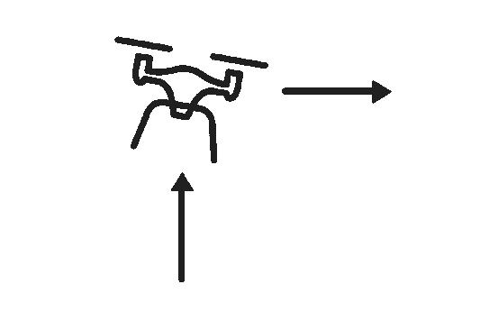
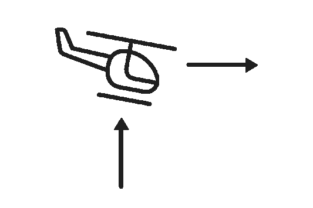
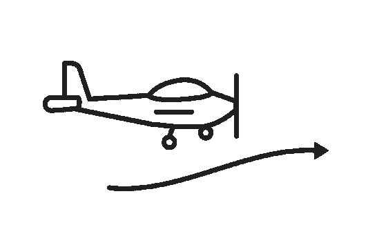
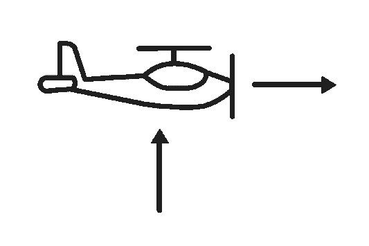
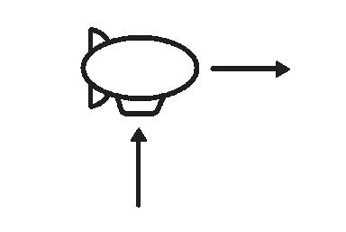

# 利用无人机技术和深度学习构建面罩监控系统

> 原文：<https://web.archive.org/web/https://neptune.ai/blog/building-a-facemask-surveillance-system-with-drone-technology>

COVID19 的爆发让世界措手不及，影响了全球的政府、公司和个人。疫情对全球产生了有害的影响，因为许多国家为了阻止病毒的影响而实施了严格的行动限制。世界银行 [*全球经济展望*](https://web.archive.org/web/20221206070317/https://www.worldbank.org/en/publication/global-economic-prospects) 预测 2020 年全球 GDP 将收缩 5.2%，这是几十年来最严重的全球经济衰退。

大流行的影响需要来自各个领域的解决方案，这为采用高级分析和基于人工智能的技术的解决方案铺平了道路。本文展示了一个解决方案，它增强了决策制定，并且易于推向生产(在数据的上下文中，用于训练、验证和测试模型)。

这是一个端到端的文章系列。在它的三个部分中，我将向您展示如何构建一个**无人机监控系统，以检测公众在开放区域使用口罩的情况**。监控系统将对违约者进行截图，并通过电子邮件通知监管机构。最后，该系统将启用视频流记录。

戴口罩结合其他预防措施，如经常洗手和社交距离，有助于减缓冠状病毒的传播。一架戴着面罩进行监督的无人机不仅积极地缓解了病毒传播——它还具有一种酷的反乌托邦感觉，这是每个赛博朋克爱好者都暗暗渴望的！

在本教程结束时，您将拥有一个无人机监视系统，可以部署到人员大量涌入的开放区域，可以发现所有不符合面罩规定的情况。

我们将很快进入如何工作的细节，但在此之前，下面是我们将要构建的示意图:


*Project workflow overview*

## 在开始使用无人机技术之前(先决条件)

为了充分理解本教程，假设您:

在本系列的第一部分，您将了解无人机技术的使用和配置。在第 2 部分中，您将学习如何构建和训练人脸检测模型。在第 3 部分中，您将学习如何将各个部分组合在一起并部署服务。

## 无人机技术简介

无人机就是一个飞行机器人。它既可以远程控制，也可以通过嵌入式系统中的软件控制的飞行计划自主飞行，与机载传感器和 GPS 配合工作。

### **无人机的种类**

为了在各种(机器学习)项目中使用无人机，你需要知道可用的类型。就本文而言，无人机的分类将以空中平台为基础，可分为 5 类，即:

**1。多旋翼无人机:**这些是最常见的无人机类型，也是最便宜的。该名称源自其结构中的大量电动转子。

该类别的一些子类包括三翼机(3 个旋翼)、四翼机(4 个旋翼)、六翼机(6 个旋翼)和八翼机(8 个旋翼)。由于其有限的飞行时间、续航能力和速度，这种类型的无人机不能用于大型项目。



*Multi-rotor drone schema*

**2。** **单旋翼无人机:**该类无人机具有典型直升机的设计。它有一个电动旋翼和一个位于无人机尾部的补充旋翼，用于前进方向。空气动力学的经验法则是旋翼数量越少，稳定性越好。因此，可以肯定地说，单旋翼无人机比多旋翼无人机更有效率。



*Single-rotor drone schema*

**3。固定翼无人机:**该类无人机的设计灵感来源于飞机。它有固定的机翼，有相同的飞行和着陆顺序。它们有更长的飞行时间，因为它们通常利用气流保持漂浮。这种无人机的缺点是飞行所需的成本和培训较高。



*Fixed-wing drone schema*

**4。动力提升无人机:**这些无人机采用固定翼和旋翼混合设计。这种无人机可以垂直起飞和降落，也可以前进飞行。陀螺仪和加速度计有助于飞行中的稳定。



*Power-lift drone schema*

**5。飞艇:**这种无人机被建造成“比空气轻”——充满浮力气体(如氦气或氢气)，通常由发动机驱动。



*Airship schema*

对于本文的上下文，**我们将使用可编程多旋翼无人机**——[泰洛·里兹](https://web.archive.org/web/20221206070317/https://www.ryzerobotics.com/tello-edu)。泰洛无人机由深圳瑞泽科技制造。它融合了 DJI 飞行控制技术和英特尔处理器。泰洛 RYZE 支持 scratch 的块编程和 python 的快速高级脚本。你可以在这里阅读更多关于泰洛 RYZE 无人机[。](https://web.archive.org/web/20221206070317/https://dl-cdn.ryzerobotics.com/downloads/Tello/Tello%20User%20Manual%20v1.4.pdf)

### **无人机架构**

泰洛无人机具有简单的架构，因为它利用软件开发工具包(SDK)与无人机进行交互。泰洛 SDK 通过 Wi-Fi UDP 端口与无人机建立连接，允许用户通过脚本或文本命令控制无人机。

该工作流是双向的，因为它允许向泰洛发送 SDK 指令并从泰洛接收信息。Wi-Fi 用于在泰洛和 PC、平板电脑或智能手机之间建立连接，随后可以通过发送命令和接收信息

泰洛 IP: 192.168.10.1
端口:8889

无人机的主要部件如下所示:

下表概述了泰洛 RYZE 无人机:

根据上面的描述，很明显这款无人机主要用于室内。其定义特征使操作非常有限，因为它具有:

*   最大飞行距离为 100 米，
*   最大速度为 8 米/秒，
*   最长飞行时间为 13 分钟
*   最大飞行高度 30 米。

## 设置无人机编程环境

无人机可以用各种语言编程，但我为这个项目选择了 python，因为它有很好的计算机视觉和深度学习库。创建了不同的 Python 库，以向用户提供一种简单的方式来与 DJI·泰洛无人机进行交互并向其发送命令，如 DJI·泰洛 SDK 2.0 中所述，例如:

我将使用 [djitellopy](https://web.archive.org/web/20221206070317/https://pypi.org/project/djitellopy/) ，因为它似乎在 stars、forks 和 pull-requests 中拥有最活跃的社区。

*本文使用的代码、数据集和其他资源可以在*[****Github****](https://web.archive.org/web/20221206070317/https://github.com/codebrain001/DroneProjects/tree/master/facemaskdetection)****上找到。****

 *该项目由三(3)个 python 脚本组成:

*   无人机配置脚本:drone-config.py
*   实时面罩检测脚本:realtime-detection.py
*   运行项目的主脚本:main.py

### **无人机配置脚本**

为了构建无人机配置脚本，我们需要导入必要的库来实例化所需的操作。djitellopy 和 openCV 可以通过终端由 PyPI 包管理器轻松安装，如下所示:

```py
$ pip install djitellopy
$ pip install opencv-python

```

完全安装了用于与无人机和计算机视觉操作交互的库。我们开始如下:

```py
from djitellopy import Tello

import cv2

import time

import os

pkg = Tello()

pkg.connect()

```

上面的片段通过 WiFi 连接成功地与无人机和我们的 PC 建立了 UDP 连接。将创建一个无人机类，如下所示:

```py
class Drone:

	"""Wrapper class to setup the tello drone"""

	def __init__(self, width, height):
    	self.StartCounter = 0
    	self.width = width
    	self.height = height
    	self.back_velocity = 0
    	self.left_right_velocity = 0
    	self.up_down_velocity = 0
    	self.yaw_velocity = 0
    	self.speed = 0

```

创建无人机类别时，将后退速度、侧向(左/右)速度、垂直速度和偏航速度的默认状态以及初始速度设置为零，以确保无人机在起飞前处于平衡状态。更多关于无人机的物理知识可以在这里阅读。drone 类还接受所需框架的宽度和高度值。

```py
def get_status(self):
    	battery = pkg.get_battery()
    	fly_time = pkg.get_flight_time()
    	drone_height = pkg.get_height()
    	atmospheric_pressure = pkg.get_barometer()
    	temperature = pkg.get_temperature()
    	yaw_velocity = pkg.get_yaw()
    	speed_x = pkg.get_speed_x()
    	speed_y = pkg.get_speed_y()
    	speed_z = pkg.get_speed_z()
    	acceleration_x = pkg.get_acceleration_x()
    	acceleration_y = pkg.get_acceleration_y()
    	acceleration_z = pkg.get_acceleration_z()

    	status_files = {
        	'battery': battery,
        	'fly_time': fly_time,
        	'drone_height': drone_height,
        	'atmospheric_pressure': atmospheric_pressure,
        	'temperature': temperature,
        	'yaw_velocity': yaw_velocity,
        	'speed': (speed_x, speed_y, speed_z),
        	'acceleration':(acceleration_x,acceleration_y,               acceleration_z)
    	}
    	return status_files.items()
```

无人机类有一个“get_status”方法，该方法返回一个字典，其中包含以百分比表示的电池电量、以秒为单位的飞行时间、以厘米为单位的无人机当前高度、以厘米为单位的高度([高度计](https://web.archive.org/web/20221206070317/https://en.wikipedia.org/wiki/Altimeter))、以摄氏度为单位的温度、以厘米/秒为单位的纱线速度、以厘米/为单位的 3d 空间(X、Y 和 Z 轴)中的速度以及以厘米/秒平方(cm/s2)为单位的 3D 空间(X、Y 和 Z 轴)中的加速度。

```py
def get_stream_on(self):
    	pkg.streamon()

def get_stream_off(self):
    	pkg.streamoff()

```

drone 类有一个“get_stream_on”和“get_stream_off”方法来打开和关闭视频流。在 AP 模式下(即当您的计算机连接到泰洛-XXXXXX WiFi 网络时)，所有 Tello 都支持视频流。

```py
def get_frame(self):
    	frame_read = pkg.get_frame_read()
    	return frame_read.frame

```

drone 类有一个“get_frame”方法来捕获从无人机摄像机接收到的帧。

```py
def get_video(self):
    	fourcc = cv2.VideoWriter_fourcc(*'XVID')
    	out = cv2.VideoWriter('drone_video.avi', fourcc, 20.0, (640, 480))
    	frame_read = pkg.get_frame_read()
    	while(True):
        	cv2.imshow('Video Stream', frame_read.frame)
        	out.write(frame_read.frame)
        	if cv2.waitKey(1) & 0xFF == ord('q'):
            	break

    	cap.release()
    	out.release()
    	cv2.destroyAllWindows()

    	return 'complete'
```

drone 类的“get_video”方法用一个[保存视频流(逐帧处理)。avi 格式](https://web.archive.org/web/20221206070317/https://en.wikipedia.org/wiki/Audio_Video_Interleave)使用 OpenCV VideoWriter 类。帧大小为 640 x 480，采用 FourCC 编解码器。

```py
def advance_movement(self):
    	pkg.takeoff()
    	pkg.move_forward(40)

def fallback_movement(self):
    	pkg.rotate_counter_clockwise(90)
    	pkg.move_forward(20)
    	pkg.end()

def get_movement(self):

    	pkg.takeoff()
    	pkg.rotate_counter_clockwise(5)
    	pkg.move_up(5)
    	pkg.move_forward(5)
    	pkg.rotate_clockwise(90)
    	time.sleep(20)
    	pkg.rotate_clockwise(90)
    	pkg.move_forward(5)
    	time.sleep(5)
    	pkg.end()

```

各种运动方案，如“前进 _ 运动”、“后退 _ 运动”和“获得 _ 运动”都是以厘米为距离单位创建的。这些方案包括向前、向后、向左、向右、向上和向下的运动，以及顺时针和逆时针旋转。为了开始运动，启动“起飞”命令，为了结束飞行，启动“结束”命令。

```py
def get_snap_shots(self, label, frame):
    	count = 0
    	if label.split(':')[0] == 'No Mask':
        	file_name = './snapshots/no mask ' + str(count) + '.jpg'
        	print(file_name)
        	cv2.imwrite(file_name, frame)
        	count += 1
        	time.sleep(5)
```

最后，为 drone 类创建了一个“get_snap_shots”方法，以 jpg 格式编写标记为“No Mask”的帧的图像(截图)(在此上下文中，这些帧是默认的)。截图的能力应该是每隔 5 秒就做一次。

**结论**

## 在本教程中，您已经学习了:

无人机行业概述

*   为项目设置无人机环境
*   这是一个漫长的第一个帖子。在下一篇文章中，我们将讨论使用深度学习来构建实时面具检测模型，以与无人机结合。

It’s been a long first post. In the next post, we will talk about building the real-time facemask detection model using deep learning to be incorporated with the drone.*