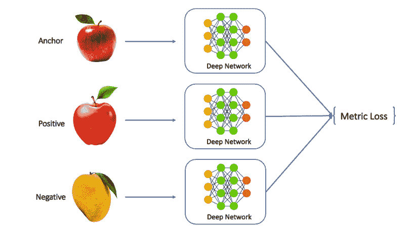
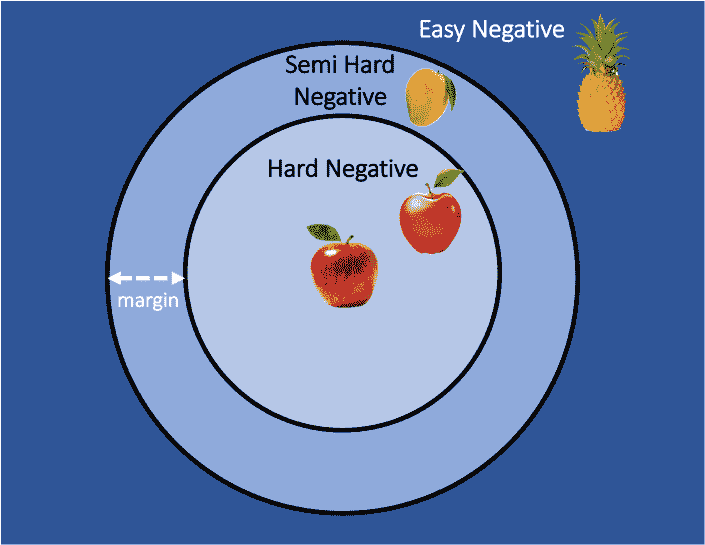
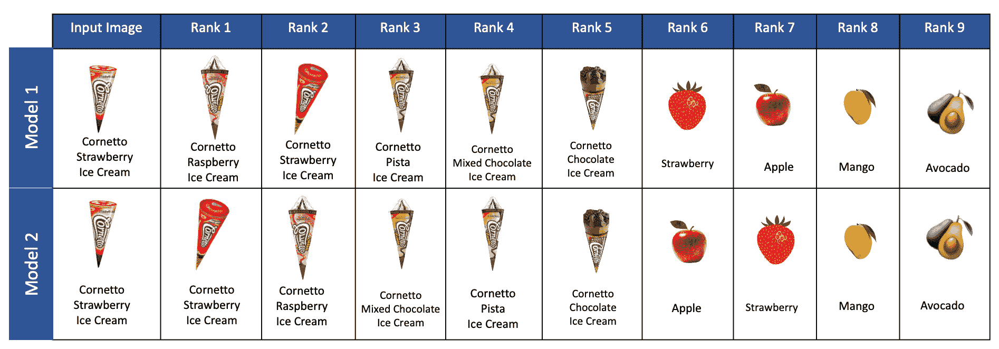
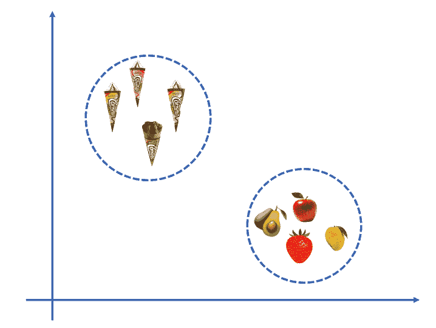

# ML 中的分类:从建立和部署大规模模型中吸取的教训

> 原文：<https://web.archive.org/web/https://neptune.ai/blog/building-and-deploying-large-scale-classification-model>

分类是机器学习中应用最广泛的领域之一。作为数据科学家，我们都致力于 ML 分类模型。你还记得你解决的分类问题中有多少类吗，最多 100 或 200？当类的数量超过 10000 的时候，同样的模型架构会起作用吗？

几个现实世界的应用，包括产品识别、人脸匹配和视觉产品搜索，被公式化为一个多类分类问题。多类分类是一类问题，其中给定的数据点被分类到给定列表中的一个类中。

传统的机器学习和深度学习方法用于解决多类分类问题，但模型的复杂性随着类别数量的增加而增加。特别是在深度学习中，网络规模随着班级数量的增加而增加。因此，在某个时间点解决具有数千个类别的多类别分类问题变得不可行。在本文中，我们将讨论处理这种大规模 ML 分类模型的可行技术。

在本文中，您将了解到:

## 

*   1 有哪些大规模 ML 分类模型的例子？
*   2 第 1 课:缓解 ML 分类算法中的数据稀疏问题
*   第 2 课:用于分类的深度度量学习
*   4 第三课:选择合适的损失函数训练大规模分类问题
*   第 4 课:测量大规模分类模型的性能
*   6 第 5 课:了解您在生产中使用分类模型将面临的常见挑战
*   第 6 课:为分类模型构建管道时要遵循的最佳实践

## 有哪些大规模 ML 分类模型的例子？

想象一个可视化产品搜索应用程序，给定一个产品的图片，系统需要从目录中获取最相关的产品。产品目录可能有近百万种独特的产品。为了解决产品搜索的问题，我们需要构建一个分类解决方案，其中类别的数量等于唯一产品的数量，这可能是数百万的数量级。使用传统的基于 softmax 的方法来解决这个问题是不可行的。对于这些类型的应用程序，需要构建不同的解决方案。

在处理这类问题时，记住几件事是很重要的。让我们来看看其中的一些。

## 第 1 课:缓解最大似然分类算法中的数据稀疏问题

用于解决多类分类问题的最流行的算法是什么？

## 

*   1kn
*   2 决策树
*   3 随机森林
*   4 朴素贝叶斯
*   5 利用交叉熵损失的深度学习

在某种程度上，通过使用一对一或一对一策略拟合多个二元分类器，也可以利用逻辑回归和 SVM 来解决多类分类问题。

使用任何上述算法解决大规模分类问题的主要问题是，给定一个类，收集的样本数量有时可能非常有限。因此，模型可能没有足够数量的数据样本来学习每个类的模式。在大多数情况下，很难为每个类收集足够数量的样本，我们发现大多数时候，存在数据点数量相对较少的长尾类。

传统的基于 softmax 的分类方法在这里可能不能很好地工作，因为它们可能遭受这类中的数据稀疏问题。因此，这类问题需要以不同的方式解决。这些类型的问题可以通过将输入特征投影到高维向量空间中，然后在嵌入空间中执行 k 最近邻(kNN)搜索来解决，而不是针对交叉熵损失进行优化。 ***这种方法叫做度量学习。一些团体也称这个领域为极端分类。*** 零镜头或少镜头学习可能是另一种解决方法，因为这种方法允许模型学习，即使当观察样本的数量只有一个或几个时。

## 第 2 课:用于分类的深度度量学习

度量学习是一个研究领域，旨在使用监督或弱监督数据构建特定于任务的距离度量。度量学习方法通常使用线性投影，但深度度量学习利用深度学习架构来捕捉复杂的非线性转换。

度量学习问题主要分为两类，一类是受监督的，其中数据点具有作为目标的类别标签(与标准分类问题中相同)，另一类是弱监督的，其中数据点处于元组级别(成对、三元组或四元组)。在弱监督的情况下，目标是学习最小化正对之间的距离和最大化负对之间的距离的距离度量。这种方法也可以用来解决非分类问题。

由于这种方法对距离度量起作用，这些网络的成功取决于这些网络对样本之间相似关系的理解。然而，数据准备、数据采样策略、适当距离度量的选择、适当损失函数的选择以及网络的结构也决定了这些模型的性能。



*Metric learning architecture | Source: Author*

## 第 3 课:选择适当的损失函数来训练大规模分类问题

在本节中，您将学习一组损失函数，可用于训练大规模分类模型。正确的损失函数的选择对算法的成功起着关键的作用。

### 对比损失

对比损失考虑一对相似(称为正)和不相似(称为负)的样本，并通过对比这些样本对来区分它们。丢失的目的是以某种方式学习距离，使得正对的距离小于负对的距离。

在这个等式中:

*   当输入样本是相似对时，Y 为 0，当输入样本是不相似对时，Y 为 1。
*   m 是余量。
*   Dw 是距离函数。

下面是一个如何定义对比损失函数的示例:

三重损失

```py
 ```
def contrastive_loss(output1, output2, target, margin):
   distances = tf.reduce_sum(tf.pow(output1 - output2, 2), keepdims=True)  
   losses = (1 - target) * 0.5 * tf.pow(distances,2) + target * 0.5 * tf.pow(tf.math.maximum(0, margin - distances), 2)
   return tf.reduce_mean(losses)
```py 
```

### 三联体损失对一组三联体起作用，其中每个三联体都有一个锚、正样本和负样本。它遵循与对比损失相同的基本原理，即最小化锚和正之间的距离，最大化锚和负之间的距离。

三重态损失的损失函数如下:

**L(a，p，n) = max(0，D(a，p) — D(a，n) + margin)**

其中 **D(x，y):**x 和 y 的学习向量表示之间的距离。作为距离度量，可以使用 L2 距离。该功能的目的是保持锚点和正极之间的距离小于锚点和负极之间的距离。

普通的 softmax 不是一个可行的选择

```py
 ```
def triplet_loss(anchor, positive, negative, margin):

    distance1 = tf.sqrt(tf.reduce_sum(tf.pow(anchor - positive, 2), 1, keepdims=True))

    distance2 = tf.sqrt(tf.reduce_sum(tf.pow(anchor - negative, 2), 1, keepdims=True))

    return tf.reduce_mean(tf.maximum(distance1 - distance2 + margin, 0))
```py 
```

### 当类的数量超过 100，000 或 100，000 时，我们需要超越普通的 Softmax。由于对大量类别求和，损失的计算变得昂贵。因此，这也导致了推理时间的增加。因此，不使用普通的 Softmax，而是使用分级 softmax 或噪声对比损失。

采样硬底片有助于学习更精确的特征

### 如前所述，在构建这些模型时，数据采样策略是成功的关键。如果我们使用三元组损失，数据集是一组三元组。每个数据样本都有三个一组的锚、阳性和阴性，其中锚和阳性是相似的对，锚和阴性是不相似的对。

在学习过程中，模型学习一个投影，其中正片比负片更靠近锚点。如果我们有简单的底片，那么模型就很容易学会投影。因此，有时对推动模型学习更多具体特征的硬负面进行采样是很重要的。

作为一个例子，关于产品识别系统，对于模型来说，学习关于一对苹果作为正面的模式和一对苹果和菠萝作为负面的模式相对更容易。但是当我们把一个芒果而不是一个菠萝当作阴性的时候，这个模型会学习到更精确的特征，因为芒果的形状和苹果更相似。因此，在数据准备期间，我们需要找出一种方法来识别容易否定、软否定和硬否定，并根据要求，从这些类别中选择一个样本。

第 4 课:衡量大规模分类模型的性能



*Soft and hard negatives | Source: Author*

## 为了评估分类模型，通常使用准确度、精确度、召回率和 f1 分数，其中度量是在单个数据样本上计算的，最后，求和以计算整体度量。所有这些上面的度量都是 0-1 度量，其中如果顶部预测的类别是相关的，则推断被认为是正确的预测。

对于产品识别系统，目标是在给定产品图像作为输入的情况下，识别商品的 SKU(库存单位)。举个例子，比方说有三种口味(覆盆子、巧克力和开心果)的 cornetto 冰淇淋。现在，预测一个“树莓 cornetto 冰淇淋”为“巧克力 cornetto 冰淇淋”将是一个比识别它为“玫瑰花瓶”成本更低的错误分类。

即使前一个预测不是最相关的，我们也有兴趣查看前 k 个中的相关预测。因此，我们不仅对前 1 个预测感兴趣，还对前 k 个中的任何类是否相关感兴趣。这就是为什么 Precision@k 和 recall@k 和 Precision @ k 一起，也是评价大规模分类系统的重要指标。

我们还可以利用可视化的力量来评估模型。一组类有时形成一个组/簇。因此，我们可以将高维向量空间划分为较低的维度，并在聚类级别评估完整性。

[](https://web.archive.org/web/20230106143819/https://i0.wp.com/neptune.ai/wp-content/uploads/2022/12/lessons-learned-from-building-and-deploying-a-large-scale-classification-model-4.png?ssl=1)

*Ranking of products by two algorithms | Source: Author*

第 5 课:了解您在生产中使用分类模型时将面临的常见挑战



*Projection of products in high dimensional vector space | Source: Author*

## 到目前为止，我们已经讨论了通过选择适当的采样策略、算法和损失函数以及选择正确的评估指标来构建模型的方法。在这一节中，让我们来讨论您在生产中可能会遇到的问题。

在传统的分类模型中，我们将输入的特征向量通过假设函数，在 O(1)时间内得到推理。但在这种情况下，我们处理问题的方式不同。我们打算学习输入特征向量的向量表示，然后在高维向量空间中执行 k 最近邻搜索。

k-最近邻搜索有时在计算时间方面具有挑战性，因为我们需要计算每个代表性样本的距离(每个类别需要一个或多个代表性样本)。因此，运行时间可能会更长。

由于与所有代表性样本的距离的计算不是微不足道的，我们遵循近似最近邻(ANN)搜索算法，该算法在 O(log N)时间内找到最相似的代表性样本。

近似最近邻(ANN)搜索算法可以主要分为三类。

Approximate Nearest Neighbour (ANN) search algorithms can be majorly categorised into 3 buckets.

## 1 基于哈希

*   2 基于树
*   3 基于图形
*   在下一节中，我们将简要讨论一些流行的人工神经网络算法。

HNSW

### 分层可导航小世界( **HNSW** )图是向量相似性搜索的首选之一。HNSW 是一种基于图的鲁棒算法，用于近似最近邻搜索。它构建了一个邻近图，其中两个邻近的顶点被链接。邻近图是建立在两个基础上的:概率跳表和可导航小世界(NSW)。

在概率跳过列表的情况下，HNSW 构建一个分层图，其中最高层具有较长的边，使得能够快速搜索，而较低层具有较短的边，使得能够精确搜索。

*   对于可导航小世界(NSW)图，其思想是建立一个具有短程和远程链接的邻近图，从而将搜索时间减少到多边形或对数复杂度。在搜索可导航的小世界图时，我们从预定义的源开始，通过识别最接近查询向量的顶点来遍历图。

HNSW 是构建最近邻搜索图的最直接的方法之一，但就内存利用而言，它是最好的索引方案。但是像[乘积量化(PQ)](https://web.archive.org/web/20230106143819/https://www.pinecone.io/learn/hnsw/) 这样的技术可以通过压缩向量来提高内存利用率。

费斯

### 脸书人工智能相似性搜索(FAISS)是一个高效的相似性搜索库，实现了几种与向量相似性搜索相关的算法，包括(但不限于)产品量化、分层可导航小世界(HNSW)、加法量化、倒排索引搜索等。主干是用 C 语言实现的，它针对内存利用和速度进行了优化。

以下是使用 HNSW 算法的 FAISS 的代码片段。

查看此以了解更多信息。

```py
 ```
import faiss
d = 128      
M = 32       

index = faiss.IndexHNSWFlat(d, M)            
index.hnsw.efConstruction = 40 
index.hnsw.efSearch = 16  

index.add(xb)                  

D, I = index.search(xq, k) 

#Source: https://github.com/facebookresearch/faiss

```py 
```

扫描

### 可扩展最近邻(ScaNN)是针对大规模问题的向量相似性搜索的另一种实现。该实现包括用于最大内积搜索的搜索空间修剪和量化。这个库声称在搜索速度方面性能最好。

下面是使用 ScaNN 构建和搜索的代码片段。

[来源](https://web.archive.org/web/20230106143819/https://github.com/google-research/google-research/tree/master/scann)

```py
 ```
import scann

normalized_dataset = dataset / np.linalg.norm(dataset, axis=1)[:, np.newaxis]

searcher = scann.scann_ops_pybind.builder(normalized_dataset, 10, "dot_product").tree(
    num_leaves=2000, num_leaves_to_search=100, training_sample_size=250000).score_ah(
    2, anisotropic_quantization_threshold=0.2).reorder(100).build()

neighbors, distances = searcher.search_batched(queries, leaves_to_search=150, pre_reorder_num_neighbors=250)

```py 
```

请参考[本](https://web.archive.org/web/20230106143819/https://github.com/google-research/google-research/tree/master/scann)了解更多相关信息。

到目前为止，我们已经看到了多种提高推理周转时间的技术，但是所有这些技术都受到物理内存容量的限制。实际上，推理服务器的内存是有限的。因此，我们只能索引内存中的一些向量。因此，运行时间可能会随着类的数量成比例地增加，而传统的基于 softmax 的分类方法并非如此。当我们观察度量学习方法的端到端流程时，我们会发现可以优化多个领域来提高运行时间。

近似最近邻搜索中的优化

1.  最近邻搜索的运行时间主要取决于搜索空间的大小。人们可能会想到更聪明的方法来制定问题，以减少搜索空间。由于我们正在处理大量的类，一组相似的类可能会形成一个集群。我们可以使用额外的信息来制定类的类型。因此，在推断过程中，首先，我们确定样本所属的聚类，然后在该聚类的空间上运行最近邻搜索。类似 HNSW 的人工神经网络搜索算法试图通过利用向量空间来实现类似的基本原理。

模型架构的优化

2.  模型架构运行时的优化取决于模型的性质。我想提一下一些优化技术，它们不仅适用于大规模分类，也适用于任何深度学习模型，通常如下:

如果是 PyTorch 模型，使用 ONNX 运行时服务。

*   在 triton 推理服务器中部署模型。
*   使用多批次输入的水平缩放。
*   第 6 课:为分类模型构建管道时要遵循的最佳实践

## 版本化和构建自动化培训管道对于使用度量学习方法构建的模型来说是必不可少的。每当类发生变化时，就需要重新训练模型，并用新的变化刷新嵌入的索引。

这就是像 [neptune.ai](/web/20230106143819/https://neptune.ai/) 这样的 MLOps 工具非常有用的地方。使用 neptune.ai **，**你将能够执行模型及其工件的版本控制。Neptune 还允许您通过可定制的 UI 轻松管理 ML 元数据，进行搜索和比较等操作。它能够[轻松](https://web.archive.org/web/20230106143819/https://docs.neptune.ai/integrations/)与各种数据科学工具集成。

虽然 neptune.ai 帮助您无缝地[跟踪和版本化模型工件](https://web.archive.org/web/20230106143819/https://docs.neptune.ai/logging/artifacts/)，但是您可能还希望利用工作流和编排工具，如 Kubeflow 和 Apache Airflow，来构建和自动化索引管道。

最后的想法

## 本文讨论了在构建大规模分类模型时所面临的困难。我们已经看到了大规模分类系统与传统的基于 softmax 的分类器的不同之处。近似最近邻搜索是构建端到端系统的关键，近似最近邻搜索算法的选择是算法成功的驱动因素。深度学习的流行及其生成丰富表示的能力使这个主题成为一个活跃的研究领域，我们希望看到研究社区在这个领域的更多工作。

参考

### References