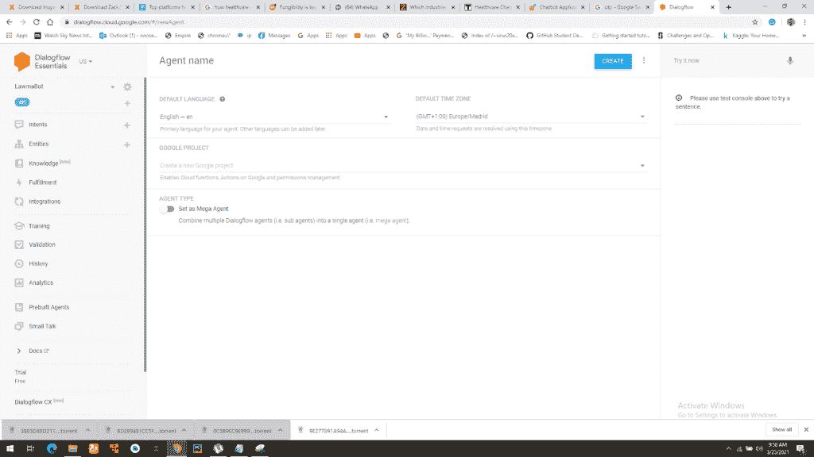
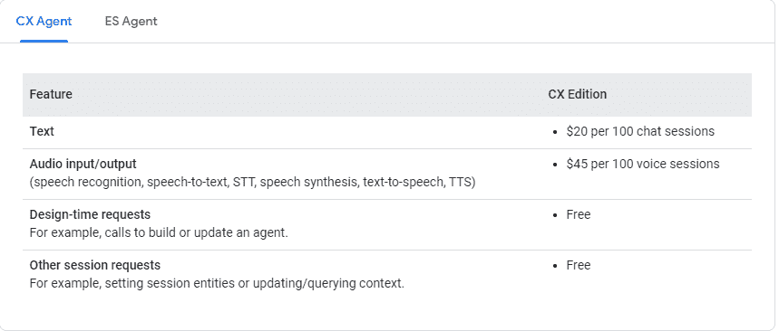
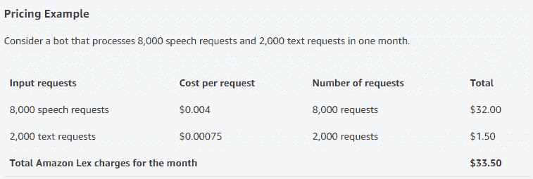
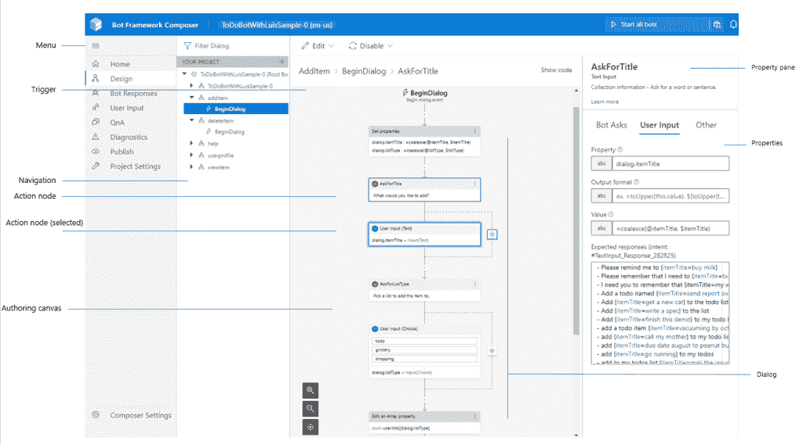
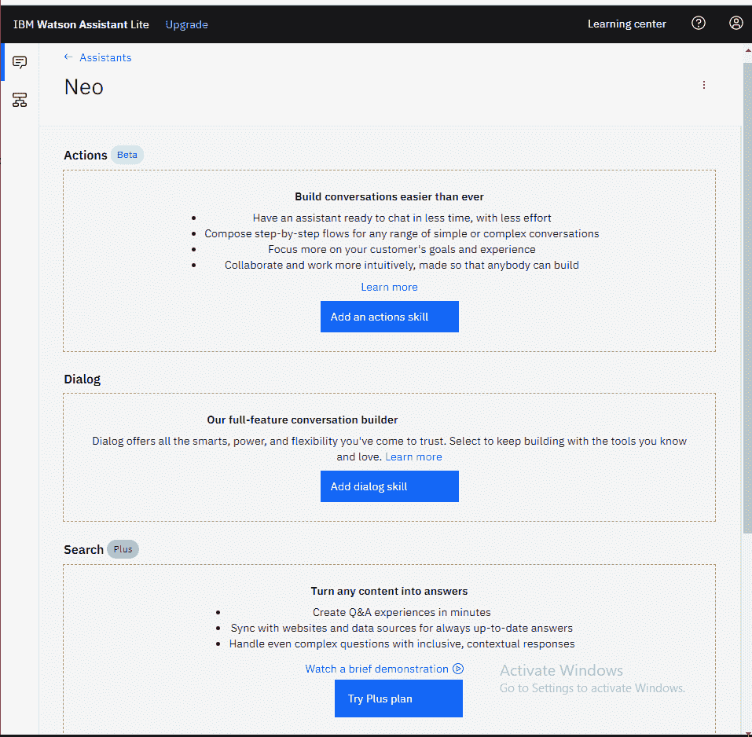

# 构建机器学习聊天机器人:选择正确的平台和应用

> 原文：<https://web.archive.org/web/https://neptune.ai/blog/building-machine-learning-chatbots-platforms-and-applications>

作为从事机器学习的人，你可能被要求[为一个企业](https://web.archive.org/web/20221031141147/https://www.sciencedirect.com/science/article/pii/S2666827020300062)开发一个聊天机器人，或者你以前遇到过一个聊天机器人项目。

当我开始我的 ML 之旅时，一个朋友让我为她的生意做一个聊天机器人。许多失败的尝试之后，有人告诉我用聊天机器人建筑服务检查 ML 平台。从那里除了幸福什么都没有。

如今，企业希望扩大运营规模，聊天机器人不受时间和地理位置的限制，因此它们是实现规模化的良好工具。不仅仅是企业——我目前正在为一个政府机构开发一个聊天机器人项目。

但是让我们暂时回到基础——聊天机器人到底是什么？

在本文中，我们将主要关注机器学习聊天机器人。

## 什么是机器学习聊天机器人？

聊天机器人(对话式人工智能)是一种通过文本消息、语音聊天或两者兼有来模拟人类对话的自动化程序。它基于大量的输入和**自然语言处理(NLP)** 来学习这样做。

出于语义的考虑，聊天机器人和对话助手在本文中可以互换使用，它们的意思差不多。

你为什么需要聊天机器人？

## 为什么您的组织需要聊天机器人？

在甲骨文的一项调查中，80%的企业回答说他们使用聊天机器人，48%的企业已经在使用自动化技术。根据 Grand View Research 的报告，到 2025 年，全球聊天机器人市场预计将达到 12.3 亿美元，年复合增长率为 24.3%。聊天机器人是用来做什么的？

聊天机器人非常适合缩放操作，因为它们没有人类的限制。世界可能会被时区所分割，但聊天机器人可以随时随地吸引客户。在性能方面，如果有足够的计算能力，聊天机器人可以同时服务于大量的客户群。

聊天机器人在自动化特定任务方面非常有效。一旦它们被设定去做一个特定的任务，它们就能轻松完成。例如，一些客户问题被反复询问，并且有相同的、特定的答案。在这种情况下，使用聊天机器人来自动回答这些特定的问题将是简单而有用的。

让用户访问一个网站或一个应用程序并不是主要的挑战——重要的是让他们参与到网站或应用程序中。聊天机器人问候可以通过吸引用户来阻止他们离开你的网站。简短的聊天邀请让您能够主动与用户交流。

4.  **社交媒体整合**

聊天机器人可以与脸书、Telegram、微信等社交媒体平台集成，无论你在哪里交流。它们还可以与网站和移动应用程序集成。集成聊天机器人有助于用户获得快速的问题回复，以及 24/7 小时的帮助，这可能会导致更高的销售额。

当与用户交互时，聊天机器人可以存储数据，这些数据可以被分析并用于改善客户体验。

6.  **能说多种语言**

除了能够进行有意义的对话，聊天机器人还可以理解其他语言的用户查询，而不仅仅是英语。随着自然语言处理(NLP)和神经机器翻译(NMT)的进步，聊天机器人可以用用户的语言即时回复。

7.  **联系年轻客户**

统计数据显示，千禧一代更喜欢通过社交媒体和实时聊天联系品牌，而不是通过电话。他们精通技术，购买力很强。满足他们的需求就好，有一个扎实的聊天机器人。

### 聊天机器人可以帮助的行业

如果你的公司需要全球扩张，你需要能够用不同的语言全天候回应客户。聊天机器人能有效地做到这一点。

随着在线商店的数量与日俱增，电子商务品牌面临着建立庞大的客户群、赢得客户信任并留住他们的挑战。为了成功完成这些任务，品牌需要全天候的客户协助，协助在线购买，管理支付，并向客户提供最新的折扣，建立信任和社交参与。

对于人类来说，做所有这些事情可能很麻烦，但由于聊天机器人没有人类的疲劳，它们可以做到这一点，甚至更多。

研究表明，医疗从业者将六分之一的工作时间花在行政工作上。医疗保健中的聊天机器人对于医疗保健专业人员来说是一个明显的游戏规则改变者。它通过逐渐减少医院就诊、不必要的药物和咨询次数来减少工作量，尤其是在医疗保健行业压力重重的现在。

对于患者来说，它减少了去医生办公室的通勤时间，提供了一个按钮就可以轻松访问医生的机会，等等。此外，聊天机器人有助于节省医疗保健服务的成本。专家估计，到 2022 年，全球医疗保健聊天机器人的成本节约将达到 36 亿美元。

通过聊天机器人，旅行社可以帮助客户预订航班，支付这些航班的费用，并推荐度假和旅游的有趣地点——节省了人类顾问在更重要问题上的时间。

银行和金融随着技术趋势不断发展，行业内的聊天机器人不可避免。通过聊天机器人，公司可以做出数据驱动的决策——促进销售和营销，识别趋势，并根据机器人的数据组织产品发布。

一些银行提供聊天机器人来帮助客户进行交易、投诉和回答问题。合规性和安全性是在金融领域采用新技术的主要障碍，但使用聊天机器人，您可以构建安全协议，如双因素身份认证、令牌集成、防火墙、24/7 监控、保护用户数据的加密后端等。

6.  **食品服务和杂货店**

服务员有时会弄错食物订单。但大多数食品品牌和杂货店都在网上为客户服务，尤其是在这个后 covid 时期，所以几乎不可能依靠人工代理来服务这些客户。在这里使用聊天机器人已经成为必要。他们在正确收集客户订单并交付订单方面效率很高。此外，通过分析客户的查询，食品品牌可以更好地根据他们的市场。由于聊天机器人 24/7 全天候工作，它们随时可用，并能快速响应客户。

几乎每个行业都可以使用聊天机器人进行通信和自动化。一般来说，聊天机器人增加了组织在全球舞台上高效运营所需的灵活性和可伸缩性。

好吧，我们想造一个机器学习聊天机器人。首先，**我们需要一个聊天机器人平台**。

## 什么是聊天机器人平台？

聊天机器人平台是一种服务，开发者、数据科学家和机器学习工程师可以在其中创建和维护聊天机器人。他们提供机器学习功能，比如 NLP。它们还能让你将聊天机器人整合到社交媒体平台上，比如 Facebook Messenger。

我将总结不同的聊天机器人平台，并在每个部分添加链接，在那里您可以了解更多您感兴趣的任何平台。

由 Google Cloud 支持的 Dialogflow 简化了创建和设计接受语音和文本数据的 NLP 聊天机器人的过程。很容易与社交媒体平台整合。

Chatbot 开发通过 Dialogflow 控制台进行，使用起来很简单。在控制台中开发之前，您需要理解 Dialogflow 中使用的关键术语——代理、意图、实体等。

例如，**意图**是由开发人员定义的任务(通常是对话)。用户可以调用它。开发者用它来定义用户可能提出的问题，并纠正聊天机器人的反应。

**实体**是 Dialogflow 中用于回答用户请求或查询的属性。它通常是请求中的一个关键词——姓名、日期、地点。它们是在控制台内部定义的，因此当用户说话或键入请求时，Dialogflow 会查找实体，并且实体的值可以在请求中使用。

Dialogflow 有一组预定义的系统实体，您可以在构建意图时使用。如果这些还不够，您还可以定义您自己的实体在您的意图中使用。

继续，当您在 Dialogflow 中使用更多集成选项时， **Fulfillment** 提供了更动态的响应。实现是针对意图而启用的，启用后，Dialogflow 将通过调用您定义的服务来响应该意图。例如，如果用户想预订周四的航班，包括航班信息，聊天机器人将在航班数据库中运行，并将周四的航班信息返回给用户。

**Context** 可以通过设置输入和输出上下文来配置意图，输入和输出上下文由字符串名称标识。

等等，要理解所有这些概念，最好参考 Dialogflow 文档。

Dialogflow 的一个好处是它抽象出了构建 NLP 应用程序的复杂性。此外，它还提供了一个控制台，开发人员可以在这里可视化地创建、设计和训练一个由人工智能驱动的聊天机器人。在控制台上，有一个模拟器，您可以在其中测试和培训代理。

*Dialogflow (Source: screenshot)*

Dialogflow 提供了两种不同的虚拟代理服务，每种服务都有自己的代理类型、用户界面、API、客户端库和文档:

*   Dialogflow ES:标准代理类型，最适合构建简单的聊天机器人。该代理服务的价格分为免费试用版和基础版。您可以通过[对话流 ES 基础文档](https://web.archive.org/web/20221031141147/https://cloud.google.com/dialogflow/docs/basics)了解更多关于 ES 的信息。
*   Dialogflow CX:高级代理服务，适用于大型或非常复杂的代理。它包括[流](https://web.archive.org/web/20221031141147/https://cloud.google.com/dialogflow/cx/docs/concept/flow)，[页面](https://web.archive.org/web/20221031141147/https://cloud.google.com/dialogflow/cx/docs/concept/page)是对话设计的构建模块，[状态处理程序](https://web.archive.org/web/20221031141147/https://cloud.google.com/dialogflow/cx/docs/concept/handler)用于控制对话路径。新开发人员可以获得 600 美元的免费积分来使用 Dialogflow CX，这将在第一次试用时自动激活，并在 12 个月后过期。要了解关于这种代理类型的更多信息，请查看 [Dialogflow CX 基础文档](https://web.archive.org/web/20221031141147/https://cloud.google.com/dialogflow/cx/docs/basics)。

像 Dominos、Shelf、Vonder 和 SnapEngage 这样的公司都使用 Dialogflow。

*Dialogflow service types (Source: screenshot)*

Dialogflow 可以与 GCP 和 AutoML 集成，以提高训练和 NLP 的准确性。

在本文的[中阅读关于 Dialogflow 的更多信息。](https://web.archive.org/web/20221031141147/https://www.d3vtech.com/insights/the-ai-behind-google-dialogflow-how-it-differs-from-other-conversational-ai)

Amazon Lex 用于在任何使用语音和文本的应用程序中构建聊天机器人界面。Amazon Lex 使用自动语音识别(ASR)将语音转换为文本，并使用自然语言理解(NLU)来识别文本意图。有先进的深度学习功能，用于构建具有高度吸引人的用户体验和逼真的对话交互的应用程序。

它使用支持亚马逊 Alexa 的深度学习技术，使您能够快速轻松地构建复杂的自然语言对话机器人。

像 Dialogflow 一样，Lex 也有自己的一套术语，比如 intents、slots、fulfilments 等等。

*   意图:用户在与聊天机器人交互时将执行/进行的动作或对话。
*   Slot:Amazon Lex 中的 slot 是一个参数，用于理解并正确满足用户请求。
*   Slot type:这个 Slot type 是 Amazon Lex 用来训练机器学习模型识别 slot 值的值列表。例如，您可以定义一个名为“流派”的槽类型槽类型中的每个值是流派的名称，“喜剧”、“冒险”、“纪录片”等。您还可以为插槽类型值定义同义词。例如，您可以为值“喜剧”定义同义词“滑稽”和“幽默”每个插槽类型最多有 10，000 个值和同义词。一个 bot 总共可以有 50，000 个槽类型值和同义词。Amazon Lex 还提供了内置的插槽类型。

亚马逊 Lex 第一年免费。从您开始使用 Amazon Lex 之日起，您每月可以处理多达 10，000 个文本请求和 5，000 个语音请求或语音间隔。

*Source: Amazon Lex pricing*

Lex 具有内置支持，可以将机器人与脸书、Kik、Slack 等平台集成。要将您的机器人与您的网站或移动应用程序集成，您有两种方法:

1.  使用 AWS SDK:AWS SDK 提供了向机器人发送查询的 API。这需要一定程度的编程知识。
2.  使用[komunicate](https://web.archive.org/web/20221031141147/http://www.kommunicate.io/):komunicate 是一个人-混合客户支持软件，它提供了与 Amazon Lex 的无代码集成，以及丰富的聊天界面。

亚马逊 Lex 的客户包括 TransUnion，GE Appliances， [Citbot](https://web.archive.org/web/20221031141147/https://aws.amazon.com/blogs/machine-learning/how-citibots-chatbot-search-engine-uses-ai-to-find-more-answers/) ， [John Creek](https://web.archive.org/web/20221031141147/https://aws.amazon.com/solutions/case-studies/city-of-johns-creek-case-study/?did=cr_card&trk=cr_cardhttps://aws.amazon.com/solutions/case-studies/city-of-johns-creek-case-study/?did=cr_card&trk=cr_card) 等。

Azure Bot Services 是一个用于 Bot 开发的集成环境。它使用 [Bot Framework Composer](https://web.archive.org/web/20221031141147/https://docs.microsoft.com/en-us/composer/introduction) ，这是一个开源的可视化编辑画布，用于使用模板开发对话流，并使用工具为特定用例定制对话。

它集成了自然语言理解服务，如 [LUIS](https://web.archive.org/web/20221031141147/https://www.luis.ai/) 和 [QnA Maker](https://web.archive.org/web/20221031141147/https://www.qnamaker.ai/) ，并允许机器人使用自适应语言生成进行回复。Composer 在桌面和基于 web 的组件上都可用。它还提供对自适应对话框和语言生成的访问。

自适应对话框:这是一个灵活的对话框模型，允许开发人员基于上下文动态更新保护流程。它使得计划语义的中断、取消和执行变得更加容易。在[自适应对话文档](https://web.archive.org/web/20221031141147/https://docs.microsoft.com/en-us/azure/bot-service/bot-builder-adaptive-dialog-Introduction?view=azure-bot-service-4.0)中了解更多信息。

语言理解(LU): LU 是 Composer 中的核心组件，它允许开发人员和对话设计人员在编辑对话的上下文中直接训练语言理解。当在 Composer 中编辑对话框时，开发人员可以不断地增加他们的机器人的自然语言能力。要了解更多关于 Composer 中的语言生成，请查看[语言生成文档。](https://web.archive.org/web/20221031141147/https://docs.microsoft.com/en-us/composer/concept-language-understanding)

*Source: Azure bot framework documentation*

简而言之，Composer 在语言生成(LG)中使用自适应对话框来简化中断处理并赋予机器人特性。

Composer 中的可视化设计界面消除了对样板代码的需要，并使 bot 开发更容易。您不再需要在体验之间导航来维护 LU 模型，它在应用程序中是可编辑的。设置环境的步骤更少，从而节省了时间。

Composer 提供了构建复杂对话体验所需的一切:

*   对话流的可视编辑画布，无需编写代码，
*   创作和管理语言理解(NLU)和 QnA 组件的工具，
*   强大的语言生成和模板系统，
*   一个现成的 bot 运行时可执行文件。

定价:

使用 Azure Bot 服务的公司包括戴姆勒、联合包裹服务公司、大金工业、西班牙电信等。

IBM 沃斯顿助手由 IBM 的 Watson AI 引擎提供支持，通过 IBM Cloud 交付，让您可以在任何应用程序、设备或渠道中构建、训练和部署聊天机器人。

*IBM Console (Source: screenshot)*

要使用 Watson Assistant 进行构建，您必须创建一个免费的 IBM Cloud 帐户，然后将 Watson Assistant 资源添加到您的服务包中。IBM Watson Assistant 提供了关于如何构建 IBM Watson Assistant 的各种学习资源。

IBM Watson Assistant 中的一个概念是技能的使用。这里的技能是指聊天机器人的能力。在技能中，你可以创建一个技能对话框和一个动作对话框。IBM Watson Assistant 还具有类似 Spring Expression Language、slot、decadevictions 或 content catalog 的特性。

沃森助手有一个虚拟开发工具包，用于将他们的聊天机器人与第三方应用程序集成在一起。使用该工具包，第三方应用程序可以将用户输入发送到 Watson Assistant 服务，该服务可以与供应商的后端系统进行交互。

沃森可以为最终用户的行为和偏好创建认知档案，并启动对话以提出建议。IBM 还为开发人员提供了一个已经配置好的汽车和酒店行业的客户服务和行业内容包目录。

开发人员还可以修改沃森助手的回应，以创建一个反映品牌人口统计数据的[人工人格](https://web.archive.org/web/20221031141147/https://searchenterpriseai.techtarget.com/definition/artificial-personality-AP)。它通过允许用户选择退出数据共享来保护数据和隐私。它还支持多种语言，如西班牙语、德语、日语、法语或韩语。

定价:在 Watson Assistant 上使用 Lite 计划构建聊天机器人是免费的，但它的上限是 10，000 次 API 调用。那么标准版的 Watson Assistant 定价为每个 API 调用 0.0025 美元。

DB Dialog 和 DB Steel、苏格兰 BBank、Staples、Workday 等公司都使用 IBM Watson Assistant 作为他们的对话式 AI 平台。

## 结论

聊天机器人在当今的数字经济中非常有用。它们为各种业务运营提供了可扩展性和灵活性。而且，它们的构建和部署非常简单。它们是自动化工作流程(如订购披萨等重复性任务)的绝佳方式。

我希望这篇文章能给你一些关于使用哪个平台来构建聊天机器人的想法。感谢阅读！

### 参考

### 小野寺次郎

机器学习工程师和研究员，对人工智能和人类福祉(医疗保健和教育)之间的交叉充满热情。在我的空闲时间，我喜欢尝试新的菜肴和看动漫。

* * *

**阅读下一篇**

## 如何构建和管理自然语言处理(NLP)项目

Dhruvil Karani |发布于 2020 年 10 月 12 日

如果说我在 ML 行业工作中学到了什么的话，那就是:**机器学习项目很乱。**

这并不是说人们不想把事情组织起来，只是在项目过程中有很多事情很难组织和管理。

你可以从头开始，但有些事情会阻碍你。

一些典型的原因是:

*   笔记本中的快速数据探索，
*   取自 github 上的研究报告的模型代码，
*   当一切都已设置好时，添加新的数据集，
*   发现了数据质量问题并且需要重新标记数据，
*   团队中的某个人“只是快速地尝试了一些东西”,并且在没有告诉任何人的情况下改变了训练参数(通过 argparse 传递),
*   从高层推动将原型转化为产品“仅此一次”。

多年来，作为一名机器学习工程师，我学到了一堆**东西，它们可以帮助你保持在事物的顶端，并检查你的 NLP 项目**(就像你真的可以检查 ML 项目一样:)。

在这篇文章中，我将分享我在从事各种数据科学项目时学到的关键指针、指南、技巧和诀窍。许多东西在任何 ML 项目中都是有价值的，但有些是 NLP 特有的。

[Continue reading ->](/web/20221031141147/https://neptune.ai/blog/how-to-structure-and-manage-nlp-projects-templates)

* * *