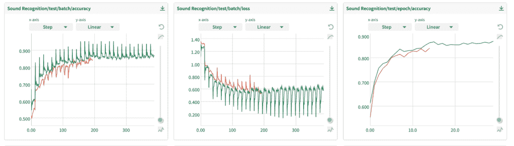

# 构建机器学习管道:常见陷阱

> 原文：<https://web.archive.org/web/https://neptune.ai/blog/building-ml-pipelines-common-pitfalls>

近年来，机器学习取得了快速进步，这导致许多公司和初创公司在不了解陷阱的情况下钻研该领域。常见的例子是[构建 ML 管道](/web/20220926092926/https://neptune.ai/blog/build-mlops-pipelines-with-github-actions-guide)时遇到的陷阱。

机器学习管道很复杂，有几种方式可能会失败或被误用。参与 ML 项目的利益相关者需要了解机器学习管道如何失败，可能的陷阱，以及如何避免这样的陷阱。

在构建机器学习管道时，有几个陷阱你应该知道。最常见的陷阱是[黑盒问题](https://web.archive.org/web/20220926092926/https://www.thinkautomation.com/bots-and-ai/the-ai-black-box-problem/)——管道太复杂，难以理解。这可能会导致无法识别给定系统的问题，或者为什么它不能按预期工作。

为了理解其他陷阱，我们将看一看典型的 ML 管道架构，包括所涉及的步骤，以及在各个步骤下要避免的陷阱。

## 通用 ML 流水线架构

机器学习管道帮助团队组织和自动化 ML 工作流。该管道还为 ML(和数据)工程师提供了一种管理培训数据、编排培训和服务工作以及管理生产模型的方法。

让我们回顾一下定义其架构的 ML 管道中的典型过程。

ML 管道应关注以下步骤:

1.  **数据摄取**:收集必要的数据是整个程序的第一步。用于培训的数据将由数据科学家或具有业务专长的人员组成的专业团队与数据工程师共同定义。

2.  **数据验证和** [**预处理**](/web/20220926092926/https://neptune.ai/blog/data-preprocessing-guide) :采集的数据有很多变化。这通常是手动完成的，以格式化、清理、标注和增强数据，从而确保模型的数据质量可以接受。该模型的特征是将在培训和生产中使用的数据值。

3.  **模特培训**:培训是整个程序中最重要的一个环节。数据科学家将模型与以前的数据进行匹配以进行学习，训练它对看不见的数据进行预测。

4.  **模型分析和验证**:为了保证较高的预测精度，根据测试和验证数据对训练好的模型进行验证。当比较测试的结果时，模型可能已经根据不同的数据进行了调整/修改/训练。

5.  **模型部署**:最后阶段是将 ML 模型应用于生产设置。因此，本质上，最终用户可以利用它来获得基于实时数据的预测。

6.  **管道协调** : [管道协调技术](/web/20220926092926/https://neptune.ai/blog/best-workflow-and-pipeline-orchestration-tools)采用简单的协作界面来自动化和管理所有管道流程，在某些情况下还包括基础设施。

7.  **元数据管理**:这一步跟踪[元数据](/web/20220926092926/https://neptune.ai/blog/ml-metadata-store)，如代码版本、模型版本、超参数值、环境和评估度量结果，以一种使它们在公司内部可访问和协作的方式组织它们。

就 ML 管道架构而言，有几种选择是可能的，我们将依赖这些 ML 管道和服务提供商，如[谷歌云](https://web.archive.org/web/20220926092926/https://cloud.google.com/gcp?utm_source=google&utm_medium=cpc&utm_campaign=emea-de-all-en-bkws-all-all-trial-e-gcp-1011340&utm_content=text-ad-none-any-DEV_c-CRE_500236788645-ADGP_Hybrid%20%7C%20BKWS%20-%20EXA%20%7C%20Txt%20~%20GCP%20~%20General%23v1-KWID_43700060393213373-aud-488003287435%3Akwd-6458750523-userloc_9043981&utm_term=KW_google%20cloud-NET_g-PLAC_&gclid=CjwKCAjwoduRBhA4EiwACL5RPzJRiaBnMPPmAM7vV7o6G37rqSGnliVQy2OwUcPbEOSmQ8IgaToLjRoCdMkQAvD_BwE&gclsrc=aw.ds)和 [AWS](https://web.archive.org/web/20220926092926/https://aws.amazon.com/) 。[例如，Azure ML](https://web.archive.org/web/20220926092926/https://www.googleadservices.com/pagead/aclk?sa=L&ai=DChcSEwii99X95tT2AhV1j2gJHfQaDpsYABABGgJ3Zg&ae=2&ohost=www.google.com&cid=CAESbeD2ky8xCHR4Oa43oWJ57Im53iX9I9Z7llYj4gwqxV9OEA0r5nIGDs2Fmbl8UBfjWRYNziAtMbelI9iRTX7C2fPOtFfuZRB7_voTSaHRxyCXWamJPX9JRL-n___oQidJBaVL6TdV3VGZZMZLAd4&sig=AOD64_1ekS-zcfctbT5ohRJ5lVIvC3LLRg&q&adurl&ved=2ahUKEwjR2s395tT2AhUzhv0HHeGPBK0Q0Qx6BAgCEAE&dct=1) pipeline 帮助创建、管理和优化机器学习工作流。它是 ML 工作流的一个独立的可部署流程。它使用起来非常简单，并提供了各种额外的管道，每个管道都有不同的功能。

## ML 管道步骤中的常见陷阱

从接收数据到建模、操作模型，运行 ML 管道可能非常繁琐。在 ML 应用程序的生命周期中，管理管道也是一个很大的困难。在本节中，您将了解在构建 ML 管道的每个步骤中可能遇到的常见陷阱。

### 数据摄取步骤

#### 处理各种数据源

数据接收是指将数据从许多来源移动到一个集中的数据库中，通常是一个数据仓库，下游系统可以在那里使用这些数据。这可以在实时或批处理模式下完成。数据接收和数据版本控制构成了数据分析架构的核心。关于这一步，最常见的陷阱是不同的数据格式和类型，根据数据的性质，这些格式和类型可能会使流程变得混乱和不同。

##### 成批处理方式

最流行的数据摄取模型[批处理](https://web.archive.org/web/20220926092926/https://www.projectmanager.com/blog/what-is-batching)。在批处理中，摄取层根据定义获取源数据，并将其移动到数据仓库或其他数据库。批处理可能由时间表、预定义的逻辑序列或某些预定义的标准启动。因为批处理通常不太昂贵，所以当不需要实时数据接收时，经常使用批处理。

##### 实时流模式

[实时流](https://web.archive.org/web/20220926092926/https://www.googleadservices.com/pagead/aclk?sa=L&ai=DChcSEwimtrf45NT2AhX2kGgJHYYbAXMYABABGgJ3Zg&ae=2&ohost=www.google.com&cid=CAESbeD2han1hI1uDV8UqkLFWVuwFxCzytKOWlDHgsKUla58_OHCx0Jn-REUb-CozWNvsnj69dHjyKfW6XMXy5X_3GsvpuQTnJfANS-jYCC5yv19whlPxXWqALuKneB3IaoJJVu3ZHpqB3ycvdXWygI&sig=AOD64_21PfyRfwnQqK9aUJhfJqLQ7-H1Qw&q&adurl&ved=2ahUKEwjW3a745NT2AhWMg_0HHQ2-ASMQ0Qx6BAgEEAE&dct=1)是一种将数据从源实时接收到目标的技术。流没有周期性元素，这意味着数据一旦在源上变得可访问，就被接收到数据仓库中。没有等待期。这需要一个能够持续监控数据生产者的新数据的系统。

#### 解决办法

这里最重要的规则是在整个管道中保持一致的数据层。

即使是从各种数据源获取数据，也要始终注意用相似的格式维护数据。

*   您需要良好的报告和其他下游分析系统，这些系统要有良好的数据质量和可追踪的数据血统才能正常工作。
*   您的数据需要保持一致，因为可能会通过不同的模式(实时和批处理)接收数据

### 数据验证和处理

#### 选择错误的架构

数据验证和数据处理是可能被管道问题阻碍的两个步骤。因为数据源会定期变化，所以随着时间的推移收集的数据的格式和类型也会变化，所以使数据输入系统适应未来是一个重要的问题。

在数据输入和管道过程中，速度可能是一个问题。例如，建立一个实时管道是非常昂贵的，因此评估你的公司真正需要的速度是至关重要的。

#### 忽视数据质量监控

例如，在计算机能够执行一个批处理任务之前，它的所有输入数据必须准备好；这意味着必须对其进行彻底检查。[数据质量问题](https://web.archive.org/web/20220926092926/https://blog.datumize.com/the-five-most-common-data-quality-issues-and-how-to-overcome-them)，批处理作业中出现的数据错误、差错和软件故障会使整个流程陷入停顿甚至更糟，导致[静默模型故障](https://web.archive.org/web/20220926092926/https://www.kdnuggets.com/2022/01/machine-learning-models-die-silence.html)。

#### 解决办法

必须彻底监控数据质量，以确保管道中的后续步骤使用高质量数据..微小的数据错误，如日期输入错误，可能会导致批处理失败。

也就是说，我们必须始终记住，运行在生产服务器上的模型将利用真实世界的数据为用户做出预测，因此我们还需要监控数据分布随时间的[变化。](https://web.archive.org/web/20220926092926/https://huyenchip.com/2022/02/07/data-distribution-shifts-and-monitoring.html)

创建 ML 模型并不是一项简单的任务，要使模型在不同的环境中表现良好，需要高质量的数据。进入管道的坏数据不仅会导致您的模型无法正常运行，还可能会在做出关键业务决策时带来灾难性后果，尤其是在医疗保健或无人驾驶汽车等任务关键型行业。

### 模特培训

#### 在模型训练期间使用未经验证的非结构化数据

机器学习工程师在人工智能研究中最常见的错误之一是使用未经验证的非结构化数据。未验证的数据可能包含诸如重复、数据冲突、分类不准确或不完整、差异以及其他可能导致整个训练过程异常的数据问题。

#### 解决办法

当然，补救所有这些问题的一个方法是利用一个[实验跟踪工具](/web/20220926092926/https://neptune.ai/blog/best-ml-experiment-tracking-tools)。通过这种方式，您可以跟踪所有管道运行会话、训练数据的多个版本，并且在生产阶段，只需单击几下鼠标，即可轻松监控模型版本和数据流。 [Neptune.ai](/web/20220926092926/https://neptune.ai/product/experiment-tracking) 是在这种情况下使用的合适工具。

### 模型验证和分析

#### 粗心的预处理会在模型验证期间引入训练/测试泄漏

模型验证在部署之前正确评估模型的真实性能。有一些要点需要记住:

*   **模型应用**:我们的模型可能用于关键任务应用。靠谱吗？
*   **模型可推广性**:当我们的模型被部署并且在现实世界中表现不佳时，我们不希望获得极好的测试集性能而感到失望。
*   **模型评估**:在部署期间，我们不会总是知道新输入的基本事实。因此，在部署后衡量模型的性能可能很困难。

在这个陷阱下，有两件事要永远记住:

1.  一个[简单的训练/测试分割](https://web.archive.org/web/20220926092926/https://machinelearningmastery.com/data-preparation-without-data-leakage/)隐含地假设我们的数据由 [iid 样本](https://web.archive.org/web/20220926092926/https://www.statisticshowto.com/iid-statistics/)组成。
2.  如果我们的数据违反了 iid 假设，那么测试集的性能可能会误导我们，导致我们高估模型的预测能力。

#### 解决方法

*   如果您的数据是 iid，那么您可以使用标准分割或交叉验证。以下是 Scikit-learn 的一些实现:
*   当你的数据有一个[顺序结构](https://web.archive.org/web/20220926092926/https://towardsdatascience.com/sequence-models-and-recurrent-neural-networks-rnns-62cadeb4f1e1)(比如文本流、音频片段、视频片段)，那么你应该使用一个适合这种情况的[交叉验证器](https://web.archive.org/web/20220926092926/https://medium.com/analytics-vidhya/cross-validation-what-why-and-how-machine-learning-f8a1159ce5ff)。

### 模型部署

#### 思考部署是最后一步

一个普遍的误解是，机器学习模型在部署后会自动纠正自己，并且不应该对模型做什么。这在诸如强化学习的领域中可能是真实的，然而，即使使用这种技术，模型参数也要在一段时间内更新以达到最优。

当然，典型的 ML 模型并非如此，在部署阶段会出现很多错误。一个常见的错误是忽略生产中的监控模型性能和使用成本。

#### 解决办法

*   为了确保模型得到监控，我们可以利用[各种模型监控工具](/web/20220926092926/https://neptune.ai/blog/ml-model-monitoring-best-tools)，这取决于它们的易用性、灵活性、监控功能、开销和警报系统。

此外，根本原因分析可用于确定问题的根本原因，然后通过正确的行动计划来解决问题。

### 元数据管理

#### 忽视管道元数据管理

正如您在本文中了解到的，使用 ML 管道会很快变得非常复杂。每个步骤都会产生元数据，如果不加以管理，可能会导致潜在的问题，例如无法跟踪和调试管道故障。

#### 解决办法

使用管道元数据管理工具来跟踪和管理管道每个步骤产生的元数据。做得很好的工具之一是 [Neptune.ai](/web/20220926092926/https://neptune.ai/) 。另一个擅长管理管道元数据的工具是 [Kedro](https://web.archive.org/web/20220926092926/https://kedro.readthedocs.io/en/stable/tutorial/create_pipelines.html) (由于有了 [Neptune-Kedro 插件](https://web.archive.org/web/20220926092926/https://docs.neptune.ai/integrations-and-supported-tools/automation-pipelines/kedro)，实际上可以很容易地将它们集成在一起)。

使用 Neptune.ai，您可以轻松跟踪所有 ML 管道实验和元数据。当处理生产设置时，Neptune 可以用来避免问题。

### 元数据管理和实验跟踪

[ML 元数据存储](/web/20220926092926/https://neptune.ai/blog/ml-metadata-store)是用于管理模型管道元数据的 [MLOps 栈](/web/20220926092926/https://neptune.ai/mlops-tool-stack)的重要组件。 [Neptune.ai](/web/20220926092926/https://neptune.ai/) 是一个集中式元数据存储，可以在任何 MLOps 进程中使用。

*Example of run comparisons in Neptune.ai for speech recognition project | [Source](https://web.archive.org/web/20220926092926/https://app.neptune.ai/aymane.hachcham/Speech-Recognition-TF/experiments?compare=IwGl7Mg&split=cmp&dash=charts&viewId=standard-view)*

上面的例子显示了一个仪表板[比较了指标和来自管道中实验的训练结果](https://web.archive.org/web/20220926092926/https://docs.neptune.ai/you-should-know/comparing-runs)。实验培训超出了上面的例子，它包括如下几个方便的功能:

*   [超参数](/web/20220926092926/https://neptune.ai/blog/how-to-track-hyperparameters)
*   学习曲线
*   培训代码和配置文件
*   预测(图像、表格等。)
*   诊断图表(混淆矩阵、ROC 曲线等。)—您可以使用外部库(如 Plotly 等)记录交互式图表。
*   控制台日志
*   硬件日志
*   模型二进制文件或模型资产的位置
*   数据集版本
*   链接到记录的模型训练运行和实验
*   模型描述和注释

要了解更多，你可以查看 [Neptune 的文档](https://web.archive.org/web/20220926092926/https://docs.neptune.ai/)，它非常详尽。在这里，您可以学习如何[将 Neptune.ai 与您的管道](https://web.archive.org/web/20220926092926/https://docs.neptune.ai/how-to-guides/neptune-api/pipelines)集成。

## 总结想法

如您所见，在设计处理 ML 流程所有不同阶段的管道时，可能会出现很多问题。尤其是在生产过程中，可能会出现一些意外问题，从而导致严重的问题，甚至在某些情况下导致业务损失。

我们在这里讨论的陷阱很常见，在本文中，我们列出了一些解决方案。本文还向您简要介绍了可能导致事情偏离最初计划的原因。

最后，如果它符合您的工作流程，我会强烈推荐 Neptune.ai 作为您的管道元数据存储，无论您或您的同事在哪里运行您的管道——无论是在云中、本地、笔记本中还是其他任何地方。

### 艾曼·哈克姆

Spotbills 的数据科学家|机器学习爱好者。

* * *

**阅读下一篇**

## 最佳 MLOps 工具以及如何评估它们

12 分钟阅读| Jakub Czakon |年 8 月 25 日更新

在我们的一篇文章中——[机器学习团队实际使用的最好的工具、库、框架和方法——我们从 41 家 ML 初创公司学到的东西](https://web.archive.org/web/20220926092926/https://neptune.ai/blog/tools-libraries-frameworks-methodologies-ml-startups-roundup)——Acerta 的 CTO Jean-Christophe Petkovich 解释了他们的 ML 团队如何接近 MLOps。

**据他所说，一个完整的 MLOps 系统有几个要素:**

*   您需要能够构建包含预处理数据和生成结果所需的所有信息的模型工件。
*   一旦您能够构建模型工件，您必须能够跟踪构建它们的代码，以及它们被训练和测试的数据。
*   您需要跟踪所有这三样东西，模型、它们的代码和它们的数据，是如何关联的。
*   一旦您可以跟踪所有这些内容，您还可以将它们标记为准备就绪，进行生产，并通过 CI/CD 流程运行它们。
*   最后，为了在该过程的最后实际部署它们，您需要某种方法来基于该模型工件旋转服务。

这是对如何在公司中成功实施 MLOps 的高度概括。但是理解高层需要什么只是拼图的一部分。另一个是采用或创建适当的工具来完成工作。

这就是为什么我们编制了一份**最佳 MLOps 工具**的清单。我们将它们分为六类，以便您可以为您的团队和业务选择合适的工具。让我们开始吧！

[Continue reading ->](/web/20220926092926/https://neptune.ai/blog/best-mlops-tools)

* * *