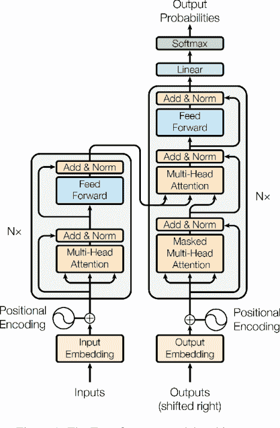
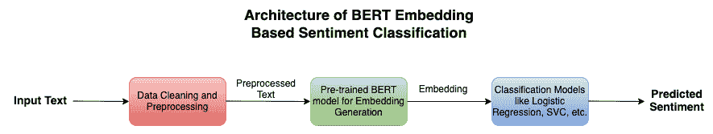
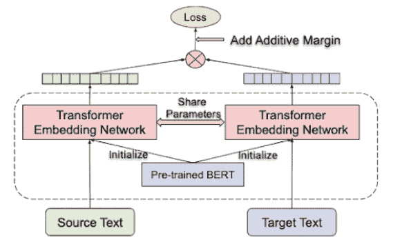

# 用 BERT 嵌入构建情感分类系统:经验教训

> 原文：<https://web.archive.org/web/https://neptune.ai/blog/building-sentiment-classification-system-with-bert-embeddings>

情感分析，通常被称为观点挖掘/情感分类，是利用[计算语言学](https://web.archive.org/web/20230208123129/https://plato.stanford.edu/entries/computational-linguistics/)、[文本分析](https://web.archive.org/web/20230208123129/https://monkeylearn.com/text-analysis/)、[自然语言处理](https://web.archive.org/web/20230208123129/https://www.ibm.com/in-en/topics/natural-language-processing)从源材料中识别和提取主观信息的技术。它经常被用来评估一个演讲者或作者对一个主题的观点或一篇文章的整体语境极性。情感分析的结果通常是表示文本情绪(例如，积极、消极、中性)的分数或二进制值。

情感分析是市场营销和产品空间中最重要的概念之一。它帮助企业识别客户对其产品和服务的反应。现在，每一个提供产品或服务的企业都提供用户反馈服务，用户可以自由地发表他们对服务的感受。然后使用机器学习和深度学习情感分析技术，这些企业分析客户对他们的产品是积极还是消极，以便他们可以做出适当的商业决策来改善他们的业务。

通常有三种不同的方法来实现情感分类系统:

1.  **基于规则的方法:**在这种方法中，使用一组预定义的规则来对文本的情感进行分类。不同的单词集合首先被标记为三个不同的类别。比如“开心”、“优秀”等词语。被赋予一个积极的标签。像“血统”、“平均”等词。被分配了一个中性的标签，最后，像“悲伤”、“不好”等词。被赋予了一个负面的标签。如果在文本中检测到这些词中的任何一个，那么它被分类到给定的情感类别之一中。

2.  基于 ML 的方法:基于规则的方法不能识别诸如讽刺和挖苦、多种类型的否定、单词歧义和文本中的多极等事物。例如，“太好了，你又迟到了”，是一个带有负面情绪的句子，但是这个句子被归类为正面情绪的可能性更高。由于这个原因，企业现在专注于基于 ML 的方法，其中不同的 ML 算法在预先标记的文本的大数据集上训练。这些算法不仅关注单词，还关注其在不同场景中的上下文以及与其他单词的关系。不同的方法，如基于单词包的模型、基于 LSTM 的模型、基于变压器的模型等。，用于对文本情感进行分类。

3.  **混合方法:**这种方法是上述两种方法的结合，可以同时使用基于规则和基于 ML 的方法进行情感分类系统。

在过去的几年中，基于 ML 的方法之一是基于变压器的模型，如 BERT。一种预训练的基于变压器的神经网络模型，称为 BERT(来自变压器的双向编码器表示)，已经在各种自然语言处理应用程序上获得了前沿性能，包括情感分析。BERT 可以理解给定文本的上下文，这使它成为情感分析的一个很好的候选对象。

*The model architecture of the Transformer | [Source](https://web.archive.org/web/20230208123129/https://www.semanticscholar.org/paper/Attention-is-All-you-Need-Vaswani-Shazeer/204e3073870fae3d05bcbc2f6a8e263d9b72e776)*

BERT 考虑短语中单词的双向上下文的能力是另一个显著的优点。一个单词的上下文以前只考虑它前面的单词，但是 BERT 模型也考虑它后面的单词。这增强了它在情感分析中的性能，并帮助它更好地理解单词的含义。

在本文中，您将看到我在研究情感分类模型时学到的一些东西。

## 从使用 BERT 构建情感分类中获得的经验教训

你可能会困惑的一件事是，如何准确地使用 BERT 嵌入进行情感分类。要回答这个，你需要先了解一下[一击学习或者零击学习](https://web.archive.org/web/20230208123129/https://analyticsindiamag.com/how-do-zero-shot-one-shot-and-few-shot-learning-differ/)的概念。

在这种方法中，您使用预先训练的 BERT 模型来获得不属于训练的新数据的嵌入。当你没有足够的数据来训练任何深度学习模型时，这种方法是最合适的。然后，这些嵌入被用作任何分类模型的输入，如逻辑回归、SVC、CNN 等。以进一步将它们分类为情绪类别之一(消极、中立和积极)。

The architecture of BERT embedding, based sentiment classification system| Source: Author

是时候讨论我在处理这个用例时学到的东西了，这样当你遇到这些挑战时你就知道该怎么做了。

## 处理多语言数据

### 问题 1:预处理多语言数据

数据预处理是任何基于 ML 或 AI 的项目的基石。您用于 ML 的每个数据集都需要以某种方式进行处理。例如，在情感分类等 NLP 用例中，您需要通过删除停用词和一些常规词(如 the、he、you 等)来预处理文本。，因为这些单词对机器没有任何意义。此外，还有某些预处理阶段，如删除电子邮件 id、删除电话号码、删除特殊字符、词干或词汇化等。，用于为模型训练清理数据。

对于英语来说，这似乎很容易，因为通用语言已经有了很大的发展，但是对于多语言数据，您将无法确定，因为这些语言具有不同的语法结构、词汇和习惯表达方式。这使得训练一个能够同时准确处理多种语言的模型变得困难。此外，一些语言使用非拉丁字符，这可能会导致预处理和建模方面的问题，这包括中文、阿拉伯语、日语等语言。

### 解决办法

有效地预处理多语言数据是 ML 模型在现实世界数据中表现更好的原因。对于这种多语言数据，您需要准备不同的停用词、常规词、词汇化/词干化词等列表。这可能很耗时。感谢  [NLTK](https://web.archive.org/web/20230208123129/http://nltk.org/) 和 Scipy 库为所有数据预处理任务提供了一个语料库列表。您需要加载您正在使用的语言的语料库，并使用不同的函数对数据进行预处理。此外，要删除特殊字符(非拉丁单词)，您需要手动准备一个函数，确定哪些字符不是文本的一部分，并显式删除它们。

### 问题 2:多语言数据建模

如今，大多数产品都内置了多语言功能。随着越来越多的地区和非地区的人可以使用它，这使得企业得以发展。但是这种支持多种语言的特性也产生了为情感分类创建不同的 ML 模型的问题。在处理用于情感分类的多语言数据时会出现一些问题:

## 

*   语法结构、词汇和习惯表达因语言而异。由于这一点，训练一个可以同时准确处理几种语言的模型可能具有挑战性。
*   用几种语言收集和注释大量的数据可能会花费大量的时间和金钱。因此，用足够的数据来训练模型以产生高性能可能是具有挑战性的。
*   由于几种语言的嵌入空间可能不直接相关，因此在多语言嵌入中比较不同语言的嵌入可能具有挑战性。
*   情感标注是一项主观任务，可能会因标注器而异，尤其是跨语言，这会导致标注不一致，从而影响模型的性能。

英语是通用语言，所有原始语言模型通常都是用英语训练的。因此，处理多语言数据可能相当具有挑战性。

### 解决办法

问题强调得够多了，现在让我们讨论多语言数据的解决方案。当您开始处理语言模型时，您通常更喜欢预先训练的模型，因为您可能没有足够的数据和资源来从头开始训练它。寻找一个语言指定的模式，如法语，德语，印地语等。几年前，这是很困难的，但多亏了 [HuggingFace](https://web.archive.org/web/20230208123129/https://huggingface.co/) ，现在你可以找到在多种语言语料库上为不同任务训练的不同模型。使用这些模型，您可以处理情感分类任务，而不必从头开始训练模型。

The dual encoder architecture | [Source](https://web.archive.org/web/20230208123129/https://ai.googleblog.com/2020/08/language-agnostic-bert-sentence.html)

或者，您可以使用多语言嵌入模型，如语言无关的 BERT 句子嵌入(LaBSE)。多语言嵌入模型是一种有效的工具，它将用于语言理解的语义信息与将各种语言的文本编码到公共嵌入空间的能力结合起来。这使得它可以用于各种下游任务，包括文本分类、聚类等。该模型可以为 109 种语言生成语言无关的跨语言句子嵌入。使用 MLM 和 TLM 对 170 亿单语短语和 60 亿双语句子对的预训练来训练该模型，产生即使在训练期间没有可用数据的低资源语言中也是有效的模型。想了解这款车型的更多信息，可以参考这篇[文章](https://web.archive.org/web/20230208123129/https://ai.googleblog.com/2020/08/language-agnostic-bert-sentence.html)。

另一种方法是将文本从一种语言翻译成另一种语言。这可以通过使用机器翻译工具来完成，如谷歌翻译或 T2 微软翻译。然而，这种方法会在翻译中引入错误，并且还会丢失原始文本的一些细微差别。

最后，如果每种语言都有足够的数据，另一种策略是为每种语言训练不同的模型。使用这种方法，您可以更好地为目标语言优化模型，并获得更好的性能。

## 处理文本中的讽刺、讽刺、否定、歧义和多极

### 问题

讽刺、讽刺、多种类型的否定、单词歧义和多极都可能导致情感分类中的困难，因为它们可以改变句子或短语的预期含义。挖苦和讽刺可以使积极的陈述显得消极，或者使消极的陈述显得积极。否定也可以改变一个陈述的情绪，例如一个包含“不是”这个词的句子，它可以颠倒句子的意思。单词歧义会使确定句子的预期情感变得困难，因为一个单词可能有多种含义。多极还会导致情感分类困难，因为一个文本可以同时包含多种情感。这些问题会使得情感分类器难以准确地确定文本的预期情感。

### 解决办法

讽刺、讽刺、多种类型的否定、单词歧义和文本中的多极在情感分类中可能难以检测，因为它们可以改变句子或短语的含义。解决这些问题的一种方法是使用自然语言处理技术的组合，如[情感词汇](https://web.archive.org/web/20230208123129/https://www.knime.com/blog/lexicon-based-sentiment-analysis)，以及机器学习算法来识别指示讽刺或讽刺的模式和上下文线索。

此外，整合额外的数据源，如社交媒体对话或客户评论，可以帮助提高情感分类的准确性。另一种方法是使用预先训练的模型，如 BERT，它已经在大规模数据集上进行了微调，以理解文本中单词的上下文和含义。这也是为什么 BERT 是情感分类的明智选择的主要原因之一。

## 训练数据中的潜在偏差

### 问题

用于情感分析的训练数据通常是人类标记的文本，其中人类检查特定的句子或段落，并为其分配标签，如负面、正面或中性。然后，这些数据被用于训练模型和进行推理。由于数据是由人类准备的，数据很可能会有人类偏见。例如，“我喜欢被忽视”可能被标记为负面例子，“我可以非常有雄心壮志”可以被标记为正面例子。当在这种类型的数据上训练模型时，模型可能偏向某些文本而忽略其他文本。

### 解决办法

为了解决训练数据中的潜在偏差，您可以从[去偏差技术](https://web.archive.org/web/20230208123129/https://research.aimultiple.com/ai-bias/#how-to-fix-biases-in-ai-and-machine-learning-algorithms)开始。一些技术，例如对抗性去偏置，可以应用于嵌入以减少对特定敏感属性的偏置，这可以通过向模型添加目标来实现，该目标阻止模型使用特定敏感属性来进行预测。此外，通过在训练过程中考虑种族、性别或宗教等敏感属性，公平意识训练方法可用于解决模型中的偏见。这些方法可以减少敏感属性对模型预测的影响。

您还可以准备一个单词字典，并将它们标记为不同的类别，这样标记数据的人就可以在注释中保持一致。最后，使用各种评估指标，如人口统计均等、机会均等和个人公平，这有助于识别和评估模型中的潜在偏差。

## 对您的数据使用预先训练的 BERT 模型

### 问题

在处理 NLP 任务(如情感分类)时，最大的困惑之一是，是应该从头开始训练模型，还是使用预先训练好的模型。由于我们在本文中关注的是 BERT 模型，这些问题的强度会更大，因为 BERT 是一个非常大的模型，需要大量的数据、时间和资源来从头训练它。

如果任务与为其训练预训练模型的任务相似，并且用于微调模型的数据集很小，则使用预训练的 BERT 模型可能是一个不错的选择。在这种情况下，可以使用小数据集在情感分类任务上对预训练模型进行微调。与从头开始训练模型相比，这可以节省大量时间和资源。

但是，如果任务与训练预训练模型的任务明显不同，或者如果用于微调模型的数据集很大，则从头训练 BERT 模型可能更有效。这将允许模型学习手头任务的更多具体特征，并避免预训练模型中的潜在偏差。此外，如果您想从头开始训练模型，在选择合适的硬件架构或平台来这样做时会有很多困惑。

### 解决办法

所以，现在你知道在什么条件下使用什么技术，但是这仍然没有说明如何使用这些模型。同样，你不必担心预训练的模型，因为 [HuggingFace](https://web.archive.org/web/20230208123129/https://huggingface.co/) 为你提供了许多用于不同任务的预训练模型，如[情感分类](https://web.archive.org/web/20230208123129/https://huggingface.co/models?pipeline_tag=text-classification&sort=downloads)、[翻译](https://web.archive.org/web/20230208123129/https://huggingface.co/models?pipeline_tag=translation&sort=downloads)、[问答系统](https://web.archive.org/web/20230208123129/https://huggingface.co/models?pipeline_tag=question-answering&sort=downloads)、 [t](https://web.archive.org/web/20230208123129/https://huggingface.co/models?pipeline_tag=text-generation&sort=downloads) ext 生成等。你只需要前往 HuggingFace 库，搜索特定任务和语言的模型，你就会有一个相同的预训练模型列表。此外，如果数据集包含不同的语言，使用预训练的多语言 BERT 模型(如 mBERT)会给出更好的结果。

如果没有预训练的模型可用于您的用例，那么您需要自己准备数据，并使用迁移学习或从头开始训练模型。但是有一个问题，从一开始训练一个模型或者使用迁移学习可能需要大量的时间、精力和成本。因此，您需要设计一个适当的管道来有效地训练模型。

## 

*   1 训练 BERT 模型的最常见方法是使用预训练模型作为特征提取器(冻结模型的参数),并为我们的特定任务训练另一个简单的线性模型，该模型具有少得多的可用训练数据。
*   2 还有一个就是在预训练的模型中替换几层，在你的自定义数据上对其进行训练，用于所选的任务。最后，如果这两种方法没有给出好的结果(这是非常罕见的情况)，您可以从头开始训练模型。

关注像 BERT 这样的大型复杂模型的训练也很重要，如果不使用现代 MLOps 工具，这可能会很困难。在训练这些模型时，很难跟踪实验、监控结果、比较不同的运行等。使用像 [neptune.ai](/web/20230208123129/https://neptune.ai/) 这样的工具，您可以跟踪您在整个项目中尝试的模型及其参数，并比较不同的训练运行，以选择最佳的模型参数。此外，这些工具使您能够直观地检查结果，以便对 BERT 训练做出更明智的决策。

Neptune 还提供了一个[监控仪表板](https://web.archive.org/web/20230208123129/https://docs.neptune.ai/tutorials/monitoring_training_live/)(用于培训)，用于监控 BERT 或任何模型的学习曲线和准确性。此外，它还能让您了解训练期间 CPU、GPU 和内存的硬件消耗情况。因为 transformer 模型非常精密，实验跟踪仪表板使您能够立即看到意外的行为，并且由于它们的配置和代码跟踪特性，您可以简单地查看它。在所有这些功能的帮助下，使用迁移学习或从头开始训练 BERT 模型变得非常容易。

要了解更多关于如何有效训练 BERT 模型的信息，可以参考这篇[文章](/web/20230208123129/https://neptune.ai/blog/tips-to-train-nlp-models)。

**注意:**使用预先训练的模型，在你的数据上微调模型，并从头开始训练模型，所有这些都只需要为文本数据生成嵌入，然后将其传递给分类模型用于情感分类。

## 用 BERT 嵌入测试情感分类的性能

### 问题

一旦你有了通过 BERT 模型生成的嵌入，下一步你要关注的是使用分类模型进行情感分类。作为这种分类的一部分，您可以尝试不同的分类器，并根据不同的性能度量来确定哪一个最适合您。

ML 开发者可能犯的一个大错误是在评估分类模型时总是依赖准确性。在真实世界的情感分类用例中，可能存在类别不平衡的问题，其中一个类别的样本与其他类别相比在数量上占优势。

这可能导致扭曲的度量，例如少数类的高准确性但低性能。此外，一些短语或句子可能有歧义，可以有不同的解释。这可能导致模型的预测情绪和真实情绪之间的不匹配。最后，情绪可以通过多种方式表达，如文字、表情符号和图像，一个模型可能在一种模式下表现良好，而在另一种模式下表现不佳。

### 解决办法

由于存在类别不平衡、主观性、模糊性和多模态情感的问题，因此不建议仅使用一种性能指标，而是使用指标的组合，并考虑数据集和任务的具体特征和限制。评估情感分类模型最常用的指标是[精度、召回率](https://web.archive.org/web/20230208123129/https://en.wikipedia.org/wiki/Precision_and_recall)和[F1-分数](https://web.archive.org/web/20230208123129/https://www.educative.io/answers/what-is-the-f1-score)。此外，还使用了受试者工作特征曲线下面积( [AUC-ROC](https://web.archive.org/web/20230208123129/https://towardsdatascience.com/understanding-auc-roc-curve-68b2303cc9c5) )和混淆矩阵。

除了选择多种度量标准，您还应该关注模型测试策略。为此，您需要将数据集分为训练数据集、验证数据集和测试数据集。训练和验证数据集分别用于模型训练和运行时模型评估，而测试数据显示模型的真实性能。

最后，您需要确保数据注释和准备工作做得正确，否则，即使您的模型给出了正确的预测，它也不会与标记的预测相同。所以要确保注释是正确的，并且是统一的。

## 部署和监控

### 问题

最后，一切都是为了在某个地方部署 ML 模型，以便最终用户可以使用它们。与诸如基于单词包的模型、基于 LSTM 的模型等其他机制相比。基于 Transformer 的模型(比如 BERT)非常大，需要一些额外的资源来存放模型。

与所有其他基于 ML 的模型一样，BERT 模型也期望相同类型的预处理输入来生成准确的嵌入。因此，您需要确保将相同的预处理阶段应用于测试数据，就像应用于训练数据一样。最后，部署模型是不够的，您需要监控这个基于 BERT 的模型几个月，以了解它是否如预期的那样执行，或者它是否有进一步改进的空间。

### 解决办法

部署情感分类模型有几种解决方案。你可以使用一个预先训练好的模型，并在你的特定数据集上对其进行微调，然后将其部署在云平台上，如 [AWS](https://web.archive.org/web/20230208123129/https://aws.amazon.com/) 、[谷歌云](https://web.archive.org/web/20230208123129/https://cloud.google.com/)或 [Azure](https://web.archive.org/web/20230208123129/https://azure.microsoft.com/en-in) 。您还可以使用深度学习框架(如 TensorFlow 或 PyTorch)构建自定义模型，并将其部署在具有特定于平台的服务(如 [TensorFlow Serving](https://web.archive.org/web/20230208123129/https://www.tensorflow.org/tfx/guide/serving) 或 [PyTorch Serve](https://web.archive.org/web/20230208123129/https://pytorch.org/serve/) )的云平台上。

此外，使用预先训练的模型并将其部署在平台无关的服务上，如[拥抱脸的变形金刚](https://web.archive.org/web/20230208123129/https://huggingface.co/)或 [TensorFlow.js](https://web.archive.org/web/20230208123129/https://www.tensorflow.org/js) 是最佳选择之一。您还可以构建一个定制模型，并使用诸如 [TensorFlow Lite](https://web.archive.org/web/20230208123129/https://www.tensorflow.org/lite) 或 [OpenVINO](https://web.archive.org/web/20230208123129/https://www.intel.com/content/www/us/en/developer/tools/openvino-toolkit/overview.html) 之类的工具将其部署在本地服务器或设备上。最后，您可以使用诸如 [Flask](https://web.archive.org/web/20230208123129/https://flask.palletsprojects.com/en/2.2.x/) 或 [FastAPI](https://web.archive.org/web/20230208123129/https://fastapi.tiangolo.com/) 之类的工具用 web 服务包装情感分类模型。

您还需要确保训练和测试数据预处理阶段是相同的，以便做出准确的预测。您不能期望您的模型在生产中产生与在培训中产生的结果相同的结果。一些问题如[模型漂移](https://web.archive.org/web/20230208123129/https://www.dominodatalab.com/data-science-dictionary/model-drift)和[数据漂移](https://web.archive.org/web/20230208123129/https://www.datacamp.com/tutorial/understanding-data-drift-model-drift)会导致模型性能不佳。这就是为什么您需要在部署后的几个月中监控整个解决方案管道、数据质量和模型性能。

这种监控可以告诉您您的模型是否按照预期执行，或者您是否需要重新训练模型以获得更好的性能。像[多米诺](https://web.archive.org/web/20230208123129/https://www.dominodatalab.com/)、[超智 AI](https://web.archive.org/web/20230208123129/https://superwise.ai/) 、[阿里泽 AI](https://web.archive.org/web/20230208123129/https://arize.com/) 等工具。，可以帮助您确保生产中的数据质量，并帮助您使用仪表板监控情感分类系统的性能。

## 结论

读完这篇文章后，您现在知道什么是情感分类，以及为什么组织关注这个用例来增加他们的业务。虽然有不同的方法来进行情感分类，但是基于变压器的模型在这个领域中被高度使用。您已经看到了为什么 BERT 模型是情感分类的正确选择的不同原因。最后，您已经看到了我在处理这个用例时遇到的不同挑战和学到的东西。

从头开始训练一个 BERT 模型或者为嵌入生成对它进行微调可能不是一个好主意，除非您有足够的数据量、良好的硬件资源和预算来这样做。相反，尝试使用不同的预训练模型(如果有的话)进行相同的操作。这篇文章的目的是向你展示我所面临的不同问题和我所学到的知识，这样你就不需要在同样的问题上花费太多的时间。尽管由于模型和库版本的变化，您可能会面临一些新的问题，但是本文涵盖了所有问题中最关键的问题。

### 参考

1.  [https://www . semantic scholar . org/paper/Attention-is-All-you-Need-vas Wani-sha zeer/204e 3073870 FAE 3d 05 BC C2 f 6 A8 e 263 d9 b 72 e 776](https://web.archive.org/web/20230208123129/https://www.semanticscholar.org/paper/Attention-is-All-you-Need-Vaswani-Shazeer/204e3073870fae3d05bcbc2f6a8e263d9b72e776)
2.  [https://analyticsindiamag . com/how-do-zero-shot-one-shot-and-less-shot-learning-different/](https://web.archive.org/web/20230208123129/https://analyticsindiamag.com/how-do-zero-shot-one-shot-and-few-shot-learning-differ/)
3.  [https://huggingface.co/](https://web.archive.org/web/20230208123129/https://huggingface.co/)
4.  [https://ai . Google blog . com/2020/08/language-agnostic-Bert-sentence . html](https://web.archive.org/web/20230208123129/https://ai.googleblog.com/2020/08/language-agnostic-bert-sentence.html)
5.  [https://neptune.ai/blog/tips-to-train-nlp-models](/web/20230208123129/https://neptune.ai/blog/tips-to-train-nlp-models)
6.  [https://docs.neptune.ai/tutorials/monitoring_training_live/](https://web.archive.org/web/20230208123129/https://docs.neptune.ai/tutorials/monitoring_training_live/)
7.  [https://Neptune . ai/blog/how-to-monitor-your-models-in-production-guide](/web/20230208123129/https://neptune.ai/blog/how-to-monitor-your-models-in-production-guide)