# 探索聚类算法:解释和用例

> 原文：<https://web.archive.org/web/https://neptune.ai/blog/clustering-algorithms>

聚类([聚类分析](https://web.archive.org/web/20221206013350/https://en.wikipedia.org/wiki/Cluster_analysis))是根据相似性对对象进行分组。聚类可用于许多领域，包括机器学习、计算机图形学、模式识别、图像分析、信息检索、生物信息学和数据压缩。

聚类是一个棘手的概念，这就是为什么有这么多不同的聚类算法。采用不同的聚类模型，并且对于这些聚类模型中的每一个，可以给出不同的算法。由一种聚类算法发现的聚类肯定不同于由不同算法发现的聚类。

在机器学习系统中，我们通常将示例分组作为理解数据集的第一步。将一个未标记的例子分组称为[聚类](https://web.archive.org/web/20221206013350/https://developers.google.com/machine-learning/glossary#clustering)。由于样本是未标记的，聚类依赖于无监督的机器学习。如果例子被标记，那么它就变成了[分类](https://web.archive.org/web/20221206013350/https://developers.google.com/machine-learning/glossary#classification_model)。

如果您想了解各种集群算法之间的差异，那么集群模型的知识是基础，在本文中，我们将深入探讨这个主题。

## 什么是聚类算法？

聚类算法用于根据某些相似性对数据点进行分组。好的聚类没有标准。聚类使用未标记的数据确定分组。主要看具体用户和场景。

典型的集群模型包括:

*   **连接性模型**–如基于距离连接性构建模型的分层聚类。
*   **质心模型—**类似 K 均值聚类，用单个均值向量表示每个聚类。
*   **分布模型**–这里，使用统计分布对集群进行建模。
*   **密度模型**–如 DBSCAN 和 OPTICS，它们将聚类定义为数据空间中的连通密集区域。
*   **分组模型**–这些模型不提供精确的结果。他们只提供分组信息。
*   **基于图的模型**–图中节点的子集，使得子集中每两个节点之间有一条边相连，这可以被视为集群的原型形式。
*   **神经模型**–自组织映射是最常见的无监督神经网络(NN)之一，它们的特征类似于上面的一个或多个模型。

请注意，有不同类型的集群:

*   **硬聚类**–数据点要么完全属于该聚类，要么不属于该聚类。例如，考虑具有四个组的客户细分。每个客户可以属于四个组中的任何一个。
*   **软聚类**–概率分数被分配给那些聚类中的数据点。

在本文中，我们将关注前四个模型(连接性、质心、分布和密度模型)。

## 聚类算法的类型以及如何为您的用例选择一种算法

让我们看看聚类算法的类型，以及如何为您的用例选择它们。

### 分层聚类算法(基于连通性的聚类)

**层次聚类**的主要思想是基于附近的对象比较远的对象更相关的概念。让我们仔细看看这些算法的各个方面:

*   该算法连接到“**对象**，以根据它们的距离形成“**簇**”。
*   一个集群可以通过连接到集群的各个部分所需的最大距离来定义。
*   **树状图**可以代表在不同距离上形成的不同聚类，解释了“**层次聚类**名称的由来。这些算法提供了一个聚类层次结构，这些聚类在一定距离处被合并。
*   在树状图中，y 轴标记聚类合并的距离。对象被放置在 x 轴旁边，这样簇就不会混合。

层次聚类是一系列以不同方式计算距离的方法。常见的选择有**单连锁聚类、完全连锁聚类、**和 **UPGMA** 。此外，分层聚类可以是:

1.  **agglomerate**–它从单个元素开始，然后将它们分组为单个簇。
2.  **divisible**–它从一个完整的数据集开始，并将其划分为多个分区。

#### 凝聚层次聚类(AHC)

在这一部分，我将解释 AHC 算法，它是最重要的层次聚类技术之一。做到这一点的步骤是:

1.  每个数据点被视为单个聚类。一开始我们有 K 个集群。开始时，数据点的数量也是 k。
2.  现在，我们需要在这一步中通过连接 2 个最近的数据点来形成一个大的集群。这将导致总共 K-1 个集群。
3.  现在需要将两个最接近的集群连接起来，以形成更多的集群。这将导致总共 K-2 个集群。
4.  重复以上三个步骤，直到 K 变为 0，形成一个大的集群。没有更多要连接的数据点。
5.  在最终形成一个大的集群之后，我们可以根据用例使用树状图将集群分成多个集群。

下图给出了层次聚类方法的概念。

**AHC 的优势:**

*   AHC 很容易实现，它还可以提供对象排序，这可以为显示提供信息。
*   我们不必预先指定集群的数量。通过在特定级别切割树状图，很容易决定聚类的数量。
*   在 AHC 方法中，将创建更小的集群，这可能会发现数据中的相似性。

**AHC 的缺点:**

*   在开始的任何步骤中被错误分组的对象不能被撤销。

*   分层聚类算法不提供数据集的唯一分区，但是它们给出了可以从中选择聚类的层次结构。
*   他们**没有很好地处理离群值**。每当发现异常值时，它们将作为一个新的聚类结束，或者有时导致与其他聚类合并。

凝聚层次聚类算法是一种自下而上的聚类形式，其中每个数据点都被分配到一个聚类中。这些集群然后连接在一起。相似的聚类在每次迭代中被合并，直到所有的数据点都是一个大的根聚类的一部分。

#### 聚类数据集

通过 [Scikit-learn](https://web.archive.org/web/20221206013350/https://scikit-learn.org/stable/modules/clustering.html#clustering) 开始使用 Python 中的集群很简单。一旦安装了这个库，就可以选择多种聚类算法。

我们将使用`***make _ class ification***`函数从` [*sklearn*](https://web.archive.org/web/20221206013350/https://scikit-learn.org/stable/modules/generated/sklearn.datasets.make_classification.html) `库中生成一个数据集，以演示不同聚类算法的使用。` *make_classification* '函数接受以下参数:

*   样本的数量。
*   特征的总数。
*   信息特征的数量。
*   冗余特征的数量。
*   从冗余要素和信息要素中随机抽取的重复要素的数量。
*   每个类的聚类数。

```py
from numpy import where
from numpy import unique
from sklearn.datasets import make_classification
from sklearn.cluster import AgglomerativeClustering
import matplotlib.pyplot as plot

train_data, _ = make_classification(n_samples=1000,
                                       n_features=2,
                                       n_informative=2,
                                       n_redundant=0,
                                       n_clusters_per_class=1,
                                       random_state=4)

agg_mdl = AgglomerativeClustering(n_clusters=4)

agg_result = agg_mdl.fit_predict(train_data)

agg_clusters = unique(agg_result)

for agg_cluster in agg_clusters:

    index = where(agg_result == agg_cluster)

    plot.scatter(train_data[index, 0], train_data[index,1])

plot.show()
```

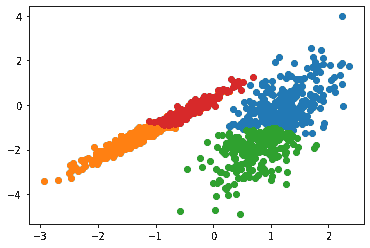

*Clusters obtained by Hierarchical Cluster Algorithm*

分层聚类通常以描述性建模的形式使用，而不是预测性的。它不能很好地处理大型数据集，只能在某些情况下提供最佳结果。有时也很难从树状图上检测出正确的簇数。

### 基于质心的聚类算法/分区聚类算法

在质心/分区聚类中，**个聚类由一个中心向量**表示，该向量不一定是数据集的成员。即使在这种特定的聚类类型中，也需要选择 K 的值。这是一个优化问题:找到质心的数量或 K 的值，并将对象分配到附近的聚类中心。这些步骤需要以这样一种方式执行，使得离聚类的平方距离最大化。

使用最广泛的一种基于质心的聚类算法是 K-Means，它的一个缺点是你需要预先选择一个 K 值。

#### k-均值聚类算法

K-Means 算法使用特定的距离度量将给定的数据集分成预定义的(K)个聚类。每个簇/组的中心被称为**质心**。

K-Means 算法是如何工作的？

让我们看看 K-Means 算法是如何工作的:

*   最初，选择 K 个质心。选择正确的 k 值有不同的方法。
*   无序播放数据并初始化质心-随机选择 K 个数据点作为质心，无需替换。
*   通过计算分配给每个先前质心的所有样本的平均值来创建新质心。
*   随机初始化质心，直到质心没有变化，这样数据点对聚类的分配就不会改变。
*   K-Means 聚类使用[欧几里德距离](https://web.archive.org/web/20221206013350/https://en.wikipedia.org/wiki/Euclidean_distance#:~:text=In%20mathematics%2C%20the%20Euclidean%20distance,being%20called%20the%20Pythagorean%20distance.)来找出点之间的距离。

*注意:K-Means 聚类的一个例子将在下面的用例部分用客户细分的例子来解释。*

**选择 K 的正确值有两种方法:肘法和剪影法。**

**手肘法**

Elbow 方法选取值的范围，并从中选取最佳值。它计算不同 k 值的组内平方和(WCSS)。它计算平方点的和，并计算平均距离。

在上面的公式中，Yi 是对进行观测的质心。K 的值需要选择在 WCSS 开始减弱的地方。在 WCSS 对 K 的曲线图中，这显示为一个**肘**。

**剪影法**

使用平均聚类内距离(m)和每个样本的最近聚类距离(n)的平均值来计算轮廓得分/系数(SC)。

在上面的公式中，n 是数据点和该数据点不属于的最近聚类之间的距离。我们可以计算所有样本的平均 SC，并以此作为度量来决定聚类数。

SC 值的范围在-1 到 1 之间。1 表示聚类被很好地分开并且是可区分的。如果值为-1，则错误地分配了聚类。

以下是 K-Means 姿势相对于其他算法的一些优势:

*   实现起来很简单。
*   它可扩展到大规模数据集，对于大规模数据集也更快。
*   它非常频繁地适应新的例子。

**K-Medians** 是相对于 K-Means 算法的另一种聚类算法，除了使用中值重新计算聚类中心。在 K-Median 算法中，对异常值的敏感度较低，因为需要排序来计算大型数据集的中值向量。

K-Means 有一些缺点；该算法可以在不同的运行中提供不同的聚类结果，因为 K-Means 从聚类中心的随机初始化开始。获得的结果可能不会重复。

K-Means 算法带来的其他缺点是:

*   如果**聚类具有类似球形的形状**，K-Means 聚类**擅长捕捉数据的结构**。它总是试图围绕质心构建一个漂亮的球形。这意味着当聚类具有不同的几何形状时，K-Means 在聚类数据方面表现不佳。
*   即使数据点属于同一个聚类，K-Means 也不允许数据点彼此远离，它们共享同一个聚类。
*   K-Means 算法对异常值很敏感。
*   随着维度数量的增加，可伸缩性会降低。

使用 K-Means 进行聚类时，需要记住以下几点:

*   [在应用 K-Means 算法时将数据](https://web.archive.org/web/20221206013350/https://scikit-learn.org/stable/modules/preprocessing.html)标准化，因为这将帮助您获得高质量的聚类，并提高聚类算法的性能。由于 K-Means 使用基于距离的度量来查找数据点之间的相似性，因此最好将数据标准化为标准偏差为 1，平均值为零。通常，任何数据集中的要素都有不同的测量单位，例如，收入与年龄。
*   K-Means 赋予更大的聚类更多的权重。
*   用于选择聚类数量的肘方法不能很好地工作，因为对于所有的 k，误差函数减小。
*   如果聚类之间有重叠，K-Means 就没有内在的不确定性度量来确定属于重叠区域的样本分配给哪个聚类。
*   k-表示即使数据不能被聚类，也要对其进行聚类，例如来自均匀分布的数据。

#### 小批量 K 均值聚类算法

K-Means 是流行的聚类算法之一，主要是因为它具有良好的时间性能。当数据集的大小增加时，K-Means 会导致内存问题，因为它需要整个数据集。为此，为了降低算法的时间和空间复杂度，提出了一种叫做**小批量 K-Means** 的方法。

小批量 K-Means 算法试图以这样一种方式将数据放入主存储器中，即该算法使用随机选择的固定大小的小批量数据。关于小批量 K 均值算法，有几点需要注意:

*   通过从数据集中获得新的任意样本，在每次迭代中更新聚类(取决于聚类质心的先前位置)，并且重复这些步骤直到收敛。
*   一些研究表明，这种方法节省了大量的计算时间，但代价是聚类质量略有下降。但是还没有进行深入的研究来量化影响聚类质量的聚类数量或它们的大小。

*   聚类的位置根据每批中的新点进行更新。
*   所做的更新是梯度下降更新，这明显比正常的批量 K-均值更快。

### 基于密度的聚类算法

基于密度的聚类将高示例密度的区域连接成聚类。这允许任意的形状分布，只要密集区域是相连的。对于高维数据和不同密度的数据，这些算法遇到了问题。按照设计，这些算法不会将离群值分配给聚类。

#### 基于密度的噪声应用空间聚类

最流行的基于密度的方法是对有噪声的应用进行基于密度的空间聚类( [DBSCAN](https://web.archive.org/web/20221206013350/https://en.wikipedia.org/wiki/DBSCAN) )。它具有一个定义良好的集群模型，称为“**密度可达性**”。

这种类型的聚类技术连接满足特定密度标准(半径内最小数量的对象)的数据点。DBSCAN 聚类完成后，有三种类型的点:**核心、边界、噪声。**

如果你看上面的图，**核心**是一个点，它有一些(m)点在离它自己特定的(n)距离内。**边界**是在距离 n 处至少有一个核心点的点

**噪点**既不是边界也不是核心的点。需要分离聚类的稀疏区域中的数据点被认为是噪声和更宽的点。

DBSCAN 使用两个参数来确定如何定义集群:

*   **minPts** :一个区域被认为是密集的，所需的最小点数是` ***minPts*** `。
*   **eps** :为了定位任意点附近的数据点，使用` **eps (ε) 【T3 `作为距离度量。**

下面是对 DBSCAN 算法的逐步解释:

*   DBSCAN 从一个随机数据点(未访问的点)开始。
*   使用距离ε提取该点的邻域。
*   如果在该区域内有足够的数据点，并且当前数据点成为最新聚类中的第一个点，则聚类过程开始，否则该点被标记为噪声并被访问。
*   其**εε**距离邻域内的点也成为新群集中第一个点的同一群的一部分。对于添加到上述聚类中的所有新数据点，重复使所有数据点属于同一聚类的过程。
*   重复上述两个步骤，直到确定了群集中的所有点。聚类的 **ε邻域**内的所有点都被**访问过**并且**被标记为**。一旦我们完成了当前的聚类，就会检索和处理一个新的未访问点，从而进一步发现聚类或噪声。重复该过程，直到所有数据点都被标记为已访问。

DBSCAN 的一个令人兴奋的特性是它的低复杂度。它需要对数据库进行线性数量的范围查询。

DBSCAN 的主要问题是:

*   它希望通过某种密度下降来检测星团的边界。DBSCAN 连接高示例密度的区域。在处理形状奇怪的数据时，该算法优于 K-Means。

DBSCAN 算法的一个优点是:

*   它不需要预定义的集群数量。它还识别噪声和异常值。此外，该算法可以很好地找到任意大小和形状的聚类。

```py
from numpy import where
from numpy import unique
from sklearn.datasets import make_classification
from sklearn.cluster import DBSCAN
import matplotlib.pyplot as plot

train_data, _ = make_classification(n_samples=1000,
                                       n_features=2,
                                       n_informative=2,
                                       n_redundant=0,
                                       n_clusters_per_class=1,
                                       random_state=4)

dbscan_model = DBSCAN(eps=0.25, min_samples=9)

dbscan_model.fit(train_data)

dbscan_res = dbscan_model.fit_predict(train_data)

dbscan_clstrs = unique(dbscan_res)

for dbscan_clstr in dbscan_clstrs:

    index = where(dbscan_res == dbscan_clstr)

    plot.scatter(train_data[index, 0], train_data[index, 1])

plot.show()
```

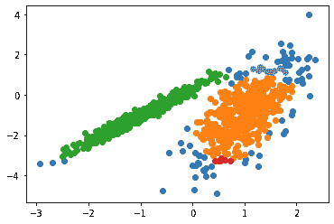

*Clusters obtained by DBSCAN Cluster Algorithm*

### 基于分布的聚类算法

与统计学密切相关的聚类模型是基于分布模型的。集群**可以被定义为属于相同分布**的对象。这种方法非常类似于通过从分布中随机抽取对象来生成人工数据集。

虽然这些方法的理论方面相当不错，但这些模型都存在[过度拟合](/web/20221206013350/https://neptune.ai/blog/overfitting-vs-underfitting-in-machine-learning)的问题。

#### 高斯混合模型

高斯混合模型( **GMM** )是一种基于分布的聚类类型。这些聚类方法假设数据由分布组成，例如高斯分布。在下图中，基于分布的算法将数据聚类成三个[高斯分布](https://web.archive.org/web/20221206013350/https://en.wikipedia.org/wiki/Normal_distribution)。随着与分布的距离增加，该点属于该分布的概率降低。

GMM 可以像 K-Means 一样用来寻找聚类。一个点属于分布中心的概率随着离分布中心的距离增加而减小。下图中的条带显示概率降低。由于 GMM 包含了一个概率模型，我们也可以找到概率集群分配。当您不知道数据的分布类型时，您应该使用不同的算法。

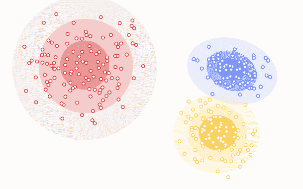

*Example of distribution-based clustering | [Source](https://web.archive.org/web/20221206013350/https://developers.google.com/machine-learning/clustering/clustering-algorithms)*

让我们看看 GMM 是如何计算概率并将其分配给数据点的:

*   一个 GM 是由几个 Gaussianss 组成的函数，每个 Gaussian 由 k ∈ {1，…，K}标识，其中 K 是聚类的个数。混合物中的每个高斯 K 由以下参数组成:
    *   定义其中心的平均值μ。
    *   定义其宽度的协方差σ。
    *   定义高斯函数大小的混合概率。

这些参数可以在下图中看到:

为了找到协方差、均值、方差和聚类权重，GMM 使用了期望最大化技术。

假设我们需要分配 K 个聚类，即 K 个高斯分布，平均值和协方差值分别为μ1，μ2，..μk 和σ1，σ2，..σk，还有一个参数πI，代表分布密度。

为了定义高斯分布，我们需要找到这些参数的值。我们已经决定了聚类的数量，并指定了平均值、协方差和密度的值。接下来是期望步骤和最大化步骤，你可以在这个[帖子](https://web.archive.org/web/20221206013350/https://www.linkedin.com/pulse/gaussian-mixture-models-clustering-machine-learning-cheruku/)中查看。

**GMM 的优势**

*   GMM 相对于 K-Means 的一个优点是，K-Means 不考虑[方差](https://web.archive.org/web/20221206013350/https://en.wikipedia.org/wiki/Variance)(这里，方差是指钟形曲线的宽度)，GMM 返回数据点属于 K 个聚类中每个聚类的概率。
*   在重叠聚类的情况下，所有上述聚类算法都不能将其识别为一个聚类。
*   GMM 使用概率方法，并为属于聚类的每个数据点提供概率。

**GMM 的劣势**

*   如果分布的数量很大或者数据集包含较少的观察数据点，混合模型在计算上是昂贵的。
*   它需要大型数据集，并且很难估计聚类的数量。

现在让我们看看 GMM 是如何对数据进行聚类的。下面的代码帮助您:

*   创建数据，
*   将数据拟合到“高斯混合”模型，
*   找到分配给聚类的数据点，
*   获取唯一的集群，以及
*   如下图所示绘制聚类图。

```py
from numpy import where
from numpy import unique
from sklearn.datasets import make_classification
from sklearn.mixture import GaussianMixture
import matplotlib.pyplot as plot

train_data, _ = make_classification(n_samples=1200,
                                       n_features=3,
                                       n_informative=2,
                                       n_redundant=0,
                                       n_clusters_per_class=1,
                                       random_state=4)

gaussian_mdl = GaussianMixture(n_components=3)

gaussian_mdl.fit(train_data)

gaussian_res = gaussian_mdl.fit_predict(train_data)

gaussian_clstr = unique(dbscan_res)

for gaussian_cluser in gaussian_clstr:

    index = where(gaussian_res == gaussian_cluser)

    plot.scatter(train_data[index, 0], train_data[index, 1])

plot.show()
```

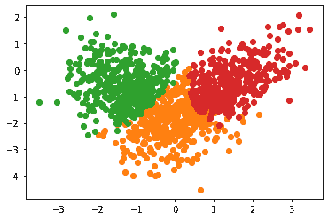

*Clusters obtained by Gaussian Mixture Model Algorithm*

## 聚类在不同领域的应用

可以应用集群的一些领域有:

*   **营销**:客户细分发现。
*   **图书馆**:根据主题和信息对不同的书籍进行聚类。
*   **生物学**:不同种类的植物和动物之间的分类。
*   **城市规划**:根据区位分析房屋价值。
*   **文档分析**:各种研究数据和文档可以按照一定的相似性进行分组。标注大数据真的很难。在这些情况下，聚类有助于对文本进行聚类&并将其分成不同的类别。像 LDA 这样的无监督技术在这些情况下也有利于在大型语料库中发现隐藏的主题。

## 无监督建模方法的问题

以下是您在应用聚类技术时可能会遇到的一些问题:

*   结果可能不太准确，因为数据没有提前标注，输入数据也未知。
*   该算法的学习阶段可能需要很长时间，因为它会计算和分析所有可能性。
*   在没有任何先验知识的情况下，模型从原始数据中学习。
*   随着功能数量的增加，复杂性也会增加。
*   一些涉及实时数据的项目可能需要持续向模型提供数据，从而导致耗时且不准确的结果。

## 选择聚类算法时要考虑的因素

现在让我们来看看选择聚类算法时要考虑的一些因素:

*   选择聚类分析算法，使其能够很好地适应数据集。并非所有的聚类算法都可以有效地扩展。机器学习中的数据集可以有数百万个例子。
*   许多聚类算法通过计算所有样本对之间的相似性来工作。运行时间随着样本数 **n** 的增加而增加，在复杂度符号中表示为 **O(n^2)** 。 **O(n^2)** 当例子数以百万计时不实用。这里重点关注的是 K-Means 算法，其复杂度为 O(n)，这意味着该算法与 n 成线性比例关系。

## Python 中集群的不同实际用例

### 1.客户细分

我们将使用客户[数据](https://web.archive.org/web/20221206013350/https://github.com/AravindR7/Clustering-Algorithms/blob/main/Customers.csv)来看看这个算法是如何工作的。此示例旨在将客户分成几个组，并决定如何将客户分组，以增加客户价值和公司收入。这个用例通常被称为[客户细分](https://web.archive.org/web/20221206013350/https://searchcustomerexperience.techtarget.com/definition/customer-segmentation)。

数据中的一些特征是客户 ID、性别、年龄、收入(以千美元为单位)以及基于消费行为和性质的客户消费分数。

安装依赖项:

```py
!pip install numpy pandas plotly seaborn scikit-learn
```

```py
import numpy as np
import pandas as pd
import matplotlib.pyplot as plot
import seaborn as sns
import plotly.express as pxp
import plotly.graph_objs as gph
from sklearn import metrics
from sklearn.metrics import silhouette_score
from sklearn.cluster import KMeans

data = pd.read_csv('Customers.csv')
data.head()
```

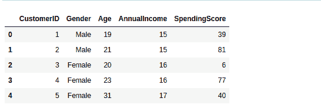

让我们从删除聚类过程中不需要的列开始。

```py
data.drop('CustomerID', axis=1, inplace=True)
```

我们可以检查数据中列的分布，以了解数据在各个列中的分布情况。

```py
plot.figure(figsize = (22, 10))
plotnum = 1

for cols in ['Age', 'AnnualIncome', 'SpendingScore']:
    if plotnum <= 3:
        axs = plot.subplot(1, 3, plotnum)
        sns.distplot(data[cols])

    plotnum += 1

plot.tight_layout()
plot.show()
```

现在，让我们创建一个条形图来检查特定年龄组的客户分布。您还可以应用同样的方法来可视化客户数量与支出分数的关系，以及基于年收入的客户数量。

```py
age_55above = data.Age[data.Age >= 55]
age_46_55 = data.Age[(data.Age >= 46) & (data.Age <= 55)]
age_36_45 = data.Age[(data.Age >= 36) & (data.Age <= 45)]
age_26_35 = data.Age[(data.Age >= 26) & (data.Age <= 35)]
age_18_25 = data.Age[(data.Age >= 18) & (data.Age <= 25)]
```

```py
x_age_ax = ['18-25', '26-35', '36-45', '46-55', '55+']
y_age_ax = [len(age_18_25.values), len(age_26_35.values), len(age_36_45.values), len(age_46_55.values),
     len(age_55above.values)]

pxp.bar(data_frame = data, x = x_age_ax, y = y_age_ax, color = x_age_ax,
       title = 'Count of customers per age group')
```


*Result: Bar plot showing the distribution of customers in a particular age group*

聚类最关键的一个方面是选择正确的 K 值。随机选择 K 可能不是一个好的选择。我们将使用肘法和轮廓评分来选择 k 值。

在我们的例子中，从下面的图表来看，通过肘方法找到的 K 的最佳值是 4。我们希望最大化聚类的数量，并限制每个数据点成为其聚类质心的情况。

```py
x_input = data.loc[:, ['Age', 'SpendingScore']].values
wcss = []
for k in range(1, 12):
    k_means = KMeans(n_clusters=k, init='k-means++')
    k_means.fit(x_input)
    wcss.append(k_means.inertia_)

plot.figure(figsize=(15,8))

plot.plot(range(1, 12), wcss, linewidth=2, marker='8')
plot.title('Elbow methodn', fontsize=18)
plot.xlabel('K')
plot.ylabel('WCSS')
plot.show()
```

让我们检查一下这个特殊实现的轮廓系数是怎样的。

```py
from sklearn.metrics import silhouette_score
label = k_means.predict(x_input)

print(f' Silhouette Score(n=4): {silhouette_score(x_input,
label)}')
```

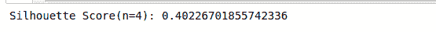

从下面的年龄与花费的对比图中，你可以看到一些集群没有很好的分离。簇之间的簇内距离几乎不显著，这就是为什么 n=4 的 SC 是 0.40，这是更小的。尝试不同的 K 值以找到最佳的聚类数。

```py
k_means=KMeans(n_clusters=4)
labels=k_means.fit_predict(x_input)
print(k_means.cluster_centers_)
```


现在，让我们绘制一个图表来检查这些聚类是如何从数据中形成的。

```py
plot.figure(figsize = (16, 10))
plot.scatter(x_input[:, 0], x_input[:, 1], c =
k_means.labels_, s = 105)
plot.scatter(k_means.cluster_centers_[:, 0],k_means.cluster_centers_[:, 1], color = 'red', s = 250)
plot.title('Customers clustersn', fontsize = 20)
plot.xlabel('Age')
plot.ylabel('Spending Score')
plot.show()
```

红点表示星团中心。

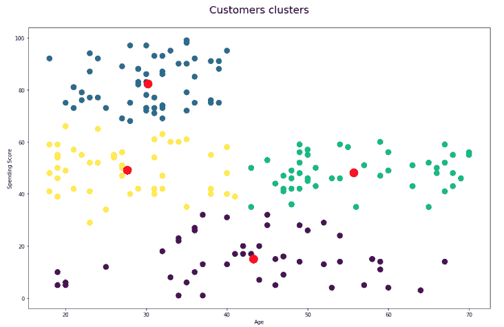

*Clusters formed from Age versus SpendingScore using K-Means*

这些数据形成了四个不同的集群。蓝色聚类代表消费得分较高的年轻客户，紫色聚类代表消费得分较低的老年客户。

可以遵循上面实施的类似步骤来聚类“年龄”对“年度收入”以及“支出分数”对“年度收入”。所有这三个都可以结合起来，用一个可以在 [Jupyter 笔记本](https://web.archive.org/web/20221206013350/https://github.com/AravindR7/Clustering-Algorithms/blob/main/customer_segmentation.ipynb)中找到的 3D 绘图来绘制。它还对相同的数据实现了不同的聚类算法。

### 2.图像压缩

图像压缩是一种在不降低图片质量的情况下应用于图像的压缩技术。图像尺寸的减小有助于将它们存储在有限的驱动器空间中。

为什么需要图像压缩技术？图像压缩有多种需求。压缩在医疗保健中至关重要，因为医疗图像需要存档，而且数据量非常大。

当我们需要提取和存储图像中最有用的部分(表示为嵌入)时，图像压缩可能是存储更多数据的非常有益的方法。

有两种图像压缩技术:

1.  **无损压缩**:这种方法用于减小文件的大小，同时保持与压缩前相同的质量。文件可以恢复到原始形式，因为这种技术不会损害数据质量。
2.  **有损压缩**:有损压缩是一种消除不明显数据的方法。它给照片一个更小的尺寸；有损压缩会丢弃图片中一些不太重要的部分。在这种类型的压缩技术中，被压缩的图像不能被恢复到它的原始图像，并且数据的大小改变。

让我们使用 K-Means 聚类来解决这个问题。

您可能已经知道，一幅图像由 3 个通道组成，**、RGB** ，每个通道的值都在**【0，255】**范围内。因此，一个特定的图像可能有 255*255*255 种不同的颜色。所以在我们输入图像之前，我们需要对它进行预处理。

我们将要处理的图像的大小是(1365，2048，3)。因此，对于每个像素位置，我们将有两个 8 位整数来指定红色、绿色和蓝色强度值。我们的目标是将它减少到 25 种颜色，并且只用这些颜色来表现照片。

下面导入了此任务所需的一些包:

```py
import matplotlib.pyplot as plt
from matplotlib.image import imread
import pandas as pd
import numpy as np
import seaborn as sns
from sklearn.cluster import KMeans
```

从[这里](https://web.archive.org/web/20221206013350/https://github.com/AravindR7/Clustering-Algorithms/blob/main/palace.jpg)下载图片并读入。

```py
img = imread('palace.jpg')
img_size = img.shape
```

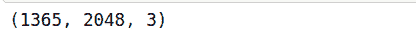

重塑 2D 的形象。我们将 K-Means 算法应用于图片，并将每个像素视为一个数据点来选择使用什么颜色。这意味着将图像从高 X 宽 X 通道重塑为(高 X 宽)X 通道；我们将有 1365 x 2048 = 2795520 个数据点。

遵循这种方法将有助于我们使用 25 个质心来表示图像，并减少图像的大小。当我们使用质心作为像素颜色的查找时，会有一个相当大的不同，这将把每个像素位置的大小减少到 4 位，而不是 8 位。

```py
X = img.reshape(img_size[0] * img_size[1], img_size[2])
```

**运行 K 均值算法**

上一节给出了 K-means 算法的详细说明。在本例中，我们将重点关注压缩部分。

```py
km = KMeans(n_clusters=25)
km.fit(X)
```

使用质心来压缩图像。

```py
X_cmpresd = km.cluster_centers_[km.labels_]
X_cmpresd = np.clip(X_cmpresd.astype('uint8'), 0, 255)
```

将 X_cmpresd 整形为与原始图像 128 * 128 * 3 相同的尺寸

```py
X_cmpresd = X_cmpresd.reshape(img_size[0], img_size[1], img_size[2])
```

现在，将原始图像和压缩图像相邻绘制。

```py
figre, axs = plt.subplots(1, 2, figsize = (14, 10))
axs[1].imshow(img)
axs[1].set_title('Initial image')
axs[0].imshow(X_cmpresd)
axs[0].set_title('Compressed one (25 colors)')
for axs in figre.axes:
    axs.axis('off')
plot.tight_layout();
```

这里，我使用了 25 个质心。压缩图像看起来更接近原始图像(意味着真实图像的许多特征被保留)。使用更少的聚类数，我们会以牺牲图像质量为代价获得更高的压缩率。相似的颜色被分组到 k 个簇中(k = 25(不同的 RGB 值))。

### 3.数字分类

在这个实现中，我们将使用小批量 K-Means 来执行图像分类。聚类也可以用于图像分析。利用 Scikit-learn 和 [MNIST](https://web.archive.org/web/20221206013350/http://yann.lecun.com/exdb/mnist/) 数据集，我们将研究小批量 K 均值聚类在计算机视觉中的应用。

安装依赖项:

```py
pip install keras tensorflow
```

导入库:

```py
import sys
import sklearn
import matplotlib
import numpy as np
import matplotlib.pyplot as plt
%matplotlib inline
```

加载 MNIST 数据集。可以通过 [Keras](https://web.archive.org/web/20221206013350/https://keras.io/) 买到。

```py
figur, axi = plt.subplots(3, 3, figsize=(14, 14))
plt.gray()

for j, axs in enumerate(axi.flat):
    axs.matshow(x_train[j])
    axs.axis('off')
    axs.set_title('number {}'.format(y_train[j]))

figur.show()
```

**图像预处理**

存储为 Numpy 数组的图像是二维数组。Scikit-learn 提供的小批量 K 均值聚类算法吸收了 1D 数组。因此，我们需要重塑形象。MNIST 包含 28 x 28 像素的图像；因此，一旦我们将它们成形为 1D 阵列，它们的长度将为 784。

```py
X = x_train.reshape(len(x_train), -1)
Y = y_train

X = X.astype(float) / 255.
print(X.shape)
print(X[0].shape)
```

**聚类**

由于数据集的大小，我们使用 K-Means 的小批量实现。该算法需要更少的时间来拟合数据。MNIST 数据集包含整数 0-9 的图像。因此，让我们通过将聚类数设置为 10 来开始聚类。

```py
from sklearn.cluster import MiniBatchKMeans
n_digits = len(np.unique(y_test))
print(n_digits)

kmeans = MiniBatchKMeans(n_clusters=n_digits)

kmeans.fit(X)
kmeans.labels_
```

**分配聚类标签**

Mini-Batch K-means 是一种无监督的 ML 方法，这意味着由算法分配的标签指的是每个阵列被分配到的聚类，而不是实际的目标整数。为了解决这个问题，让我们定义一些函数来预测哪个整数对应于每个聚类。

```py
def cluster_labels_infer(kmeans, actual_lbls):
    """
    returns: dictionary(clusters assigned to labels)
    """
    infrd_labels = {}
    for n in range(kmeans.n_clusters):
        labels = []
        index = np.where(kmeans.labels_ == n)
        labels.append(actual_lbls[index])

        if len(labels[0]) == 1:
            counts = np.bincount(labels[0])
        else:
            counts = np.bincount(np.squeeze(labels))

        if np.argmax(counts) in infrd_labels:

            infrd_labels[np.argmax(counts)].append(n)
        else:

            infrd_labels[np.argmax(counts)] = [n]

    return infrd_labels
```

```py
def data_labels_infer(X_labels, clstr_labels):
    """
    Depending on the cluster assignment find the label
    predicted labels are returned for each array
    """
    pred_labels = np.zeros(len(X_labels)).astype(np.uint8)

    for l, clstr in enumerate(X_labels):
        for key, val in clstr_labels.items():
            if clstr in val:
                pred_labels[i] = key

    return pred_labels
```

让我们测试上面写的函数来预测哪个整数对应于每个集群。

```py
clstr_labels = cluster_labels_infer(kmeans, Y)
input_clusters = kmeans.predict(X)
pred_labels = data_labels_infer(input_clusters, clstr_labels)

print(pred_labels[:20])
print(Y[:20])
```

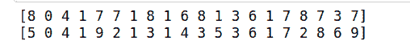

**评估和优化聚类算法**

利用上面返回的函数，我们可以确定算法的准确性。由于我们使用聚类算法进行分类，准确性成为一个重要的衡量标准。一些度量可以直接应用于集群，而不考虑相关联的标签。使用的指标有:

之前，我们在选择 K 的特定值时做了假设，但情况可能并不总是如此。让我们将小批量 K-Means 算法适用于不同的 K 值，并使用我们的指标评估性能。计算模型指标的函数定义如下。

```py
from sklearn import metrics

def calculate_metrics(estimator, data, labels):

    print('Number of Clusters: {}'.format(estimator.n_clusters))
    print('Inertia: {}'.format(estimator.inertia_))
    print('Homogeneity: {}'.format(metrics.homogeneity_score(labels, estimator.labels_)))
```

现在我们已经定义了指标，让我们为不同数量的集群运行模型。

```py
clusters = [10, 16, 36, 64, 144, 256]

for n_clusters in clusters:
    estimator = MiniBatchKMeans(n_clusters = n_clusters)
    estimator.fit(X)

    calculate_metrics(estimator, X, Y)

    cluster_labels = cluster_labels_infer(estimator, Y)
    predicted_Y = data_labels_infer(estimator.labels_, cluster_labels)

    print('Accuracy: {}n'.format(metrics.accuracy_score(Y, predicted_Y)))
```

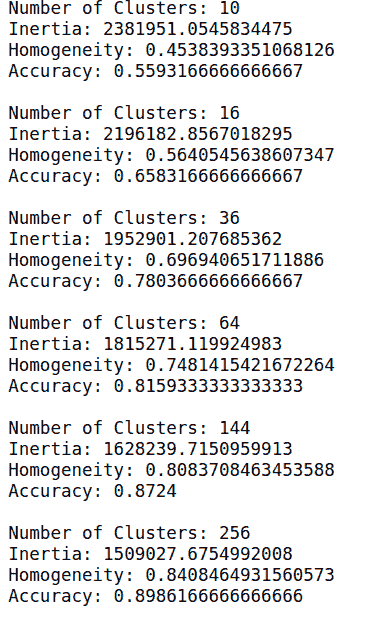

让我们使用 256 作为分类数在测试集中运行模型，因为它对于这个特定的数字有更高的准确性。

```py

X_test = x_test.reshape(len(x_test),-1)

X_test = X_test.astype(float) / 255.

kmeans = MiniBatchKMeans(n_clusters = 256)
kmeans.fit(X)
cluster_labels = cluster_labels_infer(kmeans, Y)

test_clusters = kmeans.predict(X_test)
predicted_labels = data_labels_infer(kmeans.predict(X_test),
cluster_labels)

print('Accuracy: {}n'.format(metrics.accuracy_score(y_test,
predicted_labels)))
```


**可视化集群质心**

质心是每个聚类中有代表性的点。如果我们处理 A，B 点，质心就是图上的一个点。因为我们使用长度为 784 的数组，所以我们的质心也是长度为 784 的数组。我们可以将这个数组重新整形为 28×28 像素的图像，并绘制出来。

```py
kmeans = MiniBatchKMeans(n_clusters = 36)
kmeans.fit(X)

centroids = kmeans.cluster_centers_

images = centroids.reshape(36, 28, 28)
images *= 255
images = images.astype(np.uint8)

cluster_labels = cluster_labels_infer(kmeans, Y)

fig, axs = plt.subplots(6, 6, figsize = (20, 20))
plt.gray()

for i, ax in enumerate(axs.flat):

    for key, value in cluster_labels.items():
        if i in value:
            ax.set_title('Inferred Label: {}'.format(key))

    ax.matshow(images[i])
    ax.axis('off')

fig.show()
```

这些图形显示了该群集最具代表性的图像。

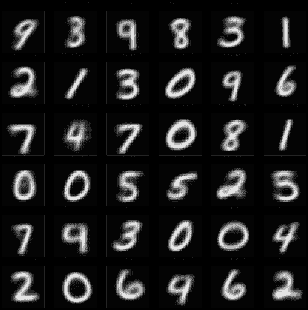

*Result: Most representative image for each cluster*

随着聚类数量和数据点数量的增加，计算时间的相对节省也会增加。只有当集群数量巨大时，节省的时间才会更加明显。只有当聚类数较大时，批量大小对计算时间的影响才更明显。

聚类数的增加降低了小批量 K-均值解与 K-均值解的相似性。随着集群数量的增加，分区之间的一致性会降低。这意味着最终的分区不同，但质量更接近。

## 聚类度量

有一些评估标准可以用来检查通过您的聚类算法获得的聚类有多好。

### 同质性得分

[同质性度量](https://web.archive.org/web/20221206013350/https://scikit-learn.org/stable/modules/generated/sklearn.metrics.homogeneity_score.html#sklearn.metrics.homogeneity_score):如果所有聚类只包含属于单一类别的数据点，则聚类结果满足同质性。该指标独立于标签的绝对值。它被定义为:

同质性得分介于 0 和 1 之间。低值表示同质性低，1 代表完全同质的标签。

当 Ypred 的知识减少了 Ytrue 的不确定性时，变小(h → 1)，反之亦然。

完美的标记是同质的。进一步将类分成更多聚类的非完美标记可以是同质的。来自一个聚类中不同类别的样本不满足同质标记。

### 完整性分数

仅当给定类的数据点是同一聚类的一部分时，聚类结果才满足完整性。

这个度量是不对称的，所以从上面的等式中切换 label_true 和 label_pred 将返回不同的同质性得分。这同样适用于同质性得分；切换 label_true 和 label_pred 将返回完整性分数。

完美的标签是完整的。将所有类成员分配到相同聚类的非完美标记仍然是完整的。如果班级成员分散在不同的集群中，分配就无法完成。

### 衡量分数

V-measure 聚类标记给出了一个基本事实。V 测度是同质性和完备性之间的调和平均值。

这个度量是对称的。将' label_true '与' label_pred '切换将返回相同的值。当真实情况未知时，该度量有助于计算对同一数据集的两种独立标注分配技术的接受度。

分数范围在 0-1 之间。1 代表完全完整的标签。

示例:

```py
from sklearn import metrics
true_labels = [2, 2, 3, 1, 1, 1]
pred_labels = [1, 1, 2, 3, 3, 3]
metrics.homogeneity_score(true_labels, pred_labels)
Output: 1.0

metrics.completeness_score(true_labels, pred_labels)
Output: 1.0

(1 stands for perfectly complete labeling)
metrics.v_measure_score(true_labels, pred_labels)
Output: 1.0
-------------------------------------------------------------------
true_labels = [2, 2, 3, 6, 1, 1]
pred_labels = [1, 1, 2, 3, 2, 1]
metrics.homogeneity_score(true_labels, pred_labels)
Output: 0.58688267143572
metrics.completeness_score(true_labels, pred_labels)
Output: 0.7715561736794712
metrics.v_measure_score(true_labels, pred_labels)
Output: 0.6666666666666667

```

### 调整后的 rand 分数

可以使用 Rand 指数(RI)计算两个聚类之间的相似性，方法是对所有样本对进行计数，并对真实聚类和预测聚类中分配到不同或相同聚类中的样本对进行计数。然后使用以下方案将 RI 分数“根据机会调整”为 ARI 分数。

ARI 是一种对称度量:

请参考[链接](https://web.archive.org/web/20221206013350/https://scikit-learn.org/stable/modules/clustering.html#adjusted-rand-score)获取详细的用户指南

### 调整后的相互信息分数

调整后的互信息(AMI)分数是对互信息分数的调整，以考虑机会。这说明了这样一个事实，即无论是否有更多的信息共享，具有许多聚类的 2 个聚类的互信息得分通常更高。

对于两个集群 U 和 V，AMI 为:

有关用户指南，请参考[链接](https://web.archive.org/web/20221206013350/https://scikit-learn.org/stable/modules/clustering.html#mutual-info-score)。 [GitHub](https://web.archive.org/web/20221206013350/https://github.com/AravindR7/Clustering-Algorithms) repo 有这篇文章的数据和所有笔记本。

## 摘要

这篇博客涵盖了聚类、图像压缩、数字分类、客户细分、不同聚类算法的实现和评估指标等最关键的方面。希望你们在这里学到了新东西。

感谢阅读。继续学习！

### 参考

1.  [https://scikit-learn.org/stable/modules/clustering.html](https://web.archive.org/web/20221206013350/https://scikit-learn.org/stable/modules/clustering.html)
2.  [https://towards data science . com/the-5-clustering-algorithms-data-scientists-need-to-know-a36d 136 ef 68](https://web.archive.org/web/20221206013350/https://towardsdatascience.com/the-5-clustering-algorithms-data-scientists-need-to-know-a36d136ef68)
3.  [https://medium . datadriveninvestor . com/k-means-clustering-for-imagery-analysis-56c 9976 F16 b 6](https://web.archive.org/web/20221206013350/https://medium.datadriveninvestor.com/k-means-clustering-for-imagery-analysis-56c9976f16b6)
4.  [https://imaddabbura.github.io/post/kmeans-clustering/](https://web.archive.org/web/20221206013350/https://imaddabbura.github.io/post/kmeans-clustering/)
5.  [https://www . geeks forgeeks . org/ml-mini-batch-k-means-clustering-algorithm/](https://web.archive.org/web/20221206013350/https://www.geeksforgeeks.org/ml-mini-batch-k-means-clustering-algorithm/)
6.  [https://sci kit-learn . org/stable/modules/generated/sk learn . metrics . v _ measure _ score . html # sk learn . metrics . v _ measure _ score](https://web.archive.org/web/20221206013350/https://scikit-learn.org/stable/modules/generated/sklearn.metrics.v_measure_score.html#sklearn.metrics.v_measure_score)
7.  [https://www . ka ggle . com/niteshyadav 3103/customer-segmentation-using-k means-HC-DBS can](https://web.archive.org/web/20221206013350/https://www.kaggle.com/niteshyadav3103/customer-segmentation-using-kmeans-hc-dbscan)
8.  [https://www . LinkedIn . com/pulse/Gaussian-mixture-models-clustering-machine-learning-cheruku/](https://web.archive.org/web/20221206013350/https://www.linkedin.com/pulse/gaussian-mixture-models-clustering-machine-learning-cheruku/)