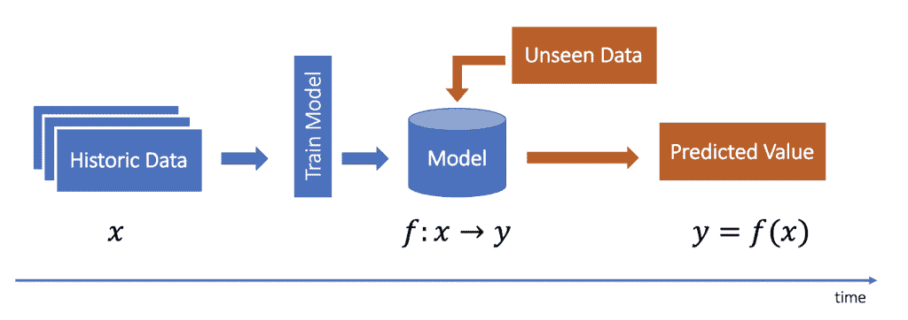
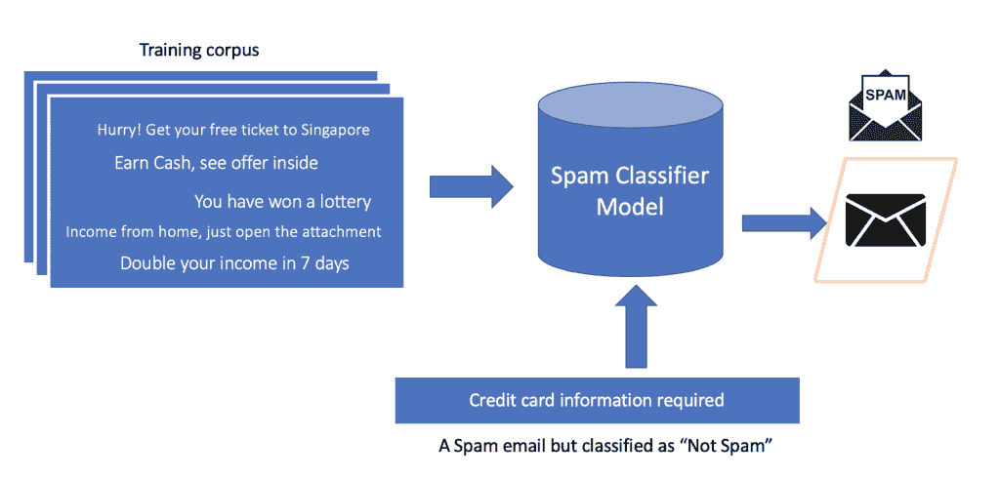
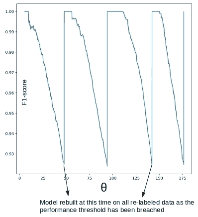
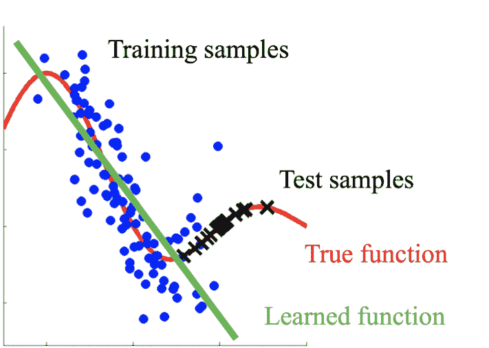
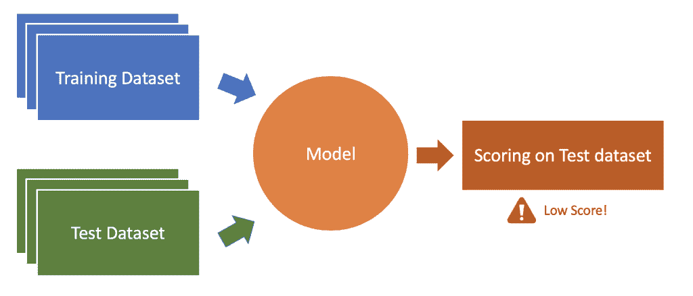
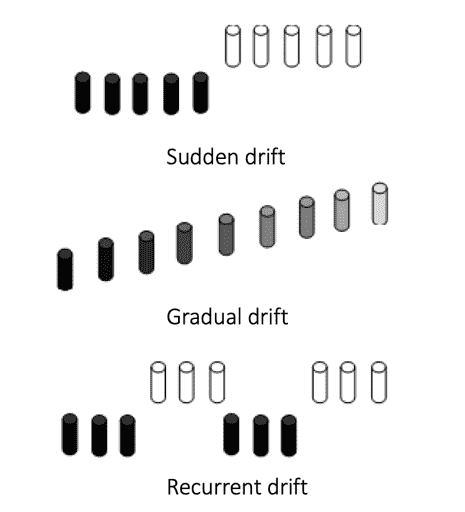
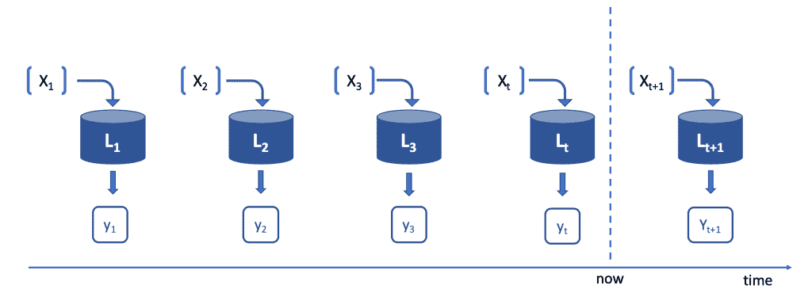

# 处理概念漂移的最佳实践

> 原文：<https://web.archive.org/web/https://neptune.ai/blog/concept-drift-best-practices>

你训练了一个机器学习模型，在几个看起来不错的指标上验证了它的性能，你将它投入生产，然后发生了一些不可预见的事情(像新冠肺炎这样的疫情到来了)，模型预测变得疯狂。想知道发生了什么？

你成了一种叫做[概念漂移现象的受害者。](https://web.archive.org/web/20221009032716/https://machinelearningmastery.com/gentle-introduction-concept-drift-machine-learning/)

但是不要难过，因为我们每个人都会遇到这种情况。

> 希腊哲学家赫拉克利特说:“变化是生活中唯一不变的东西。”

在动态的世界里，没有什么是不变的。当涉及到数据时尤其如此。从真实来源生成的数据会随着时间的推移改变其基本分布。

例如，考虑电子商务中的产品推荐系统。你认为一个在新冠肺炎之前被训练的模型，在新冠肺炎·疫情期间会同样有效吗？由于这些不可预见的情况，用户行为发生了很大的变化。大多数用户都专注于购买日常必需品，而不是昂贵的小玩意。所以，用户行为数据发生了变化。与此同时，在这种情况下，由于市场上许多产品缺货，我们看到用户的购物模式完全不同。

**通常这些数据的变化会使建立在旧数据上的模型与新数据不一致，这个问题被称为“概念漂移”。**

在本文中，我们将讨论:

* * *

### 注意:

你可能想看看我们博客上的其他文章:

在一个新的标签中打开它们，然后继续阅读关于概念漂移的内容🙂

* * *

## 漂移这个概念是什么意思？

> 由于数据流非常不可预测，因此概念漂移是流式数据的最不希望但普遍的属性。由于概念漂移，挖掘技术(如分类或聚类)的性能会随着误分类机会的增加而降低。因此，有必要识别数据中的这种漂移，以获得准确有效的结果。”
> 
> (参考:[调查大数据流中概念漂移的方法](https://web.archive.org/web/20221009032716/https://www.researchgate.net/publication/323210844_Methods_to_Investigate_Concept_Drift_in_Big_Data_Streams)

*Fig 1: Life cycle of predictive model*

在预测建模中(如上图所示)，我们基于历史数据构建一个监督模型，然后使用训练好的模型对看不见的数据进行预测。在这个过程中，模型学习目标变量和输入特征之间的关系。

*Fig 2: Trained model failed to correctly predict on out of corpus test data*

例如，垃圾邮件分类器，它根据电子邮件的正文预测电子邮件是否是垃圾邮件。机器学习模型学习目标变量(垃圾邮件或非垃圾邮件)和垃圾邮件中出现的关键字集之间的关系。这些关键词集可能不是恒定不变的，**它们的模式随着时间而变化**。因此，基于旧电子邮件集的模型不再适用于新的关键字模式。如果是这种情况，那么需要对当前数据集进行模型重新训练。

*Fig 3: Performance of model over time ([Reference](https://web.archive.org/web/20221009032716/https://github.com/ashokc/Concept-Drift-and-Model-Decay))*

此图描绘了模型随时间推移的性能，正如您看到的模型性能(通过 F1 分数衡量)随着时间的推移而恶化。这种现象被称为模型衰减。当性能降低到阈值以下时，该模型在重新标记的数据集上重新训练。这就是解决模型衰减问题的方法。如果这个问题得不到解决或监控，那么模型的性能将会不断下降，到某个时候，模型将不再适用。

一般来说，模型衰减可能由于以下类型的移动而发生。

*   **协变量移位:**自变量的移位。
*   **先验概率移位:**目标变量的移位。
*   **概念漂移:**自变量与目标变量之间关系的漂移。

### 概念漂移与协变量转移

考虑一个在退休人员观看的电影上训练的电影推荐模型，当该模型用于为儿童推荐电影时，它会给出良好的准确性吗？不会的。原因是这两个群体之间的兴趣和活动有很大的差距。所以，这个模型在这些条件下会失效。训练集和测试集中数据分布的这种**变化被称为协变量移位。**

*Fig 4: Difference in distribution between train and test dataset in case of Covariate Shift ([Reference](https://web.archive.org/web/20221009032716/http://iwann.ugr.es/2011/pdf/InvitedTalk-FHerrera-IWANN11.pdf))*

协变量偏移发生的主要原因是样本选择偏差和非平稳环境。

*   **样本选择偏差:** It 是指数据收集或标注过程中的系统性缺陷，导致训练样本从待统一建模的总体中不一致地选取。
*   **不稳定的固定环境:**当训练环境与测试环境不同时，无论是由于时间还是空间的变化，都会出现这种情况。

协变量转移和概念漂移都是降低模型性能的原因，但两者应该区别对待。因此，必须区分协变量转换和概念漂移，并根据协变量转换或概念漂移或两者的存在进行预防。

### 数据漂移与概念漂移

在大数据世界中，每时每刻都会产生数十亿的数据。当我们长时间从一个来源收集数据时，数据本身可能会发生变化，这可能是由多种原因造成的。这可能是由于数据中噪声的动态行为，也可能是由于数据收集过程中的变化。

当数据发生变化时，这个问题被称为数据漂移，而目标变量上下文中的变化被称为概念漂移。这两种漂移都会导致模型衰减，但需要分别解决。

### 概念漂移的例子

*   个性化:无论是电子商务、电影推荐还是个人助理系统，个性化是大多数以客户为中心的企业取得成功的关键。在电子商务中，个性化系统试图描述用户的购物模式，并在此基础上提供个性化的搜索结果或推荐相关产品。由于不可预见的情况，用户的购物行为可能会随着时间的推移而改变，这可能是由于生活事件如结婚、搬迁到不同的地理位置，也可能是由于像新冠肺炎这样的疫情。这个事件**彻底改变了用户的**购物**习惯**。由于这些因素，今天构建的个性化系统可能在几年后不再适用，这是由于概念漂移的问题。
*   预测:预测是我们预测未来趋势的一个研究领域。它广泛用于金融、天气和需求预测。通常，这些类型的模型是使用历史数据构建的，并且期望捕捉历史数据中存在的趋势和季节性，以便在未来遵循。但是**由于不可预见的情况，趋势可能会改变**，这可能会导致概念漂移。在天气数据中，有一种季节性变化发生得极其缓慢。在其他类型的应用程序中，这些类型的更改通常要慢得多。但是，随着时间的推移，它会使现有的模式过时。

## 如何监控概念漂移

*Fig 5: Concept drift monitoring system*

下图描述了监控概念漂移的一般方法:

*   首先，收集和整理训练数据集，
*   然后模型在那上面被训练。
*   该模型对照由人类专家管理的黄金数据集进行持续监控。
*   如果性能分数降低到阈值以下，则会触发警报来重新训练模型。

如图 2 所示，主要有 3 种概念漂移，每种现象需要不同的方法来检测(并监控变化)。

*Fig 6: Types of concept drift*

*   **突如其来的**:由于不可预见的情况，如新冠肺炎疫情事件影响了电子商务、医疗保健、金融、保险等多个行业，概念漂移突然发生。这种突然的变化可能会在短短几周内发生。这种漂移通常是由一些外部事件驱动的。如果没有主动的监控系统来检测数据漂移，那么在重大事件后对概念漂移的存在进行快速评估是很自然的。
*   **渐变:**这种漂移需要很长时间才会发生，对于许多用例来说，这是很自然的事情。例如，通货膨胀可以影响定价模型，而定价模型可能需要很长时间才能产生重大影响。渐进或有时称为增量变化，通常在时间序列模型中通过捕捉季节性变化来解决，如果不解决，这是一个值得关注的问题，需要解决。
*   **周期性:**这种漂移是周期性发生的，可能在一年的某个特定时间。例如，在黑色星期五、万圣节等活动期间，用户的购物模式与一年中的其他时间相比有所不同。因此，在该事件期间，使用了专门针对黑色星期五数据训练的不同模型。重复出现的模式很难监测，因为模式的周期性也可能是动态的。

基于存在的概念漂移的类型，有多种方法来监控概念漂移。

一些最突出的方法是:

*   长时间监控模型的性能。例如，可以监控 F1 分数作为准确性指标，如果分数长时间下降，则这可能是概念漂移的信号。
*   监控分类置信度(仅适用于分类)。预测的置信度得分反映了数据点属于预测类的概率。 ***两个窗口平均置信度得分的显著差异代表概念漂移的发生。***

## 如何防止观念漂移

现在，最大的问题是这个问题是否可以避免，有哪些方法可以防止它的发生。

一个理想的概念漂移处理系统应该能够:

*   **快速使**适应概念漂移，
*   **对噪声具有鲁棒性**并将其与概念漂移区分开来，
*   **识别并处理模型性能中的重大偏差**。

概括地说，有 5 种方法可以解决概念漂移。

*   **在线学习**当模型一次处理一个样本时，学习者动态更新。事实上，大多数现实生活中的应用程序都是在流数据上运行的，在线学习是防止概念漂移的最重要的方法。
*   **定期重新训练**可在不同情况下触发的模型，如一旦模型性能下降到指定阈值以下，或一旦两个数据窗口之间的平均置信度观察到重大漂移。
*   **定期对有代表性的子样本进行再训练。**如果检测到概念漂移的存在，使用类似**实例选择**的方法选择总体的子样本，其中样本代表总体，并遵循与原始数据分布相同的概率分布。然后，在人类专家的帮助下明确地重新标记这些数据点，并在精选的数据集上训练模型。
*   **具有模型加权的集成学习**其中多个模型被集成，并且输出通常是单个模型输出的加权平均值。
*   **特征丢弃**是处理概念漂移的另一种方式。一次使用一个特征建立多个模型，并去除 AUC-ROC 响应不达标的那些特征。

### 在线学习

在**机器学习中，模型通常在批量设置**中训练，其中学习者在一批数据上一次性优化。这导致了一个静态模型，该模型假设自变量和目标变量之间的静态关系。因此，经过很长时间后，这种模型可能需要重新训练，以从新数据中学习模式。

在现实生活中，**大部分的应用程序工作在实时流数据馈送上**，其中模型一次处理一个样本，因此可以动态更新。这个过程被称为在线学习或增量学习，这有助于模型避免概念漂移，因为新数据被用于不断更新模型假设。

这一过程使我们能够从大量数据流中学习，并可以无缝地应用于时间序列预测、电影或电子商务推荐系统、垃圾邮件过滤等应用。

*Fig 6: Types of concept drift*

在在线学习中，观察一系列实例，一次一个，这些实例在时间间隔上可能不是等间距的。因此，在每个时间戳 t，我们都标记了历史数据，(X [1] ，……X [t] )。使用这些历史数据(X [1] ，…，X [t] )或其子样本来建立一个模型，比如 L [t] 。

当下一个数据点 X [t] +1 到达时，使用 L [t] 预测目标变量(y [t] +1)。一旦下一个实例 X [t] +2 到达，真正的 y [t] +1 就可用了。因此，模型用历史数据(X [1] ，…)更新。X [t] ，X [t] +1)。当不同时间的数据来自不同的来源时，概念漂移的机会增加。很多时候，我们无法区分概念漂移和随机噪声，并将噪声误判为概念漂移。我们在处理噪音时应该非常小心。

### 注意:

请注意，周期性季节性不被认为是一个概念漂移，除非季节性是不确定的。例如，冰淇淋销售高峰与夏季有关，但根据温度和其他因素，高峰可能在每年不同的时间开始，因此不知道高峰将在何时开始。

Please note periodic seasonality is not considered a concept drift except if the seasonality is not known with certainty. As an example, a peak in sales of ice cream is associated with summer but it can start at a different time every year depending on the temperature and other factors, therefore it is not known exactly when the peak will start.

Creme 是一个用于在线机器学习的 python 库，其中模型每次从单个观察中学习，并可用于从流数据中学习。这是在线学习可用的奇妙工具之一，帮助我们保持模型远离概念漂移。

模型再训练

应对概念漂移的另一种方法是定期重新训练模型，从历史数据中学习。如果模型观察到概念漂移，则应该用最近的数据重新训练模型。

### 例如，财务领域的应用程序可能需要在四月的第一周进行重新培训，以适应财务年末的变化。另一个例子可能是由于流行病引起的用户偏好的突然改变。

**困难的部分是检测何时需要模型重新训练**,但正如我们之前讨论的，有很多方法可以做到这一点。在任何情况下，一旦检测到漂移，我们就根据新数据重新训练模型，以纳入变化的条件。

这个**过程可能是昂贵的**,因为在监督设置中，额外的数据点需要被重新标记。因此，与其在整个数据集上重新训练，不如**考虑从全部人口中有选择地创建一个子样本**，并在其上重新训练。这种方法将在下一节讨论。

使用实例选择进行重新采样

**实例选择的概念是通过保持基本分布不变从总体中选择一个子集，以便采样数据能够代表整个数据总体的特征。**

### 简而言之，我们的想法是:

选择一个微小但有代表性的总体样本(使用实例选择之类的方法)

对子样本运行模型

*   找出子样本中模型性能不达标的数据点。
*   在运行实例选择时，我们维护一个代表性样本和该样本所代表的数据点组之间的映射。一旦我们(从微小的子样本中)找出了模型性能不好的观察结果列表，我们就会考虑这些样本所代表的所有数据点，并在这些数据点上重新训练模型。
*   模型加权集成学习
*   [集成学习](/web/20221009032716/https://neptune.ai/blog/ensemble-learning-guide) **保持多个模型的集成，进行组合预测**。通常，最终预测是单个预测的加权平均值，其中权重反映了单个模型在最近数据上的表现。

### 集成学习方法背后的动机是，在变化期间，数据可能从多个分布的混合中生成。多个模型的集合，其中每个模型单独地试图表征数据分布以及特征和目标变量之间的关系，应该工作得更好。

基于模型更新的方式，集成学习有不同的变化。一种方法是，对于每一批新的数据，使用动态加权多数表决策略来训练和组合新的分类器。

特征丢弃

特征丢弃是处理概念漂移最简单有效的方法之一，在业界得到了广泛的应用。想法是**建立多个模型，每次使用一个特征，保持目标变量不变**。对于每个模型，在对测试数据进行预测后，监测 AUC-ROC 响应，如果特定特征的 AUC-ROC 值超过特定阈值(可能为 0.8)，则该特定特征可能被认为是漂移的，因此该特征可能被丢弃。

### 处理概念漂移的最佳实践

近来，在该领域进行了大量研究，但没有一个事实上的标准算法或方法来处理概念漂移。也就是说，在我处理这些问题的过程中，我实现了以下端到端流程，可以检测和防止概念漂移的出现:

## **第一步:数据收集和预处理:**

这个步骤包括处理缺失值、异常值、分类变量的标签编码等等。

**第二步:数据标注:**

I)将数据流分成一系列窗口。

iii)根据业务环境为各个数据点分配一个类别标签。

**步骤 3:概念漂移的检测:**

I)分析相邻窗口的数据点以识别概念漂移。可以分析准确性度量，如准确性、精确度、召回率、AUC-ROC 响应曲线和执行时间、分类或聚类误差，以便检测概念漂移。

**第四步:避免或消除概念漂移:**

如果检测到概念漂移的存在，遵循适当的方法来消除它。

最后的想法

概念漂移是机器学习和数据挖掘中的一个重要问题，应该小心处理。

## 最大的问题是如何**检测概念漂移的存在，因为没有放之四海而皆准的解决方案。**它是在很多难以琢磨的隐藏因素存在的情况下发生的。大多数与“概念漂移”相关的方法对于问题的本质来说是非常主观的**。然而，使用本文中提到的方法，可以作为构建基线系统来检测和防止概念漂移的很好的参考。**

 **在这个主题中有大量的研究正在进行，这些研究主要是围绕开发检测关键变化的标准。需要更多的研究来建立一个健壮的系统，该系统可以基于不同种类的概念漂移和不同水平的噪声来触发警报。

参考资料:

希布桑卡尔达斯

### 一位高级数据科学家@ WalmartLabs，在此之前，他曾在 Envestnet | Yodlee、微软研究院和凯捷工作。他曾被《印度分析》杂志授予“40 名 40 岁以下数据科学家”，因为他在基础机器学习和分析方面展示了专业知识，特别是在深度学习、生成模型和深度强化学习方面。

### **阅读下一篇**

进行 ML 模型监控的最佳工具

* * *

7 分钟阅读| Jakub cza kon | 202221 年 1 月 31 日更新

## Best Tools to Do ML Model Monitoring

如果您迟早将模型部署到生产中，您将开始寻找 ML 模型监控工具。

当你的 ML 模型影响业务时(它们应该影响)，你只需要了解“事情是如何工作的”。

你第一次真正感觉到这一点是当事情停止工作的时候。在没有建立模型监控的情况下，您可能不知道哪里出了问题，也不知道从哪里开始寻找问题和解决方案。人们希望你尽快解决这个问题。

但是在这个上下文中“事物”和“工作”是什么意思呢？

有趣的是，根据团队/问题/管道/设置的不同，人们的意思完全不同。

在一家 MLOps 公司工作的一个好处是你可以和许多 ML 团队交谈并获得第一手信息。因此，事实证明，当人们说“我想监控 ML 模型”时，他们可能想:

**监控模型在生产中的表现**:查看模型的预测准确度。看看模型性能是否随时间衰减，你应该重新训练它。

**监控模型输入/输出分布**:查看进入模型的输入数据和特征的分布是否改变？预测的阶级分布是否随时间而改变？这些事情可能与[数据和概念漂移](https://web.archive.org/web/20221009032716/https://neptune.ai/blog/concept-drift-best-practices)有关。

*   **监控模型训练和再训练**:在训练和再训练期间，查看学习曲线、训练模型预测分布或混淆矩阵。
*   **监控模型评估和测试**:为您的自动化评估或测试管道记录度量、图表、预测和其他元数据
*   **监控硬件指标**:查看您的模型在训练和推断过程中使用了多少 CPU/GPU 或内存。
*   **监控 CI/CD 管道的 ML** :查看您的 CI/CD 管道作业的评估，并进行直观比较。在 ML 中，度量标准通常只能告诉你这么多，需要有人实际看到结果。
*   你指的是哪个 ML 模型监控？
*   无论哪种方式，我们都将研究有助于所有这些用例的工具。

但是首先…

显然，根据您想要监控的内容，您的需求会发生变化，但是在选择 ML 模型监控工具之前，您应该明确考虑一些事情:

**易于集成**:将其连接到您的模型培训和部署工具有多容易

灵活性和昂贵性:你能记录并看到你想要什么以及你想如何得到它吗

*   **开销**:日志记录给你的模型训练和部署基础设施带来了多少开销
*   **监控功能**:能监控数据/特征/概念/模型漂移吗？你能比较同时运行的多个模型吗(A/B 测试)？
*   **警报**:当性能或输入变得疯狂时，它是否提供自动警报？
*   好了，现在让我们来看看实际的模型监控工具！
*   **alerting**: does it provide automated alerts when the performance or input goes crazy?

Ok now, let’s look into the actual model monitoring tools!

[Continue reading ->](/web/20221009032716/https://neptune.ai/blog/ml-model-monitoring-best-tools)

* * ***