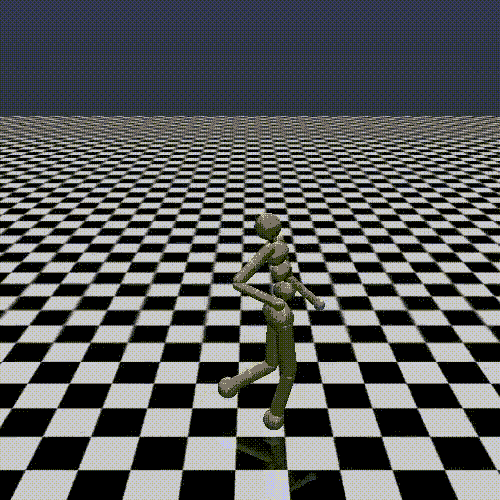
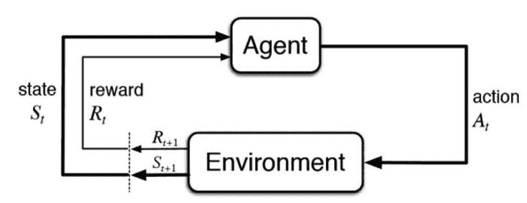

# 具有深度强化学习的连续控制

> 原文：<https://web.archive.org/web/https://neptune.ai/blog/continuous-control-with-deep-reinforcement-learning>

这一次我想探索如何深入利用[强化学习](/web/20221206055216/https://neptune.ai/blog/reinforcement-learning-basics-markov-chain-tree-search)，例如让一个人形模型行走。这种任务是连续控制任务。这种任务的解决方案不同于你可能知道并使用深度 Q 网络(DQN)玩 Atari 游戏(如 Pong)的方案。

我将讨论连续控制环境的特征。然后，我将向您介绍演员-评论家架构，并展示最先进的演员-评论家方法，软演员-评论家(SAC)的例子。最后，我们将深入研究代码。我将简要解释它是如何在令人惊叹的 SpinningUp 框架中实现的。我们走吧！

## 什么是持续控制？



*Continuous Control with Deep Reinforcement Learning | Source: [Roboschool](https://web.archive.org/web/20221206055216/https://openai.com/blog/roboschool/)*

遇见人形。它是一个三维的两足机器人环境。它的观测值是描述机器人运动学属性的 376 维向量。它的动作是 17 维向量，指定施加在机器人关节上的扭矩。目标是尽可能快地向前跑…并且不要摔倒。

动作是连续取值的向量。这与您可能已经从 Atari 环境中知道的一组固定的可能操作非常不同。它需要一个策略，不返回所有可能操作的分数或质量，而只返回一个要执行的操作。不同的策略输出需要不同的培训策略，我们将在下一节探讨这一点。

## 什么是 MuJoCo？

MuJoCo 是一个快速精确的物理模拟引擎，旨在研究和开发机器人、生物力学、图形和动画。OpenAI Gym 及其包含的人形环境利用它来模拟环境动态。我在这里写了关于安装和使用它的整个帖子[。对于这个帖子，我们不需要这个。](/web/20221206055216/https://neptune.ai/blog/installing-mujoco-to-work-with-openai-gym-environments)

## 不符合政策的行动者-批评家方法



*Reinforcement Learning | Source: Sutton & Barto, Reinforcement Learning: An Introduction, 2nd edition*

让我们回顾一下:强化学习(RL)是学习做什么——如何将情况映射到行动——以最大化某种累积奖励的概念。RL 由一个为了学习而在环境中活动的代理组成。环境对每个代理的动作提供响应，并反馈给代理。奖励被用作强化信号，而状态被用来制约代理人的决策。

真正的目标是找到一个最优的政策。策略告诉代理在它发现自己处于任何状态时应该如何表现。这是代理对环境目标的映射。

如上图所示，演员-评论家架构将代理分为两部分，演员**和评论家**分别为**和**。

*   **参与者**代表策略——它学习从状态到动作的映射。
*   **评论家**代表 Q 函数——它学习评估每个动作在每个可能的状态下有多好。你可以看到演员利用评论家的评价来改进政策。

为什么要使用这样的构造？如果你已经知道 Q-Learning ( [这里](https://web.archive.org/web/20221206055216/https://medium.com/emergent-future/simple-reinforcement-learning-with-tensorflow-part-0-q-learning-with-tables-and-neural-networks-d195264329d0)你可以了解它)，你知道训练 Q-函数对于解决 RL 任务是有用的。Q 函数会告诉你每个动作在任何状态下有多好。然后，您可以简单地选择最佳行动。当你有一套固定的行动时，很容易做到，你只需简单地评估每一个行动，然后选择最好的！

然而，在一个动作是连续的情况下该怎么办呢？你不能评估每一个值，你可以评估一些值并选择最好的，但它会产生自身的问题，例如分辨率——评估多少个值以及评估哪些值？演员就是这些问题的答案。它近似离散情况下的 argmax 算子。它只是被训练来预测最好的行动，如果我们能和批评家一起评估每一个可能的行动。下面我们描述软演员评论家(SAC)的例子。

### 伪代码中的 SAC

SAC 的批评者是经过训练的非政策，这意味着它可以重用由旧的、训练较少的政策收集的数据。第 11-13 行中的政策外批评家训练利用了与 DQN 非常相似的技术，例如，它使用目标 Q 网络来稳定训练。不符合策略的方法比符合策略的方法(如 [PPO](https://web.archive.org/web/20221206055216/https://spinningup.openai.com/en/latest/algorithms/ppo.html) )样本效率更高，因为我们可以构建经验重放缓冲区，其中每个收集的数据样本都可以多次重复用于训练——与符合策略的训练相反，符合策略的训练仅在一次更新后就丢弃数据！

您可以在第 1 行看到 critics 和 replay buffer 被初始化，在第 2 行看到 target critics。我们用两个批评家来对抗论文中描述的高估误差:“双 Q-learning”和“Actor-Critic 中的寻址函数近似误差”，你可以在这里了解更多。然后，在第 4-8 行中收集数据并提供给重放缓冲区。第 14 行更新策略，第 15 行更新目标网络。

您可能会注意到评论家和演员的更新都包括一些额外的日志术语。这是最大熵正则化，防止代理人过多地利用其可能不完美的知识，并奖励有前途的行动的探索。如果你想详细了解它，我推荐你阅读[这个](https://web.archive.org/web/20221206055216/https://spinningup.openai.com/en/latest/algorithms/sac.html)资源。

## 代码中的软演员评论家

我们将在深度 RL-TF2 实施框架中与[一起工作。repo 自述文件中有安装说明。注意，你暂时不用安装 MuJoCo。我们将在 OpenAI Gym suite 的 Pendulum-v0 环境中运行一个示例软演员-评论家代理。让我们投入进去吧！](https://web.archive.org/web/20221206055216/https://github.com/awarelab/spinningup_tf2)

### 钟摆 v0 环境

摆-v0 是连续控制环境，其中:

| 行动 | 一维中只有一个关节的扭矩 |
| --- | --- |
|  | 

三维向量，其中前两维代表摆的位置——它们是摆角的 cos 和 sin 第三维是摆角速度

 |
|  |  |

你可以把它想象成类似人形的更复杂的机器人的简化模型。人形机器人由许多相似的二维或三维关节组成。

## 培训 SAC 代理

在回购中，SAC 代理代码是[这里是](https://web.archive.org/web/20221206055216/https://github.com/awarelab/spinningup_tf2/tree/main/spinup_bis/algos/tf2/sac)。core.py 文件包括演员-评论家模型的工厂方法和其他实用程序。sac.py 包括重放缓冲区定义和上述训练算法的实现。我建议您浏览一下，并尝试将上面的伪代码行映射到该文件中的实际实现。然后，检查我的列表:

*   伪代码的第 1-2 行的初始化在 sac.py 的第 [159 行](https://web.archive.org/web/20221206055216/https://github.com/awarelab/spinningup_tf2/blob/f6fd8f679d76d43d44a2388549eb2c123cf0e743/spinup_bis/algos/tf2/sac/sac.py#L159)–[179 行](https://web.archive.org/web/20221206055216/https://github.com/awarelab/spinningup_tf2/blob/f6fd8f679d76d43d44a2388549eb2c123cf0e743/spinup_bis/algos/tf2/sac/sac.py#L179)中实现，
*   伪代码的第 3 行的主循环在 sac.py 中的第 [264](https://web.archive.org/web/20221206055216/https://github.com/awarelab/spinningup_tf2/blob/f6fd8f679d76d43d44a2388549eb2c123cf0e743/spinup_bis/algos/tf2/sac/sac.py#L264) 行实现，
*   伪代码第 4-8 行的数据收集在 sac.py 中的第[270](https://web.archive.org/web/20221206055216/https://github.com/awarelab/spinningup_tf2/blob/f6fd8f679d76d43d44a2388549eb2c123cf0e743/spinup_bis/algos/tf2/sac/sac.py#L270)–[295](https://web.archive.org/web/20221206055216/https://github.com/awarelab/spinningup_tf2/blob/f6fd8f679d76d43d44a2388549eb2c123cf0e743/spinup_bis/algos/tf2/sac/sac.py#L295)行实现。
*   伪代码第 9-11 行的更新处理在 sac.py 的第 [298 行](https://web.archive.org/web/20221206055216/https://github.com/awarelab/spinningup_tf2/blob/f6fd8f679d76d43d44a2388549eb2c123cf0e743/spinup_bis/algos/tf2/sac/sac.py#L298)–[300 行](https://web.archive.org/web/20221206055216/https://github.com/awarelab/spinningup_tf2/blob/f6fd8f679d76d43d44a2388549eb2c123cf0e743/spinup_bis/algos/tf2/sac/sac.py#L300)中实现，
*   伪代码第 12-15 行的参数更新在 sac.py 的第 [301](https://web.archive.org/web/20221206055216/https://github.com/awarelab/spinningup_tf2/blob/f6fd8f679d76d43d44a2388549eb2c123cf0e743/spinup_bis/algos/tf2/sac/sac.py#L301) 行调用，在第[192](https://web.archive.org/web/20221206055216/https://github.com/awarelab/spinningup_tf2/blob/f6fd8f679d76d43d44a2388549eb2c123cf0e743/spinup_bis/algos/tf2/sac/sac.py#L192)–[2](https://web.archive.org/web/20221206055216/https://github.com/awarelab/spinningup_tf2/blob/f6fd8f679d76d43d44a2388549eb2c123cf0e743/spinup_bis/algos/tf2/sac/sac.py#L240)40 行实现。
*   sac.py 中的其余代码主要是日志处理和一些样板代码。

Pendulum-v0 环境中的示例训练是在 repo 根中的 run_example.py 中实现的。简单地像这样运行它:python run_example.py。在训练之后——或者在 200，00 0 个环境步骤之后——训练将自动完成并在。/out/checkpoint 目录。

下面是培训开始和结束时的日志示例。请注意 AverageTestEpReturn 是如何变小的——从一个巨大的负数变到接近零的值，这是最大回报。回报是负的，因为代理人因为钟摆不在目标位置而受到惩罚:垂直，零角速度和零力矩。

在我配有英特尔 i5 处理器的 MacBook 上，培训耗时 482 秒(约 8 分钟)。

### 训练前

```py
---------------------------------------
|      AverageEpRet |       -1.48e+03 |
|          StdEpRet |             334 |
|          MaxEpRet |            -973 |
|          MinEpRet |       -1.89e+03 |
|  AverageTestEpRet |        -1.8e+03 |
|      StdTestEpRet |             175 |
|      MaxTestEpRet |       -1.48e+03 |
|      MinTestEpRet |       -1.94e+03 |
|             EpLen |             200 |
|         TestEpLen |             200 |
| TotalEnvInteracts |           2e+03 |
|     AverageQ1Vals |       -4.46e+03 |
|         StdQ1Vals |         7.1e+04 |
|         MaxQ1Vals |           0.744 |
|         MinQ1Vals |           -63.3 |
|     AverageQ2Vals |       -4.46e+03 |
|         StdQ2Vals |        7.11e+04 |
|         MaxQ2Vals |            0.74 |
|         MinQ2Vals |           -63.5 |
|      AverageLogPi |           -35.2 |
|          StdLogPi |             562 |
|          MaxLogPi |            3.03 |
|          MinLogPi |           -8.33 |
|            LossPi |            17.4 |
|            LossQ1 |            2.71 |
|            LossQ2 |            2.13 |
|    StepsPerSecond |        4.98e+03 |
|              Time |             3.8 |
---------------------------------------

```

### 训练后

```py
---------------------------------------
|      AverageEpRet |            -176 |
|          StdEpRet |            73.8 |
|          MaxEpRet |           -9.95 |
|          MinEpRet |            -250 |
|  AverageTestEpRet |            -203 |
|      StdTestEpRet |            55.3 |
|      MaxTestEpRet |            -129 |
|      MinTestEpRet |            -260 |
|             EpLen |             200 |
|         TestEpLen |             200 |
| TotalEnvInteracts |           2e+05 |
|     AverageQ1Vals |       -1.56e+04 |
|         StdQ1Vals |        2.48e+05 |
|         MaxQ1Vals |           -41.8 |
|         MinQ1Vals |            -367 |
|     AverageQ2Vals |       -1.56e+04 |
|         StdQ2Vals |        2.48e+05 |
|         MaxQ2Vals |           -42.9 |
|         MinQ2Vals |            -380 |
|      AverageLogPi |             475 |
|          StdLogPi |        7.57e+03 |
|          MaxLogPi |            7.26 |
|          MinLogPi |           -10.6 |
|            LossPi |            61.6 |
|            LossQ1 |            2.01 |
|            LossQ2 |            1.27 |
|    StepsPerSecond |        2.11e+03 |
|              Time |             482 |
---------------------------------------

```

## 可视化经过培训的策略

现在，保存了训练好的模型，我们可以运行它，看看效果如何！运行此脚本:

```py
python run_policy.py --model_path ./out/checkpoint --env_name Pendulum-v0
```

在回购根中。你会看到你的经纪人接连播放 10 集！是不是很酷？你的代理人受过训练能完美地垂直调整钟摆吗？我的不是。你可以试着玩玩 run_example.py 文件中的超参数(代理的函数参数)，让代理找到更好的策略。小提示:我发现早点结束训练可能会有帮助。所有超参数都在 sac.py 文件中的 SAC 的 docstring 中定义。

你可能会奇怪，为什么每一集都不一样？这是因为每次环境重置和新一集开始时，初始条件(钟摆起始角度和速度)都是随机的。

## 结论

你的下一步是在一些更复杂的环境中训练 SAC，如人形或 MuJoCo 套件中的任何其他环境。 [*安装 MuJoCo 与 OpenAI 健身房环境一起工作*](/web/20221206055216/https://neptune.ai/blog/installing-mujoco-to-work-with-openai-gym-environments) 是我写的关于如何安装 MuJoCo 并访问这些复杂环境的指南。它还描述了要跟踪的有用诊断。你可以在强化学习框架中的 [*日志中了解更多关于记录这些诊断的信息——你需要知道的*](/web/20221206055216/https://neptune.ai/blog/logging-in-reinforcement-learning-frameworks) 。也有其他实现算法的框架可以解决连续控制任务。在这篇文章中阅读它们: [*强化学习的最佳基准:终极清单*](/web/20221206055216/https://neptune.ai/blog/best-benchmarks-for-reinforcement-learning) 。感谢您的参与，下次再见！