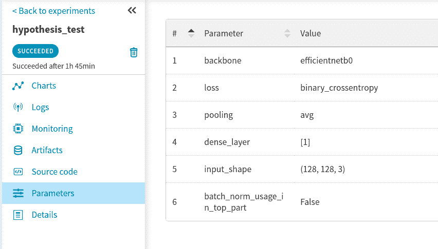
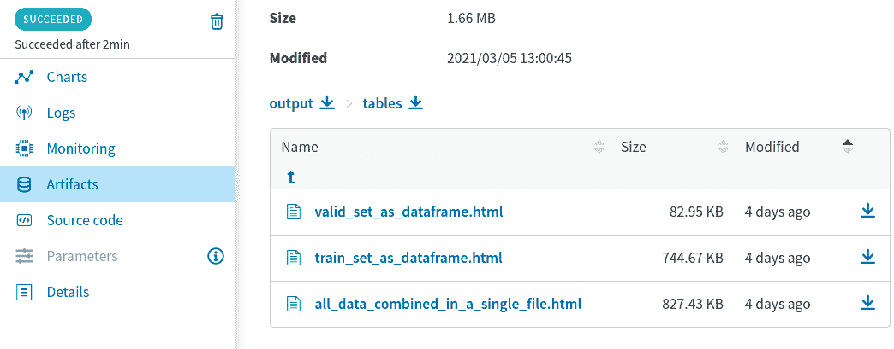
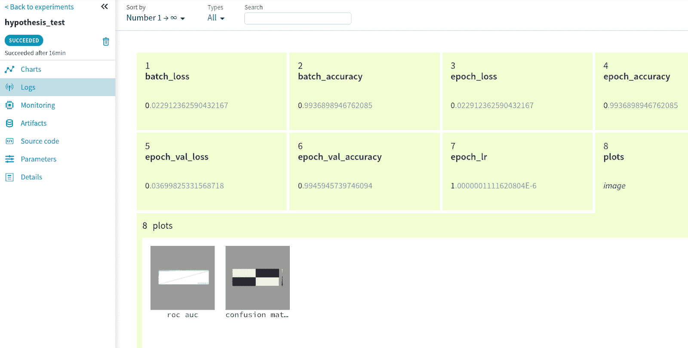
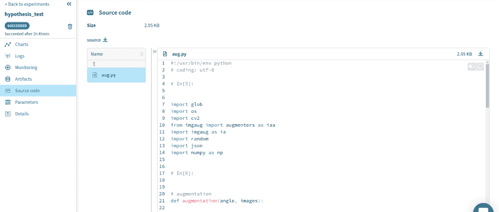
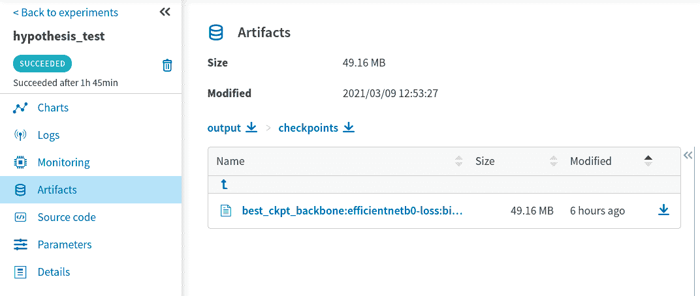
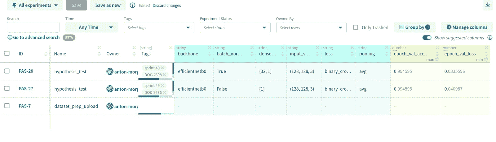

# 为什么您应该在您的机器学习项目中使用持续集成和持续部署

> 原文：<https://web.archive.org/web/https://neptune.ai/blog/continuous-integration-and-continuous-deployment-in-machine-learning-projects>

持续集成(CI)、持续交付(CD)和持续测试(CT)是机器学习操作(MLOps)原则的核心。如果你是一名数据科学家或机器学习工程师，知道 [DevOps](https://web.archive.org/web/20221206182614/https://cloud.google.com/devops) 原则，在这篇文章中，我将向你展示如何将它们应用于 ML 工作流。

如果你是投资于数据科学团队的 It 业务领导者，并且愿意扩展他们的 ML 能力，这也可能是有用的。MLOps 可能是为您的业务带来重大价值的下一步，可以加快任何机器学习项目的开发和实施阶段。

MLOps 为整个项目工作流程带来了透明度。它通过监控机器学习系统的所有步骤来做到这一点。透明性使得检测可能隐藏的瓶颈和缺陷变得容易。知道了问题在哪里，我们就可以提出行动计划，并衡量预防措施的效果。

## DevOps 和 MLOps 有什么不同？

DevOps 是软件开发中众所周知且广泛使用的实践。它被证明是可行的，并让团队缩短开发周期，使发布更加顺畅和快速。然而，从一开始就很清楚，我们不能将 DevOps 原则直接应用于机器学习，因为 ML 在本质上是不同的。

机器学习是高度实验性的:我们尝试不同的算法、参数和特征，以从我们的模型中获得最大的收益。ML 工程师必须做大量的实验，并且需要跟踪实验和它们产生的结果，看看什么有效，同时保持代码的可再现性和可重用性。

我们都知道机器学习是关于数据的。ML 工程师可能需要花费大量时间来进行探索性数据分析(EDA)，提出特性工程或模型开发的方法——这些是传统软件工程师永远不会做的事情。**ML**中侧重点不同，这也是 DevOps 实践在这里会失败的另一个原因。

机器学习是一个高节奏的环境，快速发展导致淘汰率增加。作为工程师，我们希望尽可能快地采用这些变化，以保持我们的模型是最新的。所有这些都使得实验驱动的开发变得更加重要，同时也需要跟踪和比较。

测试的方法也不同。与传统的软件测试相比，需要执行其他测试设置:确保数据验证，并进行模型评估。

部署不同。例如，部署 ML 模型不同于部署基于基本模型的预测服务。构建一个部署管道是一件相当不容易的事情，但是它是值得的，让我们构建一个在重新训练之后自动部署模型的系统。目前，许多企业还没有这样的部署系统，因此自动化的潜力是巨大的。

最后但同样重要的是，生产阶段。ML 工程师知道什么是[概念漂移](https://web.archive.org/web/20221206182614/https://en.wikipedia.org/wiki/Concept_drift)，以及它如何随着时间的推移导致模型退化。由于数据配置文件的自然演变，这种情况经常发生。我们不仅需要监控生产模型的性能，还需要在准确性下降时做好改进的准备。

## 面对 MLOps 的挑战，我们能做些什么

### 意识到你现在在哪里

Google 通过一组三个层次来定义组织中 ML 过程的成熟度。每个级别“*反映了在给定新数据的情况下训练新模型或者在给定新实现的情况下训练新模型的速度*。简单地说，根据机器学习管道的自动化程度，自动化水平可以分为三个级别。

谷歌表示，最常见的级别是 [MLOps 级别 0](https://web.archive.org/web/20221206182614/https://cloud.google.com/solutions/machine-learning/mlops-continuous-delivery-and-automation-pipelines-in-machine-learning#mlops_level_0_manual_process)——没有自动化，主要是脚本驱动的方法，机器学习工作流程中的大多数步骤都是手动执行的。MLOps 级别为 0 的组织最常见的挑战与部署的模型有关，根据 Google 的说法，“*无法适应环境动态的变化，或描述环境的数据的变化*”。

这是因为模型很少随着时间的推移而改变和重新训练。生产环境中较差的性能监控使工程师无法跟踪不必要的变化。

MLOps 级别 1 是机器学习管道的自动化方法，该级别的团队"*自动化使用新数据在生产中重新训练模型的过程*，并执行"*连续交付模型预测服务*"。

最高的第 2 级是全自动 CI / CD 系统。这是一个我们每个人都应该考虑的基准，并且理想情况下最终会达到。

当在我的团队中提出 MLOps 的问题时，我们处于零步骤。经过几个月和一些变化，我们能够从 0 级推进，并向 MLOps 级迈出第一步。

我将告诉你什么在我们的案例中起了作用，以及我们观察到了什么积极的变化。如果你刚刚开始在机器学习中使用 CI / CD，并希望向自动化的 ML 系统实现迈进，我们的经验一定会帮助你。我们才刚刚开始，离谷歌表现最好的管道还很远，但我们所做的已经给了我们巨大的改进，我很高兴与你分享。让我们开始吧！

### 定义一系列你最关心的问题

当我们开始的时候，很明显我们的机器学习工作流程并不完美。但是到底是什么问题呢？我们需要慢慢来，正式定义它们。经过几个小时的头脑风暴，我们发现了一系列需要首先解决的问题:

*   我们监控和处理生产模型的方式由于输入数据的发展而衰退(概念和数据漂移，培训服务偏差)；
*   缺乏[实验跟踪](/web/20221206182614/https://neptune.ai/experiment-tracking)控制，导致我们开发中的可重复性、可重用性和可比性降低；
*   低开发速度阻碍了我们使用尖端技术。我们希望加快测试新算法(架构/配置)的速度，并且足够快，这样就可以快速找到对特定问题最有效的方法。

我们决定将我们的重点限制在上述问题上，并着手解决它们。限制很重要，因为就像古老而真实的习语所说的那样——“一次吃一头大象”。我们决定先从 MLOps 大象身上咬三口，上面的列表是我们该怎么做的指南。

MLOps 级的大部分 ML 团队都存在以上三个问题。所以，你可以完全采用上面的要点来工作，或者改变它们来反映对你和你的队友来说最重要的，应该首先解决的问题。慢慢来，想想在你的环境中什么是重要的。

这是一个重要的结论，来自我们对减轻痛苦的工具的长期寻找:【MLOps 和跟踪解决方案的市场相当不成熟，所以很有可能没有工具可以消除你的所有问题。

即使是最好的可用解决方案也在开发中，无法解决您可能遇到的所有问题。现在，我们只需要接受这一点。所以，不要投入大量的时间去寻找完美的工具，因为你不会找到。

相反，我建议你买一个至少能解决你现有问题 70%的工具。相信我，这是一个很大的问题。

经过一段时间的研究，我们团队决定使用 [neptune.ai](/web/20221206182614/https://neptune.ai/) 。我们想尝试解决我们的问题。数据科学家和机器学习工程师已经知道它是一种很有前途的实验跟踪工具，具有记录的潜力，可以加快我们的合作开发，并提高可重复性和可重用性。

### 进行试点实验，看看结果

当我们找到合适的工具来测试和采用新的原则时，海王星的试点实验就开始了。

第一个也是最重要的变化是我们如何进行假设检验(即进行实验并跟踪它们)。我们从 TensorBoard(我们使用 TensorFlow / Keras 作为框架)转移到 Neptune，因为它提供了更广泛的选择。这改变了很多——我在另一篇专门比较 TensorBoard 和 Neptune 的文章中描述了最重要的变化。

如何通过 Neptune + [TensorFlow / Keras 集成来跟踪您的 TensorFlow/Keras 模型训练。](https://web.archive.org/web/20221206182614/https://docs.neptune.ai/essentials/integrations/deep-learning-frameworks/tensorflow-keras)

为了将 Neptune 集成到项目中，我们需要在多大程度上改变项目的代码？如果我们删除所需的注册过程(花了我们大约 3 分钟)并省略安装部分(又花了我们 3 分钟)，答案将是–**只添加了几行额外的代码来实现完整的集成。**为了实现集成，我们需要额外的代码:

```py
import neptune
import neptune_tensorboard as neptune_tb
from neptunecontrib.monitoring.keras import NeptuneMonitor

token = ***** 

neptune.init(project_qualified_name='my_project',
             api_token=token)
```

Neptune 文档很棒，所以你可以在里面找到你需要的任何东西。

让我回到整合上来。下一个变化是使用标准进行培训的模型发布。拟合方法。除了标准之外我们唯一要做的。fit 将传递一个新的回调函数(NeptuneMonitor())来完成所有的集成工作。以下是模型拟合的完整代码:

```py
workers_num = 6

model.fit_generator(generator=train_data_gen,
                    steps_per_epoch=train_steps_per_epoch,
                    epochs=100,
                    validation_data=valid_data_gen,
                    validation_steps=valid_steps_per_epoch,
                    callbacks=[tbCallBack,
                               rLrCallBack,
                               mcCallBack_loss,
                               mcCallBack_acc,
                               esCallBack,
                               NeptuneMonitor()
                              ],
                    use_multiprocessing=True,
                    workers=workers_num
                   )
```

NeptuneMonitor()将跟踪模型损失和我们定义的一组指标。它还将监控硬件利用率。

除此之外，我们还可以通过记录我们认为相关的额外工件来丰富每次发布。例如，我们可以[将我们使用的一整套模型参数](https://web.archive.org/web/20221206182614/https://docs.neptune.ai/you-should-know/what-can-you-log-and-display#parameters-and-model-configuration)链接到一个实验。这是它在 Neptune UI 中的样子:



*Model parameters stored for a particular model training run*

除此之外，使用 Neptune，我们能够通过将用于训练和验证的数据集链接到特定的实验运行来实现数据版本控制。这是它在 Neptune UI 中的样子:



*Datasets as HTMLs stored at Neptune. Data version control in action.*

我们实际上做得更深入，充分利用了 [Neptune 的协作选项](/web/20221206182614/https://neptune.ai/for-teams)。我们邀请我们的测试团队到 Neptune，并要求他们上传和附加他们用于模型评估的测试数据集。现在所有数据都存储在一个地方，超级方便。更酷的是，可以通过编程获取数据，并在需要时进行恢复。

我们还选择了一个月的时间作为我们在生产中重新评估模型的时间。这是我们推出生产模型监控的第一小步。

由于我们处理的数据的隐私特定原因，我们没有提出模型评估的自动化解决方案。考虑到数据的敏感性，我们仍然需要半手工的数据收集(半手工，因为我们仍然使用脚本来查询数据库，提取数据并在 Python 中处理它)和评估。我们提取并计划用于评估的新测试数据集以及评估结果现在也上传到 Neptune 并存储在那里。我们可以跟踪我们的模型是否会随着时间的推移而退化。每次评估后，我们都会上传并记录:

1.  可以帮助我们直观理解模型性能的情节；
2.  绩效指标的值。



*Plots (roc-auc and confusion matrix) after evaluation are uploaded to Neptune.*
*Performance metrics are also displayed*.

我之前提到过，在 MLOps 级，大部分工作都是脚本驱动的。我们的团队就是一个例子。但是现在，我们跟踪我们开发的脚本和 jupyter 笔记本。

例如，看看我们如何上传我们在特定模型运行中使用的数据扩充脚本，并将它们附加到 Neptune 中的相关实验:



*Data augmentation scripts is attached to an experiment where it was used*

为了消除由培训和生产之间的数据处理差异引起的培训服务偏差，我们还开始向 Neptune 上传完整的代码，该代码以推理模式启动模型，并对输入数据进行适当的预处理。由于所有这些代码脚本都在一个地方，这有助于我们的团队更快、更有效地协作。

我们邀请了后端团队的一些人到 Neptune，并解释了他们如何从那里获取模型属性和相关的代码脚本，这样就可以用它们来构建微服务。对了，最后的模型权重现在也上传存储在海王星了。它看起来是这样的:



*Weights file for the best model is uploaded and stored at Neptune, so it can be fetched during the deployment phase*

最后但同样重要的是，我们现在可以用更方便的方式试验新的模型和参数实现。我提到过，我们在开发过程中努力保持最新。

随着海王星的引入，这变得更好了。这是因为我们现在能够重现实验，并将它们与其他实验进行比较。

例如，最近推出了一种新的主干网，我们想尝试一下？没问题！看看能不能打败我们之前的配置。我们所需要的是获取我们之前用于训练、验证和测试先前模型的所有数据。

如果需要重用一些其他代码片段(比如我们之前讨论的用于增强的脚本)，我们也可以直接从 Neptune 获得。尽管去取吧，都是附在上次运行中的。我们甚至可以在同一个笔记本或代码脚本中继续工作。代码中的新变化将被记录在新的检查点中，允许我们随时随地回滚。很漂亮，对吧？


*Checkpoints made for a jupyter notebook I worked in through the entire project*

同样值得一提的是，所有的实验运行都位于一个地方，一眼就可以轻松区分和比较——这要归功于 Neptune 允许我们放在实验旁边的 [**标签**](https://web.archive.org/web/20221206182614/https://docs.neptune.ai/you-should-know/what-can-you-log-and-display#tags) 和**日志**。



*Experiments page within Neptune’s UI*

当你已经做了很多实验，并且上面的实验页面被我们做的实验数量淹没时，这样一个特性变得特别有用。当您可以对实验应用过滤器时，导航会变得容易得多，或者只需查看实验旁边的独特值和描述。

## 结论

自从我们部署 Neptune 作为 MLOps 元数据存储工具以来，已经过去了大约 3 个月。对我们团队来说，积极的变化是显而易见的。我们离 MLOps 级还很远，但是第一步也是最难的一步已经迈出了。让我们回顾一下我们能够实现的目标:

*   生产模型现在处于我们的密切监视之下:每个月它们都在新获得的生产数据集上被重新评估。数据提取过程仍然是手动的，但是我们引入了这个想法，并将其集成到我们的管理设置中。我们的测试团队已经发展并改变了他们进行生产模型测试的方式。数据集和评估结果现在被上传到 Neptune，并与以前的评估进行比较，因此可以做出关于模型退化的决定。
*   我们的机器学习团队的开发速度明显加快。我们的内部测量显示提高了 2 倍，让我们有更多的时间来交付切实的成果。这是我们开展实验的方式改变的直接影响。现在，有一个简化导航的结构。所有相关的属性和检查点都被附加并存储在一个地方，从而提高了可重用性和可再现性。由于编写良好的文档和方便的集成方法，我们的 Neptune 集成引入的更改很容易被团队采用。
*   我们现在报告的生产、测试和开发阶段的培训服务偏差案例减少了 1/2，消除了不同管道中数据处理方式的差异。

不错吧？尤其是考虑到我们开始工作才 3 个月。我希望我们的经验是一个很好的例子，展示每个人如何开始致力于 ML 项目的 CI / CD 实现。有什么我们可以做得更好的吗？请在下面的评论区与我们分享你的想法和想法。