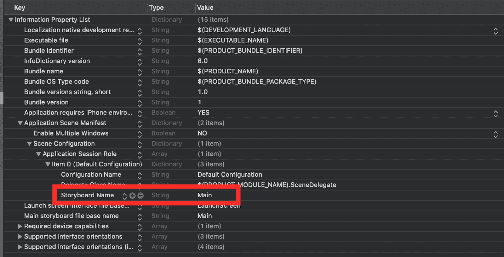

# 英伟达支持的对话式人工智能架构:工具指南

> 原文：<https://web.archive.org/web/https://neptune.ai/blog/conversational-ai-nvidia-tools-guide>

随着自然语音合成和语音识别等深度学习领域的最新进展，AI 和深度学习模型越来越多地进入我们的日常生活。事实上，许多无害的应用程序，与我们的日常生活无缝集成，正慢慢变得不可或缺。

大型数据驱动的服务公司严重依赖复杂的网络架构，其管道使用对话式深度学习模型，并遵守各种各样的语音任务，以尽可能最好的方式为客户服务。

更广泛地说，“对话式人工智能”一词意味着所有能够自然模仿人类声音、理解对话、开发个人口语意图识别配置文件(如 Alexa 或谷歌助手)的智能系统。简而言之，对话式 AI 是为了类似人类的对话。

深度学习在改进现有的语音合成方法方面发挥了巨大的作用，它用纯数据训练的神经网络取代了整个管道过程。根据这个观点，我想探索两个在他们的领域中非常有名的新模型:

*   用于文本到语音转换的 Tacotron 2，
*   用于自动语音识别的 Quartznet。

我们将讨论的模型版本基于 Nvidia 最近推出的神经模块 **NeMo** 技术。

我们将探索它们的架构，并深入研究 Github 上的 Pytorch。此外，我们将实现一个 Django REST API，通过公共端点为模型提供服务，最后，我们将创建一个小型 IOS 应用程序，通过客户端的 HTTP 请求来使用后端。

## 深入研究 ASR 和 TTS 架构

### 石英网

正如他们的[论文](https://web.archive.org/web/20221206024929/https://arxiv.org/pdf/1904.03288.pdf)所述，Jasper 是一个用于自动语音识别的端到端神经声学模型。所有 Nvidia 的语音识别模型，像**石英网**，都来自 Jasper。

由于它是端到端的，所以整体架构支持从输入音频处理到文本转录的所有必要阶段。基础设施背后的管道涉及三个主要部分:

*   编码器和解码器，用于将音频输入转换为 Mel 频谱图；
*   统计语言模型，即强化的 [*n-gram 语言模型*](https://web.archive.org/web/20221206024929/https://towardsdatascience.com/introduction-to-language-models-n-gram-e323081503d9) ，从声学输入中寻找最可能产生的词序列，并生成与声谱图采样率紧密匹配的特定嵌入；
*   产生对应于音频输入的文本输出。

符合 Jasper 架构的主要层是**卷积神经网络**。它们旨在通过允许整个子块融合到单个 GPU 内核中来促进快速 GPU 推理。这对于部署阶段的严格实时场景极其重要。

使用密集残差连接，每个块输入都与所有后续块的最后一个子块紧密连接(要了解更多关于残差网络的信息，请查看本文[)。每个块的内核大小和过滤器数量都不相同，越深的层其大小越大。](https://web.archive.org/web/20221206024929/https://towardsdatascience.com/introduction-to-resnets-c0a830a288a4)

### 塔克特龙二号

就编码器-解码器管道而言，Tacotron 的整体架构遵循与 Quartznet 相似的模式。Tacotron 也可以被视为一个序列到序列模型，它将字符嵌入映射到可扩展的 Mel 频谱图，然后是一个修改的声码器(WaveNet)，以帮助合成时域波形并生成人类听觉输出。

***注*** *:* [*梅尔频谱图*](https://web.archive.org/web/20221206024929/https://medium.com/analytics-vidhya/understanding-the-mel-spectrogram-fca2afa2ce53) *是基于梅尔曲线的时频分布图，反映了人耳蜗的特征。*

该体系结构的关键阶段是:

*   处理字符嵌入的第一递归的基于序列间注意力的特征提取器。它产生 Mel 谱图帧作为第二级的前向输入；
*   一个改进的 WaveNet 声码器，它产生先前根据 *Mel 频谱图*调节的时域波形样本。

解码器基于自回归递归神经网络。它试图从编码的输入序列中一次一帧地预测 Mel 光谱图。来自前面步骤的预测通过一个小的预网络，具有 256 个隐藏 ReLU 单元的 2 个完全连接的层。主要思想是使用完全连接的层作为信息瓶颈，因此它可以有效地学习注意力。关于注意力机制的更多见解，你可以查看以下文章:

*注:这两个模型在流行的 Librispeech 和 WSJ 数据集上都取得了平均意见得分****4.53****的 MOS，几乎可以与专业录制的演讲相媲美。*

## 神经模块工具包， **NeMo**

NeMo 是一个编程库，它利用可重用神经组件的能力来帮助您轻松安全地构建复杂的架构。神经模块是为速度而设计的，可以在并行 GPU 节点上横向扩展训练。

通过神经模块，他们想要创建通用 Pytorch 类，每个模型架构都是从这些类中派生出来的。该库非常强大，并提供了对话式人工智能所需的不同深度学习模型的整体旅行。语音识别、语音合成、文本到语音到自然语言处理，等等。

通常，神经模块是对应于神经网络的概念部分的软件抽象，例如编码器、解码器、专用损耗、语言和声学模型、或者音频和频谱图数据处理器。

该库构建在 CUDA 和 cuDNN 低级软件之上，利用 Nvidia GPUs 进行并行训练和速度推理。

看看他们的 [Github repo](https://web.archive.org/web/20221206024929/https://github.com/NVIDIA/NeMo) ，很有见地。

## 通过 Pytorch 处理程序服务模型

为了构建和公开访问模型推理的 API 端点，我们需要创建一个管理中间所需步骤的类；从预处理原始输入数据，用配置和检查点文件初始化模型实例，到运行推理并产生合适的结果——这需要很好地管理。

此外，如果我们想要组合多个模型来构建一个更复杂的管道，组织我们的工作是分离每个部分的关注点的关键，并使我们的代码易于维护。

例如，ASR 输出通常不会被打断。如果我们在一个敏感的场景中使用模型，我们必须用标点符号将 ASR 模型的文本原始输出链接起来，以帮助澄清上下文并增强可读性。

在这方面，以下代码说明了不同的模型处理程序:

### Tacotron 处理器

```py
class TacotronHandler(nn.Module):
   def __init__(self):
       super().__init__()
       self.tacotron_model = None
       self.waveglow = None
       self.device = None
       self.initialized = None

   def _load_tacotron2(self, checkpoint_file, hparams_config: Hparams):
       tacotron2_checkpoint = torch.load(os.path.join(_WORK_DIR, _MODEL_DIR, checkpoint_file))
       self.tacotron_model = Tacotron2(hparams= hparams_config)
       self.tacotron_model.load_state_dict(tacotron2_checkpoint['state_dict'])
       self.tacotron_model.to(self.device)
       self.tacotron_model.eval()

   def _load_waveglow(self, checkpoint_file, is_fp16: bool):
       waveglow_checkpoint = torch.load(os.path.join(_WORK_DIR, _MODEL_DIR, checkpoint_file))
       waveglow_model = WaveGlow(
           n_mel_channels=waveglow_params.n_mel_channels,
           n_flows=waveglow_params.n_flows,
           n_group=waveglow_params.n_group,
           n_early_every=waveglow_params.n_early_every,
           n_early_size=waveglow_params.n_early_size,
           WN_config=WN_config
       )
       self.waveglow = waveglow_model
       self.waveglow.load_state_dict(waveglow_checkpoint)
       self.waveglow = waveglow_model.remove_weightnorm(waveglow_model)
       self.waveglow.to(self.device)
       self.waveglow.eval()
       if is_fp16:
           from apex import amp
           self.waveglow, _ = amp.initialize(waveglow_model, [], opt_level="3")

   def initialize(self):
       if not torch.cuda.is_available():
           raise RuntimeError("This model is not supported on CPU machines.")
       self.device = torch.device('cuda')

       self._load_tacotron2(
           checkpoint_file='tacotron2.pt',
           hparams_config=tacotron_hparams)

       self._load_waveglow(
           is_fp16=False,
           checkpoint_file='waveglow_weights.pt')

       self.initialized = True

       logger.debug('Tacotron and Waveglow models successfully loaded!')

   def preprocess(self, text_seq):
       text = text_seq
       if text_seq[-1].isalpha() or text_seq[-1].isspace():
           text = text_seq + '.'
       sequence = np.array(text_to_sequence(text, ['english_cleaners']))[None, :]
       sequence = torch.from_numpy(sequence).to(device=self.device, dtype=torch.int64)
       return sequence

   def inference(self, data):
       start_inference_time = time.time()
       _, mel_output_postnet, _, _ = self.tacotron_model.inference(data)
       with torch.no_grad():
           audio = self.waveglow.infer(mel_output_postnet, sigma=0.666)
       return audio, time.time() - start_inference_time

   def postprocess(self, inference_output):
       audio_numpy = inference_output[0].data.cpu().numpy()
       output_name = 'tts_output_{}.wav'.format(uuid.uuid1())
       path = os.path.join(_AUDIO_DIR, output_name)
       print(path)
       write(path, tacotron_hparams.sampling_rate, audio_numpy)
       return 'API/audio/'+ output_name
```

*   initialize():用各自的检查点加载 **Tacontron** 和 **Wave Glow** 。

*   预处理(text_seq):将原始文本转换成适合模型的输入。转换它
*   一组特定的字符序列。

*   推断(数据):对之前处理的输入进行推断，并返回与输入文本匹配的相应合成音频。

*   postprocess(inference_output):将 wav 音频文件保存到容器文件系统下的一个目录中。

### 石英网装载机

```py
class Quartznet_loader():
   def __init__(self, torch_device=None):
       if torch_device is None:
           if torch.cuda.is_available():
               torch_device = torch.device('cuda')
           else:
               torch_device = torch.device('cpu')

       self.file_config = path.join(WORK_DIR, _MODEL_CONFIG)
       self.file_checkpoints = path.join(WORK_DIR, _MODEL_WEIGHTS)

       model_config = OmegaConf.load(self.file_config)
       OmegaConf.set_struct(model_config, True)

       if isinstance(model_config, DictConfig):
           self.config = OmegaConf.to_container(model_config, resolve=True)
           self.config = OmegaConf.create(self.config)
           OmegaConf.set_struct(self.config, True)

       instance = EncDecCTCModel(cfg=self.config)

       self.model_instance = instance
       self.model_instance.to(torch_device)
       self.model_instance.load_state_dict(torch.load(self.file_checkpoints, torch_device), False)

   def covert_to_text(self, audio_files):
       return self.model_instance.transcribe(paths2audio_files=audio_files)

   def create_output_manifest(self, file_path):

       manifest = dict()
       manifest['audio_filepath'] = file_path
       manifest['duration'] = 18000
       manifest['text'] = 'todo'

       with open(file_path + ".json", 'w') as fout:
           fout.write(json.dumps(manifest))

       return file_path + ".json"
```

*   init(torch_device):初始化将要运行模型检查点的硬件设备，无论它是在 CPU 上还是在支持 Cuda 的 GPU 上。
*   model _ config = omegaconf . load(self . file _ config):用编码器、解码器、优化器、预处理器和声谱图增强器的相应结构加载模型的配置文件。
*   instance = EncDecCTCModel(CFG = self . config):调用神经模块 EncDecCTCModel 从各自的 Quartz-Net 配置文件中实例化。该模块将创建一个特定的 NeMo 实例，通过它可以访问一些非常方便的驱动模型行为的函数。convert_to_text(audio_files):调用 EncDecCTCModel.instance 将音频 wav 格式文件转录为文本输出。
*   create _ output _ manifest(file _ path):将最终结果保存到一个 json 文件中，文件中包含输入音频文件路径、音频时长、音频采样率以及相应的转录文本。

### Bert Loader

```py
class Bert_loader():
   def __init__(self, torch_device=None):
       if torch_device is None:
           if torch.cuda.is_available():
               torch_device = torch.device('cuda')
           else:
               torch_device = torch.device('cpu')

       self.file_config = path.join(WORK_DIR, _MODEL_CONFIG)
       self.file_checkpoints = path.join(WORK_DIR, _MODEL_WEIGHTS)

       model_config = OmegaConf.load(self.file_config)
       OmegaConf.set_struct(model_config, True)

       if isinstance(model_config, DictConfig):
           self.config = OmegaConf.to_container(model_config, resolve=True)
           self.config = OmegaConf.create(self.config)
           OmegaConf.set_struct(self.config, True)

       instance = PunctuationCapitalizationModel(cfg=self.config)

       self.model_instance = instance
       self.model_instance.to(torch_device)
       self.model_instance.load_state_dict(torch.load(self.file_checkpoints, torch_device), False)

   def punctuate(self, query):
       return self.model_instance.add_punctuation_capitalization(query)[0]
```

*   init(torch_device):在 CPU 或支持 Cuda 的 GPU 上初始化将运行模型检查点的硬件设备。
*   model _ config = omegaconf . load(self . file _ config):用编码器、解码器、优化器、预处理器和声谱图增强器的相应结构加载模型的配置文件。
*   instance = PunctuationCapitalizationModel(CFG = self . config):调用神经模块，该模块实现了轻量级 Bert 语言模型行为的内部代码。实际的实例将能够标点出原始输入文本。
*   标点(查询):以查询的形式获取原始输入文本，并输出一个整洁的文本版本，该文本带有完整的标点符号，可读性很好。

*注:关于代码的更多细节，请参考我的 github repo，我在那里获得了整个项目的资源——*[*对话式 API*](https://web.archive.org/web/20221206024929/https://github.com/aymanehachcham/Conversational-API)

## 构建 Django API

我们将使用 Django REST 框架构建一个简单的 API 来服务我们的模型。我们的想法是配置所有需要的文件，包括模型、路由管道和视图，这样我们就可以通过 forward POST 和 GET 请求轻松地测试推理。

如果你需要做一个 Django Rest 项目的完整旅程，可以看看我以前关于这个主题的文章:[使用 Django API 进行语义分割](https://web.archive.org/web/20221206024929/https://towardsdatascience.com/semantic-segmentation-using-a-django-api-deeplabv3-7b7904ddfed9)

对于项目需求，我们将依靠第三方服务来通过我们的端点存储和检索语音生成的数据。所以，Django ORM 助手和序列化器将会派上用场。正如他们的文档所述，Django ORM 是“*一种创建 SQL 来查询和操作数据库并以 Pythonic 方式获得结果的 Pythonic 方式*”

现在:

*   为 TTS、ASR 输出创建 ORM 模型；
*   创建相应的序列化程序；
*   构建您的视图(发布、删除)和路由。

```py
class ASRText(models.Model):
   uuid = models.UUIDField(primary_key=True, default=uuid.uuid4, editable=False)
   name = models.CharField(max_length=255,null=True, blank=True)
   Output = models.TextField(null=True, blank=True)
   inference_time = models.CharField(max_length=255,null=True, blank=True)
   audio_join_Transformed = models.FileField(upload_to=get_asr_media, null=True, blank=True)
   created_at = models.DateTimeField(auto_now_add=True)
   class Meta:
       verbose_name = "ASRText"
       verbose_name_plural = "ASRTexts"

   def __str__(self):
       return "%s" % self.name

class TTSSound(models.Model):
   uuid = models.UUIDField(primary_key=True, default=uuid.uuid4, editable=False)
   name = models.CharField(max_length=255,null=True, blank=True)
   text_content = models.TextField(null=True, blank=True)
   audio_join = models.FileField(upload_to=get_tts_media, null=True, blank=True)
   inference_time = models.CharField(max_length=255,null=True, blank=True)
   created_at = models.DateTimeField(auto_now_add=True)
```

连续地创建你的视图。出于示例的目的，我将展示两个简单的 POST 请求，它们在 ASR 和 TTS 这两种场景中都完成了工作:

*   ASR 文本实例的 ASRText
*   TTS 音频实例的 TTSound

但是在实际实现 API 视图之前，我们需要在项目的全局范围内实例化模型处理程序，以便可以将繁重的配置文件和检查点加载到内存中并准备使用。

```py
bert_punctuator = Bert_loader()
quartznet_asr =Quartznet_loader()
tacotron2_tts = TTS_loader()
ASR_SAMPLING_RATE = 22050
```

### ASR 发布请求

```py
@api_view(['POST'])
def asr_conversion(request):
   data = request.FILES['audio']

   audio = ASRInputSound.objects.create(audio_file=data)

   file = [audio.audio_file.path]
   start_time = time.time()
   transcription = quartznet_asr.covert_to_text(file)
   well_formatted = bert_punctuator.punctuate(transcription)

   text = ASRText.objects.create(
       name='ASR_Text_%02d' % uuid.uuid1(),
       Output=well_formatted,
       inference_time=str((time.time() - start_time)),
       audio_join_Transformed=audio.audio_file.path
   )

   serializer = ASROutputSeralizer(text)
   return Response(serializer.data, status=status.HTTP_200_OK)
```

*   它获取从 POST api 调用 file = [audio.audio_file.path]发送的音频文件的存储路径。在获得文件后，quartznet 实例立即对后者进行推理，提取一个原始转录，调用 bert _ punctuator.punctuate(转录)对其进行标点。
*   接下来，调用 ASRText 序列化程序将实例对象保存到数据库中，如果运行顺利，它会输出一个 HTTP 成功状态 200，并带有包含实际转录输出的格式化 JSON 响应。

### TTS 发布请求

```py
@api_view(['POST'])
def tts_transcription(request):
   text = request.data.get('text')
   tts_id = uuid.uuid1()
   path = "Audio/tts_output_%02d.wav" % tts_id

   start_time = time.time()
   output_audio = tacotron2_tts.tts_inference(text)

   write(path, int(ASR_SAMPLING_RATE), output_audio)
   audio = TTSSound.objects.create(
       audio_join=path,
       name='Sound_%02d' % tts_id,
       text_content=text,
       inference_time=str((time.time() - start_time))
   )

   audio.save()
   serializer = TTSOutputSerializer(audio)
   return Response(serializer.data, status=status.HTTP_200_OK)
```

tts_transcription post 方法也是如此，我们对输入文本进行推理，生成采样率为 22050 的输出音频文件，并使用 write(path)方法将其保存在文件系统的本地。

类似地，如果请求成功，带有包含音频路径的格式化 JSON 响应，我们返回 HTTP 200 状态。

## 创建 iOS 应用程序来使用服务

在本节中，我们将创建一个简单的 IOS 应用程序，它带有两个 ViewControllers，以一种有趣的方式使用 API。

我们将以编程方式构建应用程序，不使用故事板，这意味着没有要切换的框或按钮——只有纯代码。

要从项目设置中完全删除故事板，您需要遵循以下步骤:

*   删除项目结构中的 *main.storyboard* 文件。
*   对于 Xcode 11 或更高版本，转到 i *nfo.plist* 文件，删除*故事板名称*属性。



*   如下修改 SceneDelegate.swift 文件中的代码，使 **AudioViewController** 成为主 **UINavigationController**

```py
func scene(_ scene: UIScene, willConnectTo session: UISceneSession, options connectionOptions: UIScene.ConnectionOptions) {
       guard let windowScence = (scene as? UIWindowScene) else { return }

       window = UIWindow(frame: windowScence.coordinateSpace.bounds)
       window?.windowScene = windowScence
       let recordingController = AudioRecordingViewController() as AudioRecordingViewController
       let navigationController = UINavigationController(rootViewController: recordingController)
       navigationController.navigationBar.isTranslucent = false
       window?.rootViewController = navigationController
       window?.makeKeyAndVisible()
   }

```

现在，您已经准备好开始编写主视图控制器了。

对于这个简单的应用程序，我们将呈现两个屏幕，每个屏幕关注一个特定的部分:

*   **AudioViewController** 将负责录制您的语音，并使用录音按钮设置通用 UI。
*   **ASRViewController** 将发送一个包含您录制的音频文件的 HTTP Post 请求，并接收转录的文本。将解析 JSON 响应，并显示文本内容。

### 为您的 AudioViewContoller 构造布局和 UI 配置

AudioViewController 有两个按钮:一个用于录音，一个用于停止录音。在录音按钮下面有一个最后的标签，显示一条消息通知用户他的声音正在被录音。

要构建没有 AutoLayout 的视图，我们需要在每个 UI 元素上设置自定义约束。

下面的代码可以做到这一点:

```py
func constrainstInit(){
   NSLayoutConstraint.activate([

       // Constraints for the Recording Button:
       recordingButton.widthAnchor.constraint(equalToConstant: view.frame.width - 60),
       recordingButton.heightAnchor.constraint(equalToConstant: 60),
       recordingButton.centerXAnchor.constraint(equalTo: view.centerXAnchor),
       recordingButton.topAnchor.constraint(equalTo: logo.bottomAnchor, constant: view.frame.height/6),

       // Constraints for the Label:
       recordingLabel.centerXAnchor.constraint(equalTo: view.centerXAnchor),
       recordingLabel.topAnchor.constraint(equalTo: recordingButton.bottomAnchor, constant: 10),

       // Constraints for the Stop Recording Button:
       stopRecordingButton.widthAnchor.constraint(equalToConstant: view.frame.width - 60),
       stopRecordingButton.heightAnchor.constraint(equalToConstant: 60),
       stopRecordingButton.centerXAnchor.constraint(equalTo: view.centerXAnchor),
       stopRecordingButton.topAnchor.constraint(equalTo: recordingButton.bottomAnchor, constant: 40)
   ])
}
```

将布局添加到主视图:

```py
override func viewDidLoad() {
   super.viewDidLoad()
   view.backgroundColor = .white

   view.addSubview(recordingButton)
   view.addSubview(recordingLabel)
   view.addSubview(stopRecordingButton)
   view.addSubview(logo)

   constrainstInit()
}
```

### 音频记录逻辑

对于记录部分，我们将使用来自 UIKit 的广为人知的 AVFoundation 库，它完全符合我们的目的。

三个主要功能将实现核心逻辑:

#### 1.录音音频()

使用 AVAudioRecorder 共享实例处理与语音录制相关的所有逻辑，并设置内部目录路径以保存生成的音频文件。

```py
@objc
func recordAudio(){
   recordingButton.isEnabled = false
   recordingLabel.isHidden = false
   stopRecordingButton.isEnabled = true

   // Code for audio record:
   let dirPath = NSSearchPathForDirectoriesInDomains(.documentDirectory, .userDomainMask, true)[0] as String
   let recordedFileName = "recording.wav"
   let pathArray = [dirPath, recordedFileName]
   let filePath = URL(string: pathArray.joined(separator: "/"))

   let recordingSession = AVAudioSession.sharedInstance()
   try! recordingSession.setCategory(AVAudioSession.Category.playAndRecord, options: .defaultToSpeaker)

   try! audioRecorder = AVAudioRecorder(url: filePath!, settings:  [:])
   audioRecorder.delegate = self
   audioRecorder.isMeteringEnabled = true
   audioRecorder.prepareToRecord()
   audioRecorder.record()

}
```

#### 2.停止录制()

完成录音会话并使默认 iphone 扬声器静音，以避免原始录音上出现任何不必要的噪音。

```py
@objc
func stopRecording() {
   stopRecordingButton.isEnabled = false
   recordingButton.isEnabled = true

   // Stop the recording and AVAudioRecord session previously active:
   audioRecorder.stop()
   let audioSession = AVAudioSession.sharedInstance()
   try! audioSession.setActive(false)
}

```

#### 3.audioRecorderDidFinishRecording()委托

当 AVAudioRecorder 会话成功结束且未引发任何硬件相关错误时触发。它将记录器文件的路径发送给 ASRViewController。

```py
func audioRecorderDidFinishRecording(_ recorder: AVAudioRecorder, successfully flag: Bool) {
   if flag {
       asrController.recorderAudioURL = audioRecorder.url
       self.navigationController?.pushViewController(asrController, animated: true)
   }
   else {
       print("Your audio was not saved")
   }
}
```

### ASRViewController，处理 API 回调

API 期望一个[**String**:**String**]类型的字典——键是“audio”，值是音频文件路径，实际上是一个字符串。

我们将使用 [Alamofire](https://web.archive.org/web/20221206024929/https://github.com/Alamofire/Alamofire) ，这是一个广泛使用的 Swift 软件包，用于处理与 Swift 的*优雅的 HTTP 联网*。用你喜欢的方法安装软件包，我用的是 CocoaPod。

*   创建将用于发送要编码到 URLRequest 中的 POST 请求值的参数；

*   使用 Alamofire 请求方法执行请求。传递 API 入口点、方法类型(在我们的例子中是 POST)和参数；

*   处理 API 响应结果。如果成功，我们将把 API 响应解析为 JSON 对象，并提取输出文本来显示它。

```py
func transcribeAudio() {
   let audioFilePath = audioRecorder.url! as String

   AF.request(URL.init(string: self.apiEntryPoint)!, method: .post, parameters: parameters, encoding: JSONEncoding.default, headers: .none).responseJSON { (response) in

   switch response.result {
       case .success(let value):
               if let JSON = value as? [String: Any] {
                   let trasncribedText = JSON["Output"] as! String
               }
           break
       case .failure(let error):
           print(error)
           break
       }
   }
}
```

### 结果

对于下面的音频文件: [Sample ASR](https://web.archive.org/web/20221206024929/https://soundcloud.com/user-77268239/sample-for-asr) ，我们从 API 调用:
获得结果 JSON 响应

## 结论

好的，这是整个项目的概述。从构建后端 API 来服务于我们的深度学习模型，到以有趣而简单的方式消费服务的小应用程序。我强烈建议您查看 Github repos 以获得更深入的见解:

正如你所看到的，语音合成和语音识别是非常有前途的，它们将不断改进，直到我们达到令人惊叹的结果。

对话式人工智能越来越接近无缝地讨论智能系统，甚至没有注意到与人类语音的任何实质性差异。

如果您想深入了解，我将为您提供更多资源:

感谢阅读！