# 交叉熵损失及其在深度学习中的应用

> 原文：<https://web.archive.org/web/https://neptune.ai/blog/cross-entropy-loss-and-its-applications-in-deep-learning>

在 21 世纪，大多数企业都在使用机器学习和深度学习来自动化他们的流程、决策、提高疾病检测的效率等。公司如何优化这些模型？他们如何确定模型的效率？评估模型效率的一种方法是**准确性。**精度越高，模型效率越高。因此，有必要通过优化模型来提高精度；通过应用 [**损失函数**](https://web.archive.org/web/20221206001915/https://towardsdatascience.com/common-loss-functions-in-machine-learning-46af0ffc4d23) **。**在这篇文章中，我们学习下面的内容，更侧重于 [**交叉熵函数**](https://web.archive.org/web/20221206001915/https://machinelearningmastery.com/cross-entropy-for-machine-learning/) 。

*   什么是损失函数？
*   离散损失函数和连续损失函数的区别。
*   交叉熵损失函数。(在二分类和多类分类中，理解交叉熵公式)
*   在深度学习框架中应用交叉熵；PyTorch 和 TensorFlow。

## 损失函数

在大多数情况下，误差函数和损失函数的意思是相同的，但有微小的区别。

> 一个**误差函数**测量/计算我们的模型偏离正确预测的程度。
> 一个**损失函数**对误差进行运算，以量化特定大小/方向的误差有多糟糕，该误差受到导致不正确预测的负面后果的影响。

损失函数可以是离散的，也可以是连续的。

### 连续和离散误差/损失函数

我们将用两个例子来理解连续和离散损失函数。

***插图 1***

想象一下，你想在一个阴天从一座大山的山顶上下来。你是如何选择正确的方向一直走到底部的？

你将不得不考虑所有可能的方向，并选择一个使你下降最多的方向。你朝着选定的方向前进，从而降低高度，重复同样的过程，总是降低*高度*，直到你到达你的目标=山脚。

注意，我们用高度来衡量我们离底部有多远。降低*高度*意味着我们离目标更近了。我们可以将高度称为误差函数(测量/计算我们离底部有多远)。

***插图 2***

让我们看另一个例子。哪个误差函数适合解决下面的问题？蓝点代表通过考试的学生，而红点代表失败的学生。

我们开发了一个模型来预测学生是不及格还是及格。下图中的线条代表模型预测。

一个红点在蓝色区域，一个蓝点在红色区域，这意味着预测线导致 2 个错误。

你如何解决这个错误？

为了解决这个错误，我们移动这条线以确保所有的正面和负面预测都在正确的区域。

在大多数现实生活中的机器学习应用程序中，我们很少像上面那样对预测线进行如此剧烈的移动。我们应用小步骤来最小化误差。如果我们在上面的例子中移动小步长，我们可能会以相同的误差结束，这就是**离散误差函数**的情况。

然而，在**图 1** 中，由于山的坡度不同，我们可以检测到我们高度的微小变化(误差)并采取必要的措施，这是**连续误差函数**的情况。

#### Sigmoid 函数

为了将误差函数从离散型转换为连续型误差函数，我们需要对每个学生的线性得分值应用一个激活函数，这将在后面讨论。

比如图 2 中的 ***，模型预测输出决定一个学生会及格还是不及格；这个模型回答了这个问题，学生 A 会通过 SAT 考试吗？***

一个连续的问题是，学生 A 通过 SAT 考试的可能性有多大？答案是 30%或 70%等等。，有可能。

我们如何确保我们的模型预测输出在(0，1)范围内或连续？我们对每个学生的线性分数应用一个激活函数。我们的例子是我们所说的二进制分类，其中有两类，要么通过，要么失败。在这种情况下，应用的激活函数被称为**s 形激活函数。**

通过以上做法，错误不再是两个学生没有通过 SAT 考试，而是学生每个错误的总和。

在图 2 中使用概率可以更容易地对每个学生的误差(他们离及格有多远)求和，从而更容易地逐步移动预测线，直到我们获得最小的求和误差。

下面的公式表示 sigmoid 函数( **x** 是每个点的值):

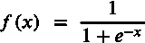

#### Softmax 函数

在最后几段中，我们发现 sigmoid 激活对二进制分类问题有效。有两个以上的类要分类的情况会怎样？如下图所示:

我们试图回答的问题是:颜色是蓝色、绿色还是红色？

在这种情况下，回答不是是/否，而是两者之一(绿色、蓝色或红色)

如何将响应从(蓝色、绿色和红色)转换成可能的颜色(绿色/红色/蓝色)？

在深度学习中，该模型将线性回归应用于每个输入，即输入特征的线性组合，并且表示为:

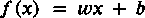

您可以查看线性回归的基础知识以获得更多理解。

假设线性回归函数根据类别/输入参数/特征给出以下分数:

蓝色= 2，绿色= 1，红色= -1

获得概率的最简单方法是:

上述转换将适用于正分数。如果有负分怎么办，记住，概率一定在 0-1 之间？比如红色班，分数为负；我们如何将分数转化为正值？

我们在所有分数上使用**指数**:

蓝色=

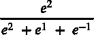

=0.705

绿色=

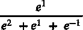

=0.259

红色=

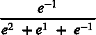

=0.035

指数将概率转换为 0-1 的范围

我们有 **n 个类，**我们要找出**个类的概率 x** 会，用线性得分 **A1，A2… An，**来计算每个类的概率。

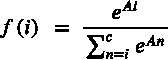

上面的函数是 **softmax 激活函数，**其中 **i** 是类名。

为了理解交叉熵，有必要讨论损失函数和激活函数，即将离散预测转化为连续预测。我们现在将深入交叉熵函数。

## 交叉熵

克劳德·香农在他 1948 年的论文《交流的数学理论》中引入了信息熵的概念。根据香农的说法，随机变量的**熵**是变量可能结果中固有的“信息”、“惊喜”或“不确定性”的平均水平。

听起来熟悉吗？

我们可以看到，随机变量的熵与我们引入的概念的误差函数有关。不确定度的平均水平指的是误差。

***交叉熵*** 建立在信息论熵的思想上，测量给定随机变量/事件集的两个概率分布之间的差异。

交叉熵可以应用于二分类和多分类问题。我们将讨论在每种情况下使用交叉熵的区别。

### 二元交叉熵

让我们考虑一下前面的例子，我们回答一个学生是否会通过 SAT 考试。在这种情况下，我们和四个学生一起工作。我们有两个模型，A 和 B，预测这四个学生通过考试的可能性，如下图所示。

**注。** *前面我们讨论过* *“在深度学习中，模型对每个输入应用线性回归，即输入特征的线性组合。*

每个模型将*线性回归函数(f(x) = wx + b)* 应用于每个学生，以生成线性分数。然后使用 *sigmoid 函数*将线性得分转换为概率。让我们假设这两个模型给出了图表的概率，其中蓝色区域表示通过，而红色区域表示失败。

模型 A

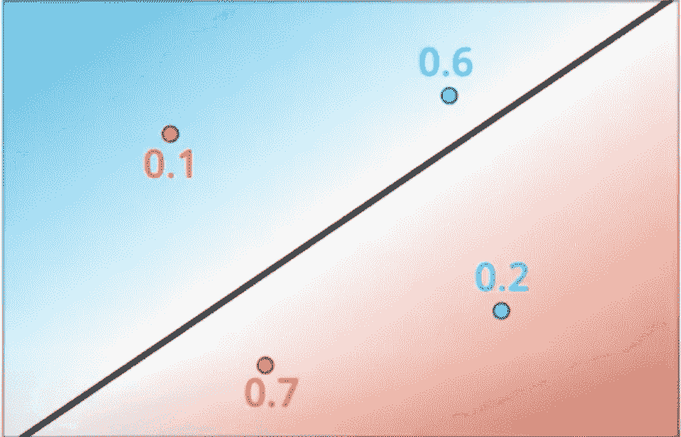

模型 B

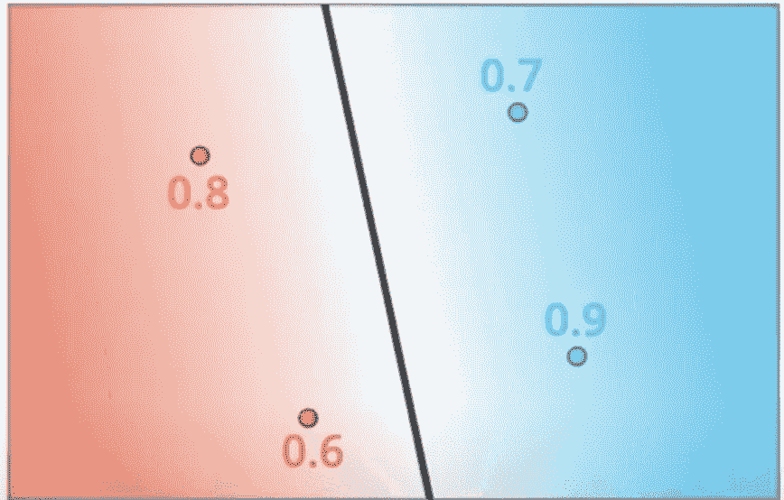

上图显示，模型 B 比模型 A 执行得更好，因为它正确地对各自区域的所有学生进行了分类。所有概率的乘积决定了模型的最大似然。

**乘积概率** : *同时发生的两个(或多个)独立事件的概率是通过乘以事件各自的概率来计算的。*

我们想通过乘以每个独立学生的概率来计算模型的总概率。

产品概率模型 A:

0.1 * 0.7 * 0.6 * 0.2   = 0.0084

产品概率模型 B:

0.8 * 0.6 * 0.7 * 0.9 =  0.3024

模型 B 的产品概率优于模型 a。

*产品概率*在我们有几个项目要预测时效果更好，但现实生活中的模型预测却不是这样。

例如，如果我们有一个满是 1000 名学生的班级，不管你的模型有多好，乘积概率总是接近于 0。如果我们也改变一个概率，产品会发生剧烈变化，给人一种模型表现良好的错误印象。因此，我们需要使用**对数函数将乘积转换为总和。**

测井模型 A:

对数(0.1) +对数(0.7) +对数(0.6) +对数(0.2)

-1  +  -0.154    +   -0.221     + -0.698   = -2.073

测井模型 B:

对数(0.8) +对数(0.6) +对数(0.7) +对数(0.9)

 -0.09 + -0.22 + -0.15  + -0.045 = -0.505

介于 0 和 1 之间的数的对数总是负数。以上是评价我们模型性能的更好方法吗？不完全是。相反，我们将采用预测概率的负对数。

负对数模型 A:

-对数(0.1)+-对数(0.7)+-对数(0.6)+-对数(0.2)

1  +  0.154    +   0.221     + 0.698 = 2.073

负对数模型 B:

-对数(0.8) +-对数(0.6)+-对数(0.7)+-对数(0.9)

 0.09 + 0.22 + 0.15  + 0.045 =  0.505

**交叉熵损失**是*每个学生预测概率的负对数之和。* *模型 A 的交叉熵损失为 2.073；B 型的是 0.505。交叉熵很好地衡量了每个模型的有效性。*

#### 二元交叉熵公式

在我们的四个学生预测中——模型 B:

| A | B | C | D | 可能性 |
| --- | --- | --- | --- | --- |
| P1=0.8(失败) | P2=0.6(失败) | P3=0.7(通过) | P4=0.9(通过) | 通过概率 |
| 1–P1 | 1–P2 | P3 | P4 | 如果学生通过 else 0，则 yi = 1，因此: |
| y1= 0 |
| y2 = 0 | y3 = 1 | y4 = 1 | 学生 C 的交叉熵: | 蓝色代表学生证。红色代表学生失败。 |

**学生 A 的交叉熵**

请注意，我们使用每个学生的预测概率来计算交叉熵。我们将纳入公式，包括概率是如何产生的。之前，我们讨论了二分类中使用的 sigmoid 激活函数，用于将线性函数得分转换为概率。这是使用激活的交叉熵函数:

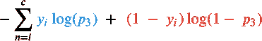

其中:

**S****[I]**–输入/权重

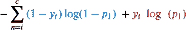

**f**–这种情况下的激活功能，

**t**–目标预测

*   **I—**要预测的类。
*   **BCE** =
*   多类交叉熵/分类交叉熵
*   对于多类分类问题，我们使用多类交叉熵。假设我们需要创建一个模型来预测水果的类型/种类。我们有三种不同容器的水果(橘子、苹果、柠檬)。

水果

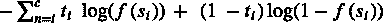

### 容器一
概率

容器 B
概率

| 容器 C
概率 | 橙色 | 0.7 | 0.3 |
| --- | --- | --- | --- |
| 0.1 | 苹果 | 0.2 | 0.4 |
| 0.5 | 柠檬 | 0.1 | 0.3 |
| 0.4 | 每个容器的概率总和需要为 1。 | 容器 A | 容器 B |

集装箱 C

正确的水果放在
各自的容器里

| 橙子 | 柠檬 | 柠檬 | 预测的概率
证明水果是正确的 |
| --- | --- | --- | --- |
| 0.7 | 0.3 | 0.4 | 产品概率= 0.7 * 0.3 * 0.4 = 0.084 |
| 交叉熵=-log(0.7)+–log(0.3)+-log(0.4)= 1.073 | 多类交叉熵公式 | 让我们将概率值指定为变量: | 水果 |

容器一
概率

容器 B
概率

容器 C
概率

#### 橙色

P1T2 一

| P1T2 B | P1T2【C3】 | 苹果 | p2T2 |
| --- | --- | --- | --- |
| p2T2 B | P2T2【C3】 | 柠檬 | P3T2 |
| P3T2 B | P3T2【C3】 | 容器 A 中的橙子、苹果或柠檬的概率是多少？我们分别有 *0.7、0.2 和 0.1* 。 | 如果容器 A 包含特定的水果，则其 y1 值等于 1；否则为 0。 |
| y1 [A，–]如果是橙子 | y2[A–]如果是苹果 | y3[A—]如果是柠檬。 | 容器 A 的交叉熵: |

容器 B 的交叉熵:

容器 C 的交叉熵:

设我们的类(1，2，3)等于 I，容器(A，B，C)等于 j。

*   交叉熵容器 A:
*   交叉熵容器 B:
*   交叉熵容器 C:

在总交叉熵损失中，我们的类由 I 定义；因此，我们可以将(y1，y2，y3)等同于 I:

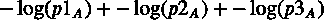

***总交叉熵*** :

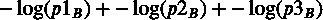

我们使用*总交叉熵*公式计算多类分类中的交叉熵。

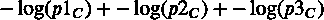

整合激活功能:

***多类交叉熵***

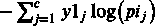

**CE=**

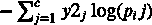

如何应用交叉熵？

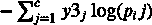

我们已经讨论了交叉熵损失用于二分类和多分类。让我们看看如何应用交叉熵的例子:

PyTorch

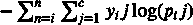

**1。使用 Pytorch** 简单说明二元交叉熵

请确保您安装了 PyTorch 遵循此处的指南[。](https://web.archive.org/web/20221206001915/https://pytorch.org/get-started/locally/)

使用 PyTorch [random](https://web.archive.org/web/20221206001915/https://pytorch.org/docs/stable/generated/torch.randn.html) 生成输入特征(X)和标签(y)值。

让我们来看看 X 的值:

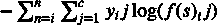

## Y 的值:

在我们的讨论中，我们使用 **sigmoid 函数**作为输入的激活函数。我们将把 PyTorch [sigmoid 模块](https://web.archive.org/web/20221206001915/https://pytorch.org/docs/stable/generated/torch.sigmoid.html)传递给我们的输入(X)特性。

### [Pytorch 二元交叉熵损失](https://web.archive.org/web/20221206001915/https://pytorch.org/docs/stable/generated/torch.nn.BCELoss.html):

**2。使用 Pytorch 的分类交叉熵**

PyTorch 分类[交叉熵](https://web.archive.org/web/20221206001915/https://pytorch.org/docs/stable/generated/torch.nn.CrossEntropyLoss.html)模块，softmax 激活函数已经应用于公式。因此，我们不会像在前面的例子中那样使用激活函数。

```py
import torch
import torch.nn as nn
```

我们仍然使用 PyTorch 随机数来生成输入要素(X)和标注(y)值。

```py
X = torch.randn(10)
y = torch.randint(2, (10,), dtype=torch.float)
```

由于这是一个多类问题，输入要素有五个类(class_0，class_1，class_2，class_3，class_4)

```py
print(X)
```

```py
tensor([ 0.0421, -0.6606,  0.6276,  1.2491, -1.1535, -1.4137,  0.8967, -1.1786,
        -1.3214,  0.2828])
```

多类交叉熵计算如下:

```py
print(y)
```

```py
tensor([1., 0., 0., 1., 0., 0., 1., 0., 0., 0.])
```

跨不同深度学习框架计算交叉熵是一样的；让我们看看如何在 TensorFlow 中实现同样的功能。

```py
X_continous_values = torch.sigmoid(X)
print(X_continous_values)

```

```py
tensor([0.5105, 0.3406, 0.6519, 0.7772, 0.2398, 0.1957, 0.7103, 0.2353, 0.2106,
        0.5702])
```

海王星与 [PyTorch](https://web.archive.org/web/20221206001915/https://docs.neptune.ai/essentials/integrations/deep-learning-frameworks/pytorch) 的融合

```py
loss = nn.BCELoss()(X_continous_values, y)
print(loss)

```

```py
tensor(1.0966)
```

TensorFlow

**1。二元交叉熵:**

假设我们的实际值和预测值如下:

使用 tensor flow[BinaryCrossentropy()](https://web.archive.org/web/20221206001915/https://www.tensorflow.org/api_docs/python/tf/keras/losses/BinaryCrossentropy)模块:

```py
X = torch.randn(10, 5)
print(X)

```

```py
tensor([[-0.5698, -0.0558, -0.2550,  1.6812,  0.0238],
        [-2.1786,  1.3923, -0.2363, -0.4601, -1.4949],
        [ 1.3679,  1.2853,  0.4087, -0.5743, -0.2752],
        [ 2.1995,  0.1469, -0.1661,  0.4617, -0.4395],
        [-0.5686, -0.7453, -0.1455, -0.5304,  0.3020],
        [-0.1489, -0.9143, -1.5282, -0.5023,  1.2751],
        [-1.3830, -0.6535,  0.5392, -2.2050, -1.4138],
        [-0.5592,  1.5028,  0.0442, -1.5487, -0.1522],
        [ 0.7436, -1.8956,  1.0145, -0.2974, -2.0576],
        [ 0.1003,  0.6604, -1.3535, -0.3053, -0.4034]])
```

```py
y = torch.randint(5, (10,))
print(y)
```

```py
tensor([3, 0, 1, 1, 2, 4, 0, 2, 1, 3])
```

**2。分类交叉熵**

```py
loss = nn.CrossEntropyLoss()(X, y)
print(loss)

```

```py
tensor(1.9732)
```

假设我们有三个类(猫、狗、熊)要预测。我们实际的形象/阶级是一只狗；因此，我们理论上有(0，1，0)。其中 1 表示实际图像，0 表示图像不是狗。我们的价值观将是:

假设模型预测图像有 5%可能是猫，85%是狗，10%是熊。那么我们的预测值将是:

### 使用 TensorFlow [分类交叉熵()](https://web.archive.org/web/20221206001915/https://www.tensorflow.org/api_docs/python/tf/keras/losses/CategoricalCrossentropy)模块，我们计算损失如下:

海王星与[张量流](https://web.archive.org/web/20221206001915/https://docs.neptune.ai/essentials/integrations/deep-learning-frameworks/tensorflow-keras)的融合

```py
import tensorflow as tf
```

结论

```py
actual_values = [0, 1, 0, 0, 0, 0]
predicted_values = [.5, .7, .2, .3, .5, .6]
```

本文涵盖了损失函数的核心概念，主要是交叉熵。我希望它能让你更好地理解交叉熵，以及它是如何用于二元和多类分类问题的，并且你能够在你的案例场景中应用它。

```py
binary_cross_entropy = tf.keras.losses.BinaryCrossentropy()
loss = binary_cross_entropy(actual_values, predicted_values)
print(loss.numpy)
```

```py
0.53984624
```

资源:

Let’s say we have three classes(cat, dog, bear) to predict. Our actual image/class is a dog; therefore, we have theoretically (0, 1, 0). Where 1 represents the actual image and 0, where the image is not a dog. Our values will be:

```py
actual_values = [0, 1, 0]
```

Hypothetically the model predicts that the image is 5% likely to be a cat, 85% a dog, and 10% a bear. Then our predicted values will be:

```py
predicted_values = [0.05, 0.85, 0.10]
```

Using the TensorFlow [Categorical Cross Entropy()](https://web.archive.org/web/20221206001915/https://www.tensorflow.org/api_docs/python/tf/keras/losses/CategoricalCrossentropy) module, we calculate loss as follows:

```py
loss = tf.keras.losses.CategoricalCrossentropy()
loss = loss(actual_values, predicted_values)
print(loss.numpy)

```

```py
0.1625189
```

Neptune’s integration with [TensorFlow](https://web.archive.org/web/20221206001915/https://docs.neptune.ai/essentials/integrations/deep-learning-frameworks/tensorflow-keras)

## Conclusion

This article covers the core concepts of Loss functions, mainly the Cross-Entropy. I hope it gives you a better understanding of cross-entropy and how it’s used for both binary and multi-class classification problems and that you are in a position to apply it in your case scenario.

### Resources: