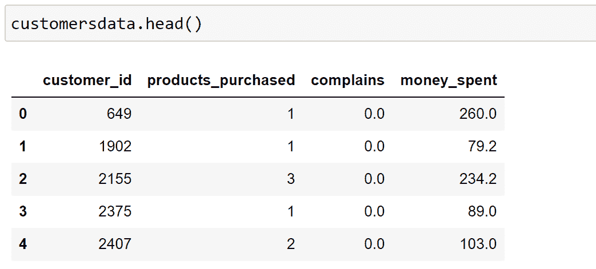
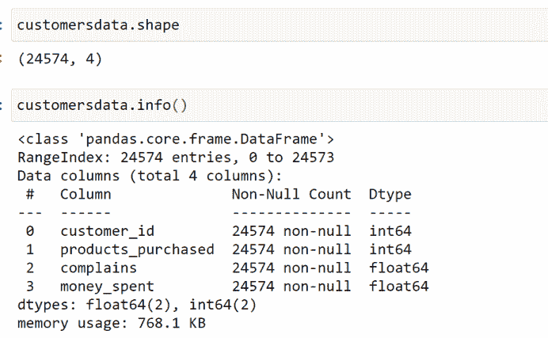
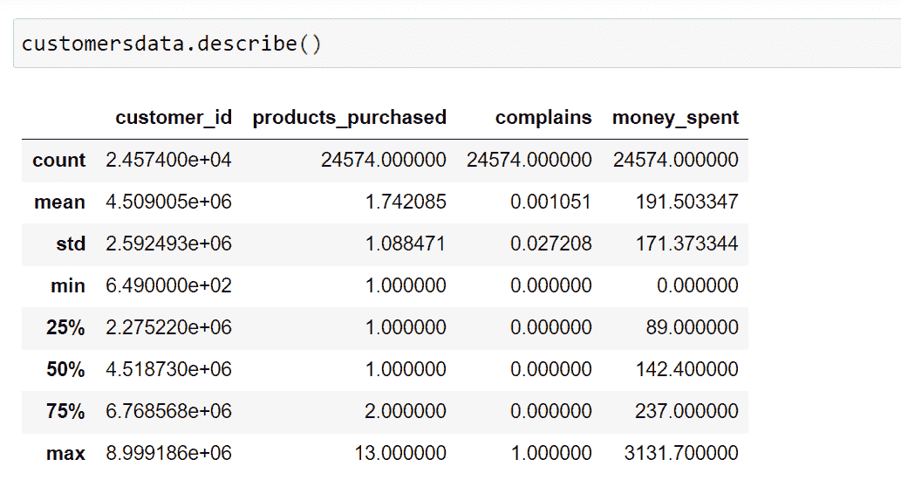
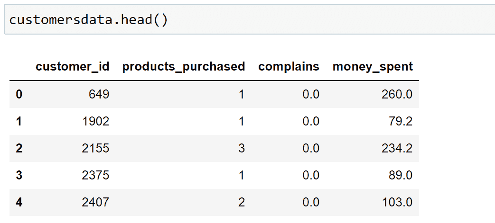

# 使用机器学习实现客户细分[初学者指南]

> 原文：<https://web.archive.org/web/https://neptune.ai/blog/customer-segmentation-using-machine-learning>

如今，你可以个性化一切。没有一刀切的方法。但是，对于企业来说，这其实是一件很棒的事情。它为良性竞争创造了大量空间，也为企业创造了获得和留住客户的创造性机会。

实现更好的个性化的一个基本步骤是客户细分。这是个性化开始的地方，适当的细分将帮助你做出关于新功能、新产品、定价、营销策略，甚至是应用内推荐的决定。

但是，手动进行分段可能会很累人。为什么不使用机器学习来为我们做这件事呢？在本文中，我将告诉你如何做到这一点。

## 什么是客户细分

[客户细分](https://web.archive.org/web/20221206005800/https://www.optimove.com/resources/learning-center/customer-segmentation)简单来说就是根据各种特征对您的客户进行分组(例如根据年龄对客户进行分组)。

这是组织了解客户的一种方式。了解客户群体之间的差异，就更容易做出关于产品增长和营销的战略决策。

细分市场的机会是无限的，这主要取决于你有多少客户数据可供使用。从基本标准开始，如性别、爱好或年龄，一直到“在网站 X 上花费的时间”或“自用户打开我们的应用程序以来的时间”。

客户细分有不同的方法，它们取决于四种类型的参数:

*   地理，
*   人口统计学，
*   行为上的，
*   心理上。

**地理**客户细分非常简单，都是关于用户的位置。这可以通过多种方式实现。您可以按国家、州、城市或邮政编码分组。

**人口统计**细分与客户的结构、规模和在空间和时间上的移动有关。许多公司利用性别差异来创造和营销产品。父母身份是另一个重要特征。你可以从客户调查中获得这样的数据。

**行为**客户细分基于过去观察到的客户行为，可用于预测未来行动。比如顾客购买的品牌，或者购买最多的瞬间。客户细分的行为方面不仅试图了解购买的原因，还试图了解这些原因在一年中是如何变化的。

顾客的心理细分通常涉及性格特征、态度或信仰。这些数据是通过客户调查获得的，可以用来衡量客户情绪。

## 客户细分的优势

实施客户细分会带来大量新的商机。您可以在以下方面进行大量优化:

*   预算，
*   产品设计，
*   推广，
*   营销，
*   客户满意度。

让我们更深入地讨论这些好处。

没有人喜欢投资那些不能产生新客户的活动。大多数公司都没有庞大的营销预算，所以钱必须花在正确的地方。细分使您能够首先锁定具有最高潜在价值的客户，因此您可以从营销预算中获得最大收益。

客户细分有助于你了解你的用户需要什么。您可以识别最活跃的用户/客户，并根据他们的需求优化您的应用/产品。

正确实施的客户细分有助于您规划特别优惠和交易。在过去的几年里，频繁的交易已经成为电子商务和商业软件的主要内容。如果你在正确的时间给客户提供了正确的报价，他们就有很大的机会购买。客户细分将帮助您完美定制您的特别优惠。

通过细分可以直接改善营销策略，因为您可以利用客户最常用的渠道为不同的客户群规划个性化的营销活动。

通过研究不同的客户群体，你可以了解他们最看重你公司的什么。这些信息将帮助您创建完全符合客户偏好的个性化产品和服务。

在下一部分，我们将讨论机器学习为什么用于客户细分。

## 面向客户细分的机器学习

机器学习方法是分析客户数据和发现洞察力和模式的伟大工具。人工智能模型是决策者的有力工具。他们可以精确地识别客户群，这是手工或传统分析方法难以做到的。

机器学习算法有很多种，每一种都适合特定类型的问题。适用于客户细分问题的一种非常常见的**机器学习算法是 k 均值聚类算法**。还有其他聚类算法，如 DBSCAN、凝聚聚类和 BIRCH 等。

为什么要为客户细分实现机器学习？

### 更多的时间

手动客户细分非常耗时。手动分析成堆的数据并找到模式需要几个月甚至几年的时间。此外，如果启发式地完成，它可能没有预期的有用的准确性。

客户细分过去是手动完成的，并且不太精确。您需要手动创建和填充不同的数据表，并像侦探戴着镜子一样分析数据。现在，仅仅使用机器学习要好得多(并且由于 ML 的快速发展而相对容易)，这可以腾出你的时间来专注于需要创造力来解决的更高要求的问题。

### 易于再培训

客户细分不是一个“开发一次，永远使用”的项目。数据是不断变化的，趋势是振荡的，在您的模型部署后，一切都在不断变化。通常，更多的标记数据在开发后变得可用，这对于提高模型的整体性能是一个很好的资源。

有许多方法可以更新客户细分模型，但这里有两种主要方法:

*   以旧模式为起点，重新训练。
*   保留现有模型，并将其输出与新模型相结合。

### 更好的缩放

由于云基础设施，在生产中部署的机器学习模型支持可扩展性。这些模型对于未来的变化和反馈非常灵活。例如，假设一家公司今天有 10000 名客户，他们实施了一个客户细分模型。一年后，如果公司有 100 万客户，那么理想情况下，我们不需要创建一个单独的项目来处理这些增加的数据。机器学习模型具有处理更多数据和生产规模的内在能力。

### 更高的精度

对于给定的客户数据，使用机器学习方法(如 elbow 方法)很容易找到最佳聚类数的值。当我们使用机器学习时，不仅最优的聚类数，而且模型的性能也要好得多。

## 探索客户数据集及其特征

让我们分析一个客户数据集。我们的数据集有 24，000 个数据点和四个特征。其特点是:

*   客户 ID–这是特定企业的客户 ID。
*   购买的产品–该功能表示客户一年中购买的产品数量。
*   投诉–该列值表示客户去年提出的投诉数量
*   支出金额–该列值表示客户去年支付的金额。



在接下来的部分，我们将预处理这个数据集。

## 预处理数据集

在将数据输入 k-means 聚类算法之前，我们需要预处理数据集。让我们为客户数据集实现必要的预处理。



接下来，我们将用 Python 实现 k-means 聚类算法。

## 在 Python 中实现 K-means 聚类

K-Means 聚类是解决数据聚类问题的一种有效的机器学习算法。这是一种非监督算法，非常适合解决客户细分问题。在我们继续之前，让我们快速探索两个关键概念

### 无监督学习

无监督机器学习与有监督机器学习截然不同。这是一种特殊的机器学习算法，可以从未标记的数据中发现数据集中的模式。

无监督的机器学习算法可以根据数据集中的相似属性对数据点进行分组。无监督模型的主要类型之一是聚类模型。

注意，监督学习帮助我们从先前的经验中产生一个输出。

### 聚类算法

聚类机器学习算法是一种无监督的机器学习算法。它用于发现数据集中的自然分组或模式。值得注意的是，聚类算法只是解释输入数据，并在其中找到自然的聚类。

一些最流行的聚类算法有:

*   k 均值聚类
*   凝聚层次聚类
*   期望最大化聚类
*   基于密度的空间聚类
*   均值漂移聚类

在下一节中，我们将使用 k-means 聚类算法和机器学习来分析客户细分问题。但是，在此之前，让我们快速讨论一下为什么使用 k-means 聚类算法。

### 为什么使用 K-means 聚类进行客户细分？

与监督学习算法不同，K-means 聚类是一种[非监督机器学习](https://web.archive.org/web/20221206005800/https://blogs.oracle.com/ai-and-datascience/post/supervised-vs-unsupervised-machine-learning)算法。当我们有未标记的数据时，使用这种算法。未标记数据是指没有提供类别或组的输入数据。我们的客户细分数据对于这个问题是这样的。

该算法发现数据中的组(聚类),其中聚类的数量由 K 值表示。根据所提供的特征，该算法迭代地将每个输入数据分配给 K 个聚类之一。所有这些使得 k-means 非常适合客户细分问题。

给定一组数据点，根据特征相似性进行分组。K 均值聚类算法的输出是:

*   K 个簇的质心值，
*   每个输入数据点的标签。

在实施结束时，我们将获得输出，例如一组群集以及哪个客户属于哪个群集。

首先，我们需要实现所需的 Python 库，如下表所示。

```py

import pandas as pd
import numpy as np
from sklearn.cluster import KMeans
import plotly.express as px
import plotly.graph_objects as go
import matplotlib.pyplot as plt

```

我们已经导入了 pandas、NumPy sklearn、plotly 和 matplotlib 库。Pandas 和 NumPy 用于数据争论和操作，sklearn 用于建模，plotly 和 matplotlib 将用于绘制图形和图像。

导入库之后，我们的下一步是加载 pandas 数据框中的数据。为此，我们将使用熊猫的 read_csv 方法。

```py
customersdata = pd.read_csv("customers-data.csv")

```



加载数据后，我们需要定义 K 均值模型。这是在我们从 sklearn 导入的 KMeans 类的帮助下完成的，如下面的代码所示。

```py
kmeans_model = KMeans(init='k-means++',  max_iter=400, random_state=42)

```

定义模型后，我们要使用训练数据集进行训练。这是通过使用 fit 方法实现的，如下面的代码所示。

```py
kmeans_model.fit(customersdata[['products_purchased','complains',
'money_spent']])

```

注意，我们将三个特性传递给 fit 方法，即 products_purchased、complains 和 money _ spent。

尽管我们已经训练了一个 K-means 模型达到这些点，但我们还没有找到在这种客户细分情况下所需的最佳聚类数。对于给定的数据集，找到最佳的聚类数目对于产生高性能的 k-means 聚类模型是重要的。

在接下来的部分中，我们将找到给定数据集的最佳聚类数，然后使用这些最佳 k 值重新训练 k-means 聚类模型。这将生成我们的最终模型。

## 寻找最佳的聚类数

实现 k-means 聚类算法的关键任务之一是找到最佳的聚类数。值得注意的是，K 均值聚类模型可能会收敛于任何 K 值，但同时，并不是所有的 K 值都会产生最佳模型。

对于某些数据集，数据可视化有助于了解最佳聚类数，但这并不适用于所有数据集。我们有一些方法，如肘方法、间隙统计法和平均轮廓法，来评估给定数据集的最佳聚类数。我们将逐一讨论它们。

*   **肘方法**使用总的组内平方和值来寻找最佳组数的值。这代表了所生成的集群彼此之间的分散程度。在这种情况下，K-means 算法针对 K 的几个值进行评估，并针对 K 的每个值计算类内平方和。之后，我们绘制 K 与平方和的关系图。在分析该图之后，选择聚类的数量，以便添加新的聚类不会显著改变平方和的值。
*   **平均轮廓法**是一种衡量每个数据点与其对应聚类拟合程度的方法。该方法评估聚类的质量。作为一般规则，高平均轮廓宽度表示更好的聚类输出。
*   **缺口统计方法**是对缺口统计值的衡量。间隙统计是不同 k 值的总簇内变化与其预期值之间的差异。该计算使用数据点的零参考分布来完成。最佳聚类数是使间隙统计值最大化的值。

我们将使用肘法。K-means 聚类算法通过将给定的数据点分成 K 组等方差来对数据进行聚类。这有效地最小化了一个叫做惯性的参数。在这种情况下，惯性只不过是群内距离的平方和。

当我们使用肘方法时，我们从 2 开始逐渐增加簇的数量，直到达到添加更多簇不会导致惯性值显著下降的簇的数量。

达到这个分类数的阶段称为分类模型的肘部。我们会看到在我们的例子中 K =5。

为了实现肘方法，首先创建名为“try_different_clusters”的函数。它接受两个值作为输入:

*   k(簇的数量)，
*   数据(输入数据)。

```py
def try_different_clusters(K, data):

    cluster_values = list(range(1, K+1))
    inertias=[]

    for c in cluster_values:
        model = KMeans(n_clusters = c,init='k-means++',max_iter=400,random_state=42)
        model.fit(data)
        inertias.append(model.inertia_)

    return inertias

```

下面的代码调用了 try_different_clusters 方法，其中我们将 K 的值从 1 传递到 12，并计算 K 的每个值的惯性。

```py
outputs = try_different_clusters(12, customersdata[['products_purchased','complains','money_spent']])
distances = pd.DataFrame({"clusters": list(range(1, 13)),"sum of squared distances": outputs})

```

使用下面的代码，我们绘制了 K 值(在 x 轴上)相对于 Y 轴上相应的惯性值。

```py
figure = go.Figure()
figure.add_trace(go.Scatter(x=distances["clusters"], y=distances["sum of squared distances"]))

figure.update_layout(xaxis = dict(tick0 = 1,dtick = 1,tickmode = 'linear'),
                  xaxis_title="Number of clusters",
                  yaxis_title="Sum of squared distances",
                  title_text="Finding optimal number of clusters using elbow method")
figure.show()

```

我们可以使用上面的代码生成下图。代码的拐点在 K=5 处。我们已经选择了 5，如果我们将集群的数量增加到 5 个以上，那么惯性或平方距离的和会有非常小的变化。

**K = 5 的最佳值**

聚类数达到最佳值的阶段称为聚类模型的拐点。例如，在下图中，肘部位于五个簇处(K =5)。添加 5 个以上的集群将导致创建效率低下或性能较差的集群模型。

如前所述，我们需要使用找到的最佳聚类数再次训练 k-means 聚类模型。

```py
kmeans_model_new = KMeans(n_clusters = 5,init='k-means++',max_iter=400,random_state=42)

kmeans_model_new.fit_predict(customersdata[['products_purchased','complains','money_spent']])

```

请注意，我们使用 fit_predict 方法来训练模型。

在下一节中，我们将讨论如何在三维空间中可视化客户细分群。

## 可视化客户群

在本节中，我们将使用 plotly express 实现一些代码。通过这种方式，我们可以用 k-means 算法在三维空间中可视化聚类。Plotly express 是一个基于 Plotly 的库，可处理多种类型的数据集并生成高度风格化的绘图。

首先，让我们向现有的客户数据集中添加一个名为“clusters”的新列。该列将能够表明哪个客户属于哪个集群。

```py
cluster_centers = kmeans_model_new.cluster_centers_
data = np.expm1(cluster_centers)
points = np.append(data, cluster_centers, axis=1)
points

```

注意，我们在这里使用 NumPy expm1 方法。NumPy expm1 函数为 NumPy 数组中的每个元素返回负一的指数值作为输出。因此，np.expm1 方法接受 arr_name 和 out 参数，然后将数组作为输出返回。

```py
points = np.append(points, [[0], [1], [2], [3], [4]], axis=1)
customersdata["clusters"] = kmeans_model_new.labels_

```

添加名为 clusters 的新列后，客户数据数据集将如下所示。


最后，我们将使用下面的代码来可视化所创建的五个集群。这是使用 plotly 和 express 库完成的。

Plotly 是一个 Python 库，用于绘图、统计、绘图和分析。这可以与 Python、R、Julia 和其他编程语言一起使用。Plotly 是一个免费的开源库。

想要组织你的实验过程吗？检查如何[将交互式 Plotly 图表存储在与模型元数据](https://web.archive.org/web/20221206005800/https://docs.neptune.ai/integrations-and-supported-tools/model-visualization-and-debugging/plotly)(指标、参数、权重等)相同的位置。

Plotly Express 是 Plotly 上的一个高级接口，可用于多种类型的数据集并生成高度风格化的图。

plotly.express 类具有可以一次性生成完整数字的函数。一般来说，它被称为 px。值得注意的是 plotly express 是 plotly 库的内置模块。这是创建推荐的最常见地块的起点。注意，每个 plotly express 函数在内部创建[图形对象](https://web.archive.org/web/20221206005800/https://plotly.com/python/graph-objects/)，并返回 plotly.graph_objects。

使用 plotly express 通过单一方法调用创建的图形也可以仅使用图形对象创建。然而，在这种情况下，它需要大约 5 到 100 倍的代码。

与 [2D 散点图](https://web.archive.org/web/20221206005800/https://plotly.com/python/line-and-scatter/)一样，px.scatter 在二维空间中绘制单个数据，而 3D 方法 px.scatter_3d 在三维空间中绘制单个数据。

```py
figure = px.scatter_3d(customersdata,
                    color='clusters',
                    x="products_purchased",
                    y="complains",
                    z="money_spent",
                    category_orders = {"clusters": ["0", "1", "2", "3", "4"]}
                    )
figure.update_layout()
figure.show()

```

数据点聚类的可视化非常重要。图表的不同边缘提供了复杂输入数据集的快速视图。

## 结论

用相同的产品型号、电子邮件、短信活动或广告来服务所有客户是不明智的。客户有不同的需求。一刀切的商业模式通常会导致更少的参与，更低的点击率，最终更少的销售。客户细分是解决这个问题的方法。

找到最佳数量的独特客户群将有助于您了解您的客户有何不同，并帮助您准确满足他们的需求。客户细分改善了客户体验，增加了公司收入。这就是为什么如果你想超越你的竞争对手，获得更多的客户，细分是必须的。用机器学习来做肯定是正确的方向。

如果你做到了这一步，感谢你的阅读！