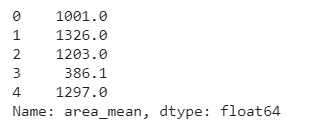
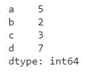
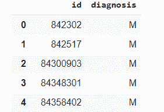
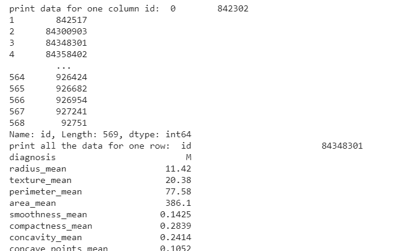
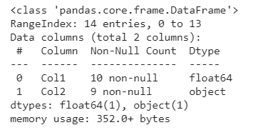

# 数据探索和可视化的顶级工具及其优缺点

> 原文：<https://web.archive.org/web/https://neptune.ai/blog/data-exploration-and-visualization-best-tools>

当你在从事数据科学项目或试图找到数据洞察力来制定计划时，有两个关键步骤是不可避免的——数据探索和[数据可视化](https://web.archive.org/web/20221206032016/https://visme.co/blog/best-data-visualizations/)。

**数据探索**是 EDA 的组成部分([探索性数据分析](https://web.archive.org/web/20221206032016/https://towardsdatascience.com/exploratory-data-analysis-8fc1cb20fd15))。无论你在后面的阶段决定做什么(创建/选择机器学习模型或总结你的发现)，都将取决于你在探索阶段做出的假设。这不是一个单一的步骤阶段，但我们在数据探索过程中可以确定很多关于我们的数据，例如检查数据分布、查找相关性、查找异常值和缺失值等。

**数据可视化**不是数据分析项目中任何特定阶段的一部分。在我们的项目中，我们可以在任何一点用视觉来表现数据。数据可视化只不过是表格或图形与数据(输入或输出)之间的映射。数据可视化有两种形式——表格和图形。

我们需要可视化作为数据的可视化总结，因为它更容易理解以识别关系和模式。在数据探索阶段使用了许多可视化工具来发现异常值、特征之间的相关性等。我们还使用图表和图形来检查模型的性能，或者对数据进行分类或聚类。

选择正确的图表来传达您的数据发现也很重要。使用折线图代替散点图可能没有意义。我们在日常工作中会用到或看到一些基本且广泛使用的图表——在数据科学和其他领域:

1.  折线图
2.  条形图
3.  柱状图
4.  箱形图
5.  散点图
6.  热图

在试图做出准确假设的同时，我们需要最好的工具来探索和可视化数据。市场上有几种可用的工具和库。记住所有的库几乎是不可能的，决定使用哪一个库可能会令人困惑。这篇文章的目的是:

*   总结一些最好的数据探索和可视化工具——[Matplotlib](#matplotlib)， [scikit learn](#sklearn) ， [plotly](#plotly) ， [seaborn](#seaborn) ， [pandas](#pandas) ， [D3](#d3) ， [bokeh](#bokeh) ， [altair](#altair) ， [yellowbrick](#yellowbrick) ，[leaf](#folium)， [tableau](#tableau) 。
*   通过一些例子熟悉这些工具
*   理解对可视化工具的需求
*   了解这些工具之间的区别以及如何选择

引入 Matplotlib 是为了模仿 MATLAB 支持的所有图形，但形式更简单。多年来，图书馆增加了多种功能。不仅如此，许多可视化库和工具都建立在 Matplotlib 之上，具有新的、交互式的和吸引人的视觉效果。

要了解有关 Matplotlib 的更多信息，让我们使用数据集来解锁并了解一些函数的工作原理:

```py

import pandas as pd
netflix_df = pd.read_csv('netflix_titles.csv')
netflix_df.head(2)

```

我们有内容类型、标题、添加日期和其他信息。但是我们想用这些信息做什么呢？我们可以找到网飞有多少节目和电影(根据数据集)，或者我们可以看到哪个国家制作了更多的内容。

```py
import matplotlib.pyplot as plt

counts = netflix_df["type"].value_counts()
plt.bar(counts.index, counts.values)
plt.show()

```

在上面的代码中，你可以看到我们已经将 matplot 的 **pyplot** 作为 plt 导入。每个 pyplot 函数对图形进行一些更改——创建图形、创建绘图区域、绘制一些线、在图中引入标签等。然后，我们使用 pyplot 作为 plt 来调用条形图，并将数据可视化。

这里需要记住的一点是，每次创建新的绘图时，我们都必须使用 plt.show()命令。如果想避免这种重复的任务，可以在导入 matplotlib 后使用下面的命令。

```py
%matplotlib inline
```

除了创建简单的条形图之外，您还可以做很多事情。您可以提供 x 和 y 标签，或者您可以根据它们的值给条形赋予不同的颜色。您可以选择更改标记、线型和宽度，添加或更改文本、图例和注释，更改地块的限制和布局，等等。

我们也可以使用 Matplotlib 来发现数据中的异常。让我们尝试创建一个定制的情节。

```py
import pandas as pd
from sklearn.datasets import load_boston
import matplotlib.pyplot as plt

boston = load_boston()
x = boston.data
y = boston.target
columns = boston.feature_names

boston_df = pd.DataFrame(boston.data)
boston_df.columns = columns

fig = plt.figure(figsize =(10, 7))

ax = fig.add_axes([0, 0, 1, 1])
ax.set_xlabel('Distance')

bp = ax.boxplot(boston_df['DIS'])
plt.title("Customized box plot")

plt.show()

```

因为这个包提供了灵活性，所以当你开始使用它时，选择甚至记住一些东西可能会有点棘手。幸运的是，[文档](https://web.archive.org/web/20221206032016/https://matplotlib.org/gallery.html)包含现实生活中的例子，每个情节的相关细节，以及我们需要的所有其他信息。不要感到不知所措，只要记住一个问题可以有不止一个解决方案。

现在我们对 Matplotlib 有了一些了解，让我们讨论一下它的优点和缺点，以及哪些工具可以与它集成。

#### 优势

*   快速高效，基于 NumPy 和 SciPy 构建。
*   让你完全控制你的图表和情节，你可以做一些改变，使你的视觉效果更容易理解。
*   大型社区和跨平台支持，它是一个开源库。
*   几个高质量的绘图和图表。

#### 不足之处

*   没有互动剧情，只有静态剧情。
*   制作定制图时，需要大量重复的代码。
*   您可以完全控制每一步的图形，因此您必须定义一个 matplotlib 函数，这可能很耗时。

#### Matplotlib 集成

很多流行的 Python 可视化库都是基于 Matplotlib 构建的。例如，seaborn 使用 matplotlib 来显示图形创建后的绘图。不仅仅是这样，很多工具也集成了[Matplotlib——**Neptune . ai**就是其中之一。](https://web.archive.org/web/20221206032016/https://docs.neptune.ai/integrations-and-supported-tools/model-visualization-and-debugging/matplotlib)

#### 成就

第一张黑洞图像是用 NumPy 和 Matplotlib 制作的。它也用于体育数据分析。

Scikit learn 是由 David Cournapeau 在 Google Summer code 项目中开发的。后来，在 2010 年，FIRCA 把它带到了另一个水平，并发布了该库的测试版。Scikit learn 已经走过了漫长的道路，现在它是最有用的健壮库。它是在 NumPy、SciPy 和 Matplotlib 之上用 Python 构建的。

它并不专注于任何数据科学项目的一个方面，而是提供了大量用于数据清理、管理、建模等的有效工具。

它拥有以下工具:

1.  分类
2.  回归
3.  使聚集
4.  降维
5.  型号选择
6.  预处理

数据探索和可视化适合哪里？Scikit Learn 提供了一系列工具来满足探索性数据分析的要求——发现问题并通过转换原始数据来恢复问题。

如果您正在寻找数据集进行实验，Scikit learn 有一个数据集模块，其中有一些流行的数据集集合。您可以像下面这样加载数据集，并且您不必将它下载到本地机器上。

```py
 from sklearn.datasets import load_iris
 data = load_iris()

```

Scikit learn 在进行预处理(即清洁和处理。假设您的数据集中几乎没有缺失值。有两种处理方法:

1.  删除所有缺少值的行/列，
2.  输入一些值。

删除行/列并不总是一个好的选择，所以我们估算值——零、平均值等。

让我们看看如何使用 scikit 的 impute 模块来实现这一点。

```py
import numpy as np
import pandas as pd
X = pd.DataFrame(
    np.array([1,2,3, np.NaN, np.NaN, np.NaN, -7,
              0,50,111,1,-1, np.NaN, 0, np.NaN]).reshape((10,3)))
X.columns = ['feature1', 'feature2', 'feature3']

from sklearn.impute import SimpleImputer
imp_mean = SimpleImputer(missing_values=np.nan, strategy='mean')
imp_mean.fit_transform(df)

```

上面，我们使用了一个简单的估算器模块来创建一个估算器，用平均值替换空值。Scikit learn 是唯一一款拥有几乎所有功能/模块的工具。没有其他工具像 Scikit learn 一样提供简单的输入模块。

当涉及到特性缩放或归一化分布时，Scikit learn 在预处理模块中有可用的函数:StandardScalar、MinMaxScalar 等。它也有功能工程模块。Scikit 只处理数字数据，所以您需要将分类变量转换成数字来浏览数据。

scikit learn 在数据探索方面处于领先地位，但在数据可视化方面用处很小。可视化模块仅用于可视化指标，如混淆指标、权衡曲线、roc 曲线或召回精度曲线。在下一个例子中，我们将看到如何使用可视化功能。

```py
from sklearn import datasets
from sklearn.model_selection import train_test_split
iris = datasets.load_iris()
X = iris.data
y = iris.target
class_names = iris.target_names

X_train,X_test,y_train,y_test=train_test_split(
        X,y,test_size=0.25, random_state=0)

from sklearn.linear_model import LogisticRegression
from sklearn.metrics import plot_confusion_matrix

lr=LogisticRegression(C=1,random_state=0)
lr.fit(X_train,y_train)

plot_confusion_matrix(lr, X_test, y_test,display_labels=class_names,
                                 cmap=plt.cm.Blues)
plt.show()

```

尽管 Scikit 有一些可视化模块，但它仍然不支持任何回归问题的可视化。但是，毫无疑问，它是最有效、最容易适应的数据挖掘工具。

#### 优势

*   开源。
*   强大的社区支持。
*   随时可用的高效和最佳性能的数据探索实用程序。
*   Scikit learn APIs 可用于将其工具集成到不同的平台中。
*   提供可用于自动化机器学习工作流的管道实用程序。
*   易于使用，它是一个完整的包，依赖于少量的库。

#### 不足之处

*   Scikit learn 只处理数字数据，必须对分类数据进行编码。
*   它的灵活性很低，而使用任何函数时，除了所提供的参数之外，你不能改变任何东西。

之前的两个工具没有任何交互式可视化。这些工具大部分都是用 Python 构建的，在视觉效果方面灵活性有限。

Plotly 开发在线数据分析和可视化工具。它为 Python、R 和 MATLAB 等不同平台和框架提供了图形和分析工具。它有一个数据可视化库 plotly.js，这是一个用于创建图表的开源 js 库。为了让 Python 使用它的实用程序，plotly.py 构建在它的基础上。

它支持 40 多种独特的图表类型，涵盖统计、金融、地理、科学和 3D 用例。它使用 D3.js，HTML 和 CSS，这有助于集成许多交互式功能，如放大和缩小，或鼠标悬停。

让我们看看如何使用 plotly 在情节中引入交互性。

```py
pip install plotly==4.14.3

from sklearn import datasets
import pandas as pd

iris = datasets.load_iris()
iris_df = pd.DataFrame(iris.data)
iris_df.columns  = ['Sepal.Length','Sepal.Width','Petal.Length','Petal.Width']

import plotly.graph_objs as go
data = [go.Histogram(x=iris.data[:,0])]
layout = go.Layout( title='Iris Dataset - Sepal.Length', xaxis=dict(title='Sepal.Length'), yaxis=dict(title='Count') )
fig = go.Figure(data=data, layout=layout)
fig
```

你可以在上面看到，plotly 的 plot 可以让你保存图像，放大和缩小，自动缩放等等。您还可以看到，在鼠标悬停后，我们可以看到 x 轴和 y 轴的值。

让我们使用 plotly 绘制更多的图表，以了解它如何帮助最终用户。

为了理解变量之间的关系，我们需要一个散点图，但当我们有许多数据点时，很难读懂这个图。鼠标悬停功能有助于轻松读取数据。

```py
data = [go.Scatter(x = iris_df["Sepal.Length"],y = iris_df["Sepal.Width"],mode = 'markers')]
layout = go.Layout(title='Iris Dataset - Sepal.Length vs Sepal.Width', xaxis=dict(title='Sepal.Length'), yaxis=dict(title='Sepal.Width'))
fig = go.Figure(data=data, layout=layout)
fig
```

如果你希望你的图表具有交互性、吸引力和可读性，plotly 就是你的答案。

#### 优势

*   你可以在 JavaScript 不知道的情况下用它构建交互式的情节。
*   Plotly 允许你公开分享情节，甚至不需要分享你的代码。
*   简单的语法，几乎所有的图都使用相同的参数序列。
*   你不需要任何技术知识来使用 plotly，你可以使用图形用户界面来创建视觉效果。
*   为 3D 绘图提供多种交互式工具。

#### 不足之处

*   当我们试图创建复杂的地块时，布局定义变得复杂。
*   与其他工具不同，它根据工具限制每天的 API 调用。
*   公共图表的可用性可能是一个好处，但对其他人来说可能是一个问题。

Matplotlib 是很多工具的基础，Seaborn 就是其中之一。在 Seaborn，您可以用最少的努力创建有吸引力的图表。它为常见的统计图提供了高级功能，以使其信息丰富且具有吸引力。

它与 pandas 紧密集成，并接受 pandas 数据结构格式的输入。Seaborn 没有重新实现任何情节，但调整了 Matplotlib 的功能，使我们可以通过提供最少的参数来使用这些情节。

Seaborn 从 Matplotlib 收集了一些常见的图，并对它们进行了分类:关系图(replot)、分布图(displot)和分类图(catplot)。

1.  回复图–散点图、线图
2.  disp plot-hist plot、kdeplot、ecdfplot、rugplot
3.  catplot 卡通、全彩、方块式出图、violinplot 出图、pointplot、barplot

如果我们可以直接使用它们，为什么还要对情节进行分类呢？转折来了！Seaborn 允许您直接使用分类绘图，这被称为轴级绘图。这些图与 histplot()、lineplot()一样，都是独立的图，是 Matplotlib 的直接替代，尽管它们允许自动添加轴标签和图例等一些更改。当你想一起使用两个图，或玩更多，使定制的图，你需要使用图类别:图级绘图。

让我们尝试一些情节，看看 seaborn 是多么容易。

```py
import pandas as pd
breast_cancer_df = pd.read_csv("data.csv")

plt.figure(figsize= (10,10), dpi=100)
sns.heatmap(breast_cancer_df.corr())
```

只需两行就能创建热图！现在我们将尝试一些我们已经用其他工具尝试过的图。

```py
plt.figure(figsize=(8,5))
ax = sns.countplot(x="diagnosis", data=breast_cancer_df)
plt.show()
```

我们只是创建了一个计数图，没有计算任何东西，与 Matplotlib 非常不同。

图书馆不仅仅限于上述地块。它还具有 joinplot、subplot 或 regplot 函数，可以帮助用最少的代码创建定制的和统计的图。

#### 优势

*   您可以轻松定制情节。
*   默认方法比 Matplotlib 更具视觉吸引力。
*   有一些 Matplotlib 没有的内置情节:facet 和 regression。对于回归，用一个函数你可以创建回归线，置信区间和散点图。
*   与 matplotlib 相比，Seaborn 可以很好地处理 pandas 数据结构。

#### 不足之处

*   没有互动情节。
*   Seaborn 易于可视化，并且更容易从多个图表中获得洞察力。
*   自动创建多个图形，这有时会导致 OOM(内存不足)问题。

Python 中最流行的用于数据分析和操作的库之一。它最初是作为一种对财务数据进行定量分析的工具。正因为如此，它在时序用例中非常流行。

大多数数据科学家或分析师处理表格格式的数据，如。csv，。xlsx 等。Pandas 提供了类似 SQL 的命令，使得加载、处理和分析数据变得更加容易。它支持两种类型的数据结构:序列和数据帧。这两种数据结构可以保存不同的数据类型。Series 是一维索引数组，dataframe 是二维数据结构——表格格式，在处理现实生活中的数据时很流行。

让我们看看如何定义 series 和 dataframe，并了解一些特性。

```py
ser1=pd.Series(breast_cancer_df['area_mean'])
ser1.head()
```



你可以执行几乎所有的操作，使用我们将在熊猫系列中进一步讨论的所有功能。您还可以为您的系列提供索引。

```py
data = pd.Series([5, 2, 3,7], index=['a', 'b', 'c', 'd'])
data
```



另外，你可以传递字典数据(键值对象)，它也可以被转换成序列。

```py
breast_cancer_df.describe()
```

只需一行代码，我们就可以查看数据。这就是熊猫的力量。

假设我们想要创建主数据帧的子集，这也可以用几行代码来完成。

```py
subset_df=breast_cancer_df[["id", "diagnosis"]]
subset_df
```



```py

print("print data for one column id: ",breast_cancer_df["id"])
print("print all the data for one row: ",breast_cancer_df.iloc[3])
```



**让我们看看熊猫是如何处理缺失数据的，首先检查哪一列有缺失值。**

```py
data = {'Col1': [1,2,3,4,5,np.nan,6,7,np.nan,np.nan,8,9,10,np.nan],
        'Col2': ['a','b',np.nan,np.nan,'c','d','e',np.nan,np.nan,'f','g',np.nan,'h','i']
        }
df = pd.DataFrame(data,columns=['Col1','Col2'])
df.info()
```



非空计数列将显示有多少非空值可用。您可以删除具有空值的行或估算一些值。

我们可以用不同的方式处理字符串值，但是我们不会深入到那个细节层次。我们也可以使用熊猫进行统计计算，如计算平均值、平均数、中位数等。有许多字符串函数可用，如覆盖小写/大写、子串、替换字符串和使用正则表达式进行模式匹配。

Pandas 提供了查看数据(头部或尾部)、创建子集、搜索和排序、查找变量之间的相关性、处理缺失数据、整形-连接、合并等功能。

不仅如此，熊猫还有可视化工具。然而，它只画基本的情节，但是它们很容易使用。与 Matplotlib 或其他工具不同，您只需提供一个额外的命令 plt.show()来打印绘图。

```py
breast_cancer_df[['area_mean','radius_mean','perimeter_mean']].plot.box()

```

上面的图是用一行命令识别异常值。它还允许您改变图的颜色、标签等。

```py
corr = breast_cancer_df[['area_mean','radius_mean','perimeter_mean']].corr()
corr.style.background_gradient(cmap='coolwarm').set_precision(2)

```

上面的两个图表很容易创建，但是想象一下，如果我们想要为乳腺癌数据创建一个条形图，并且想要知道每种诊断类型的计数。我们首先需要找到计数，然后只能绘制箱线图。熊猫不提供定制剧情。为了使用您选择的绘图，您必须首先处理数据，然后将适当的数据输入绘图函数。

#### 优势

*   数据的可读表示。
*   广泛的文件格式兼容性。
*   一个广泛的功能集可用，如 SQL 格式加入，合并和过滤数据。
*   高效处理大型数据集。
*   支持常见的可视化图形和绘图。

#### 不足之处

*   与 3D 数据兼容性差。
*   与 NumPy 相比，消耗更多内存。
*   序列对象的索引速度较慢。

D3.js 是一个 JavaScript 库，用于在 web 浏览器中创建动态和交互式可视化。它使用 HTML、CSS 和 SVG 来创建数据的可视化表示。D3 代表数据驱动文档，它是由 Mike Bostock 创建的。它是在线分析数据可视化的最佳工具之一，因为它通过结合可视化组件和数据驱动方法来操纵 DOM。

我们可以使用 Django 或 Flask web 框架来创建一个网站。这样，我们可以利用 Python 的简单性和 D3 惊人的情节集合。Python 将作为后端系统工作，D3 可以为前端集成 HTML、CSS 和 SVG。如果您的需求是创建一个仪表板，您可以简单地使用您想要分析的数据并使用 D3.js 来显示它。

在这里用 D3 代码解释一个网站、网页或仪表板的例子可能有点困难，但是让我们看看 D3 提供了什么。

首先，具有美学上令人愉悦的圆形布局的关系可视化或网络流可以编码为–[弦图](https://web.archive.org/web/20221206032016/https://observablehq.com/d/a06b822a0d30ef51?collection=@d3/d3-chord),并且该代码的结果可以让读者赏心悦目

将负面类别堆叠在左边，正面类别堆叠在右边的图表。

用下面的图表，你可以看到层次和大小将随着你改变深度而调整。你可以在这里找到源代码[。](https://web.archive.org/web/20221206032016/https://observablehq.com/@sharmanatasha/hello-schema-org)

D3 有大量的情节，你很少需要从头开始编码。你可以选择任何情节，做你想要的改变。尽管毫无疑问你将不得不写很多代码，但是更多的代码意味着更大的灵活性。

#### 优势

*   D3 是灵活的，它不提供特定的特性，并且让你完全控制创建你选择的可视化。
*   高效，可以处理大型数据集。
*   D3 是数据驱动的文档，这使得它更适合数据可视化，是数据可视化的最佳工具。
*   它配有大约 200k 的视觉效果。

#### 不足之处

*   它应该用于在线分析。
*   生成一个 D3 可视化是非常耗时的。
*   由于语法复杂，它有一个陡峭的学习曲线。
*   不能用于笔记本电脑，仅专注于基于网络的分析。

Bokeh 是一个 Python 数据可视化库，允许用户生成交互式图表和绘图。类似于 plotly，因为这两个库都允许您创建 JavaScript 支持的图表和绘图，而无需编写任何 JS 代码。Bokeh 像 plotly 和 D3.js 一样给出主动交互支持，像缩放、平移、选择、保存剧情。

Bokeh 有两个不同的接口/层，这让开发人员可以根据他们的需要和他们想花多少时间编码来组合它们。下面我们通过一些例子来了解一下这些接口的区别和用法。

#### 散景模型

这为开发人员提供了一个底层接口。可以通过设置各种属性的值来配置图表。这样，开发人员可以根据需要操作属性。

```py
from bokeh.models import HoverTool

hover = HoverTool(
        tooltips=[
            ("(x,y)", "($x, $y)"),
        ]
    )

p = figure(plot_width=400, plot_height=400, tools=[hover])

p.triangle([5, 3, 3, 1, 10], [6, 7, 2, 4, 5], size=[10, 15, 20, 25, 30], color="blue")

show(p)

```

#### 散景.绘图

在这个界面中，你可以自由地通过组合视觉元素来创建情节:圆形、三角形、线条等。，并添加交互工具:缩放、跨越等。交互元素将在 bokeh.model 的帮助下添加。

```py
from bokeh.io import output_notebook, show
from bokeh.plotting import figure 
output_notebook() 

p = figure(plot_width=400, plot_height=400)

p.triangle([5, 3, 3, 1, 10], [6, 7, 2, 4, 5], size=[10, 15, 20, 25, 30], color="blue")

show(p)
```

还有一个叫做 bokeh.chart 的界面，它有预建的视觉效果，比如折线图、条形图、面积图、热图，但它已经被弃用了。

在许多方面，散景都是数据可视化的一个好选择，因为它为您提供了 Matplotlib 的简单性和使您的图表更具交互性的选项。

#### 优势

*   它提供了一个低级界面的选择，开发者/分析师将有更大的灵活性来改变图形。
*   允许您转换 Matplotlib、ggplot.py 和 seaborn 的图表和绘图。
*   互动剧情。
*   可以将图导出为 PNG 和 SVG 文件格式。
*   散景产生不同格式的输出–html、笔记本和服务器。

#### 不足之处

*   提供有限的交互选项。
*   还没有一个大的支持社区，正在经历许多开发。
*   没有 3D 图形功能。
*   您必须在创建任何图之前定义输出模式，即。笔记本电脑、服务器和网络浏览器模式。

Altair 是一个声明式数据可视化库。它构建在 vega lite 上，允许您通过定义 JSON 格式的属性来创建数据分析的可视化。你不用写任何 json 声明，而是 Python。Altair 将输入转换为 vega lite 的字典格式。

它基本上是 vega lite 的 Python 接口。Altair 支持图表定义中的数据转换。

Altair 提供内置图表。条形图，折线图，面积图，直方图，散点图等。让我们画一些图来看看 Altair 如何帮助我们通过视觉来探索数据。

```py
import altair as alt
import pandas as pd

source = pd.DataFrame({
    'a': ['Col1', 'Col2', 'Col3','Col4', 'Col5', 'Col6'],
    'b': [28, 55, 43, 50, 30, 99]
})

alt.Chart(source).mark_bar().encode(
    x='a',
    y='b'
)
```

您可以看到 Altair 为您提供了保存图像、查看源(数据)和在 vega 中编辑图表的选项。当您在 vega 编辑器中打开图表时，您将看到以下内容。

您的 Python 代码将被翻译成 JSON 格式，以便您在 vega 中使用它。Altair 提供的不仅仅是简单的图表，它允许您组合两个图表并在它们之间创建依赖关系。

#### 优势

*   简单易用，因为它建立在 vega lite 可视化语法之上。
*   产生有效且吸引人的可视化效果只需要最少的代码。
*   为您提供了在 vega lite 中编辑图形的选项。
*   让您专注于理解数据，而不是纠结于显示数据。

#### 不足之处

*   提供交互式图表，但与大多数工具不在同一级别。
*   不支持三维可视化。

YellowBrick 是一个机器学习可视化库，有两个主要依赖项:Scikit learn 和 Matplotlib。它高度关注特征工程和评估 ML 模型性能。它具有以下可视化功能:

1.  特征可视化器–异常值、数据分布、降维、等级特征
2.  目标可视化器–训练数据中的特征相关性、类别平衡
3.  回归可视化工具–残差图、预测检查、参数选择
4.  分类可视化工具——ROC、AUC、混淆矩阵
5.  聚类可视化工具–肘方法、距离图、轮廓
6.  模型选择–交叉验证、学习曲线、功能重要性、功能消除
7.  文本建模可视化工具——标记频率、语料库分布、离差图
8.  非 scikit 的可视化工具–缺失值，散点图

该列表可以帮助您确定哪个图/实用程序应该用于哪种需求。为了更好地了解 YellowBrick，我们来看一些例子。

```py
from sklearn.tree import DecisionTreeClassifier
from yellowbrick.features import FeatureImportances

clf = DecisionTreeClassifier()
viz = FeatureImportances(clf)
viz.fit(X_sample, y_sample)
viz.poof()
```

看起来 YellowBrick 是数据建模之前、期间和之后的数据探索的结合。这是一个真正意义上的数据探索工具。

#### 优势

*   它使许多工作更容易，如功能选择，超参数调整，或模型评分。
*   在 Yellowbrick 的帮助下，数据科学家可以快速轻松地评估他们的模型。
*   唯一进行模型可视化的可视化工具。

#### 不足之处

*   不支持交互式可视化。
*   不支持三维绘图。

Folium 是一个用于可视化地理空间数据的 Python 库，是 js 库 fleed . JS 的包装器。fleed . JS 是一个用于交互式地图的开源 JS 库。follow 采用了 Python 的数据角力和 fleet . js 的映射特性。

该库使用来自 OpenStreetMap、MapBox、Cloudmade API 的 tilesets。您可以通过添加切片图层、绘制标记、显示方向来自定义地图。在插件的帮助下，Folium 确实可以帮助开发者轻松创建定制地图。

在地图上可视化地理空间数据有助于更好地理解数据。您可以获得位置数据点的可视化表示，并且它们很容易与世界联系起来。像许多疾病案例一样，在地图上显示国家、州和城市的信息有助于更容易地包含信息。

让我们用叶子画出我们的第一张地图，看看它有多简单。

```py
import folium
from folium.plugins import MarkerCluster
m = folium.Map(location=[28.7041, 77.1025], zoom_start=10)
popup = "Delhi"
marker = folium.Marker([28.7041, 77.1025], popup=popup)
m.add_child(marker)
m
```

只需输入纬度和经度，我们就能画出地图并标记出来。让我们来看看，当您可以以不同格式查看地图时，我们如何添加功能。让我们添加瓷砖层。

```py
import folium
from branca.element import Figure
from folium.plugins import MarkerCluster

popup = "Delhi"
fig=Figure(width=500,height=300)
m = folium.Map(location=[28.7041, 77.1025])
fig.add_child(m)
folium.TileLayer('Stamen Terrain').add_to(m)
folium.TileLayer('Stamen Toner').add_to(m)
folium.TileLayer('Stamen Water Color').add_to(m)
folium.LayerControl().add_to(m)
m

```

Folium 让开发者更容易避免使用谷歌地图、在地图上放置标记和显示方向的麻烦。在 leav 中，你可以只导入几个库，画一个地图，然后专注于输入和理解数据。

Tableau 是最好的数据可视化工具之一。组织、管理、可视化和理解数据极其容易。它有简单的拖放功能，但也有工具可以帮助发现模式和发现数据的洞察力。

使用 Tableau，您可以创建一个仪表板，它只不过是不同视觉效果的集合。仪表板就像一个故事板，您可以在其中包含多个图，使用各种布局和格式，并轻松启用过滤器来选择特定数据。例如，您可以创建一个仪表板来检查品牌营销活动的表现。

在 Python 中集成不同类型的数据源可能需要大量的编码和工作，但使用 Tableau 这样的商业智能工具，这将是一项点击式的工作。它有许多数据连接器，如 Amazon Athena、Redshift、Google Analytics、Salesforce 等。

这是一个商业智能工具，对管理数据的支持有限，但它允许分析师使用 Python 或 r。通过使用脚本编程，分析师可以向 Tableau 提供干净的数据，并创建更好的视觉效果。要将 Python 与 Tableau 联系起来，你可以在 Tableau 的网站上查看这个博客。

这是一个典型的 Tableau 仪表板的例子，它看起来不像一个剪报吗？

#### 优势

*   Tableau 可以轻松处理大型数据集，同时还能提供更快的计算速度。
*   它有大量的图表。
*   它的效率，你的阴谋往往只是几个点击。
*   允许您结合 Python 来执行复杂的任务并改进可视化。
*   支持各种数量的数据源。
*   有网页版和桌面版。

#### 不足之处

*   桌面版可能很贵。
*   Tableau 的网页版是公开的，这可能会引起一些安全问题。
*   当您处理通过 http 请求的数据时，比如 xml、JSON，这可能是一个挑战。

## 结论

市场上有许多工具和库，我们根据自己的需求、能力和预算来选择它们。在整篇文章中，我讨论了一些用于数据探索和可视化的最佳工具。这些工具中的每一个都有自己的最佳方式，它们有自己的系统和结构来更深入地挖掘数据并理解数据。

数据探索对于业务、管理和数据分析师来说非常重要。没有探索，你会经常发现自己处于盲点。所以，在你做任何重大决定之前，分析可能发生的事情，或者过去发生的事情是一个好主意。换句话说，可视化您的数据以做出更好的决策。