# 如何进行图像分割和物体检测的数据探索(我不得不艰难地学习的东西)| Neptune 博客

> 原文：<https://web.archive.org/web/https://neptune.ai/blog/data-exploration-for-image-segmentation-and-object-detection>

多年来，我一直在研究对象检测和图像分割问题。我的一个重要认识是，人们不会像通常在任何其他非图像机器学习项目中那样，在数据探索和结果分析上投入同样多的努力和重视。

为什么会这样？

我认为有两个主要原因:

*   **人们没有深入理解对象检测和图像分割模型**并将它们视为黑盒，在这种情况下，他们甚至不知道要看什么和假设是什么。
*   **从技术的角度来看，这可能相当乏味，因为我们没有好的图像数据探索工具。**

在我看来，图像数据集并不是一个例外，了解如何调整系统以匹配我们的数据是成功的关键一步。

在这篇文章中，我将与你分享我如何处理图像分割和对象检测问题的数据探索。具体来说:

*   为什么你应该关心图像和物体的尺寸，
*   为什么小对象会成为许多深度学习架构的问题，
*   为什么解决阶级不平衡会很难，
*   为什么一个好的可视化值一千个指标，
*   数据扩充的陷阱。

## 需要对图像分割和目标检测进行数据探索

数据探索是许多机器学习过程的关键。也就是说，当涉及到对象检测和图像分割数据集时，没有直接的方法来系统地进行数据探索。

使用常规影像数据集与使用对象和分割数据集有许多不同之处:

*   标签与图像紧密结合。突然之间，你不得不小心对待你的图像，因为它会破坏图像-标签-映射。
*   通常每个图像有更多的标签。
*   更多的[超参数来调整](/web/20220926092339/https://neptune.ai/blog/hyperparameter-tuning-in-python-a-complete-guide-2020)(特别是如果您在自定义数据集上训练的话)

这使得评估、结果探索和错误分析更加困难。您还会发现，为您的系统选择一个单一的性能指标可能相当棘手——在这种情况下，手动探索可能仍然是一个关键步骤。

### **数据质量和常见问题**

在处理任何机器学习问题(包括图像分割、对象检测)时，你应该做的第一件事****是评估质量和理解你的数据。****

 **训练对象检测和图像分割模型时常见的**数据问题包括:**

*   图像尺寸和长宽比(特别是处理极值)
*   标签构成–不平衡、边界框大小、长宽比(例如许多小对象)
*   数据准备不适合您的数据集。
*   建模方法与数据不一致。

如果你在与 COCO 等典型基准数据集显著不同的定制数据集上训练，这些将**特别重要。在接下来的章节中，我将向您展示如何发现我提到的问题以及如何解决它们。**

#### **一般数据质量**

这个步骤很简单，也很明显，而且这个步骤对于所有的图像问题都是一样的，不仅仅是物体检测或者图像分割。我们现在需要做的是:

*   获得数据集的总体感觉，并对其进行视觉检查。
*   确保它没有损坏，并且不包含任何明显的伪像(例如，只有黑色的图像)
*   确保**所有的**文件都是可读的——你不会想在培训过程中发现这一点的。

我的建议是尽可能多的想象图片。有多种方法可以做到这一点。根据数据集的大小，有些数据集可能比其他数据集更合适。

*   使用 matplotlib 在 jupyter 笔记本中绘制它们。
*   使用专用工具，如 [google facets](https://web.archive.org/web/20220926092339/https://pair-code.github.io/facets/) 来探索图像数据
*   **使用 HTML 渲染在笔记本中可视化和浏览**。

我是最后一个选项的超级粉丝，它在 jupyter 笔记本上非常好用(甚至可以同时处理成千上万张图片！)尝试用 matplotlib 做这件事。还有更多:你可以安装一个悬停缩放扩展，允许你放大到单个图片，以高分辨率进行检查。

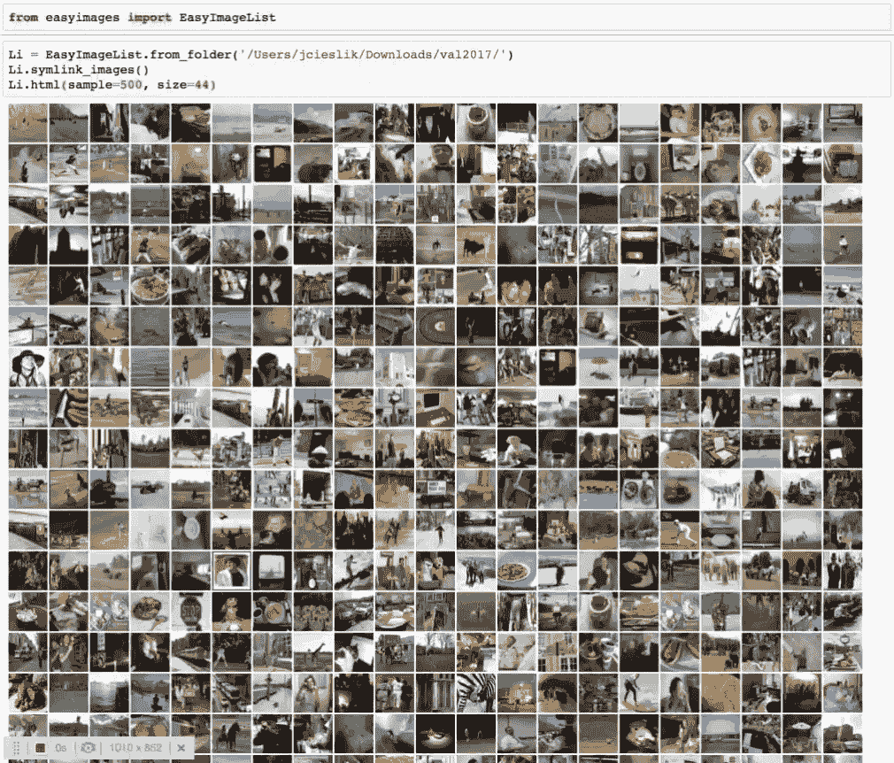

*Fig 1\. 500 coco pictures visualized using html rendered thumbnails*

#### **图像尺寸和长宽比**

在现实世界中，数据集不太可能包含相同大小和纵横比的图像。**检查基本数据集**纵横比、图像宽度和高度**等统计数据将帮助您做出重要决策**:

*   你能和你应该吗？做破坏性的大小调整？(破坏性意味着改变 AR 的大小调整)

*   对于非破坏性的调整大小，你想要的输出分辨率和填充量应该是多少？
*   深度学习模型可能有你必须根据上述调整的超参数(例如锚点大小和比率)，或者它们甚至可能对最小输入图像大小有很强的要求。

*[关于主播的好资源](https://web.archive.org/web/20220926092339/https://d2l.ai/chapter_computer-vision/anchor.html)* [。](https://web.archive.org/web/20220926092339/https://d2l.ai/chapter_computer-vision/anchor.html)

一个*特例是，如果你的数据集包含非常大的图像* (4K+)，这在卫星图像或某些医学模式中并不罕见。对于 2020 年的大多数尖端型号，由于内存限制，每个(服务器级)GPU 甚至无法容纳一个 4K 映像。在这种情况下，您需要弄清楚什么实际上对您的 DL 算法有用。

我看到的两种方法是:

*   在图像补片上训练您的模型(在训练期间随机选择或在训练前提取)
*   调整整个数据集的大小，以避免每次加载数据时都这样做。

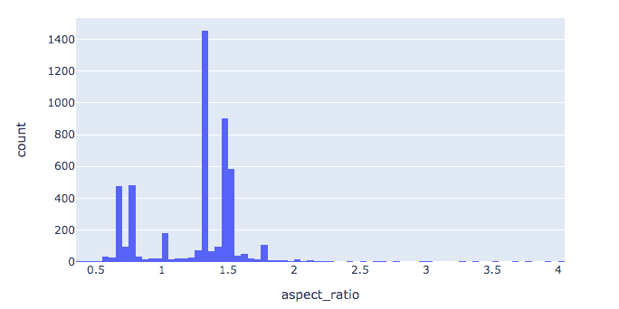

*Fig 2\. Histogram of image aspect ratios in the coco dataset*

总的来说，我认为大多数数据集属于 3 类中的一类。

*   **均匀分布，其中大部分图像具有相同的尺寸**–这里你唯一要做的决定是调整多少大小(如果有的话)，这主要取决于对象的面积、大小和长宽比)
*   **略微呈双峰分布，但大多数图像的纵横比在(0.7 … 1.5)** 范围内，类似于 COCO 数据集。我相信其他“看起来很自然”的数据集也会遵循类似的分布——对于那些类型的数据集，你应该可以使用非破坏性的调整大小- >填充方法。填充是必要的，但要达到可管理的程度，并且不会使数据集变得太大。
*   **具有大量极值的数据集**(非常宽的图像与非常窄的图像混合)–这种情况要复杂得多，有更先进的技术来避免过度填充。您可以考虑根据长宽比对成批图像进行采样。请记住，这可能会给您的采样过程带来偏差——因此，请确保它是可接受的或不够强。

mmdetection 框架通过实现一个基于 AR 采样的 GroupSampler 来支持这一点

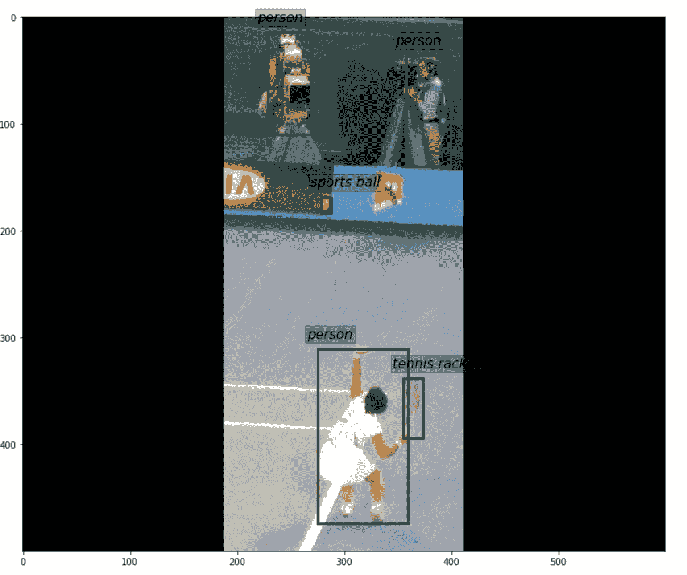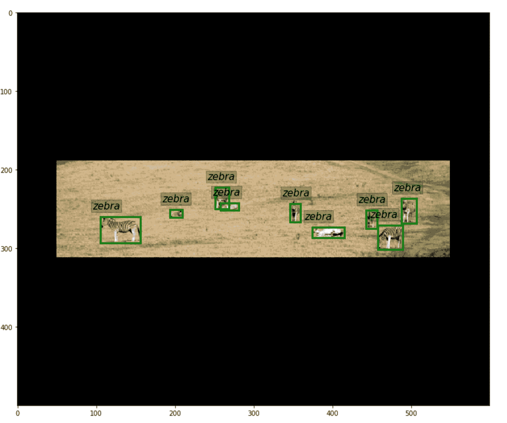

*图 3 和图 4。coco 数据集*中具有极限纵横比的示例图像(调整大小并填充)

#### **标签(物体)大小和尺寸**

这里我们开始看我们的目标(标签)。我们尤其想知道尺寸和长宽比是如何分布的。

为什么这很重要？

根据你的建模方法**，大多数框架都有设计限制**。正如我前面提到的，这些模型旨在在基准数据集上表现良好。如果由于某种原因你的数据不同，训练他们可能是不可能的。让我们从 detectron2 来看看 Retinanet 的[默认配置:](https://web.archive.org/web/20220926092339/https://github.com/facebookresearch/detectron2/blob/master/configs/Base-RetinaNet.yaml#L8)

```py
ANCHOR_GENERATOR:
 SIZES: !!python/object/apply:eval ["[[x, x * 2**(1.0/3), x * 2**(2.0/3) ] for x in [32, 64, 128, 256, 512 ]]"]
```

你可以看到，对于不同的特征图，我们生成的锚点会有一定的大小范围:

*   例如，如果您的数据集只包含非常大的对象，那么可能会大大简化模型，
*   另一方面，让我们假设你有带有小对象的小图像(例如 10x10px ),在这种配置下，你可能无法训练模型。

当涉及到盒子或遮罩尺寸时，要考虑的最重要的事情是:

*   宽比
*   尺寸(面积)

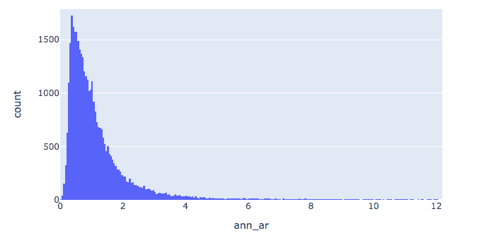

*Fig 5\. aspect ratio of bounding boxes in the coco dataset*

这个分布的尾部(图 3)相当长。会有极端纵横比的情况。根据用例及数据集的不同，忽略它或不忽略它都可以，这需要进一步检查。

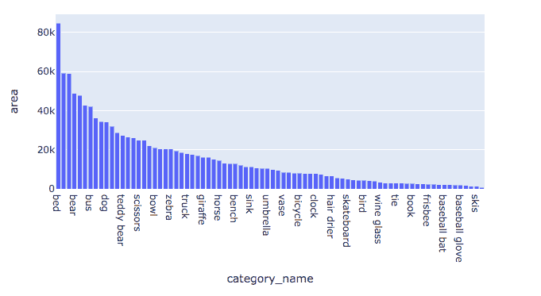

*Fig 6\. Mean area of bounding box per category*

对于基于锚的模型(大多数对象检测/图像分割模型)来说尤其如此，其中存在将基础事实标签与预定义的锚框(aka。先前的方框)。

请记住，您使用超参数来控制这些先前的盒子是如何生成的，比如盒子的数量、它们的纵横比和大小。毫不奇怪，您需要确保这些设置与您的数据集分布和预期一致。

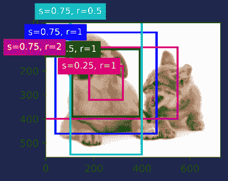

*Fig 7\. The Image shows [anchor boxes](https://web.archive.org/web/20220926092339/https://d2l.ai/chapter_computer-vision/anchor.html) at different scales and aspect ratios.*

需要**记住的一件重要事情是，标签将与图像一起转换**。因此，如果在预处理步骤中缩小图像，ROI 的绝对尺寸也会缩小。

**如果你觉得对象大小可能是你的问题中的一个问题，并且你不想把图像放大太多**(例如为了保持期望的性能或内存占用)你可以**尝试用裁剪>调整大小的方法**来解决这个问题。请记住，这可能是相当棘手的(你需要处理的情况下会发生什么，如果你切过一个边界框或分割掩模)

另一方面，从建模的角度来看，大对象通常不会有问题(尽管你仍然必须确保它与锚点匹配)。它们的问题更加间接，本质上一个类的对象越大，它在数据集中就越有可能被低估。大多数情况下，给定类别中对象的平均面积与(标签)数量成反比。

#### **部分标记的数据**

当创建和标记图像检测数据集时，缺少注释是一个潜在的大问题。最糟糕的情况是，你的基本事实中已经有了假阴性。所以本质上你没有注释对象，即使它们存在于数据集中。

在大多数建模方法中，没有被标记或者与锚点不匹配的一切都被认为是背景。这意味着**它会产生相互矛盾的信号，这将对学习过程造成很大伤害。**

这也是为什么您不能真正将数据集与非重叠类混合并训练一个模型的原因(尽管有一些混合数据集的方法——例如，通过将一个数据集软标记为在另一个数据集上训练的模型)

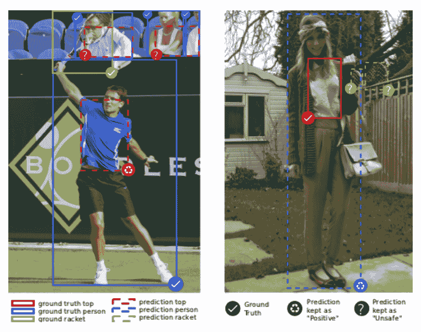

*Fig 8.  Shows the problem of mixing datasets – notice for example that on the right image a person is not labeled. One way to solve this problem is to soft label the dataset with a model trained on the other one. [Source](https://web.archive.org/web/20220926092339/https://arxiv.org/pdf/1812.02611.pdf)*

#### **失衡**

当涉及到对象检测时，类不平衡可能是一个小问题。例如，通常在图像分类中，可以容易地对数据集进行过采样或下采样，并控制每个类对损失的贡献。

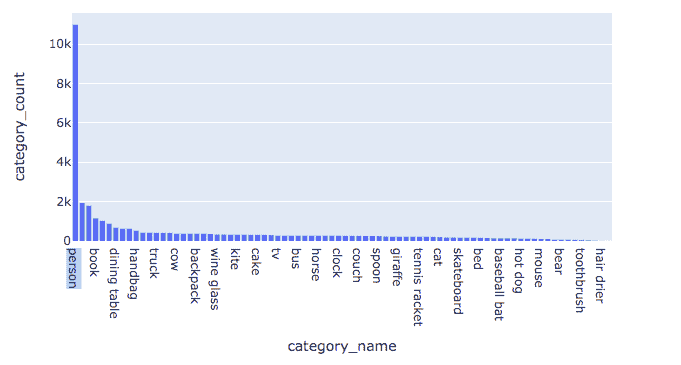

*Fig 9\. Object counts per class*

您可以想象，当您有共现类对象检测数据集时，这更具挑战性，因为您不能真正丢弃一些标签(因为您会发出关于背景是什么的混合信号)。

在这种情况下，您最终会遇到与部分标记的数据段落中所示相同的问题。一旦开始在图像级别上进行重采样，您必须意识到多个类将同时被上采样。

### 注意:

您可能想尝试其他解决方案，如:

*   增加损失的权重(使一些框或像素的贡献更高)
*   以不同的方式预处理数据:例如，您可以进行一些自定义裁剪，在对象级别重新平衡数据集

### **理解增强和预处理序列**

**预处理和数据扩充是任何计算机视觉系统不可或缺的一部分**。如果你做得好，你可以获得很多，但如果你搞砸了，它真的会让你付出代价。

数据扩充是迄今为止最重要和最广泛使用的正则化技术(在图像分割/对象检测中)。

将其应用于对象检测和分割问题比简单的图像分类更具挑战性，因为一些变换(如旋转或裁剪)不仅需要应用于源图像，还需要应用于目标图像(遮罩或边界框)。需要目标转换的常见转换包括:

*   仿射变换，
*   裁剪，
*   扭曲，
*   缩放，
*   旋转
*   还有很多。

对成批的增强图像和目标进行数据探索以避免代价高昂的错误(丢弃边界框等)是至关重要的。

### 注意:

基本增强是 PyTorch 或 Tensorflow 等深度学习框架的一部分，但如果你需要更高级的功能，你需要使用 python 生态系统中可用的增强库之一。我的建议是:

### **最小预处理设置**

每当我构建一个新系统时，我都希望它在预处理和增强层面上保持非常基础，以最小化早期引入 bug 的风险。**我建议你遵循的基本原则是:**

*   禁用增强
*   避免破坏性的大小调整
*   务必目视检查输出

让我们继续 COOC 的例子。从前面的步骤中我们知道:
我们的大多数图像具有:

*   纵横比=宽度/高度= 1.5
*   平均 avg _ width = 600，avg_height = 500。

将平均值设置为我们的基本预处理调整大小值似乎是一件合理的事情(除非模型方面强烈要求具有更大的图片)，例如，resnet50 主干模型的最小大小要求为 32×32(这与下采样层数有关)

在 Albumentations 中，基本的设置实现如下所示:

*   longest maxsize(avg _ height)–这将基于最长的边重新缩放图像，保持纵横比
*   PadIfNeeded(avg_height，avg_width，border_mode='FILL '，value=0)

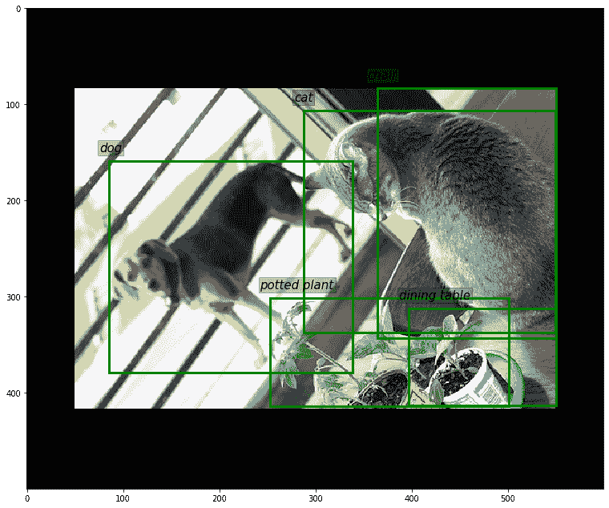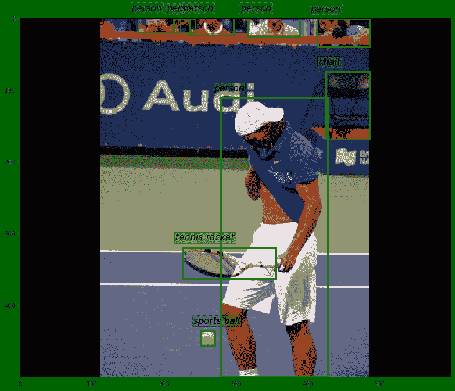

*图 10 和 11。MaxSize - >为两个长宽比相差很大的图片填充输出*

正如你在图 10 和 11 中看到的，预处理产生了一个 500×600 的图像，两个图片都有合理的 0 填充。

当您使用填充时，有许多选项可以填充空白空间。在基本设置中，我建议您使用默认常量 0 值，

当你尝试更高级的方法时，比如反射填充，总是在视觉上探索你的增强。记住，你正在冒引入假阴性的风险，尤其是在对象检测问题中(反映一个没有标签的对象)

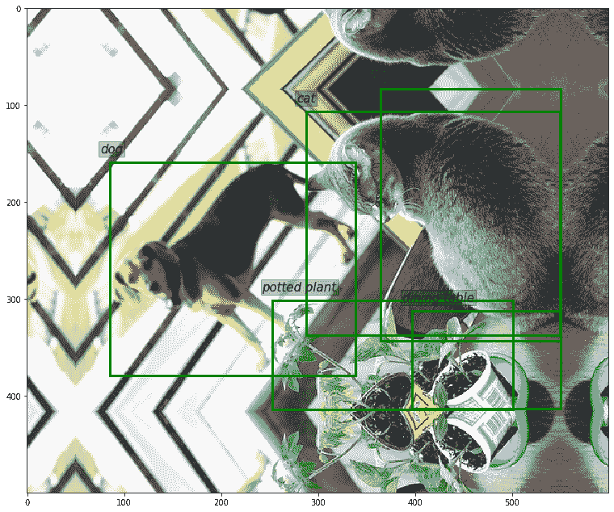

*Fig 12\. Notice how reflection-padding creates false negative errors in our annotations. The cat’s reflection (top of the picture) has no label!*

#### **增强-旋转**

旋转是强大而有用的补充，但应该谨慎使用。请看图 13。下面是使用 Rotate(45)->Resize->Pad 管道生成的。

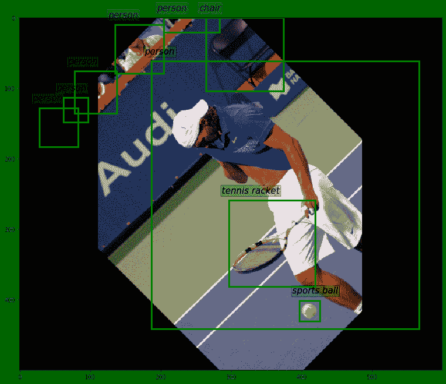

*Fig 13\. Rotations can be harmful to your bounding box labels*

问题是，如果我们使用标准的边界框(没有角度参数)，覆盖一个旋转的对象可能效率较低(框面积对对象面积将增加)。**这种情况发生在旋转增强期间，可能会损坏数据。**请注意，我们还在左上角引入了假阳性标签。这是因为我们对图像进行了裁剪旋转。

我的建议是:

*   如果你有很多长宽比远非 1 的对象，你可能要放弃这些。

你可以考虑的另一件事是使用 90，180，270 度的非裁剪旋转(如果它们有意义的话)来解决你的问题(它们不会破坏任何边界框)

#### **补充——关键要点**

如您所见，空间变换可能相当棘手，可能会发生许多意想不到的事情(尤其是对于对象检测问题)。

因此，如果您决定使用这些空间增强，请确保进行一些数据探索，并直观地检查您的数据。

### 注意:

你真的需要空间扩增吗？我相信在很多情况下，你不需要它们，像往常一样让事情变得简单，逐渐增加复杂性。

根据我的经验，对于自然外观的数据集(类似于 coco ),以下管道是一个很好的起点(没有空间变换):

```py
transforms = [
    LongestMaxSize(max_size=500),
    HorizontalFlip(p=0.5),
    PadIfNeeded(500, 600, border_mode=0, value=0),
    JpegCompression(quality_lower=70, quality_upper=100, p=1),
    RandomBrightnessContrast(0.3, 0.3),
    Cutout(max_h_size=32, max_w_size=32, p=1)
]
```

当然，像 max_size 或 cutout sizes 这样的东西是任意的，必须进行调整。

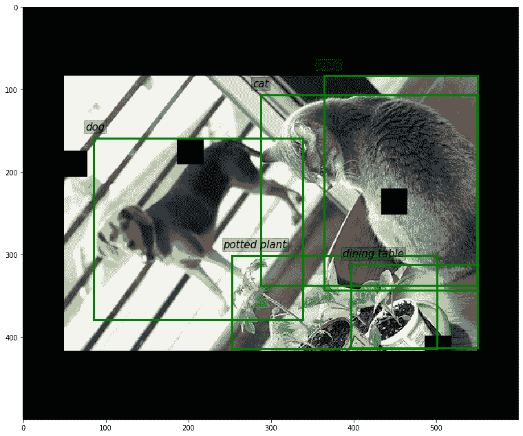

*Fig 14\. Augmentation results  with cutout, jpeg compression and contrast/brightness adjustments*

**最佳实践**:

有一件事我还没有提到，但我觉得很重要:**总是加载整个数据集(连同你的预处理和增强管道)**。

```py
%%timeit -n 1 -r 1
for b in data_loader: pass
```

**两行代码，会节省你很多时间。** 首先，您将了解数据加载的开销是多少，如果您发现明显的性能瓶颈，您可能会考虑立即修复它。更重要的是，您将发现以下潜在问题:

*   损坏的文件，
*   无法转换的标签等
*   任何可能中断训练的可疑情况。

## 结果理解

对于这些类型的问题，检查模型结果和执行错误分析可能是一个棘手的过程。只有一个指标很难告诉你事情的全部，如果你有一个指标，解释它可能是一个相对困难的任务。

让我们来看看官方的 coco challenge 和那里的评估过程(我将展示的所有结果都是针对 resnet50 主干的 MASK R-CNN 模型)。

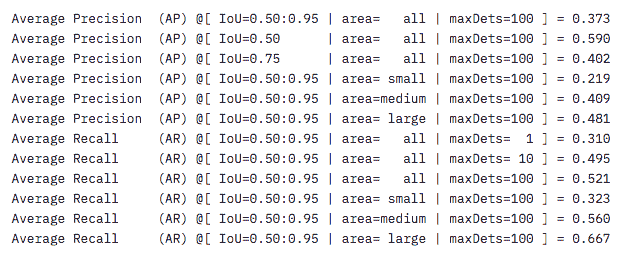

*Fig 15\. Coco evaluation output*

它返回由 IOU(预测值和实际值的交集)和面积划分的各组观察值的 [AP](https://web.archive.org/web/20220926092339/https://medium.com/@jonathan_hui/map-mean-average-precision-for-object-detection-45c121a31173) 和 AR。因此，即使是官方的 COCO 评价也不仅仅是一个指标，这是有充分理由的。

让我们重点关注 IoU=0.50:0.95 符号。

**这意味着:AP 和 AR 计算为不同 IoU 设置(从 0.5 到 0.95，步长为 0.05)计算的精度和召回的平均值。**我们在这里得到的是一个更健壮的评估过程，在这种情况下，如果一个模型在两方面(定位和分类)都很好，它就会得到高分

当然，您的问题和数据集可能不同。也许你需要一个极其精确的检波器，在这种情况下，选择 AP@0.90IoU 可能是个好主意。

(coco eval 工具的)缺点是，默认情况下，所有类和所有图像的所有值都是平均的。这在类似竞赛的设置中可能没问题，在这种设置中，我们希望评估所有类上的模型，但是在现实生活中，当您在自定义数据集(通常只有较少的类)上训练模型时，您真的想知道您的模型在每个类的基础上表现如何。
查看每个职业的指标非常有价值，因为它可能会给你重要的见解:

*   帮助您更好地构建新数据集
*   在数据扩充、数据采样等方面做出更好的决策。

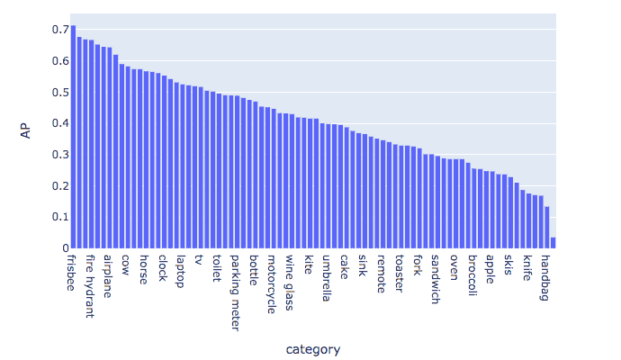

*Fig 16\. Per class AP*

图 16。给你很多有用的信息，你可能会考虑一些事情:

*   向低性能类添加更多数据
*   对于得分较高的类，也许您可以考虑对它们进行降采样，以加快训练速度，并可能有助于其他不太频繁的类的性能。
*   找出任何明显的相关性，例如小对象表现不佳的类。

#### **可视化结果**

好的，如果只看单一指标还不够，你应该怎么做？

我肯定会建议花一些时间进行手动结果探索，结合来自之前分析的硬指标——可视化将有助于您了解全局。

由于探索图像检测和图像分割模型的预测可能会变得相当混乱，我建议你一步一步来。在下面的 gif 上，我展示了如何使用 coco inspector 工具来实现这一点。

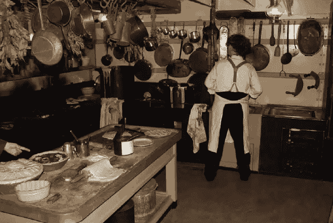

*Fig 17\. All the predictions and ground-truths visualized*

在 gif 上，我们可以看到所有重要信息是如何可视化的:

*   红色面具——预测
*   橙色遮罩-预测和地面真相遮罩的重叠
*   绿色面具-地面真相
*   虚线边界框–误报(没有匹配的预测)
*   橙色方框真阳性
*   绿色盒子——基本事实

#### **结果理解–每幅图像得分**

通过观察硬性指标和视觉检查图像，我们很可能对正在发生的事情有一个很好的了解。但是查看随机图像的结果(或按类别分组)可能不是最佳的方式。**如果你真的想深入研究并发现你的模型的边缘情况，我建议计算每个图像的度量**(例如 AP 或 Recall)。

下面是我通过这样做找到的一张图片的例子。

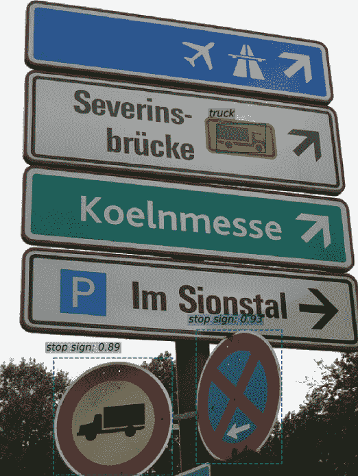

*Fig 18\. Image with a very low AP score*

在上面的例子中(图 18。)我们可以看到两个错误的肯定停止标志预测——由此我们可以推断，我们的模型理解停止标志是什么，但不理解其他交通标志是什么。

也许我们可以向我们的数据集添加新的类，或者使用我们的“停止标志检测器”来标记其他交通标志，然后创建一个新的“交通标志”标签来解决这个问题。

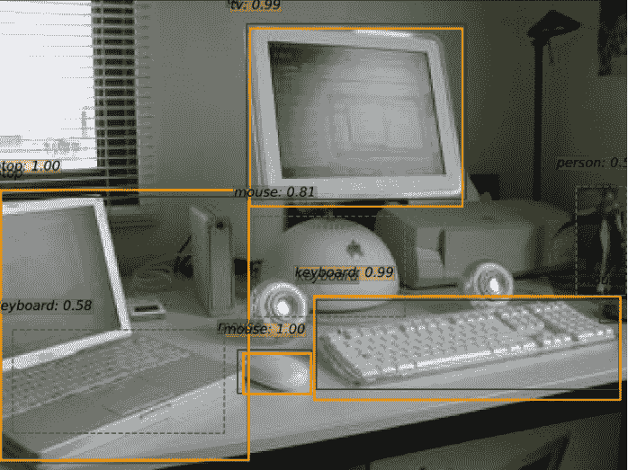

*Fig 19\. Example of an image with a good score > 0.5 AP*

有时我们还会了解到，我们的模型做得比单从分数上看起来更好。这也是有用的信息，例如，在上面的示例中，我们的模型检测到笔记本电脑上有一个键盘，但这实际上在原始数据集中没有标记。

## COCO 格式

起初，coco 数据集的组织方式可能有点吓人。

它由一组相互映射的字典组成。它还打算与 pycocotools / cocotools 库一起使用，后者在数据集元数据文件之上构建了一个相当混乱的 API。

尽管如此，coco 数据集(和 coco 格式)成为组织对象检测和图像分割数据集的标准方式。

在 COCO 中，我们遵循边界框编码的 **xywh** 惯例，或者我喜欢称之为 *tlwh* : **(左上宽高)**，这样你就不会把它和例如 *cwh* : **(中心点，w，h)混淆。**掩码标签(分段)是游程编码的( [RLE 解释](https://web.archive.org/web/20220926092339/https://www.kaggle.com/c/data-science-bowl-2018/overview/evaluation))。

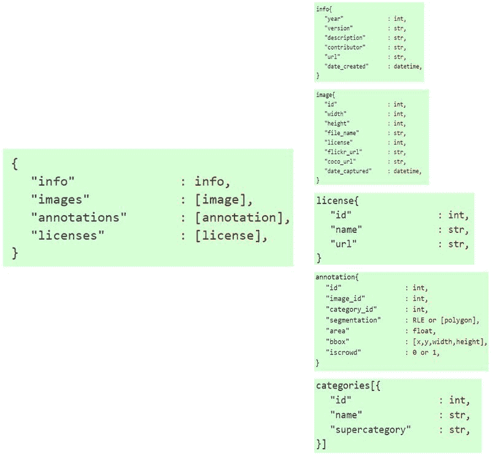

*Fig 20\. The coco dataset annotations format*

拥有一个被广泛采用的标准仍然有非常重要的优势:

*   标注工具和服务导出和导入 COCO 类数据集
*   评估和评分代码(用于 coco 竞赛)已经过很好的优化和实战测试。
*   多个开源数据集紧随其后。

在前一段中，我使用了 COCO eval 功能，这是遵循 COCO 标准的另一个好处。为了利用这一点，您需要以构建 coco 数据集的相同方式格式化您的预测，然后计算指标就像调用:COCOeval(gt_dataset，pred_dataset)一样简单

## COCO 数据集资源管理器

为了简化数据和结果探索的过程(尤其是对象检测),我写了一个在 COCO 数据集上操作的[工具](https://web.archive.org/web/20220926092339/https://github.com/i008/COCO-dataset-explorer)。

本质上，您为它提供基础真实数据集和预测数据集(可选)，它将为您完成其余工作:

*   计算我在这篇文章中提出的大部分指标
*   轻松可视化数据集地面真相和预测
*   检查 coco 指标，每类 AP 指标
*   检查每个图像的分数

要使用 COCO 数据集资源管理器工具，您需要:

```py
git clone https://github.com/i008/COCO-dataset-explorer.git
```

*   下载我在示例中使用的示例数据或使用您自己的 COCO 格式的数据:

[带有预测的 COCO 格式数据集示例。](https://web.archive.org/web/20220926092339/https://drive.google.com/open?id=1wxIagenNdCt_qphEe8gZYK7H2_to9QXl)

如果您下载了示例数据，您将需要提取它。

```py
tar -xvf coco_data.tar
```

您应该具有以下目录结构:

```py
COCO-dataset-explorer
 |coco_data
 |images
 |000000000139.jpg
 |000000000285.jpg
 |000000000632.jpg
 |...
 |ground_truth_annotations.json
 |predictions.json
|coco_explorer.py
|Dockerfile
|environment.yml
|...
```

*   设置包含所有依赖项的环境

```py
conda env update;
conda activate cocoexplorer
```

*   运行 streamlit 应用程序，在 COCO 格式和图像目录中指定包含地面实况和预测的文件:

```py
streamlit run coco_explorer.py -- \
    --coco_train coco_data/ground_truth_annotations.json \
    --coco_predictions coco_data/predictions.json  \
    --images_path coco_data/images/
```

**注意:**您也可以使用 docker:

```py
sudo docker run -p 8501:8501 -it -v "$(pwd)"/coco_data:/coco_data i008/coco_explorer  \
    streamlit run  coco_explorer.py -- \
    --coco_train /coco_data/ground_truth_annotations.json \
    --coco_predictions /coco_data/predictions.json  \
    --images_path /coco_data/images/
```

## 最后的话

我希望通过这篇文章，我让你相信对象检测和图像分割中的数据探索与机器学习的任何其他分支一样重要。

我相信我们在项目这一阶段所做的努力最终会有回报的。

我们收集的知识使我们能够做出更明智的建模决策，避免多重训练陷阱，并使您对训练过程和模型产生的预测更有信心。

* * *

**阅读下一篇**

## Python 中的图像处理:你应该知道的算法、工具和方法

9 分钟阅读|作者 Neetika Khandelwal |更新于 2021 年 5 月 27 日

图像定义了世界，每张图像都有自己的故事，它包含了许多在许多方面都有用的重要信息。这些信息可以借助于被称为**图像处理**的技术来获得。

它是计算机视觉的核心部分，在机器人、自动驾驶汽车和物体检测等许多现实世界的例子中起着至关重要的作用。图像处理允许我们一次转换和操作数千幅图像，并从中提取有用的见解。它在几乎每个领域都有广泛的应用。

Python 是为此目的广泛使用的编程语言之一。它惊人的库和工具有助于非常有效地完成图像处理任务。

通过本文，您将了解处理图像并获得所需输出的经典算法、技术和工具。

让我们开始吧！

[Continue reading ->](/web/20220926092339/https://neptune.ai/blog/image-processing-in-python-algorithms-tools-and-methods-you-should-know)

* * ***