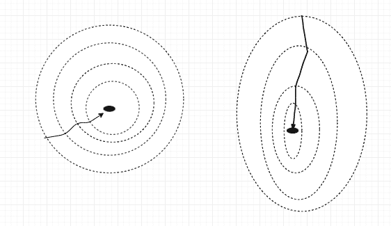
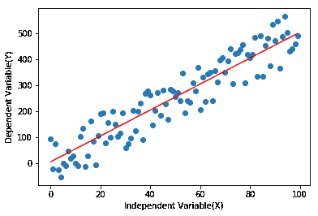
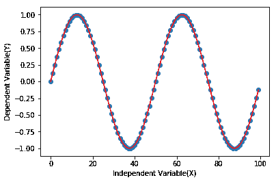
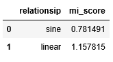

# 数据预处理综合指南

> 原文：<https://web.archive.org/web/https://neptune.ai/blog/data-preprocessing-guide>

根据 2020 年[国际数据公司的预测](https://web.archive.org/web/20221206194718/https://www.idc.com/getdoc.jsp?containerId=prUS46286020)，2020 年将有 59z 字节的数据被创建、消费、捕获和复制。当我们回到 2012 年时，这一预测变得更加有趣，并且发现 [IDC 预测](https://web.archive.org/web/20221206194718/https://corporate.delltechnologies.com/en-us/newsroom/announcements/2012/12/20121211-01.htm)到 2020 年数字世界将只达到 40zb**，而不仅仅是 2020 年**的**。**

实际数字和预测数字之间的巨大差距是有原因的，最大的原因是新冠肺炎·疫情。全球隔离让每个人都上网，数据生成量疯狂飙升。毫不奇怪，2020 年到 2024 年已经被命名为新冠肺炎数据激增的年份。这需要能够管理和优化数据的人员、流程和技术，以便快速获得有利可图的见解。

像数据管理和数据处理这样的技能变得非常有价值。这就是为什么本文是数据预处理步骤和技术的综合指南，让您进入这个新世界。

## 什么是数据预处理？

任何与数据相关的项目都有相当大一部分是关于数据预处理的，数据科学家花费大约 80%的时间准备和管理数据。数据预处理是分析、过滤、转换和编码数据的方法，以便机器学习算法可以理解和处理处理后的输出。

## 为什么数据预处理是必要的？

从数据中学习的算法只是对数据库中的值进行运算的统计方程。所以，俗话说“垃圾进去了，垃圾就出来了”。只有进入机器的数据是高质量的，你的数据项目才能成功。

在从现实世界场景中提取的数据中，总是存在噪声和缺失值。这是由于手动错误、意外事件、技术问题或各种其他障碍造成的。算法不能消耗不完整和有噪声的数据，因为它们通常不是为处理缺失值而设计的，噪声会破坏样本的真实模式。数据预处理旨在通过彻底处理手头的数据来解决这些问题。

## 如何进行数据预处理？

在我们进入一步一步的数据处理的细节之前，让我们来看看一些工具和库，它们可以用来执行数据处理，并使数据处理更易于管理！

### 工具和库

可以通过工具和库来简化数据预处理步骤，使该过程更易于管理和执行。如果没有特定的库，one liner 解决方案可能需要数小时的编码来开发和优化。

**用 Python 进行数据预处理:** Python 是一种支持无数开源库的编程语言，可以用一行代码计算复杂的运算。例如，对于缺失值的智能插补，只需使用 scikit learn 的**插补**库包。或者，对于缩放数据集，只需调用**预处理**库包中的 **MinMaxScaler** 函数。 [**预处理**库包](https://web.archive.org/web/20221206194718/https://scikit-learn.org/stable/modules/preprocessing.html)中有无数数据预处理函数可用。

Autumunge 是一个伟大的工具，作为 python 库平台构建，为机器学习算法的直接应用准备表格数据。

**用 R 进行数据预处理:** R 是一个主要用于研究/学术目的的框架。它有多个包，就像 python 库一样，支持数据预处理步骤。

**用 Weka 进行数据预处理:** Weka 是一款支持数据挖掘和数据预处理的软件，通过内置的数据预处理工具和机器学习模型进行智能挖掘。

**使用 RapidMiner 进行数据预处理:**与 Weka 类似，RapidMiner 是一款开源软件，拥有各种支持数据预处理的高效工具。

既然我们有了支持多种功能的适当工具，让我们深入研究数据预处理步骤。

### 数据预处理的目的

在您恰当地收集了数据之后，需要对其进行探索或评估，以发现关键趋势和不一致之处。数据质量评估的主要目标是:

*   **获取数据概述**:了解存储数据的数据格式和整体结构。此外，找到数据的属性，如平均值，中位数，标准分位数和标准差。这些细节有助于识别数据中的异常情况。

*   **识别缺失数据:**缺失数据在大多数现实世界的数据集中很常见。这可能会破坏真实的数据模式，甚至会导致更多的数据丢失，因为数据集中有几个单元格丢失了。

*   **识别异常值或异常数据:**一些数据点远离主要数据模式。这些点是异常值，可能需要丢弃以获得更高精度的预测，除非算法的主要目的是检测异常。

*   **消除不一致:**就像缺少值一样，真实世界的数据也有多种不一致，如拼写错误、列和行填充不正确(例如:性别列中填充的薪金)、重复数据等等。有时，这些不一致可以通过自动化来处理，但大多数情况下需要手动检查。

以下是一些流行的数据预处理技术，可以帮助您实现上述目标:

### 处理缺失值

[缺失值是现实世界数据集中经常出现的问题](https://web.archive.org/web/20221206194718/https://towardsdatascience.com/all-about-missing-data-handling-b94b8b5d2184)，因为现实生活中的数据存在物理和人工限制。例如，如果传感器从特定来源捕获数据，传感器可能会停止工作一段时间，从而导致数据丢失。同样，不同的数据集有不同的问题会导致数据点丢失。

我们需要处理这些缺失的值，以最佳地利用可用的数据。以下是一些屡试不爽的方法:

*   **删除有缺失值的样本:**当样本数量较多，且一行/样本中缺失值的计数较多时，此选项很有用。对于其他情况，不推荐使用这种解决方案，因为它会导致大量数据丢失。

*   **用零替换缺失值:**有时这种技术对基本数据集有效，因为相关数据假设零为基数，表示该值缺失。然而，在大多数情况下，零本身可以表示一个值。例如，如果传感器生成温度值，而数据集属于热带地区。类似地，在大多数情况下，如果缺少的值用 0 填充，那么它会误导模型。只有当数据集独立于其效果时，0 才能用作替换。例如，在电话账单数据中,“账单金额”列中缺少的值可以替换为零，因为它可能表示用户当月没有订购该计划。

*   **用均值、中值或众数替换缺失值:**您可以通过使用均值、中值或众数等统计函数替换缺失值，来处理上述因错误使用 0 而导致的问题。尽管它们也是假设，但这些值更有意义，与 0 这样的单一值相比，它们更接近近似值。

*   **插值缺失值:**插值有助于根据给定的步长生成某个范围内的值。例如，如果在值为 0 和 10 的单元格之间的列中有 9 个缺失值，插值将用 1 到 9 的数字填充缺失的单元格。可以理解的是，在插值之前，数据集需要根据更可靠的变量(如序列号)进行排序。

*   **外推缺失值:**外推有助于填充超出给定范围的值，如某个特征的极值。外推法借助另一个变量(通常是目标变量)来比较有问题的变量，并用引导参考填充它。

*   **用其他特征建立一个模型来预测缺失值:**这是我们提到的所有技术中最直观的。这里，算法研究除实际目标变量之外的所有变量(因为这将导致数据泄漏)。该算法的目标变量成为具有缺失值的特征。如果训练有素，该模型可以预测缺失点并提供最接近的近似值。

### 缩放比例

不同的列可以出现在不同的范围内。例如，可以有一列是距离单位，另一列是货币单位。这两列将具有截然不同的范围，使得任何机器学习模型都难以达到最佳计算状态。

用更专业的术语来说，如果考虑使用梯度下降，梯度下降算法将需要更长的时间来收敛，因为它必须处理相距很远的不同范围。下图显示了同样的情况。

*Gradient Descent Convergence*

左侧的图表具有缩放的要素。这意味着特性被降低到彼此可比较的值，因此优化函数不必采取重大跳跃来达到最佳点。算法(如决策树)不需要缩放，因为它不是基于距离的。然而，基于距离的模型必须毫无例外地具有缩放的特征。

一些流行的缩放技术有:

*   **最小-最大缩放器:**最小-最大缩放器缩小任意选择范围之间的特征值。例如，在 0 和 5 之间。

*   **标准定标器:**标准定标器假设变量呈正态分布，然后将其缩小，使标准差为 1，分布以 0 为中心。

*   **鲁棒定标器:**当数据集中存在离群值时，鲁棒定标器效果最佳。在移除中间值后，它会根据四分位数范围调整数据。

*   **Max-Abs Scaler:** 类似于 min-max scaler，但不是给定的范围，而是将特征缩放到其最大绝对值。数据的稀疏性得以保留，因为它不将数据居中。

Scikit Learn 的 [**预处理**库包](https://web.archive.org/web/20221206194718/https://scikit-learn.org/stable/modules/preprocessing.html)可以提供一个线性解决方案来执行上述所有缩放方法。

## 异常值处理

异常值是与数据中观察到的主要模式不一致的数据点。它们可以通过将计算从实际模式中移除而导致预测中断。

异常值可以在箱线图的帮助下检测和处理。箱线图用于确定中位数、四分位数范围和异常值。要移除异常值，需要记录最大和最小范围，并相应地过滤变量。

## 特征编码

有时，数据是机器无法处理的格式。例如，对于只依赖数字的模型来说，包含字符串值(如名称)的列没有任何意义。所以，我们需要处理数据来帮助模型解释它。这种方法叫做**。有多种方法可以对类别进行编码。这里有几个让你开始:**

 **### 经典编码器

*   [**标签/序数编码**](https://web.archive.org/web/20221206194718/https://machinelearningmastery.com/one-hot-encoding-for-categorical-data/#:~:text=An%20ordinal%20encoding%20involves%20mapping,harnessed%20when%20preparing%20the%20data.) **:** 以序数(顺序)方式嵌入从 1 到 n 的值。“n”是列中的样本数。如果一列有 3 个城市名称，标签编码将为不同的城市分配值 1、2 和 3。当分类值没有固有顺序时，不建议使用这种方法，例如城市，但是这种方法适用于有序类别，例如学生成绩。

*   **一个热编码:**当数据没有固有的顺序时，可以使用一个热编码。一种热编码为每个类别生成一列，并在该类别出现的任何一行中分配一个正值(1)，当该类别不存在时分配 0。这样做的缺点是，一个要素会生成多个要素，从而使数据变得庞大。在你没有太多特性的情况下，这不是问题。

*   [**二进制编码**](https://web.archive.org/web/20221206194718/https://www.sciencedirect.com/topics/engineering/binary-encoding) **:** 这解决了一个热编码的笨重。每个分类值都被转换成二进制表示，并且为每个二进制数字创建一个新列。与一个热编码相比，这压缩了列的数量。对于分类列中的 100 个值，一个热编码将创建 100(或 99)个新列，而二进制编码将创建更少的列，除非值太大。

*   **BaseN 编码:**这类似于二进制编码，唯一的区别是基数。与二进制的基数 2 不同，任何其他基数都可以用于巴森编码。基数越高，信息损失越大，但编码器的压缩能力也会不断提高。公平的交易。

*   **散列**:散列意味着使用数学函数从一个类别中生成值。这就像一个热编码(有一个真/假函数)，但是有一个更复杂的函数和更少的维度。由于结果值的冲突，哈希运算会丢失一些信息。

### 贝叶斯编码器

这些编码器从目标变量借用信息，并将它们映射到列中的类别。当类别数量非常大时，这种技术非常有用。在这种情况下，如果使用经典的编码器，将会增加许多倍的维数，给模型带来不必要的麻烦。当特征的数量非常大时，一个称为**维数灾难**的问题会降低机器学习模型的效率，因为它们仍然不足以处理大量的特征。

*   **目标编码**:只有目标变量中对应于特征中某一类别的那些行的平均值被映射到该类别。必须通过将测试数据分开来处理数据泄漏和过度拟合的问题。

*   **证据权重编码:**证据权重(WoE)是一个证据(或一个值)支持或否定一个假设的程度的度量。WoE 通常用宁滨技术对连续变量进行编码。

*   **留一编码:**类似于目标编码，但在计算平均值时会保留当前样本的值。这有助于避免异常值和异常数据。

*   **James-Stein 编码:**取对应目标均值的加权平均值以及整个目标变量的均值。这有助于减少过拟合和欠拟合。权重是基于估计的值的方差来决定的。如果构成平均值的值的方差很大，则表明该平均值不太可靠。

### 特征创建和聚合

可以从原始要素创建新要素。例如，如果名为“总时间”和“总距离”的两个特征可用，您可以创建速度特征。这为该模型提供了一个新的视角，该模型现在可以检测速度和目标变量之间的逻辑关系。

类似地，您可以这样做来构建其他直观的特性，比如基于工作日和周末的公里数，或者高峰时间的速度。在深度学习模型的情况下，神经网络层可以识别原始特征之间的复杂关系，因此我们不需要将基于公式的特征输入到 DL 模型中。

类似地，可以适当地聚合特征以减少数据量，并且还可以创建相关信息。例如，在降雨预报的时间序列模型中，数据必须根据天进行聚合，以便可以评估每天的总降雨量。全天的几个降雨测量记录不会给时间序列模型增加多少价值。

## 降维

机器学习模型还不足以处理大量的特征，遵循“垃圾进，垃圾出”的规则。在他们的书《变量和特征选择导论》中，Guyon 和 Elisseeff 写道:

> 变量选择的目标有三个:提高预测器的预测性能，提供更快、更具成本效益的预测器，以及更好地理解生成数据的基本过程。

使用不相关和冗余的特征将使模型变得不必要的复杂，甚至可能降低预测分数。特征选择的主要优点是:

*   **减少处理时间:**数据量越少，训练和预测越快。更多的特征意味着模型可以学习更多的数据，并且增加了学习时间。
*   **精度提升:**当一个模型没有无关变量需要考虑时，无关因素无法提升模型的得分。
*   **减少过度拟合:**无关变量和冗余数据的数量越少，模型决策中的噪声传播就越小。

特征选择可以在许多层面上进行。首先，特征选择技术可以分为单变量和多变量技术。

### 单变量选择

在单变量选择下的每一种技术中，每一个特征都被单独研究，它与目标变量的关系也被考虑在内。以下是一些单变量特征选择技术:

#### 差异

方差是给定特征变化的量度。例如，如果一个特征中的所有样本都具有相同的值，则意味着该特征的方差为零。重要的是要明白，没有足够方差的列与全是“nan”或缺失值的列一样好。如果特征没有变化，就不可能从中衍生出任何模式。因此，我们检查方差并消除任何显示低或无变化的特征。

方差阈值可能是消除数据集中的要素的好方法，但是在存在少数类(比如，5% 0 和 95% 1)的情况下，即使好的要素可能具有非常低的方差，但最终仍然是非常强的预测器。因此，建议您记住目标比率，并在仅基于方差消除特征之前使用相关方法。

#### 相互关系

相关性是一种单变量分析技术。它检测两个变量之间的线性关系。可以把相关性看作是衡量比例的一个尺度，它只是衡量一个变量的增减如何影响另一个变量。

相关性的一个主要缺点是它不能恰当地捕捉非线性关系，甚至是强关系。下图展示了相关性的利与弊:

*Linear relationship*

*Sine relationship*

*Correlation scores*

第二张图显示了因变量和自变量之间的强正弦波关系。然而，相关性(-0.389)只能勉强捕捉到强依赖性。另一方面，当存在线性相关性时，我们会得到较高的相关分数(0.935)，尽管它不如正弦相关性那么强。

有各种各样的相关技术，但基本上所有这些技术都试图追踪两个变量之间的线性关系。有三种流行的相关技术:

1.  皮尔逊相关性:这是最简单的，并且有很多假设。所讨论的变量必须是正态分布的，并且彼此之间具有线性关系。此外，数据必须平均分布在回归线周围。然而，尽管有几个假设，皮尔逊相关对大多数数据都适用。

2.  Spearman 等级相关性:它基于这样一个假设，即变量是按顺序(等级)来衡量的。它跟踪一个变量的可变性，该变量可以映射到被观察的另一个变量。

3.  **Kendall 等级相关性:**这种方法是对两个变量之间的相关性的一种度量，除了基于概率而不是可变性来度量相关性之外，基本上遵循与 Spearman 相同的假设。它是被观察的两个变量有序的概率和不有序的概率之差。

你不仅要对目标(或因变量)进行相关性测试，还要对所有自变量进行相关性测试。例如，如果有两个变量分别与目标具有 90%和 85%的相关性，并且相互之间具有 95%的相关性，那么去掉这两个变量中的任何一个都是有益的。优选地是与目标具有较低相关性的那个。您需要这样做，以消除数据中的冗余信息，从而减少模型的偏差。

#### 交互信息

互信息解决了相关性带来的问题。它有效地捕捉了给定变量之间的任何非线性关系。这有助于我们消除与目标变量没有显著关系的特征，帮助我们加强预测模型。互信息背后的思想是信息增益。它提出了这样一个问题:一个变量能从另一个变量中提取多少信息？或者，使用另一个变量可以跟踪一个变量的多少移动(增加或减少)？

对于相同的关系，正弦波和线性，互信息得分如下:

*Mutual information scores*

互信息正确地暗示了强正弦波关系，使得它在捕捉关于非线性关系的信息时更有能力。正弦关系的互信息是 0.781，而相同关系的相关性是-0.389。

#### 卡方检验

这是一种统计工具或测试，可用于分类特征组，在频率分布的帮助下评估关联或相关的可能性。

### 多元选择

也称为包装方法，多变量选择技术每次选取一组特征，并测试该组预测目标变量的能力。

**正向选择:**这种方法从最少数量的特征开始，测量集合在预测时的表现。每次迭代，它都会添加另一个变量，这个变量是根据最佳性能(与所有其他变量相比)选择的。所有集合中具有最佳性能的集合被最终确定为特征集合。

**后向淘汰:**类似于前向选择，只是方向相反。向后消除从所有可能的特性开始，并在每次迭代中测量性能，消除无关的变量，或者与特性集配对时性能很差的变量。

与向前选择相比，向后淘汰通常是首选方法。这是因为在正向选择中，抑制效应会碍事。当一个变量只有在另一个变量保持不变的情况下才能得到最佳利用时，就会出现抑制效应。换句话说，对于新添加的特征，集合中已存在的特征可能变得不重要。为了避免这种情况，可以使用 p 值，尽管这是一个有点争议的统计工具。

**递归特征消除:**类似于向后消除，但它用递归方法代替了迭代方法。这是一个贪婪的优化算法，与一个模型一起寻找优化的特性集。

**线性判别分析(LDA)** :帮助您找到特征的线性组合，将两个或多个类别的分类变量分开。

**ANOVA:** 又名“方差分析”，类似于 LDA，但使用一个或多个分类特征和一个连续目标。这是一个统计测试，测试不同组的平均值是否相似。

**嵌入式方法:**一些机器学习模型自带内置的特征选择方法。它们被设计为根据特征在预测目标方面的性能对特征应用系数。表现不佳的变量的系数非常低或为零，这就(几乎)完全将它们从学习方程中忽略了。嵌入方法的例子是岭和套索模型，它们是回归问题中使用的线性模型。

## 摘要

至此，我们已经完成了本指南的所有内容。请注意，这里提到的每一步都有几个副主题，值得他们自己的文章。我们探索的步骤和技术是最常用和最流行的工作方法。

完成数据预处理后，可以将数据分为训练集、测试集和验证集，用于模型拟合和模型预测阶段。感谢阅读，祝你的模特好运！

### 资源/参考链接

1.  [外推和内插](https://web.archive.org/web/20221206194718/http://dept.harpercollege.edu/chemistry/chm/100/dgodambe/thedisk/labtech/data7.htm)
2.  [统计学介绍:平均值、中位数和众数](https://web.archive.org/web/20221206194718/https://365datascience.com/tutorials/statistics-tutorials/mean-median-and-mode/)
3.  [梯度下降](https://web.archive.org/web/20221206194718/https://machinelearningmastery.com/gradient-descent-for-machine-learning/)
4.  [类别编码器的类型](https://web.archive.org/web/20221206194718/https://towardsdatascience.com/how-to-encode-categorical-data-d44dde313131)
5.  [关联类型](https://web.archive.org/web/20221206194718/https://www.statisticssolutions.com/correlation-pearson-kendall-spearman/)
6.  [相互信息](https://web.archive.org/web/20221206194718/https://machinelearningmastery.com/information-gain-and-mutual-information/)
7.  [单变量与多变量分析](https://web.archive.org/web/20221206194718/https://www.geeksforgeeks.org/univariate-bivariate-and-multivariate-data-and-its-analysis/)
8.  [特征选择方法](https://web.archive.org/web/20221206194718/https://www.analyticsvidhya.com/blog/2016/12/introduction-to-feature-selection-methods-with-an-example-or-how-to-select-the-right-variables/)
9.  [线性判别分析](https://web.archive.org/web/20221206194718/https://machinelearningmastery.com/linear-discriminant-analysis-for-machine-learning/)**