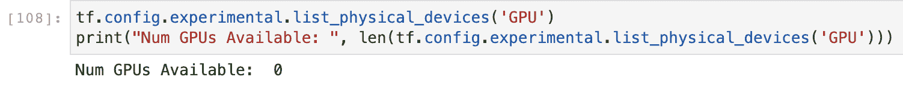

# 容器中的数据科学和机器学习

> 原文：<https://web.archive.org/web/https://neptune.ai/blog/data-science-machine-learning-in-containers>

当构建数据科学和机器学习驱动的产品时，研究-开发-生产工作流不像传统软件开发那样是线性的，在传统软件开发中，规格是已知的，问题(大部分)是预先了解的。

这涉及到大量的试验和错误，包括新算法的测试和使用，尝试新的数据版本(并管理它)，为生产包装产品，最终用户的观点和看法，反馈循环，等等。这使得管理这些项目成为一项挑战。

如果您想确保您的应用程序能够实际工作，那么将开发环境与生产系统隔离开来是必须的。因此，将您的 ML 模型开发工作放在(docker)容器中确实有助于:

*   管理产品开发，
*   保持环境整洁(并使其易于重置)，
*   最重要的是，从开发到生产变得更加容易。

在本文中，我们将讨论机器学习(ML)产品的开发，以及使用容器的最佳实践。我们将讨论以下内容:

*   机器学习迭代过程和依赖性
*   所有阶段的版本控制
*   MLOps 与 DevOps
*   需要相同的开发和生产环境
*   容器要素(含义、范围、docker 文件和 docker-compose 等。)
*   容器中的 Jupyter 笔记本
*   TensorFlow 在容器微服务中的应用开发
*   GPU 和坞站

你需要知道的是

## 为了充分理解机器学习项目在容器中的实现，您应该:

对 Docker 软件开发有基本的了解，

*   能够用 Python 编程，
*   能够用 TensorFlow 或者 Keras 建立基本的机器学习和深度学习模型，
*   部署了至少一个机器学习模型。
*   如果您不了解 Docker、Python 或 TensorFlow，以下链接可能对您有所帮助:

机器学习迭代过程和依赖性

## 学习是一个反复的过程。当一个孩子学习走路时，他会经历一个重复的过程:走路、跌倒、站立、行走等等——直到他发出“咔嗒”声，他就可以自信地走路了。

同样的概念适用于机器学习，并且有必要确保 ML 模型从给定的数据中捕获正确的模式、特征和相互依赖性。

当你在构建一个 ML 驱动的产品或应用时，你需要为这种方法中的迭代过程做好准备，尤其是机器学习。

这种迭代过程不仅限于产品设计，而是涵盖了使用机器学习的产品开发的整个周期。

算法做出正确业务决策所需的正确模式总是隐藏在数据中。数据科学家和 MLOps 团队需要投入大量精力来构建能够执行这项任务的强大 ML 系统。

迭代过程可能会令人困惑。根据经验，典型的机器学习工作流应该至少包括以下阶段:

数据收集或数据工程

*   探索性数据分析
*   数据预处理
*   特征工程
*   模特培训
*   模型评估
*   模型调整和调试
*   部署
*   对于每个阶段，都直接或间接地依赖于其他阶段。

下面是我如何基于系统设计的层次来看待整个工作流程:

**模型级别(拟合参数):**假设已经收集了数据，完成了 EDA 和基本预处理，当您必须选择适合您试图解决的问题的模型时，迭代过程开始。没有捷径可走，你需要迭代一些模型，看看哪个模型最适合你的数据。

*   **微观层面(调整超参数):**一旦您选择了一个模型(或一组模型)，您就可以在微观层面开始另一个迭代过程，目的是获得最佳的模型超参数。
*   **宏观层面(解决你的问题):**你为一个问题建立的第一个模型很少会是最好的，即使你通过交叉验证对它进行了完美的调整。这是因为拟合模型参数和[调整超参数](/web/20221206073629/https://neptune.ai/blog/hyperparameter-tuning-in-python-a-complete-guide-2020)只是整个机器学习问题解决工作流程的两部分。在这个阶段，需要迭代一些技术来改进您正在解决的问题的模型。这些技术包括尝试其他模型，或集合。
*   **元级别(改进您的数据):**在改进您的模型(或训练基线)时，您可能会发现您正在使用的数据质量很差(例如，贴错标签)，或者您需要对某一类型进行更多的观察(例如，夜间拍摄的图像)。在这些情况下，改善数据集和/或获取更多数据变得非常重要。您应该始终保持数据集尽可能与您正在解决的问题相关。
*   这些迭代总是会导致系统中的大量变化，因此版本控制对于高效的工作流和可再现性变得非常重要。

所有阶段的版本控制

版本控制是一种系统，它记录一段时间内对一个文件或一组文件的更改，以便您可以在以后调用特定的版本。由于 ML-powered 产品开发中涉及的迭代过程，版本控制已经成为产品成功以及未来维护或优化的关键。

## ML 工作流中的文件，以及笔记本、数据集、脚本文件等系统，它们都需要版本控制。

根据您的团队的偏好，有许多工具和最佳实践来对这些文件进行版本控制。我来分享一下最适合我的。

通常，您将使用版本控制系统，如 Git、Apache Subversion (SVC)或并发版本系统(CVS)。但是，由于 ML 工作流中使用的文件类型，只使用其中一个系统可能不是机器学习项目的最佳选择。最好添加其他有用的工具来有效地对每个文件进行版本控制。

**数据版本化:**大多数公司将数据存储在数据库或云存储/桶中，如亚马逊 S3 桶或谷歌云存储，在需要时可以提取数据。

提取样本以最好地代表您试图解决的问题可能是迭代的，并且对用于训练机器学习模型的数据进行版本化变得很重要。

您可以推送到版本控制平台的文件的容量和大小是有限制的，有时，您将处理的数据以千兆字节为单位，因此这不是最好的方法。

有了像 DVC 和海王星这样的工具，数据版本控制变得更加容易。以下是一些帮助您开始使用数据版本控制的有用链接:

**笔记本版本:** Jupyter、Colab 笔记本生成的文件可能包含元数据、源代码、格式化文本和富媒体。

不幸的是，这使得这些文件不适合传统的版本控制解决方案，传统的版本控制解决方案最适合纯文本。这些笔记本的问题在于它们是人类可读的 JSON。ipynb 文件。直接编辑 JSON 源代码并不常见，因为其格式非常冗长。很容易忘记所需的标点符号，像{}和[]，并损坏文件。

更麻烦的是，Jupyter 源代码中经常散落着存储为二进制 blobs 的单元输出。笔记本中的小变化，比如用新数据重新运行，看起来像是版本控制提交日志中的重大变化。

一些有效跟踪文件的内置解决方案将笔记本转换为 HTML 或 Python 文件。你可以使用的外部工具有 nbdime、ReviewNB、Jupytext 和 Neptune 等等。

我的选择是 Neptune，因为它可以与 Jupyter 和 JupyterLab 集成作为扩展。版本控制只是 Neptune 的特性之一。团队、项目和用户管理特性使它不仅仅是一个版本控制工具，但是该软件的轻量级足迹可能使它成为一个引人注目的候选。

使用版本控制系统，你的整个项目都可以被版本化，使用容器，这变得更加容易，我们将很快讨论这一点。

MLOps 与 DevOps

在我们深入使用 TensorFlow 进行机器学习的容器之前，让我们快速浏览一下 MLOps 和 DevOps 之间的异同。

MLOps(机器学习运营)旨在管理大规模生产环境中所有类型的机器学习(深度学习、联邦学习等)的部署。

## DevOps(开发和运营)是一套大规模结合软件开发和 IT 运营的实践。它旨在缩短开发周期，提高部署速度，并创建可靠的版本。

**DevOps 原则也适用于 mlop**，但机器学习工作负载的某些方面需要不同的关注点或实现。

记住我们之前讨论的基本 ML 工作流，我们可以指出 MLOps 和 DevOps 中的以下差异:

团队技能:一个 MLOps 团队有研究科学家、数据科学家和机器学习工程师，他们在 DevOps 团队中担任与软件工程师相同的角色。ML 工程师拥有软件工程师的基本技能，并结合了数据科学专业知识。

**开发:** DevOps 是线性的，MLOps 更多的是实验性质的。团队需要能够操作模型参数和数据特征，并随着数据的变化频繁地重新训练模型。这需要更复杂的反馈回路。此外，团队需要能够在不妨碍工作流可重用性的情况下跟踪操作的可重复性。

**测试:**在 MLOps 中，测试需要在 DevOps 中通常完成的方法之外的额外方法。例如，MLOps 需要测试数据验证、模型验证、模型质量测试、模型集成和差异测试。

1.  **部署:**ML ops 中的部署过程类似于 DevOps，但是它取决于您正在部署的 ML 系统的类型。如果设计的 ML 系统与整个产品周期分离，并作为软件的外部单元，这就变得容易了。
2.  **生产:**生产机器学习模型是连续的，在生产中可能比传统软件更具挑战性。随着用户数据的变化，智能会随着时间而降低。MLOps 需要模型监控和审计来避免意外。
3.  需要相同的开发和生产环境
4.  在软件工程中，产品开发通常有两个阶段——开发和生产。当开发和生产都选择云原生时，这可以减少到一个，但大多数 ML 应用程序在被推送到云之前都是在本地 PC 上开发的。
5.  生产环境是开发环境的再现，主要关注产品性能的关键依赖因素。

## 在 MLOps 中重现环境或手动跟踪这些依赖关系可能会很有挑战性，因为工作流中涉及到迭代过程。

对于 Python 开发人员来说，Pip 和 Pipenv 等工具经常被用来弥合这一差距，但容器是保持事物整洁的更好方式。

MLOps 中的集装箱要素

容器是一个标准的软件单元，它封装了代码及其所有依赖项，因此应用程序可以快速可靠地从一个计算环境运行到另一个计算环境。

有了容器，就不需要为生产而选择云或任何计算环境配置，因为它们几乎可以在任何地方运行。

## 使用容器来分离项目环境使得 ML 团队可以灵活地测试运行新的包、模块和框架版本，而不需要破坏整个系统，也不需要在本地主机上安装每个工具。

把容器想象成一个虚拟机。它们有很多共同点，但功能不同，因为**容器虚拟化的是操作系统，而不是硬件**。集装箱更便携，效率更高。

容器是应用程序层的抽象，它将代码和依赖项打包在一起。多个容器可以在同一台机器上运行，并与其他容器共享操作系统内核，每个容器在用户空间中作为独立的进程运行。

**容器比虚拟机**占用更少的空间，因为虚拟机是物理硬件的抽象，将一台服务器变成许多台服务器。每个虚拟机包括操作系统、应用程序、必要的二进制文件和库的完整副本。

虽然有许多容器运行工具，但我们将重点放在 Docker 上。

容器是进行研究和实验的好方法，可以灵活地添加数据分析和机器学习工具(如 jupyter notebook 和 jupyter lab)。开发主机上的 Docker 容器是模型开发的一个很好的工具，因为经过训练的模型可以被保存并转换成自包含的图像，并被用作微服务。

这消除了删除整个虚拟环境的风险，或者在被不良软件包或框架破坏时重新安装操作系统的风险。有了容器，所有需要做的就是删除或重建图像。

值得注意的一件关键事情是，当映像被删除或停止时，容器文件系统也会消失。

如果您没有 Docker，请按照下面的指南在您的本地机器上安装它。根据您的主机操作系统，您可以通过以下链接下载它:

安装完成后，你可以在终端中输入“docker”来检查你的主机是否能识别这个命令。

输出应该类似于以下内容:

容器中的 Jupyter 笔记本

能够在 docker 上运行 jupyter 笔记本对数据科学家来说是非常好的，因为无论是否直接与主机接口，你都可以进行研究和实验。

Jupyter 被设计成可以通过一个网络浏览器界面访问，该界面由一个内置的网络服务器驱动。它最好与官方映像(包括 ipython 和 conda)、标准 python 库、所有必需的 jupyter 软件和模块以及附加的数据科学和机器学习库一起运行。只需拉一个官方映像就可以设置好开发环境。

## 首先，让我们来看一下官方的 Jupyter TensorFlow 图像，我们将使用它作为这个项目的开发环境。你可以在官方 Jupyter 网站上浏览图片列表及其内容。

当我们第一次运行这个命令时，图像在随后的运行中被提取和兑现。我们可以直接在终端上运行这个命令，但是我更喜欢通过 docker compose 运行它，因为我们将运行协同工作的多容器应用程序。有了这个就可以避免错别字了。

[Compose](https://web.archive.org/web/20221206073629/https://docs.docker.com/compose/) 是一个定义和运行多容器 Docker 应用程序的工具。使用 Compose，您可以使用 YAML 文件来配置应用程序的服务。然后，只需一个命令，您就可以从您的配置中创建并启动所有服务。

项目合成文件如下图所示。

我们定义了两个服务(tensorflow 和 tf_model_serving)。重点关注突出显示的部分(tensorflow 服务使用 jupyter/tensorflow-notebook 图像)，让我们解释每个标签:

**Image** :用于指定服务使用的 docker 图像。在我们的例子中，我们指定了正式的 tensorflow jupyter 笔记本。

**Ports** :我们用它将主机端口映射到容器端口。在这种情况下，由于 jupyter 默认运行在端口 8888 上，我们已经将它映射到本地主机上的端口 8888，但是如果 8888 已经被另一个服务使用，您可以随意更改本地主机端口。

**Volumes:** 这样，我们可以将本地主机目录绑定到容器中的工作目录。这对于保存中间文件(如模型工件)以绑定 localhost 目录非常有用，因为一旦停止运行，容器文件就会被删除。在这种情况下，我们将主机笔记本文件夹绑定到 projectDir(正在运行的容器笔记本上的项目目录)。

*   **环境**:jupyter 官方镜像可以作为 jupyter 笔记本或者 jupyter 实验室运行。使用环境标签，我们可以指定我们的首选。将“JUPYTER_ENABLE_LAB”设置为 yes 表示我们已经决定将 JUPYTER 作为实验室而不是笔记本来运行。
*   要使用 docker compose 运行服务，我们可以运行“docker-compose up <service name="">”。对于 TensorFlow jupyter 服务，我们运行“docker-compose up tensorflow”。该命令第一次从 docker hub 提取映像:</service>
*   **该命令的后续运行将直接运行缓存的映像，无需再次拉取，如下所示。**
*   **我们可以通过上面突出显示的终端中显示的网址访问该笔记本，并显示中间日志。**

既然笔记本已经启动并运行，我们就可以对我们正在开发的 ML 供电产品进行研究和实验了。任何默认不包含的包都可以使用**"安装！pip 将<包名>**安装在任一代码单元中。要检查已安装的软件包，您可以运行**"！皮普不许动”。**

TensorFlow 在容器中的应用开发

对于这个项目，我们将为南非研究人员拍摄的海洋无脊椎动物照片开发一个自动图像分类解决方案，并使用 Tensorflow 服务模型。你可以在 [ZindiAfrica](https://web.archive.org/web/20221206073629/https://zindi.africa/hackathons/umojahack-1-saeon-identifying-marine-invertebrates) 上阅读更多关于这个问题和提供的数据集的信息。

我不会深入研究如何构建或优化模型，但我会指导您如何将它保存为 TensorFlow 服务格式，并作为微服务在容器中提供服务。

## 您可以通过本文末尾的 GitHub 链接阅读笔记本，了解如何使用 TensorFlow 构建模型。137 个类别中的一些图像如下所示:

一旦在这些图像上构建并训练了具有令人满意的评估的模型，我们可以加载在训练期间保存的. h5 keras 模型，并将其保存为 TensorFlow serving 要求的格式，如下所示:

这将创建一些服务所需的工件，如下图所示:

[TensorFlow Serving](https://web.archive.org/web/20221206073629/https://www.tensorflow.org/tfx/guide/serving) 使得通过模型服务器公开一个经过训练的模型变得简单而高效。它提供了灵活的 API，可以很容易地与现有系统集成。

这类似于使用 Flask 或 Django 这样的框架来公开保存的模型，但 TensorFlow 服务更强大，是 MLOps 的更好选择，因为需要跟踪模型版本、代码分离和高效的模型服务。

```py
import time
from tensorflow.keras.models import load_model
ts = int(time.time())
loadmodel = load_model('model.h5')
loadmodel.save(filepath=f'/home/jovyan/projectDir/classifier/my_model/{ts}', save_format='tf')

```

要了解更多关于我为什么选择使用它而不是其他传统框架的信息，请查看“[构建加工流水线”](https://web.archive.org/web/20221206073629/https://www.oreilly.com/library/view/building-machine-learning/9781492053187/)一书。

**模型服务架构**

我们的目标是构建和部署一个微服务，使用容器作为一个 REST API，它可以被一个更大的服务使用，比如公司网站。借助 TensorFlow 服务，API 端点有两个选项 REST 和 gRPC。

REST: 表述性状态转移是一种架构风格，用于在 web 上的计算机系统之间提供标准，使系统之间更容易相互通信。它定义了客户端如何与 web 服务通信的通信方式。使用 REST 的客户机使用标准的 HTTP 方法(如 GET、POST 和 DELETE)与服务器通信。请求的有效负载大部分是用 JSON 编码的。

### **gRPC:** 开源远程过程调用系统，最初于 2015 年在 Google 开发。当在推断过程中处理非常大的文件时，这是首选，因为它提供了低延迟的通信和比 REST 更小的负载。

**模型服务架构**

*   虽然有两个 API(REST 和 gRPC)可供使用，但重点是 REST API。
*   我在一个容器 jupyter 笔记本中使用客户机代码模拟了这一点。为了实现这一点，我们可以将保存的模型嵌入到基于官方 TensorFlow 服务图像构建的自定义 docker 图像中。

使用带有 docker swarm 或 kubernetes 的单个节点平衡器，可以在多个 TensorFlow 服务副本(我们的用例中有 4 个)之间平衡或均匀分布客户端请求。

我将使用 docker swarm 来编排我们的客户端笔记本和自定义图像，因为它是我安装的 docker 应用程序的一部分。

在 docker compose yml 文件中，我们需要添加 TensorFlow 服务，如下所示:

**让我们快速浏览一下 tf_model_serving 服务的标签**

**图像:**我们的定制服务 docker 图像 tf _ serving 将被构建并标记为 classifier_model。

**Build:**tensor flow _ model _ serving 服务的合成文件有一个构建选项，它定义了用于构建的 docker 文件的上下文和名称。在本例中，我们将其命名为 Dockerfile，其中包含以下 docker 命令:

docker 合成文件将使用该文件来构建自定义服务图像。

*   **FROM** :用于指定要使用的基础图像。如果这是您第一次提取图像，这将从 docker hub 中提取。
    **复制**:用来告诉 docker 从我们的主机复制什么到正在构建的镜像。在我们的例子中，我们将保存的模型复制到。/notebooks/classifier 到自定义 TensorFlow 服务图像的/models/目录中。
    **ENV**:**MODEL _ NAME = my _ MODEL 告诉 TensorFlow serving 根据请求在哪里查找保存的模型。**
*   ****Deploy:** 使用这个标签，我们可以指定负载平衡的副本数量(在我们的例子中是 4 个)。将 endpoint_mode 设置为 vip 使得可以通过虚拟 ip 在服务发现中访问该容器。在 docker swarm 模式中提供的容器可以通过虚拟 IP (VIP)在服务发现中访问，并通过 docker swarm 入口覆盖网络或通过 DNS 循环(DNSRR)路由。**

 **要构建这个定制的服务映像，在您的终端中运行命令“docker-compose build <service name="">”(在我们的例子中是“docker-compose build TF _ model _ serving”)，如下所示:</service>

定制映像构建完成后，我们可以使用 docker swarm 启动 docker compose 文件中列出的服务，使用以下命令:

*   “dock swarm init”
    【docker stack deploy-c】<docker 合成文件> < stack name >。以我们为例，
    为“码头栈部署-c 码头-组合. yml tf”

这样，docker 将创建一个虚拟网络，允许所有容器通过名称相互通信。

要检查每个容器的日志，我们可以运行下面的命令

“docker 服务日志<any of="" the="" service="" names="" above="">。</any>

运行“docker 服务日志 tf_tf_model_serving”将显示日志:

现在服务器已经启动，我们可以使用运行 jupyter 笔记本中的客户端代码笔记本来模拟如何将它作为微服务使用，如模型架构所示。

要访问笔记本网址，我们可以在上面运行服务日志:

" docker 服务日志 tf _ tensorflow "

在浏览器中运行应该会得到类似的结果:

我将数据集中的 10 张随机图片保存在一个文件夹中，以测试笔记本中的 API。这些图像如下所示:

每个都被改造成 224*224 的尺寸，就像我在训练模型时做的那样。在向 api 发送请求之前，让我们快速构建 API 端点，如下面的代码片段所示:

你会注意到这是通用的，[通用格式](https://web.archive.org/web/20221206073629/https://www.tensorflow.org/tfx/serving/api_rest)可能看起来像:[http://](https://web.archive.org/web/20221206073629/http:///){ HOST }:{ PORT }/v1/models/{ MODEL _ NAME }:{ VERB }

**主机:**您的模型服务器的域名和 IP 地址或服务名。在我们的例子中，我们将它声明为“tf_service_host ”,它可以作为我们的主机。

**PORT:** 这是 url 的服务器端口，对于 REST API，端口默认为 8501，如上面的架构所示。

```py
tf_service_host = 'tf_model_serving'
model_name = 'my_model'
REST_API_port = '8501'
model_predict_url = 'http://'+tf_service_host+':'+REST_API_port+'/v1/models/'+model_name+':predict'

```

**型号名称:**这是我们正在服务的型号的名称。我们在配置时设置了这个“我的模型”。

*   **动词:**这可以是:基于模型签名的分类、回归或预测。在我们的例子中，我们使用“预测”。
*   我们可以有一个预测功能，在将来自客户端的输入图像发送到 API 之前，我们可以用它将图像预处理成所需的格式(“JSON”)。
*   在上面的代码片段中，第一行“json.dump”用于声明 json 数据有效负载，这是 API 所需的格式。
*   实例参数被设置为我们想要分类的图像。在第 3 行，我们向服务器发送一个 post 请求，传递 url、json 文件和头。

然后，我们用关键字“prediction”从返回的 json 信息中获得预测。由于数据集中有 137 个类，我们可以使用 numpy argmax 函数获得准确的预测类，还可以获得模型预测置信度。这两个是作为 Python 元组返回的。

```py
def model_predict(url,image):
    request_json = json.dumps({"signature_name": "serving_default", "instances": image.tolist()})
    request_headers = {"content-type": "application/json"}
    response_json = requests.post(url, data=request_json, headers=request_headers)
    prediction = json.loads(response_json.text)['predictions']
    pred_class = np.argmax(prediction)
    confidence_level = prediction[0][pred_class]
    return (pred_class,confidence_level)

```

使用 for 循环对 10 个测试数据调用此函数，如下所示:

**我们可以将结果构造如下:**

GPU 和 Docker

Docker 是一个很好的工具，可以为研究和实验创建容器化的机器学习和数据科学环境，但如果我们能够利用 GPU 加速(如果在主机上可用)来加速事情，尤其是深度学习，那就更好了。

```py
predicted_classes = []
for img in test_data:
    predicted_classes.append(model_predict(url = model_predict_url, image=np.expand_dims(img,0)))
This will return [(0, 0.75897634),
 (85, 0.798368514),
 (77, 0.995417),
 (120, 0.997971237),
 (125, 0.906099916),
 (66, 0.996572495),
 (79, 0.977153897),
 (106, 0.864411),
 (57, 0.952410817),
 (90, 0.99959296)]

```

GPU 加速计算的工作原理是将应用程序的计算密集型部分分配给 GPU，从而提供超级计算级别的并行性，绕过主流分析系统所采用的成本高昂的低级操作。

```py
for pred_class,confidence_level in predicted_classes:
    print(f'predicted class= {Class_Name[pred_class]} with confidence level of {confidence_level}')
With the output
predicted class= Actiniaria with confidence level of 0.75897634
predicted class= Ophiothrix_fragilis with confidence level of 0.798368514
predicted class= Nassarius speciosus with confidence level of 0.995417
predicted class= Salpa_spp_ with confidence level of 0.997971237
predicted class= Solenocera_africana with confidence level of 0.906099916
predicted class= Lithodes_ferox with confidence level of 0.996572495
predicted class= Neolithodes_asperrimus with confidence level of 0.977153897
predicted class= Prawns with confidence level of 0.864411
predicted class= Hippasteria_phrygiana with confidence level of 0.952410817
predicted class= Parapagurus_bouvieri with confidence level of 0.99959296

```

在主机上使用 GPU 进行数据科学项目取决于两个因素:

## GPU 支持主机

GPU 支持包和软件

由于 docker 在很大程度上将容器与主机隔离开来，因此让容器访问 GPU 加速卡是一件轻而易举的事情。

**在撰写本文时，docker 社区正式支持在 Linux 主机上运行的容器的 GPU 加速。虽然 windows 和 mac OS 主机有变通办法，但实现这一点可能是一项非常困难的任务。**

*   了解您正在运行的 Tensoflow jupyter 容器是否可以访问 GPU 的一种方法是使用下面的代码片段:
*   尽管我的主机有 GPU 支持，但我无法利用这一点，因为我是在 macOS 上运行的。

尽管如此，docker 是在 GPU 支持下运行 TensorFlow 最简单的方法。点击[此处](https://web.archive.org/web/20221206073629/https://www.tensorflow.org/install/docker)在 Linux 主机上设置一个支持 GPU 的 TensorFlow docker 映像。

结论

这是我向我们合作的项目承诺的 Github 链接。看看吧！



```py
tf.config.experimental.list_physical_devices('GPU')
print("Num GPUs Available: ", len(tf.config.experimental.list_physical_devices('GPU')))

```

感谢您阅读本教程，希望对您有所帮助。

Nevertheless, docker is the easiest way to run TensorFlow with GPU support. Click [here](https://web.archive.org/web/20221206073629/https://www.tensorflow.org/install/docker) to set up a TensorFlow docker image with GPU support on a Linux host.

## Conclusion

Here is the [Github link](https://web.archive.org/web/20221206073629/https://github.com/opeyemibami/ML-in-containers) I promised to the project we worked on. Check it out!

Thank you for reading this tutorial, I hope it was helpful.**