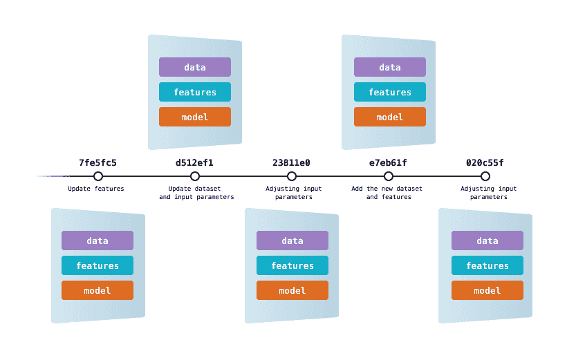
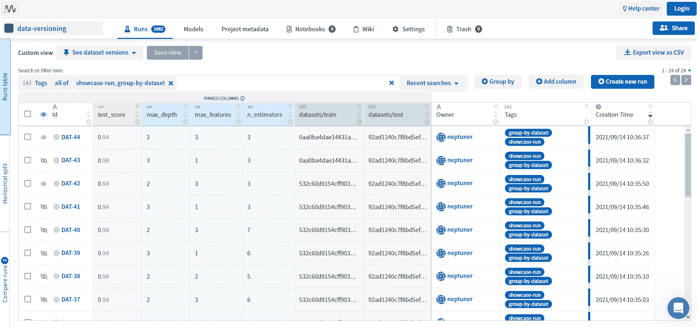

# 如何在 ML 中对各种数据源的数据进行版本控制

> 原文：<https://web.archive.org/web/https://neptune.ai/blog/data-versioning-control-for-various-data-sources>

数据版本控制是机器学习中的一个重要概念，因为它允许跟踪和管理数据随时间的变化。由于数据是任何机器学习项目的基础，因此有必要建立一个系统来跟踪和管理数据随时间的变化。然而，数据版本控制经常很少被关注，导致诸如数据不一致和无法再现结果之类的问题。

在本文中，我们将讨论数据版本控制在机器学习中的重要性，并探索用不同类型的数据源实现它的各种方法和工具。

## 什么是机器学习中的数据版本化？

在机器学习中，数据是建立和训练模型的基础。因此，建立一个系统来跟踪和管理数据随时间的变化是至关重要的。这就是数据版本控制的用武之地。

### 机器学习与传统软件工程中的数据版本控制

机器学习和常规软件工程中的数据版本控制有一些相似之处，但也有一些关键差异需要考虑。

在这两种情况下，数据版本控制系统的主要目标是跟踪和管理数据随时间的变化。这允许在必要时恢复到以前的版本，以及了解所做更改的历史。

但是，我们需要考虑一些关键差异:

#### 数据的大小和复杂性

在机器学习中，我们经常处理大量的数据。基本上每个机器学习项目都需要数据。但是，数据工程师和数据库管理员在与机器学习无关的项目中处理、控制和存储万亿字节的数据并不罕见。

当谈到数据复杂性时，可以肯定的是，在机器学习中，我们正在处理更复杂的数据。首先，机器学习工程师和数据科学家经常使用不同数据供应商的数据。一些数据集正由数据输入专家和人工检查员进行校正。来自不同格式、数据库和来源的数据被组合在一起进行建模。数据科学家通常应用不同的数据插补和转换技术来创建具有特征的数据集。有时甚至元学习模型被用来产生元特征。

#### 多种工具和技术

机器学习通常包括使用许多不同的工具和技术。这些工具可能有自己的版本控制系统，很难与更广泛的数据版本控制系统集成。

例如，我们的数据湖可能包含各种关系和非关系数据库、不同格式的文件以及使用不同云提供商存储的数据。数据科学家也可以为特征或特征存储建立单独的文件，并使用各种工具进行模型版本控制和实验跟踪。

考虑到工具和数据类型的范围，单独的数据版本逻辑将是必要的。不同的团队角色也可能在不同的阶段负责版本化数据。例如，数据工程师和数据库管理员可能处理数据湖中原始数据的版本控制，而数据科学家可能负责与实验跟踪相关的特征和数据的版本控制文件。


*Different data sources and states in an MLOps project | [Source](https://web.archive.org/web/20230207023204/https://www.nextlytics.com/blog/feature-stores-in-machine-learning-architectures)*

### 为什么数据版本化在机器学习中很重要？

数据版本化在机器学习中很重要，原因有几个:

*   数据是不断发展的——在机器学习中，数据通常是在很长一段时间内收集和修改的。通过使用数据版本化系统，可以跟踪数据更改的历史，并在需要时轻松恢复到以前的版本。
*   再现性–数据版本化对于再现之前实验的结果至关重要。如果没有所用数据的清晰记录，可能很难或不可能重现相同的结果。
*   协作——在团队环境中，多人可能同时处理相同的数据。数据版本化允许团队成员看到其他人所做的更改，并确保每个人都在使用最新版本的数据。
*   可审计性–为了符合法规，可能有必要证明数据的来源。数据版本允许数据的可追溯性，并有助于检测篡改，确保数据的完整性。

### 选择数据版本控制工具的关键标准是什么？

[为了确定适合我们工作流程](/web/20230207023204/https://neptune.ai/blog/best-data-version-control-tools)的数据版本管理工具，我们应该考虑:

*   易用性–在工作流程中使用该工具有多简单？融入一个项目需要很多时间吗？
*   数据支持——它支持项目需要的所有数据类型吗？
*   协作选项——是否有多个团队成员可以共享和访问数据的选项？
*   多样化集成–它是否集成了流行的 MLOps 工具？它如何适应当前的基础架构、堆栈或模型培训工作流？

下面，我们将介绍一些值得探索的数据版本控制工具。

### TL；速度三角形定位法(dead reckoning)

如果您想快速查看哪个工具提供了什么功能，这里有一个表格可供参考。

### DVC

数据版本控制 [DVC](https://web.archive.org/web/20230207023204/https://dvc.org/) 是一个针对数据和机器学习团队的版本控制系统。它是一个免费的开源命令行工具，不需要数据库、服务器或任何特殊服务。它有助于跟踪和管理机器学习项目中使用的数据和模型，并允许复制结果的能力。

借助 DVC，我们可以使用 Git 提交来跟踪数据和模型的版本，并将它们存储在本地或云存储中。DVC 还使我们能够轻松地在不同版本的数据之间切换。



*Data version control* DVC *| [Source](https://web.archive.org/web/20230207023204/https://dvc.org/doc/use-cases/versioning-data-and-models)*

DVC 应该和 Git 一起使用。事实上，Git 和 DVC 命令经常被依次使用。Git 用于存储和版本控制代码，DVC 对数据和模型文件做同样的事情。虽然 Git 可以在本地存储代码，也可以在 GitHub、GitLab 和 Bitbucket 等托管服务上存储代码，但 DVC 使用远程存储库来存储所有数据和模型。远程存储库可以在同一台计算机上，也可以在云上。它支持大多数主要的云提供商，如 AWS、GCP 和 Azure。

DVC 的数据版本控制非常简单明了。例如，我们需要做的第一件事是在我们的目录中初始化 Git 和 DVC:

接下来，我们使用以下命令向 DVC 跟踪添加一个数据文件:

之后，DVC 将指示我们添加在最后一个命令之后生成的两个新文件:

```py
 ```
git add data/.gitignore data/data.csv.dvc
```py 
```

然后我们用 Git 提交这两个文件:

```py
 ```
git commit -m "add raw data"
```py 
```

当我们在远程存储库中存储数据时，会创建一个. dvc 文件。它是一个带有 md5 哈希的小文本文件，指向远程存储中的实际数据文件。此外，这个文件应该与代码一起存储在 GitHub 中。当我们下载一个 Git 存储库时，我们也获得了。我们用来下载相关数据的 dvc 文件。

要添加远程存储，我们使用命令:

```py
 ```
dvc remote add -d storage gdrive://google_drive_id
git commit .dvc/config -m "Configure remote storage"
```py 
```

最后，我们需要推动数据:

如果我们更新了数据集，我们需要再次添加、提交和推送更改:

```py
 ```
dvc add data/data.xml
git add data/data.xml.dvc
git commit -m "Dataset update"
dvc push

```py 
```

在此之后，又有一个文件将被添加到我们的远程存储中。现在，如果我们想恢复到文件的先前版本，我们可以使用 Git 命令列出所有提交:

它将列出所有带有提交消息的提交散列。使用 checkout 命令，我们可以恢复到我们想要的任何提交版本:

```py
 ```
git checkout b11343a
dvc checkout

```py 
```

正如我们所见，DVC 与 Git 非常相似，使用 DVC，我们可以对任何我们想要的文件进行数据版本控制。更多关于 DVC 的有用资源:

**此时，一个问题出现了；为什么用 DVC 而不是 Git？**

有几个原因可以解释为什么 Git 本身不是数据版本控制的最佳工具:

## 

*   1 Git 是为文本文件版本化而设计的，并不是为处理大文件而优化的。这可能会降低大型数据集或模型的版本控制效率。
*   Git 将所有文件版本存储在存储库中，随着时间的推移，这会导致存储库变得非常大。这使得对大型数据集或模型进行版本控制变得不切实际。
*   3 Git 不提供专门为数据版本化设计的特性，比如数据血统跟踪或支持不同版本数据之间的切换。

尽管如此，Git 还有一个扩展，叫做 Git LFS，它被设计用来更有效地处理大型二进制文件。

### 去吧，LFS

[Git-LFS](https://web.archive.org/web/20230207023204/https://git-lfs.com/) (Git 大文件存储)在 Git 内部用文本指针替换大文件，同时将文件内容存储在像 GitHub.com 或 GitHub Enterprise 这样的远程服务器上。有了 Git，LFS 可以使用相同的 Git 工作流来版本化大文件。

最初，这个工具是由游戏开发人员开发的，用于更有效地管理 Git 存储库中的大型二进制文件，如游戏资产。Git LFS 后来被机器学习和研究专业人员采用，他们也有大型文件，如模型和数据，以保持他们与相关代码的联系。


Versioning with Git LFS | [Source](https://web.archive.org/web/20230207023204/https://git-lfs.com/)

值得一提的是[有一个文件存储限制](https://web.archive.org/web/20230207023204/https://docs.github.com/en/repositories/working-with-files/managing-large-files/about-git-large-file-storage)。例如，在 GitHub.com，2GB 免费或 5GB 企业云选项。与 DVC 相反，这个工具不是专门为机器学习项目创建的，不提供数据沿袭跟踪，也不是 MLOps 工具。

Git LFS 的设置可能有点复杂，但是一旦完成，我们就像平常使用 Git 一样使用它。我们唯一需要做的事情是指定我们想要跟踪的文件类型。例如，如果我们想追踪。tsv 文件，我们使用命令:

只有以这种方式跟踪的文件类型存储在 Git LFS 中，而不是标准的 Git 存储中。

关于 Git LFS 的更多信息可以在这里找到:

### neptune.ai

neptune.ai 是一个实验跟踪和模型注册工具，为从事许多实验的 ML 团队而构建。它提供了跟踪、组织和存储来自机器学习实验的元数据的选项。此外，使用 Neptune，可以可视化和比较结果，以及进行模型和数据版本控制。

[](app.neptune.ai/common/data-versioning/experiments?compare=CwJgNCQ&split=tbl&dash=artifacts&viewId=0d305ea6-3257-4193-9bf0-a7eb571343a1&base=DAT-44&to=DAT-42)

*Experiment tracking and data versioning with neptune.ai | [See in the app](https://web.archive.org/web/20230207023204/https://app.neptune.ai/common/data-versioning/experiments?compare=CwJgNCQ&split=tbl&dash=artifacts&viewId=0d305ea6-3257-4193-9bf0-a7eb571343a1&base=DAT-44&to=DAT-42)*

有了 Neptune 工件，就有可能从本地目录或任何 S3 兼容的存储中对数据集、模型和任何文件进行[版本化。基本上，它会创建一个 MD5 哈希，该哈希取决于文件内容和元数据，如路径、大小和上次修改时间。对其中任何一项的更改都会导致不同的哈希。](https://web.archive.org/web/20230207023204/https://docs.neptune.ai/tutorials/data_versioning/)

除了哈希之外，还可以使用以下方法来对数据文件进行版本控制:

*   文件或文件夹的位置和名称
*   以 KBs 为单位的文件大小
*   上次修改的数据

一旦记录了元数据，就很容易选择实验的具体运行，并比较工件是如何变化的。

Neptune 中的工件跟踪可以用几行代码实现。例如，如果我们想跟踪一个文件，我们需要导入 neptune 包，初始化 run，并调用“track_files”方法:

```py
 ```
import neptune.new as neptune
run = neptune.init_run()
run["train/dataset"].track_files("./datasets/train.csv")

```py 
```

或者如果我们需要跟踪一个文件夹:

```py
 ```
run["train/images"].track_files("./datasets/images")

```py 
```

为了存储来自亚马逊 S3 的工件，我们需要配置一个具有“S3ReadAccessOnly”权限的 IAM 策略，并将我们的 AWS 凭证存储为环境变量。为此，我们在 Linux/macOS 上使用“导出”命令，在 Windows 上使用“设置”命令:

```py
 ```
export AWS_SECRET_ACCESS_KEY='Your_AWS_key_here'
export AWS_ACCESS_KEY_ID='Your_AWS_ID_here'

```py 
```

为了从工件中获取元数据，我们使用“fetch_files_list”方法:

```py
 ```
artifact_list = run["train/images"].fetch_files_list()

```py 
```

它返回具有以下属性的 ArtifactFileData 对象:

file_hash:文件的哈希。

*   file_path:文件的路径，相对于虚拟工件目录的根目录。
*   size:文件的大小，以千字节为单位。
*   元数据:包含关键字的字典:
*   file_path:文件的 URL(本地或 S3 兼容存储中的绝对路径)。
    *   last_modified:上次修改文件的时间。

总之，Neptune 是一个简单快速的数据版本控制选项，但是它可能不像 DVC 那样提供所有的数据版本控制功能。

更多关于海王星:

傻瓜

### Dolt 是一个 SQL 数据库，用于版本控制和数据共享。它有 Git 语义，包括克隆、分支、合并、推和拉的特性。Dolt 还提供了查询和分析数据的工具，以及从其他来源导入和导出数据的工具。

与 DVC 和 Neptune 不同，Dolt 是一个数据库管理系统，旨在对存储在表中的数据进行版本控制和共享。这意味着我们不能直接对 CSV 文件或任何非结构化数据(如图像)进行版本控制。相反，有一个选项可以导入几种不同的文件格式。

更准确地说，我们可以将以下格式加载到 Dolt 中:

CSV、JSON、检察官办公室

*   MySQL 数据库
*   Postgres
*   电子表格
*   例如，要转储一个 MySQL 数据库“test”并将其加载到 Dolt 中，命令如下:

或者，我们可以使用命令将 postgres 数据库加载到 dolt 中:

```py
 ```
mysqldump --databases test -P 3306 -h 0.0.0.0 -u root -p > dump.sql
dolt sql < dump.sql

```py 
```

其中 [pg2mysql](https://web.archive.org/web/20230207023204/https://github.com/dolthub/pg2mysql) 是他们的定制工具。

```py
 ```
./pg2mysql.pl < file.pgdump > mysql.sql
dolt sql < mysql.sql
```py 
```

对于版本控制，Dolt 有多个分支，并将所有数据存储在一个提交图中，就像 Git 一样。它允许处理不同的分支，合并它们，解决冲突，查询历史等等。

例如，在导入数据库之后，为了进行初始提交，我们使用一个命令:

与 Git 一样，为了在新的分支上进行更改，我们使用 checkout 作为:

```py
 ```
call dolt_commit('-m', 'Created initial schema')
```py 
```

除此之外，Dolt 还提供了一个内置备份和监控的云托管数据库服务器。该产品的价格根据实例的 CPU、RAM、网络速度和磁盘空间而有所不同。

```py
 ```
call dolt_checkout('-b','modifications');
insert INTO employees (id, first_name, last_name) values (4,'Daylon', 'Wilkins');
call dolt_commit('-am', 'Modifications on a branch')
```py 
```

更多关于 Dolt:

莱克夫斯

[LakeFS](https://web.archive.org/web/20230207023204/https://lakefs.io/) 是一个开源的数据湖的数据版本控制和管理平台。有了 lakeFS，就有可能在生产数据之上测试 ETL，不需要复制任何东西。此外，lakeFS 可以用于数据管理、ETL 测试、实验的可再现性，以及数据的 CI/CD，以防止未来的失败。LakeFS 完全兼容许多数据工程工具的生态系统，如 AWS、Azure、Spark、Databrick、MlFlow、Hadoop 等。

### 例如，使用 lakeFS，可以在带有默认分支的 S3 存储桶上创建一个存储库。然后，使用一个单独的分支，我们可以将文件导入到存储库中。如果文件已经在 S3 上，导入不会复制文件，而是复制这些文件位置的[范围和元范围](https://web.archive.org/web/20230207023204/https://docs.lakefs.io/understand/how/versioning-internals.html#constructing-a-consistent-view-of-the-keyspace-ie-a-commit)。类似地，我们可以将新的分支合并到主生产分支中，并使用其他 Git 特性，如分支、合并、区分等。

关于部署，lakeFS 是一个无状态数据版本化平台，具有无共享架构，可以使用 K8s 和 helm chart 部署在负载平衡器后面的多个实例上。或者，它可以用作托管云服务，用户将 lakeFS 作为服务使用，数据位于用户的存储桶之上。

关于 LakeFS 的更多信息:


lakeFS version control system | [Source](https://web.archive.org/web/20230207023204/https://docs.lakefs.io/)

三角洲湖

[Delta lake](https://web.archive.org/web/20230207023204/https://delta.io/) 是一个开源存储层，设计用于处理数据湖。它允许在现有的数据湖(如亚马逊 S3、Azure 数据湖存储、谷歌云存储和 HDFS)上进行数据版本控制、ACID 事务和模式管理。Delta lake 通过在数据湖之上构建 Lakehouse 体系结构，为数据湖带来了可靠性。这使得构建强大的数据管道和进行更复杂的数据分析变得更加容易。

### 关于数据版本化，Delta lake 有一个叫做“时间旅行”的选项。它支持回滚、完整的历史审计跟踪和可重复的机器学习实验。通过时间旅行，可以查询增量表的旧快照，这有助于重新创建分析和报告，修复数据中的错误，并为快速变化的表的一组查询提供快照隔离。例如，要查询一个旧的快照，我们可以使用 SQL 语法:

其中时间戳表达式可以是:

```py
 ```
SELECT * FROM table_name TIMESTAMP AS OF timestamp_expression
```py 
```

“2023-01-30”(日期字符串)

current _ timestamp()–间隔 12 小时

*   任何其他可以转换为时间戳的表达式

*   **总之，Data lake 允许构建 Lakehouse 体系结构，这是一种结合了数据湖和数据仓库的最佳元素的体系结构，并且它具有数据版本控制的选项。**

关于三角洲湖的更多信息:

迟钝的人

[Pachyderm](https://web.archive.org/web/20230207023204/https://www.pachyderm.com/) 是一个用于数据科学和机器学习的开源平台，使数据科学家和工程师能够轻松开发、版本化和部署他们的数据管道。它提供了一种可扩展的、安全的方式来管理、版本化和分析大型数据集，并建立在 Docker 和 Kubernetes 等技术之上。此外，该平台与代码和基础设施无关。这意味着通过 Pachyderm，我们可以使用任何语言、库，将其与标准数据处理和机器学习工具或主要的云提供商集成。

### Pachyderm 在其数据驱动的管道中有一个内置的版本控制功能。该软件允许用户定义最小的数据单位，称为“数据”，然后用机器学习模型处理数据。这允许 Pachyderm 使用全局 ID 跟踪每个数据随时间的变化。这种版本控制和 ID 跟踪用于扩展数据处理，并仅在有新的或不同的数据要处理时触发数据管道，使其比其他只将数据集视为整体的管道工具更有效。

关于厚皮动物的更多信息:


*Integration with some popular tools | [Source](https://web.archive.org/web/20230207023204/https://www.pachyderm.com/products/)*

结论

在本文中，我们描述了一些数据版本控制工具以及如何使用它们进行数据版本控制。它们可用于对各种数据源进行数据版本控制。例如:

## 为了在实验跟踪环境中对数据集和模型进行版本化，我们可以使用 **Neptune。**

要用类似 Git 的体系结构对任何类型的数据文件进行版本控制，我们可以使用 **DVC 或 Git LFS。**

*   对于存储在表中的版本数据集， **Dolt** 可能会有用。
*   对于数据湖或数据湖屋，我们描述了**湖和**三角洲湖。****
*   **Pachyderm** 是一个可以用来优化数据管道和管理数据版本控制的工具。
*   参考
*   **Pachyderm** is a tool that can be used to optimize data pipelines and manage data version control.

### References