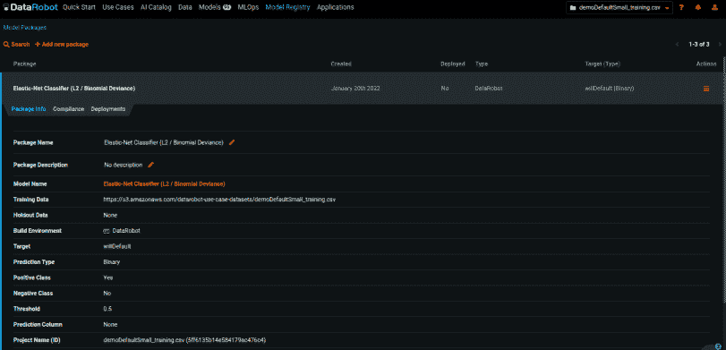
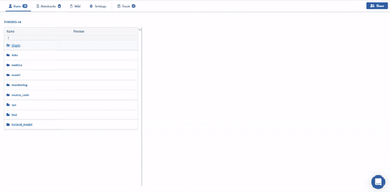
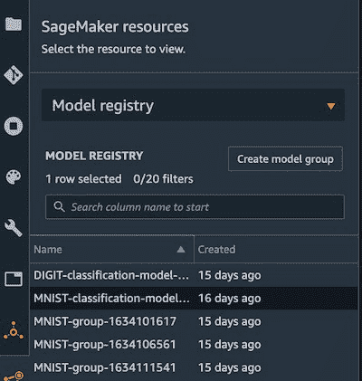
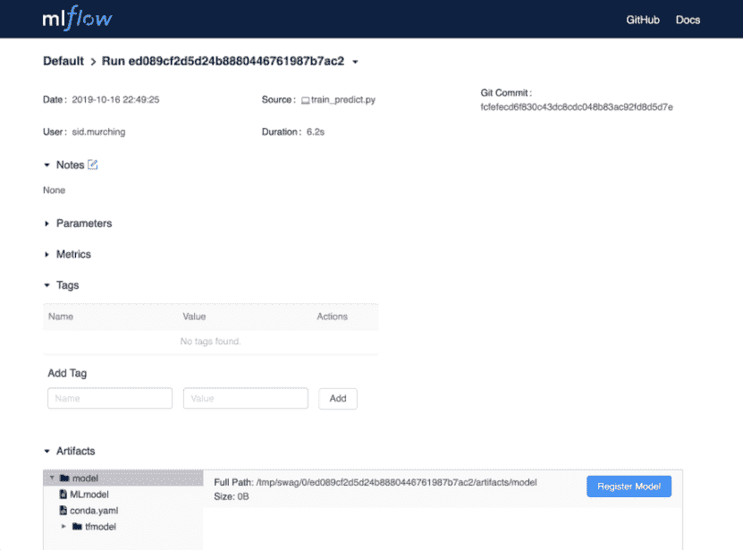
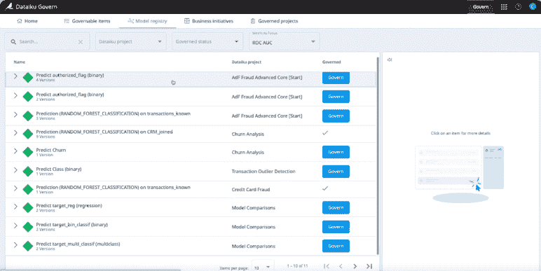

# 模型注册的最佳数据机器人替代方案

> 原文：<https://web.archive.org/web/https://neptune.ai/blog/datarobot-alternatives-for-model-registry>

DataRobot 是一个企业人工智能平台，它为企业提供了构建、管理和部署大规模模型的工具，并实现了端到端 ML 生命周期的自动化。它包含不同类型的模型、数据、最新的开源算法，可以在内部使用，或者作为一种完全托管的人工智能服务，DataRobot 为您提供人工智能的力量，以推动更好的业务成果。DataRobot 中的一个重要组件是它的模型注册表。

[DataRobot 模型注册中心](https://web.archive.org/web/20220926104337/https://docs.datarobot.com/en/docs/mlops/deployment/registry/index.html)是 DataRobot 平台上使用的各种模型的中央组织中心。它包含每个模型，并将它们注册为一个部署就绪的模型包。

DataRobot 模型注册表提供以下功能:

*   一个注册所有模型的中心，无论其来源或部署位置如何。
*   它以相同的方式处理每个包功能，而不管其模型的来源。
*   它为整个企业的机器学习模型提供了统一的部署体验。您还可以将 DataRobot 中的模型部署到外部源。
*   DataRobot model registry 有一个[定制模型工作室](https://web.archive.org/web/20220926104337/https://docs.datarobot.com/en/docs/mlops/deployment/custom-models/index.html)，在这里您可以创建和部署定制模型。
*   您还可以创建定制的模型推断，并添加外部模型包，以便在模型注册中心中使用。
*   DataRobot 提供了一个排行榜，用于比较模型注册表中的所有模型。该排行榜还提供了模型训练过程中使用的功能和技术的说明，并允许了解更多关于它训练了多少数据的详细信息，以及它的整体准确性分数。

DataRobot 模型注册中心的主要目的是[存储所有的模型元数据](/web/20220926104337/https://neptune.ai/blog/ml-metadata-store),这些元数据是在整个商业企业中再现和部署所需要的。反过来，这将允许数据科学团队在需要时轻松找到所有与模型相关的元数据。

*DataRobot model registry | [Source](https://web.archive.org/web/20220926104337/https://www.datarobot.com/), image taken by author*

然而，DataRobot 模型注册表可能不是您团队的最佳选择，原因如下:

*   DataRobot 模型注册表是 DataRobot 平台的组件之一，因此要使用它，您的团队必须将整个机器学习基础架构迁移到 DataRobot 平台。
*   DataRobot 与其他框架和库的 API 集成并不容易使用。
*   DataRobot 仅存储部署就绪的模型，即不存储需要持续训练的实验模型。
*   谈到数据处理，DataRobot 只处理小数据，除非您使用的是企业版。如你所知，每一个模型都和它被训练的数据量一样好。
*   此外，不能在 DataRobot 中编辑数据。即没有数据清理或 ETL 功能。数据必须在系统外编辑，然后再次输入。
*   不能导出 DataRobot 中使用的基础代码。
*   DataRobot 不太适合无监督学习和没有足够数据可用的场景。
*   在 DataRobot 上，可以同时运行多少个模型是有限制的。每次不超过两个。

因此，我们有必要为模型注册寻找一些替代工具。

## 1.海王星

Neptune 是 MLOps 的一个[元数据存储库，为运行大量实验的研究和生产团队而构建。它提供了一个中央存储，用于记录、存储、显示、组织、比较和查询机器学习生命周期中生成的所有元数据。](/web/20220926104337/https://neptune.ai/)

*   它[支持并存储](https://web.archive.org/web/20220926104337/https://docs.neptune.ai/you-should-know/what-can-you-log-and-display)许多与 ML 模型相关的元数据类型，您可以对模型构建过程中生成的大多数元数据进行版本化、显示和查询。
*   Neptune model registry 帮助您存储和记录模型、数据集、环境配置版本、超参数和模型度量的元数据。

*Neptune model registry | [Source](/web/20220926104337/https://neptune.ai/product/model-registry)*

### 特征

*   从 [Neptune 仪表盘](https://web.archive.org/web/20220926104337/https://docs.neptune.ai/you-should-know/organizing-and-filtering-runs)中，您可以:
    *   基于度量和参数值的搜索，
    *   查找带有用户定义标签的运行，
    *   基于参数或标签值的组模型训练运行。
*   Neptune [versions，](https://web.archive.org/web/20220926104337/https://docs.neptune.ai/how-to-guides/data-versioning)并将您的所有模型训练运行存储在其中央注册库。
*   Neptune 版本和存储所有类型的模型元数据，如 pkl 文件、数据元数据、图像、数据、图表等。
*   Neptune 允许您通过 UI 或客户端库记录模型信息。
*   结合其模型注册功能，Neptune 允许您跟踪模型元数据的变化。
*   你可以[在模型训练跑步之间进行比较](https://web.archive.org/web/20220926104337/https://docs.neptune.ai/you-should-know/comparing-runs),并深入了解它们之间的差异。
*   Neptune 已经[集成了 ML 框架和库](https://web.archive.org/web/20220926104337/https://docs.neptune.ai/integrations-and-supported-tools/intro)包括 PyTorch、TensorFlow、Keras、XGBoost 等。
*   Neptune model registry 允许 ML 团队的[协作，因为它允许团队从其中央存储中探索所有与模型相关的元数据。](https://web.archive.org/web/20220926104337/https://docs.neptune.ai/you-should-know/collaboration-in-neptune)

### 定价

Neptune 为云和您的私有基础架构提供定价计划。有几个可用的计划:

*   个人:免费(超出免费配额的使用量)
*   学术界:免费
*   团队:付费

查看[海王星的定价](/web/20220926104337/https://neptune.ai/pricing)了解更多信息。

## 2.SageMaker 模型注册表

SageMaker 是一个完全托管的工具，可以用于 ML 开发的每个阶段，包括模型注册。它帮助用户在一个统一的可视化界面中构建、调试、部署以及充分监控 ML 模型所需的一切。

[SageMaker 模型注册表](https://web.archive.org/web/20220926104337/https://docs.aws.amazon.com/sagemaker/latest/dg/model-registry.html)提供以下内容:

*   一个可搜索的集中存储区，用于存储模型和与模型相关的元数据，以实现可再现性。
*   每次实验性训练运行的版本控制和跟踪。
*   将模型从模型注册中心部署到现有的 Sagemaker 端点。

Sagemaker Model Registry 允许您连接到 Amazon SageMaker Model Monitor，在部署后持续实时监控您的机器学习模型的质量。

*Sagemaker model registry component | [Source](https://web.archive.org/web/20220926104337/https://miro.medium.com/max/400/1*lRTUeVGiXH9SorWbW4c6kw.jpeg)*

### 特征

*   Sagemaker 有一个系统，可以帮助为生产编制模型目录。根据模型类型和内容对它们进行分类和存储。
*   在 Sagemaker 模型注册表中，模型可以快速地转移到生产中。它通过 CI/CD 实现了自动化的模型部署。
*   Sage maker 允许您从一种硬件配置切换到另一种配置，它能够提供和管理您的模型环境的硬件基础设施
*   Jupyter 笔记本易于创建和共享。
*   它有超过 150 种预设模型可用于多种情况。
*   可以创建模型组来监视已经被训练来解决某些问题的模型。然后，这些模型可以被存储并制作成新的模型版本。
*   SageMaker Studio 支持其他几个框架，如 Tensorflow、PyTorch、MXNet 等

### 定价

对于 Sagemaker，它是按使用付费的。有两种支付方式可供选择:

*   **按需定价**:按秒计费，没有最低费用或前期承诺。
*   **sage maker 节约计划**:这提供了一个灵活的、基于使用量的定价模式，以换取对一致使用量的承诺。

[AWS 定价计算器](https://web.archive.org/web/20220926104337/https://calculator.aws/)可用于管理您的账单。另外，查看[定价页面](https://web.archive.org/web/20220926104337/https://aws.amazon.com/sagemaker/pricing/)了解详细信息。

## 3.MLflow 模型注册表

[MLflow model registry](https://web.archive.org/web/20220926104337/https://www.mlflow.org/docs/latest/model-registry.html) 是一个自给自足的系统，包括一个 UI、一组 API 和一些概念，能够有效地管理 MLflow 模型的生命周期。包括阶段转换、模型版本控制和注释。MLflow model registry 存储模型工件、元数据、参数和度量。

*MLflow model registry dashboard | [Source](https://web.archive.org/web/20220926104337/https://www.mlflow.org/docs/latest/model-registry.html#ui-workflow)*

### 特征

*   MLflow 模型注册表与 MLflow 跟踪组件协同工作。这允许您回溯到生成模型和数据工件的原始来源，包括其源代码版本，从而为所有模型和数据转换生成生命周期的完整谱系。
*   MLflow Model Registry 包含 API 和智能 UI，可以轻松注册和共享新的模型版本。当然还要对现有模型进行生命周期管理。
*   MLFlow 能够再现实验和报告/结果。
*   使用 MLFlow，您可以在数据湖中存储的数据存储到增量表或目录时立即对其进行版本控制。
*   每个型号版本都有一个分配的预设。例如，“生产”描述了模型的生命周期。

### 定价

它是免费的。

## 4.彗星

[慧星](https://web.archive.org/web/20220926104337/https://www.comet.ml/)是一个机器学习，基于云的实验管理平台。Comet model registry 提供了一个系统，用于通过 Python SDK 实验来记录、注册、版本化和部署机器学习模型，以及注册、版本化和部署它们。

Comet 简化了记录实验历史和模型版本的过程。

模型训练跑步通过以下方式在 Comet 中注册:

*   Comet.ml 实验的资产选项卡用户界面
*   通过 Comet Python SDK 以编程方式

*Card view of Comet model registry | [Source](https://web.archive.org/web/20220926104337/https://www.comet.ml/site/using-comet-model-registry/)*

### 特征

*   Comet 兼容大多数平台和机器学习库。
*   Comet 通过将代码、超参数、指标和依赖项放在一个用户界面中，让您可以轻松地比较实验。
*   自动通知系统使用户能够持续监控模型的性能。从而提高项目的整体质量。
*   凭借其可视化和报告的内置特性，comet 允许个人开发人员和专业团队进行交流，并在实验发生时运行和跟踪实验。

### 定价

Comet 提供以下定价方案:

*   个人:免费(超出免费配额的使用量)
*   学术界:免费
*   团队:付费

你可以在这里阅读他们的详细定价[。](https://web.archive.org/web/20220926104337/https://www.comet.ml/site/pricing/)

## 五分钟

[Verta](https://web.archive.org/web/20220926104337/https://www.verta.ai/) 是一个 AI/ML 模型管理和操作工具，具有模型注册功能，您可以在中央空间管理和部署您的机器学习模型。

Verta 使您能够简化数据科学和 ML 工作流程。它还有助于更快地将模型部署到生产中，同时确保实时模型健康。

### 特征

*   Verta model registry 为发布就绪模型提供了一个中心基础。
*   Verta model registry 连接到实验组件，使得重用训练过的模型变得容易。
*   Verta model registry 帮助您管理模型治理。
*   Verta 在 Docker 和 Kubernetes 上运行良好。可以与 Tensorflow、PyTorch、Spark.ml 和 r 等 ML 工具集成。
*   Verta 可以轻松地与 Jenkins、Chef 和 GitOps 等 CI/CD 管道集成。
*   Verta 也因其类似 Git 的环境而闻名。让有经验的 g it 用户(和其他开发人员)非常方便和熟悉。

### 定价

Verta 提供以下定价方案:

*   开源:免费
*   SaaS:付费
*   企业:付费

你可以在这里阅读他们的详细定价[。](https://web.archive.org/web/20220926104337/https://www.verta.ai/pricing)

## 6.大太酷

Dataiku 为企业的 ML 模型的设计、部署和管理提供了一个中心解决方案。它为团队提供自助分析和协作，以提高工作效率。

当在 Dataiku DSS 上设计和训练模型时，它们被存储在 Lab 中，Lab 充当它的模型注册库。

Dataiku model registry 是 Dataiku 中模型的中央存储。它允许通过 MLflow 存储外部模型。Dataiku 模型注册表提供了一个中心点:

*   探索模型及其版本。
*   跟踪模型版本的状态
*   跟踪简单输入随时间的漂移。
*   存储模型参数和数据沿袭。

*Dataiku model registry dashboard | [Source](https://web.archive.org/web/20220926104337/https://doc.dataiku.com/dss/10.0/governance/model-registry.html)*

### 特征

*   Dataiku 提供了一个仪表板，用于监控模型操作和培训。
*   Dataiku 提供了模型和数据血统。
*   Dataiku 为数据清理、分析和验证提供了一套交互式功能。
*   它为模型提供了从模型构建到部署的端到端管理。
*   数据 DSS 是数据不可知的。
*   Dataiku 有一个健壮的部署 API，可以将模型交付给生产。
*   数据流非常容易可视化。数据模型可以用图片和表格的形式来表示，而不是到处都有不同的文件。
*   您可以自由选择您的数据库格式，可用选项包括 SQL、NoSQL 和 HADOOP。
*   Dataiku 使用其 API 与 Tensorflow、Keras、XGboost 等框架和外部库(H2O、数据等)集成。

### 定价

Dataiku 提供在线或内部安装或在您的云堆栈上安装的服务。它提供 14 天的试用版，之后起价为每月 499 美元。点击阅读[更多关于定价的信息。](https://web.archive.org/web/20220926104337/https://www.dataiku.com/product/plans-and-features/)

## 模型注册的 DataRobot 替代方案的比较

## 结论

DataRobot model registry 是 DataRobot 平台中的一个很好的组件，它促进了团队内的可重复性和协作，但是如上所述，它可能并不总是最适合您的团队。

像 Neptune、Sagemaker Model registry、Dataiku、MLflow 这样的替代模型注册工具将允许 ML 团队执行更好的模型注册和治理。

还有像 [Azure Model Registry](https://web.archive.org/web/20220926104337/https://docs.microsoft.com/en-us/azure/machine-learning/concept-model-management-and-deployment#register-package-and-deploy-models-from-anywhere) 、 [Tensorflow](https://web.archive.org/web/20220926104337/https://www.tensorflow.org/resources/models-datasets) 、 [Determined AI](https://web.archive.org/web/20220926104337/https://docs.determined.ai/0.12.13/tutorials/model-registry.html) 这样的工具，他们的平台上都有模型注册表，你也可以去看看。

快乐实验！

### 小野寺次郎

机器学习工程师和研究员，对人工智能和人类福祉(医疗保健和教育)之间的交叉充满热情。在我的空闲时间，我喜欢尝试新的菜肴和看动漫。

* * *

**阅读下一篇**

## Continuum Industries 案例研究:如何跟踪、监控和可视化 CI/CD 管道

7 分钟阅读| 2021 年 8 月 9 日更新

[Continuum Industries](https://web.archive.org/web/20220926104337/https://www.continuum.industries/) 是一家基础设施行业的公司，希望自动化和优化线性基础设施资产的设计，如水管、架空传输线、海底电力线或电信电缆。

其核心产品 Optioneer 允许客户输入工程设计假设和地理空间数据，并且**使用进化优化算法来寻找可能的解决方案，以在给定约束的情况下连接 A 点到 B 点。**

首席科学家安德烈亚斯·马莱科斯(Andreas Malekos)致力于研究人工智能发动机，他解释道:

“建造像电力线这样的东西是一个巨大的项目，所以你必须在开始之前获得正确的设计。你看到的设计越合理，你就能做出更好的决定。Optioneer 可以在几分钟内为您提供设计资产，而成本只是传统设计方法的一小部分。”

但是，创建和操作 Optioneer 引擎比看起来更具挑战性:

*   目标函数不代表现实
*   有很多土木工程师事先不知道的假设
*   不同的客户给它提出完全不同的问题，算法需要足够健壮来处理这些问题

与其构建完美的解决方案，不如向他们展示一系列有趣的设计选项，以便他们做出明智的决策。

引擎团队利用来自机械工程、电子工程、计算物理、应用数学和软件工程的各种技能来实现这一目标。

## 问题

无论是否使用人工智能，构建一个成功的软件产品的一个副作用是，人们依赖它工作。当人们依赖您的优化引擎做出价值百万美元的基础设施设计决策时，您需要有一个强大的质量保证(QA)。

正如 Andreas 所指出的，他们必须能够说，他们返回给用户的解决方案是:

*   **好**，意思是这是一个土木工程师可以看到并同意的结果
*   **更正**，这意味着计算并返回给最终用户的所有不同工程数量都尽可能准确

除此之外，该团队还在不断改进优化引擎。但要做到这一点，您必须确保这些变化:

*   不要以这样或那样的方式破坏算法
*   实际上，它们不仅改善了一个基础设施问题的结果，还改善了所有问题的结果

基本上，您需要**建立适当的验证和测试，**但是团队试图解决的问题的性质带来了额外的挑战:

*   您无法自动判断算法输出是否正确。**这不像在 ML 中，你已经标记了数据**来计算你的评估集的准确度或召回率。
*   您**需要一组示例问题，代表算法在生产中需要解决的那类问题的**。此外，这些问题需要被版本化，以便尽可能容易地实现可重复性。

[Continue reading ->](/web/20220926104337/https://neptune.ai/customers/continuum-industries)

* * *