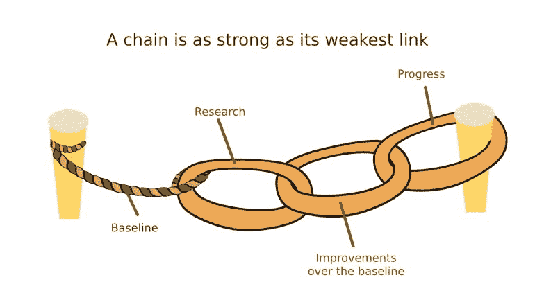
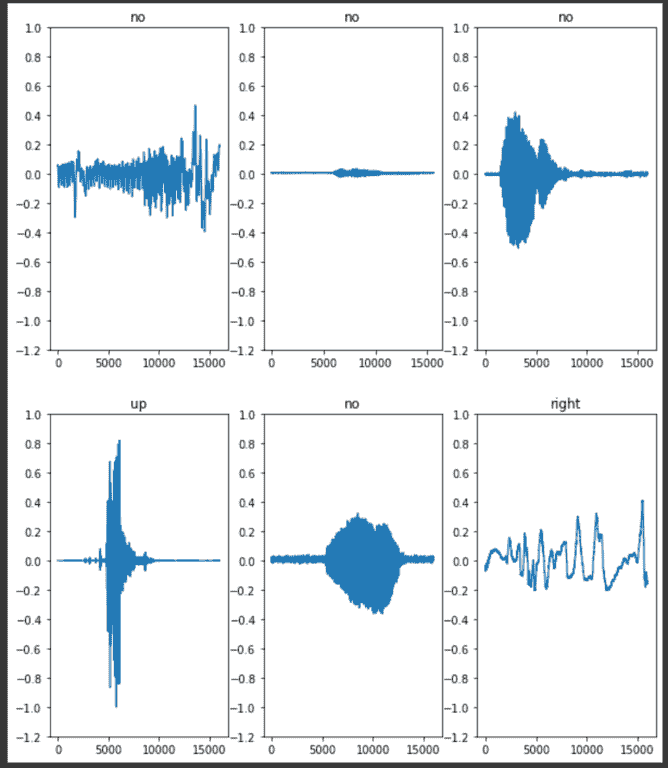
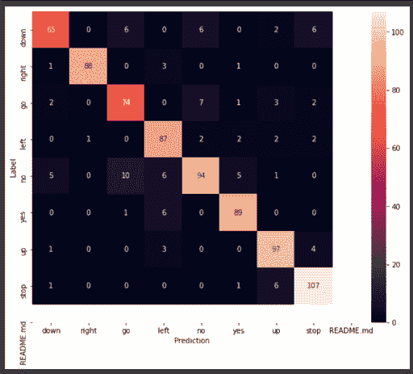

# 调试和可视化 TensorFlow/Keras 模型:实践指南

> 原文：<https://web.archive.org/web/https://neptune.ai/blog/debug-and-visualize-tensorflow-keras-model>

[调试](/web/20221206081625/https://neptune.ai/blog/model-debugging-strategies-machine-learning)在机器学习开发周期中起着很大的作用。一般来说，调试是所有类型的软件开发中的一个关键阶段——通常也是痛苦和耗时的。

有一种方法可以减轻痛苦。您可以尽早开始实现调试策略，不断测试您的组件，这将有可能产生一个高生产率的环境。

模型创建始于数据探索。接下来，我们为我们的模型和基线算法选择特征。最后，我们使用各种算法和调整参数来提高基线性能…

…这就是调试发挥作用的地方，以确保我们的基线模型做它们应该做的事情。从技术上来说，基线模型满足充分的标准，使其适合生产发布。

这可能看起来有点让人不知所措，构建和维护调试框架和策略可能会很昂贵和困难。幸运的是，您可以使用一个平台来完成这项工作。跟踪元数据、记录不同的研究模型、比较性能以及改进模型的功能和特征。

在本文中，我们将讨论模型调试策略，并使用 Neptune 及其 API 进行实际实现。

## 模型调试基础

机器学习中模型性能差可能由多种因素造成。这使得调试非常耗时。如果模型没有预测能力或具有次优值，则它们的表现很差。因此，我们调试我们的模型来确定问题的根源。模型性能差的一些常见原因包括:

*   模型特征缺乏足够的预测能力；
*   超参数被设置为次优值；
*   训练数据集具有通过模型过滤的缺陷和异常；
*   特征工程代码有 bug。

要记住的一个关键思想是，ML 模型一直被部署在越来越大的任务和数据集上。规模越大，调试你的模型就越重要。要做到这一点，你需要一个计划和一系列的步骤。这是:

### 模型调试的一般步骤

以下是机器学习中最有影响力的人常用的调试模式。

#### 1.检查模型是否正确预测标签

检查您的特征是否充分编码了预测信号。模型的准确性与单个特征对预测性的编码程度有很大关系。一种简单而有效的测量方法是使用相关矩阵来评估单个特征和标签之间的线性相关性。

另一方面，要素和标注之间的非线性相关性不会被相关矩阵检测到。相反，从数据集中选择一些模型可以轻松学习的示例。或者，使用容易学习的合成数据。

#### 2.建立模型基线

对你的模型质量的一个快速测试是将它与一个*基线进行比较。一个 ***模型基线*** 是一个简单的模型，它在一项任务中产生合理的结果，并不难建立。当创建一个新模型时，通过用你能想到的最简单的启发式模型预测标签来创建基线。如果你训练的模型超过了基线，你必须改进它。*

*

*“Good” results can be misleading if we compare against a weak baseline | Image source: [MLCMU](https://web.archive.org/web/20221206081625/https://blog.ml.cmu.edu/2020/08/31/3-baselines/) *

基线模型的例子有:

*   使用仅在数据集的最具预测性特征上训练的线性模型版本；
*   只关注预测最常见标签的分类模型；
*   预测平均值的回归模型。

#### 3.调整超参数值

通常，工程师首先调整的最有针对性的超参数是:

*   ***学习率*** :学习率由 ML 库自动设定。例如，在 TensorFlow 中，大多数 TF 估计器都使用 AdagradOptimizer，它将学习速率设置为 0.05，然后在训练期间自适应地修改该速率。或者，如果您的模型不收敛，您可以手动设置这些值，并选择 0.0001 到 1.0 之间的值。
*   ***正则化惩罚*** :如果你需要减少你的线性模型的大小，使用 L1 正则化。如果你想要更多的模型稳定性，使用 L2 正则化。增加模型的稳定性会使模型训练更具重现性。
*   ***批量*** :一个小批量一般有 10 到 1000 个批量。SGD 的批量大小为一。最大批量由机器内存中可以容纳的数据量决定。批量限制由您的数据和算法决定。
*   ***网络层数深度*** :一个神经网络的深度是指层数，而宽度是指每层的神经元数。随着相应问题的复杂性增加，深度和宽度也应该增加。常见的做法是将层的宽度设置为等于或小于前一层的宽度。稍后调整这些值有助于优化模型性能。

## 测试和调试您的 TensorFlow/Keras 模型

让我们解决事情的实际方面，并实际获得实施我们上面提到的要点的实践经验。我们将构建、训练和调试一个 TensorFlow 模型，执行简单的音频识别。我们将使用 Neptune，因为它是 Keras/TensorFlow 模型的完全可操作的扩展，我们将探索一些有趣的特性来管理和跟踪我们模型的开发。

### 从语音命令数据集开始

这个数据集包括超过 105，000 个 WAV 音频文件，内容是人们说的 30 个不同的单词。谷歌收集了这些信息，并通过许可在 CC 下提供。用谷歌的话说:

该数据集旨在帮助训练和评估关键词识别系统。它的主要目标是提供一种开发和测试小型模型的方法，这些模型可以检测何时从一组 10 个目标单词中说出一个单词，并尽可能减少由于背景噪声或无关语音造成的假阳性”。

链接到数据集的官方研究论文:[语音命令:有限词汇语音识别的数据集](https://web.archive.org/web/20221206081625/https://arxiv.org/pdf/1804.03209.pdf)。

我们将使用整个数据集的较小版本，并使用 TensorFlow.data API 下载它。

```py
data_dir = pathlib.Path('Documents/SpeechRecognition/data/mini_speech_commands')
if not data_dir.exists():
  tf.keras.utils.get_file(
      'mini_speech_commands.zip',
      origin="http://storage.googleapis.com/download.tensorflow.org/data/mini_speech_commands.zip",
      extract=True,
      cache_dir='.', cache_subdir='data')
```

开始你的海王星实验:

```py
run = neptune.init(project='aymane.hachcham/Speech-Recognition-TF',
                   api_token='YOUR_API_TOKEN') 
```

将所有相关元数据记录到您的 Neptune 仪表盘:

```py
run['config/dataset/path'] = 'Documents/SpeechRecognition/data/mini_speech_commands'
run['config/dataset/size'] = 105000
run['config/dataset/total_examples'] = 8000
run['config/dataset/examples_per_label'] = 1000
run['config/dataset/list_commands'] = ['down', 'go', 'left', 'no', 'right', 'stop', 'up', 'yes']
```

您还可以将音频样本记录到您的 Neptune dashboard，以便将所有元数据放在一起。目前，Neptune 支持 MP3、MA4、OGA 和 WAVE 音频格式。

```py
run['config/audio'] = neptune.types.File('/content/data/right_commad_Sample.wav')
```

在这里你可以检查数据集的一个音频样本:[一个右命令样本](https://web.archive.org/web/20221206081625/https://app.neptune.ai/aymane.hachcham/Speech-Recognition-TF/e/SPREC-6/all?path=config&attribute=audio)。

现在我们需要将所有的音频文件提取到一个列表中，并对其进行洗牌。然后，我们将把数据分割和隔离成训练集、测试集和验证集。

```py
train_samples = list_samples[:6400]
val_samples = list_samples[6400: 6400 + 800]
test_samples = list_samples[-800:]

print('Training set size', len(train_samples))
print('Validation set size', len(val_samples))
print('Test set size', len(test_samples))
```

### 调查数据

由于数据中的音频文件被格式化为二进制文件，您必须将其转换为数值张量。为此，我们将使用 TensorFlow Audio API，它包含许多方便的函数，如 decode_wav，可以根据采样率将 wav 文件解码为 Tensors。

采样率是指整个音频文件中每秒编码的样本数。每个样本代表特定时间音频信号的幅度。例如，16kHz 采样速率表示 16 位系统，其值范围为-32768 至 32767。

让我们解码音频文件，得到相应的标签和波形。

```py
def decode_audio(audio_binary):

  audio, _ = tf.audio.decode_wav(audio_binary)
  return tf.squeeze(audio, axis=-1)

def get_label(file_path):

  parts = tf.strings.split(file_path, os.path.sep)
  return parts[-2]

def audio_waveform(file_path):
  label = get_label(file_path)
  audio_binary = tf.io.read_file(file_path)
  waveform = decode_audio(audio_binary)
  return waveform, label
```

一旦我们的函数设置好了，我们将使用它们来处理训练数据，以便获得所有样本的波形和相应的标签。

```py
AUTOTUNE = tf.data.AUTOTUNE  
files_ds = tf.data.Dataset.from_tensor_slices(train_samples)
waveform_data = files_ds.map(audio_waveform, num_parallel_calls=AUTOTUNE)
```

绘制 6 个音频命令样本的 waveform_data:



*Waveforms and command labels from the training data*

您会注意到，即使对于相同的命令，波形也可能大不相同。这与声音的音高、音调和其他相关特征有关，这些特征使每个声音都很特别，几乎不可复制。

### 检查声音频谱图

频谱图显示了每个波形的频率随时间的变化，它们可以表示为 2D 图像。这是通过使用短时[傅立叶变换(STFT)](https://web.archive.org/web/20221206081625/https://en.wikipedia.org/wiki/Short-time_Fourier_transform) 将音频转换到时间-频率域来完成的。

STFT 将信号划分为时间窗口，并在每个窗口上执行傅立叶变换，保留一些时间信息并返回可以在其上执行标准卷积的 2D 张量。

幸运的是，TF 为我们提供了一个完美处理这项工作的 stft 函数:tf.signal.stft

我们需要设置先验参数来使用该函数。首先，设置帧长度和帧步长参数，使生成的谱图“图像”接近正方形。此外，我们希望各个波形与频谱图具有相同的长度，这样当我们将波形转换为频谱图时，结果将有望具有相同的维度。

```py
def get_spectrogram(waveform_sample):

  zero_pad = tf.zeros([16000] - tf.shape(waveform_sample), dtype=tf.float32)

  waveform = tf.cast(waveform_sample, tf.float32)
  equal_length = tf.concat([waveform, zero_pad], 0)
  spectrogram = tf.signal.stft(
      equal_length, frame_length=255, frame_step=128)

  spectrogram = tf.abs(spectrogram)

  return spectrogram
```

并排绘制频谱图及其相应的波形:

```py
for waveform, label in waveform_data.take(1):
  label = label.numpy().decode('utf-8')
  spectrogram = get_spectrogram(waveform)

  fig, axes = plt.subplots(2, figsize=(12, 8))
  timescale = np.arange(waveform.shape[0])
  axes[0].plot(timescale, waveform.numpy())
  axes[0].set_title('Waveform')
  axes[0].set_xlim([0, 16000])
  plot_spectrogram(spectrogram.numpy(), axes[1])
  axes[1].set_title('Spectrogram')
  plt.show()
```


*Waveform and corresponding spectrogram side-by-side*

*我有一篇文章深入解释了 spectrograms 和 Mel spectrograms 背后的所有理论，以及如何应用它来训练一个用于 TTS 和 STT* *taks 的* [*对话式智能机器人:工具指南*](/web/20221206081625/https://neptune.ai/blog/conversational-ai-nvidia-tools-guide)

### 基线分类器

在开始训练 CNN 网络之前，我们会尝试用简单的基线分类器来测试我们复杂模型的准确性和性能。这样，我们将确信我们的 CNN 确实抓住了它，并且完美地匹配了任务的复杂性。

我们应该记住基线的两个主要特征:

1.  基线模型应该非常简单。简单模型不容易过度拟合。如果您的基线过拟合，这通常表明您在使用任何更复杂的分类器之前关注了您的数据。
2.  基线模型是可以解释的。基线模型有助于您理解数据，为特征工程提供方向。

在我们的例子中，我们将使用 scikit learn 提供的 DummyClassifier 模块。这是相当简单的，并有所有的要求，以弥补一个完美的候选人。

```py
train_audio = []
train_labels = []

for audio, label in train_ds:
  train_audio.append(audio.numpy())
  train_labels.append(label.numpy())

train_audio = np.array(train_audio)
train_labels = np.array(train_labels)

from sklearn.dummy import DummyClassifier
from sklearn.metrics import accuracy_score

dummy_clf = DummyClassifier(strategy="most_frequent")
dummy_clf.fit(train_audio, train_labels)

Then get predictions and assess the accuracy score of our dummy classifier:
dummy_pred = dummy_clf.predict(test_audio)
dummy_true = test_labels

accuracy_score(dummy_true, dummy_pred)
```

我们的虚拟分类器的准确度得分为 **0.16** 。这与神经网络所能达到的相比是非常低的。一旦我们训练了我们的模型，我们将认识到基线结果清楚地表明我们的模型表现得非常好，并且确实超过了简单的 ML 分类器的能力。

## 构建并训练您的模型

既然我们已经构建了基线模型，并且一旦我们的所有数据都准备好用于训练，我们就需要构建我们的架构。一个简单的 CNN 就可以了，因为该模型将在光谱图上进行训练。因此，模型将学习通过仅与声谱图相关来识别每个声音的特性。

我们将使用一批 64 个数据加载器。

```py
batch_size = 64
train_samples = train_samples.batch(batch_size)
val_samples = val_samples.batch(batch_size)
```

### 建筑

该模型还有一些额外的处理层，如:

*   一个 ***调整大小层*** 对输入进行下采样，从而训练得更快。
*   一个 ***归一化层*** ，用于在将每个输入图像馈送到模型之前对其应用均值和标准差归一化。

如果我们使用 Pytorch，我们通常会首先应用数据转换，通常包括调整大小、规范化、裁剪等。但是，在 TensorFlow 中，这可以通过专门设计的模块轻松实现。

```py
normalization_layer = preprocessing.Normalization()
normalization_layer.adapt(spectrogram_ds.map(lambda x, _: x))

sound_model = models.Sequential([
    layers.Input(shape=input_shape),
    preprocessing.Resizing(32, 32),
    norm_layer,
    layers.Conv2D(32, 3, activation='relu'),
    layers.Conv2D(64, 3, activation='relu'),
    layers.MaxPooling2D(),
    layers.Dropout(0.25),
    layers.Flatten(),
    layers.Dense(128, activation='relu'),
    layers.Dropout(0.5),
    layers.Dense(num_labels),
])
```

我们还可以在 Neptune 中记录架构，以保存它供以后运行。

```py
from contextlib import redirect_stdout

with open(f'./{model_name}_arch.txt', 'w') as f:
    with redirect_stdout(f):
        model.summary()

run[f"io_files/artifacts/{model_name}_arch"].upload(f"./{model_name}_arch.txt")
```

建立架构后，我们来编译模型。我们最终将使用 Adam 优化器和稀疏分类交叉熵损失度量来严格评估模型随时间的准确性。

```py
hparams = {
    'batch_size': 64,
    'image_size': 120,
    'num_epochs': 10,
    'learning_rate': 0.0001,
    'beta_rate_optimizer': 0.5,
    'loss_function': tf.keras.losses.SparseCategoricalCrossentropy,
    'optimizer': tf.keras.optimizers.Adam
}

run["params"] = hparams
```

跟踪我们模型训练进度最好的方法就是 [*海王 TF/Keras 扩展*](https://web.archive.org/web/20221206081625/https://docs.neptune.ai/api-reference/integrations/tensorflow-keras) 。它作为一个回调函数，同时实时记录我们三个集合的值:训练、测试和验证。

```py
sound_model.compile(
    optimizer=tf.keras.optimizers.Adam(),
    loss=tf.keras.losses.SparseCategoricalCrossentropy(from_logits=True),
    metrics=['accuracy'],
)

from neptune.new.integrations.tensorflow_keras import NeptuneCallback
neptune_callback = NeptuneCallback(run=run, base_namespace="Sound Recognition")

history = model.fit(
    train_ds,
    validation_data=val_ds,
    epochs=hparams["num_epochs"],
    callbacks=[neptune_callback],
)
```

下面是三组中每一组的损失和精确度的结果。

调试和断言我们的训练的效率的一种方法是多训练几次，并在损失和准确性方面比较结果。

#### 调试模型

调整模型超参数(时期数和学习率)向我们展示了模型的进展，以及这些参数是否对性能有任何严重影响。

调整模型超参数(时期数和学习率)向我们展示了模型的进展，以及这些参数是否对性能有任何严重影响。

如你所见，差别很小。这意味着整个训练碰巧非常相似，模型参数的变化既不能被认为是模型改进的转折点，也不能被认为是模型性能的转折点。

我们还可以显示混淆矩阵，以检查模型在测试集的每个命令上的表现。它显示了模型在预测每个命令时的准确性，并显示了模型是否对每个命令之间的差异有大致的了解。

```py
y_pred = np.argmax(model.predict(test_audio), axis=1) 
y_true = test_labels 

confusion_mtx = tf.math.confusion_matrix(y_true, y_pred)
plt.figure(figsize=(10, 8))
sns.heatmap(confusion_mtx, xticklabels=commands, yticklabels=commands,
            annot=True, fmt='g')
plt.xlabel('Prediction')
plt.ylabel('Label')
plt.show()
```



*Confusion matrix*

你可以看到我们的模型做得很好。

### 模型细化

随着模型变得越来越复杂，对其进行迭代调试。[需要进行误差分析](/web/20221206081625/https://neptune.ai/blog/deep-dive-into-error-analysis-and-model-debugging-in-machine-learning-and-deep-learning)来找出模型失效的地方。跟踪模型性能如何随着用于训练的数据量的增加而扩展。

在您成功地为您的问题建立了一个模型之后，您应该尝试从模型中获得最佳性能。始终遵循以下基本规则来跟踪大多数潜在错误:

*   ***避免任何不必要的偏见***
*   ***记住总会有不可约的误差***
*   ***永远不要混淆测试错误*验证错误**

## 要实现的有趣的调试策略

### 灵敏度分析

敏感性分析是一种统计技术，用于确定模型、参数或其他量对输入参数相对于其标称值的变化有多敏感。这种分析展示了模型如何对未知数据做出反应，以及它根据给定数据预测什么。这通常被开发人员称为“假设”分析。

请看这里的例子: [TensorFlow 关于模型特异性和敏感性的教程](https://web.archive.org/web/20221206081625/https://www.tensorflow.org/api_docs/python/tf/keras/metrics/SpecificityAtSensitivity)

### 模型基准

基准模型实现起来很简单，不需要太多时间。使用任何标准算法找到合适的基准模型，然后简单地将结果与模型预测进行比较。如果标准算法和 ML 算法之间有许多相似之处，简单的回归可能已经揭示了算法的潜在问题。

在这里看一个例子:[一种测试你的深度学习框架的方法](https://web.archive.org/web/20221206081625/https://medium.com/apache-mxnet/a-way-to-benchmark-your-deep-learning-framework-on-premise-4f7a0f475726)

## 最后的想法

我们已经探索了调试机制和策略，这些机制和策略对于机器学习模型的实验非常有用，并且我们做了一个实际的例子来说明如何使用 Neptune 来分析和跟踪模型性能。

我给你留下一些额外的资源。不要忘记查看我的其他文章，如果有任何问题，请随时联系我。

别忘了在 Colab 笔记本上查看这篇文章的所有代码:[简单的声音识别](https://web.archive.org/web/20221206081625/https://colab.research.google.com/drive/1AEjXrQ4o4Ot7iqp6hU0PNg0QwiI1TtpP?usp=sharing)

**资源:***