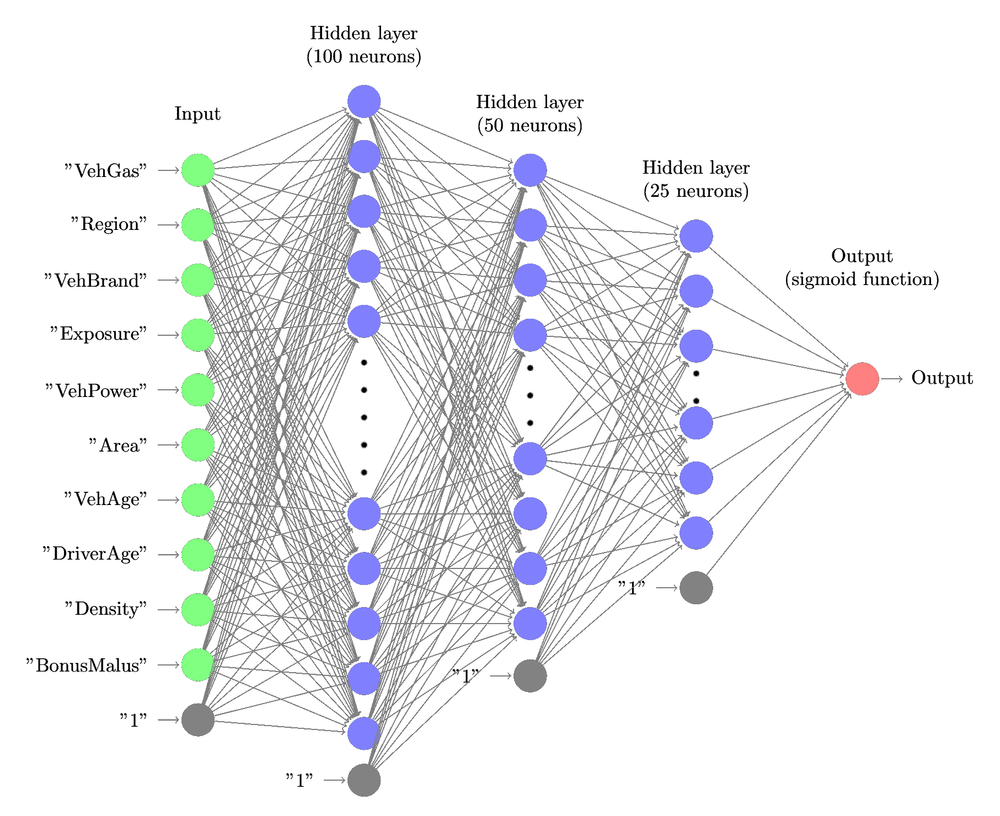
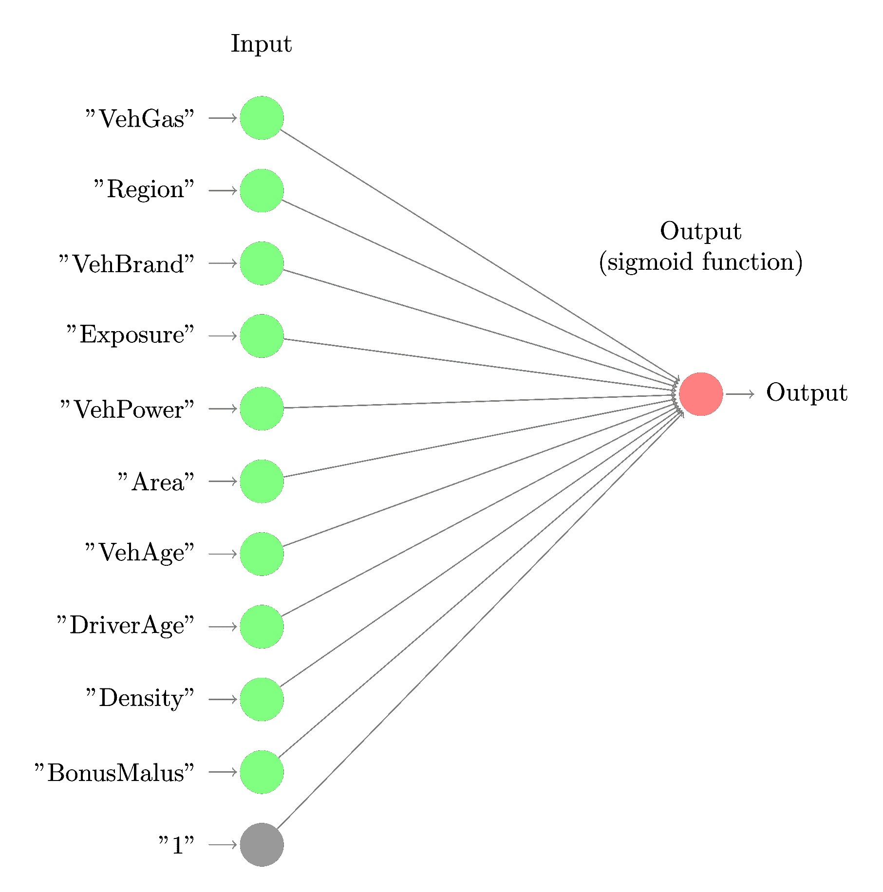
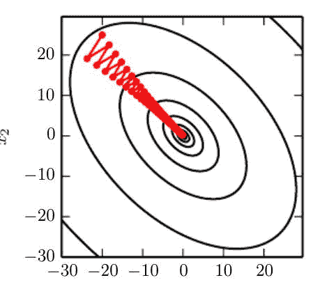
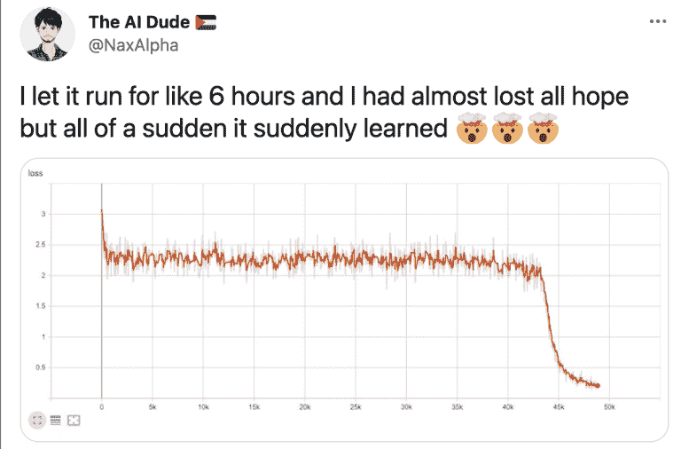

# 深度学习模型训练调试的 9 个步骤

> 原文：<https://web.archive.org/web/https://neptune.ai/blog/debugging-deep-learning-model-training>

第一个电脑 bug 实际上是一个 bug。1947 年，一只蛾子进入哈佛大学的一台计算机，导致计算中断。当工程师打开电脑机箱时，他们很快就发现了导致问题的错误。如今，一个 bug 爬进我们的计算机并扰乱计算流程是不太可能的。然而，原理是一样的。

软件 bug 是一个很小的、很难注意到的错误，它会潜入我们的软件项目并导致问题。不幸的是，与发现飞蛾不同，软件缺陷更加微妙，难以发现。在大多数情况下，软件开发人员通过在他们的代码中犯一些起初看起来无害的小错误来制造这些错误。这就是存在许多工具和方法来帮助程序员调试代码的原因。

在本文中，我将更深入地探讨调试深度学习模型的主题，并解释如何做到这一点。


*Figure 1\. The art of debugging | Source: [Unsplash](https://web.archive.org/web/20221207153901/https://unsplash.com/)*

## 什么是深度学习模型调试，为什么与软件调试不同？

在软件调试中，程序员遵循一组预定义的规则，这些规则允许他们找到问题的根源。在某种意义上，这类似于沿着汉瑟和葛丽特创造的白色鹅卵石小径。在软件调试中，艺术是在哪里准确地留下白色鹅卵石，以便可以容易地检测到错误。

然而，机器学习是不同的。我们不是简单地解决一个定义明确的任务，这个任务对于给定的输入有一个确定的输出。我们正在训练一个模型，该模型从给定的域中捕获数据结构，以便算法学习识别可用于预测未来示例行为的模式。该模型的实现可能没有任何软件缺陷，但是该模型可能有缺陷。例如，考虑一个使用不正确的预处理数据训练的模型。显然，这是一个严重的限制，模型需要重新训练。然而，从软件的角度来看，这个模型没有任何问题，它对于所提供的输入是正确的。

> 模型越强大，漏洞就越复杂。

以上对于深度学习来说尤其如此。人们可以认为，深度学习模型的主要优势是它们从数据中学习相关特征的能力。虽然这产生了强大的模型，但也是一个挑战。就像可解释性是深度学习的一个严重问题一样，调试可能特别具有挑战性。再次考虑预处理输入错误的例子。例如，我们通过使用有符号整数而不是无符号整数来转换输入图像的颜色。一个 CNN 模型将学习如何处理错误的输入，并且仍然可以获得很好的结果。但是当对新的、正确预处理的数据进行评估时，该算法将失败。

在本文中，我们专注于调试深度学习模型。可以说，神经网络产生了最先进的预测模型。同时，就设计、调试和维护而言，它们是最具挑战性的模型。我们将讨论这些挑战，并提出应对这些挑战的策略。

## 深度学习模型如何调试？

基于神经网络的模型的设计应该与其调试策略齐头并进。我们列出了在实施和评估深度学习模型时应该始终遵循的基本步骤。

### 1.调试实现

软件缺陷可能会被深度学习的力量隐藏起来。例如，我们在 Keras 中实现了以下卷积神经网络:

```py
inp = Input(shape=(28, 28, 1))
x = Conv2D(32, kernel_size=(3, 3), activation="relu")(inp)
x = MaxPooling2D(pool_size=(2, 2))(x)
x = Conv2D(32, kernel_size=(3, 3), activation="relu")(x)
x = MaxPooling2D(pool_size=(2, 2))(x)
…

```

对于第二个卷积层，我们可能会复制我们用于第一个卷积层的代码，即 x = Conv2D(32，kernel_size=(3，3)，activation="relu")(inp)，并忘记更新 x 的输入。该模型仍将工作，只是比我们实际想要实现的模型更简单。

**提示:** *创建测试，断言神经网络架构看起来像它应该的样子，检查层数、可训练参数的总数、输出的值域等等。理想情况下，将网络架构可视化，如图 2 所示。*



*Figure 2\. A neural network architecture | Source: Author*

### 2.检查输入

简单的错误，比如由于错误的索引而为我们的模型提供了一个特征子集，可能很难被检测到。深度学习模型仍然可以工作，即使提供的功能更少。更普遍的是，如果我们在预处理输入数据时出现系统性错误，深度学习的力量可能会成为一种诅咒。该模型将使自己适应不正确的输入，然后一旦我们修复了预处理错误，它将无法正常工作。

**提示:** *实现断言输入特性的格式和值范围的测试。*

### 3.仔细初始化网络参数

在开始训练之前，我们必须初始化模型的参数。最有可能的是，我们使用一个可用的平台 TensorFlow 或 PyTorch 来负责初始化。然而，由于参数是根据每个神经元的输入和输出的数量来选择的，因此在这个阶段仍然可能出现错误。以下是 Andrej Karpathy 关于初始化的建议。

> *寻找正确的随机性能损失。当你用小参数初始化时，确保你得到了你期望的损失。最好先单独检查数据丢失(所以把正则化强度设置为零)。例如，对于具有 Softmax 分类器的 CIFAR-10，我们预计初始损失为 2.302，因为我们预计每个类别的扩散概率为 0.1(因为有 10 个类别)，Softmax 损失是正确类别的负对数概率，因此:-ln(0.1) = 2.302。*

**提示:** *更一般地说，在训练产生预期结果之前，编写断言输入的测试。在上面的例子中，我们可以断言 k 个预测类的概率分布的熵接近于-k ln 1/k = k ln k*

### 4.从简单开始，使用基线

请注意，可以使用神经网络实现几个基本模型。例如，我们可以将线性回归实现为浅网络，以均方误差作为损失函数。类似地，逻辑回归可以通过浅网络实现，该浅网络具有用于输出的 sigmoid 激活函数和作为损失函数的二进制交叉熵。图 3 显示了通过从图 2 中的网络中移除隐藏层的逻辑回归模型:

其中 w [1] 到 w [n] 是可学习的参数。

此外，我们可以使用具有线性激活功能的自动编码器来模拟 PCA。因此，将我们对基本算法的神经网络实现的结果与我们在 scikit-learn 等平台上公开实现的结果进行比较是一个好主意。这将允许我们在早期捕捉不同种类的错误，例如权重初始化错误、学习率问题、错误的输入预处理等。



*Figure 3\. Logistic regression can be seen as a basic neural network | Source: Author*

**提示:** *编写测试，断言我们深度学习实现和一些现成算法的相同输入的结果是可比的。*

### 5.检查中间输出

我们可以将深度学习模型视为(非线性)函数的串联。连续层计算越来越复杂的特征。因此，我们可以追踪这些新特征。这对于深度卷积神经网络模型是特别直观的，其中每一层计算的特征可以被可视化。

类似于标准软件调试，我们设置断点，允许我们跟踪分配给程序中变量的中间值，我们也可以跟踪深度学习模型的中间输出。

特别的，我们可以使用一个[调试工具](/web/20221207153901/https://neptune.ai/blog/best-ml-experiment-tracking-tools)。

**提示** : *编写测试来检查每一层之后的输出值。此外，使用显示模型不同层的可视化工具。*

### 6.确保我们的模型设计合理

您应该特别注意:

*   **特征归一化。**重要的是输入特征具有相同的量级，因此对于不同尺度的特征，使用适当的归一化技术非常重要。常见的选择是标准化和最小-最大标准化:

1.  标准化

2.  最小-最大归一化

在上面，x 是输入向量，x [i] 是单独的坐标。

*   **防止渐变消失。对于某些损失函数，我们可能会遇到消失梯度的问题。每层的梯度乘以后续层的梯度。考虑 sigmoid 函数σ(z) = 1/(1+e ^(-z) )。对于大的或小的 z 值，梯度将接近于 0，因此当使用它作为激活函数时，我们应该小心。经验法则是仅对输出层使用 sigmoid，或者更一般的 softmax。**

**提示:** *检查每层输出的测试，应该检查中间层接近 0 的输出。*

*   **批量大小。**在训练神经网络时，标准做法是使用小批量方法。在这种情况下，我们使用数据的子样本来计算损失，并使用反向传播计算的梯度下降来更新网络参数。当然，小批量的确切大小取决于计算硬件约束和数据集大小。认为小批量会导致训练次数多，大批量会导致训练速度慢。

*   **批量归一化。**我们通过归一化每个输入特征来归一化每个层的输入。这里重要的是要记住，平均值和方差是为每个小批量计算的，但在推断过程中，它们是为整个训练数据集计算的。(我们可能想要评估单个示例的模型。)

**提示:** *编写测试来确保每一层的输入都被规范化。*

*   **在最优值附近振荡。**需要调整学习速率，以应对复杂函数的曲率变化。特别地，不同方向上的梯度可能具有很大不同的幅度，因此使用恒定的学习速率可能导致振荡。实践中一种流行的选择是 Adam 方法(自适应矩估计),其中在每次迭代之后通过使用过去梯度的指数递减平均值来调整学习速率。



*Figure 4\. Oscillation around the optimal value leads to slower convergens | Source: [Deep Learning](https://web.archive.org/web/20221207153901/http://www.deeplearningbook.org/)*

### 7.防止过度拟合

另一个需要记住的要点是，模型应该能够推广到新数据。神经网络的能力可能很容易导致过度拟合，以至于我们在输入实例中学习噪声。这里我们列出了一些常用的正则化技术。

*   **节点权重正则化。**标准做法是使用权重正则化，防止某些权重变得过大，从而使输入过拟合。标准选择是 L1 和 L2 正则化:我们在损失函数中添加一项λ||W||p，其中 W 是模型的可学习权重，而> 0 是正则化的强度。

*   **辍学。在训练期间，我们随机删除给定层中的一部分神经元。这可以防止神经元变得过度特定，并学习更可能是随机产物的非常特殊的模式。**

*   **提前停止。**在设计模型时，我们在尚未用于训练的数据子集上评估其性能，即所谓的*验证数据*。一旦验证的性能在一定数量的时期内没有改善，我们就停止训练模型。

*   **数据扩充。**为了迫使模型只学习数据中的重要模式，我们可以通过扩充数据集来生成一些人工数据。对于计算机视觉应用，我们可以旋转或镜像输入图像，或者改变颜色，以使生成的新数据看起来仍然像自然图像，参见图 5 中的示例..请记住，数据扩充对于某些领域来说可能具有挑战性，我们在应用它时应该小心，以免在训练数据中产生偏差。

*Figure 5\. Changing the visual effect of the original image such that we create new images and ensure the model will generalize | Source: [Unsplash](https://web.archive.org/web/20221207153901/https://unsplash.com/) (transformed by [Luna](https://web.archive.org/web/20221207153901/https://www10.lunapic.com/))*

### 8.记录和跟踪实验

神经网络使用不同种类的随机化来训练高质量的模型。根据不同的策略，内部层的权重由随机权重初始化，我们可以使用正则化的 dropout，或者在设计模型时使用交叉验证。

**提示:** *使用随机种子并存储随机选择。*

以上将使神经训练过程可重复，并将简化缺陷的检测。特别是，某些问题可能是由底层硬件的差异引起的，这可以通过再现完整的训练流来检测。

### 9.要耐心

永远记住，深度学习模型训练是一个缓慢且往往痛苦的过程。有时，我们可能会获得并非真正预期的结果，但这并不一定意味着我们的模型有问题。例如，考虑一下这个 [reddit 讨论](https://web.archive.org/web/20221207153901/https://www.reddit.com/r/MachineLearning/comments/ouiegi/d_sudden_drop_in_loss_after_hours_of_no/)已经获得了一些流行。安德烈·卡帕西报道:

> "*有一次，我在寒假期间不小心离开了模特培训，当我一月份回来时，这是最先进的技术*

等待几个小时直到我们的模型性能开始改善可能看起来违反直觉，并且不经常发生，事实上早期停止是基于这样的前提，即这并不真正可行。但这不一定表明我们的模型有问题。在高层次上，深度学习模型搜索关于给定目标的最佳参数集。并且相对于该目标的优化不是明确定义的任务，而是基于反向传播概念的启发式方法，该方法保证为所讨论的损失函数找到局部最优。然而，一个具有数千个参数的非凸函数很可能会有许多局部极小值。

因此，存在搜索可能收敛到函数参数空间的穷举搜索并且看起来没有进展的情况。在最近的一篇论文中，研究人员设计了一组学习问题，在找到最佳解决方案之前，这些问题的学习肯定需要很长时间。事实上，为了找到最优解，对训练数据的过度拟合是必要的。当然，这是一个人工设置，真实生活中的数据不太可能表现出相同的行为。但是我们应该记住，检测复杂的模式可能需要比我们的直觉告诉我们的更长的时间，并花一些时间来检查我们的模型是否不是这样。



*Figure 6\. A sudden drop in validation loss | Source: [Twitter](https://web.archive.org/web/20221207153901/https://twitter.com/NaxAlpha/status/1420700413125447683)*

**提示:** *在计划模型开发工作时，要给模型留出足够的训练时间，以确保我们不会经历损失函数的突然下降。*

## 结论

调试神经网络模型可能是一项具有挑战性的任务，可能需要对软件开发和机器学习技术的不同领域有深刻的理解和经验。因此，在设计神经网络解决方案之前，重要的是要有一个明确定义的策略来简化模型调试。制定如何处理潜在问题的计划不仅会增加模型的稳健性，还可能带来新的见解和更强大的模型。

### 资源

1.  [亚马逊 SageMaker 调试器](https://web.archive.org/web/20221207153901/https://docs.aws.amazon.com/sagemaker/latest/dg/train-debugger.html)——亚马逊 SageMaker 创建的模型调试器。
2.  微软的可视化调试工具 TensorWatch
3.  [tensor board](https://web.archive.org/web/20221207153901/https://www.tensorflow.org/tensorboard)–tensor flow 的可视化工具。
4.  [海王星进行实验跟踪](/web/20221207153901/https://neptune.ai/experiment-tracking)
5.  [deep kit](https://web.archive.org/web/20221207153901/https://deepkit.ai/)——测试和调试 ML 模型的开源平台。
6.  [TensorFlow 调试器](https://web.archive.org/web/20221207153901/https://research.google/pubs/pub45789/)–提供在运行时检查学习流程的功能。
7.  [调试机器学习模型](https://web.archive.org/web/20221207153901/https://debug-ml-iclr2019.github.io/)—ICLR 2019 研讨会