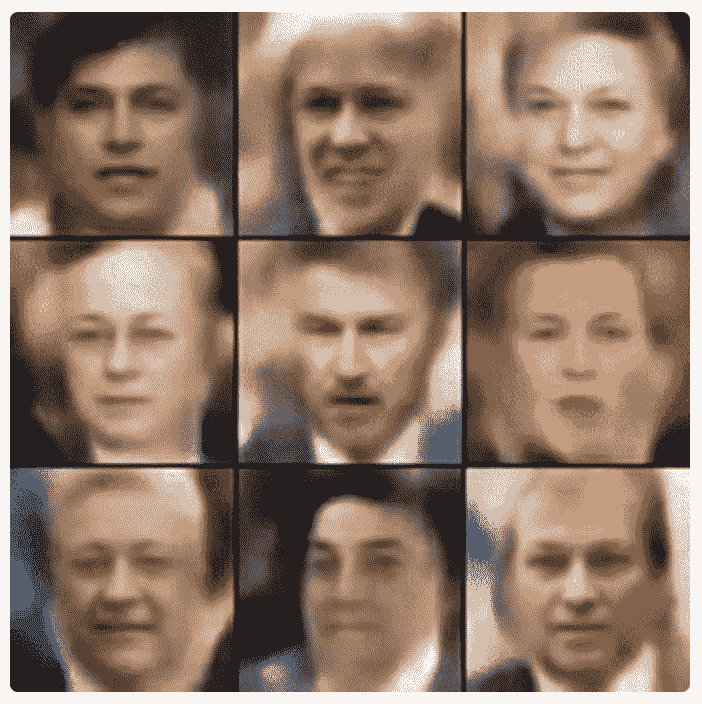
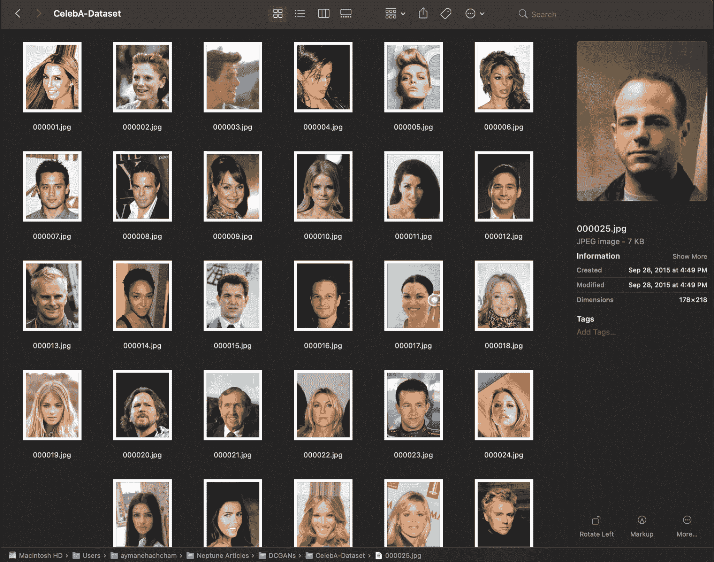
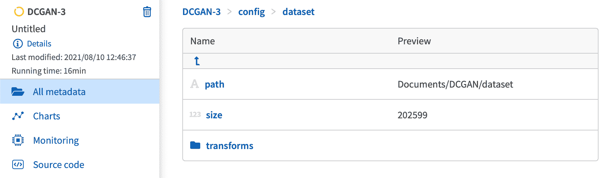
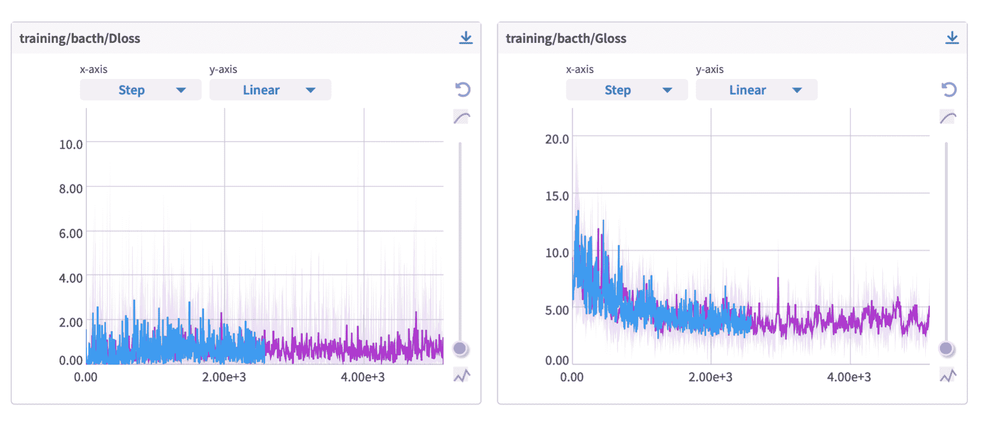
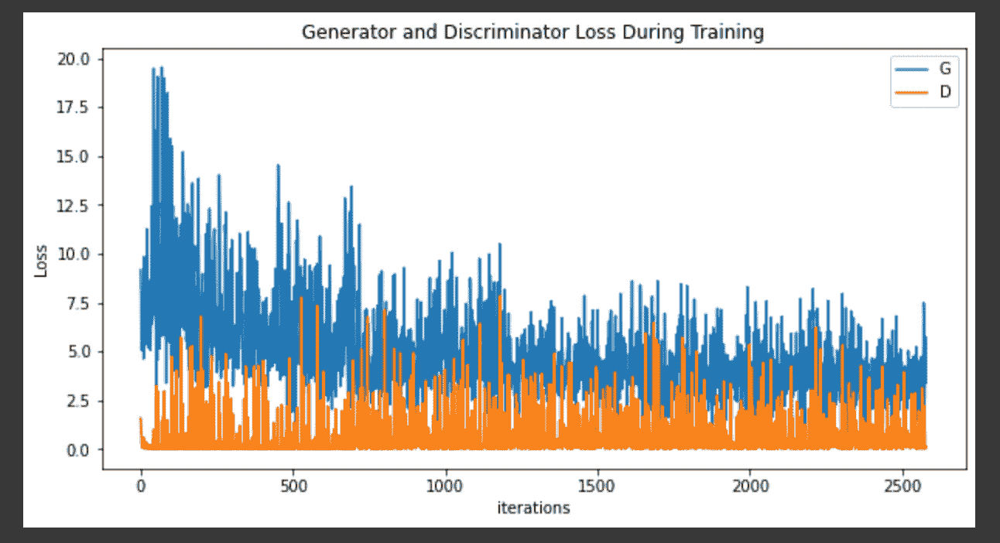
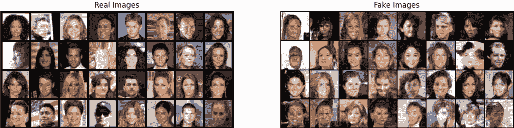

# 深度卷积生成对抗网络的训练和调试

> 原文：<https://web.archive.org/web/https://neptune.ai/blog/deep-convolutional-generative-adversarial-networks>

对抗网络(深度卷积生成对抗网络)最近已经成为深度学习实践者非常活跃的游乐场。对抗网络领域是由蒙特利尔大学的 Ian Goodfellow 和他的同事在他们的文章[生成对抗网络](https://web.archive.org/web/20221206093145/https://papers.nips.cc/paper/2014/file/5ca3e9b122f61f8f06494c97b1afccf3-Paper.pdf)中建立的。从那以后，原始模型的新变体不断被开发，研究也不断向前发展。

对抗网络的主要目标是估计对抗过程中的生成模型。这一过程包括以一种*对另一种*的方式同时训练两个模型:

*   **生成型**模型(通常表示为 ***G*** )被训练来捕捉数据分布并对数据模式进行归纳，以最终再现原始样本的完美副本；
*   **鉴别器**模型(表示为 ***D*** )试图识别来自生成模型的假样本。鉴别器估计数据是原始数据还是生成数据的概率。

培训过程针对两种模型的两个不同但互补的目标:

*   生成模型被训练成通过总是生成更好的假货来胜过鉴别器。
*   该鉴别器被训练来学习如何正确地将真实数据与假数据进行分类。

当生成器创建完美的赝品，并且鉴别器在猜测输出是真还是假时留有 50%的置信度时，达到总体平衡。

## 对抗网络的不同方法

自从 Ian Goodfellow 的论文为敌对网络的核心机制奠定了基础，其他几种实现生成模型的方法也被提出和测试。其中一些方法如下:

### 完全可见的信念网络

这些网络主要用于识别、聚类和生成图像、视频序列和动作捕捉。Geoff Hinton 在 2006 年[推出了它们。](https://web.archive.org/web/20221206093145/https://wiki.pathmind.com/deep-belief-network)

它们是一类显式密度模型。他们使用链式法则来分解向量的概率分布。其思想是将经典的向量分布分解成每个向量成员的乘积。

这个家族中最流行的模型是一个名为 [PixelCNN](https://web.archive.org/web/20221206093145/https://arxiv.org/pdf/1606.05328.pdf) 的自回归生成模型。

### 变分自动编码器

自动编码器将数据作为输入，并发现该数据的一些潜在状态表示。通常，输入向量被转换成编码向量，其中每个维度表示关于数据的一些学习属性。

变分自动编码器(VAE)提供了一种概率方法来描述潜在空间的具体观察。我们不是为数据的每个潜在状态属性建立一个专用的编码器，而是制定我们的编码器来描述所有潜在属性的概率分布。

下图显示了一个非常简单的示例，该示例说明了数据中潜在属性的单个离散值和概率分布之间的差异:

如您所见，最好用概率术语表示数据中的潜在属性，这样我们就可以评估整个范围的值。

亚历克·拉德福德使用一种可变自动编码器来生成虚构的名人面孔。



*Variational Autoencoders to generate fake faces | Credit: [Alec Radford](https://web.archive.org/web/20221206093145/https://www.youtube.com/watch?v=XNZIN7Jh3Sg)*

### 玻尔兹曼机器

玻尔兹曼机器是由对称连接的单元组成的网络，它们随机决定是否激活。他们有简单的学习算法，使他们能够在由二进制向量组成的数据集中发现有趣的特征。

它们也可以被看作是一个能量函数，调度特定状态的概率分布。

## 深度卷积 GANs

深度卷积对抗网络是一种特殊的 [GANs](/web/20221206093145/https://neptune.ai/blog/6-gan-architectures) 。生成器( ***G*** )和鉴别器( ***D*** )的网络架构中的主要层分别是卷积层和转置卷积层。

这些架构首次在论文[中介绍，深度卷积生成对抗网络](https://web.archive.org/web/20221206093145/https://arxiv.org/pdf/1511.06434.pdf)的无监督表示学习。作者拉德福德等人。艾尔。提出了一种特殊的实现，它需要一系列的步进卷积层、批量范数层和 LeakyReLU 激活。生成器主要由转置卷积层填充，相反，对于鉴别器，激活是简单的 ReLU 层。

鉴别器输入是一个 **3x64x64** 彩色图像，输出是一个标量概率，表示输入是来自真实数据分布还是完全由生成器编造的置信度。

另一方面，发生器的输入由从标准正态分布提取的潜在向量组成，相应的输出产生一个 **3x64x64** 图像。

让我们用一些数学符号来帮助澄清我们将在本文后面使用的术语。

鉴别器网络记为***【D(x)***，其输出 *x* 来自训练数据而非生成器的标量概率。

对于生成器， *z* 是从标准正态分布中采样的潜在空间向量。因此， ***G(z)*** 表示将潜在向量 z 映射到数据空间的函数。

如此， ***D(G(z))*** 表示发生器 ***G*** 的输出为实图像的概率。与我们之前解释的涉及一个模型对另一个模型的竞争一致，***【D(x)***试图最大化它正确分类真实和虚假的概率，这可以表示为***【log(D(x)】***和***【G(z)****相反，试图最小化虚假输出被鉴别器发现的概率，因此*

 *官方文件中描述的整体 [GAN 损失函数](/web/20221206093145/https://neptune.ai/blog/gan-loss-functions)如下所示:

如前所述，当: ***P [g] =P [数据]*** 以及鉴别器猜测输入是真还是假时，理论上的收敛导致了该函数的解。

现在您已经了解了一般概念，并且有了更好的基础，我们可以有目的地深入到更实际的问题中。

我们将建立一个基于名人头像训练的 DCGAN。我们将打破构建模型、初始化权重、训练和评估最终结果的步骤。接下来，[开始你的海王星实验](https://web.archive.org/web/20221206093145/https://docs.neptune.ai/getting-started/installation)和[连接你的 API 令牌](https://web.archive.org/web/20221206093145/https://docs.neptune.ai/getting-started/installation#authentication-neptune-api-token)到你的笔记本。

### 名人-人脸数据集

名人属性面孔是一个大规模的开源数据集，提供了各种各样的名人图像，用 40 种属性进行了注释。图像质量很好，数据集在实际图像上提出了各种各样的姿势变化和背景杂波，使其非常适合我们的任务。

*下载链接:[大规模名人面孔属性(CelebA)数据集](https://web.archive.org/web/20221206093145/https://drive.google.com/drive/folders/0B7EVK8r0v71pTUZsaXdaSnZBZzg?resourcekey=0-rJlzl934LzC-Xp28GeIBzQ)*

在笔记本根目录下创建一个目录，并将文件夹解压到其中。应该是这样的:



*  CelebA Dataset after extracting the folder*

现在，我们需要开始预处理部分。转换我们的数据并初始化 Torch DataLoader 类，该类将在训练过程中负责数据批次的洗牌和加载。

```py
import torchvision.datasets as datasets
def data_preprocessing(root_dir, batch_size=128, image-size=64, num_workers=2):
  data = datasets.ImageFolder(root=root_dir,
                              transform=transforms.Compose([
                                  transforms.Resize(image_size),
                                  transforms.CenterCrop(image_size),
                                  transforms.ToTensor(),
                                  transforms.Normalize((0.5, 0.5, 0.5), (0.5, 0.5, 0.5))
                              ]))

  dataloader = torch.utils.data.DataLoader(dataset, batch_size, shuffle=True, num_workers)
  return dataloader
```

将所有数据集细节记录到您的 Neptune 运行中，因此您可以跟踪您的数据集信息和相应的元数据。

按照这里的说明[建立自己的 Neptune 账户](https://web.archive.org/web/20221206093145/https://docs.neptune.ai/getting-started/installation)来追踪这些跑步记录。

开始你的实验:

```py
run = neptune.init(project='aymane.hachcham/DCGAN', api_token='ANONYMOUS') 
```

```py
run['config/dataset/path'] = 'Documents/DCGAN/dataset'
run['config/dataset/size'] = 202599
run['config/dataset/transforms'] = {
    'train': transforms.Compose([
                                  transforms.Resize(hparams['image_size']),
                                  transforms.CenterCrop(hparams['image_size']),
                                  transforms.ToTensor(),
                                  transforms.Normalize((0.5, 0.5, 0.5), (0.5, 0.5, 0.5))])
}

```



*The dataset config in your Neptune dashboard*

## 模型结构

一旦数据集准备好并被记录，我们就可以开始构建实际的模型了。正如我之前解释的那样，我们将尝试一步一步地解决这个问题。我们需要从权重初始化策略开始。

权重初始化是关于模型权重应该满足的特定标准。官方论文建议从均值=0、标准差=0.02 的正态分布中随机初始化权重。

我们将创建一个函数，将一个通用模型作为输入，并重新初始化 ***卷积*** 、 ***转置卷积*** 和 ***批量归一化*** 层，以完全满足这个标准。

***注*** *:你可以跟着教程看完整的 colab 笔记本，这里- >* [*Colab 笔记本*](https://web.archive.org/web/20221206093145/https://colab.research.google.com/drive/1gtByk_8aKTAlVQn0C7X3-2Gv8JKhT_-O?usp=sharing)

```py
def weights_init(model):
  model_classname = model.__class__.__name__

  if classname.find('Conv') != -1:
        nn.init.normal_(m.weight.data, 0.0, 0.02)

  elif classname.find('BatchNorm') != -1:
        nn.init.normal_(m.weight.data, 0.0, 0.02)
        nn.init.constant_(m.bias.data, 0)
```

由于模型参数将被生成器或鉴别器取代，因此它们肯定会有 Conv 和 BatchNorm 层。因此，该函数为这些层中的每一层设置一个随机权重初始化，平均值=0.0，标准偏差=0.02。

### 发电机

生成器 G 的作用是将潜在向量 Z 映射到数据空间。在我们的例子中，这转化为最终创建与数据中的原始图像具有相同大小和尺寸的 RGB 图像。这是通过堆叠一系列卷积、转置卷积和批处理规范层来实现的，这些层协调工作以产生最终看起来像人脸的 3x64x64 输出。

值得注意的是，在转置卷积之后添加的批范数层在很大程度上有助于训练期间的梯度流，因此它们构成了整体训练性能的重要部分。

```py
class Generator(nn.Module):
    def __init__(self):
        super(Generator, self).__init__()
        self.main = nn.Sequential(

            nn.ConvTranspose2d(hparams["size_latent_z_vector"],
                               hparams["size_feature_maps_generator"] * 8, 4, 1, 0, bias=False),
            nn.BatchNorm2d(hparams["size_feature_maps_generator"] * 8),
            nn.ReLU(True),

            nn.ConvTranspose2d(hparams["size_feature_maps_generator"] * 8,
                               hparams["size_feature_maps_generator"] * 4, 4, 2, 1, bias=False),
            nn.BatchNorm2d(hparams["size_feature_maps_generator"] * 4),
            nn.ReLU(True),

            nn.ConvTranspose2d( hparams["size_feature_maps_generator"] * 4,
                               hparams["size_feature_maps_generator"] * 2, 4, 2, 1, bias=False),
            nn.BatchNorm2d(hparams["size_feature_maps_generator"] * 2),
            nn.ReLU(True),

            nn.ConvTranspose2d(hparams["size_feature_maps_generator"] * 2,
                               hparams["size_feature_maps_generator"], 4, 2, 1, bias=False),
            nn.BatchNorm2d(hparams["size_feature_maps_generator"]),
            nn.ReLU(True),

            nn.ConvTranspose2d(hparams["size_feature_maps_generator"],
                               hparams["num_channels"], 4, 2, 1, bias=False),
            nn.Tanh()

        )

    def forward(self, input):
        return self.main(input)
```

生成器的特征映射会传播到所有层。在输入部分中设置潜在向量的大小和通道的数量，以影响整个架构。

让我们实例化生成器并应用权重初始化:

```py
model_name = "Generator"
device = "cuda"
generator = Generator().to(device)

generator.apply(weights_init)
```

现在我们可以打印总体架构并将其保存到 Neptune artifacts 文件夹:

```py
with open(f"./{model_name}_arch.txt", "w") as f:
  f.write(str(generator))

run[f"io_files/artifacts/{model_name}_arch"].upload(f"./{model_name}_arch.txt")
```

### 鉴别器

鉴别器**图像经过一系列 Conv2、BatchNorm 和 LeakyReLU 层处理，最终概率由 Sigmoid 评估。**

官方论文声称，为了下采样，使用跨卷积比池化更好，因为它有助于网络学习自己的池化功能。此外，LeakyReLU 激活促进健康的梯度流。查看这篇文章，了解更多关于死亡 ReLU 问题的信息，以及泄漏的 ReLU 激活如何帮助解决这个问题。

```py
class Discriminator(nn.Module):
    def __init__(self):
        super(Discriminator, self).__init__()
        self.main = nn.Sequential(

            nn.Conv2d(hparams["num_channels"],
                      hparams["size_feature_maps_discriminator"], 4, 2, 1, bias=False),
            nn.LeakyReLU(0.2, inplace=True),

            nn.Conv2d(hparams["size_feature_maps_discriminator"],
                      hparams["size_feature_maps_discriminator"] * 2, 4, 2, 1, bias=False),
            nn.BatchNorm2d(hparams["size_feature_maps_discriminator"] * 2),
            nn.LeakyReLU(0.2, inplace=True),

            nn.Conv2d(hparams["size_feature_maps_discriminator"] * 2,
                      hparams["size_feature_maps_discriminator"] * 4, 4, 2, 1, bias=False),
            nn.BatchNorm2d(hparams["size_feature_maps_discriminator"] * 4),
            nn.LeakyReLU(0.2, inplace=True),

            nn.Conv2d(hparams["size_feature_maps_discriminator"] * 4,
                      hparams["size_feature_maps_discriminator"] * 8, 4, 2, 1, bias=False),
            nn.BatchNorm2d(hparams["size_feature_maps_discriminator"] * 8),
            nn.LeakyReLU(0.2, inplace=True),

            nn.Conv2d(hparams["size_feature_maps_discriminator"] * 8, 1, 4, 1, 0, bias=False),
            nn.Sigmoid()
        )

    def forward(self, input):
        return self.main(input)
```

接下来，让我们初始化鉴别器，应用权重初始化，并将架构记录到工件文件夹中:

```py
disc_name = "Discriminator"
device = "cuda"
discriminator = Discriminator().to(device)

generator.apply(weights_init)

with open(f"./{disc_name}_arch.txt", "w") as f:
  f.write(str(discriminator))

run[f"io_files/artifacts/{disc_name}_arch"].upload(f"./{disc_name}_arch.txt")
```

现在，我们已经将两种模型架构登录到我们的仪表板中:

## 模型训练和调试

在实际开始训练过程之前，我们将花一些时间来讨论我们将使用的损失函数和优化器。

正如该论文所推荐的，使用的优选损失函数是 Pytorch 中定义的**二元交叉熵**或[损失](https://web.archive.org/web/20221206093145/https://pytorch.org/docs/stable/generated/torch.nn.BCELoss.html#torch.nn.BCELoss)。BCELoss 的方便之处在于它提供了目标函数中两个对数分量的计算，即 ***logD(x)*** 和 ***log(1-D(G(z)))** 。*

原纸中使用的另一个约定俗成的是真假标签。在计算 ***D*** 和 ***G*** 损失时使用。
最后，我们为 ***G*** 和 ***D*** 设置了两个不同的优化器。根据论文中的规范，两个优化器都是学习率为 0.0002 且β1 = 0.5 的 Adam，并且还生成从高斯分布导出的固定批次的潜在向量。

```py
criterion = nn.BCELoss()

fixed_noise = torch.randn(64, nz, 1, 1, device=device)

real_label = 1.
fake_label = 0.

optimizerD = optim.Adam(netD.parameters(), lr=lr, betas=(beta1, 0.999))
optimizerG = optim.Adam(netG.parameters(), lr=lr, betas=(beta1, 0.999))
```

### 培训阶段

现在我们已经定义了所有的部分，我们可以开始训练了。为了进行训练，我们需要一丝不苟地遵循 Goodfellow 论文中提出的算法。具体来说，我们将为真实和虚假图像构建不同的小批量，同时调整生成器的目标函数以最大化 ***logD(G(z))。***

训练循环由两个分段部分组成。第一部分处理鉴别器，第二部分处理发生器。

#### 甄别训练

如官方文件所述，训练鉴别器的目标是“*通过提升其随机梯度*来更新鉴别器”。在实践中，我们想要实现的是最大化正确分类给定输入为真实或虚假的概率。因此，我们需要从数据集构建一批真实样本，向前传递通过 ***D*** ，计算损耗，然后向后传递计算梯度。然后，我们对这批假样本重复同样的模式。

#### 发电机培训

我们想从生成器中得到什么非常清楚，我们的目标是训练它，让它学会生成更好的假货。在他的论文中，Goodfellow 坚持不提供足够的梯度，尤其是在学习过程的早期。为了实际完成以下内容，我们将对来自鉴别器训练部分的发生器输出进行分类，使用真实标签批次计算发生器损耗，计算反向传递中的梯度，最后用相应的优化器步骤更新***【G】***的参数。

**创建数据加载器:**

dataloader =数据预处理(数据目录)

**建立训练循环:**

*   **鉴别器训练部分:**

```py

        discriminator.zero_grad()

        real_cpu = data[0].to(device)
        b_size = real_cpu.size(0)
        label = torch.full((b_size,), real_label, dtype=torch.float, device=device)

        output = discriminator(real_cpu).view(-1)

        errD_real = criterion(output, label)

        errD_real.backward()
        D_x = output.mean().item()

        noise = torch.randn(b_size, hparams["size_latent_z_vector"], 1, 1, device=device)

        fake = generator(noise)
        label.fill_(fake_label)

        output = discriminator(fake.detach()).view(-1)

        errD_fake = criterion(output, label)

        errD_fake.backward()
        D_G_z1 = output.mean().item()

        errD = errD_real + errD_fake

        optimizerD.step()
```

```py
        generator.zero_grad()
        label.fill_(real_label)  

        output = discriminator(fake).view(-1)

        errG = criterion(output, label)

        errG.backward()
        D_G_z2 = output.mean().item()

        optimizerG.step()
```

*   **调用训练循环内的两部分:**

```py
img_list = [] 
G_losses = [] 
D_losses = [] 
iters = 0

for epoch in range(hparams["num_epochs"]):

    for i, data in enumerate(dataloader, 0):
    	discriminator_training()
	generator_training()

	print('[%d/%d][%d/%d]tLoss_D: %.4ftLoss_G: %.4ftD(x): %.4ftD(G(z)): %.4f / %.4f'
              % (epoch, hparams["num_epochs"], i, len(training_data),
                  errD.item(), errG.item(), D_x, D_G_z1, D_G_z2))

        G_losses.append(errG.item())
        D_losses.append(errD.item())

        run["training/batch/Gloss"].log(errG.item())
        run["training/batch/Dloss"].log(errD.item())

        if (iters % 500 == 0) or ((epoch == hparams["num_epochs"]-1) and (i == len(training_data)-1)):
            with torch.no_grad():
                fake = generator(fixed_noise).detach().cpu()
            img_list.append(vutils.make_grid(fake, padding=2, normalize=True))

        iters += 1
```

**检查 G 和 D 损耗:**

我们可以清楚地观察到两个损失减少并最终稳定下来。我们可以通过改变纪元编号来进行多次训练，但变化仍然不大。当我们增加历元数时，我们可以注意到损耗略有改善，这可以从下面的比较中看出:



*Left chart: D and G losses with 10 epochs, Right chart: D and G losses with 5 epochs | [See in Neptune](https://web.archive.org/web/20221206093145/https://app.neptune.ai/aymane.hachcham/DCGAN/experiments?compare=KwGgTEA&split=cmp&dash=charts&viewId=standard-view)*

我们还可以看到发生器和鉴频器损耗相互重叠:



*D and G losses overlapping*

### 生成器级数的最终结果

最后，我们可以看看生成器并排创建的一些真实和虚假的图像。



*Fake images versus real images*

## 总结想法

我们已经成功地从头开始构建了一个深度卷积 GAN，解释了所有不同的部件和组件，并在人脸数据集上进行训练。模型的质量总是可以通过增加训练数据和明智地调整超参数来提高。

生成对抗性神经网络是深度学习进化的下一步，尽管它们在几个应用领域都有很大的前景，但在硬件和框架上都存在重大挑战。然而，GANs 有着广阔的应用前景，如图像到图像的翻译、语义图像到照片的翻译、3D 对象生成、自动驾驶、人体姿态生成等等。

和往常一样，如果你想继续了解这个话题，这里有一些好的资源:

如有任何问题，请随时给我发电子邮件:*hachcham.ayman@gmail.com*。

不要犹豫去查一下谷歌 Colab 笔记本:[带 DCGAN 的假脸](https://web.archive.org/web/20221206093145/https://colab.research.google.com/drive/1gtByk_8aKTAlVQn0C7X3-2Gv8JKhT_-O?usp=sharing)*